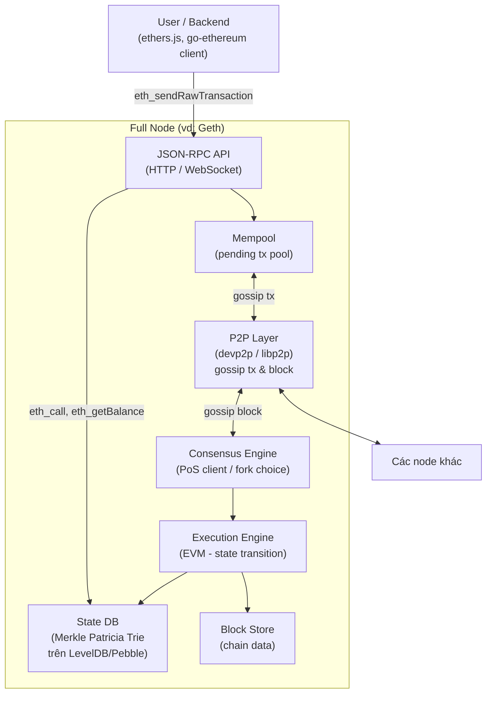
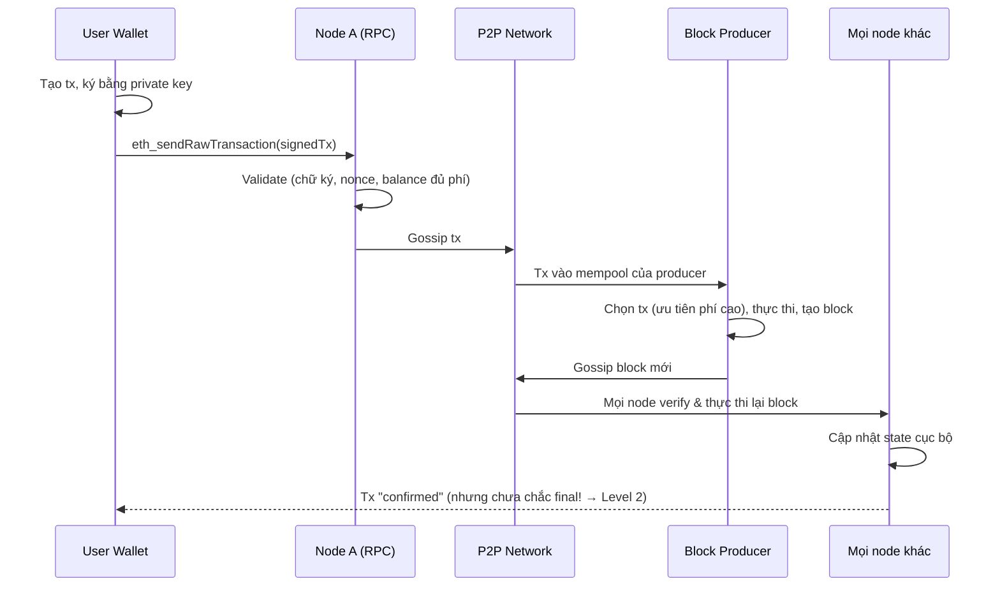

+++
title = "Level 1 – Blockchain Fundamentals"
date = "2026-07-19T07:10:00+07:00"
draft = false
tags = ["backend", "blockchain", "web3"]
series = ["Blockchain cho Backend Engineer"]
+++

> **Đối tượng:** Backend Engineer chưa từng làm Blockchain.
> **Mục tiêu:** Hiểu Blockchain là gì từ góc nhìn Distributed Systems, không phải từ góc nhìn Crypto.

---

## 1. Problem Statement: Bắt đầu từ bài toán nghiệp vụ

Hãy quên Blockchain đi. Bắt đầu từ một bài toán Backend quen thuộc.

Bạn xây dựng hệ thống chuyển tiền giữa hai ngân hàng A và B. Mỗi ngân hàng có database riêng (PostgreSQL chẳng hạn). Khi khách hàng của A chuyển 100$ cho khách hàng của B, cả hai database phải đồng thời:

- Trừ 100$ ở A.
- Cộng 100$ ở B.

Với một database duy nhất, đây là bài toán tầm thường: một transaction ACID là xong.

```sql
BEGIN;
UPDATE accounts SET balance = balance - 100 WHERE id = 'alice';
UPDATE accounts SET balance = balance + 100 WHERE id = 'bob';
COMMIT;
```

Nhưng ở đây có **hai tổ chức độc lập**, mỗi bên kiểm soát database của mình. Vấn đề thật sự không phải là kỹ thuật — mà là **niềm tin (trust)**:

- Ngân hàng A nói "tôi đã trừ tiền". Ngân hàng B có tin không?
- Nếu A âm thầm sửa lại record của mình thì sao?
- Nếu hai bên có số liệu lệch nhau, ai đúng?

Trong thực tế, ngành tài chính giải quyết bằng **bên trung gian tin cậy** (trusted third party): clearing house, SWIFT, ngân hàng trung ương, và các quy trình **đối soát (reconciliation)** chạy hàng đêm. Mô hình này hoạt động, nhưng có chi phí:

- Trung gian là **single point of trust** và single point of failure.
- Đối soát chậm (T+1, T+2 ngày).
- Trung gian có quyền kiểm duyệt, đóng băng, đảo ngược giao dịch.
- Phí trung gian.

**Câu hỏi cốt lõi mà Blockchain trả lời:** *Làm sao để nhiều bên không tin nhau cùng duy trì một cơ sở dữ liệu chung, mà không cần bất kỳ bên trung gian nào?*

Đây là bài toán **Distributed Trust**, không phải bài toán lưu trữ.

---

## 2. Vì sao Traditional Database không giải quyết được

Backend Engineer sẽ hỏi ngay: sao không dùng một database chung? Hoặc replication?

| Giải pháp truyền thống | Vì sao thất bại với bài toán distributed trust |
|---|---|
| Một database chung do một bên vận hành | Bên vận hành có toàn quyền sửa dữ liệu → quay lại bài toán trust |
| Master-Replica replication | Master là single writer, các replica phải tin master vô điều kiện |
| Multi-master (Galera, CockroachDB...) | Giải quyết consensus giữa các node **cùng một tổ chức, tin nhau**. Node độc hại (Byzantine) sẽ phá vỡ toàn bộ giao thức |
| Distributed consensus (Raft, Paxos) | Chỉ chịu được **crash fault** (node chết), không chịu được **Byzantine fault** (node nói dối) |

Điểm mấu chốt: **Raft/Paxos giả định các node trung thực, chỉ có thể chết. Blockchain giả định các node có thể chủ động gian lận.** Đây là hai lớp bài toán khác nhau về độ khó.

```
Trust model tăng dần độ khắc nghiệt:

Single DB          →  tin tuyệt đối 1 process
Raft/Paxos cluster →  tin rằng node không nói dối (crash fault tolerance)
Blockchain         →  KHÔNG tin bất kỳ node nào (Byzantine fault tolerance)
```

Blockchain trả giá rất đắt (hiệu năng, độ phức tạp, chi phí) để đạt được mức trust model khắc nghiệt nhất. **Nếu bài toán của bạn không cần mức đó, Blockchain là lựa chọn sai** — điều này sẽ được nhắc lại xuyên suốt tài liệu.

---

## 3. First Principles: Blockchain là gì (định nghĩa cho Backend Engineer)

> **Blockchain = một replicated state machine, trong đó thứ tự các thao tác được quyết định bởi consensus giữa các node không tin nhau, và tính toàn vẹn dữ liệu được đảm bảo bằng cryptography thay vì bằng quyền truy cập.**

Tách định nghĩa này ra:

1. **Replicated state machine** — mọi node giữ một bản sao đầy đủ của state (số dư, dữ liệu contract...). Nếu mọi node bắt đầu từ cùng genesis state và áp dụng cùng một dãy transaction theo cùng thứ tự, chúng sẽ có state giống hệt nhau. Đây chính là nguyên lý đằng sau Raft, Kafka, event sourcing — không có gì huyền bí.
2. **Consensus giữa các node không tin nhau** — vấn đề duy nhất cần giải là: *thứ tự transaction là gì?* Ai được quyền append block tiếp theo? (Level 2 xử lý câu hỏi này.)
3. **Cryptography thay cho access control** — trong database truyền thống, dữ liệu được bảo vệ bằng quyền (GRANT/REVOKE, firewall). Trong Blockchain, ai cũng đọc/ghi được, nhưng chữ ký số và hash khiến việc giả mạo *bất khả thi về mặt toán học* thay vì *bị cấm về mặt quyền hạn*.

So sánh trực tiếp với hệ quen thuộc:

| | Kafka + Consumer | Blockchain |
|---|---|---|
| Log bất biến, append-only | ✅ topic | ✅ chain of blocks |
| State = fold(log) | ✅ consumer materialized view | ✅ state trie |
| Ai quyết định thứ tự message | Broker (tin cậy) | Consensus (không cần tin ai) |
| Ai được ghi | Producer có ACL | Bất kỳ ai có private key và trả phí |
| Chống sửa lịch sử | Không (admin sửa được) | Có (hash chain + consensus) |

Nói cách khác: **Blockchain là một event log phân tán mà không ai làm chủ.** Nếu bạn hiểu event sourcing, bạn đã hiểu 60% Blockchain.

---

## 4. Các khối xây dựng cryptographic

### 4.1. Hash Function

**Problem statement:** Làm sao phát hiện dữ liệu bị sửa mà không cần so sánh toàn bộ dữ liệu?

Hash function (SHA-256, Keccak-256) nén dữ liệu bất kỳ thành 32 bytes với các tính chất:

- **Deterministic:** cùng input → cùng output.
- **One-way:** không thể suy ngược input từ output.
- **Collision-resistant:** không thể tìm 2 input khác nhau cho cùng output.
- **Avalanche:** đổi 1 bit input → output thay đổi hoàn toàn.

Backend Engineer đã dùng hash hằng ngày: checksum, ETag, content-addressable storage (Git!), password hashing. Blockchain dùng hash cho việc **định danh nội dung**: block hash, transaction hash chính là "con trỏ theo nội dung" (content-addressed pointer). Sửa nội dung → hash đổi → con trỏ gãy → gian lận bị phát hiện.

```go
// Golang: hash chain — nền tảng của "block chain"
package main

import (
	"crypto/sha256"
	"encoding/hex"
	"fmt"
)

type Block struct {
	PrevHash string // con trỏ tới block trước, theo NỘI DUNG chứ không theo địa chỉ
	Data     string
}

func (b Block) Hash() string {
	h := sha256.Sum256([]byte(b.PrevHash + b.Data))
	return hex.EncodeToString(h[:])
}

func main() {
	genesis := Block{PrevHash: "", Data: "genesis"}
	b1 := Block{PrevHash: genesis.Hash(), Data: "alice->bob:100"}
	b2 := Block{PrevHash: b1.Hash(), Data: "bob->carol:50"}

	fmt.Println(b2.Hash())
	// Nếu sửa genesis.Data, hash của genesis đổi,
	// => b1.PrevHash không còn khớp => b1.Hash() đổi => b2 gãy.
	// Muốn giả mạo 1 block cũ, phải viết lại TOÀN BỘ chain sau nó.
}
```

Đây là insight quan trọng nhất của cấu trúc "chain": **hash chain biến việc sửa lịch sử từ "một lệnh UPDATE" thành "viết lại toàn bộ lịch sử từ điểm sửa"** — và Level 2 sẽ cho thấy consensus khiến việc viết lại đó tốn kém đến mức bất khả thi.

### 4.2. Public Key Cryptography & Digital Signature

**Problem statement:** Không có server auth trung tâm, làm sao biết một transaction thật sự do chủ tài khoản tạo ra?

Trong hệ truyền thống: user gửi password → server so với DB → cấp session/JWT. Có một **bên xác thực trung tâm**.

Trong Blockchain: không có server nào cả. Thay vào đó:

- User tự sinh cặp khóa `(privateKey, publicKey)` — ECDSA trên curve secp256k1 (Bitcoin, Ethereum) hoặc Ed25519 (Solana).
- **Address** = dẫn xuất từ public key (Ethereum: 20 bytes cuối của `keccak256(publicKey)`).
- Ký transaction bằng private key. Bất kỳ ai cũng **verify** được chữ ký bằng public key, mà không cần biết private key.

```
Traditional Auth                      Blockchain Auth
─────────────────                     ─────────────────
user ──password──► Auth Server        user ──signed tx──► bất kỳ node nào
        so sánh DB                            verify signature (thuần toán học)
        cấp session                           không cần state, không cần server
```

Hệ quả kiến trúc quan trọng:

- **Không có "quên mật khẩu".** Mất private key = mất tài khoản vĩnh viễn. Không ai reset được. Đây là lý do Key Management (Level 5, Security) là bài toán sống còn.
- **Xác thực là stateless và phi tập trung.** Bất kỳ node nào cũng verify được, không cần gọi đi đâu.
- **Tài khoản không cần "đăng ký".** Một address tồn tại về mặt toán học trước cả khi ai đó dùng nó.

```javascript
// Node.js (ethers v6): ký và verify — không cần chạm vào blockchain
import { Wallet, verifyMessage } from "ethers";

const wallet = Wallet.createRandom();          // sinh keypair cục bộ, offline
const msg = "login-challenge-8f3a-1721433600"; // nonce chống replay
const signature = await wallet.signMessage(msg);

// Server-side: khôi phục address từ chữ ký, KHÔNG cần lưu password
const recovered = verifyMessage(msg, signature);
console.log(recovered === wallet.address);      // true
```

Đoạn code trên chính là nền tảng của **Wallet Authentication** (Sign-In with Ethereum) — Level 7 sẽ xây dựng đầy đủ.

### 4.3. Merkle Tree

**Problem statement:** Một block chứa hàng nghìn transaction. Làm sao chứng minh "transaction X nằm trong block Y" mà không phải gửi toàn bộ block?

Merkle Tree hash từng cặp lá lên tới một **Merkle Root** duy nhất (32 bytes) đặt trong block header.

```
                 Root = H(H12 || H34)
                /                    \
        H12 = H(H1||H2)        H34 = H(H3||H4)
        /         \             /         \
     H1=H(tx1)  H2=H(tx2)   H3=H(tx3)  H4=H(tx4)
```

Để chứng minh `tx3` nằm trong block, chỉ cần cung cấp **Merkle Proof**: `[H4, H12]` — O(log n) hash thay vì n transaction. Người verify tính `H(H(H(tx3)||H4) ... )` và so với Root trong header.

Ứng dụng thực tế:

- **Light client** (ví mobile) không tải toàn bộ chain, chỉ tải header + proof.
- **Rollup** (Level 6) commit Merkle Root của state lên Layer 1.
- Backend quen thuộc: Cassandra/DynamoDB dùng Merkle Tree cho anti-entropy repair; Git dùng cấu trúc tương tự.

Ethereum dùng biến thể **Merkle Patricia Trie (MPT)** — kết hợp Merkle Tree với radix trie để vừa chứng minh được membership, vừa tra cứu key-value hiệu quả, vừa cho phép hai state chỉ khác một ít key chia sẻ phần lớn cấu trúc (structural sharing, giống persistent data structure trong FP).

```go
// Golang: Merkle root tối giản
func merkleRoot(leaves [][]byte) []byte {
	if len(leaves) == 0 {
		return nil
	}
	level := make([][]byte, len(leaves))
	for i, leaf := range leaves {
		h := sha256.Sum256(leaf)
		level[i] = h[:]
	}
	for len(level) > 1 {
		if len(level)%2 == 1 { // lẻ thì nhân đôi phần tử cuối
			level = append(level, level[len(level)-1])
		}
		next := make([][]byte, 0, len(level)/2)
		for i := 0; i < len(level); i += 2 {
			h := sha256.Sum256(append(level[i], level[i+1]...))
			next = append(next, h[:])
		}
		level = next
	}
	return level[0]
}
```

---

## 5. Các khái niệm cốt lõi

### 5.1. Transaction

Transaction là **đơn vị thay đổi state nhỏ nhất**, tương đương một "command" trong event sourcing. Một transaction Ethereum gồm:

```
{
  nonce:    5,           // số thứ tự tx của account này (chống replay, ép thứ tự)
  from:     0xAlice...,  // suy ra từ chữ ký, không gửi kèm
  to:       0xBob...,    // address nhận, hoặc contract, hoặc null (deploy contract)
  value:    1000000000000000000,  // 1 ETH, đơn vị wei (10^18)
  data:     0x...,       // payload gọi contract (rỗng nếu chuyển tiền thuần)
  gasLimit: 21000,       // trần chi phí tính toán
  maxFeePerGas / maxPriorityFeePerGas,  // giá gas (EIP-1559)
  signature: (v, r, s)   // chữ ký ECDSA
}
```

Điểm khác biệt với API request truyền thống:

- Transaction là **bất biến sau khi ký** — sửa 1 byte là chữ ký vô hiệu.
- **Nonce** là số tuần tự per-account: tx nonce 5 chỉ được xử lý sau nonce 4. Đây là cơ chế chống replay và ép ordering, và cũng là nguồn gốc của hàng loạt bug production (Level 7: Nonce Management).
- Transaction **phải trả phí** (gas) kể cả khi thất bại — vì node đã tốn tài nguyên thực thi.

### 5.2. Block

Block là **một batch transaction đã được sắp thứ tự + metadata**, gồm:

```
BlockHeader:
  parentHash      ── hash chain (mục 4.1)
  stateRoot       ── Merkle root của TOÀN BỘ state sau khi thực thi block này
  transactionsRoot── Merkle root của các tx trong block
  receiptsRoot    ── Merkle root của kết quả thực thi (logs, status)
  number, timestamp, gasUsed, gasLimit ...
Body:
  transactions[]
```

`stateRoot` là ý tưởng rất mạnh: **32 bytes cam kết (commit) toàn bộ trạng thái của hệ thống**. Hai node chỉ cần so 32 bytes để biết state có giống nhau tuyệt đối không — thay vì diff hàng trăm GB dữ liệu. Hãy so với việc kiểm tra hai bản sao PostgreSQL có đồng bộ không: gần như bất khả thi nếu không có checksum toàn cục.

### 5.3. State và State Machine

```
State(n+1) = STF(State(n), Block(n+1))
```

`STF` (State Transition Function) là hàm **thuần khiết và tất định (deterministic)**: cùng state cũ + cùng block → mọi node trên thế giới tính ra cùng state mới. Đây là lý do smart contract không được phép gọi API ngoài, không được dùng random thật, không được đọc đồng hồ hệ thống — bất kỳ nguồn indeterminism nào sẽ khiến các node tính ra state khác nhau và mạng tan vỡ.

Từ góc nhìn Backend:

- **Chain = write-ahead log.** **State = materialized view.**
- Node có thể xóa state và **replay** toàn bộ chain để tái tạo — giống rebuild read model trong event sourcing.
- State của Ethereum lưu trong Merkle Patricia Trie, persist xuống LevelDB/PebbleDB (key-value store) — không phải relational DB, vì access pattern là hash → node.

### 5.4. Account Model vs UTXO Model

Hai cách biểu diễn "số dư" — trade-off kinh điển đầu tiên:

**UTXO (Bitcoin):** Không có "số dư". Chỉ có tập các **Unspent Transaction Output** — như ví tiền chứa các tờ tiền mệnh giá lẻ. Transaction tiêu (spend) một số UTXO và tạo UTXO mới.

```
Alice có UTXO: [4 BTC, 3 BTC]. Muốn gửi Bob 5 BTC:
Input:  UTXO(4) + UTXO(3) = 7
Output: UTXO(5 → Bob), UTXO(1.9 → Alice, tiền thừa), 0.1 phí
Mỗi UTXO chỉ tiêu được MỘT lần → double-spend check = existence check
```

**Account Model (Ethereum):** Mapping `address → {balance, nonce, code, storage}` — giống bảng `accounts` trong ngân hàng.

| Tiêu chí | UTXO | Account |
|---|---|---|
| Kiểm tra double-spend | Tự nhiên (UTXO tồn tại hay không) | Cần nonce per-account |
| Xử lý song song | Dễ (các UTXO độc lập nhau) | Khó (tx cùng account/contract đụng state chung) |
| Smart contract | Rất khó (stateless) | Tự nhiên (contract = account có code + storage) |
| Privacy | Tốt hơn (mỗi lần dùng address mới) | Kém hơn (address tái sử dụng) |
| Độ phức tạp cho ví/backend | Cao (chọn UTXO, tính tiền thừa) | Thấp (đọc 1 số dư) |
| Kích thước state | Tập UTXO gọn | State phình theo contract storage |

**Bài học:** Bitcoin chọn UTXO vì mục tiêu là tiền tệ (đơn giản, song song, an toàn). Ethereum chọn Account vì mục tiêu là nền tảng smart contract (cần shared state). Không có lựa chọn "đúng" — chỉ có lựa chọn khớp bài toán.

### 5.5. Wallet và Address

**Wallet không chứa tiền.** Tiền (state) nằm trên chain, được replicate ở mọi node. Wallet chỉ chứa **private key** và logic ký transaction. "Chuyển ví" thực chất là chuyển key.

Chuỗi dẫn xuất (BIP-32/39/44 — HD Wallet):

```
Mnemonic (12/24 từ) → Seed → Master Key → child keys theo derivation path
  m/44'/60'/0'/0/0  → key #0 → address #0
  m/44'/60'/0'/0/1  → key #1 → address #1  (cùng 1 seed sinh vô hạn address)
```

Ứng dụng backend quan trọng: sàn giao dịch sinh **mỗi user một deposit address** từ cùng một seed — chỉ cần backup một seed thay vì hàng triệu key. Đây là nền tảng của Wallet Service (Level 5) và thiết kế CEX (System Design).

---

## 6. Internal Architecture: Một node Blockchain nhìn từ bên trong

Một full node (ví dụ Geth) có kiến trúc rất giống một backend service phức hợp:



Ánh xạ sang khái niệm backend quen thuộc:

| Thành phần node | Tương đương backend |
|---|---|
| P2P gossip | Message broker không broker — mỗi node vừa là producer vừa consumer |
| Mempool | Queue các request chưa xử lý (nhưng ai cũng thấy — hệ quả: front-running) |
| Consensus engine | Leader election + log replication (Raft) nhưng Byzantine-tolerant |
| Execution engine (EVM) | Application layer, xử lý business logic |
| State DB | Database chính |
| JSON-RPC | REST/gRPC API layer |

Luồng một giao dịch (chi tiết ở Level 3):



Chú ý dòng cuối: **"đã vào block" chưa có nghĩa là "xong"** — block có thể bị reorg. Đây là khác biệt tư duy lớn nhất với database (COMMIT là xong). Level 2 và Level 7 xử lý kỹ.

---

## 7. Trade-off tổng quan

| Chiều | Traditional DB | Blockchain |
|---|---|---|
| Throughput | 10k–1M+ TPS | Bitcoin ~7, Ethereum ~15-30 (L1), Solana ~2-4k thực tế |
| Latency tới final | ms | Bitcoin ~60 phút, Ethereum ~13 phút (finality), Solana ~giây |
| Chi phí ghi | ~0 | $0.01 – $50+/tx tùy congestion |
| Ai vận hành | Một tổ chức | Không ai / mọi người |
| Sửa dữ liệu | UPDATE | Bất khả thi (append-only) |
| Quyền riêng tư | Access control | Mặc định công khai toàn bộ |
| Trust cần có | Tin DBA + tổ chức | Tin toán học + đa số node trung thực |

Blockchain **không nhanh hơn, không rẻ hơn, không đơn giản hơn** database. Nó đánh đổi tất cả những thứ đó để lấy đúng một thứ: **loại bỏ nhu cầu tin vào một bên trung tâm**. 

---

## 8. Anti-patterns ở mức tư duy

- **"Blockchain = database phân tán xịn hơn."** Sai. Nó là database *chậm hơn, đắt hơn hàng nghìn lần*, chỉ đáng dùng khi trust là vấn đề trung tâm.
- **"Đưa mọi dữ liệu lên chain."** Chi phí ghi 1KB lên Ethereum có thể vài chục USD. On-chain chỉ chứa cam kết (hash, root); dữ liệu lớn để off-chain (S3, IPFS) + lưu hash on-chain.
- **"Blockchain riêng tư nội bộ một công ty."** Nếu một tổ chức kiểm soát mọi node, mọi thuộc tính trustless biến mất — bạn đang chạy một database chậm với extra steps. Dùng PostgreSQL + audit log.
- **"Tin transaction hash là giao dịch xong."** Hash chỉ chứng minh tx *đã được gửi*, không chứng minh nó được đưa vào block, càng không chứng minh finality.

## 9. Khi nào KHÔNG nên dùng Blockchain

Checklist quyết định (nếu trả lời "không" ở bất kỳ câu nào, hãy dùng database truyền thống):

1. Có **nhiều bên độc lập** cùng ghi dữ liệu không?
2. Các bên có **không tin nhau** (hoặc không muốn tin một trung gian) không?
3. Dữ liệu có cần **chống sửa đổi bởi chính người vận hành** không?
4. Bài toán có chịu được **throughput thấp, latency cao, chi phí ghi lớn** không?
5. Giá trị của "trustless" có **vượt chi phí vận hành và độ phức tạp** không?

Ví dụ dùng sai phổ biến: supply chain tracking nội bộ (một công ty kiểm soát input — garbage in, garbage on-chain), loyalty point đơn thuần, "blockchain for healthcare records" (dữ liệu cần private + một bệnh viện kiểm soát).

Ví dụ dùng đúng: tiền tệ phi quốc gia, stablecoin thanh toán xuyên biên giới, tài sản số cần sở hữu thật (không phụ thuộc nhà phát hành), hệ thống cần công khai kiểm chứng được (proof of reserves).

---

## 10. Tóm tắt Level 1

- Blockchain giải bài toán **distributed trust**, không phải bài toán lưu trữ.
- Bản chất: **replicated state machine + Byzantine consensus + cryptographic integrity**.
- Chain = append-only log; State = materialized view; STF phải deterministic.
- Hash chain khiến sửa lịch sử = viết lại toàn bộ; chữ ký số thay cho auth server; Merkle Tree cho phép chứng minh gọn nhẹ.
- Account vs UTXO là trade-off giữa khả năng smart contract và khả năng song song hóa.
- Blockchain đánh đổi hiệu năng + chi phí + độ phức tạp lấy trustlessness. Phần lớn hệ thống **không cần** trustlessness.

**Tiếp theo — Level 2:** câu hỏi còn bỏ ngỏ lớn nhất: *ai được quyền tạo block tiếp theo, và làm sao hàng nghìn node không tin nhau đồng ý về một lịch sử duy nhất?*
