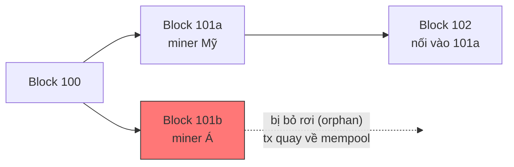
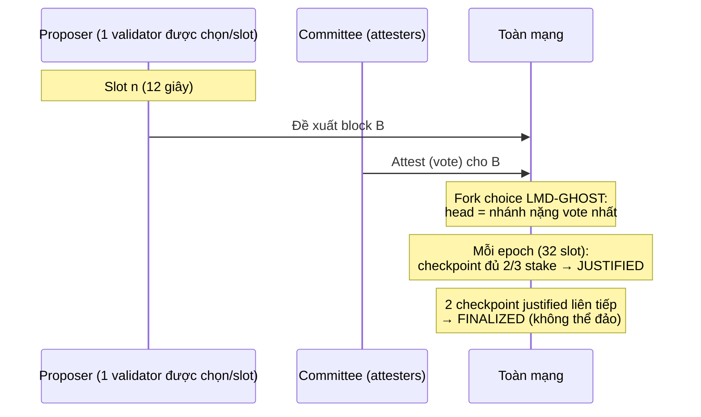
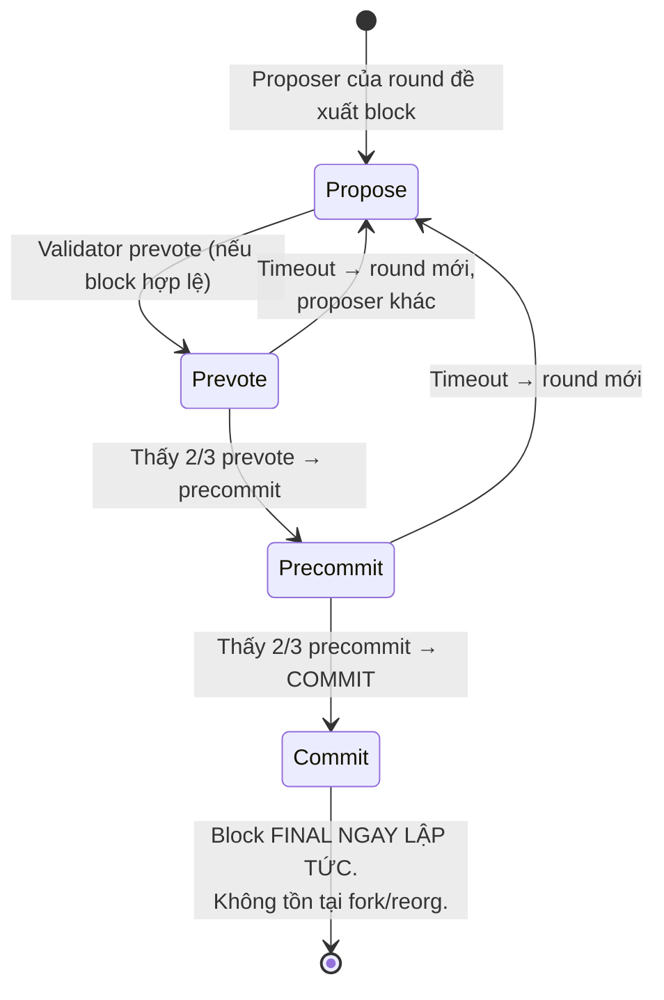

+++
title = "Level 2 – Distributed Systems & Consensus"
date = "2026-07-19T07:20:00+07:00"
draft = false
tags = ["backend", "blockchain", "web3"]
series = ["Blockchain cho Backend Engineer"]
+++

> **Câu hỏi trung tâm:** Hàng nghìn node không tin nhau, kết nối qua mạng không đáng tin, làm sao đồng ý về MỘT lịch sử transaction duy nhất?

---

## 1. Problem Statement

Level 1 kết thúc với replicated state machine: mọi node áp dụng cùng dãy transaction sẽ có cùng state. Vấn đề duy nhất còn lại — và là vấn đề khó nhất — là **thứ tự (ordering)**.

Trong hệ tập trung, ordering miễn phí: single writer quyết định. Trong Raft cluster, leader quyết định và các follower tin leader. Nhưng khi node có thể **nói dối** (gửi block khác nhau cho các peer khác nhau, giả vờ chưa nhận message, tạo hàng nghìn identity giả), mọi giao thức consensus cổ điển sụp đổ.

Nếu không giải được bài toán này, hậu quả cụ thể là **double-spend**: Alice có 100$, gửi đồng thời cho Bob (node vùng A thấy trước) và cho Carol (node vùng B thấy trước). Hai nửa mạng có hai lịch sử khác nhau — tiền bị tiêu hai lần. Consensus tồn tại để đảm bảo *toàn mạng chọn đúng một trong hai*.

---

## 2. Nền tảng lý thuyết

### 2.1. Byzantine Generals Problem

Bài toán (Lamport, 1982): các tướng vây thành, chỉ liên lạc qua messenger, một số tướng là kẻ phản bội có thể gửi thông điệp mâu thuẫn. Cần: mọi tướng trung thành thống nhất cùng một kế hoạch.

Kết quả lý thuyết quan trọng: với **f** node phản bội, cần tối thiểu **3f + 1** node tổng để đạt đồng thuận (chịu được < 1/3 Byzantine). Con số 1/3 này xuất hiện khắp nơi: PBFT, Tendermint, Ethereum PoS (finality cần 2/3 validator đồng ý — tức chịu được gần 1/3 độc hại).

So sánh fault model:

| | Crash Fault (CFT) | Byzantine Fault (BFT) |
|---|---|---|
| Node có thể | Chết, chậm | Chết, chậm, **nói dối, gian lận, thông đồng** |
| Ngưỡng chịu lỗi | f < 1/2 (Raft: 2f+1) | f < 1/3 (BFT: 3f+1) |
| Chi phí message | O(n) | O(n²) với PBFT cổ điển |
| Ví dụ | Raft, Paxos, ZooKeeper | PBFT, Tendermint, HotStuff, Nakamoto |

### 2.2. Sybil Problem — vì sao "bỏ phiếu theo node" không hoạt động

BFT cổ điển đếm phiếu theo node: 3f+1 node, mỗi node 1 phiếu. Điều này chỉ hoạt động khi **danh sách node cố định và được xác thực** (permissioned). Trong mạng mở (permissionless), kẻ tấn công tạo 1 triệu node ảo trong vài phút — gọi là **Sybil attack**.

Đột phá của Nakamoto (Bitcoin) không phải là consensus mới, mà là **thay "1 node = 1 phiếu" bằng "1 đơn vị tài nguyên khan hiếm = 1 phiếu"**:

- **PoW:** phiếu = năng lực tính toán (điện + phần cứng).
- **PoS:** phiếu = vốn khóa (stake).

Giả mạo identity trở nên vô nghĩa vì identity không còn là thứ được đếm.

### 2.3. CAP Theorem và FLP dưới góc nhìn Blockchain

**CAP:** khi mạng phân mảnh (Partition), phải chọn Consistency hoặc Availability.

- **Bitcoin/Nakamoto chọn Availability:** mạng phân mảnh → cả hai nửa tiếp tục tạo block → hai fork → khi mạng liền lại, một fork bị vứt bỏ (reorg). Consistency chỉ đạt được *dần dần* (probabilistic finality).
- **Tendermint/BFT chọn Consistency:** không đủ 2/3 phiếu → **dừng tạo block** (halt). Không bao giờ có 2 lịch sử mâu thuẫn, nhưng mạng có thể đứng hình. (Cosmos chain từng halt nhiều lần trong thực tế.)

Đây là trade-off nền tảng nhất khi chọn chain để build: **chain của bạn nghiêng về phía nào của CAP quyết định cách backend của bạn xử lý confirmation** (Level 7).

**FLP Impossibility:** trong mạng bất đồng bộ, không giao thức deterministic nào đảm bảo consensus terminates nếu có thể có 1 node chết. Các hệ thống thực lách bằng: randomness (PoW lottery, PoS random leader election), timeout/synchrony assumption (PBFT, Tendermint round timeout).

---

## 3. Nakamoto Consensus (Proof of Work)

### 3.1. Cơ chế

```
1. Node gom tx từ mempool thành block ứng viên
2. Tìm nonce sao cho: SHA256(SHA256(header)) < target   ← "đào" (mining)
   - Không có đường tắt, chỉ có brute force
   - Xác suất tìm ra ∝ tỷ lệ hashrate của bạn
3. Tìm được → broadcast. Các node verify (1 phép hash — verify rẻ, tạo đắt)
4. Fork choice rule: chọn chain có TỔNG công việc lớn nhất (heaviest chain)
5. Difficulty tự điều chỉnh để giữ ~10 phút/block
```

Điểm tinh tế nhất: PoW không phải để "bảo mật mật mã" — nó là **cơ chế bầu leader ngẫu nhiên không cần đăng ký + đồng hồ phi tập trung + hàm chi phí cho việc viết lại lịch sử**. Muốn viết lại 6 block cuối, bạn phải out-mine toàn bộ phần còn lại của mạng trong khoảng đó — cần > 50% hashrate toàn cầu.

### 3.2. Fork và Reorganization

Fork xảy ra **tự nhiên** khi 2 miner tìm ra block gần như đồng thời:



Một nửa mạng thấy 101a trước, nửa kia thấy 101b. Khi block 102 nối vào 101a, chain 101a dài hơn → toàn mạng **reorg**: node đang theo 101b vứt bỏ nó, tx trong 101b (không có trong 101a) quay về mempool.

**Hệ quả cho Backend Engineer — quan trọng nhất tài liệu này:**

> Một transaction "đã vào block" có thể **biến mất khỏi chain**. Số dư bạn vừa đọc có thể bị hoàn tác. Vì vậy tồn tại khái niệm **confirmation depth**: chờ N block chồng lên trước khi coi là an toàn (Bitcoin: 6 block ≈ 60 phút cho giá trị lớn; sàn giao dịch tự định N theo giá trị giao dịch và giá thuê hashrate tấn công).

**Probabilistic finality:** xác suất bị reorg giảm theo hàm mũ theo độ sâu, nhưng **không bao giờ bằng 0**. Ethereum Classic từng bị reorg 3.000+ block (2020, tấn công 51%) — sàn nào chỉ chờ 12 confirmation đã mất tiền thật.

### 3.3. Trade-off của PoW

| Ưu | Nhược |
|---|---|
| Permissionless tuyệt đối, không cần biết ai tham gia | Tốn năng lượng khổng lồ |
| Đã được kiểm chứng 15+ năm với hàng trăm tỷ USD | Throughput thấp (~7 TPS), latency cao |
| Chi phí tấn công là chi phí vật lý, ngoài hệ thống | Chỉ probabilistic finality |
| Đơn giản về mặt giao thức | Xu hướng tập trung mining pool (top 3 pool > 50%) |

---

## 4. Proof of Stake

### 4.1. Ý tưởng

Thay tài nguyên vật lý (điện) bằng tài nguyên trong hệ thống (vốn khóa — stake). Validator khóa tiền (Ethereum: 32 ETH), được chọn ngẫu nhiên (có trọng số theo stake) để đề xuất block; các validator khác **bỏ phiếu (attest)**.

Hai cải tiến then chốt so với PoW:

1. **Explicit finality:** đủ 2/3 stake bỏ phiếu cho một checkpoint → block **finalized** — không thể đảo ngược trừ khi ≥ 1/3 stake bị đốt. Ethereum: finality sau ~2 epoch (~12.8 phút). Đây là finality *kinh tế xác định*, khác hẳn probabilistic của PoW.
2. **Slashing:** hành vi gian lận **chứng minh được** (ký 2 block cùng slot, vote mâu thuẫn) → giao thức **tịch thu stake**. PoW phạt gián tiếp (tốn điện vô ích); PoS phạt trực tiếp và tự động. Slashing giải quyết bài toán "nothing at stake" (vote mọi fork vì vote miễn phí).

### 4.2. Ethereum PoS (Gasper = Casper FFG + LMD-GHOST)



Hệ quả thực dụng cho backend trên Ethereum: ba mức an toàn khi đọc chain, tương ứng ba tag của JSON-RPC:

| Tag | Ý nghĩa | Độ trễ | Rủi ro reorg |
|---|---|---|---|
| `latest` | Head hiện tại | 0 | Có (reorg 1-2 block xảy ra hàng ngày) |
| `safe` | Được đa số attest | ~1 slot–vài phút | Rất thấp |
| `finalized` | Finalized bởi 2/3 stake | ~13 phút | Coi như bằng 0 |

Quy tắc: **hiển thị UI dùng `latest`, ghi sổ sách/cho rút tiền dùng `finalized`.**

### 4.3. PoW vs PoS

| Tiêu chí | PoW | PoS |
|---|---|---|
| Tài nguyên bỏ phiếu | Điện + ASIC (ngoài hệ thống) | Vốn khóa (trong hệ thống) |
| Finality | Probabilistic | Economic finality (~13 phút Ethereum) |
| Năng lượng | Rất cao | ~0.01% của PoW |
| Phạt gian lận | Gián tiếp (chi phí chìm) | Trực tiếp (slashing) |
| Rào cản tham gia | Phần cứng, điện rẻ | 32 ETH + vận hành node |
| Rủi ro tập trung | Mining pool | Liquid staking (Lido ~30% stake), sàn CEX |
| Tấn công 51% | Thuê/mua hashrate; tấn công lặp lại được | Mua 1/3-1/2 stake (đẩy giá lên); stake bị đốt sau tấn công → tấn công 1 lần |

### 4.4. Delegated PoS (DPoS)

EOS, Tron, và một phần Cosmos: token holder **ủy quyền (delegate)** stake cho số nhỏ validator (21–150). Trade-off thẳng thừng: **ít validator → đồng thuận nhanh, throughput cao, nhưng phi tập trung thấp** — 21 validator dễ thông đồng/bị ép buộc hơn 1 triệu. DPoS về bản chất là BFT permissioned với lớp bầu cử dân chủ bên trên.

---

## 5. BFT cổ điển: PBFT và Tendermint

### 5.1. PBFT (1999)

Ba pha: **pre-prepare → prepare → commit**, mỗi pha cần 2f+1 chữ ký từ 3f+1 node. Message complexity O(n²) → chỉ thực dụng với vài chục đến ~100 node. Được dùng trong permissioned chain (Hyperledger).

### 5.2. Tendermint (Cosmos)

PBFT hiện đại hóa cho blockchain: round-based, mỗi round một proposer (round-robin theo stake), 2 pha vote (prevote, precommit), cần 2/3.



**Instant finality: block đã commit là final tuyệt đối — không có reorg trên Cosmos.** Đổi lại (CAP): nếu > 1/3 stake offline, **chain dừng hẳn** cho tới khi validator quay lại. Backend tích hợp Cosmos đơn giản hơn hẳn (không cần confirmation depth) nhưng phải xử lý kịch bản "chain halt" (tx treo vô hạn, không phải fail).

### 5.3. Solana (để hoàn thiện bức tranh)

Solana dùng PoS + **Proof of History** (một verifiable delay function tạo đồng hồ mật mã, cho phép validator đồng ý về *thời gian* mà không cần liên lạc) + Tower BFT + pipelining. Kết quả: block 400ms, throughput hàng nghìn TPS. Đánh đổi: yêu cầu phần cứng validator rất cao (tập trung hóa), lịch sử từng nhiều lần **ngừng hoạt động toàn mạng** (2021-2022) phải khởi động lại có phối hợp — minh họa sống động cho trade-off performance vs robustness.

---

## 6. Tổng kết fork choice và finality — bảng tra cứu cho backend

| Chain | Consensus | Block time | Finality | Reorg có thể xảy ra? | Backend nên chờ |
|---|---|---|---|---|---|
| Bitcoin | PoW Nakamoto | ~10 phút | Probabilistic | Có | 3–6+ conf theo giá trị |
| Ethereum | PoS Gasper | 12 giây | ~13 phút (finalized) | Có (trước finalized) | tag `finalized` cho tiền thật |
| Cosmos | Tendermint | ~6 giây | Ngay lập tức | **Không** | 1 block |
| Solana | PoS + PoH | ~400ms | ~13 giây (rooted) | Hiếm (trước rooted) | commitment `finalized` |
| BNB Chain | PoS (ít validator) | ~3 giây | Nhanh | Hiếm | ~15 conf theo convention |

```javascript
// Node.js: theo dõi finality đúng cách trên Ethereum
import { JsonRpcProvider } from "ethers";
const provider = new JsonRpcProvider(RPC_URL);

async function isSafeToCredit(txHash) {
  const receipt = await provider.getTransactionReceipt(txHash);
  if (!receipt || receipt.status !== 1) return false;
  const finalized = await provider.getBlock("finalized"); // KHÔNG dùng "latest"
  return receipt.blockNumber <= finalized.number;
}
```

---

## 7. Production Considerations

- **Confirmation depth theo giá trị giao dịch:** nạp $10 → 1-2 conf cho UX; rút $1M → finalized + review thủ công. Chi phí tấn công 51% thuê hashrate (với chain PoW nhỏ) đo được — depth phải làm chi phí tấn công > giá trị giao dịch.
- **Reorg handling là bắt buộc, không phải edge case:** Ethereum reorg 1-2 block xảy ra hàng ngày. Indexer/ledger phải có khả năng **rollback** (Level 7: lưu block hash cha, phát hiện mismatch, unwind).
- **Chain halt (Tendermint-family):** alert khi không có block mới sau X giây; tx đang chờ không fail — chúng treo. Cần timeout ở tầng ứng dụng.
- **Theo dõi mức độ phi tập trung của chain bạn phụ thuộc:** một chain PoS mà 3 validator nắm 2/3 stake thì "finality" chỉ mạnh ngang chữ ký của 3 tổ chức đó.

## 8. Anti-patterns

- Dùng `latest` block cho nghiệp vụ ghi sổ/cho rút tiền.
- Cứng nhắc "6 confirmations" cho mọi chain, mọi giá trị — số này là của Bitcoin 2010, không phải hằng số vũ trụ.
- Giả định mọi chain đều có reorg (viết code phòng reorg phức tạp cho Cosmos là thừa) hoặc không chain nào có (thảm họa trên Ethereum/Bitcoin).
- Coi finality của chain 5 validator ngang với finality của Ethereum.

## 9. Khi nào KHÔNG cần Byzantine consensus

Nếu mọi node do một tổ chức (hoặc các bên đã tin nhau qua hợp đồng pháp lý) vận hành → Raft/Kafka là đủ, nhanh hơn 1000 lần, đơn giản hơn 10 lần. Byzantine consensus chỉ đáng giá khi **kẻ tham gia có động cơ và khả năng gian lận, và không có cơ chế pháp lý nào rẻ hơn để ngăn chặn**.

---

## 10. Tóm tắt Level 2

- Consensus blockchain = giải bài toán ordering giữa các node **có thể gian lận** (Byzantine), trong mạng mở (Sybil-resistant).
- Nakamoto: bầu leader bằng lottery tài nguyên + heaviest chain + probabilistic finality → có fork/reorg.
- PoS: stake làm phiếu, slashing làm hình phạt, finality kinh tế xác định.
- BFT/Tendermint: instant finality, đổi bằng liveness (halt khi mất 1/3).
- CAP quyết định hành vi khi mạng phân mảnh: Nakamoto chọn A (fork rồi hàn gắn), BFT chọn C (dừng).
- **Với backend: finality model của chain quyết định thiết kế confirmation tracking, reorg handling và alerting của bạn.**

**Tiếp theo — Level 3:** đi vào bên trong node: một transaction từ lúc ký đến lúc nằm trong block trải qua những gì — mempool, gas, fee market, và execution.
