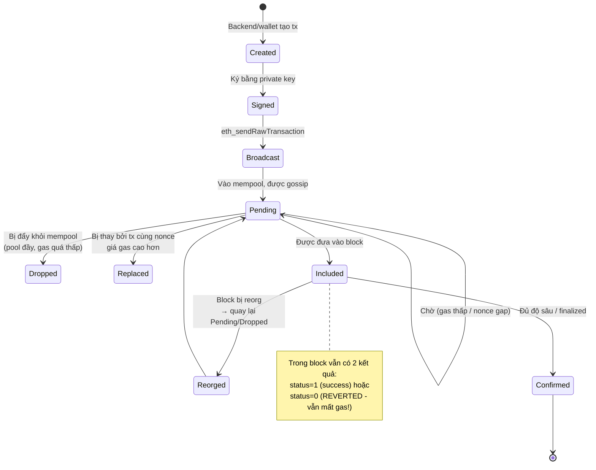
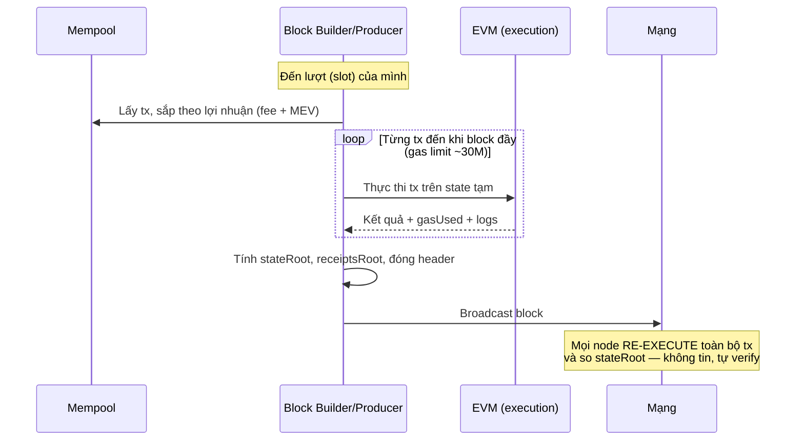

+++
title = "Level 3 – Blockchain Runtime: Transaction Lifecycle"
date = "2026-07-19T07:30:00+07:00"
draft = false
tags = ["backend", "blockchain", "web3"]
series = ["Blockchain cho Backend Engineer"]
+++

> **Câu hỏi trung tâm:** Từ lúc user bấm "Send" đến lúc backend dám ghi sổ, transaction đi qua những trạng thái nào — và có thể kẹt/chết ở đâu?

---

## 1. Problem Statement

Backend Engineer quen với vòng đời request: nhận → validate → xử lý → trả response, đồng bộ, trong vài chục ms, với kết quả nhị phân (thành công/lỗi).

Transaction blockchain hoàn toàn khác: **bất đồng bộ, nhiều trạng thái trung gian, có thể kẹt vô hạn, có thể thành công rồi bị hoàn tác, và thất bại vẫn mất phí**. Không hiểu vòng đời này là nguồn gốc của phần lớn sự cố production trong hệ thống Web3 (tx stuck, double credit, nonce conflict — xem file Failure Cases).

## 2. State Machine của một Transaction



Những điểm "phản trực giác" nhất so với backend truyền thống:

1. **`eth_sendRawTransaction` trả về hash ngay lập tức** — hash chỉ là `keccak256(signedTx)`, tính được offline. Nó KHÔNG chứng minh tx đã vào mempool của toàn mạng, càng không chứng minh sẽ được xử lý.
2. **Không có trạng thái "failed vĩnh viễn" rõ ràng khi pending.** Tx có thể pending 1 giây, 1 giờ, hoặc mãi mãi. Không có NACK.
3. **Included ≠ Success.** Tx trong block có thể `status = 0` (contract revert) — và vẫn bị trừ gas.
4. **Success ≠ Final.** Reorg có thể kéo tx ra khỏi chain (Level 2).

## 3. Mempool

### 3.1. Bản chất

Mempool là **priority queue phân tán, không đồng nhất, công khai** chứa các tx chưa vào block. Mỗi node có mempool *riêng* — không tồn tại "the mempool" toàn cục. Tx gossip qua P2P nên hai node có thể thấy tập tx khác nhau tại một thời điểm.

So với message queue truyền thống:

| | Kafka/RabbitMQ | Mempool |
|---|---|---|
| Ordering | FIFO/partition | Theo giá phí (ai trả cao xử lý trước) + nonce per-sender |
| Delivery guarantee | At-least-once có ack | **Không có guarantee nào** |
| Riêng tư | Chỉ consumer thấy | **Công khai — ai cũng đọc được** |
| Tồn tại message | Đến khi ack/retention | Node tự ý drop khi đầy |

### 3.2. Hệ quả của mempool công khai: Front-running và MEV

Vì mọi người thấy tx đang chờ, bot có thể **đọc ý định của bạn trước khi nó thực thi**:

- **Front-running:** thấy lệnh mua lớn trên DEX → bot đặt lệnh mua trước (gas cao hơn) → giá tăng → bán lại cho bạn.
- **Sandwich attack:** kẹp tx của nạn nhân giữa 1 lệnh mua và 1 lệnh bán.
- **MEV (Maximal Extractable Value):** tổng giá trị mà block producer chiết xuất được nhờ quyền **sắp thứ tự tx trong block**. Trên Ethereum, MEV đã công nghiệp hóa (Flashbots, MEV-Boost: builder chuyên nghiệp xây block, proposer chỉ chọn block trả nhiều nhất).

Bài học backend: **thứ tự thực thi không phải thứ tự gửi, và kẻ khác có thể chen vào giữa**. Ứng dụng nhạy cảm về giá phải dùng slippage limit, private mempool (Flashbots Protect), hoặc thiết kế batch auction.

### 3.3. Quy tắc mempool cần nhớ khi vận hành

- Tx nonce N của một account chỉ được include khi mọi nonce < N đã include → **một tx kẹt chặn toàn bộ tx sau nó của cùng account** (nonce gap).
- Thay thế tx cùng nonce: tx mới phải trả gas cao hơn tối thiểu ~10% (replacement fee bump).
- Mempool đầy → node đuổi tx gas thấp nhất. Tx bị đuổi **không có thông báo** — backend tưởng nó vẫn pending.

## 4. Gas và Fee Market

### 4.1. Vì sao gas tồn tại

Hai bài toán:

1. **Halting problem:** EVM là Turing-complete; không thể biết trước một contract có dừng không. Gas = "nhiên liệu" giới hạn số bước thực thi — hết gas thì dừng và revert. Đây là cách blockchain chạy code không tin cậy một cách an toàn.
2. **Định giá tài nguyên chung:** block space là tài nguyên khan hiếm toàn cầu. Phí = cơ chế đấu giá phân bổ.

Mỗi opcode có giá cố định (ADD = 3 gas, SSTORE slot mới = 22.100 gas, ...). Ghi storage đắt gấp nghìn lần tính toán — vì storage là chi phí *vĩnh viễn* cho mọi full node.

### 4.2. EIP-1559 — fee market hiện đại của Ethereum

```
fee = gasUsed × (baseFee + priorityFee)

baseFee:     do GIAO THỨC tính từ độ đầy block trước
             (block > 50% đầy → baseFee tăng ~12.5%; ngược lại giảm)
             → bị ĐỐT (burn), không ai nhận
priorityFee: tiền tip cho block producer để được ưu tiên
Người dùng đặt: maxFeePerGas (trần tổng) và maxPriorityFeePerGas (trần tip)
Hoàn lại:    max(0, maxFeePerGas - baseFee - priorityFee) × gasUsed
```

Vì sao thiết kế này thông minh: baseFee là **giá do thuật toán niêm yết**, người dùng không phải đoán giá qua đấu giá mù (first-price auction) như trước — ước phí dễ hơn, ít trả hớ. Với backend: `maxFeePerGas` nên đặt = `2 × baseFee hiện tại + priorityFee` để tx sống sót qua vài block baseFee tăng liên tiếp.

```go
// Golang (go-ethereum): ước phí đúng cách — KHÔNG hardcode
header, _ := client.HeaderByNumber(ctx, nil)
tip, _ := client.SuggestGasTipCap(ctx) // priority fee gợi ý
maxFee := new(big.Int).Add(
    new(big.Int).Mul(header.BaseFee, big.NewInt(2)), // đệm 2x baseFee
    tip,
)
gasLimit, err := client.EstimateGas(ctx, callMsg) // simulate để ước gas
// LUÔN đệm gasLimit ~20% vì state có thể đổi giữa estimate và execute
gasLimit = gasLimit * 120 / 100
```

### 4.3. Nonce

Nonce = bộ đếm tx tuần tự per-account. Ba chức năng: chống replay (tx cũ không gửi lại được), ép ordering, định danh duy nhất `(from, nonce)`.

Vấn đề production kinh điển: **backend gửi tx song song từ một hot wallet**. Lấy nonce bằng `eth_getTransactionCount(addr, "latest")` sẽ trả cùng giá trị cho 2 request đồng thời → 2 tx cùng nonce → 1 bị loại. Dùng `"pending"` đỡ hơn nhưng vẫn race. Giải pháp đúng: **cấp phát nonce tập trung trong backend** (Redis INCR / DB row lock / single-writer queue) — Level 7 có code đầy đủ.

## 5. Block Production và Execution

### 5.1. Ai xây block, xây thế nào



Điểm cốt lõi: **mọi full node thực thi lại mọi transaction**. Đây là lý do throughput L1 thấp — hệ thống không phân chia công việc (sharding computation) mà *nhân bản* công việc để mọi node tự verify. "Đừng tin, hãy tự kiểm chứng" là nguyên tắc trả giá bằng hiệu năng.

### 5.2. State Transition chi tiết (Ethereum)

Với mỗi tx, STF thực hiện:

```
1. Verify chữ ký → khôi phục sender
2. Check nonce khớp, balance ≥ maxFee × gasLimit + value
3. Trừ trước maxFee × gasLimit khỏi sender (escrow)
4. Thực thi:
   - to = EOA        → chuyển value
   - to = contract   → chạy bytecode với data làm input
   - to = null       → deploy contract mới
5. Nếu revert giữa chừng → hoàn tác MỌI thay đổi state của tx
   (trong-tx có tính atomic như DB transaction) NHƯNG vẫn tính gas đã dùng
6. Hoàn gas thừa, chuyển tip cho producer, đốt baseFee
7. Ghi receipt (status, gasUsed, logs, bloom filter)
```

Tính atomic per-tx là món quà lớn cho developer: một tx gọi 5 contract, bước 5 fail → cả 5 bước hoàn tác. Không có "partial failure" trong một tx — khác hẳn microservices, nơi distributed transaction là ác mộng saga/compensation.

### 5.3. Execution model các chain khác (so sánh)

| | Ethereum | Solana | Cosmos (SDK) |
|---|---|---|---|
| Thực thi | Tuần tự từng tx | **Song song** (tx khai báo trước account đọc/ghi → tx không đụng nhau chạy đồng thời) | Tuần tự, app tự định nghĩa STF |
| Fee | Đấu giá EIP-1559 | Phí cố định thấp + priority fee, phí cục bộ theo account nóng | Gas tương tự Ethereum |
| Bài học | Đơn giản, nghẽn toàn cục | Khai báo dependency để song song — giống row-lock DB | Chain chuyên dụng cho một app |

Solana đáng chú ý về mặt kiến trúc: bắt tx **khai báo trước tập account sẽ đụng** chính là kỹ thuật lock-based scheduling của database — một ví dụ đẹp về việc kiến thức DB engine áp thẳng vào blockchain.

## 6. Đọc kết quả: Receipt và Logs

Sau khi tx vào block, backend đọc **receipt**:

```javascript
const receipt = await provider.getTransactionReceipt(txHash);
// receipt.status      : 1 = success, 0 = reverted (vẫn mất gas)
// receipt.blockNumber : block chứa tx
// receipt.gasUsed     : gas thực dùng
// receipt.logs        : events do contract phát ra
```

**Logs/Events** là cơ chế "output" chính của contract (contract không có return value cho external caller theo nghĩa thông thường). Event được lưu trong receipt trie, đánh index bằng bloom filter trong block header → tìm kiếm nhanh. Đây là nguồn dữ liệu chính của Indexer (Level 5) và mọi kiến trúc event-driven Web3 (Level 7).

**Lưu ý quan trọng:** revert reason không nằm trong receipt. Muốn biết *vì sao* revert, phải re-simulate: `eth_call` cùng tx tại block đó và parse revert data.

## 7. Production Considerations

- **Timeout ở tầng ứng dụng:** đặt deadline cho trạng thái pending (vd 5 phút). Quá hạn → replace bằng tx cùng nonce, gas cao hơn (speed-up) hoặc tx rỗng self-transfer (cancel).
- **Đừng tin `estimateGas` tuyệt đối:** simulation chạy trên state hiện tại; state lúc thực thi có thể khác (ví dụ ai đó rút hết pool trước bạn). Đệm 20-30% và xử lý revert.
- **Theo dõi baseFee:** gas spike (NFT mint hot, thanh lý lớn) làm baseFee tăng 10-50x trong vài phút. Backend cần: hàng đợi ưu tiên theo mức phí chấp nhận được, circuit breaker khi phí vượt ngưỡng kinh tế.
- **Idempotency nhờ nonce:** `(from, nonce)` là idempotency key tự nhiên — gửi lại *cùng signed tx* là an toàn tuyệt đối (cùng hash, chain chỉ nhận một). Lưu signed tx đã ký để retry, thay vì ký lại (ký lại với nonce mới = double spend).

## 8. Anti-patterns

- Trả về "thanh toán thành công" cho user ngay khi có tx hash.
- Poll `getTransactionReceipt` mỗi 100ms trên RPC trả phí theo request (đốt tiền); dùng WebSocket `newHeads` rồi mới check receipt.
- Hardcode `gasPrice` từ thời điểm viết code (thảm họa khi mạng congestion hoặc khi giá giảm 100x — trả phí gấp trăm lần cần thiết).
- Ký lại tx mới khi retry thay vì gửi lại signed tx cũ → nguy cơ double spend.
- Bỏ qua tx `status = 0` trong indexer (tưởng "có receipt = thành công").

## 9. Tóm tắt Level 3

- Tx lifecycle là state machine bất đồng bộ: Created → Signed → Pending → Included → Confirmed, với các nhánh Dropped/Replaced/Reorged/Reverted.
- Mempool là priority queue công khai không guarantee — hệ quả: front-running, MEV, tx bị drop im lặng.
- Gas giải bài toán halting + định giá tài nguyên; EIP-1559 tách baseFee (đốt) và tip; không bao giờ hardcode.
- Nonce ép ordering per-account — nguồn bug lớn nhất khi gửi tx từ backend; cần cấp phát tập trung.
- Mọi node re-execute mọi tx; STF atomic per-tx và deterministic.
- Receipt.status và logs là sự thật để đọc kết quả — kết hợp confirmation depth (Level 2).

**Tiếp theo — Level 4:** chuyện gì xảy ra bên trong bước "thực thi": EVM, bytecode, storage layout, và cách smart contract được quản lý vòng đời trong production.
