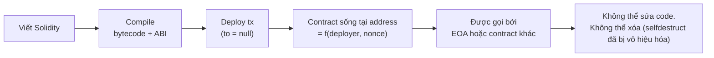
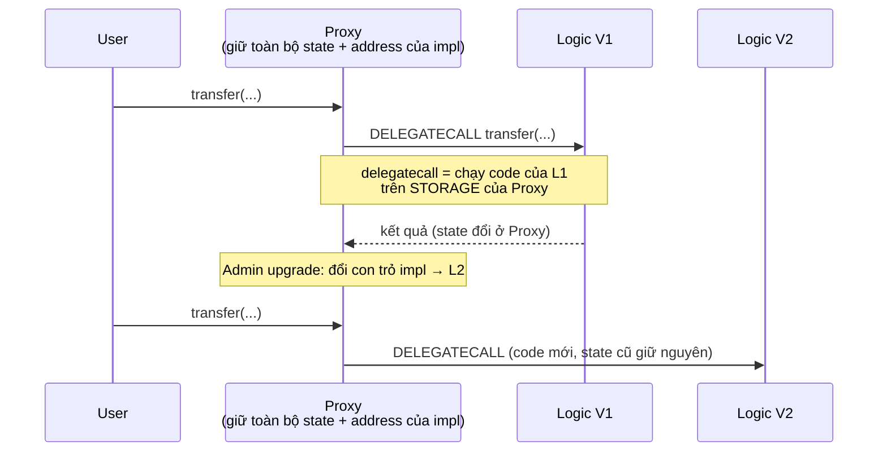

+++
title = "Level 4 – Virtual Machine & Smart Contract"
date = "2026-07-19T07:40:00+07:00"
draft = false
tags = ["backend", "blockchain", "web3"]
series = ["Blockchain cho Backend Engineer"]
+++

> **Câu hỏi trung tâm:** Làm sao hàng nghìn máy tính không tin nhau chạy cùng một đoạn code và ra cùng một kết quả — và điều đó thay đổi cách viết "business logic" như thế nào?

---

## 1. Problem Statement

Bitcoin chứng minh có thể đồng thuận về *sổ cái chuyển tiền*. Nhưng logic nghiệp vụ thật (escrow, đấu giá, vay thế chấp) cần **code tùy ý** chạy trên state chung. Vấn đề: code tùy ý từ người lạ là code không tin cậy — có thể lặp vô hạn, phá state, hoặc cho kết quả khác nhau trên các máy khác nhau.

Smart contract platform giải bài toán: **thực thi code không tin cậy, một cách tất định (deterministic), có giới hạn tài nguyên, trên hàng nghìn máy độc lập, ra kết quả giống hệt nhau**.

So sánh nhanh để định vị: smart contract giống **stored procedure chạy trên một database công cộng mà không ai có quyền admin** — deploy xong thì chính tác giả cũng không sửa được (mặc định), và ai cũng gọi được.

## 2. EVM — Ethereum Virtual Machine

### 2.1. Vì sao cần một VM riêng

Tại sao không chạy x86 hay JVM? Vì STF phải **deterministic tuyệt đối** và **định giá được từng bước**:

- Không floating point (IEEE 754 rounding khác nhau giữa phần cứng → mọi số trong EVM là integer 256-bit).
- Không syscall, không network, không filesystem, không clock ngoài `block.timestamp` (do proposer đặt, mọi node thấy giống nhau).
- Không random thật (chỉ có pseudo-random từ dữ liệu on-chain — và vì thế *dự đoán được*, nguồn của nhiều vụ hack game/lottery).
- Mỗi opcode có giá gas cố định → tính phí chính xác, dừng được vòng lặp vô hạn.

EVM là **stack machine 256-bit** với 4 vùng dữ liệu:

| Vùng | Vòng đời | Chi phí | Tương đương |
|---|---|---|---|
| Stack | Trong 1 call | Rẻ nhất | CPU registers |
| Memory | Trong 1 tx | Rẻ, tăng phi tuyến theo size | RAM / heap |
| Storage | **Vĩnh viễn trên chain** | Cực đắt (20k gas/slot mới) | Database |
| Calldata | Input của call, read-only | Rẻ | Request body |

Trực giác chi phí quan trọng nhất cho người thiết kế: **Storage đắt gấp ~7.000 lần một phép cộng**. Mọi tối ưu contract xoay quanh việc giảm đọc/ghi storage — giống hệt tối ưu backend xoay quanh giảm truy vấn DB.

### 2.2. Bytecode và ABI

Solidity compile ra **bytecode** (dãy opcode EVM) lưu on-chain. Chain chỉ biết bytecode — không biết tên hàm, không biết type.

**ABI (Application Binary Interface)** là bản hợp đồng ngoài-chain (file JSON) quy ước cách encode lời gọi:

```
Gọi transfer(address to, uint256 amount):
calldata = 0xa9059cbb                                    ← selector: 4 byte đầu keccak256("transfer(address,uint256)")
         + 000...0<address 32 bytes>                     ← tham số pad về 32 bytes
         + 000...0<amount 32 bytes>
```

Contract dispatch bằng cách so 4 byte selector — một `switch` khổng lồ do compiler sinh ra. Với backend engineer: ABI đóng vai trò như file `.proto` của gRPC — client và contract phải cùng phiên bản, sai ABI = gọi vào hư không hoặc decode rác.

```javascript
// Node.js: ABI là tất cả những gì cần để gọi contract
import { Contract, JsonRpcProvider } from "ethers";
const erc20Abi = ["function balanceOf(address) view returns (uint256)",
                  "event Transfer(address indexed from, address indexed to, uint256 value)"];
const usdc = new Contract("0xA0b8...", erc20Abi, new JsonRpcProvider(RPC));
const bal = await usdc.balanceOf(userAddr); // ethers encode calldata, eth_call, decode kết quả
```

### 2.3. Storage Layout

Storage của mỗi contract là mapping `slot(uint256) → value(bytes32)` — một key-value store phẳng. Compiler xếp biến theo quy tắc:

```solidity
contract Vault {
    address owner;                     // slot 0
    uint256 totalSupply;               // slot 1
    mapping(address => uint256) balance; // slot của balance[user] = keccak256(user . 2)
    uint256[] history;                 // length ở slot 3, phần tử i ở keccak256(3) + i
}
```

Vì sao backend engineer cần biết điều này:

1. **Đọc state không qua ABI:** `eth_getStorageAt(contract, slot)` đọc thẳng slot — kể cả biến `private` (private chỉ là không sinh getter; **mọi dữ liệu on-chain đều công khai**, không bao giờ lưu secret trên chain).
2. **Proxy upgrade an toàn phụ thuộc storage layout** (mục 4): đổi thứ tự khai báo biến giữa 2 phiên bản = data corruption thầm lặng.

## 3. Contract Lifecycle



- Address contract tính trước được: `keccak256(rlp(deployer, nonce))` hoặc CREATE2 `keccak256(0xff, deployer, salt, initcodeHash)` — cho phép **biết address trước khi deploy** (dùng trong counterfactual deployment, ví smart account).
- **Immutability là mặc định.** "Fix bug" nghĩa là deploy contract mới và thuyết phục mọi người chuyển sang — trừ khi thiết kế upgrade từ đầu.

## 4. Upgrade Pattern (Proxy)

### 4.1. Vấn đề

Immutability là tính năng (user tin code không đổi) và là thảm họa vận hành (bug không vá được, tiền kẹt vĩnh viễn — Parity multisig 2017: ~500k ETH đóng băng đến nay).

### 4.2. Proxy pattern

Tách **state** và **logic** thành 2 contract:



`DELEGATECALL` là opcode mấu chốt: thực thi code của contract khác **trong context storage của mình**. Address user tương tác không đổi, state không đổi, chỉ logic đổi.

Ràng buộc chết người: **storage layout của V2 phải là superset đúng thứ tự của V1**. Chèn một biến vào giữa → mọi biến sau lệch slot → đọc ra rác. Chuẩn hiện hành: UUPS/Transparent Proxy (OpenZeppelin) + EIP-1967 (slot cố định cho impl address) + storage gap.

### 4.3. Trade-off của upgradeability — câu hỏi trust quay lại

Contract upgrade được nghĩa là **admin key có quyền thay toàn bộ logic** — kể cả logic "rút hết tiền". Trustlessness của contract lúc này chỉ mạnh bằng khâu quản lý admin key (multisig? timelock? DAO vote?). Nhiều vụ "hack" thực chất là **lộ admin key của proxy** (Ronin Bridge một phần thuộc dạng này). Khi audit một protocol, câu hỏi đầu tiên luôn là: *ai cầm quyền upgrade và sau timelock bao lâu?*

## 5. Các lỗ hổng kinh điển (Security cho người tích hợp)

### 5.1. Reentrancy

```solidity
// LỖ HỔNG: The DAO hack 2016 (~$60M, dẫn tới hard fork Ethereum/ETC)
function withdraw() external {
    uint256 bal = balances[msg.sender];
    (bool ok, ) = msg.sender.call{value: bal}("");  // 1. GỬI TIỀN TRƯỚC
    balances[msg.sender] = 0;                        // 2. GHI SỔ SAU  ← quá muộn!
}
// msg.sender là contract độc: trong lúc nhận tiền (fallback), nó GỌI LẠI withdraw()
// → balances chưa về 0 → rút lặp đến cạn quỹ
```

Bản chất: **external call chuyển quyền điều khiển cho code không tin cậy giữa lúc invariant đang tạm gãy**. Backend tương đương: gọi webhook bên thứ ba khi transaction DB chưa commit. Phòng: pattern **Checks-Effects-Interactions** (ghi sổ trước, gọi ngoài sau) + ReentrancyGuard.

### 5.2. Các lỗi khác cần biết khi đọc audit report

| Lỗi | Bản chất | Ghi chú |
|---|---|---|
| Integer overflow | Số 256-bit quay vòng | Solidity ≥ 0.8 tự revert; code cũ/`unchecked` vẫn dính |
| Access control | Quên `onlyOwner`, quên khởi tạo owner của impl | Parity hack #1: hàm init công khai |
| Oracle manipulation | Giá lấy từ pool DEX bị bơm/xả trong 1 tx (flash loan) | Dùng TWAP/Chainlink, không dùng spot price 1 nguồn |
| Front-running | Thứ tự tx thao túng được (Level 3) | Slippage guard, commit-reveal |
| Unchecked return | ERC-20 cũ (USDT) không revert khi fail, trả false | Dùng SafeERC20 |

Nguyên tắc cho backend engineer tích hợp contract bên ngoài: **đối xử với mọi external contract như input không tin cậy** — kể cả token: token có thể là mã độc (fee-on-transfer, rebasing, revert có điều kiện, honeypot). Sàn/bridge từng mất tiền vì tin `transfer()` chuyển đúng số lượng ghi trong tham số.

## 6. Event Log — giao diện dữ liệu cho backend

Contract giao tiếp với thế giới ngoài qua **event**:

```solidity
event Transfer(address indexed from, address indexed to, uint256 value);
emit Transfer(msg.sender, to, amount);
```

- `indexed` (tối đa 3) → vào **topics**, filter được phía node (`eth_getLogs` theo topic) — như cột có index.
- Không indexed → vào **data**, phải tự decode — như cột thường.
- Event **rẻ hơn storage ~10-100 lần** → là kênh xuất dữ liệu cho off-chain, không phải nơi contract đọc lại được (contract không đọc được event của chính nó).

**Kiến trúc chuẩn:** contract lưu tối thiểu state cần cho logic on-chain; mọi nhu cầu truy vấn (lịch sử, thống kê, danh sách) đẩy qua event → Indexer (Level 5) → PostgreSQL. Đừng bao giờ thiết kế contract để "query được như DB" — đó là việc của indexer.

## 7. Account Abstraction (ERC-4337)

Vấn đề: EOA (ví thường) quá cứng — 1 private key duy nhất, mất là hết, không social recovery, không trả phí hộ, mỗi thao tác một chữ ký.

Account Abstraction biến **account thành smart contract**: logic xác thực tùy biến (multisig, passkey/FaceID, session key), **paymaster** (dApp trả gas hộ user — user không cần có ETH), batch nhiều thao tác trong 1 lần ký. Kiến trúc: user gửi `UserOperation` vào mempool riêng → **Bundler** (một backend service — cơ hội nghề nghiệp cho backend engineer!) gom thành tx gọi `EntryPoint` contract.

Với người thiết kế sản phẩm Web3 hướng người dùng phổ thông: AA + paymaster là con đường chính để giấu hết khái niệm gas/seed phrase khỏi UX.

## 8. Smart Contract vs Backend Service — trade-off tổng kết

| Tiêu chí | Smart Contract | Backend Service |
|---|---|---|
| Trust | Không cần tin nhà vận hành | Tin hoàn toàn nhà vận hành |
| Chi phí thực thi | ~$0.01–$50/lệnh ghi | ~$0 |
| Throughput | Chia sẻ với cả chain | Tùy scale |
| Sửa bug | Rất khó (proxy + governance) | Deploy mới trong phút |
| Downtime | ~0 (chain còn sống là còn chạy) | Phụ thuộc DevOps |
| Bảo mật | Bug = mất tiền công khai, không rollback | Bug thường khắc phục được |
| Dữ liệu | Công khai toàn bộ | Riêng tư tùy ý |

**Nguyên tắc phân lớp:** on-chain chỉ giữ phần *bắt buộc phải trustless* — quyền sở hữu tài sản, quy tắc chuyển nhượng, cam kết (hash). Mọi thứ còn lại (matching engine tốc độ cao, phân tích, notification, metadata) để off-chain. Các hệ thực tế đều là hybrid: OpenSea (order book off-chain, settlement on-chain), dYdX v3 (matching off-chain, settlement rollup).

## 9. Production Considerations

- **Pin ABI theo version + address theo môi trường** trong config, không hardcode rải rác.
- **Simulate trước khi gửi** (`eth_call` / `estimateGas`) để bắt revert sớm, nhưng nhớ simulation ≠ đảm bảo (state đổi giữa chừng).
- **Theo dõi event upgrade của proxy bạn phụ thuộc** (`Upgraded(address)` — EIP-1967): logic đối tác có thể đổi sau một đêm; alert khi impl đổi.
- **Decode revert reason** để trả lỗi có nghĩa cho user thay vì "transaction failed".
- Khi tích hợp token lạ: test transfer thật trên fork mainnet (Anvil/Hardhat fork) trước khi cho list.

## 10. Khi nào KHÔNG nên viết logic thành smart contract

- Logic thay đổi thường xuyên theo nghiệp vụ → chi phí upgrade + audit mỗi lần đổi vượt xa giá trị.
- Cần dữ liệu ngoài chain (giá, thời tiết, kết quả trận đấu) → phụ thuộc oracle, thêm một lớp trust và chi phí; cân nhắc xem còn "trustless" thật không.
- Cần privacy (lương, hồ sơ y tế) → mọi thứ on-chain là công khai vĩnh viễn.
- Cần throughput/latency của một matching engine → off-chain + settle on-chain.

## 11. Tóm tắt Level 4

- EVM tồn tại để chạy code không tin cậy một cách deterministic và định giá được; vì thế không float, không IO, không random thật.
- ABI = contract interface ngoài chain (như protobuf); storage layout = ánh xạ biến → slot, nền tảng của proxy an toàn và của việc "không có gì private on-chain".
- Immutability là mặc định; proxy + delegatecall đổi lấy khả năng vá bug bằng một điểm trust mới (admin key).
- Reentrancy và họ hàng: external call = chuyển quyền điều khiển cho kẻ lạ; Checks-Effects-Interactions.
- Event là API dữ liệu cho backend; contract không phải database.
- Ranh giới on-chain/off-chain là quyết định kiến trúc quan trọng nhất của một hệ Web3.

**Tiếp theo — Level 5:** hạ tầng bao quanh chain: node, RPC, indexer, wallet service — phần "backend thật sự" của mọi công ty Web3.
