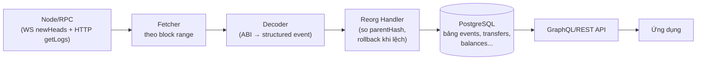
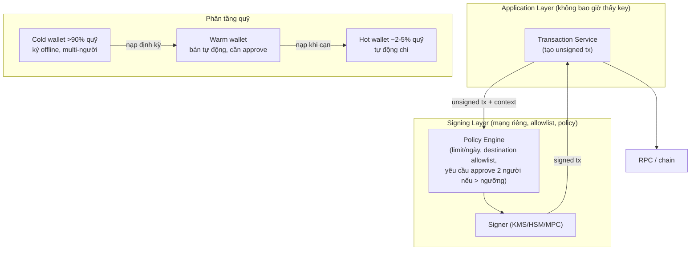
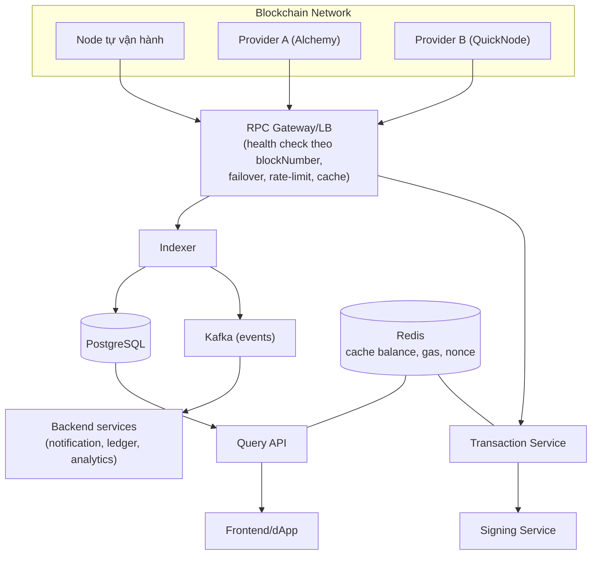

+++
title = "Level 5 – Blockchain Infrastructure"
date = "2026-07-19T07:50:00+07:00"
draft = false
tags = ["backend", "blockchain", "web3"]
series = ["Blockchain cho Backend Engineer"]
+++

> **Câu hỏi trung tâm:** Giữa chain và ứng dụng của bạn là cả một tầng hạ tầng. Tầng đó gồm những gì, và bạn nên tự vận hành hay đi thuê?

---

## 1. Problem Statement

Ứng dụng Web3 không nói chuyện trực tiếp với "blockchain" — nó nói chuyện với **một node cụ thể** qua RPC. Node đó có thể chậm, lệch (out of sync), nói dối (nếu là node của người khác), hoặc chết. Toàn bộ Level 5 là về tầng hạ tầng này: node, RPC, indexer, wallet service — nơi 80% công việc backend engineer trong công ty Web3 thực sự diễn ra.

Sự thật quan trọng đầu tiên: **khi bạn gọi RPC của bên thứ ba (Infura, Alchemy...), bạn đã đưa trust trở lại hệ thống trustless.** Node đó có thể trả dữ liệu sai/cũ và bạn không kiểm chứng. Đây là trade-off thực dụng mà gần như cả ngành chấp nhận — nhưng phải chấp nhận *một cách có ý thức*.

## 2. Các loại Node

| Loại | Lưu gì | Dung lượng (Ethereum) | Dùng cho |
|---|---|---|---|
| **Full Node** | Toàn bộ block + state gần đây (pruned) | ~1-2 TB | Verify độc lập, phục vụ RPC thông thường |
| **Archive Node** | Full + **state tại MỌI block lịch sử** | ~15-20 TB | Truy vấn "số dư của X tại block 1 triệu?", debug, indexer, explorer |
| **Light Client** | Chỉ block header | ~vài GB | Ví mobile, verify bằng Merkle proof (Level 1) |

Điểm nhầm lẫn phổ biến: full node **có** toàn bộ lịch sử block, nhưng chỉ giữ **state** của các block gần nhất. Hỏi `eth_getBalance(addr, blockCũ)` trên full node → lỗi "missing trie node". Cần dữ liệu lịch sử state → bắt buộc archive node (đắt gấp ~10 lần về storage, đòi hỏi NVMe tốt).

Với Ethereum sau The Merge, một "node" thực chất là **cặp 2 process**: Execution Client (Geth/Nethermind/Erigon — EVM, state, mempool, RPC) + Consensus Client (Lighthouse/Prysm — PoS, fork choice), nói chuyện qua Engine API. Vận hành phải chạy và monitor cả hai.

### Tự vận hành node vs thuê RPC provider

| | Tự vận hành | Provider (Alchemy, Infura, QuickNode) |
|---|---|---|
| Chi phí | $500-2000+/tháng/node (server NVMe, băng thông) + công DevOps | Free tier → $50-5000/tháng theo usage |
| Trust | Tự verify — trustless thật | Tin provider |
| Rate limit | Không | Có (theo gói) |
| Dữ liệu nâng cao | Tự build | Có sẵn (trace, webhook, NFT API) |
| Time-to-market | Tuần | Phút |
| Sync ban đầu | Vài ngày đến vài tuần | 0 |

Chiến lược trưởng thành thường thấy: **bắt đầu bằng provider → khi volume lớn hoặc cần độc lập, chạy node riêng + giữ provider làm fallback** (hybrid). Sàn giao dịch và custody nghiêm túc luôn tự chạy node — không thể để bên thứ ba là oracle duy nhất về việc "tiền đã đến chưa".

## 3. RPC Layer

### 3.1. JSON-RPC

Giao diện chuẩn của mọi node Ethereum-family — JSON-RPC 2.0 trên HTTP/WebSocket:

```json
{"jsonrpc":"2.0","id":1,"method":"eth_getBalance","params":["0xd8dA...","finalized"]}
```

Các method backend dùng nhiều nhất:

| Method | Việc | Lưu ý production |
|---|---|---|
| `eth_blockNumber` | Head hiện tại | Health check chuẩn cho node |
| `eth_getBalance` / `eth_call` | Đọc state / gọi view function | Luôn chỉ định block tag tường minh |
| `eth_sendRawTransaction` | Gửi tx đã ký | Node KHÔNG bao giờ giữ key của bạn |
| `eth_getTransactionReceipt` | Kết quả tx | null = chưa vào block (hoặc node chưa thấy) |
| `eth_getLogs` | Truy vấn event theo range + topic | Method nặng nhất — giới hạn range, dễ bị provider chặn |
| `eth_subscribe` (WS) | Push: newHeads, logs, pendingTx | Nền tảng của mọi hệ realtime |

### 3.2. HTTP vs WebSocket

- **HTTP:** request-response, stateless, dễ load-balance, dễ retry. Dùng cho mọi query và gửi tx.
- **WebSocket:** subscription push (`newHeads`, `logs`). Bắt buộc cho realtime, nhưng: kết nối đứt **âm thầm**, subscription mất khi reconnect, khó load-balance. Quy tắc vàng: **WebSocket làm tín hiệu, HTTP làm sự thật** — nhận event qua WS thì vẫn xác nhận lại bằng HTTP query, và luôn có polling fallback khi WS đứt.

### 3.3. RPC không phải database — khác biệt chí mạng

`eth_getLogs` trông giống `SELECT * FROM events WHERE...` nhưng:

- Không JOIN, không aggregate, không ORDER BY tùy ý.
- Query range lớn → timeout hoặc bị provider cắt (giới hạn 2k-10k block/lần phổ biến).
- Hai lần gọi liên tiếp có thể ra kết quả khác nhau (reorg, node lệch nhau sau load balancer).

Hệ quả: **mọi nhu cầu truy vấn phức tạp phải đi qua Indexer** — mục tiếp theo, và là service quan trọng nhất trong hạ tầng Web3.

## 4. Indexer — trái tim dữ liệu của mọi hệ Web3

### 4.1. Vì sao tồn tại

Chain lưu dữ liệu tối ưu cho *verify*, không cho *query*. Câu hỏi đơn giản như "liệt kê giao dịch của address X" **không trả lời được bằng RPC** (phải quét mọi block). Indexer = pipeline ETL: đọc chain → decode → ghi vào database query được.



### 4.2. Ba bài toán khó của indexer

**(1) Reorg.** Indexer phải lưu `(block_number, block_hash, parent_hash)` của mọi block đã xử lý. Khi block mới có `parentHash` không khớp hash đã lưu → reorg → **unwind**: xóa/đảo dữ liệu của các block bị thay, xử lý lại nhánh mới. Thiết kế chuẩn: chỉ ghi dữ liệu "đã final" vào bảng chính, dữ liệu chưa final vào vùng đệm có thể rollback; hoặc mọi bảng đều có cột `block_number` để `DELETE WHERE block_number >= reorg_point`.

```go
// Golang: khung xử lý block có phát hiện reorg
func (ix *Indexer) processBlock(ctx context.Context, num uint64) error {
	blk, err := ix.client.BlockByNumber(ctx, new(big.Int).SetUint64(num))
	if err != nil { return err }

	last, _ := ix.store.GetBlock(num - 1)
	if last != nil && blk.ParentHash() != last.Hash {
		// REORG: tìm điểm chung gần nhất rồi unwind
		fork := ix.findCommonAncestor(ctx, num-1)
		if err := ix.store.UnwindTo(fork); err != nil { return err }
		return ix.reprocessFrom(ctx, fork+1)
	}
	logs, err := ix.client.FilterLogs(ctx, ethereum.FilterQuery{
		FromBlock: blk.Number(), ToBlock: blk.Number(),
		Addresses: ix.contracts,
	})
	if err != nil { return err }
	// Ghi logs + block marker trong CÙNG MỘT DB transaction (atomic)
	return ix.store.CommitBlock(blk, logs)
}
```

**(2) Backfill vs realtime.** Index từ genesis (hàng triệu block) cần batch getLogs song song có rate-limit; đồng thời bám head realtime. Hai chế độ, một codebase, gặp nhau tại điểm "caught up".

**(3) Exactly-once về mặt hiệu quả.** RPC lỗi giữa chừng, process restart → phải idempotent: khóa duy nhất `(tx_hash, log_index)` cho mỗi event, upsert thay vì insert.

Build vs buy: The Graph (subgraph), Ponder, SQD cho use case chuẩn; tự build (như khung trên) khi cần logic nghiệp vụ riêng, SLA riêng, hoặc chain chưa được hỗ trợ. Explorer (Etherscan, Blockscout) bản chất là indexer + UI ở quy mô toàn chain.

## 5. Wallet Service và Key Management

### 5.1. Bài toán

Backend cần **gửi** transaction (trả thưởng, xử lý rút tiền, mint NFT) → backend phải cầm private key → key trên server là **mật khẩu không đổi được, mất một lần là mất hết tiền, và hacker chỉ cần đọc được memory/env một lần**. Đây là bài toán bảo mật khắc nghiệt nhất trong Web3 backend.

### 5.2. Thang lựa chọn (từ yếu đến mạnh)

| Mức | Cách | Rủi ro / Chi phí |
|---|---|---|
| 0 | Private key trong env var / code | Thảm họa chờ ngày xảy ra. Không bao giờ dùng cho tiền thật |
| 1 | KMS cloud (AWS KMS ký ECDSA, key không bao giờ rời HSM của AWS) | Tin AWS; đơn giản, rẻ, đủ cho hot wallet nhỏ |
| 2 | HSM chuyên dụng / signing service tách riêng (chỉ nhận request ký qua API nội bộ có policy) | Vận hành phức tạp hơn; chuẩn cho sàn |
| 3 | MPC (khóa chia thành n mảnh, ký cần ngưỡng t-of-n, **không mảnh nào một mình ký được**, key đầy đủ không bao giờ tồn tại ở đâu) | Fireblocks/tự triển khai; chuẩn custody hiện đại |
| 4 | Cold wallet (key offline hoàn toàn, ký thủ công/air-gapped) | An toàn nhất, chậm — cho kho quỹ |

### 5.3. Kiến trúc chuẩn: hot/warm/cold + signing service tách biệt



Nguyên tắc bất biến: **giới hạn thiệt hại tối đa khi hot wallet bị chiếm = số dư hot wallet**, và số đó phải là số bạn chấp nhận mất. Mọi vụ hack sàn lớn (Mt. Gox, Coincheck $530M, KuCoin) đều quy về vi phạm nguyên tắc phân tầng này hoặc để signing quyền quá tập trung (Ronin: 5/9 validator key nằm cùng một tổ chức).

## 6. Bức tranh hạ tầng tổng thể



Nhận xét kiến trúc: hệ Web3 production trông **giống một hệ backend event-driven bình thường** — điểm khác duy nhất là "nguồn sự thật" (chain) nằm ngoài tầm kiểm soát của bạn, bất đồng bộ, và thỉnh thoảng viết lại vài block cuối. Toàn bộ độ khó nằm ở lớp tiếp giáp (RPC, reorg, nonce, key).

## 7. Production Considerations

- **Health check node đúng cách:** không chỉ ping — so `eth_blockNumber` của node với nguồn tham chiếu; lệch > N block = out-of-sync = loại khỏi pool (node lệch trả dữ liệu *cũ nhưng hợp lệ* — lỗi thầm lặng nguy hiểm nhất).
- **Cache có ý thức reorg:** balance/`latest` cache TTL ngắn (giây); dữ liệu theo `(block_hash cụ thể)` hoặc đã finalized cache vô hạn — immutable.
- **Sticky routing khi dùng nhiều RPC:** hai provider có thể lệch nhau 1-2 block; một phiên logic (vd. đọc nonce rồi gửi tx) phải đi cùng một upstream.
- **Giới hạn `eth_getLogs`:** chia range nhỏ (≤2k block), retry với range giảm dần khi timeout.
- **Backup:** node data (snapshot định kỳ — sync lại từ đầu mất nhiều ngày), indexer DB (chuẩn PostgreSQL), và **key (nghi thức riêng: Shamir, giấy, két, nhiều địa điểm — mất key nghiêm trọng hơn mất DB)**.

## 8. Anti-patterns

- Một RPC provider duy nhất, không fallback → provider outage = sản phẩm outage (đã xảy ra ngành-rộng nhiều lần với Infura).
- Query trực tiếp RPC cho mọi nhu cầu đọc thay vì indexer → chậm, đắt, bị rate-limit, không JOIN được.
- Tin `eth_getTransactionReceipt != null` từ một node duy nhất làm sự thật cuối cùng (node có thể đang trên nhánh sắp bị reorg).
- Private key trong biến môi trường của container ứng dụng (lộ qua log, crash dump, `docker inspect`, dependency độc).
- Chạy indexer không có logic unwind — "chạy ổn 3 tháng" cho đến ngày reorg đầu tiên làm số liệu sai vĩnh viễn.

## 9. Tóm tắt Level 5

- Ứng dụng nói chuyện với chain qua node/RPC; chọn giữa tự vận hành (trustless, đắt) và provider (nhanh, tin bên thứ ba) là quyết định kiến trúc có ý thức.
- Full vs Archive khác nhau ở *state lịch sử*; Ethereum node = execution + consensus client.
- JSON-RPC không phải database — indexer là bắt buộc cho mọi truy vấn nghiệp vụ; ba bài toán khó: reorg unwind, backfill, idempotency.
- Key management là bài toán sống còn: signing tách biệt + policy engine + phân tầng hot/warm/cold; thiệt hại tối đa = số dư hot wallet.
- WebSocket làm tín hiệu, HTTP làm sự thật; health = độ mới của block, không phải ping.

**Tiếp theo — Level 6:** vì sao L1 không scale được bằng cách "tăng cấu hình server", và các con đường mở rộng: rollup, sidechain, sharding, data availability.
