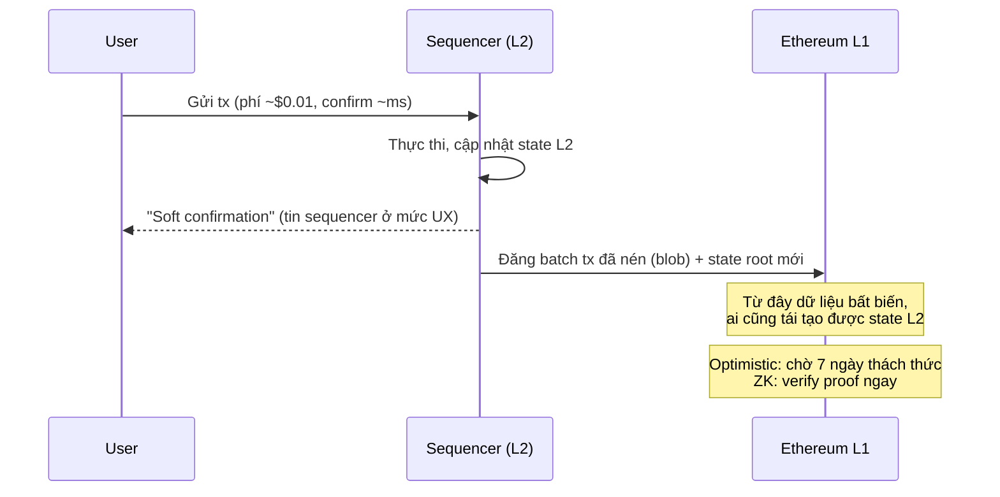

+++
title = "Level 6 – Scaling: Layer 2, Rollup, Sharding"
date = "2026-07-19T08:00:00+07:00"
draft = false
tags = ["backend", "blockchain", "web3"]
series = ["Blockchain cho Backend Engineer"]
+++

> **Câu hỏi trung tâm:** Vì sao không thể scale blockchain như scale backend (thêm server, thêm shard), và các giải pháp thực tế đánh đổi điều gì?

---

## 1. Problem Statement

Backend truyền thống scale bằng cách **chia việc**: thêm instance sau load balancer, shard database, mỗi node xử lý một phần. Blockchain L1 không làm vậy được, vì nguyên tắc nền tảng (Level 3): **mọi full node thực thi lại mọi transaction để tự verify**. Thêm node không tăng throughput — chỉ tăng số bản sao của cùng một công việc.

Muốn tăng throughput L1 chỉ có cách tăng "cấu hình tối thiểu của một node" (block to hơn, nhanh hơn) — nhưng khi đó ít người chạy nổi node → ít người tự verify → tập trung hóa. Đây là **Blockchain Trilemma**:

```
        Decentralization
              ▲
             ╱ ╲        Chỉ chọn được ~2/3:
            ╱   ╲       - Bitcoin/Ethereum L1: Decentralization + Security, hy sinh Scalability
           ╱     ╲      - Solana: Scalability + Security, node đòi hỏi phần cứng lớn
          ▼───────▼     - Chain "nghìn TPS, 5 validator": Scalability + ..., hy sinh cả hai
   Security      Scalability
```

Con số để cảm nhận vấn đề: Ethereum L1 ~15-30 TPS, Visa trung bình ~2.000-6.000 TPS. Gas spike 2021: một lần swap trên Uniswap có lúc tốn $100-500. Không scale thì blockchain mãi là hệ thống cho giao dịch giá trị lớn.

## 2. Khung tư duy: tách 4 chức năng của một blockchain

Một chain "monolithic" làm cả 4 việc; các giải pháp scale về bản chất là **tách và ủy quyền** một số việc:

| Chức năng | Nội dung | Ai làm trong mô hình rollup |
|---|---|---|
| **Execution** | Chạy tx, tính state mới | L2 (off-chain, tập trung cũng được) |
| **Settlement** | Phân xử tranh chấp, nơi tài sản "thật sự" nằm | L1 |
| **Consensus/Ordering** | Thứ tự tx | L1 (rollup đăng dữ liệu theo thứ tự lên L1) |
| **Data Availability (DA)** | Đảm bảo dữ liệu tx được công bố để ai cũng tái tạo được state | L1 (calldata/blob) hoặc DA layer riêng (Celestia) |

Đây là nguồn gốc cụm từ "modular blockchain". Nắm được bảng này thì mọi giải pháp scaling chỉ là các cách điền ô khác nhau.

## 3. Rollup — hướng chính thống của Ethereum

### 3.1. Ý tưởng cốt lõi

> Thực thi tx **off-chain** (một sequencer duy nhất, nhanh như server thường), nhưng **đăng dữ liệu tx + cam kết state lên L1**, và có cơ chế mật mã/kinh tế để L1 **cưỡng chế tính đúng đắn** của kết quả.

Người dùng được thừa hưởng an ninh của L1 (không cần tin sequencer về *tính đúng*), trong khi chi phí thực thi giảm 10-100 lần vì L1 chỉ verify chứ không re-execute tất cả.



### 3.2. Optimistic Rollup (Arbitrum, OP Mainnet/Base)

- **Giả định lạc quan:** state root sequencer đăng lên là đúng, *trừ khi có người chứng minh ngược lại*.
- **Fraud proof:** trong **challenge window (~7 ngày)**, bất kỳ ai chạy lại batch và thấy sai có thể nộp bằng chứng gian lận → L1 revert state root, phạt sequencer (slash bond).
- Trust model: chỉ cần **1 người trung thực** trên thế giới đang verify là hệ thống an toàn.
- Cái giá: **rút tiền về L1 mất 7 ngày** (chờ hết window). Hệ sinh thái vá bằng liquidity bridge (bên thứ ba ứng tiền trước, thu phí — thêm một lớp trust).

### 3.3. ZK Rollup (zkSync, Starknet, Scroll, Linea)

- Sequencer nộp kèm **validity proof** (SNARK/STARK): bằng chứng toán học ngắn gọn rằng "state root mới là kết quả đúng của việc thực thi batch này".
- L1 verify proof trong một tx (~vài trăm nghìn gas) — **đúng đắn được đảm bảo bằng toán, không cần chờ ai thách thức**.
- Rút tiền nhanh (giờ, không phải 7 ngày). Nhược: sinh proof tốn tính toán lớn (prover farm), mạch chứng minh phức tạp (rủi ro bug ở chính prover/verifier), EVM-compatibility khó hơn (zkEVM).

### 3.4. Optimistic vs ZK

| | Optimistic | ZK |
|---|---|---|
| Cơ chế đúng đắn | Kinh tế + trò chơi (fraud proof) | Toán học (validity proof) |
| Rút về L1 | ~7 ngày | Giờ |
| Chi phí vận hành | Thấp (chỉ re-execute khi có tranh chấp) | Cao (prover) |
| EVM tương thích | Gần hoàn hảo | Đang tiệm cận |
| Giả định an ninh | ≥1 verifier trung thực + kiểm duyệt được L1 | Đúng đắn của mạch + trusted setup (với SNARK) |

### 3.5. Điểm tập trung hóa của rollup hiện tại — backend engineer phải biết

- **Sequencer hầu hết là MỘT server duy nhất của một công ty.** Sequencer sập → L2 ngừng nhận tx (Arbitrum, Polygon zkEvm đều từng downtime giờ-dài). Sequencer không đánh cắp được tiền (L1 cưỡng chế) nhưng **có thể kiểm duyệt và ngừng phục vụ** — có escape hatch qua L1 nhưng chậm và đắt.
- "Soft confirmation" của sequencer chỉ là lời hứa cho đến khi batch lên L1. Backend ghi sổ giá trị lớn trên L2 cần phân biệt: *sequencer confirm* (ms) vs *đã đăng lên L1* (phút-giờ) vs *L1 finalized*.

## 4. Các hướng khác

### 4.1. Sidechain (Polygon PoS, BNB Chain thời kỳ đầu, Ronin)

Chain độc lập, consensus riêng (thường ít validator), có bridge sang L1. **Không thừa hưởng an ninh L1** — an ninh = validator set của chính nó. Nhanh, rẻ, EVM đầy đủ; nhưng "checkpoint lên Ethereum" của Polygon không biến nó thành rollup — nếu 2/3 validator Polygon thông đồng, tiền mất. Ronin (sidechain của Axie) bị hack $624M vì chỉ cần 5/9 key.

**Quy tắc phân biệt nhanh:** hỏi *"nếu toàn bộ validator của chain này độc hại, L1 có cứu được tiền của tôi không?"* — Rollup: có (dữ liệu trên L1, tự rút bằng proof). Sidechain: không.

### 4.2. State Channel (Lightning Network)

Hai bên khóa tiền on-chain, giao dịch off-chain bằng cách trao đổi state đã ký lẫn nhau, chỉ đăng kết quả cuối lên chain. Ưu: TPS vô hạn giữa 2 bên, phí ~0, private. Nhược: chỉ hợp thanh toán lặp lại giữa tập cố định, phải online để chống gian lận (watchtower), khóa vốn trước. Phù hợp micro-payment; không hợp logic phức tạp đa bên.

### 4.3. Sharding và Data Availability

Sharding "cổ điển" (chia execution thành N shard) đã bị Ethereum **từ bỏ** vì độ phức tạp cross-shard. Hướng hiện tại: **rollup lo execution, L1 chỉ scale phần data availability**:

- **EIP-4844 (blobs, 2024):** tx mang theo "blob" dữ liệu ~128KB, node chỉ giữ ~18 ngày (đủ cho challenge window), rẻ hơn calldata hàng chục lần → phí L2 giảm ~10x ngay khi kích hoạt.
- **Danksharding (tương lai):** node chỉ cần sample ngẫu nhiên một phần blob để xác suất-đảm-bảo toàn bộ dữ liệu tồn tại (**Data Availability Sampling**) → scale DA mà không tăng yêu cầu node.
- **Celestia, EigenDA:** DA layer chuyên dụng ngoài Ethereum — rẻ hơn nữa, đổi bằng việc an ninh DA không còn là an ninh Ethereum ("validium" mode).

Vì sao DA quan trọng đến vậy: nếu sequencer giữ dữ liệu tx mà không công bố, không ai tái tạo được state → không ai chứng minh gian lận / tự rút tiền được, *kể cả khi state root trên L1 đúng*. **DA là điều kiện để "thoát hiểm không cần xin phép" — linh hồn của rollup.**

### 4.4. App-chain (Cosmos, Polkadot)

Hướng ngược lại: mỗi ứng dụng một chain riêng (Cosmos SDK/Tendermint), chủ quyền đầy đủ (fee model riêng, governance riêng), nối nhau qua IBC. dYdX v4 rời Ethereum sang Cosmos vì cần orderbook throughput mà không rollup nào thời điểm đó đáp ứng. Đổi lại: tự lo validator set và an ninh kinh tế của riêng mình.

## 5. Tác động lên thiết kế Backend (phần thực dụng nhất)

Multi-chain giờ là mặc định: sản phẩm thường ở đồng thời Ethereum + 2-5 L2. Hệ quả:

- **Trừu tượng hóa chain trong code:** `ChainConfig {chainId, rpcs[], confirmationPolicy, gasStrategy, contracts{}}` — mọi service nhận chainId làm tham số. Đừng if/else theo tên chain rải rác.
- **Confirmation policy phải theo từng chain:** L1 finalized ~13 phút; Arbitrum cần phân biệt sequencer-confirm/L1-posted; Polygon PoS từng reorg sâu hàng chục block. Một hằng số `CONFIRMATIONS = 12` dùng chung là bug.
- **Phí và giới hạn khác nhau:** gas trên L2 gồm 2 phần (execution L2 + chi phí đăng DA lên L1) — công thức ước phí khác L1; một số RPC method hành xử khác.
- **Bridge là điểm rủi ro nhất hệ thống:** tổng thiệt hại bridge hack > $2.5 tỷ (Ronin $624M, Wormhole $326M, Nomad $190M). Nếu sản phẩm phải tích hợp bridge: coi bridge như đối tác rủi ro tín dụng, giới hạn hạn mức, monitor tồn quỹ hai đầu (chi tiết trong file System Design & Failure Cases).

```javascript
// Node.js: confirmation policy theo chain — mẫu tối giản
const CHAIN_POLICY = {
  1:      { kind: "ethereum",  safeTag: "finalized" },              // ETH L1
  42161:  { kind: "op-rollup", softOk: true, hardCheck: "l1Posted" }, // Arbitrum
  137:    { kind: "pos-side",  minDepth: 128 },                     // Polygon PoS
  10:     { kind: "op-rollup", softOk: true, hardCheck: "l1Posted" }, // OP
};
async function isCredited(chainId, receipt, valueUsd) {
  const p = CHAIN_POLICY[chainId];
  if (valueUsd < 100 && p.softOk) return true;              // giá trị nhỏ: nhận soft-confirm
  if (p.safeTag) {                                          // L1: chờ finalized
    const fin = await providers[chainId].getBlock(p.safeTag);
    return receipt.blockNumber <= fin.number;
  }
  if (p.minDepth) {                                          // sidechain: depth lớn
    const head = await providers[chainId].getBlockNumber();
    return head - receipt.blockNumber >= p.minDepth;
  }
  return checkBatchPostedToL1(chainId, receipt);             // rollup: đã lên L1 chưa
}
```

## 6. Anti-patterns

- Coi mọi L2 là "Ethereum rẻ hơn" và dùng chung mọi giả định (finality, reorg, RPC behavior).
- Ghi sổ số tiền lớn dựa trên soft-confirmation của sequencer.
- Chọn chain theo TPS quảng cáo mà không hỏi: bao nhiêu validator? ai chạy sequencer? DA ở đâu? escape hatch thế nào?
- Tích hợp bridge bên thứ ba mà không có hạn mức và monitoring độc lập.
- Bỏ qua chi phí DA khi ước phí trên L2 (phí L2 dao động theo giá blob L1).

## 7. Khi nào KHÔNG cần L2

- Ứng dụng ít giao dịch, giá trị lớn (custody, settlement liên ngân hàng) → L1 an toàn nhất, phí không thành vấn đề.
- Ứng dụng cần độ trễ sub-giây và không cần trustless từng lệnh → off-chain + settle định kỳ (mô hình CEX/state channel) thay vì cố nhét vào rollup.
- Chưa có product-market fit → đa chain sớm là gánh nặng vận hành nhân N.

## 8. Tóm tắt Level 6

- L1 không scale bằng thêm node vì mọi node lặp lại toàn bộ công việc; trilemma buộc phải đánh đổi.
- Rollup = execution off-chain + dữ liệu & cưỡng chế đúng đắn on-chain; Optimistic dùng fraud proof (chờ 7 ngày), ZK dùng validity proof (toán học).
- Sidechain KHÔNG thừa hưởng an ninh L1 — phép thử: "validator toàn độc hại, L1 có cứu được không?"
- Data Availability là linh hồn của rollup; EIP-4844/danksharding scale DA thay vì execution.
- Với backend: multi-chain là mặc định — config-driven chain abstraction, confirmation policy per-chain, bridge = rủi ro lớn nhất.

**Tiếp theo — Level 7:** ghép tất cả lại thành các pattern tích hợp backend cụ thể: wallet auth, transaction queue, nonce management, event-driven pipeline, outbox.
