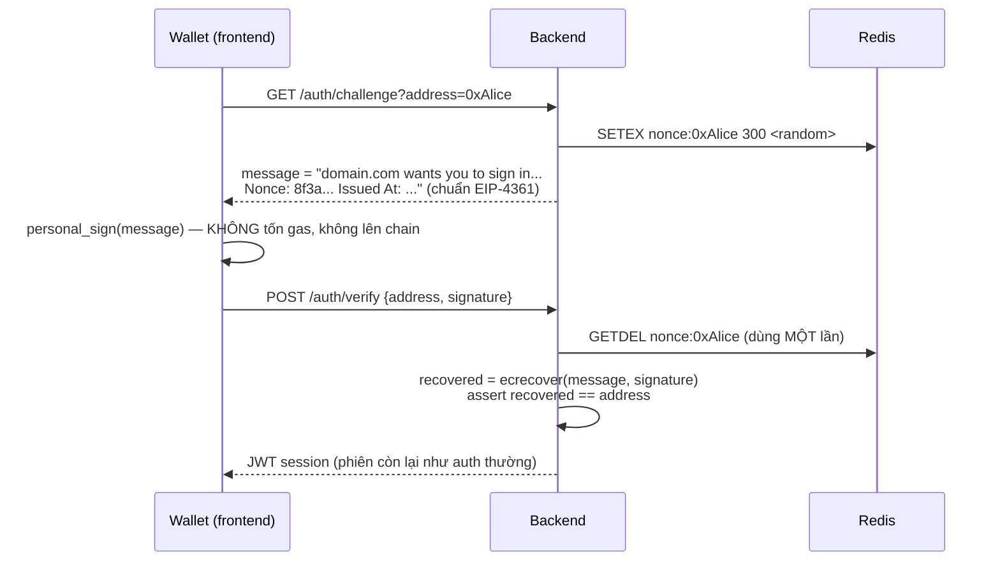
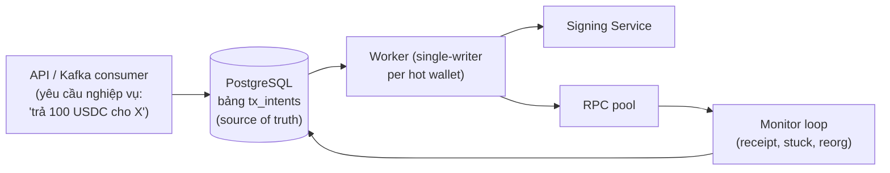
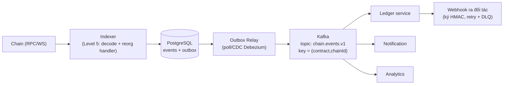

+++
title = "Level 7 – Backend Integration Patterns"
date = "2026-07-19T08:10:00+07:00"
draft = false
tags = ["backend", "blockchain", "web3"]
series = ["Blockchain cho Backend Engineer"]
+++

> **Câu hỏi trung tâm:** Ghép mọi kiến thức trước đó thành các pattern code cụ thể: auth bằng ví, gửi tx tin cậy từ backend, và pipeline event-driven chống reorg.

Đây là level "ứng dụng" — mỗi pattern dưới đây giải một failure mode có thật trong production.

---

## 1. Wallet Authentication (Sign-In with Ethereum)

### Problem statement

Đăng nhập không cần password: user chứng minh sở hữu address bằng chữ ký. Sai lầm chết người của cách làm ngây thơ: cho user ký một message cố định → chữ ký bị **replay** (kẻ trộm được chữ ký cũ đăng nhập mãi mãi).

### Thiết kế đúng: challenge-response + nonce một lần



```go
// Golang: verify chữ ký EIP-191 (personal_sign)
func VerifySig(address, message string, sig []byte) bool {
	if len(sig) != 65 { return false }
	if sig[64] >= 27 { sig[64] -= 27 } // chuẩn hóa v
	prefixed := fmt.Sprintf("\x19Ethereum Signed Message:\n%d%s", len(message), message)
	hash := crypto.Keccak256([]byte(prefixed))
	pub, err := crypto.SigToPub(hash, sig)
	if err != nil { return false }
	return strings.EqualFold(crypto.PubkeyToAddress(*pub).Hex(), address)
}
```

Checklist production: message theo chuẩn **EIP-4361** (chứa domain — chống phishing site lấy chữ ký dùng chéo, nonce, expiry, chainId); nonce một lần có TTL; hỗ trợ **EIP-1271** nếu user là smart contract wallet (gọi `isValidSignature` trên contract thay vì ecrecover); auth xong dùng session thường — đừng bắt ký mỗi request.

---

## 2. Transaction Service: gửi tx từ backend một cách tin cậy

Đây là service khó nhất trong mọi hệ Web3. Gom 4 bài toán: **idempotency, nonce, retry/stuck, confirmation** — thiết kế như một state machine bền vững (persistent).

### 2.1. Kiến trúc tổng



Nguyên tắc số 1: **ý định giao dịch (intent) ghi vào DB trước, mọi thứ sau đó là state machine chuyển trạng thái từng bước, mỗi bước idempotent, phục hồi được sau crash ở bất kỳ điểm nào.**

```sql
CREATE TABLE tx_intents (
  id            UUID PRIMARY KEY,
  idempotency_key TEXT UNIQUE NOT NULL,  -- từ nghiệp vụ: "payout:invoice-123"
  chain_id      BIGINT NOT NULL,
  from_wallet   TEXT NOT NULL,
  payload       JSONB NOT NULL,          -- to, value, data
  status        TEXT NOT NULL,           -- created→signed→broadcast→mined→confirmed | replaced|failed
  nonce         BIGINT,                  -- gán khi ký
  signed_raw    BYTEA,                   -- tx đã ký — để re-broadcast AN TOÀN
  tx_hash       TEXT,
  block_number  BIGINT, block_hash TEXT,
  broadcast_at  TIMESTAMPTZ, updated_at TIMESTAMPTZ
);
```

### 2.2. Idempotency — hai tầng

1. **Tầng nghiệp vụ:** `idempotency_key` UNIQUE — request "trả tiền invoice-123" đến 2 lần chỉ tạo 1 intent. Đây là chốt chặn quan trọng nhất chống double-payout.
2. **Tầng chain:** retry luôn **re-broadcast `signed_raw` cũ** (cùng hash — chain tự dedupe), *không bao giờ* ký lại tx mới cho cùng intent khi chưa xác định số phận tx cũ. Ký lại với nonce mới trong khi tx cũ còn sống = trả tiền 2 lần.

### 2.3. Nonce Management

Sai lầm phổ biến: mỗi worker tự hỏi `eth_getTransactionCount` → race. Thiết kế đúng — **single allocator per (chain, wallet)**:

```go
// Golang: nonce allocator dùng Postgres làm nguồn sự thật
// Bảng: wallet_nonces(chain_id, address, next_nonce) — 1 row/ví
func (a *Allocator) Next(ctx context.Context, chain int64, addr string) (uint64, error) {
	tx, err := a.db.BeginTx(ctx, nil)
	if err != nil { return 0, err }
	defer tx.Rollback()
	var n uint64
	// row lock đảm bảo tuần tự tuyệt đối kể cả nhiều instance
	err = tx.QueryRowContext(ctx,
		`SELECT next_nonce FROM wallet_nonces
		 WHERE chain_id=$1 AND address=$2 FOR UPDATE`, chain, addr).Scan(&n)
	if err != nil { return 0, err }
	_, err = tx.ExecContext(ctx,
		`UPDATE wallet_nonces SET next_nonce=$1
		 WHERE chain_id=$2 AND address=$3`, n+1, chain, addr)
	if err != nil { return 0, err }
	return n, tx.Commit()
}
```

Quy tắc vận hành đi kèm:

- **Đồng bộ định kỳ với chain:** so `next_nonce` với `eth_getTransactionCount(addr, "pending")`; lệch → alert (có tx ngoài hệ thống? DB sai?). Tuyệt đối không cho người/hệ khác gửi tx từ hot wallet.
- **Nonce gap là sự cố P1:** tx nonce N chết (bị drop) → toàn bộ N+1, N+2... kẹt. Xử lý: gửi lại tx nonce N (từ `signed_raw`), hoặc phát tx "filler" (self-transfer 0 ETH, nonce N, gas cao) để thông cống.
- **Nhiều hot wallet song song** thay vì một ví nonce cao — nonce là tuần tự per-account, ví là đơn vị scale ngang tự nhiên.

### 2.4. Stuck transaction và Replacement

```
Monitor loop mỗi 30s, với mỗi tx ở trạng thái broadcast:
  receipt != null            → mined; ghi block_number/hash
  pending quá T (vd 3 phút)  → SPEED-UP: ký lại CÙNG nonce, cùng payload,
                               gas × 1.15+ → broadcast (2 tx cùng nonce,
                               chain chỉ nhận 1 — track cả 2 hash!)
  cần hủy                    → CANCEL: cùng nonce, self-transfer 0, gas cao hơn
  không còn trong mempool và không mined (đã drop) → re-broadcast signed_raw
```

Chú ý sự tinh tế: sau speed-up, intent có **nhiều candidate hash** — receipt có thể về ở bất kỳ hash nào. Bảng phụ `tx_attempts(intent_id, tx_hash, gas_price, created_at)` và monitor check tất cả.

### 2.5. Confirmation tracking + Reorg handling

Trạng thái `mined` chưa phải kết thúc (Level 2). Monitor tiếp:

```
mined → mỗi block mới:
  depth = head - block_number
  block_hash tại block_number còn khớp?   ← phát hiện reorg
    khớp && depth ≥ policy(chain, giá trị) → confirmed (chốt sổ, phát event nghiệp vụ)
    không khớp → reorged: quay về broadcast, re-broadcast signed_raw
```

**Chỉ ở `confirmed` mới được phát side-effect nghiệp vụ** (ghi ledger, gửi email "đã thanh toán", cho rút). Đây là điểm phân biệt hệ làm đúng với hệ sẽ gặp sự cố.

---

## 3. Event-driven pipeline: từ chain vào Kafka

### 3.1. Kiến trúc chuẩn



### 3.2. Outbox pattern — vì sao bắt buộc ở đây

Indexer ghi event vào PostgreSQL **và** publish Kafka = ghi 2 hệ thống = dual-write problem (crash giữa 2 thao tác → mất hoặc lặp event). Outbox giải quyết: trong **cùng một DB transaction** với dữ liệu event, ghi thêm row vào bảng `outbox`; relay riêng đọc outbox và publish Kafka (at-least-once), consumer idempotent theo `event_id = (chain_id, tx_hash, log_index)`.

Điểm hay: kỷ luật idempotency mà blockchain ép bạn có (event id tự nhiên, duy nhất toàn cầu) làm outbox ở đây *dễ hơn* hệ thường.

### 3.3. Chiến lược phát event trước/sau finality

Hai nhu cầu mâu thuẫn: UX muốn biết ngay (pending/1-conf), sổ sách cần chắc chắn (finalized). Giải pháp chuẩn — **phát 2 loại event tách bạch**:

```
chain.events.observed.v1   — ngay khi thấy (có thể bị thu hồi!)
                             kèm field: depth, finalized=false
chain.events.finalized.v1  — chỉ khi đủ policy; KHÔNG BAO GIỜ thu hồi
chain.events.reverted.v1   — thu hồi một observed event (do reorg)
```

Consumer loại nào nghe topic nấy: notification nghe observed (kèm chữ "đang xác nhận"), ledger **chỉ** nghe finalized. Đừng bắt mọi consumer tự hiểu reorg — tập trung độ phức tạp vào indexer.

### 3.4. Webhook ra bên ngoài

Chuẩn ngành (giống Stripe): ký payload bằng HMAC + timestamp (chống replay), retry exponential backoff có jitter tối đa N lần → DLQ, endpoint đối tác phải idempotent theo `event_id`, kèm API "list events" để đối tác đối soát khi miss webhook. **Đừng phát webhook từ dữ liệu chưa finalized nếu đối tác dùng nó để ghi sổ.**

---

## 4. Multi-chain support

- **Config-driven:** mỗi chain một object cấu hình (rpc pool, chainId, confirmation policy, gas strategy, địa chỉ contract, decimals của native token). Thêm chain mới = thêm config + test, không sửa logic.
- **Chuẩn hóa đơn vị sớm:** mọi amount trong hệ nội bộ là **integer string của đơn vị nhỏ nhất** (wei, lamports) + decimals. Không bao giờ float. Bug làm tròn số tiền là bug không được phép tồn tại.
- **Địa chỉ:** checksum (EIP-55) khi hiển thị, lowercase khi làm key DB; các chain non-EVM (Solana base58, Cosmos bech32) cần validator riêng — đừng regex Ethereum cho tất cả.
- Non-EVM khác biệt sâu (Solana: không nonce tuần tự mà là recent blockhash hết hạn ~60s; UTXO: chọn coin) → tách adapter per-chain-family sau một interface chung `ChainClient`.

## 5. Anti-patterns tổng hợp của level này

- Ghi sổ khi thấy tx hash / khi `mined` chưa `confirmed`.
- Ký tx mới khi retry thay vì re-broadcast signed tx cũ.
- Nhiều worker tự lấy nonce từ RPC (race) hoặc một hot wallet duy nhất cho mọi payout (nonce = nút cổ chai + khi kẹt là kẹt tất).
- Message ký login tĩnh, không domain, không nonce, không expiry.
- Publish Kafka và ghi DB không qua outbox (dual-write).
- Webhook không chữ ký, không retry, không cách đối soát.
- Float cho số tiền; lẫn lộn đơn vị (1 USDC = 10^6, 1 ETH = 10^18 — hard-code 18 cho mọi token là bug kinh điển).

## 6. Tóm tắt Level 7

- Wallet auth = challenge-response + EIP-4361 + nonce một lần + EIP-1271 cho contract wallet.
- Transaction service = persistent state machine: intent → signed → broadcast → mined → confirmed, idempotent hai tầng (business key + re-broadcast signed_raw).
- Nonce: cấp phát tập trung có lock, đồng bộ định kỳ với chain, nonce gap là P1, scale bằng nhiều ví.
- Sự thật nghiệp vụ chỉ sinh ra ở `confirmed` (theo policy per-chain); reorg đưa tx quay lại vòng đời.
- Pipeline: indexer → outbox → Kafka; tách topic observed/finalized/reverted; consumer idempotent theo (chainId, txHash, logIndex).

**Tiếp theo — Level 8:** vận hành tất cả những thứ trên: deployment, HA, monitoring, DR và tối ưu chi phí.
