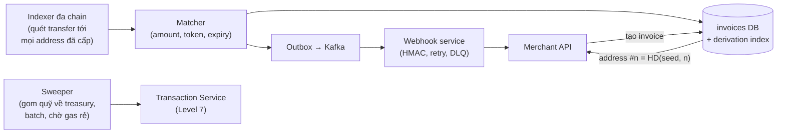
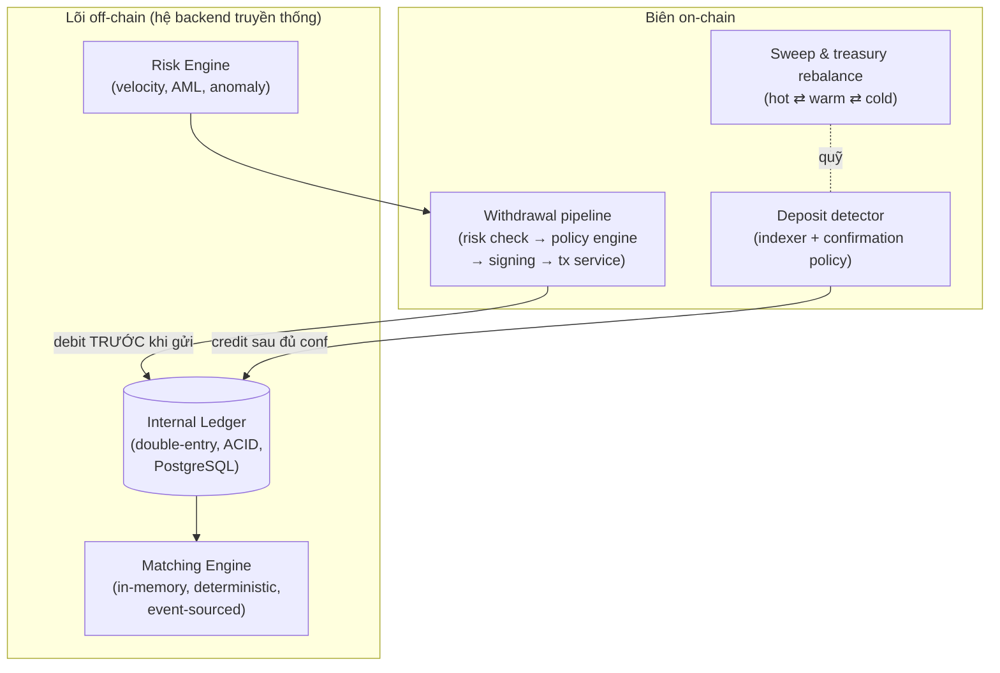
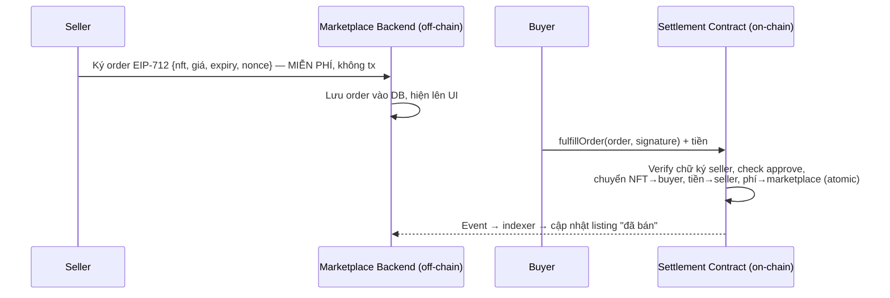
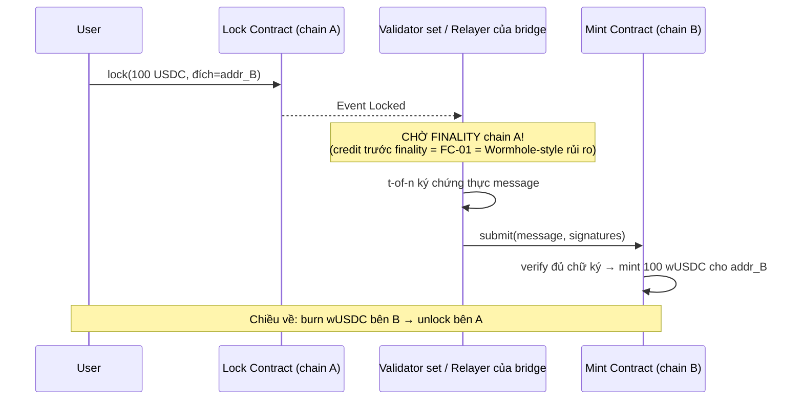

+++
title = "11 – Blockchain System Design"
date = "2026-07-19T08:50:00+07:00"
draft = false
tags = ["backend", "blockchain", "web3"]
series = ["Blockchain cho Backend Engineer"]
+++

> Thiết kế 6 hệ thống thực tế, từ yêu cầu đến kiến trúc. Mỗi bài dùng lại các building block đã xây ở Level 5-8: RPC gateway, indexer, transaction service, signing service, outbox/Kafka. Đọc như tài liệu interview system design.

---

## SD-1. Crypto Payment Gateway (nhận thanh toán crypto cho merchant)

**Yêu cầu:** Merchant tạo hóa đơn → user trả bằng crypto → gateway xác nhận và báo merchant (webhook), hỗ trợ nhiều chain + stablecoin; sai sót ghi sổ = mất tiền thật.

**Quyết định thiết kế then chốt:**

1. **Nhận diện thanh toán thế nào?** Hai lựa chọn: (a) mỗi hóa đơn một **deposit address riêng** (HD wallet, Level 1 §5.5) — sạch, không cần user làm gì thêm, nhưng phải quét N address; (b) một address chung + yêu cầu memo/số tiền duy nhất — tiết kiệm nhưng dễ lỗi user. Chuẩn ngành: **(a)**.
2. **Bao giờ coi là "đã trả"?** Confirmation policy theo giá trị + chain (Level 2, 6). Hóa đơn $10 trên L2: giây. Hóa đơn $50k trên Ethereum: finalized.
3. **Underpay/overpay/trả trễ** — nghiệp vụ thật: hóa đơn hết hạn nhưng tiền vẫn đến (chain không hủy được!). State machine hóa đơn phải có các trạng thái này, và tiền-đến-muộn cần quy trình refund/credit.

Điểm hay bị quên: **sweep** (gom tiền từ nghìn deposit address về treasury) là luồng tốn gas nhất — batch + chạy lúc gas rẻ; với token ERC-20 mỗi address cần cả native token để trả gas sweep (mẫu giải: EIP-2612 permit khi có, hoặc "gas station" nạp gas kèm sweep trong 1 tx qua contract).

---

## SD-2. Custody / Exchange Wallet System (CEX)

**Yêu cầu:** Giữ tiền hàng triệu user, nạp/rút 24/7, khớp lệnh nội bộ tốc độ cao, không được mất tiền.

**Insight kiến trúc trung tâm:** CEX là **ngân hàng có sổ cái nội bộ off-chain**. Trade giữa 2 user không chạm chain — chỉ là update 2 row trong ledger DB (vì thế mới nhanh/miễn phí). Chain chỉ xuất hiện ở **biên**: nạp và rút.

**Các bất biến (invariant) phải giữ bằng mọi giá:**

- **Solvency:** Σ số dư ledger nội bộ ≤ Σ tài sản on-chain thực. Job đối soát chạy liên tục, lệch → freeze rút + P1. (Proof-of-reserves = phiên bản công khai của phép kiểm này.)
- **Rút tiền:** debit ledger *trước*, gửi tx *sau*, tx fail thì credit lại — không bao giờ ngược thứ tự (ngược = double-spend cửa sổ).
- **Double-entry ledger:** mọi thay đổi số dư là bút toán 2 chiều có đối ứng; cấm UPDATE balance trực tiếp. Đây là công nghệ kế toán 700 tuổi và vẫn là phòng tuyến chống bug ghi sổ tốt nhất.
- Nạp: credit chỉ sau confirmation policy; số tiền lớn thêm review.

Phân tầng quỹ + signing đã trình bày ở Level 5 §5.3 và file Security. Rủi ro đặc thù: token blacklist (USDT có thể freeze hot wallet), token độc khi list (test fork), reorg-double-spend với chain nhỏ (FC-01).

---

## SD-3. Blockchain Explorer

**Yêu cầu:** Tra cứu block/tx/address bất kỳ, số dư token, decode contract call — trên toàn bộ lịch sử chain.

**Bản chất:** Bài toán **ETL + serving** thuần túy, không có tx gửi đi — hệ đọc-only lớn. Đây là bài system design "indexer maximal":

- Nguồn: archive node (bắt buộc — cần state lịch sử + `trace` để thấy internal transaction: ETH chuyển qua contract call không hiện trong tx list thường).
- Pipeline: backfill toàn lịch sử (song song theo range, hàng tuần với Ethereum) + realtime bám head + reorg unwind.
- Storage: câu hỏi thú vị nhất. Khối lượng: Ethereum ~2 tỷ tx. PostgreSQL partition theo block range vẫn phục vụ tốt lookup theo key (tx hash, address); analytics (top holders, biểu đồ) đẩy sang ClickHouse. Address là hot key phân bố cực lệch (sàn lớn có chục triệu tx) → phân trang theo `(address, block_number)` index, đừng OFFSET.
- Decode: bảng ABI/signature database (4-byte directory) để hiển thị `transfer(...)` thay vì hex; verify source code contract là tính năng cộng đồng quan trọng.

**Bài học chuyển giao:** mọi công ty Web3 cuối cùng đều build "explorer nội bộ" thu nhỏ — chính là indexer Level 5 với schema theo nghiệp vụ của mình.

---

## SD-4. NFT Marketplace (mô hình hybrid kinh điển)

**Yêu cầu:** List/bid/mua NFT, phí thấp, UX nhanh, không giữ tài sản của user (non-custodial).

**Insight trung tâm — mô hình OpenSea/Seaport:** listing KHÔNG nằm on-chain. Listing = **order đã ký (EIP-712 typed signature) lưu trong PostgreSQL của marketplace**. Chỉ khi khớp lệnh mới có 1 tx on-chain: contract verify chữ ký order + chuyển NFT ⇄ tiền **atomic trong 1 tx**.

Trade-off được chọn: **trust marketplace về tính sẵn sàng của orderbook** (họ có thể ẩn/kiểm duyệt order) nhưng **không trust về tài sản** (NFT nằm trong ví user tới giây khớp lệnh, backend marketplace bị hack cũng không lấy được NFT — chỉ lộ order đã công khai). Đây là ví dụ đẹp nhất về ranh giới on-chain/off-chain đặt đúng chỗ.

Cạm bẫy nghiệp vụ: hủy listing off-chain không đủ (chữ ký đã phát tán vẫn hợp lệ!) → hủy thật phải on-chain (tăng nonce trong contract); backend phải theo dõi NFT đổi chủ/revoke approve để ẩn listing chết (indexer!); royalty là bài toán chính sách không giải nổi bằng thuần kỹ thuật.

---

## SD-5. DEX aggregator backend / Token Swap Service

**Yêu cầu:** User swap token giá tốt nhất; backend tìm route qua các DEX (Uniswap, Curve...), báo giá, xây tx cho user ký.

- **Quote engine:** đọc reserves/tick của các pool (multicall batch qua RPC, cache 1-2 block), thuật toán route (chia lệnh qua nhiều pool giảm slippage). Latency mục tiêu < 200ms → cache pool state trong Redis, cập nhật theo event.
- **Backend không cầm tiền, không ký** — chỉ trả calldata; user tự ký. Trách nhiệm chính: **tính đúng minAmountOut** (slippage guard) và deadline — sai là user bị sandwich (Level 3 §3.2).
- Điều bất ngờ với backend engineer: quote là **bài toán đọc-nhiều khắc nghiệt** — hàng nghìn pool × mỗi block đổi. Kiến trúc: event-driven cache invalidation (pool nào có Swap event mới thì mới refetch), không poll tất cả.
- Revert vẫn xảy ra (giá đổi giữa quote và execute) → UX phải xử lý: simulate trước khi gửi (`eth_call`), tự động re-quote.

---

## SD-6. Cross-chain Bridge (thiết kế và vì sao nó khó đến vậy)

**Yêu cầu:** Chuyển tài sản chain A → chain B.

**Mô hình lock-and-mint:**

**Vì sao bridge là nơi mất tiền nhiều nhất ngành (FC-11):** nó cô đọng mọi cái khó — (1) két lock khổng lồ một chỗ; (2) bộ verify message xuyên chain (bug verify = mint không thế chấp = in tiền giả); (3) phải hiểu finality của *cả hai* chain (credit trước reorg = double); (4) validator set riêng thường nhỏ (Ronin 5/9).

**Bài học thiết kế nếu buộc phải làm:** verify càng trustless càng tốt (light client/ZK proof của chain nguồn > multisig); chờ finality tuyệt đối; rate limit + cap theo chu kỳ (giới hạn thiệt hại như hot wallet); đối soát locked vs minted liên tục, lệch = tự động pause; upgrade qua timelock công khai.

---

## Mẫu chung rút ra từ 6 bài

1. **Mọi hệ đều là hybrid:** phần trustless tối thiểu on-chain (custody của user, settlement, verify), phần còn lại là backend truyền thống. Nghệ thuật nằm ở **vẽ đúng ranh giới**.
2. **Indexer + transaction service + signing service là 3 building block dùng lại ở mọi bài** — đầu tư làm chuẩn một lần.
3. **Confirmation policy và reorg handling xuất hiện ở mọi luồng tiền vào**; debit-trước-gửi-sau ở mọi luồng tiền ra.
4. **Ledger nội bộ double-entry + đối soát on-chain liên tục** là xương sống của mọi hệ giữ tiền.
5. Câu hỏi phỏng vấn hay nhất cho mọi thiết kế Web3: *"chuyện gì xảy ra khi reorg / khi gas spike ×30 / khi RPC chết / khi key lộ?"* — thiết kế tốt có sẵn câu trả lời trong kiến trúc, không phải trong hy vọng.
