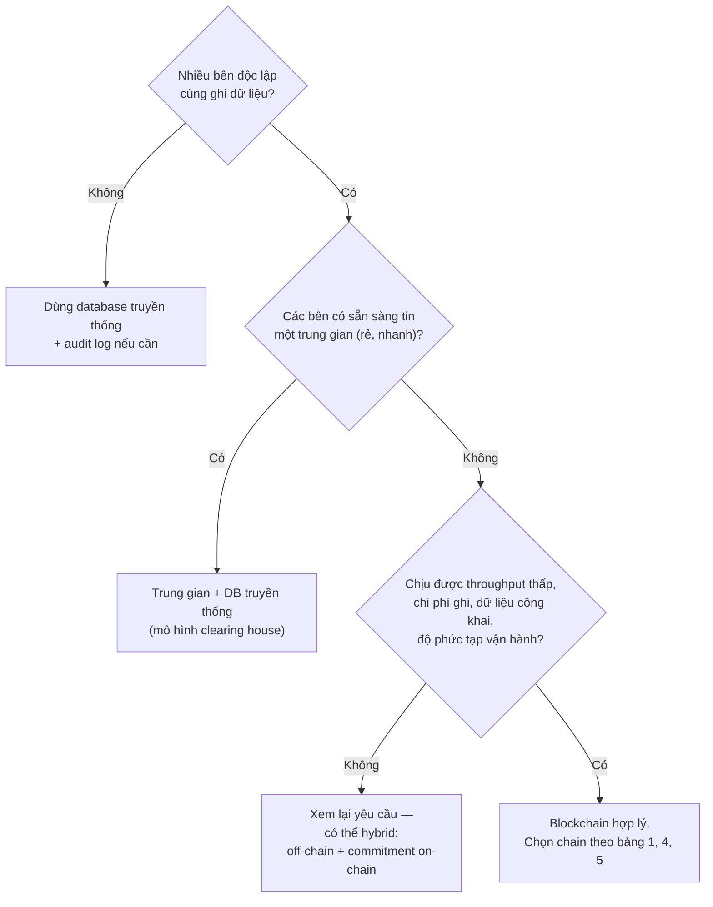

+++
title = "12 – So sánh tổng hợp"
date = "2026-07-19T09:00:00+07:00"
draft = false
tags = ["backend", "blockchain", "web3"]
series = ["Blockchain cho Backend Engineer"]
+++

> Các bảng so sánh khách quan, gom về một chỗ để tra cứu. Mỗi bảng đánh giá theo: hiệu năng, bảo mật, độ phức tạp, khả năng mở rộng, chi phí vận hành, use case phù hợp.

---

## 1. Bitcoin vs Ethereum vs Solana

| Tiêu chí | Bitcoin | Ethereum | Solana |
|---|---|---|---|
| Mục tiêu thiết kế | Tiền tệ phi tập trung, bất biến tối đa | Nền tảng smart contract tổng quát | Hiệu năng cao, chi phí thấp |
| Model | UTXO | Account | Account (song song hóa) |
| Consensus | PoW Nakamoto | PoS Gasper | PoS + PoH + Tower BFT |
| Block time / Finality | ~10 phút / probabilistic (~60' quy ước) | 12s / ~13 phút finalized | ~400ms / ~13s rooted |
| TPS thực tế | ~7 | ~15-30 (L1) + L2 | ~2.000-4.000 (thực tế, không tính vote) |
| Phí điển hình | $0.5-20+ | $0.5-50 (L1), cent (L2) | ~$0.001-0.05 |
| Smart contract | Script rất hạn chế | EVM/Solidity — hệ sinh thái lớn nhất | Rust/SVM — nhanh, học dốc hơn |
| Yêu cầu node | Nhẹ (chạy được trên máy cá nhân) | Trung bình (2TB NVMe) | Rất nặng (256GB RAM, mạng lớn) |
| Độ ổn định lịch sử | Xuất sắc (15+ năm) | Rất tốt (finality stall ngắn 2023) | Nhiều lần outage toàn mạng 2021-22, cải thiện từ 2023 |
| Phi tập trung | Cao nhất | Cao (lo ngại: Lido, MEV builder) | Thấp hơn (rào cản phần cứng) |
| Use case hợp | Store of value, settlement lớn | DeFi, tài sản hóa, hạ tầng tổng quát | Thanh toán nhỏ, DEX tần suất cao, consumer app |
| Cho backend engineer | Tích hợp đơn giản (ít tính năng) | Tài liệu/tooling tốt nhất, nhiều pattern chuẩn | Model khác biệt (không nonce tuần tự, blockhash hết hạn 60s, compute budget) |

## 2. Account Model vs UTXO

(Chi tiết Level 1 §5.4 — bảng đầy đủ tại đó.) Tóm tắt quyết định: cần smart contract/state chung → Account; cần song song + đơn giản + privacy tốt hơn cho thanh toán → UTXO. Chi phí backend: UTXO đắt hơn ở ví (coin selection, change), Account đắt hơn ở gửi tx (nonce management).

## 3. PoW vs PoS

(Chi tiết Level 2 §4.3.) Tóm tắt: PoW mua an ninh bằng năng lượng vật lý, finality xác suất, đã kiểm chứng dài nhất; PoS mua bằng vốn khóa + slashing, finality kinh tế nhanh, tiết kiệm năng lượng ~99.99%, đổi bằng độ phức tạp giao thức cao hơn và rủi ro tập trung stake (liquid staking). Với backend: PoS-chain cho bạn mốc `finalized` rõ ràng để chốt sổ — đơn giản hóa confirmation logic đáng kể.

## 4. Monolithic vs Modular Blockchain

| | Monolithic (Solana, BNB) | Modular (Ethereum + rollups + DA layer) |
|---|---|---|
| Ý tưởng | Một chain làm cả 4 việc (execution, settlement, consensus, DA), tối ưu dọc | Tách lớp, mỗi lớp chuyên môn hóa |
| Hiệu năng | Cao ngay trên L1, UX một mạng thống nhất | Cao ở L2, nhưng thanh khoản/state phân mảnh giữa các rollup |
| Bảo mật | Một validator set cho tất cả | L2 thừa hưởng L1; nhưng thêm bề mặt (sequencer, bridge, prover) |
| Độ phức tạp cho dev | Thấp hơn (một môi trường) | Cao hơn (chọn L2, bridge, phí 2 tầng, interop) |
| Rủi ro | Trần cứng của phần cứng node; nâng cấp = cả mạng | Phối hợp nhiều lớp; cross-rollup UX chưa mượt |
| Use case | App consumer cần UX liền mạch | Hệ cần an ninh Ethereum + phí thấp |

## 5. Layer 1 vs Layer 2

| Tiêu chí | L1 (Ethereum) | L2 (rollup) |
|---|---|---|
| An ninh | Gốc | Thừa hưởng L1 + trust sequencer về liveness/ordering |
| Phí | Cao | Thấp 10-100x |
| Finality thật | ~13 phút | Soft: ms; cứng: khi batch final trên L1 (phút-giờ) |
| Rút tiền chéo | — | Optimistic: 7 ngày; ZK: giờ |
| Phù hợp | Giá trị lớn, tần suất thấp, cần an ninh tối đa | Tần suất cao, giá trị nhỏ-vừa, consumer |

## 6. Rollup vs Sidechain

Một câu: **rollup đăng dữ liệu + được L1 cưỡng chế đúng đắn (tiền cứu được qua L1); sidechain là chain độc lập tự chịu an ninh (validator hỏng = tiền mất)**. Phép thử ở Level 6 §4.1. Sidechain rẻ và tự do hơn; rollup an toàn hơn. Lịch sử thiệt hại (Ronin) nghiêng hẳn về phía cẩn trọng với sidechain khi giá trị lớn.

## 7. Smart Contract vs Backend Service

(Bảng đầy đủ Level 4 §8.) Quy tắc phân lớp: on-chain = sở hữu tài sản, quy tắc chuyển nhượng, cam kết công khai; off-chain = mọi thứ còn lại. Sai theo hướng "on-chain hóa quá nhiều" → chậm, đắt, không sửa được; sai theo hướng "off-chain quá nhiều" → mất chính lý do dùng blockchain.

## 8. On-chain Storage vs Off-chain Storage

| | On-chain | Off-chain (S3/IPFS/Arweave) + hash on-chain |
|---|---|---|
| Chi phí | ~$10.000+/MB trên Ethereum L1 (bậc độ lớn) | ~$0 |
| Bảo đảm | Bất biến, sẵn sàng như chain | IPFS: tồn tại nếu có ai pin; S3: trust nhà cung cấp; Arweave: trả trước vĩnh viễn |
| Pattern chuẩn | Chỉ commitment (hash, merkle root), số liệu cốt lõi | Dữ liệu thật + chứng minh khớp hash on-chain |
| Bài học NFT | — | Metadata NFT trỏ S3 đã từng chết theo công ty phát hành — "sở hữu NFT" mà ảnh 404 |

## 9. Event Indexer vs Direct RPC Query

| | Indexer | Direct RPC |
|---|---|---|
| Truy vấn phức tạp (JOIN, aggregate, lịch sử theo address) | ✅ | ❌ (không thể hoặc quét cả chain) |
| Độ tươi | Trễ vài block (lag) | Tươi nhất |
| Chi phí | Build + vận hành pipeline | Đắt theo request khi scale, rate-limit |
| Độ đúng | Phải tự xử lý reorg | Node lo hộ (nhưng bạn vẫn phải hiểu tag) |
| Kết luận | Mặc định cho mọi nhu cầu đọc nghiệp vụ | Cho dữ liệu cần tươi tuyệt đối (nonce, gas, balance trước khi gửi tx) và verify chéo |

## 10. Tự vận hành Node vs RPC Provider

(Bảng Level 5 §2.) Kết luận thực dụng: bắt đầu provider (≥2), trưởng thành thì hybrid — node riêng cho đường tiền (trust) + provider cho tải đọc và fallback.

---

## Bảng quyết định cuối cùng: có nên dùng Blockchain không?

Ba câu trả lời phải luôn viết được rõ ràng trước khi chọn blockchain cho một hệ thống:

1. **Blockchain giải quyết gì ở đây?** — phải gọi tên được bên-không-tin-nhau cụ thể.
2. **Hệ tập trung thay được không?** — nếu "được nhưng chúng tôi thích blockchain" thì câu trả lời là hệ tập trung.
3. **Đánh đổi gì?** — chi phí, độ trễ, công khai dữ liệu, đội ngũ phải giỏi thêm cả một domain — viết số cụ thể, không viết "chấp nhận được".
