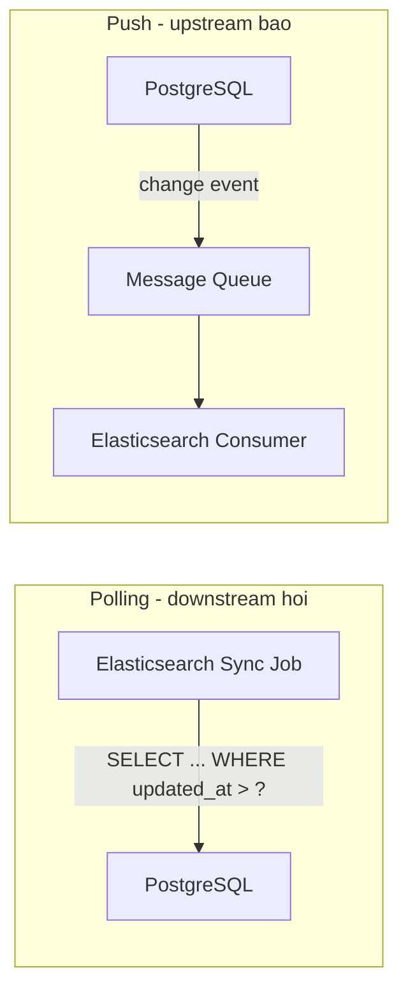
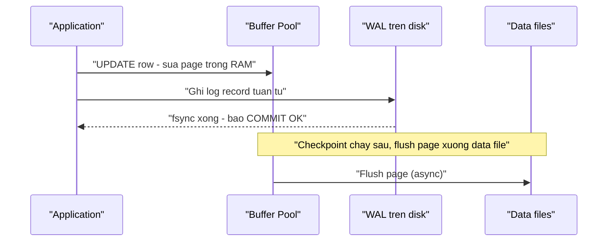

+++
title = "Chương 1: Bài toán đồng bộ dữ liệu"
date = "2026-02-20T08:00:00+07:00"
draft = false
tags = ["backend", "cdc", "kafka", "database"]
series = ["Change Data Capture"]
+++

## 1.1. Bắt đầu từ một bài toán kinh doanh cụ thể

Hãy hình dung một hệ thống e-commerce cỡ vừa: 5 triệu người dùng, 2 triệu SKU, khoảng 300.000 đơn hàng mỗi ngày. PostgreSQL là source of truth — nơi mọi transaction ghi đơn, trừ kho, cập nhật giá diễn ra. Hệ thống chạy tốt trong hai năm đầu. Rồi các yêu cầu sau lần lượt xuất hiện:

- **Search**: người dùng cần tìm kiếm sản phẩm theo full-text, fuzzy matching, faceted filter theo thương hiệu, khoảng giá, đánh giá. Đội ngũ chọn Elasticsearch.
- **Analytics**: đội business cần dashboard doanh thu theo giờ, phân tích cohort, funnel conversion trên hàng trăm triệu event. Đội data chọn ClickHouse.
- **Cache**: trang chi tiết sản phẩm chịu 20.000 request/giây lúc flash sale, không thể đánh thẳng vào PostgreSQL. Đội backend đặt Redis phía trước.

Đến đây, cùng một thực thể `product` tồn tại ở **bốn nơi**: PostgreSQL (bản gốc), Elasticsearch (bản đánh index cho search), ClickHouse (bản denormalized cho analytics), Redis (bản serialized cho cache). Dữ liệu đã bị **phân mảnh** (data fragmentation). Và câu hỏi trung tâm của toàn bộ tài liệu này xuất hiện:

> Khi một row trong PostgreSQL thay đổi, làm thế nào để ba hệ thống còn lại biết được điều đó — **đúng, đủ, đúng thứ tự, và đủ nhanh**?

Nghe đơn giản. Trong thực tế, đây là một trong những bài toán khó và bị đánh giá thấp nhất trong kiến trúc hệ thống phân tán. Phần lớn sự cố dữ liệu "lệch" giữa các hệ thống mà tôi từng xử lý trong 20 năm qua đều quy về việc đội ngũ đã trả lời câu hỏi trên một cách ngây thơ.

## 1.2. Vì sao không thể dùng một database cho tất cả?

Trước khi bàn về đồng bộ, phải trả lời câu hỏi gốc rễ: tại sao phải phân mảnh dữ liệu ngay từ đầu? Tại sao không để PostgreSQL phục vụ luôn cả search, analytics và cache? Câu trả lời nằm ở **first principles của storage engine**: mỗi loại workload đòi hỏi một cấu trúc lưu trữ và cấu trúc index khác nhau về bản chất, và các cấu trúc này **loại trừ lẫn nhau** về mặt vật lý.

### OLTP — row store và B-Tree

PostgreSQL (và MySQL/InnoDB) lưu dữ liệu theo **row-oriented**: toàn bộ các cột của một row nằm cạnh nhau trên cùng một page 8KB. Index chủ đạo là **B-Tree**. Thiết kế này tối ưu cho pattern: "tìm đúng một hoặc vài row theo khóa, đọc/ghi toàn bộ row đó" — chính là pattern của transaction (`SELECT * FROM orders WHERE id = ?`, `UPDATE inventory SET qty = qty - 1 WHERE sku = ?`). Chi phí truy cập một row qua B-Tree là O(log n) với vài lần đọc page — vài trăm microsecond khi page đã nằm trong buffer pool.

Nhưng cũng chính thiết kế này khiến câu analytics kiểu `SELECT category, SUM(amount) FROM orders GROUP BY category` trên 500 triệu rows trở thành thảm họa: engine buộc phải đọc **toàn bộ row** dù chỉ cần 2 cột, kéo hàng trăm GB qua disk và buffer pool, evict sạch working set của workload OLTP đang chạy song song.

### OLAP — column store, compression, vectorization

ClickHouse lưu **từng cột thành file riêng**. Câu aggregate ở trên chỉ đọc đúng 2 cột `category` và `amount`. Dữ liệu cùng cột có entropy thấp nên nén được 5–15 lần; engine xử lý theo vector (SIMD) hàng tỷ giá trị mỗi giây. Đổi lại, column store **rất tệ cho point update**: sửa một row nghĩa là chạm vào N file cột, và các engine dạng này thường chỉ hỗ trợ update theo kiểu ghi lại cả part. Đó là lý do bạn không bao giờ chạy OLTP trên ClickHouse.

### Search — inverted index

Elasticsearch xây **inverted index**: ánh xạ từ term → danh sách document chứa term đó, kèm cấu trúc cho scoring (TF-IDF/BM25), analyzer cho tách từ tiếng Việt, index phụ cho aggregation. B-Tree không thể trả lời câu "tìm mọi document chứa từ 'áo khoác' xếp theo độ liên quan" một cách hiệu quả — về mặt cấu trúc dữ liệu, nó không được sinh ra cho việc đó. Ngược lại, inverted index có chi phí ghi cao (phân tích văn bản, ghi segment, merge segment) và không có transaction đúng nghĩa.

### Cache — hash table trong RAM

Redis về bản chất là hash table trong bộ nhớ: O(1) lookup, latency ~0,1ms, nhưng không durability mạnh, không query theo điều kiện, dung lượng giới hạn bởi RAM.

Kết luận từ first principles: **một cấu trúc dữ liệu vật lý chỉ tối ưu cho một lớp query pattern**. Row store + B-Tree, column store + sparse index, inverted index, hash table — bốn cấu trúc này không thể hợp nhất mà không hy sinh nghiêm trọng một chiều nào đó. Đây không phải giới hạn của một sản phẩm cụ thể mà là giới hạn của vật lý lưu trữ. Vì vậy, phân mảnh dữ liệu theo workload là **tất yếu** ở một quy mô nhất định — và bài toán đồng bộ dữ liệu tồn tại như một hệ quả trực tiếp.

Lưu ý của người làm lâu năm: đừng phân mảnh sớm. Một PostgreSQL với read replica và vài GIN index phục vụ tốt đa số hệ thống dưới vài nghìn QPS. Bạn chỉ nên trả chi phí đồng bộ khi lợi ích của specialized store vượt rõ ràng chi phí vận hành nó.

## 1.3. Hai họ giải pháp: Polling và Push

Khi đã chấp nhận phân mảnh, mọi cơ chế đồng bộ đều quy về một trong hai mô hình: **downstream chủ động hỏi** (polling) hoặc **upstream chủ động báo** (push).

### Polling: đơn giản nhưng đầy lỗ hổng

Cách phổ biến nhất: thêm cột `updated_at`, mỗi 5 giây chạy `SELECT * FROM products WHERE updated_at > :last_checkpoint`. Ai cũng từng viết đoạn code này. Hãy mổ xẻ vì sao nó mong manh hơn vẻ ngoài.

**Vấn đề 1 — Latency sàn.** Độ trễ trung bình bằng nửa chu kỳ poll, worst case bằng cả chu kỳ cộng thời gian query. Poll 5 giây nghĩa là chấp nhận dữ liệu search cũ tới 5–6 giây. Muốn giảm latency thì tăng tần suất poll — và tăng tải lên database.

**Vấn đề 2 — Tải lên database.** Mỗi lần poll là một query thật, chiếm connection, CPU, buffer pool của source of truth — chính là hệ thống bạn cần bảo vệ nhất. Nhân với số lượng consumer: 4 hệ thống downstream × poll mỗi 5 giây = database liên tục phục vụ các query "có gì mới không?" mà đa số lần trả lời là "không".

**Vấn đề 3 — Missed DELETE.** Đây là lỗ hổng chí mạng: khi row bị `DELETE`, nó **biến mất** khỏi kết quả query. Polling theo `updated_at` về nguyên tắc **không thể** phát hiện DELETE. Các đội thường vá bằng soft delete (`is_deleted = true`) — tức là thay đổi schema và toàn bộ query của ứng dụng chỉ để phục vụ cơ chế đồng bộ. Đó là cái đuôi vẫy con chó.

**Vấn đề 4 — Mất intermediate state.** Nếu một row được update 3 lần giữa hai lần poll, bạn chỉ thấy trạng thái cuối. Với use case sync cache thì chấp nhận được; với use case audit, tính toán số dư, hay xây event stream thì không.

**Vấn đề 5 — `updated_at` không đáng tin.** Hai lỗi kinh điển:

- *Clock skew và độ phân giải*: `updated_at` do application hoặc `now()` của từng backend/session gán. Trong hệ thống nhiều node ghi, đồng hồ lệch nhau vài chục ms đến vài giây là bình thường. Checkpoint theo timestamp sẽ bỏ sót row có timestamp "quá khứ" do node có đồng hồ chậm ghi ra.
- *Transaction commit muộn hơn `updated_at`*: giá trị `now()` được chốt lúc **bắt đầu** statement/transaction, nhưng row chỉ **visible** với poller sau khi **commit**. Một transaction dài 30 giây tạo ra row có `updated_at = 10:00:00` nhưng chỉ nhìn thấy được lúc 10:00:30. Nếu poller đã chạy lúc 10:00:05 và dời checkpoint lên 10:00:05, row đó **vĩnh viễn bị bỏ sót**. Cách vá thường thấy — poll với khoảng lùi `updated_at > checkpoint - 1 phút` — vừa gây xử lý trùng lặp, vừa vẫn không an toàn với transaction dài hơn khoảng lùi. Tôi từng điều tra một sự cố production mà báo cáo doanh thu lệch ~0,3% kéo dài nhiều tháng, nguyên nhân cuối cùng là đúng pattern này: batch job ghi đơn hàng trong transaction 2–3 phút, poller checkpoint 60 giây lùi.

### Push: đúng hướng, nhưng ai là người push?

Push giải quyết được latency (event đi ngay khi có thay đổi) và tải (không query lặp vô ích). Nhưng câu hỏi then chốt là **tầng nào phát ra event**: application code? trigger trong database? hay chính database engine? Toàn bộ Chương 2 sẽ phân tích từng lựa chọn và vì sao đa số chúng thất bại theo những cách tinh vi. Ở đây chỉ cần ghi nhận: push là hướng đúng, và bài toán thật sự là **tìm một nguồn sự thật về thay đổi mà không thể sai lệch với dữ liệu đã commit**.

## 1.4. Event Synchronization vs Data Synchronization

Một nhầm lẫn phổ biến ở các đội đã có Kafka: "chúng tôi đã publish event rồi, đâu cần gì thêm?". Cần phân biệt hai loại event khác nhau về bản chất:

| Tiêu chí | Domain Event | Data Change Event |
|---|---|---|
| Ngữ nghĩa | Ý định nghiệp vụ: `OrderPlaced`, `PaymentCaptured` | Sự kiện vật lý: row X trong bảng Y đổi từ A sang B |
| Nguồn phát | Application code, chủ đích của developer | Hạ tầng dữ liệu, tự động |
| Độ phủ | Chỉ những gì developer nhớ publish | Mọi thay đổi đã commit, kể cả từ migration script, thao tác thủ công, batch job |
| Schema | Contract nghiệp vụ, được thiết kế | Phản chiếu schema bảng |
| Đảm bảo khớp với DB | Không tự nhiên có — phải xây thêm (Outbox) | Có, vì sinh từ chính dữ liệu đã commit |
| Phù hợp cho | Business workflow, saga, integration giữa các bounded context | Replication, sync search/cache/analytics, audit |

Hai loại này **bổ sung** chứ không thay thế nhau. Domain event trả lời "chuyện gì đã xảy ra theo nghĩa nghiệp vụ"; data change event trả lời "dữ liệu đã thay đổi thế nào". Sai lầm thiết kế thường gặp: dùng domain event để sync dữ liệu — rồi phát hiện engineer chạy `UPDATE ... SET price = ...` trực tiếp trên production để hotfix, không có event nào được phát, Elasticsearch lệch giá suốt một tuần và không ai biết vì sao. Ngược lại, dùng data change event để lái business workflow cũng là sai: consumer phải reverse-engineer ý định nghiệp vụ từ diff của các cột — mong manh và coupling chặt vào schema.

## 1.5. Transaction Log — thứ mọi database ACID buộc phải có

Đây là khái niệm nền tảng cho toàn bộ tài liệu, nên ta đi từ gốc: **vì sao transaction log tồn tại?**

Database phải đảm bảo **Durability**: một transaction đã báo commit thành công thì không được mất, kể cả khi mất điện ngay millisecond sau đó. Cách ngây thơ — ghi thẳng mọi thay đổi vào data file rồi mới báo commit — không khả thi vì hai lý do: (1) một transaction có thể chạm hàng chục page rải rác khắp disk, ghi random I/O từng đó vị trí một cách atomic là bất khả thi về vật lý; (2) nếu crash **giữa chừng** khi mới ghi được một nửa số page, data file rơi vào trạng thái nửa vời không thể phân biệt với dữ liệu hợp lệ.

Lời giải kinh điển là **Write-Ahead Logging (WAL)**:

1. Mọi thay đổi được mô tả thành log record và ghi **tuần tự** (append-only) vào transaction log **trước** khi data page được sửa trên disk — "write-ahead".
2. Thời điểm commit, database chỉ cần **fsync phần log** xuống disk. Ghi tuần tự + fsync một vùng liên tiếp nhanh hơn nhiều so với random write hàng chục page.
3. Data page được sửa thong thả trong memory và flush xuống disk sau (checkpoint), theo lịch tối ưu I/O.
4. Khi crash, lúc khởi động lại database **replay log**: transaction đã commit trong log thì được áp lại vào data file (redo), transaction dở dang thì được hoàn tác (undo). Log chính là nguồn sự thật để tái thiết trạng thái.

PostgreSQL gọi nó là **WAL**, MySQL có **redo log** của InnoDB và **Binlog** ở tầng server, Oracle gọi là **redo log**, SQL Server là **transaction log**, MongoDB là **oplog**. Tên khác nhau, bản chất một: *một dòng ghi tuần tự, bền vững, theo đúng thứ tự commit, mô tả mọi thay đổi của dữ liệu*.

Hệ quả quan trọng thứ hai: chính log này là nền tảng của **replication**. Replica của PostgreSQL không copy data file — nó nhận stream WAL và replay. MySQL replica đọc Binlog. Nghĩa là mọi database ACID trưởng thành đều đã có sẵn một cơ chế xuất bản thay đổi được kiểm chứng ở quy mô sản xuất hàng chục năm. Hãy ghim ý này lại — Chương 3 sẽ xoay quanh nó.

## 1.6. Eventual Consistency — cái giá phải trả và vì sao chấp nhận được

Một khi dữ liệu tồn tại ở nhiều hệ thống, bạn phải chọn mô hình nhất quán. **Strong consistency giữa các hệ thống độc lập** đòi hỏi distributed transaction (2PC) trải qua PostgreSQL, Elasticsearch, ClickHouse, Redis — về lý thuyết đã khó (không phải hệ nào cũng hỗ trợ 2PC), về thực tế là tự sát: mọi lượt ghi bị khóa theo hệ thống chậm nhất, một hệ down kéo sập khả năng ghi của toàn bộ. Theo định lý CAP, khi có partition (mà trong hệ phân tán, partition là *khi nào*, không phải *nếu*), bạn buộc chọn giữa consistency và availability — và với các hệ thống phục vụ người dùng, availability gần như luôn thắng.

Vậy nên mô hình thực dụng là **eventual consistency**: source of truth ghi xong trước, các hệ downstream đuổi theo sau trong một **consistency window** — khoảng thời gian từ lúc commit ở nguồn đến lúc thay đổi xuất hiện ở đích.

Ví dụ cụ thể để định lượng hóa: seller đổi giá sản phẩm từ 500k xuống 450k lúc `10:00:00.000`.

- PostgreSQL commit: `10:00:00.000` — đây là sự thật.
- Pipeline đồng bộ tốt (log-based, sẽ bàn ở Chương 3): Elasticsearch thấy giá mới lúc `10:00:00.300`. Window ~300ms. Người dùng search trong 300ms đó thấy giá cũ — hoàn toàn chấp nhận được về nghiệp vụ.
- Polling 5 giây: window trung bình 2,5–5 giây, cộng thời gian index.
- Batch ETL hàng đêm: window lên tới 24 giờ.

Điểm mấu chốt về tư duy thiết kế: **eventual consistency không phải là "lỗi chấp nhận được" mà là một tham số phải được thiết kế, đo lường và cam kết**. Câu hỏi đúng không phải "có consistent không" mà là "consistency window bao nhiêu, đo bằng gì (replication lag metric), và nghiệp vụ nào chịu được window đó". Search hiển thị giá cũ 300ms: được. Trừ tồn kho dựa trên bản cache cũ 300ms: **không được** — nghiệp vụ nào cần read-your-writes hoặc quyết định giao dịch thì phải đọc từ source of truth, chấm hết. Thiết kế sai kinh điển là để service kiểm tra tồn kho đọc từ Redis được sync eventual rồi oversell trong flash sale — lỗi này tôi thấy lặp lại ở ít nhất ba công ty khác nhau.

## 1.7. Minh họa bằng con số: polling 5 giây vs đọc log

Để cảm nhận chênh lệch chi phí, xét bảng `products` 100 triệu rows (~120GB cả index), tốc độ thay đổi trung bình 200 rows/giây, 4 hệ thống downstream. *Các con số dưới đây là số minh họa điển hình từ kinh nghiệm thực tế trên hạ tầng SSD/NVMe phổ biến, chỉ mang tính tham khảo — hãy tự benchmark trên hệ của bạn.*

**Phương án A — Polling mỗi 5 giây theo `updated_at` (có index):**

- Mỗi lần poll: index range scan trên `updated_at` trả ~1.000 rows, kèm heap fetch từng row (các row mới update nằm rải rác) — thực tế đo được cỡ 15–50ms và vài nghìn page access mỗi query khi buffer nóng, tệ hơn nhiều khi nguội.
- 4 consumer × 17.280 poll/ngày = ~69.000 query/ngày đánh vào primary, **kể cả lúc không có gì thay đổi**.
- Index trên `updated_at` là index bị ghi lại ở **mọi** UPDATE — bạn trả thêm 1 index write cho mỗi thay đổi, khuếch đại write amplification và bloat (với PostgreSQL, cột `updated_at` thay đổi làm mất cơ hội HOT update).
- Consistency window: 2,5–5s trung bình. DELETE: không bắt được. Intermediate state: mất.

**Phương án B — Đọc transaction log (log-based CDC):**

- Database *đằng nào cũng phải ghi* WAL cho mỗi thay đổi — chi phí này đã trả sẵn cho durability, không phát sinh thêm.
- Connector đọc log là **sequential read** trên file đã fsync: 200 event/giây tương đương vài trăm KB/giây — không đáng kể so với năng lực đọc tuần tự hàng GB/giây của NVMe, và thường phục vụ thẳng từ OS page cache.
- Không query nào đánh vào bảng, không index phụ, không thay đổi schema. 4 consumer đọc từ Kafka, không chạm database.
- Consistency window: điển hình 100ms–1s. Bắt được DELETE, bắt được từng intermediate state, đúng thứ tự commit.

Chênh lệch không nằm ở một con số đơn lẻ mà ở **cấu trúc chi phí**: polling có chi phí tỉ lệ với (tần suất poll × số consumer × kích thước bảng), còn đọc log có chi phí tỉ lệ với **lượng thay đổi thực tế** — vốn là chi phí tối thiểu về mặt thông tin. Khi hệ thống scale, đường cong thứ nhất giết bạn, đường cong thứ hai thì không.

Nhưng — và đây là điều một Principal Architect phải nói thẳng — phương án B không miễn phí: bạn phải vận hành connector, quản lý Replication Slot/Binlog retention, xử lý schema change, monitor lag. Chương 2 sẽ đi qua đầy đủ các phương pháp truyền thống và chỉ ra chính xác chúng gãy ở đâu, để đến Chương 3 ta hiểu CDC log-based là câu trả lời cho vấn đề gì — chứ không phải là món đồ chơi công nghệ mới.

## Tóm tắt chương

- Phân mảnh dữ liệu theo workload là tất yếu ở quy mô lớn, vì mỗi query pattern (OLTP, OLAP, search, cache) đòi hỏi một cấu trúc lưu trữ và index khác nhau về bản chất vật lý — nhưng đừng phân mảnh sớm hơn mức cần.
- Bài toán đồng bộ quy về polling vs push. Polling theo `updated_at` có latency sàn, tạo tải lặp lên source of truth, không bắt được DELETE, mất intermediate state, và mong manh trước clock skew cùng transaction commit muộn hơn `updated_at`.
- Domain event và data change event là hai loại khác nhau: một cái mang ý định nghiệp vụ do developer chủ động phát, một cái phản chiếu trung thực mọi thay đổi đã commit. Dùng lẫn vai là thiết kế sai.
- Mọi database ACID đều phải có transaction log (WAL/Binlog/redo log) để đảm bảo durability qua cơ chế write-ahead và phục vụ crash recovery; log này cũng là nền tảng của replication — một kênh xuất bản thay đổi có sẵn, đúng thứ tự commit.
- Eventual consistency là lựa chọn thực dụng theo CAP; consistency window là tham số phải thiết kế và đo lường, và nghiệp vụ cần quyết định giao dịch phải đọc từ source of truth.
- Về cấu trúc chi phí: polling tỉ lệ với tần suất × consumer × kích thước bảng; đọc log tỉ lệ với lượng thay đổi thực — khác biệt quyết định khi scale.

## Đọc tiếp

Chương 2 — [Các phương pháp đồng bộ truyền thống và hạn chế](/series/cdc/02-cac-phuong-phap-dong-bo-truyen-thong/): đi qua tiến hóa từ Batch ETL, polling, trigger-based, đến Dual Write và Event Publishing từ application — mỗi phương pháp gãy ở đâu trong production, và vì sao Dual Write là anti-pattern quan trọng nhất cần hiểu thấu.
