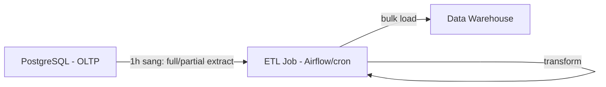
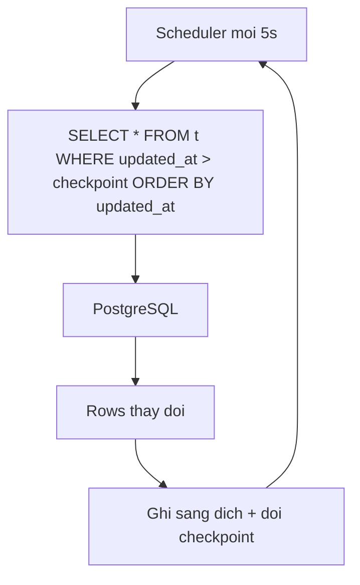
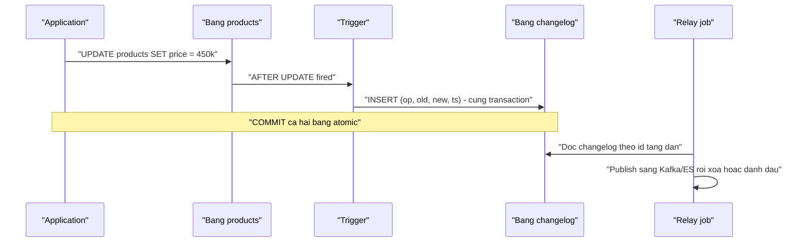
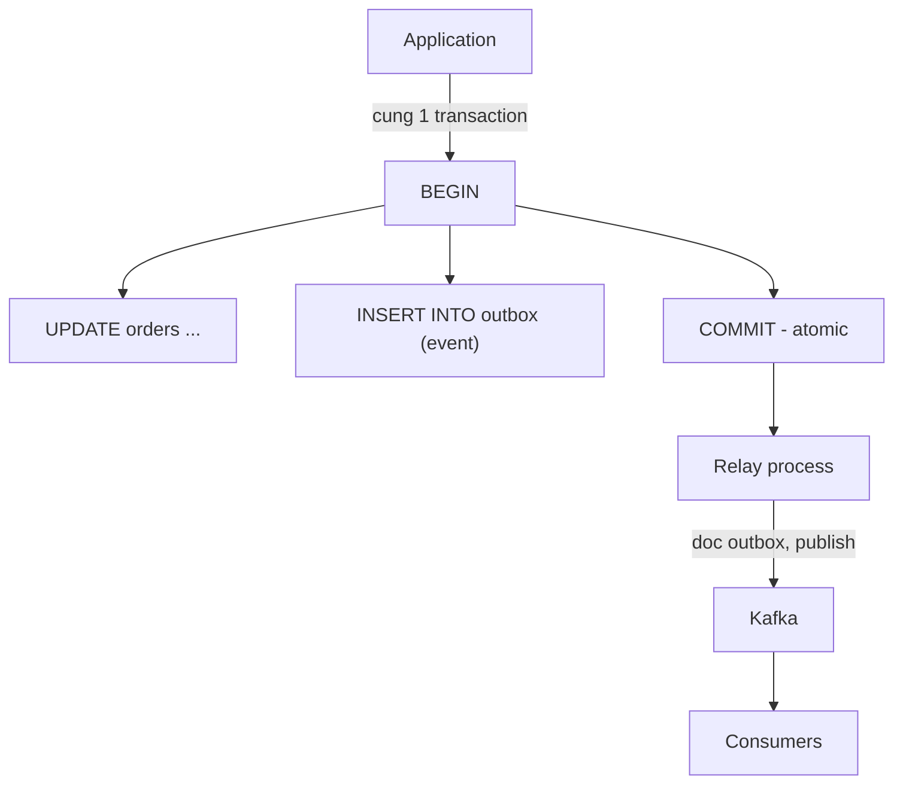

+++
title = "Chương 2: Các phương pháp đồng bộ truyền thống và hạn chế"
date = "2026-02-20T09:00:00+07:00"
draft = false
tags = ["backend", "cdc", "kafka", "database"]
series = ["Change Data Capture"]
+++

Chương 1 đã xác lập bài toán: dữ liệu buộc phải phân mảnh theo workload, và cần một cơ chế đưa thay đổi từ source of truth đến các hệ thống downstream. Chương này đi qua các phương pháp mà ngành đã dùng suốt ba thập kỷ — theo đúng thứ tự tiến hóa của chúng. Đây không phải bài điểm danh lịch sử: mỗi phương pháp vẫn đang chạy trong production ở đâu đó ngay lúc này, và mỗi phương pháp đều dạy ta một bài học về **vì sao CDC log-based cuối cùng trở thành câu trả lời**. Với mỗi phương pháp, ta phân tích theo cùng một template: cách hoạt động, ưu điểm, hạn chế kỹ thuật, một ví dụ production khi nó fail, và — quan trọng không kém — khi nào nó vẫn là lựa chọn đúng.

## 2.1. Batch ETL theo lịch

### Cách hoạt động

Mỗi đêm (hoặc mỗi giờ), một job Extract-Transform-Load chạy: query toàn bộ hoặc một phần bảng nguồn, biến đổi, ghi đè hoặc merge vào đích. Đây là xương sống của data warehouse suốt từ thập niên 90.



### Ưu điểm

- Đơn giản tối đa về mặt khái niệm; toàn bộ logic nằm ở một chỗ, dễ debug, dễ chạy lại (rerun idempotent nếu thiết kế tốt).
- Tách hoàn toàn khỏi transaction path — không thêm một nanosecond nào vào latency ghi của OLTP.
- Bulk load cực kỳ hiệu quả với columnar warehouse: ghi 100 triệu rows một lần rẻ hơn nhiều so với 100 triệu lần ghi lẻ.

### Hạn chế kỹ thuật

- **Consistency window tính bằng giờ hoặc ngày.** Business ngày nay hỏi "doanh thu 15 phút qua", không phải "doanh thu hôm qua".
- **Full extract không scale**: dump 500GB mỗi đêm tạo áp lực I/O và lock/snapshot dài lên nguồn; incremental extract thì quay lại đúng các vấn đề `updated_at` của Chương 1 — không bắt DELETE, sót transaction commit muộn.
- **Batch window co lại khi dữ liệu phình ra**: job từng chạy 2 tiếng dần thành 9 tiếng, tràn sang giờ làm việc.
- Trạng thái đích là các "bức ảnh" rời rạc — không có lịch sử thay đổi giữa hai lần chạy.

### Ví dụ production fail

Một hệ thống fintech tôi từng review: ETL đêm extract bảng giao dịch theo `created_at >= yesterday`. Batch job đối soát của ngân hàng đối tác thỉnh thoảng ghi bổ sung giao dịch với `created_at` lùi 2 ngày (backdate theo ngày phát sinh thực). Các row này rơi ra ngoài mọi cửa sổ extract. Warehouse thiếu ~0,1% giao dịch, chỉ bị phát hiện sau 4 tháng khi đối soát tổng quý lệch số. Chi phí sửa: backfill toàn bộ + 3 tuần điều tra. Bài học: incremental theo cột thời gian do application kiểm soát là hợp đồng không ai cam kết.

### Khi nào vẫn nên dùng

Dữ liệu tham chiếu thay đổi chậm (danh mục, tỷ giá chốt ngày), báo cáo chỉ cần theo ngày, nguồn là hệ thống bên thứ ba chỉ cho phép export định kỳ. Đừng dựng CDC pipeline cho một bảng 10.000 rows cập nhật mỗi tuần — đó là over-engineering.

## 2.2. Polling với `updated_at`

### Cách hoạt động

Phiên bản "real-time hóa" của batch: thu nhỏ chu kỳ xuống giây/phút, checkpoint theo `updated_at` (hoặc cột version/sequence tăng dần).



### Ưu điểm

- Không cần quyền đặc biệt trên database, không cần hạ tầng mới — một cron job và một bảng checkpoint là đủ.
- Dễ hiểu, dễ vận hành với đội nhỏ.

### Hạn chế kỹ thuật

Chương 1 đã mổ xẻ chi tiết, tóm tắt lại đầy đủ: (1) latency sàn bằng chu kỳ poll; (2) tải query lặp vô ích lên primary, nhân theo số consumer; (3) **không bắt được DELETE**; (4) mất intermediate state giữa hai lần poll; (5) sót dữ liệu do clock skew và transaction commit muộn hơn `updated_at`; (6) phải thêm cột + index vào mọi bảng cần sync — thay đổi schema vì nhu cầu của consumer; (7) `ORDER BY updated_at` không phải commit order — thứ tự áp dụng ở đích có thể sai với thứ tự nhân quả thực.

Thêm một điểm ít người để ý: index trên `updated_at` là loại index bị ghi lại ở **mọi** UPDATE, tăng write amplification và (trên PostgreSQL) phá HOT update, gây bloat.

### Ví dụ production fail

Sàn thương mại điện tử đồng bộ sản phẩm sang Elasticsearch bằng polling 10 giây. Nghiệp vụ gỡ sản phẩm vi phạm dùng hard DELETE. Sản phẩm bị gỡ vẫn nằm trên search suốt nhiều ngày (đến khi full reindex hàng tuần chạy). Đội pháp lý nhận khiếu nại vì hàng cấm đã gỡ vẫn tìm thấy được. Bản vá: chuyển sang soft delete — kéo theo sửa 40+ query trong codebase để thêm `WHERE is_deleted = false`, và ba tháng sau vẫn lòi ra hai query quên filter.

### Khi nào vẫn nên dùng

Bảng append-only thuần túy (không UPDATE/DELETE) có cột sequence tăng dần đáng tin (id tự tăng — nhưng nhớ rằng id cũng commit không theo thứ tự cấp phát), yêu cầu latency lỏng lẻo, đội chưa có hạ tầng streaming. Biết rõ mình đang chấp nhận gì.

## 2.3. Trigger-based replication

### Cách hoạt động

Tạo trigger `AFTER INSERT/UPDATE/DELETE` trên bảng nguồn; trigger ghi bản ghi thay đổi vào một bảng khác (thường gọi là bảng audit/changelog/shadow table) **trong cùng transaction**; một job đọc bảng changelog và đẩy đi.



### Ưu điểm

- **Atomic với dữ liệu**: changelog và thay đổi gốc commit cùng nhau — không thể lệch, không sót DELETE, bắt được cả old value lẫn new value. Đây là ưu điểm thật sự và là lý do phương pháp này thống trị trước kỷ nguyên log-based (các sản phẩm như Oracle GoldenGate đời đầu, SymmetricDS đều đi đường này).
- Bắt được thay đổi từ **mọi nguồn ghi**, kể cả câu SQL thủ công.

### Hạn chế kỹ thuật

- **Overhead nằm trong transaction path** — đây là điểm chí tử. Mỗi lượt ghi giờ là ít nhất hai lượt ghi (bảng chính + changelog), cộng chi phí thực thi trigger (với PL/pgSQL là interpreter overhead trên từng row). Con số minh họa điển hình từ kinh nghiệm thực tế (*số tham khảo, phụ thuộc workload*): trigger audit ghi old/new row dạng JSONB trên bảng ghi nặng làm giảm **30–40% write throughput** và tăng p99 write latency tương ứng; với batch UPDATE chạm 1 triệu rows, trigger per-row biến câu lệnh 20 giây thành nhiều phút. Bạn đang bắt workload OLTP — thứ cần bảo vệ nhất — trả thuế cho nhu cầu của hệ thống downstream.
- **Bảng changelog trở thành điểm nóng**: ghi tập trung tuần tự, phình rất nhanh, cần job dọn dẹp; dọn bằng DELETE lại gây bloat và vacuum pressure. Tôi từng thấy bảng changelog 800GB — lớn hơn dữ liệu chính.
- **Khó maintain**: trigger là code "vô hình" nằm trong database, ngoài luồng review/deploy thông thường; mỗi lần `ALTER TABLE` phải nhớ sửa trigger tương ứng; N bảng cần sync là N bộ trigger. Sau ba năm và hai thế hệ engineer, không ai còn dám đụng vào chúng.
- Relay job đọc changelog thực chất vẫn là polling — với đầy đủ vấn đề latency của polling, chỉ khác là không sót dữ liệu.

### Ví dụ production fail

Một hệ thống ERP thêm trigger audit lên 12 bảng lõi theo yêu cầu compliance. Sáu tháng sau, kỳ chốt sổ cuối tháng — vốn chạy các batch UPDATE lớn — bắt đầu timeout. Điều tra cho thấy trigger chiếm ~35% thời gian ghi, và bảng audit (không ai đặt lịch dọn) đã 500GB, index của nó không còn vừa RAM khiến mỗi INSERT vào audit thành random I/O. Hệ thống chậm dần đều theo đúng nghĩa đen trong nhiều tháng mà không ai nối được nguyên nhân, vì "trigger deploy từ nửa năm trước rồi mà".

### Khi nào vẫn nên dùng

Audit nội bộ trong phạm vi database (không cần đẩy đi đâu), khối lượng ghi thấp, hoặc database không mở transaction log cho bên ngoài đọc (một số managed service, database nhúng). Ngay cả khi đó, hãy đo overhead trước khi bật trên bảng nóng.

## 2.4. Dual Write — anti-pattern quan trọng nhất

Đây là phương pháp mà **mọi đội đều tự phát minh lại**, vì nó là điều tự nhiên nhất để nghĩ ra: "cần dữ liệu ở hai nơi thì ghi vào hai nơi".

### Cách hoạt động

```mermaid
sequenceDiagram
    participant App as "Application"
    participant PG as "PostgreSQL"
    participant K as "Kafka / Elasticsearch"
    App->>PG: "BEGIN; UPDATE ...; COMMIT"
    PG-->>App: "OK"
    App->>K: "publish event / index document"
    K-->>App: "OK (hoac khong...)"
```

Application, sau khi ghi database thành công, ghi tiếp vào hệ thống thứ hai (Kafka, Elasticsearch, Redis...) ngay trong request handler.

### Vì sao không thể đảm bảo atomicity

Đây là điểm phải hiểu đến tận gốc, vì nó không phải lỗi triển khai — nó là **bất khả thi về nguyên lý**. PostgreSQL và Kafka là hai hệ thống độc lập, không chia sẻ transaction coordinator. Không tồn tại thao tác nào cho phép "commit cả hai hoặc không hệ nào". Giữa hai lệnh ghi luôn có một khoảng thời gian mà process có thể chết, network có thể đứt, một trong hai hệ có thể từ chối. Liệt kê các failure mode:

**Failure mode 1 — DB commit thành công, publish fail.** Process crash ngay sau COMMIT, hoặc Kafka unavailable, hoặc publish timeout. Kết quả: database có dữ liệu mới, downstream không bao giờ biết. Retry ở đâu? Request đã trả về, state đã mất. Đây là **mất event vĩnh viễn, âm thầm** — loại lỗi tệ nhất vì không có exception nào ghi nhận nó ở đúng chỗ.

**Failure mode 2 — Publish trước, DB rollback sau.** Đảo thứ tự để "chắc chắn có event" thì tệ hơn: event mô tả một thay đổi **chưa từng tồn tại** (transaction rollback vì conflict, vì constraint, vì crash trước COMMIT). Downstream index một đơn hàng không có thật. Đây là **event ma** — phá vỡ tính chất "event phản ánh sự thật đã commit".

**Failure mode 3 — Retry tạo duplicate không kiểm soát.** Vá failure mode 1 bằng retry: publish timeout nhưng thực ra đã thành công → retry tạo bản sao. Không có deduplication key gắn với transaction, downstream không phân biệt được.

**Failure mode 4 — Race condition về ordering.** Đây là failure mode tinh vi nhất và hay bị bỏ qua nhất. Hai request đồng thời cập nhật cùng một row:

```mermaid
sequenceDiagram
    participant A as "Request A - price 450k"
    participant B as "Request B - price 400k"
    participant PG as "PostgreSQL"
    participant K as "Kafka"
    A->>PG: "UPDATE price = 450k; COMMIT"
    B->>PG: "UPDATE price = 400k; COMMIT"
    Note over PG: "Thu tu commit: A truoc, B sau. DB chot gia 400k"
    B->>K: "publish price = 400k"
    A->>K: "publish price = 450k (den sau do GC pause/retry)"
    Note over K: "Consumer ap dung cuoi cung: 450k. LECH VINH VIEN voi DB"
```

Thứ tự publish lên Kafka do scheduler của OS, GC pause, network jitter quyết định — **không liên quan gì đến thứ tự commit trong database**. Downstream áp dụng event cuối cùng nhận được và lệch vĩnh viễn với source of truth, không có cơ chế nào tự phát hiện. Với write rate cao trên các hot key, xác suất xảy ra không hề nhỏ — và mỗi lần xảy ra là một bản ghi lệch âm thầm.

### Vì sao 2PC không phải lối thoát

Phản xạ của người mới đọc về distributed transaction: "vậy dùng two-phase commit". Không thực tế, vì bốn lý do:

1. **Kafka, Elasticsearch, Redis không phải XA resource** — chúng không tham gia được vào 2PC chuẩn. (Kafka có transaction nội bộ, nhưng đó là transaction giữa các Kafka topic/offset, không phải giữa Kafka và PostgreSQL.)
2. 2PC là **blocking protocol**: nếu coordinator chết giữa prepare và commit, participant giữ lock chờ vô hạn định. Bạn nối độ khả dụng của đường ghi OLTP vào độ khả dụng của mọi hệ downstream — đảo ngược hoàn toàn nguyên tắc cách ly lỗi.
3. Latency: mỗi lượt ghi trả thêm ít nhất một round-trip prepare/commit đến mọi participant.
4. Ngay cả khi mọi hệ hỗ trợ XA, 2PC đảm bảo atomic commit chứ **không đảm bảo atomic visibility** — vẫn có khoảnh khắc participant này đã commit còn participant kia chưa.

Ngành công nghiệp đã thử con đường này trong thập niên 2000 (các bus XA/JTA của Java EE) và rút lui có tổ chức.

### Vì sao Dual Write nguy hiểm hơn các phương pháp khác

Batch ETL sai thì sai to, dễ thấy. Dual Write sai theo kiểu **rò rỉ từng giọt**: 99,9% event đi đúng, 0,1% mất hoặc sai thứ tự, tích lũy dần thành hàng nghìn bản ghi lệch sau một năm, và không có điểm nào trong hệ thống biết điều đó. Chi phí thật của Dual Write không phải là code viết nó (rất rẻ) mà là **hệ thống đối soát (reconciliation) bạn buộc phải xây sau đó** — job so khớp định kỳ giữa DB và downstream, thứ mà tôi thấy mọi công ty dùng Dual Write nghiêm túc cuối cùng đều phải xây, và bản thân job đó lại là một batch ETL với đầy đủ hạn chế ở mục 2.1.

### Khi nào chấp nhận được

Cache dạng best-effort có TTL ngắn (lệch thì tự hết hạn sau 60 giây), dữ liệu mà việc mất/lệch một phần không có hậu quả nghiệp vụ và có full rebuild định kỳ. Nói cách khác: chỉ khi bạn đã thiết kế sẵn cơ chế tự chữa lành và trả lời được câu "lệch thì sao?" bằng "không sao thật".

## 2.5. Event Publishing từ application (và Outbox Pattern)

### Cách hoạt động

Bước tiến hóa tiếp theo: thay vì ghi thẳng sang hệ đích, application publish **domain event** (`OrderPlaced`, `ProductPriceChanged`) lên message broker; các consumer tự cập nhật store của mình. Đây là kiến trúc event-driven kinh điển.

Phiên bản ngây thơ của nó — publish trong request handler sau khi commit — **chính là Dual Write** với đầy đủ failure mode ở mục 2.4, chỉ khoác áo ngữ nghĩa đẹp hơn. Phiên bản đúng là **Outbox Pattern**: ghi event vào bảng `outbox` **trong cùng transaction** với thay đổi nghiệp vụ, rồi một relay process đọc bảng outbox và publish.



### Ưu điểm

- Outbox giải quyết đúng vấn đề atomicity: event và dữ liệu commit cùng nhau hoặc không gì cả. Không event ma, không mất event.
- Event mang **ngữ nghĩa nghiệp vụ** — contract được thiết kế chủ động, không lộ schema nội bộ của database ra ngoài. Đây là ưu thế thật so với data change event, đặc biệt giữa các bounded context.

### Hạn chế kỹ thuật

- **Độ phủ phụ thuộc kỷ luật của developer**: chỉ những code path có gọi publish mới sinh event. Migration script, bulk update, hotfix SQL trực tiếp, service cũ chưa refactor — tất cả ghi dữ liệu mà không phát event. Với mục đích *business integration* thì chấp nhận được; với mục đích *đồng bộ dữ liệu* thì đây là lỗ thủng cấu trúc.
- Relay đọc bảng outbox bằng polling thì thừa hưởng latency + tải của polling (dù không sót, vì outbox là append-only có sequence); bảng outbox cần dọn dẹp như bảng changelog của trigger.
- Mỗi bảng/aggregate cần sync là thêm code outbox — chi phí lặp lại trên toàn codebase, và không giúp gì cho hệ thống legacy không sửa được code.
- Relay publish vẫn là at-least-once → consumer phải idempotent (điều này thì gần như mọi giải pháp đều yêu cầu, kể cả CDC — sẽ bàn ở Chương 3).

### Ví dụ production fail

Một công ty logistics dùng event publishing (không outbox) cho trạng thái vận đơn. Chiến dịch làm sạch dữ liệu chạy `UPDATE shipments SET status = 'delivered' WHERE ...` trực tiếp cho 40.000 đơn kẹt trạng thái. Không event nào phát ra. App khách hàng (đọc từ read model build từ event) hiển thị 40.000 đơn "đang giao" suốt hai tuần; call center quá tải. Đây là minh họa hoàn hảo cho khoảng cách giữa domain event và data change: **sự thật nằm trong database, không nằm trong thiện chí của code**.

### Khi nào vẫn nên dùng

Luôn luôn — **cho mục đích của nó**: business workflow, saga, integration giữa các service. Outbox Pattern là best practice thực thụ ở đây. Điều không nên làm là dùng nó làm cơ chế *đồng bộ dữ liệu* duy nhất cho search/analytics/cache khi có nhiều đường ghi vào database. Và một điểm nối sang chương sau: cách hiệu quả nhất để relay bảng outbox... chính là CDC đọc transaction log của bảng outbox — hai kỹ thuật này hội tụ chứ không cạnh tranh.

## 2.6. Nhìn lại toàn cảnh: mẫu số chung của các thất bại

Xếp các phương pháp cạnh nhau, một quy luật hiện ra. Mọi phương pháp đều phải trả lời ba câu hỏi, và mỗi phương pháp gãy ở ít nhất một câu:

1. **Tính đầy đủ** — có bắt được *mọi* thay đổi không, kể cả DELETE, kể cả từ code path không ngờ tới? (Polling: không. Event publishing: không.)
2. **Tính atomic với dữ liệu** — event có được đảm bảo khớp với những gì đã commit không? (Dual Write: không, về nguyên lý.)
3. **Chi phí đặt ở đâu** — trong transaction path của OLTP hay ngoài nó? (Trigger: trong, và đó là chỗ đắt nhất.)

Chỉ có hai phương pháp trả lời đúng câu 1 và 2: trigger-based và outbox — và cả hai đều đúng vì cùng một lý do: **chúng ghi thông tin thay đổi trong cùng transaction với dữ liệu**. Nhưng cả hai đều trả giá ở câu 3: một lượt ghi phụ trong transaction path, cộng một tầng polling phía sau.

Đến đây, câu hỏi tự nhiên bật ra: có tồn tại thứ gì đó *vốn đã* được ghi trong cùng transaction với mọi thay đổi, *vốn đã* đầy đủ tuyệt đối, *vốn đã* đúng thứ tự commit, và chi phí ghi nó *đã được trả sẵn* bất kể ta có dùng hay không? Có. Chương 1 đã gọi tên nó: **transaction log**. Đó là nội dung của Chương 3.

### Bảng so sánh tổng hợp

| Tiêu chí | Batch ETL | Polling `updated_at` | Trigger-based | Dual Write | Event Publishing + Outbox |
|---|---|---|---|---|---|
| Consistency window | Giờ → ngày | Giây → phút | Giây (qua relay) | ms (khi không lỗi) | Giây (qua relay) |
| Bắt được DELETE | Không (trừ full compare) | Không | Có | Có (nếu code nhớ) | Có (nếu code nhớ) |
| Bắt intermediate state | Không | Không | Có | Không đảm bảo | Theo event được phát |
| Atomic với dữ liệu commit | Không | Không | **Có** | **Không — về nguyên lý** | **Có** (nhờ outbox) |
| Đúng thứ tự commit | Không | Không | Gần đúng (theo seq changelog) | **Không — race condition** | Theo seq outbox |
| Độ phủ mọi đường ghi | Có (query lại bảng) | Có với UPDATE, sót DELETE | **Có** | Chỉ code path có gọi | Chỉ code path có gọi |
| Overhead lên transaction path | Không | Không (nhưng tải query nền) | **Cao: 30–40% write** * | Thêm 1 RPC mỗi request | Thêm 1 INSERT mỗi transaction |
| Thay đổi schema/code | Không | Cột + index `updated_at` | Trigger + bảng changelog | Sửa mọi write path | Sửa mọi write path + bảng outbox |
| Độ phức tạp vận hành | Thấp | Thấp | Trung bình (dọn changelog) | Thấp lúc đầu, **cao về sau (reconciliation)** | Trung bình |
| Rủi ro âm thầm nhất | Sót row backdate | Sót DELETE, clock skew | Chậm dần theo size changelog | Lệch rò rỉ không phát hiện được | Đường ghi ngoài luồng không phát event |
| Vẫn nên dùng khi | Dữ liệu chậm, báo cáo theo ngày | Bảng append-only, latency lỏng | DB không mở log, audit nội bộ | Cache TTL ngắn, best-effort | Business integration giữa service |

\* *Số tham khảo minh họa từ kinh nghiệm thực tế, phụ thuộc workload và cách viết trigger.*

## Tóm tắt chương

- Tiến hóa của đồng bộ dữ liệu — Batch ETL → Polling → Trigger → Dual Write → Event Publishing — là chuỗi các lời giải từng phần, mỗi bước vá một điểm yếu của bước trước và lộ ra điểm yếu mới.
- Ba câu hỏi kiểm định mọi cơ chế đồng bộ: đầy đủ mọi thay đổi không? atomic với dữ liệu commit không? chi phí đặt trong hay ngoài transaction path?
- Dual Write là anti-pattern quan trọng nhất: không thể đảm bảo atomicity giữa hai hệ thống độc lập về nguyên lý; failure mode gồm mất event âm thầm, event ma, duplicate, và race condition ordering làm lệch vĩnh viễn; 2PC không phải lối thoát vì broker/search không phải XA resource, blocking, và không đảm bảo atomic visibility.
- Trigger-based và Outbox trả lời đúng câu atomicity vì cùng nguyên lý "ghi thông tin thay đổi trong cùng transaction" — nhưng trả giá bằng overhead trong transaction path (trigger có thể ăn 30–40% write throughput) và một tầng polling phía sau.
- Event Publishing/Outbox vẫn là best practice cho business integration; nó chỉ sai vai khi bị dùng làm cơ chế đồng bộ dữ liệu duy nhất trong hệ có nhiều đường ghi.
- Mẫu số chung dẫn đến chương sau: thứ duy nhất vốn đã đầy đủ, đã atomic, đã đúng thứ tự commit, và đã được trả chi phí sẵn — là transaction log.

## Đọc tiếp

Chương 3 — [Bản chất của Change Data Capture](/series/cdc/03-ban-chat-cdc/): khai thác chính transaction log làm nguồn sự kiện thay đổi — vì sao log-based CDC ưu việt hơn query-based, các khái niệm cốt lõi (Snapshot, Offset, Delivery Guarantee, Ordering, Tombstone), kiến trúc pipeline chuẩn, và những trade-off phải trả.
