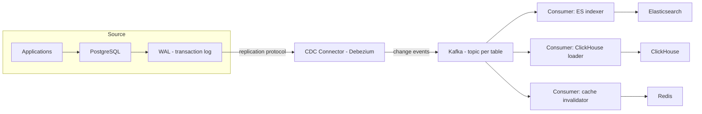
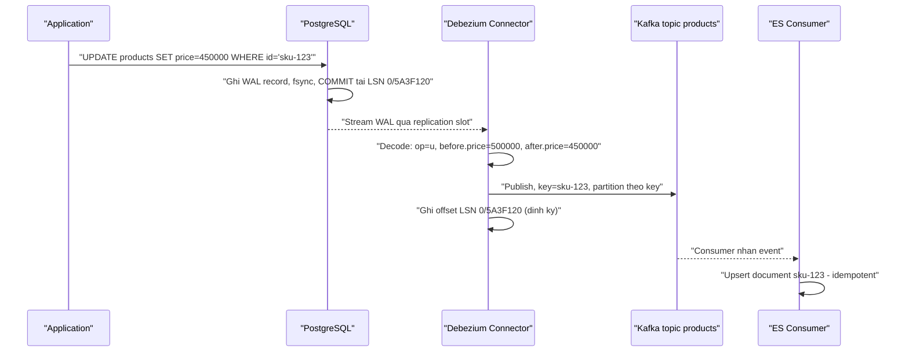

+++
title = "Chương 3: Bản chất của Change Data Capture"
date = "2026-02-20T10:00:00+07:00"
draft = false
tags = ["backend", "cdc", "kafka", "database"]
series = ["Change Data Capture"]
+++

## 3.1. Insight nền tảng: dữ liệu về mọi thay đổi đã tồn tại sẵn

Hãy quay lại điểm mà Chương 2 dừng lại. Chúng ta cần một nguồn thông tin về thay đổi thỏa mãn ba điều kiện: **đầy đủ tuyệt đối** (mọi thay đổi, từ mọi đường ghi, kể cả DELETE), **atomic với dữ liệu commit** (không event ma, không mất event), và **không đặt thêm chi phí vào transaction path**.

Bây giờ nhìn lại điều đã xác lập ở Chương 1: mọi database ACID, để đảm bảo durability, **buộc phải** ghi mọi thay đổi vào transaction log trước khi báo commit — cơ chế write-ahead. Nghĩa là:

- Log chứa **100% thay đổi đã commit** — không phụ thuộc code path nào, vì đây là con đường vật lý duy nhất để một thay đổi trở thành bền vững. UPDATE từ ORM, DELETE từ migration script, hotfix SQL lúc 2 giờ sáng — tất cả đều đi qua đây, không có ngoại lệ.
- Log được ghi **trong chính cơ chế commit** — atomicity với dữ liệu không phải là thứ phải xây thêm, nó là định nghĩa.
- Log được sắp xếp **theo đúng thứ tự commit** — mỗi record có vị trí đơn điệu tăng (LSN trong PostgreSQL, binlog position/GTID trong MySQL).
- Chi phí ghi log **đã được trả**, bất kể có ai đọc nó hay không. Database trả chi phí này từ ngày đầu tiên vận hành để phục vụ crash recovery.

Và hơn thế: database đã có sẵn cơ chế **cho bên ngoài đọc log này** — vì đó chính là cách replication hoạt động. PostgreSQL replica nhận WAL stream qua replication protocol; MySQL replica đọc Binlog qua replication protocol. Các protocol này đã được tôi luyện qua hàng chục năm production ở quy mô lớn nhất thế giới.

Insight của Change Data Capture nằm gọn trong một câu: **thay vì xây một cơ chế mới để bắt thay đổi, hãy đóng vai một replica và khai thác chính transaction log**. Connector CDC kết nối vào database y như một replica, nhận stream thay đổi, decode thành các event có cấu trúc, và đẩy vào hạ tầng streaming. Không trigger, không cột `updated_at`, không sửa một dòng application code nào.

Đây không phải ý tưởng mới về công nghệ — Oracle GoldenGate làm điều này từ thập niên 2000, LinkedIn xây Databus từ 2011 rồi mô tả nguyên lý trong bài "The Log" của Jay Kreps (2013). Điều mới của thập kỷ qua là sự chuẩn hóa: Debezium + Kafka biến nó từ kỹ thuật độc quyền đắt tiền thành hạ tầng open-source phổ cập.

## 3.2. Query-based CDC vs Log-based CDC

Thuật ngữ "CDC" bao trùm cả hai họ, nên cần phân định ngay. **Query-based CDC** (đôi khi gọi là polling-based) chính là polling `updated_at`/version có kỷ luật hơn — Debezium cũng có JDBC-polling mode, Kafka Connect có JDBC Source Connector. **Log-based CDC** đọc transaction log. Sự khác biệt không phải là mức độ — là phạm trù:

| Tiêu chí | Query-based CDC | Log-based CDC |
|---|---|---|
| Nguồn sự thật | Kết quả query tại thời điểm poll | Transaction log — chính cơ chế durability |
| Tải lên database | Query lặp trên bảng, chiếm buffer pool, connection | Sequential read trên log, không chạm bảng, không qua query engine |
| Bắt DELETE | Không (trừ soft delete) | **Có** — DELETE là một log record như mọi record khác |
| Intermediate state | Chỉ thấy trạng thái tại thời điểm poll | **Mọi** thay đổi, từng phiên bản một |
| Ordering | Theo cột thời gian — không phải commit order, vỡ khi clock skew | **Theo commit order** — thứ tự nhân quả thật |
| Old value của row | Không có | Có (tùy cấu hình, VD REPLICA IDENTITY FULL) |
| Yêu cầu schema | Cột `updated_at`/version + index trên mọi bảng | **Không thay đổi schema**, không sửa application |
| Latency | Sàn = chu kỳ poll | Sub-second, giới hạn bởi tốc độ decode + network |
| Yêu cầu quyền/cấu hình DB | Chỉ cần SELECT | Quyền replication, bật logical decoding/row-based binlog |
| Coupling với database internals | Thấp | Cao — phụ thuộc log format, version, cấu hình |

Hai dòng cuối là trade-off thật sự của log-based, sẽ quay lại ở mục 3.7. Nhưng sáu dòng đầu giải thích vì sao log-based thắng tuyệt đối về chất lượng dữ liệu: nó không **suy đoán** thay đổi từ trạng thái — nó đọc **chính bản ghi gốc** về thay đổi.

Một điểm đáng nhấn về hiệu năng: đọc log rẻ một cách phi trực giác. Log là file **append-only**, đọc nó là **sequential read** — pattern I/O nhanh nhất tồn tại, và phần log mới ghi gần như luôn còn trong OS page cache (database vừa fsync nó xong). Connector đọc log không đi qua query planner, không lấy lock, không chiếm buffer pool của bảng. Trên các hệ tôi từng vận hành, một connector Debezium bám theo workload hàng chục nghìn thay đổi mỗi giây tạo tải CPU/I/O lên database nhỏ hơn một read replica bình thường (*nhận định tham khảo từ kinh nghiệm, cần đo trên hệ của bạn*).

### Điều kiện tồn tại: phải có log để mà đọc

Hệ quả logic ngược: **không có transaction log thì không có log-based CDC**. Điều này không thuần lý thuyết:

- MySQL với Binlog bị tắt (`skip-log-bin`, từng phổ biến để tiết kiệm I/O), hoặc binlog format `STATEMENT` thay vì `ROW` — không có dữ liệu row-level để decode.
- Các storage engine không journal: MEMORY engine của MySQL, Redis ở chế độ không AOF, nhiều database nhúng hoặc cache — thay đổi không để lại vết bền vững nào.
- Một số managed service đời đầu không mở quyền replication/logical decoding ra ngoài (tình hình đã tốt hơn nhiều: RDS, Cloud SQL, Aurora nay đều hỗ trợ).
- Log bị **purge trước khi đọc kịp**: log tồn tại nhưng chỉ được giữ trong thời gian hữu hạn; nếu connector chết 3 ngày và retention là 2 ngày, phần lịch sử đó biến mất vĩnh viễn — với hậu quả vận hành nghiêm trọng (mục 3.4).

Với các nguồn như vậy, bạn buộc quay về query-based hoặc trigger — với đầy đủ hạn chế đã phân tích ở Chương 2. Bài học thiết kế: **khả năng CDC là một tiêu chí chọn database**, hãy đánh giá nó từ đầu chứ đừng để đến lúc cần.

## 3.3. Kiến trúc tổng quan một CDC pipeline

Vai trò từng tầng, và vì sao tầng giữa (Kafka) không phải tùy chọn trang trí:

- **Connector** (Debezium là chuẩn de facto cho open-source): đóng vai replica, decode log record thành change event có cấu trúc — `before`, `after`, operation (`c`/`u`/`d`), metadata (LSN, transaction id, timestamp). Ghi nhớ vị trí đã đọc (offset).
- **Kafka** làm ba việc quyết định: (1) **buffer** — hấp thụ chênh lệch tốc độ giữa nguồn và các sink, để một sink chậm/chết không dội ngược áp lực về database; (2) **fan-out** — một lần đọc log phục vụ N consumer, thay vì N connector cùng bám vào database; (3) **replay** — với retention hoặc log compaction, consumer mới (hoặc consumer cần rebuild) đọc lại từ đầu mà không chạm database. Bỏ tầng này (connector ghi thẳng sink) là mẫu thiết kế sai phổ biến: mọi sự cố của sink lập tức trở thành sự cố của việc đọc log, và khi log bị giữ lại chờ sink, disk của database phình lên — xem mục 3.4.
- **Consumer/Sink**: chuyển hóa change event thành thao tác trên hệ đích. Đây là nơi chứa logic riêng của từng đích — upsert vào Elasticsearch, insert vào ClickHouse, invalidate Redis key.

## 3.4. Các khái niệm cốt lõi

Phần này là bộ khung khái niệm cho toàn bộ các chương sau. Mỗi khái niệm được trình bày theo cùng logic: nó giải quyết vấn đề gì, và hiểu sai nó thì hỏng ở đâu.

### Snapshot — vì sao cần initial snapshot

Transaction log chỉ được giữ lại hữu hạn (giờ, ngày). Khi bạn bật CDC cho một bảng đã tồn tại 5 năm, log chỉ còn chứa vài ngày thay đổi gần nhất — **trạng thái hiện tại của bảng không thể tái thiết từ phần log còn lại**. Vì vậy pipeline phải bắt đầu bằng **Snapshot**: đọc toàn bộ trạng thái hiện tại của bảng (về bản chất là các câu SELECT có kiểm soát), phát ra dưới dạng các event "read", **rồi** chuyển sang streaming từ đúng vị trí log tương ứng thời điểm snapshot bắt đầu. Điểm tinh tế nằm ở chữ "đúng vị trí": snapshot và streaming phải khớp nhau không kẽ hở — không sót thay đổi xảy ra trong lúc snapshot, không áp thay đổi cũ đè lên dữ liệu mới. Các connector trưởng thành xử lý việc này bằng cách ghi lại LSN/position lúc mở snapshot và stream từ đó, chấp nhận vài event trùng lặp (được giải quyết bằng idempotency phía consumer). Snapshot bảng trăm triệu row là việc nặng và có tải thật lên database — các kỹ thuật snapshot song song và incremental snapshot (chạy snapshot xen kẽ với streaming, không khóa) sẽ được bàn ở chương về Debezium.

### Streaming phase

Sau snapshot, connector vào chế độ thường trực: nhận log record, decode, publish. Chỉ số sức khỏe quan trọng nhất của phase này là **lag** — khoảng cách giữa vị trí mới nhất của log và vị trí connector đã xử lý. Lag chính là consistency window của Chương 1, giờ đã đo được bằng metric cụ thể.

### Offset / Checkpoint

Connector định kỳ ghi lại vị trí log đã xử lý (LSN, binlog position) vào một nơi bền vững (Kafka Connect lưu vào offset topic). Khi restart — do deploy, do crash — nó tiếp tục từ offset đã lưu. Đây là cơ chế làm cho pipeline **có thể chết và sống lại mà không mất dữ liệu**.

Mặt còn lại của đồng xu, và là bài học vận hành đắt giá nhất của log-based CDC: database chỉ được phép purge phần log mà mọi "replica" đã tiêu thụ. PostgreSQL theo dõi điều này bằng **Replication Slot**: slot ghim vị trí cũ nhất mà connector còn cần, và WAL từ vị trí đó trở đi **không được xóa**. Nếu connector chết mà không ai để ý, slot đứng yên, WAL tích tụ, **disk của primary đầy, và database ngừng nhận ghi**. Tôi đã chứng kiến sự cố này làm sập một hệ thống thanh toán trong 40 phút: một connector bị tắt "tạm thời" trước kỳ nghỉ lễ, không có alert trên `pg_replication_slots`, WAL ăn hết 200GB disk còn trống trong 4 ngày. Quy tắc bất di bất dịch: **bật CDC là phải có monitoring slot lag và WAL size, trước cả khi có consumer đầu tiên**. Đây là ví dụ điển hình của "coupling với database internals" — sức mạnh và rủi ro đến từ cùng một chỗ.

### Delivery Guarantee — at-least-once là mặc định, exactly-once là hàng xa xỉ

Chuỗi sự kiện điển hình khi connector crash: đã publish event lên Kafka, **chưa kịp** ghi offset, restart, đọc lại từ offset cũ → publish lại các event đó. Kết quả: **at-least-once** — không mất, nhưng có thể trùng. Đây là mặc định của gần như mọi CDC pipeline, và là mặc định **hợp lý**: để có exactly-once thật sự, việc publish event và việc ghi offset phải atomic với nhau — lại chính là bài toán "atomic giữa hai hệ thống" của Dual Write, lần này ở tầng hạ tầng. Kafka có transactional producer giúp exactly-once *trong phạm vi Kafka*, nhưng đoạn cuối từ Kafka vào Elasticsearch/ClickHouse lại là một ranh giới hệ thống nữa.

Kết luận thực dụng mà mọi thiết kế phải tuân theo: **đừng săn đuổi exactly-once delivery; hãy thiết kế exactly-once *effect* bằng idempotent consumer**. Change event mang primary key và vị trí log — upsert theo key là idempotent tự nhiên; áp dụng event cũ hơn version đã có thì bỏ qua. Consumer viết đúng kiểu này miễn nhiễm với duplicate, và toàn bộ pipeline trở nên đơn giản hơn hẳn. Consumer *không* idempotent (ví dụ: "mỗi event thì cộng thêm vào counter") là thiết kế sai với at-least-once — counter sẽ đếm thừa sau mỗi lần retry.

### Ordering — per-key, không phải toàn cục

Kafka chỉ đảm bảo thứ tự **trong một partition**. CDC pipeline chuẩn dùng **primary key của row làm partition key**: mọi thay đổi của cùng một row đi vào cùng partition, đến consumer theo đúng thứ tự commit. Đây chính là lời giải cho race condition ordering đã giết Dual Write ở Chương 2 — thứ tự giờ do log của database quyết định, không do scheduler của OS.

Cái giá: **không có ordering giữa các key khác nhau**, và mặc định không có ordering giữa các bảng (mỗi bảng một topic). Một transaction chạm `orders` và `order_items` sẽ thành các event trên hai topic, có thể được consume lệch thời điểm — consumer có thể thấy order_items trước order trong một khoảnh khắc. Nghiệp vụ cần nguyên vẹn ranh giới transaction phải dùng thêm kỹ thuật (transaction metadata topic, buffer theo transaction id) — có chi phí, và là chủ đề của chương sau. Thiết kế sai điển hình ở đây: đổi partition key sang một trường khác (ví dụ `warehouse_id` cho "tiện" consumer) — hai update liên tiếp của cùng một đơn hàng rơi vào hai partition, được xử lý bởi hai consumer instance, và update cũ có thể đè update mới: tái hiện đúng lỗi ordering của Dual Write ngay trong một pipeline CDC "xịn".

### Schema Change

Bảng nguồn sẽ `ALTER TABLE` — đó là điều chắc chắn. Connector log-based nhìn thấy schema change trong log (hoặc theo dõi DDL) và điều chỉnh cách decode; event thường mang schema đi kèm hoặc tham chiếu Schema Registry. Điều cần khắc ghi: schema change **không dừng lại ở connector** — nó lan xuống mọi consumer và mọi sink. Thêm cột nullable thường lành; đổi kiểu cột hoặc drop cột có thể làm gãy sink schema (ClickHouse, Elasticsearch mapping). Quy trình đúng coi schema change là một sự kiện được quản lý (backward-compatible changes, Schema Registry với compatibility mode), không phải điều "hy vọng không sao".

### Delete Event và Tombstone

DELETE trong log sinh ra change event với `before` = trạng thái cuối, `after = null` — downstream biết chính xác row nào biến mất, điều mà polling không bao giờ làm được. Riêng với Kafka còn một khái niệm nữa: **Tombstone event** — message có key nhưng `value = null`. Nó tồn tại vì **log compaction**: Kafka topic ở chế độ compact chỉ giữ message mới nhất cho mỗi key, biến topic thành một "bảng" có thể replay để dựng lại trạng thái. Nhưng compaction chỉ giữ *message mới nhất* — nếu message cuối của một key là delete event bình thường, key đó vẫn chiếm chỗ mãi. Tombstone là tín hiệu cho compaction: "hãy xóa hẳn key này". Vì vậy Debezium mặc định phát *hai* message khi DELETE: delete event (cho consumer xử lý) rồi tombstone (cho compaction dọn dẹp). Consumer phải được viết để nhận biết và bỏ qua/xử lý tombstone — quên điều này là nguồn NullPointerException kinh điển trong các sink connector tự viết.

## 3.5. Ví dụ xuyên suốt: một UPDATE đi qua pipeline

Ghép mọi khái niệm lại bằng một thay đổi cụ thể. Seller đổi giá sản phẩm `sku-123` từ 500k xuống 450k:

Toàn bộ chuỗi này điển hình mất 100–500ms (*số tham khảo*). Nếu connector crash giữa bước publish và bước ghi offset: restart, đọc lại từ LSN cũ, publish trùng event — consumer upsert lại giá 450k, kết quả không đổi. Đó là at-least-once + idempotency vận hành trong thực tế. Nếu ES consumer chết 2 tiếng: event nằm yên trong Kafka, database và connector không bị ảnh hưởng gì, consumer sống lại và xử lý bù — đó là giá trị của tầng buffer.

## 3.6. CDC mở ra điều gì ngoài bài toán sync

Khi mọi thay đổi của database trở thành một stream có thứ tự trong Kafka, các bài toán sau trở thành consumer mới trên cùng hạ tầng, thay vì dự án riêng: cập nhật search index và cache (bài toán gốc), nạp real-time vào warehouse, audit trail đầy đủ ở mức row, cache warming, xây materialized view liên service, strangler pattern khi tách monolith (đọc thay đổi của legacy DB mà không sửa legacy code), và relay cho Outbox Pattern như đã hứa ở Chương 2 — Debezium đọc bảng outbox qua WAL, loại bỏ tầng polling của relay truyền thống. Một hạ tầng, nhiều lời giải — đó là lý do CDC xứng đáng vị trí hạ tầng nền tảng chứ không phải công cụ một mục đích.

## 3.7. Trade-off — cái giá thật của CDC

Không thần thánh hóa. CDC log-based trả lời đúng ba câu hỏi kiểm định của Chương 2, nhưng hóa đơn của nó như sau:

| Trade-off | Bản chất | Hậu quả nếu xem nhẹ |
|---|---|---|
| Độ phức tạp vận hành | Thêm connector, Kafka, Schema Registry, consumer — mỗi thứ cần deploy, monitor, upgrade, on-call | Pipeline "chạy được" nhưng không ai biết nó chết từ bao giờ; sự cố phát hiện bởi người dùng thay vì alert |
| Eventual consistency | Downstream luôn trễ hơn source một consistency window (bình thường sub-second, khi sự cố có thể là giờ) | Nghiệp vụ cần read-your-writes đọc nhầm từ downstream → bug ngẫu nhiên không tái hiện được |
| Coupling với database internals | Phụ thuộc log format, cấu hình (wal_level, binlog_format), quyền replication, hành vi theo version | Upgrade database major version làm gãy connector; Replication Slot bị quên làm đầy disk primary |
| Chi phí hạ tầng | Kafka cluster, connector worker, dung lượng log giữ thêm, network | Trả chi phí vận hành một hệ streaming cho bài toán mà một cron job 50 dòng giải quyết đủ tốt |
| At-least-once + per-key ordering | Duplicate là bình thường; không có ordering liên bảng/liên key | Consumer không idempotent đếm thừa; logic giả định thứ tự liên bảng gãy âm thầm |
| Schema coupling | Change event phản chiếu schema vật lý của bảng | Downstream coupling vào internal schema; refactor database thành breaking change cho cả tổ chức (cần contract layer/outbox cho integration liên context) |

Nguyên tắc quyết định mà tôi dùng suốt nhiều năm: **CDC là khoản đầu tư hạ tầng, không phải giải pháp tính năng**. Nếu bạn có một bảng cần sync sang một đích với latency phút — dùng polling, xong việc. Nếu bạn có nhiều nguồn, nhiều đích, yêu cầu sub-second, yêu cầu không sót DELETE, đội ngũ đủ năng lực vận hành Kafka — CDC trả lãi kép theo thời gian, vì mỗi consumer mới gần như miễn phí. Ranh giới nằm ở năng lực vận hành của tổ chức, không nằm ở độ "xịn" của công nghệ.

## Tóm tắt chương

- Insight cốt lõi của CDC: transaction log đã chứa 100% thay đổi đã commit, đúng thứ tự commit, atomic theo định nghĩa, chi phí đã trả sẵn cho durability — và replication protocol là cánh cửa có sẵn để đọc nó. CDC connector đơn giản là một "replica" đặc biệt.
- Log-based vượt trội query-based về phạm trù, không phải mức độ: bắt DELETE, bắt mọi intermediate state, ordering theo commit order, không tải query lên bảng, không đổi schema. Đọc log rẻ vì là sequential read trên file append-only đã fsync.
- Không có log thì không có log-based CDC: Binlog tắt, engine không journal, log purge trước khi đọc — khả năng CDC là tiêu chí chọn database.
- Bộ khái niệm cốt lõi: Snapshot (tái thiết trạng thái ban đầu vì log hữu hạn), Streaming + lag, Offset/Checkpoint (và rủi ro Replication Slot làm đầy disk), at-least-once + idempotent consumer thay vì săn exactly-once, per-key ordering qua partition key (không có ordering liên key/liên bảng), schema change lan xuống toàn pipeline, delete event và tombstone cho log compaction.
- Kiến trúc chuẩn: Database → Log → Connector → Kafka → Consumers → Sinks; tầng Kafka đảm nhiệm buffer, fan-out, replay — bỏ nó là nối thẳng sự cố của sink vào database.
- Trade-off thật: độ phức tạp vận hành, eventual consistency, coupling với database internals, chi phí hạ tầng. CDC là khoản đầu tư hạ tầng — chỉ đáng khi bài toán và năng lực vận hành đủ lớn.

## Đọc tiếp

Chương 4 — [PostgreSQL Internals: WAL và Logical Replication](/series/cdc/04-postgresql-internals/): đi sâu vào nguồn log quan trọng nhất — vì sao PostgreSQL phải ghi WAL, LSN là gì, logical decoding hoạt động ra sao, và Replication Slot — cơ chế vừa là nền tảng của CDC trên PostgreSQL, vừa là nguồn gốc của failure kinh điển nhất: WAL phình đầy disk.
