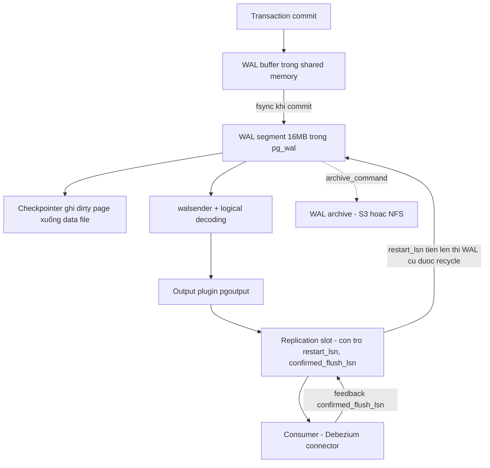
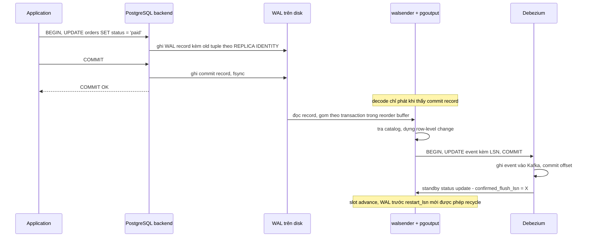

+++
title = "Chương 4: PostgreSQL Internals — WAL và Logical Replication"
date = "2026-02-20T11:00:00+07:00"
draft = false
tags = ["backend", "cdc", "kafka", "database"]
series = ["Change Data Capture"]
+++

> **Đối tượng**: Senior Backend Engineer, Tech Lead, Solution Architect đang thiết kế hoặc vận hành pipeline CDC trên PostgreSQL.
> **Mục tiêu chương**: Sau chương này, bạn phải trả lời được ba câu hỏi mà mọi cuộc review kiến trúc CDC trên PostgreSQL đều xoay quanh: (1) WAL thực chất là gì và vì sao nó là *nguồn sự thật duy nhất* mà CDC có thể tin; (2) replication slot hoạt động thế nào và vì sao nó là con dao hai lưỡi nổi tiếng nhất của CDC trên PostgreSQL; (3) REPLICA IDENTITY ảnh hưởng gì đến nội dung event và bạn phải trả giá gì cho từng lựa chọn.

---

## 4.1. Vì sao PostgreSQL phải ghi WAL trước khi ghi data page

### 4.1.1. Bài toán từ first principles

Hãy quên PostgreSQL đi một phút và tự thiết kế một storage engine. Bạn có các data page 8KB nằm trên disk, và một buffer pool trong RAM. Khi transaction `UPDATE accounts SET balance = balance - 100 WHERE id = 42` commit, bạn có hai lựa chọn:

**Lựa chọn A — ghi thẳng data page xuống disk khi commit.** Vấn đề: một transaction có thể chạm vào hàng chục page nằm rải rác (heap page, index page của 5 index khác nhau, TOAST page). Ghi tất cả xuống disk là *random I/O* — thứ đắt nhất trên cả HDD lẫn SSD. Tệ hơn: việc ghi một page 8KB không atomic ở tầng phần cứng (sector thường 512B hoặc 4KB). Nếu mất điện *giữa lúc* đang ghi page, bạn có một **torn page** — nửa đầu là dữ liệu mới, nửa sau là dữ liệu cũ. Page đó giờ là rác, và bạn không có cách nào khôi phục vì bản cũ đã bị ghi đè.

**Lựa chọn B — trì hoãn ghi data page, chỉ giữ thay đổi trong RAM.** Nhanh, nhưng mất điện là mất sạch mọi transaction đã "commit". Vi phạm chữ D trong ACID.

WAL (Write-Ahead Log) là lời giải hợp nhất cả hai: **trước khi bất kỳ data page nào được ghi xuống disk, bản mô tả thay đổi phải được ghi vào một log append-only và fsync xuống disk trước**. Đó là *write-ahead principle*. Khi commit, PostgreSQL chỉ cần fsync phần WAL của transaction đó — một lần *sequential write* duy nhất, rẻ hơn random write nhiều lần. Data page bẩn (dirty page) cứ nằm trong shared buffers, được background writer và checkpointer ghi xuống *sau*, theo nhịp riêng.

### 4.1.2. Điều gì xảy ra khi crash giữa chừng — nếu không có WAL, và nếu có

Kịch bản: transaction T1 update 3 page P1, P2, P3. Server crash khi mới ghi được P1 xuống disk.

- **Không có WAL**: disk chứa P1 mới + P2, P3 cũ. Database ở trạng thái *không bao giờ tồn tại hợp lệ* — vi phạm atomicity. Không có thông tin nào để biết phải sửa gì. Dữ liệu hỏng vĩnh viễn.
- **Có WAL**: khi restart, PostgreSQL chạy **crash recovery**: đọc WAL từ checkpoint gần nhất, *redo* tuần tự mọi record. Mỗi WAL record mang LSN; mỗi data page lưu `pg_lsn` của record cuối cùng đã áp lên nó — recovery so sánh để biết page nào cần replay, page nào đã mới. Transaction chưa có commit record trong WAL thì coi như chưa từng xảy ra (MVCC + CLOG lo phần visibility). Torn page được giải quyết bằng **full-page write**: lần đầu một page bị sửa sau mỗi checkpoint, PostgreSQL ghi *nguyên cả page* vào WAL, nên dù page trên disk có rách, recovery vẫn dựng lại được từ ảnh đầy đủ.

Hai tham số vận hành liên quan trực tiếp:

- `fsync = on` — tắt nó đi là từ bỏ durability. Đừng bao giờ tắt trên production, kể cả "chỉ để benchmark rồi bật lại" (nhiều sự cố thật bắt đầu như vậy).
- `synchronous_commit` — có thể hạ xuống `off` để đổi durability của *vài trăm ms* transaction cuối lấy throughput; database không bao giờ corrupt, chỉ có thể mất các commit cuối. Đây là knob hợp lệ cho workload chấp nhận được điều đó.

**Checkpoint** là thời điểm PostgreSQL đảm bảo mọi dirty page trước một LSN nhất định đã nằm trên disk. Ý nghĩa với recovery: chỉ cần replay WAL *từ checkpoint gần nhất*, không phải từ đầu vũ trụ. Ý nghĩa với CDC: checkpoint là mốc để WAL *có thể* được tái sử dụng — trừ khi có thứ gì đó giữ nó lại. "Thứ gì đó" chính là nội dung mục 4.5.

**Góc nhìn CDC**: WAL không phải là một tiện ích phụ — nó là *bản ghi có thứ tự, bền vững, đầy đủ của mọi thay đổi đã commit*. Đó chính xác là định nghĩa của một change stream. CDC log-based trên PostgreSQL không "hook" vào database; nó chỉ đọc thứ mà database *bắt buộc phải viết ra* để tự bảo vệ mình. Đây là lý do nền tảng khiến log-based CDC không tạo thêm write overhead lên transaction path (khác với trigger-based).

---

## 4.2. Cấu trúc WAL: segment, record, và LSN

### 4.2.1. WAL segment và WAL record

WAL về mặt logic là một dòng byte vô hạn, append-only. Về mặt vật lý, nó được cắt thành các **WAL segment** — file 16MB (mặc định, đổi được lúc `initdb` bằng `--wal-segsize`) nằm trong `pg_wal/`, tên file dạng `000000010000000A0000004F` (timeline + vị trí). Segment đầy thì mở segment mới; segment cũ được **recycle** (đổi tên dùng lại) hoặc xóa — *nếu không còn ai cần*.

Bên trong segment là chuỗi **WAL record**. Mỗi record mô tả một thay đổi vật lý hoặc logic: "heap insert vào relation X, block Y, tuple Z", "btree split", "commit của transaction 12345". Record có header chứa resource manager ID, độ dài, CRC, và LSN của record trước đó (tạo thành chuỗi kiểm tra được).

### 4.2.2. LSN — địa chỉ trong log

**LSN (Log Sequence Number)** là một số 64-bit, là *byte offset tính từ đầu dòng WAL logic*. Nó được hiển thị dạng `A/B` — ví dụ `5C/7F000148` nghĩa là byte thứ `0x5C7F000148`. LSN là **địa chỉ tuyệt đối, đơn điệu tăng, toàn cục** trong log:

- Hai LSN so sánh được trực tiếp: LSN lớn hơn = xảy ra sau.
- Hiệu hai LSN = số byte WAL giữa hai thời điểm. Đây là lý do LSN dùng được để **đo lag bằng byte** — chính xác hơn nhiều so với đo bằng "số giây":

```sql
-- Lag của từng replication slot, tính bằng byte WAL
SELECT slot_name,
       pg_size_pretty(
         pg_wal_lsn_diff(pg_current_wal_lsn(), confirmed_flush_lsn)
       ) AS replication_lag
FROM pg_replication_slots;
```

- Mỗi data page lưu LSN cuối đã áp lên nó → recovery biết cần replay gì.
- Với CDC: LSN chính là **offset** mà connector checkpoint. Debezium lưu LSN vào offset topic; khi restart, nó nói với PostgreSQL "cho tôi stream từ LSN này". Toàn bộ khả năng resume của CDC trên PostgreSQL đứng trên một sự thật: *LSN là con trỏ ổn định vào một log bất biến*.

Điểm tinh tế mà nhiều người bỏ qua: LSN chỉ có nghĩa **trong một timeline**. Sau failover/PITR, timeline mới được tạo và lịch sử có thể rẽ nhánh — đây là gốc rễ của bài toán "slot không sống sót qua failover" ở mục 4.8.

---

## 4.3. Physical Replication vs Logical Replication

Hai cơ chế cùng đọc một dòng WAL nhưng khác nhau về *tầng ngữ nghĩa*:

| | Physical Replication | Logical Replication |
|---|---|---|
| Đơn vị truyền | WAL record thô, byte-level | Thay đổi row-level đã decode |
| Replica hiểu gì | "Ghi các byte này vào block 7 của file 16384" | "INSERT vào bảng orders giá trị {...}" |
| Yêu cầu | Cùng major version, cùng kiến trúc, byte-identical cluster | Chỉ cần hiểu được protocol; đích có thể là Kafka, database khác, bất cứ gì |
| Chọn lọc | Toàn cluster, tất cả hoặc không gì | Theo bảng, theo cột, theo hàng (publication) |
| Chi phí trên primary | Gần như zero xử lý thêm | CPU + memory để decode, reorder transaction |

Physical replication là "photocopy máu": standby là bản sao bit-perfect, dùng cho HA. Nhưng CDC không thể dùng nó — Kafka không biết "block 7 của file 16384" nghĩa là gì. CDC cần **Logical Decoding**: quá trình PostgreSQL đọc lại WAL record, tra catalog để biết record đó thuộc bảng nào, cột nào, kiểu dữ liệu gì, rồi dựng lại thành sự kiện row-level có ngữ nghĩa.

Cái giá của việc decode: PostgreSQL phải **reorder theo transaction**. WAL chứa các record của nhiều transaction đan xen; logical decoding gom chúng lại (trong `logical_decoding_work_mem`, tràn thì spill ra disk) và chỉ phát ra khi transaction commit, theo *thứ tự commit*. Một transaction 10 triệu row sẽ khiến walsender buffer/spill 10 triệu thay đổi trước khi phát — hãy nhớ chi tiết này khi đọc mục 4.8 về long-running transaction.

---

## 4.4. Logical Decoding: wal_level, plugin, và REPLICA IDENTITY

### 4.4.1. wal_level = logical

```ini
# postgresql.conf
wal_level = logical            # mặc định là 'replica'; đổi cần restart
max_replication_slots = 10     # >= số connector + physical replica dùng slot
max_wal_senders = 10
```

`wal_level=replica` chỉ ghi đủ thông tin cho physical replication và crash recovery. `logical` ghi *thêm* thông tin (đặc biệt là old tuple theo REPLICA IDENTITY) để decoder dựng lại được row-level change. Chi phí thêm thường vài phần trăm volume WAL — con số tham khảo, phụ thuộc workload — nhưng việc phải **restart** để đổi là lý do bạn nên bật nó *ngay từ ngày đầu dựng cluster* nếu có bất kỳ khả năng nào sẽ cần CDC. Bài học thiết kế: đây là loại quyết định rẻ khi làm sớm, đắt khi làm muộn.

### 4.4.2. Decoding plugin: pgoutput vs wal2json

Logical decoding có kiến trúc plugin — WAL record được đưa qua một **output plugin** quyết định format đầu ra:

- **pgoutput**: plugin built-in từ PostgreSQL 10, binary protocol, chính là plugin của logical replication native. **Debezium mặc định và khuyến nghị dùng pgoutput** — không cần cài gì thêm trên server, được cộng đồng PostgreSQL bảo trì, hiệu năng tốt nhất.
- **wal2json**: extension bên thứ ba, xuất JSON. Tiện cho debug và các consumer tự chế, nhưng là một extension phải cài, phải vá, và JSON encode/decode tốn CPU hơn đáng kể ở throughput cao.
- (Lịch sử: `decoderbufs` — protobuf, di sản từ thời Debezium đầu; ngày nay hầu như không còn lý do chọn.)

Nguyên tắc chọn của người thiết kế platform: **pgoutput trừ khi có lý do rất cụ thể** — mỗi extension bên thứ ba trên database production là một bề mặt rủi ro vận hành (upgrade path, managed service không hỗ trợ, v.v.). Lưu ý: RDS/Aurora/Cloud SQL đều hỗ trợ pgoutput; đây thường là yếu tố quyết định.

### 4.4.3. REPLICA IDENTITY — thứ quyết định UPDATE/DELETE event chứa gì

Đây là setting *per-table* bị hiểu sai nhiều nhất. Nó trả lời câu hỏi: **khi UPDATE/DELETE, PostgreSQL ghi phần "ảnh cũ" (old tuple) nào của row vào WAL?**

| Mode | Old tuple trong WAL | UPDATE event | DELETE event |
|---|---|---|---|
| `DEFAULT` | Chỉ các cột primary key, và chỉ khi PK thay đổi | `before` chỉ có PK (hoặc null) | `before` chỉ có PK |
| `USING INDEX idx` | Các cột của một unique index NOT NULL chỉ định | `before` chỉ có cột trong index | tương tự |
| `FULL` | **Toàn bộ row cũ** | `before` đầy đủ mọi cột | `before` đầy đủ |
| `NOTHING` | Không gì cả | UPDATE/DELETE **không decode được** — logical replication sẽ báo lỗi trên bảng có ghi | — |

```sql
ALTER TABLE orders REPLICA IDENTITY FULL;
-- kiểm tra: relreplident trong pg_class ('d','n','f','i')
SELECT relname, relreplident FROM pg_class WHERE relname = 'orders';
```

**Vì sao Debezium khuyến nghị FULL cho một số case:**

1. **Consumer cần biết giá trị cũ** — audit trail, tính diff, invalidate cache theo giá trị cũ. Với DEFAULT, `before` gần như rỗng.
2. **Bảng không có primary key** — không có FULL thì DELETE event chỉ nói "có một row bị xóa" mà không nói row nào. Consumer không thể áp thay đổi. (Thiết kế đúng là *đừng để bảng CDC không có PK*, nhưng thực tế legacy luôn tồn tại.)
3. **TOAST columns**: với DEFAULT, khi UPDATE không chạm vào một cột TOAST (text/jsonb lớn), WAL không chứa giá trị cột đó và event sẽ mang placeholder `__debezium_unavailable_value`. Consumer downstream phải tự merge — nguồn bug kinh điển ("vì sao cột description thỉnh thoảng biến thành chuỗi lạ?"). FULL loại bỏ vấn đề này.

**Cái giá của FULL:**

- **WAL volume tăng**: mỗi UPDATE/DELETE ghi thêm nguyên row cũ. Bảng row rộng (nhiều cột text) + workload update-heavy có thể thấy WAL tăng 30–100% (số tham khảo). WAL tăng → I/O tăng, archive tăng, replication băng thông tăng, và *slot retention rủi ro tăng* (mục 4.5).
- **Trên subscriber logical replication native** (không phải Debezium), bảng không PK + FULL nghĩa là mỗi UPDATE/DELETE là một lần scan tìm row khớp toàn bộ cột — chậm thảm hại.

Quyết định thiết kế đúng: mặc định giữ DEFAULT, bật FULL **có chủ đích, per-table**, cho các bảng mà consumer thực sự cần `before` đầy đủ hoặc có TOAST + update thường xuyên. Ghi quyết định này vào data contract của từng topic.

---

## 4.5. Replication Slot — trái tim và gót chân Achilles

### 4.5.1. Bản chất: một con trỏ LSN mà server hứa sẽ tôn trọng

Nếu chỉ được nhớ một điều từ chương này, hãy nhớ điều này. **Replication slot là một con trỏ LSN được server ghi nhớ bền vững, kèm một lời hứa: "Tôi sẽ không xóa bất kỳ WAL nào mà consumer của slot này chưa xác nhận đã xử lý."**

Slot lưu vài trường then chốt (xem `pg_replication_slots`):

- `restart_lsn`: LSN cổ nhất mà server **phải giữ WAL từ đó** để có thể tiếp tục decode cho slot này (phải quay về đầu transaction mở cổ nhất chưa commit tại thời điểm đó).
- `confirmed_flush_lsn`: LSN mà consumer đã **xác nhận** xử lý xong — Debezium gửi feedback này định kỳ sau khi ghi event vào Kafka và commit offset.
- `catalog_xmin`: ngăn VACUUM dọn các row *catalog* cũ mà decoder còn cần để diễn giải WAL lịch sử.

Slot giải quyết một bài toán thật: không có slot, consumer chết 30 phút quay lại có thể thấy WAL đã bị recycle — mất dữ liệu vĩnh viễn, phải re-snapshot. Slot biến "consumer chậm" từ *mất dữ liệu* thành *chỉ là lag*. Đó là tính năng.

### 4.5.2. Hậu quả khi slot không advance — failure nổi tiếng nhất của CDC trên PostgreSQL

Mặt trái của lời hứa: **server giữ lời kể cả khi consumer đã chết và không bao giờ quay lại.**

Kịch bản kinh điển, xảy ra ở hầu hết mọi tổ chức từng vận hành Debezium trên PostgreSQL:

1. Connector bị pause / crash / Kafka Connect cluster gặp sự cố / ai đó tắt connector "tạm thời" rồi quên. Hoặc tinh vi hơn: connector chỉ subscribe các bảng ít ghi, không có traffic → không có gì để confirm → `confirmed_flush_lsn` đứng yên trong khi các bảng *khác* vẫn sinh WAL ào ạt (fix: `heartbeat.interval.ms` + heartbeat table để ép slot advance).
2. `restart_lsn` đứng yên. WAL tích tụ trong `pg_wal/`. Với write throughput 50MB/s WAL, một slot đứng yên 24 giờ giữ lại ~4.3TB (số minh họa).
3. Disk chứa `pg_wal` đầy. PostgreSQL **PANIC và shutdown** — không phải chỉ CDC chết, mà **toàn bộ database production chết**, kéo theo mọi ứng dụng.

Đây là điểm khác biệt triết lý với MySQL: MySQL purge binlog theo lịch bất kể replica có đọc kịp không (consumer chậm → mất dữ liệu, database sống); PostgreSQL giữ WAL vô hạn vì slot (consumer chậm → database chết, dữ liệu không mất). Cả hai đều là trade-off; PostgreSQL chọn hy sinh availability của primary để bảo vệ contract của slot. Người vận hành **bắt buộc** phải bù bằng guardrail:

```ini
# PostgreSQL 13+ — chốt chặn bắt buộc trên production
max_slot_wal_keep_size = 200GB   # quá ngưỡng, slot bị đánh dấu 'lost', WAL được giải phóng
```

Trade-off phải hiểu rõ: khi slot chuyển `wal_status = 'lost'`, connector **mất khả năng resume** — bạn cứu được database nhưng phải re-snapshot pipeline CDC. Đó là lựa chọn đúng: *một pipeline phải rebuild luôn rẻ hơn một primary database sập*. Định cỡ ngưỡng = (WAL rate đỉnh) × (thời gian tối đa bạn cho phép connector chết trước khi hy sinh nó) + biên an toàn, và phải nhỏ hơn hẳn dung lượng volume.

### 4.5.3. Monitoring — không phải tùy chọn

```sql
SELECT slot_name, active, wal_status,
       pg_size_pretty(pg_wal_lsn_diff(pg_current_wal_lsn(), restart_lsn)) AS retained_wal,
       pg_size_pretty(safe_wal_size) AS headroom_truoc_khi_lost
FROM pg_replication_slots;
```

Cảnh báo tối thiểu cho production:
- `retained_wal` vượt ngưỡng (ví dụ 20% của `max_slot_wal_keep_size`) → page.
- `active = false` kéo dài quá N phút → page.
- `confirmed_flush_lsn` không đổi quá N phút trong khi `pg_current_wal_lsn()` tiến → cảnh báo (bắt cả case heartbeat).
- Disk usage của `pg_wal` → page ở 70%.

Một slot bị bỏ quên là *time bomb có ngòi đếm bằng write throughput*. Quy trình offboard connector phải bao gồm `SELECT pg_drop_replication_slot('...')` — nhiều sự cố thật đến từ connector đã xóa nhưng slot còn sống.

---

## 4.6. Publication

**Publication** là phía "định nghĩa nội dung" của logical replication native (PostgreSQL 10+), và là thứ pgoutput yêu cầu:

```sql
CREATE PUBLICATION dbz_publication
    FOR TABLE public.orders, public.customers
    WITH (publish = 'insert, update, delete, truncate');

-- PostgreSQL 15+: lọc theo hàng và cột ngay tại nguồn
CREATE PUBLICATION dbz_pub_vn
    FOR TABLE public.orders (id, status, amount)
    WHERE (region = 'VN');
```

Publication quyết định *bảng nào, thao tác nào, hàng/cột nào* được phát qua slot dùng pgoutput. Với Debezium: cấu hình `publication.autocreate.mode = filtered` để nó tạo publication khớp `table.include.list` — tránh mặc định `FOR ALL TABLES` vốn decode mọi thứ (lãng phí CPU walsender và yêu cầu quyền superuser/ownership rộng). Lưu ý vận hành: thêm bảng vào `table.include.list` mà quên `ALTER PUBLICATION ... ADD TABLE` (khi dùng publication tạo tay) là lỗi cấu hình phổ biến — connector chạy êm nhưng bảng mới không bao giờ có event, và không có error nào cả. Row filter (PG15+) đẩy việc lọc về server — tiết kiệm băng thông nhưng nhớ rằng UPDATE làm row *ra/vào* phạm vi filter sẽ được phát như DELETE/INSERT tương ứng.

---

## 4.7. WAL Retention — ai đang giữ WAL của bạn?

Một segment WAL chỉ được recycle khi **không còn bất kỳ ai** trong các bên sau cần nó. Khi `pg_wal` phình to, hãy truy đủ cả bốn nghi phạm:

1. **Replication slot** (logical *và* physical): giữ từ `restart_lsn` cổ nhất. Nghi phạm số một.
2. **archive_command / archive_library**: segment chưa archive thành công (`.ready` tồn đọng trong `pg_wal/archive_status/`) không được xóa. Archive script hỏng âm thầm (S3 credential hết hạn...) gây đầy disk y hệt slot chết — kiểm tra `pg_stat_archiver.failed_count`.
3. **wal_keep_size**: lượng WAL giữ tối thiểu cho standby không dùng slot.
4. **Checkpoint chưa hoàn tất**: WAL từ checkpoint gần nhất luôn phải giữ cho crash recovery (`max_wal_size` điều tiết nhịp checkpoint).

Công thức định cỡ thực dụng cho volume `pg_wal`:

```
dung_luong_pg_wal >= max(
    max_wal_size,
    wal_keep_size,
    max_slot_wal_keep_size,
    WAL_rate_đỉnh × downtime_archive_tối_đa_chấp_nhận
) × 1.5   -- biên an toàn
```

Đo WAL rate thật của bạn: `SELECT pg_size_pretty(pg_wal_lsn_diff(pg_current_wal_lsn(), :lsn_1h_truoc))`. Con số minh họa điển hình: OLTP tầm trung 5–20GB WAL/giờ; hệ thống lớn có batch job có thể đạt đỉnh 100GB+/giờ trong khung batch — và chính khung đó là lúc slot lag nguy hiểm nhất.

---

## 4.8. Kiến trúc luồng WAL và sequence decode



Sequence một transaction đi từ commit đến consumer:



---

## 4.9. Production considerations

### 4.9.1. Slot trên primary hay standby?

Trước PostgreSQL 16, logical decoding **chỉ chạy được trên primary** — mọi chi phí decode (CPU walsender, spill disk) đè lên máy quan trọng nhất. PostgreSQL 16 cho phép **logical decoding từ standby**, giúp offload; đổi lại thêm độ trễ (event chỉ decode được sau khi WAL replay tới standby) và thêm ràng buộc vận hành (`hot_standby_feedback`, standby lag ảnh hưởng CDC lag).

### 4.9.2. Failover — slot có sống sót không?

Đây là lỗ hổng kiến trúc lớn nhất trong nhiều năm: **replication slot là trạng thái cục bộ của một node, không được replicate**. Khi primary chết và standby được promote:

- Slot không tồn tại trên primary mới → connector không resume được.
- Tạo slot mới chỉ bắt đầu từ LSN hiện tại → **mất mọi thay đổi trong khoảng trống** (gap) giữa vị trí cũ và lúc slot mới được tạo, cộng thêm rủi ro timeline rẽ nhánh.
- Lối thoát duy nhất khi đó: re-snapshot, hoặc chấp nhận gap nếu downstream chịu được.

Các lời giải theo thời gian:
1. **Trước PG 17**: extension `pg_failover_slots` (kế thừa cách tiếp cận của Patroni/EDB) — đồng bộ trạng thái slot sang standby qua cơ chế riêng, kèm ràng buộc để standby không replay vượt quá điểm slot đã confirm. Hoạt động, nhưng là bộ phận ngoài, phải tích hợp đúng với tooling HA.
2. **PostgreSQL 17 failover slots (chính thức)**: tạo slot với `failover = true`, đặt `sync_replication_slots = on` trên standby, cấu hình `standby_slot_names` trên primary để walsender logical **chờ** standby nhận WAL trước khi phát cho consumer — đảm bảo standby không bao giờ "biết ít hơn" những gì consumer đã nhận. Sau promote, slot đã được sync sẵn và connector resume được. Đây là lý do thực tế để các platform CDC nghiêm túc ưu tiên PG 17+.

Nếu bạn đang ở PG < 17 không có pg_failover_slots: hãy viết rõ trong runbook rằng *failover đồng nghĩa re-snapshot CDC*, và thiết kế downstream (idempotent consumer, backfill procedure) với giả định đó. Đừng để team phát hiện điều này lần đầu lúc 3 giờ sáng.

### 4.9.3. Long-running transaction — kẻ giết thầm lặng của restart_lsn

`restart_lsn` không thể tiến qua **điểm bắt đầu của transaction cổ nhất còn mở** tại thời điểm decode — vì nếu transaction đó commit, decoder phải quay lại đọc toàn bộ thay đổi của nó từ đầu. Hệ quả:

- Một transaction mở quên không commit (session psql treo, ORM leak connection, batch job 6 tiếng) **ghim `restart_lsn` tại chỗ** dù connector hoàn toàn khỏe mạnh và `confirmed_flush_lsn` vẫn tiến. WAL tích tụ y như slot chết — nhưng dashboard "connector lag" của bạn xanh lè. Đây là failure mode đánh lừa on-call giỏi nhất.
- Transaction lớn (bulk update 50 triệu row) còn gây: spill `logical_decoding_work_mem` ra disk trên primary, và một cơn lũ event dồn cục vào Kafka đúng lúc commit.

Phòng thủ nhiều lớp:

```sql
-- Tìm transaction mở lâu đang ghim slot
SELECT pid, now() - xact_start AS xact_age, state, query
FROM pg_stat_activity
WHERE xact_start IS NOT NULL
ORDER BY xact_start LIMIT 5;
```

```ini
idle_in_transaction_session_timeout = 10min   -- chặn session treo
# cân nhắc transaction_timeout (PG 17) cho workload phù hợp
logical_decoding_work_mem = 256MB
```

Và ở tầng quy trình: batch job lớn phải chia nhỏ transaction — điều tốt cho VACUUM, cho lock, và cho CDC cùng lúc.

### 4.9.4. Checklist thiết kế nhanh

- [ ] `wal_level=logical` từ ngày đầu; pgoutput; publication `filtered`, không `FOR ALL TABLES`.
- [ ] `max_slot_wal_keep_size` đặt tường minh + alert trên `pg_replication_slots` (retained WAL, active, wal_status, confirmed_flush đứng yên).
- [ ] REPLICA IDENTITY quyết định per-table, có chủ đích, ghi vào data contract.
- [ ] Heartbeat cho connector trên bảng ít ghi.
- [ ] Kế hoạch failover cho slot: PG17 failover slots / pg_failover_slots / runbook re-snapshot.
- [ ] `idle_in_transaction_session_timeout`; giám sát transaction age.
- [ ] Quy trình offboard connector bao gồm drop slot.

---

## Tóm tắt chương

- WAL tồn tại vì durability và atomicity: mô tả thay đổi phải xuống disk (sequential, fsync) *trước* data page; crash recovery replay từ checkpoint; full-page write chống torn page. CDC log-based chỉ đọc thứ database bắt buộc phải viết — nên không thêm tải lên transaction path.
- LSN là byte offset 64-bit trong dòng WAL logic — địa chỉ tuyệt đối, so sánh và trừ được, là đơn vị đo lag và là offset để CDC resume. LSN chỉ có nghĩa trong một timeline.
- Physical replication chuyển byte, logical replication decode thành row-level change qua output plugin (chọn pgoutput). Decoder chỉ phát theo thứ tự commit, sau khi gom cả transaction.
- REPLICA IDENTITY quyết định `before` của UPDATE/DELETE: DEFAULT rẻ nhưng nghèo thông tin và có bẫy TOAST; FULL giàu thông tin nhưng trả giá bằng WAL volume. Quyết định per-table, có chủ đích.
- Replication slot là con trỏ LSN được server nhớ và tôn trọng vô điều kiện — slot không advance (connector chết, heartbeat thiếu, hoặc long-running transaction ghim `restart_lsn`) sẽ làm đầy disk và **sập primary**. `max_slot_wal_keep_size` + monitoring là bắt buộc; trade-off của nó là mất khả năng resume.
- Slot không tự sống sót qua failover trước PG 17; failover slots (PG 17) hoặc pg_failover_slots là lời giải, nếu không có thì runbook phải ghi rõ "failover = re-snapshot".

## Đọc tiếp

**Chương 5: MySQL Binlog và MongoDB Oplog** — cùng bài toán "đọc log của database", nhưng MySQL tách redo log khỏi binlog (và purge binlog bất kể ai đang đọc — failure mode ngược với PostgreSQL), còn MongoDB dùng capped collection có thể roll over. So sánh ba mô hình retention sẽ cho bạn khung tư duy đánh giá bất kỳ nguồn CDC nào.
