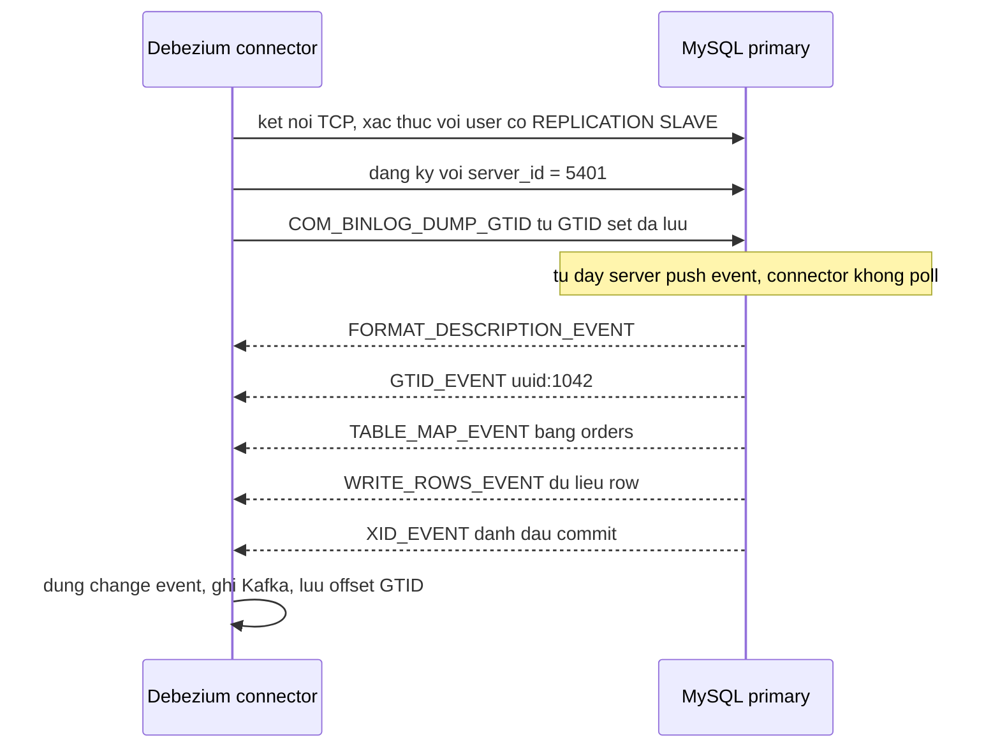
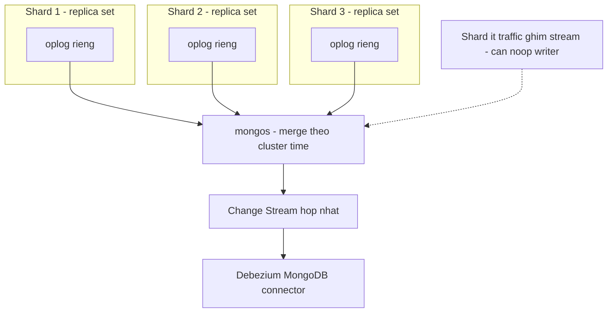
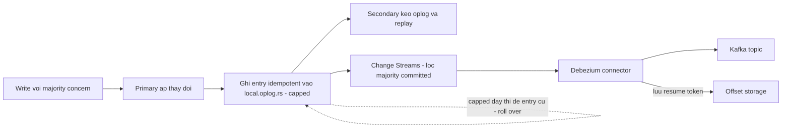

+++
title = "Chương 5: MySQL Binlog và MongoDB Oplog"
date = "2026-02-20T12:00:00+07:00"
draft = false
tags = ["backend", "cdc", "kafka", "database"]
series = ["Change Data Capture"]
+++

> **Đối tượng**: Senior Backend Engineer, Tech Lead, Solution Architect vận hành CDC trên MySQL và MongoDB.
> **Mục tiêu chương**: Chương 4 đã mổ xẻ WAL của PostgreSQL. Chương này áp cùng khung tư duy lên hai họ database còn lại chiếm phần lớn thị phần CDC: MySQL (binlog) và MongoDB (oplog). Điểm mấu chốt không phải là học ba bộ thuật ngữ — mà là nhận ra ba hệ đã chọn **ba mô hình retention và contract khác nhau** cho cùng một bài toán, và mỗi lựa chọn sinh ra một failure mode đặc trưng mà bạn, người thiết kế platform, phải phòng thủ theo cách khác nhau.

---

## 5.1. MySQL: hai cuốn log, hai số phận

### 5.1.1. Binlog vs Redo Log — vì sao MySQL cần cả hai

Đây là điểm gây nhầm lẫn số một với người đến từ PostgreSQL, nơi WAL kiêm cả hai vai. MySQL có kiến trúc hai tầng: **server layer** (SQL parsing, replication, binlog) và **storage engine layer** (InnoDB, với redo log riêng). Hai cuốn log ra đời từ hai nhu cầu độc lập, ở hai tầng khác nhau:

| | **Redo Log (InnoDB)** | **Binary Log (server)** |
|---|---|---|
| Tầng | Storage engine | Server, trên mọi engine |
| Mục đích | Crash recovery — đảm bảo durability của page | Replication + point-in-time recovery |
| Nội dung | Thay đổi **vật lý-logic** ở mức page ("page X, offset Y, ghi bytes Z") | Thay đổi **logic** ở mức row hoặc statement |
| Vòng đời | Vòng tròn, ghi đè liên tục — chỉ cần giữ từ checkpoint gần nhất | File tuần tự, giữ theo thời gian cấu hình |
| Ai đọc | Chỉ InnoDB lúc crash recovery | Replica, mysqlbinlog, **CDC connector** |

Redo log là "WAL đúng nghĩa" của InnoDB: write-ahead, fsync khi commit (`innodb_flush_log_at_trx_commit=1`), circular buffer. Nhưng nó **vô dụng với CDC** vì ba lý do bản chất:

1. **Nội dung gắn chặt định dạng vật lý của InnoDB** — "sửa bytes tại page X" không dịch được thành "UPDATE bảng orders" nếu không tái hiện toàn bộ trạng thái engine. Giống hệt lý do CDC không đọc được physical WAL stream mà cần logical decoding — nhưng MySQL không xây decoder cho redo log, vì đã có binlog.
2. **Nó bị ghi đè** trong vài phút/giờ — không có khái niệm "consumer đọc từ vị trí cũ".
3. **Nó là chuyện riêng của InnoDB** — bảng MyISAM hay engine khác không đi qua nó.

Binlog thì ngược lại: sinh ra cho replication từ MySQL 3.x, ghi thay đổi *logic* ở tầng server, có format công khai, có protocol để client remote đọc — tức là được thiết kế sẵn cho đúng use case của CDC. **CDC trên MySQL đọc binlog vì binlog chính là "logical decoding output" có sẵn**; PostgreSQL phải decode WAL lúc runtime, MySQL trả chi phí đó lúc ghi.

### 5.1.2. Two-phase commit nội bộ giữa InnoDB và binlog

Hai cuốn log, một transaction — vấn đề: nếu crash sau khi ghi cuốn này nhưng trước cuốn kia thì sao? Nếu redo log có transaction mà binlog không có: primary giữ dữ liệu nhưng replica (và CDC) mất nó — replica lệch vĩnh viễn. Ngược lại: replica có dữ liệu mà primary không có.

MySQL giải bằng **internal two-phase commit (2PC)**, với binlog đóng vai coordinator:

1. **Prepare**: InnoDB ghi transaction vào redo log ở trạng thái PREPARED, fsync.
2. **Binlog write**: server ghi transaction vào binlog, fsync (`sync_binlog=1`).
3. **Commit**: InnoDB đánh dấu commit trong redo log.

Khi crash recovery, InnoDB gặp transaction PREPARED sẽ **hỏi binlog**: transaction này có trong binlog không? Có → commit tiếp (replica sẽ nhận được, phải giữ). Không → rollback (chưa ai thấy, hủy an toàn). Binlog là nguồn phán quyết.

Hệ quả cho người vận hành CDC:

- **`sync_binlog=1` + `innodb_flush_log_at_trx_commit=1`** (bộ đôi "dual-1") là điều kiện để binlog thực sự đáng tin như nguồn sự thật. Hạ `sync_binlog=100` mua thêm throughput nhưng crash có thể mất các binlog event cuối — với CDC nghĩa là **mất event mà không hề có lỗi nào báo**. Nếu ai đó đã hạ setting này trước khi bạn dựng CDC, hãy coi đó là finding của buổi review đầu tiên.
- Group commit làm dual-1 rẻ hơn nhiều so với trực giác (nhiều transaction fsync chung một lần) — đừng vội đánh đổi durability vì một benchmark cũ từ thời MySQL 5.5.

### 5.1.3. Binlog format: STATEMENT vs ROW vs MIXED — vì sao CDC bắt buộc ROW

Binlog có ba format (`binlog_format`):

- **STATEMENT**: ghi nguyên câu SQL. Nhỏ gọn, nhưng non-deterministic: `UPDATE t SET ts = NOW()`, `... LIMIT 10` không ORDER BY, UUID(), trigger — cùng câu SQL cho kết quả khác nhau ở nơi khác. Với replication đã nguy hiểm; **với CDC là vô nghĩa hoàn toàn**: CDC cần biết *dữ liệu đã trở thành gì*, không phải *câu lệnh nào đã chạy*. Connector không thể (và không được) re-execute SQL để đoán kết quả.
- **ROW**: ghi ảnh row trước/sau cho từng row bị ảnh hưởng. Đây là dạng duy nhất CDC dùng được — mỗi row change là một sự kiện tự mô tả.
- **MIXED**: statement khi "an toàn", row khi không — với CDC vẫn là fail, vì chỉ cần một event dạng statement lọt qua là connector đứng hình hoặc bỏ sót.

Đi kèm là **`binlog_row_image`**:

```ini
binlog_format        = ROW
binlog_row_image     = FULL     # ghi day du before-image va after-image
binlog_row_metadata  = FULL     # MySQL 8.0.14+: kem ten cot, giup decode chac chan hon
```

`binlog_row_image=FULL` (mặc định) ghi toàn bộ cột của before-image và after-image. `MINIMAL` chỉ ghi PK + cột thay đổi — tiết kiệm binlog đáng kể trên bảng rộng, nhưng event UPDATE của Debezium sẽ có `before`/`after` thiếu cột (null không phân biệt được với "không đổi"). Tương đương bài toán REPLICA IDENTITY của PostgreSQL, nhưng chiều mặc định ngược lại: **MySQL mặc định cho bạn FULL, đừng tự tay hạ xuống MINIMAL trên bảng có CDC** trừ khi mọi consumer đã được thiết kế cho semantics đó và điều này nằm trong data contract.

Một chi tiết hay bị quên: `binlog_format` có thể bị override ở session level. Một job migration set `SESSION binlog_format=STATEMENT` là đủ để đục lỗ stream CDC. MySQL 8.0 đã khóa dần khả năng này, nhưng trên 5.7 hãy giám sát.

### 5.1.4. GTID — định danh transaction toàn cục

**Bài toán**: vị trí trong binlog truyền thống là cặp `(tên file, byte offset)` — ví dụ `(binlog.000042, 193847)`. Cặp này **chỉ có nghĩa trên đúng một server**. Khi failover sang replica mới, cùng transaction nằm ở file/offset hoàn toàn khác. Connector đang giữ offset của server cũ trở nên mù: không có phép ánh xạ đáng tin từ vị trí cũ sang vị trí mới. Kết quả kinh điển: sau failover, CDC hoặc mất event, hoặc phải re-snapshot.

**GTID (Global Transaction Identifier)** gắn cho mỗi transaction một định danh toàn cục bất biến: `source_uuid:sequence`, ví dụ `3E11FA47-71CA-11E1-9E33-C80AA9429562:23`. Định danh này **đi theo transaction qua replication** — trên primary hay replica nào, transaction đó vẫn là `...:23`. Trạng thái "đã xử lý đến đâu" trở thành một *tập hợp* (`gtid_executed`, ví dụ `uuid:1-5000`), không phải một con trỏ file.

```ini
gtid_mode                = ON
enforce_gtid_consistency = ON
```

| | File + Position | GTID |
|---|---|---|
| Phạm vi ý nghĩa | Một server duy nhất | Toàn topology |
| Failover | Mất vị trí, cần dò thủ công hoặc re-snapshot | Connector resume trên primary mới bằng GTID set — server tự biết cần gửi tiếp từ đâu |
| Phát hiện errant transaction | Không | So sánh GTID set giữa các node |

Với người thiết kế platform: **GTID là điều kiện tiên quyết cho CDC nghiêm túc trên MySQL có HA**. Debezium hỗ trợ cả hai chế độ, nhưng chạy file+position trên topology có failover tự động (Orchestrator, InnoDB Cluster, RDS Multi-AZ) là một thiết kế sai đang chờ ngày phát nổ. Đây là quyết định phải chốt *trước* khi go-live, vì bật GTID trên hệ đang chạy tuy làm online được nhưng cần quy trình nhiều bước.

### 5.1.5. Binlog retention và server_id — hợp đồng lỏng lẻo của MySQL

Trái tim của sự khác biệt với PostgreSQL nằm ở đây. MySQL purge binlog theo **thời gian**, bất kể ai đang đọc dở:

```ini
binlog_expire_logs_seconds = 604800   # 7 ngay; mac dinh MySQL 8.0 la 2592000 (30 ngay)
max_binlog_size            = 1G       # kich thuoc moi file binlog
```

Không có khái niệm replication slot. Server **không biết và không quan tâm** connector của bạn đã đọc đến đâu. Nếu connector chết 8 ngày trong khi retention 7 ngày:

1. Connector quay lại, xin đọc từ GTID/position cũ.
2. Binlog chứa vị trí đó đã bị purge.
3. Lỗi điển hình: `Could not find first log file name in binary log index file` hoặc thông báo GTID set yêu cầu chứa transaction đã bị purge.
4. **Khoảng dữ liệu đó mất khỏi stream vĩnh viễn.** Lối thoát duy nhất: re-snapshot (hoặc chấp nhận gap + backfill thủ công).

So sánh triết lý hai bên — cùng một sự cố "connector chết một tuần":
- **PostgreSQL**: dữ liệu an toàn, nhưng WAL tích tụ có thể **sập primary** (fail loud, fail dangerous).
- **MySQL**: primary bình an vô sự, nhưng **dữ liệu stream mất âm thầm** (fail quiet, fail silent).

Failure mode của MySQL nguy hiểm theo kiểu khác: không có gì "cháy" để báo động. Phòng thủ bắt buộc: (1) retention ≥ RTO tệ nhất của pipeline CDC nhân hệ số an toàn — 7 ngày là mức sàn hợp lý cho production, đo đếm chi phí disk so với chi phí re-snapshot; (2) alert trên connector lag *tính theo thời gian* với ngưỡng bằng một phần nhỏ của retention; (3) trên managed service (RDS: `binlog retention hours`, mặc định có thể rất thấp hoặc NULL) — kiểm tra tường minh, đây là bẫy nổi tiếng.

**server_id**: mỗi thành viên trong topology replication — kể cả connector giả làm replica — phải có `server_id` duy nhất. Hai connector (hoặc connector và một replica thật) trùng `server_id` sẽ đá nhau văng liên tục khỏi primary với những lỗi kết nối khó hiểu. Quy ước cấp phát dải `server_id` cho CDC (ví dụ 5400–5499) phải nằm trong tài liệu platform.

### 5.1.6. Debezium đọc binlog như một replica giả

Debezium MySQL connector không cài gì lên server. Nó mở kết nối MySQL bình thường rồi nói chuyện bằng **replication protocol** — dãy lệnh mà một replica thật vẫn dùng: đăng ký `server_id`, gửi `COM_BINLOG_DUMP_GTID` (hoặc `COM_BINLOG_DUMP`) kèm vị trí bắt đầu, và từ đó server chủ động **push** binlog event qua kết nối đó, liên tục, như push cho một replica.



Hệ quả đáng chú ý của mô hình "fake replica":

- Quyền cần cấp: `REPLICATION SLAVE, REPLICATION CLIENT, SELECT` (SELECT cho snapshot). Không cần superuser.
- Connector xuất hiện trong `SHOW REPLICAS` / processlist như một replica — hãy cho đội DBA biết trước, kẻo nó bị "dọn dẹp" trong một buổi audit.
- Vì server push chứ không lưu trạng thái cho consumer, **toàn bộ trách nhiệm nhớ vị trí thuộc về connector** (offset lưu ở Kafka) — ngược với PostgreSQL nơi server cũng nhớ (slot). Hai chỗ nhớ ít hơn một chỗ nhớ: mô hình MySQL đơn giản hơn nhưng chính vì thế mới có bài toán purge ở 5.1.5.
- `TABLE_MAP_EVENT` chỉ mang table id và kiểu cột, không mang đầy đủ schema — đây là lý do connector MySQL phải tự duy trì **schema history** (đọc DDL từ binlog, lưu vào topic riêng) để decode đúng các event lịch sử. Chi tiết ở chương 6.

---

## 5.2. MongoDB: Oplog và Change Streams

### 5.2.1. Oplog — capped collection trong local db

MongoDB không có WAL ở tầng logic document (WiredTiger có journal riêng cho crash recovery ở tầng storage — tương tự redo log của InnoDB, và cũng vô dụng với CDC y hệt lý do đó). Cơ chế replication của MongoDB là **oplog** (operations log): collection `local.oplog.rs`, dạng **capped collection** — kích thước cố định, ghi vòng tròn, document cũ nhất tự động bị đè khi đầy.

Mỗi entry oplog mô tả một thao tác đã áp lên dữ liệu:

```javascript
{
  ts: Timestamp(1720684800, 3),   // BSON timestamp: giay + thu tu trong giay — vai tro nhu LSN
  t: NumberLong(12),               // term cua raft election
  op: "u",                         // i=insert, u=update, d=delete, c=command, n=noop
  ns: "shop.orders",
  o:  { $v: 2, diff: { u: { status: "paid" } } },  // noi dung thay doi
  o2: { _id: ObjectId("...") }     // dinh danh document voi update
}
```

Hai tính chất thiết kế quan trọng:

1. **Idempotent**: mỗi entry được biến đổi sao cho áp lại nhiều lần cho cùng kết quả. `$inc: {counter: 1}` trong lệnh gốc được ghi vào oplog thành `$set: {counter: 42}` — giá trị sau khi tăng. Secondary có thể replay chồng lấn khi recovery mà không hỏng dữ liệu. Với CDC, đây là món quà: event vốn dĩ mô tả *trạng thái kết quả*, thân thiện với at-least-once. Nhưng cũng là giới hạn: oplog v2 delta chỉ chứa *trường thay đổi* — muốn full document phải nhờ Change Streams lookup (bên dưới).
2. **Capped — và sẽ roll over**: oplog có kích thước cố định (mặc định ~5% free disk, min/max tùy version, chỉnh bằng `replSetResizeOplog`; MongoDB 4.4+ thêm sàn thời gian `storage.oplogMinRetentionHours`). "Oplog window" — khoảng thời gian giữa entry cũ nhất và mới nhất — co giãn ngược với write throughput: cùng oplog 50GB, ngày thường window 72 giờ, nhưng trong đợt migration ghi ồ ạt có thể co còn 40 phút (số minh họa). **Consumer tụt lại quá window là mất chỗ resume vĩnh viễn** — cùng họ failure với binlog bị purge, nhưng nguy hiểm hơn vì window co giãn *động* theo tải: chính lúc hệ thống ghi nhiều nhất (lúc CDC dễ lag nhất) là lúc window ngắn nhất. Hai đường cong xấu gặp nhau đúng một điểm.

```javascript
// Giam sat oplog window — dua vao alert bat buoc
db.getReplicationInfo()          // timeDiff = window hien tai tinh bang giay
rs.printReplicationInfo()
```

### 5.2.2. Vì sao CDC cần Replica Set, và Change Streams

**Oplog chỉ tồn tại khi có replication** — standalone `mongod` không có `local.oplog.rs` vì không ai cần nó. Do đó CDC trên MongoDB yêu cầu replica set, kể cả replica set một node (chạy standalone với `--replSet` rồi `rs.initiate()` — chuẩn cho môi trường dev).

Thời kỳ đầu (Debezium 0.x, các tool tự chế), CDC **tail oplog trực tiếp**: mở tailable cursor trên `local.oplog.rs`. Cách này hoạt động nhưng bạn tự gánh mọi thứ: parse format oplog nội bộ (không phải public API — đổi giữa các version, như update v1 sang v2 delta), tự lo resume bằng `ts`, tự xử lý election/rollback, và **bất lực trước sharded cluster** (mỗi shard một oplog riêng, xem 5.2.3).

**Change Streams** (MongoDB 3.6+) là abstraction chính thức trên oplog, và là lời khẳng định của MongoDB rằng "oplog là internal, đây mới là API":

```javascript
const stream = db.collection('orders').watch(
  [{ $match: { operationType: { $in: ['insert', 'update', 'delete'] } } }],
  { fullDocument: 'updateLookup', startAfter: savedResumeToken }
);
```

Ba giá trị cốt lõi:

- **Resume token**: mỗi event mang `_id` là một token mờ (mã hóa cluster time + vị trí). Lưu token, truyền lại qua `startAfter`/`resumeAfter` để nối tiếp đúng chỗ. Đây chính là "offset" của MongoDB CDC — Debezium lưu token này. Nếu token trỏ vào phần oplog đã roll over → lỗi resume, phải re-snapshot: cùng bản chất với binlog purge.
- **Majority read concern**: Change Streams chỉ phát event đã được **majority-committed** — đa số node đã có. Đổi một chút độ trễ lấy một đảm bảo lớn: **event không bao giờ bị rollback** sau election. Tail oplog trực tiếp trên primary có thể đọc phải write chưa majority, primary cũ bị phế truất, write đó bị rollback — và bạn đã phát ra downstream một sự kiện *chưa từng tồn tại* trong lịch sử chính thức của database. Loại bug này gần như không thể debug từ phía consumer.
- **Hoạt động xuyên sharded cluster** qua `mongos`, hợp nhất và sắp thứ tự stream từ mọi shard (5.2.3).

| | Tail oplog trực tiếp | Change Streams |
|---|---|---|
| API contract | Internal, đổi không báo trước | Public, ổn định, versioned |
| Rollback safety | Không — có thể phát event bị rollback | Có — majority read concern |
| Sharded cluster | Tự giải bài toán hợp nhất N oplog | mongos lo trọn |
| Full document sau update | Tự lookup, race condition | `fullDocument: updateLookup` hoặc pre/post images từ 6.0 |
| Filter phía server | Thô sơ | Aggregation pipeline |

Kết luận thiết kế: **năm 2026 không còn lý do chính đáng để tail oplog trực tiếp**. Debezium MongoDB connector hiện đại cũng đã chuyển hẳn sang Change Streams. Lưu ý `fullDocument: 'updateLookup'` là lookup *tại thời điểm đọc* — document có thể đã bị update tiếp, bạn nhận trạng thái mới hơn event (vẫn đúng eventual state, nhưng không phải point-in-time); MongoDB 6.0+ có `changeStreamPreAndPostImages` cho ảnh chính xác tại thời điểm thay đổi, đổi bằng chi phí lưu thêm.

### 5.2.3. Sharded cluster — bài toán ordering giữa các shard

Trong sharded cluster, mỗi shard là một replica set với **oplog độc lập**. Không tồn tại một cuốn log toàn cục duy nhất. Hai write vào hai shard khác nhau chỉ có thứ tự nhờ **cluster time** (hybrid logical clock gắn vào mọi operation).

Change Streams qua `mongos` giải bài toán bằng cách merge stream từ mọi shard theo cluster time, nhưng phải trả giá bằng **chờ đợi**: để phát event tại thời điểm T, mongos phải chắc rằng *mọi* shard đã báo cáo qua T (không shard nào còn có thể sinh event trước T). Một shard ít traffic không có gì để báo sẽ ghim cả stream — MongoDB vá bằng noop writer định kỳ (`periodicNoopIntervalSecs`, mặc định 10 giây) trên mỗi node. Hệ quả thực tế cho người vận hành:

- Độ trễ Change Streams trên sharded cluster cao hơn replica set đơn, và bị chi phối bởi shard *chậm nhất* — một shard bị hot hoặc đang đồng bộ lại sẽ kéo lag của toàn stream, kể cả các shard khỏe.
- Thứ tự nhận được là thứ tự theo cluster time — đủ tốt cho hầu hết mục đích, nhưng nó là thứ tự *được dựng lại*, không phải thứ tự một cuốn log vật lý duy nhất như binlog/WAL. Các thao tác trên **cùng một document** luôn đúng thứ tự (một document nằm trọn một shard); ordering xuyên document xuyên shard là theo cluster time.
- Resharding, chunk migration sinh event nội bộ mà Change Streams phải lọc/biến đổi — thêm một lý do đừng tự tail oplog trên sharded cluster.



### 5.2.4. Luồng CDC MongoDB tổng thể



---

## 5.3. So sánh ba loại log: WAL vs Binlog vs Oplog

Bảng này là khung tư duy để đánh giá *bất kỳ* nguồn CDC nào bạn gặp trong tương lai — câu hỏi luôn là: log ở tầng nào, ai giữ vị trí đọc, retention theo hợp đồng gì, và chết theo kiểu gì.

| Khía cạnh | PostgreSQL WAL | MySQL Binlog | MongoDB Oplog |
|---|---|---|---|
| Bản chất | Physical log kiêm nguồn cho logical decoding — một log cho cả durability lẫn replication | Logical log riêng, tách khỏi redo log của engine; nối bằng 2PC nội bộ | Logical log dạng capped collection, entry idempotent; journal WiredTiger lo durability riêng |
| Đơn vị vị trí | LSN — byte offset toàn cục | File + position, hoặc GTID set | BSON timestamp `ts` / resume token |
| CDC khai thác qua | Replication slot + output plugin (pgoutput) | Fake replica protocol (BINLOG_DUMP) | Change Streams (trên oplog) |
| Server có nhớ vị trí consumer? | **Có** — replication slot | Không | Không |
| Retention model | Giữ đến khi mọi slot confirm (chặn bởi `max_slot_wal_keep_size`) | Purge theo thời gian, bất kể consumer | Ghi vòng theo dung lượng cố định, window co giãn theo tải |
| Cần decode runtime? | Có — walsender decode, tốn CPU primary | Không — đã logic sẵn ở dạng ROW | Không — đã logic sẵn; Change Streams thêm filter/lookup |
| Ảnh before của UPDATE | Theo REPLICA IDENTITY (DEFAULT/FULL) | Theo `binlog_row_image` (FULL mặc định) | Không có mặc định; pre-image cần bật từ 6.0 |
| Failure mode đặc trưng | Slot không advance → WAL tích tụ → **primary sập vì đầy disk** | Binlog purge trước khi đọc kịp → **mất event âm thầm** | Oplog roll over khi lag vượt window → **mất chỗ resume**, window co đúng lúc tải cao |
| Failover với consumer | Slot không tự sang standby (trước PG17); PG17 failover slots | GTID cho resume xuyên failover; file+position thì không | Resume token hợp lệ toàn replica set; majority concern chặn rollback |
| Guardrail bắt buộc | `max_slot_wal_keep_size` + alert slot | Retention ≥ RTO connector + alert lag theo thời gian | `oplogMinRetentionHours` / size đủ + alert oplog window |

Ba mô hình, một bài học: **hoặc server nhớ giùm bạn và bạn phải canh server (PostgreSQL), hoặc bạn tự nhớ và phải chạy đua với retention (MySQL, MongoDB)**. Không có mô hình nào miễn phí; platform của bạn phải có monitoring khớp đúng failure mode của từng nguồn — dashboard chung chung "connector đang RUNNING" không bắt được bất kỳ failure mode nào trong ba cái trên.

---

## Tóm tắt chương

- MySQL có hai log: redo log (InnoDB, vật lý, ghi vòng, cho crash recovery) và binlog (server, logic, cho replication/PITR). CDC đọc binlog vì nó là logical log có format công khai và protocol đọc từ xa; hai log được buộc với nhau bằng 2PC nội bộ mà binlog là coordinator — nên "dual-1" (`sync_binlog=1`, `innodb_flush_log_at_trx_commit=1`) là điều kiện để binlog đáng tin.
- CDC bắt buộc `binlog_format=ROW` (statement là non-deterministic và không mô tả dữ liệu) và nên giữ `binlog_row_image=FULL`. GTID thay file+position để vị trí đọc có nghĩa toàn topology — điều kiện tiên quyết khi có failover tự động.
- MySQL purge binlog theo thời gian bất kể consumer: connector lag vượt retention là mất dữ liệu âm thầm. Debezium đọc binlog như một replica giả với `server_id` riêng; server không lưu gì cho nó.
- MongoDB oplog là capped collection idempotent trong `local`, chỉ tồn tại với replica set; window co giãn ngược với write throughput nên roll over dễ xảy ra nhất đúng lúc hệ thống bận nhất. Change Streams là API chính thức: resume token, majority read concern (miễn nhiễm rollback sau election), hoạt động xuyên shard — không còn lý do tail oplog trực tiếp.
- Sharded cluster không có log toàn cục; mongos dựng lại thứ tự theo cluster time và bị chi phối bởi shard chậm nhất.
- Ba hệ = ba hợp đồng retention = ba failure mode: PostgreSQL sập primary, MySQL mất event âm thầm, MongoDB mất chỗ resume động theo tải. Monitoring phải thiết kế riêng cho từng loại.

## Đọc tiếp

**Chương 6: Cơ chế CDC — Snapshot, Offset, Ordering và Delivery Guarantee** — đến đây bạn đã hiểu cả ba nguồn log. Chương 6 lên một tầng trừu tượng: bất kể nguồn nào, một CDC connector đều phải giải cùng năm bài toán — snapshot nối liền streaming, checkpoint offset, thứ tự sự kiện, delivery guarantee, và schema evolution. Trọng tâm là thuật toán incremental snapshot với watermark (DBLog) — lời giải cho câu hỏi "snapshot bảng 500GB mà không khóa production".
