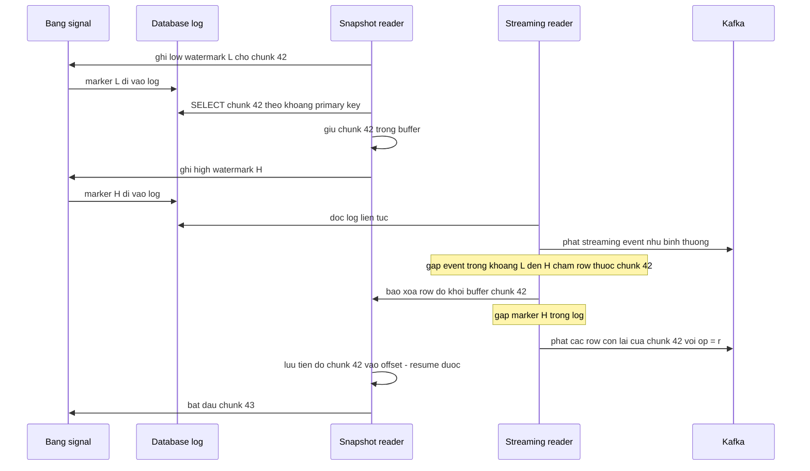
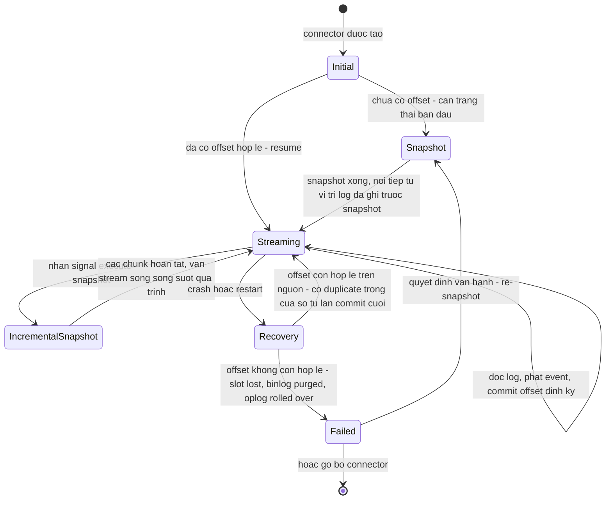

+++
title = "Chương 6: Cơ chế CDC — Snapshot, Offset, Ordering và Delivery Guarantee"
date = "2026-02-20T13:00:00+07:00"
draft = false
tags = ["backend", "cdc", "kafka", "database"]
series = ["Change Data Capture"]
+++

> **Đối tượng**: Senior Backend Engineer, Tech Lead, Solution Architect thiết kế pipeline CDC end-to-end.
> **Mục tiêu chương**: Hai chương trước đi sâu vào từng nguồn log. Chương này trả lời câu hỏi ở tầng trên: bất kể nguồn là WAL, binlog hay oplog, một CDC connector phải giải **năm bài toán bất biến**: (1) dựng trạng thái ban đầu khi log không giữ toàn bộ lịch sử; (2) nhớ vị trí đọc để crash không chết pipeline; (3) đảm bảo gì về delivery; (4) đảm bảo gì về thứ tự; (5) sống sót qua schema change. Ai nắm năm bài toán này sẽ đánh giá được mọi công cụ CDC — Debezium hay bất cứ tên nào xuất hiện sau này — bằng cùng một checklist.

---

## 6.1. Snapshot — vì sao cần, và bài toán consistency

### 6.1.1. Log không giữ toàn bộ lịch sử

CDC đọc log, nhưng log nào cũng có retention hữu hạn (chương 4–5): WAL bị recycle, binlog bị purge, oplog roll over. Bảng `customers` tạo từ 2019 — những INSERT đầu tiên đã biến khỏi log từ lâu. Consumer mới (một search index, một data warehouse) cần **toàn bộ trạng thái hiện tại**, không chỉ thay đổi từ hôm nay.

Vậy nên mọi pipeline CDC bắt đầu bằng **initial snapshot**: đọc trạng thái hiện tại của các bảng, phát ra dưới dạng event (Debezium đánh dấu `op: "r"` — read), rồi mới chuyển sang streaming. Câu hỏi khó không phải là "đọc bảng thế nào" — mà là:

### 6.1.2. Bài toán consistency: snapshot phải nối liền streaming không hở, không thủng

Snapshot bảng lớn mất hàng giờ. Trong lúc đó database vẫn ghi. Nếu snapshot xong mới bắt đầu streaming "từ bây giờ", mọi thay đổi *trong lúc snapshot* bị mất. Nếu streaming từ một điểm tùy tiện trong quá khứ, bạn nhận event trùng với dữ liệu đã snapshot — nhưng trùng theo cách không kiểm soát được thứ tự.

Nguyên tắc đúng: **ghi lại vị trí log TRƯỚC KHI snapshot, snapshot một trạng thái nhất quán tương ứng vị trí đó, rồi streaming từ đúng vị trí đã ghi.** Debezium thực hiện (mô tả theo PostgreSQL; MySQL tương tự với GTID/position):

1. Mở replication slot / kết nối replication → có được LSN hiện tại, gọi là `S`.
2. Mở transaction với isolation `REPEATABLE READ` (MVCC snapshot) — mọi SELECT trong transaction này thấy đúng trạng thái database tại một thời điểm nhất quán gắn với `S`. Với PostgreSQL, `CREATE_REPLICATION_SLOT ... USE_SNAPSHOT` cho phép snapshot đọc *chính xác* trạng thái tại LSN của slot — hai bước 1 và 2 là một nguyên tử. Với MySQL, connector đọc GTID trong lúc giữ nhất quán (lịch sử dùng `FLUSH TABLES WITH READ LOCK` ngắn để "đóng băng" thời điểm đọc position, rồi thả ngay khi transaction REPEATABLE READ đã mở).
3. SELECT toàn bộ các bảng trong transaction đó, phát event `op: "r"`.
4. Đóng transaction, bắt đầu streaming **từ `S`**.

Mọi thay đổi commit sau `S` sẽ xuất hiện trong stream; mọi thứ trước `S` đã nằm trong snapshot. Có thể trùng lặp ở mép (thay đổi ngay quanh `S`), nhưng không bao giờ *thiếu* — và trùng lặp thì xử lý được bằng idempotency (mục 6.4), còn thiếu thì không gì cứu được. Đây là khuôn mẫu lặp lại toàn chương: **khi phải chọn, CDC luôn chọn thừa thay vì thiếu.**

### 6.1.3. Chi phí snapshot bảng lớn — và ảnh hưởng production

Bảng 500GB, ~2 tỷ row. Con số minh họa điển hình:

- Tốc độ đọc + serialize + ghi Kafka thực tế của một connector thread: 5.000–20.000 row/giây tùy độ rộng row → snapshot mất **1–4 ngày**.
- Suốt thời gian đó, transaction REPEATABLE READ mở liên tục: trên PostgreSQL nghĩa là **VACUUM không dọn được dead tuple mới hơn snapshot** (xmin bị ghim) — bloat tích tụ trên database bận rộn suốt nhiều ngày; trên MySQL là undo log phình to, purge lag.
- Snapshot cổ điển là **all-or-nothing**: crash ở giờ thứ 30 → làm lại từ đầu. Không resume được.
- Trong lúc snapshot, streaming *chưa chạy* → thay đổi tích tụ chờ ở log — quay lại đúng các bài retention chương 4–5: slot giữ WAL suốt 4 ngày snapshot, binlog phải sống đủ lâu.
- Nếu quy trình có bước lock (các phiên bản/cấu hình dùng global read lock hoặc table lock): ứng dụng production **đứng** trong thời gian giữ lock. Debezium đã tối ưu để lock chỉ tính bằng giây hoặc không cần, nhưng mỗi lần bạn bật một connector mới với `snapshot.mode=initial` trên database production, hãy trả lời trước: *transaction dài ngày này, ai chịu bloat? Nếu crash giữa chừng, kế hoạch là gì?*

**Ví dụ thiết kế sai kinh điển**: team thêm 40 bảng vào một connector đang chạy và chọn re-snapshot toàn bộ để "cho chắc". Connector dừng streaming, snapshot 3 ngày, slot giữ 2TB WAL, disk primary còn 15% — và giờ họ phải chọn giữa hủy snapshot (mất 3 ngày công) hoặc canh disk từng giờ. Mọi ngả đường đều xấu — vì quyết định sai từ đầu: bài toán này sinh ra incremental snapshot.

---

## 6.2. Incremental Snapshot — thuật toán watermark (DBLog)

Đây là một trong những ý tưởng đẹp nhất của lĩnh vực CDC, đến từ paper **DBLog** (Netflix, 2019), được Debezium hiện thực từ 1.6. Nó giải đồng thời bốn vấn đề của snapshot cổ điển: không lock, chạy **song song** với streaming, **resume** được theo chunk, và trigger được lúc runtime qua signal.

### 6.2.1. Ý tưởng cốt lõi

Chia bảng thành **chunk** theo primary key (ví dụ 1024 row mỗi chunk, đọc theo thứ tự PK: `WHERE pk > :last ORDER BY pk LIMIT 1024`). Với mỗi chunk, vấn đề duy nhất là: **dữ liệu đọc bằng SELECT có thể đã cũ so với streaming events đang chảy song song** — SELECT không có vị trí log gắn kèm, nó chỉ là "trạng thái tại một lúc nào đó gần đây". Làm sao trộn hai dòng dữ liệu mà không để bản cũ đè bản mới?

Lời giải watermark: **kẹp chunk giữa hai cột mốc trong chính stream log**, rồi dùng đoạn stream giữa hai mốc để "khử trùng" chunk.

1. **Ghi low watermark**: connector ghi một marker vào bảng signal (một INSERT/UPDATE nhỏ vào `debezium_signal`) — marker này *xuất hiện trong log* tại vị trí `L`.
2. **SELECT chunk** — đọc các row của chunk từ bảng.
3. **Ghi high watermark** — marker thứ hai, xuất hiện trong log tại vị trí `H`.
4. **Deduplicate**: connector tiếp tục xử lý streaming events. Với mọi event trong khoảng `(L, H)` chạm vào row thuộc chunk đang giữ: **xóa row đó khỏi chunk buffer** — vì streaming event mới hơn hoặc bằng bản SELECT, và streaming event *chắc chắn sẽ được phát*, nên bản SELECT phải nhường.
5. Khi stream chạm `H`: phát nốt các row còn lại trong chunk buffer (những row không bị thay đổi trong cửa sổ) dưới dạng event snapshot, rồi chuyển sang chunk kế tiếp.

Vì sao đúng? Xét một row `r` trong chunk:
- Không ai sửa `r` trong cửa sổ `(L, H)` → bản SELECT là mới nhất tính đến `H` → phát bản SELECT, an toàn.
- Có người sửa `r` trong cửa sổ → streaming event mang trạng thái mới hơn hoặc chính là trạng thái SELECT đã thấy → bỏ bản SELECT, để streaming event đại diện. Consumer có thể nhận trạng thái "nhảy cóc" qua vài phiên bản trung gian, nhưng **không bao giờ nhận trạng thái cũ sau trạng thái mới** — với hệ đích hội tụ theo state (upsert), thế là đủ.

Cái giá phải trả (không có gì miễn phí): connector cần **quyền ghi** vào bảng signal trên database nguồn (hoặc kênh signal thay thế — Kafka signal topic cho môi trường read-only); mỗi row snapshot theo kiểu này là `op: "r"` xen kẽ giữa dòng event streaming nên downstream không được giả định "snapshot xong hết mới tới stream"; và consistency là *per-chunk hội tụ*, không phải một lát cắt point-in-time toàn bảng — hệ đích cần semantics upsert, không phải append.



### 6.2.2. Vận hành incremental snapshot

```sql
-- Kich hoat snapshot cho mot bang, luc runtime, khong restart connector
INSERT INTO debezium_signal (id, type, data) VALUES (
  'signal-001',
  'execute-snapshot',
  '{"data-collections": ["public.orders"], "type": "incremental"}'
);
```

Đặc tính vận hành đáng giá: tiến độ (bảng nào, chunk nào) nằm trong offset → connector restart là **tiếp tục từ chunk dở**, không làm lại; snapshot lại một bảng duy nhất sau sự cố dữ liệu mà không đụng 39 bảng còn lại; điều tiết được tốc độ bằng chunk size. Với platform ở scale lớn, đây là khác biệt giữa "thêm một bảng vào CDC là chuyện thường ngày" và "thêm một bảng là một dự án".

Giới hạn cần biết trước khi hứa với stakeholder: bảng cần primary key (hoặc key thay thế đơn điệu để chunk); PK phân bố quá lệch làm chunk mất cân đối; và thứ tự event trên *một key* vẫn đúng, nhưng bức tranh "toàn bảng tại một thời điểm" thì không tồn tại — đừng dùng nó để làm nguồn cho phép đối soát point-in-time.

---

## 6.3. Offset và Checkpoint

### 6.3.1. Offset là gì với từng nguồn

**Offset** là con trỏ "tôi đã xử lý xong đến đây" — chính là thứ làm CDC connector trở thành một hệ resume được:

| Nguồn | Offset | Ghi chú |
|---|---|---|
| PostgreSQL | LSN (`confirmed_flush_lsn` gửi về slot + LSN trong offset store) | Server *cũng* nhớ qua slot — hai nơi nhớ |
| MySQL | Binlog file + position, hoặc GTID set | Chỉ connector nhớ; server không quan tâm |
| MongoDB | Resume token của Change Streams | Token mờ, chỉ hợp lệ khi oplog còn giữ vị trí đó |
| Kèm theo | Tiến độ snapshot: bảng/chunk hiện tại, PK cuối của chunk | Cho phép resume snapshot |

Với Debezium trên Kafka Connect, offset lưu trong **offset topic** của Kafka Connect (`connect-offsets` — compacted topic, key = connector + partition nguồn, value = offset). Debezium Server / Debezium Engine lưu qua các backend khác (file, Redis, JDBC...). Điểm kiến trúc quan trọng: **offset nằm ngoài database nguồn** — connector và nguồn không chia sẻ một transaction. Chính khoảng hở này sinh ra mục 6.3.2.

### 6.3.2. Crash giữa hai lần commit offset → duplicate → at-least-once

Vòng lặp của connector: đọc event từ log → ghi event vào Kafka → *định kỳ* (mặc định `offset.flush.interval.ms = 60000`) commit offset. Ghi event và commit offset là **hai thao tác tách rời, không atomic**.

Kịch bản crash:

```
t0: offset da commit = vi tri 100
t1: connector doc va ghi thanh cong event 101..175 vao Kafka
t2: CRASH — truoc chu ky flush offset ke tiep
t3: connector restart, doc offset = 100
t4: doc lai tu 101 → event 101..175 duoc ghi vao Kafka LAN THU HAI
```

Consumer thấy 75 event lặp lại. Đây không phải bug — đây là **hệ quả tất yếu của lựa chọn thiết kế đúng**. Có hai cách sắp thứ tự, chọn một:

- **Commit offset trước, ghi event sau** → crash giữa chừng làm *mất* event: at-most-once. Với CDC — nguồn sự thật cho downstream — mất event là tội không thể tha (dữ liệu lệch âm thầm, không cách nào phát hiện từ phía consumer).
- **Ghi event trước, commit offset sau** → crash giữa chừng làm *lặp* event: **at-least-once**. Lặp thì consumer khử được (6.4).

Mọi CDC connector nghiêm túc chọn vế sau. Hãy nội hóa câu này: **duplicate event trong CDC là hành vi bình thường theo hợp đồng, không phải sự cố** — mọi consumer chưa được thiết kế cho điều đó là consumer chưa xong. Thu hẹp `offset.flush.interval.ms` giảm *kích thước* cửa sổ duplicate khi crash, đổi bằng nhiều write hơn vào offset topic — nhưng không bao giờ đưa nó về không.

---

## 6.4. Delivery Guarantee — và lời giải idempotent consumer

### 6.4.1. Ba mức đảm bảo

- **At-most-once**: không bao giờ lặp, có thể mất. Chấp nhận được cho metrics sampling; không bao giờ cho CDC.
- **At-least-once**: không bao giờ mất, có thể lặp. **Mặc định của CDC.**
- **Exactly-once**: không mất, không lặp. Nghe như đích đến — thực tế là ảo ảnh khi đi qua nhiều hệ thống.

### 6.4.2. Vì sao exactly-once end-to-end gần như bất khả thi

Pipeline thực tế: `Database → Connector → Kafka → Consumer → hệ đích`. Exactly-once đòi hỏi **mọi cặp hop** đều atomic. Kafka có transactional producer + read_committed consumer — exactly-once *bên trong địa hạt Kafka* (và Kafka Connect có hỗ trợ exactly-once cho source connector ở mức ghi vào Kafka). Nhưng hai mép của pipeline nằm ngoài địa hạt đó:

- **Mép nguồn**: connector đọc từ database và ghi vào Kafka — vị trí đọc trên database (slot/binlog) và transaction Kafka là hai thế giới; đồng bộ chúng tuyệt đối là bài toán 2PC xuyên hệ thống mà bạn không muốn vận hành.
- **Mép đích**: consumer ghi vào Elasticsearch/data warehouse/cache — các hệ này không tham gia transaction Kafka. Consumer ghi đích thành công rồi crash trước khi commit consumer offset → replay → ghi đích lần hai. Trừ khi hệ đích cho phép ghi *kết quả + offset trong cùng một transaction* (làm được với một database ACID làm đích — pattern lưu offset trong chính DB đích), duplicate ở mép đích là không tránh khỏi.

Định lý dân gian của ngành: *bạn không thể có exactly-once delivery; bạn chỉ có thể có at-least-once delivery cộng với xử lý idempotent — và tổ hợp đó **tương đương về kết quả** với exactly-once.* Đó chính là chỗ nên tiêu tiền kỹ sư.

### 6.4.3. Idempotent consumer — giải pháp thực tế

Hai kỹ thuật phủ 95% nhu cầu:

**1. Upsert theo primary key** — event CDC mang trạng thái *sau* của row (state-oriented, không phải delta), nên áp lại lần hai vô hại:

```sql
INSERT INTO dim_customers (id, email, tier, updated_at)
VALUES (:id, :email, :tier, :ts)
ON CONFLICT (id) DO UPDATE
SET email = EXCLUDED.email, tier = EXCLUDED.tier, updated_at = EXCLUDED.updated_at;
```

**2. Version check** — chống cả duplicate lẫn **out-of-order do replay**: duplicate sau crash có thể mang event *cũ hơn* trạng thái đích hiện tại; chỉ áp khi event mới hơn:

```sql
UPDATE dim_customers SET ..., source_lsn = :event_lsn
WHERE id = :id AND source_lsn < :event_lsn;   -- LSN / GTID sequence / ts_ms lam version
```

Lưu ý chọn version: `ts_ms` có độ phân giải mili giây và phụ thuộc đồng hồ — hai update cùng ms sẽ hòa nhau; vị trí log (LSN, GTID, pos) là thứ tự *thật* của database, luôn ưu tiên khi có. Với hệ đích không so sánh điều kiện được, cân nhắc bảng dedup theo `(topic, partition, offset)` đã xử lý — đổi bằng chi phí lưu và dọn state.

Hệ quả kiến trúc quan trọng: **event CDC nên được tiêu thụ như state, không phải như command**. Consumer kiểu "nhận event thì gửi email" sẽ gửi email hai lần khi replay — side effect không idempotent phải được chặn bằng dedup key riêng ở tầng nghiệp vụ. Đây là ranh giới giữa dùng CDC làm data replication (rất hợp) và làm business event bus (phải cực kỳ cẩn trọng — event CDC mô tả *thay đổi dữ liệu*, không mô tả *ý định nghiệp vụ*).

---

## 6.5. Ordering — có gì, và không có gì

### 6.5.1. Đảm bảo có thật: thứ tự theo key

Debezium chọn **Kafka message key = primary key của row** → mọi event của cùng một row đi vào **cùng một partition** → Kafka đảm bảo thứ tự trong partition → consumer thấy các phiên bản của một row đúng trình tự: INSERT → UPDATE → ... → DELETE. Đây là đảm bảo nền tảng và là lý do upsert hội tụ đúng.

Đánh đổi kèm theo: tăng số partition một topic đang chạy làm **đổi ánh xạ key → partition** — trong lúc chuyển giao, event cũ và mới của cùng key nằm ở hai partition, thứ tự tương đối không còn. Quy hoạch partition count *trước* khi go-live; nếu buộc phải tăng, làm lúc có thể drain và chấp nhận một cửa sổ out-of-order (version check ở 6.4.3 chính là lưới đỡ).

### 6.5.2. Không có total ordering giữa các bảng và partition

Mỗi bảng một topic, mỗi topic nhiều partition, consumer group xử lý song song. Hệ quả: **không tồn tại thứ tự toàn cục giữa event của các bảng khác nhau** (thậm chí giữa hai key khác nhau cùng bảng, khác partition).

Kịch bản kinh điển — transaction nguồn ghi cha rồi con:

```
BEGIN; INSERT INTO orders(id) VALUES (1);
       INSERT INTO order_items(order_id) VALUES (1); COMMIT;
```

Trong log, hai event đúng thứ tự. Nhưng chúng đi vào topic `orders` và `order_items` riêng, consumer khác nhau, tốc độ khác nhau — hoàn toàn có thể **`order_items` đến đích trước `orders`**. Consumer nào enforce foreign key ở đích sẽ nổ; consumer nào join hai stream theo kiểu "chắc cha đến trước" sẽ lặng lẽ sai. Ba lối xử lý trưởng thành:

1. **Bỏ ràng buộc FK ở đích** (staging schema không FK; hoặc defer constraint) và chấp nhận eventual consistency — phổ biến nhất cho analytics.
2. **Consumer chịu lỗi tạm thời**: gặp con-không-cha thì retry sau / để vào bảng chờ, hội tụ khi cha đến.
3. **Tái dựng ranh giới transaction** bằng transaction metadata của Debezium: bật `provide.transaction.metadata=true`, mỗi event mang block `transaction {id, total_order, data_collection_order}`, kèm **transaction topic** phát BEGIN/END với số event mỗi collection — consumer buffer đến khi đủ mặt mới áp nguyên transaction. Mạnh nhưng đắt: buffer, timeout cho transaction dở, độ phức tạp tăng hẳn một bậc. Chỉ trả giá này khi nghiệp vụ thật sự cần atomicity xuyên bảng ở đích.

Bài học thiết kế: **ordering là thứ bạn mua theo phạm vi** — trong một key: miễn phí; trong một transaction xuyên bảng: đắt; toàn hệ thống: không bán.

---

## 6.6. Schema Change — DDL giữa dòng stream

Log chứa event của *quá khứ*, được encode theo schema *tại thời điểm ghi*. Khi connector đọc lại đoạn log cũ (sau downtime), bảng có thể đã qua ba lần `ALTER TABLE`. Đọc row-event cũ bằng schema mới là ăn corrupted data.

- **MySQL**: binlog row event gần như không tự mô tả schema đầy đủ → Debezium duy trì **schema history topic**: mọi DDL đọc được từ binlog được ghi lại kèm vị trí. Khi restart, connector *replay lịch sử DDL* để dựng đúng schema tại offset đang đứng rồi mới decode tiếp. Hệ quả vận hành: schema history topic là **thành phần sống còn, retention phải vô hạn** (nó không phải log thường, nó là state); mất nó = connector không dựng lại được schema = re-snapshot. Đây là một trong những "gotcha" vận hành Debezium MySQL phổ biến nhất — ai đó áp retention policy chung 7 ngày lên mọi topic và ba tháng sau connector không restart được.
- **PostgreSQL**: pgoutput phát relation message mô tả schema kèm stream — nhẹ gánh hơn, không cần history topic (vẫn còn góc cạnh với các kiểu phức tạp và giá trị default).
- **Phía consumer**: schema event *sẽ* thay đổi theo thời gian — thêm cột là chuyện hàng tuần ở tổ chức lớn. Chuẩn hóa bằng Schema Registry (Avro/Protobuf) + quy tắc tương thích (`BACKWARD`: thêm field có default, không xóa field đang dùng) biến schema evolution từ sự cố thành non-event. Consumer parse JSON bằng tay với field hardcode là consumer sẽ hỏng vào một sáng thứ hai nào đó.

Quy tắc platform nên ép: DDL trên bảng có CDC phải đi qua review có nhãn "ảnh hưởng CDC" — đặc biệt các DDL phá hoại (đổi tên cột, đổi kiểu hẹp hơn, drop cột) vốn không có cách biểu diễn tương thích.

---

## 6.7. Cấu trúc Debezium change event, Delete và Tombstone

### 6.7.1. Envelope

Mỗi change event của Debezium là một envelope thống nhất — key riêng, value gồm:

- `before`: trạng thái row trước thay đổi (null với INSERT; độ đầy đủ phụ thuộc REPLICA IDENTITY / binlog_row_image — chương 4–5).
- `after`: trạng thái sau (null với DELETE).
- `source`: metadata nguồn — connector, database, bảng, vị trí log (LSN/GTID/ts), transaction id, cờ `snapshot`.
- `op`: `c` (create), `u` (update), `d` (delete), `r` (read — từ snapshot), `t` (truncate).
- `ts_ms`: thời điểm connector xử lý (so với `source.ts_ms` — thời điểm commit ở nguồn: hiệu của chúng chính là **CDC lag đo được per-event**, metric đáng đưa lên dashboard).

```json
// UPDATE: orders.status 'pending' -> 'paid'  (key cua Kafka message: {"id": 1001})
{
  "before": { "id": 1001, "status": "pending", "amount": "250000", "customer_id": 42 },
  "after":  { "id": 1001, "status": "paid",    "amount": "250000", "customer_id": 42 },
  "source": {
    "connector": "postgresql", "db": "shop", "schema": "public", "table": "orders",
    "lsn": 398417249432, "txId": 771023, "ts_ms": 1720684800123, "snapshot": "false"
  },
  "op": "u",
  "ts_ms": 1720684800190
}
```

INSERT: `op: "c"`, `before: null`, `after` đầy đủ. Snapshot: giống INSERT nhưng `op: "r"`, `source.snapshot: "true"`. DELETE:

```json
{ "before": { "id": 1001, "status": "paid", "amount": "250000", "customer_id": 42 },
  "after": null, "op": "d", "source": { "lsn": 398417301776, "...": "..." }, "ts_ms": 1720684952011 }
```

### 6.7.2. Tombstone — vì sao delete cần hai message

Ngay sau delete event, Debezium phát thêm một message thứ hai: **cùng key, value = null** — gọi là **tombstone**. Vì sao cần cả hai?

- **Delete event** (`op: "d"`, có `before`) là dành cho **consumer**: đủ thông tin để xóa row ở đích, audit, xử lý nghiệp vụ. Nhưng với **Kafka log compaction**, nó là một message có value ≠ null — compaction sẽ *giữ nó lại vĩnh viễn* như "giá trị mới nhất của key".
- **Tombstone** (value = null) là dành cho **Kafka**: log compaction quy ước value null = "hãy xóa mọi message của key này" (sau `delete.retention.ms`). Không có tombstone, compacted topic giữ delete event của mọi row đã xóa mãi mãi → topic phình vô hạn theo số key từng tồn tại, và consumer mới bootstrap từ compacted topic sẽ thấy "row đã xóa" thay vì "không có row".

Hai đối tượng đọc, hai hợp đồng, hai message. Tắt tombstone (`tombstones.on.delete=false`) chỉ khi topic không bao giờ compaction *và* sink không cần nó — và ghi quyết định đó lại, vì người bật compaction sau bạn sẽ không biết.

Cửa sổ hở cần biết: consumer đọc compacted topic sau khi compaction đã nuốt các phiên bản trung gian sẽ chỉ thấy trạng thái cuối mỗi key — đúng cho việc dựng state, nhưng đừng kỳ vọng xem lại toàn bộ lịch sử từ compacted topic; lịch sử đầy đủ thuộc về topic retention dài hoặc data lake phía sau.

### 6.7.3. Vòng đời connector



Trạng thái đáng sợ nhất là `Failed` do offset không còn hợp lệ — vì lối ra duy nhất là re-snapshot, với toàn bộ chi phí mục 6.1.3. Mọi guardrail của chương 4 và 5 (max_slot_wal_keep_size, binlog retention, oplog window) tồn tại để pipeline của bạn không bao giờ rơi vào trạng thái đó.

---

## Tóm tắt chương

- Initial snapshot tồn tại vì log không giữ toàn bộ lịch sử; tính đúng đắn đến từ nguyên tắc *ghi vị trí log trước, snapshot trạng thái nhất quán gắn với vị trí đó, stream từ đúng vị trí đó*. Thà thừa (dedup được) còn hơn thiếu (không cứu được).
- Snapshot cổ điển trên bảng lớn: transaction dài ngày ghim vacuum/undo, all-or-nothing, chặn streaming. Incremental snapshot (DBLog) giải bằng watermark: chunk theo PK, kẹp giữa low/high watermark trong log, khử row bị đụng trong cửa sổ — không lock, song song với streaming, resume theo chunk; đổi lại cần quyền ghi signal và semantics upsert ở đích.
- Offset (LSN / GTID / resume token + tiến độ chunk) lưu ngoài nguồn, commit định kỳ và không atomic với việc ghi event → crash tạo duplicate → CDC là at-least-once **by design**. Duplicate là hợp đồng, không phải sự cố.
- Exactly-once end-to-end qua nhiều hệ thống là ảo ảnh ở hai mép pipeline; lời giải thực tế: at-least-once + idempotent consumer (upsert theo PK, version check theo vị trí log) — tương đương kết quả với exactly-once. Tiêu thụ event CDC như state, không như command.
- Ordering chỉ tồn tại theo key trong một partition; không có total ordering xuyên bảng — thiết kế đích không FK cứng, hoặc retry hội tụ, hoặc trả giá dùng transaction metadata topic. Partition count chốt trước go-live.
- DDL giữa stream đòi schema history (MySQL — topic retention vô hạn, mất là re-snapshot) và consumer phải theo schema evolution qua registry + compatibility rules.
- Envelope Debezium (before/after/source/op/ts_ms) là hợp đồng dữ liệu; delete sinh hai message: delete event cho consumer, tombstone cho log compaction — thiếu một trong hai là hỏng một trong hai hợp đồng.

## Đọc tiếp

Chương 7 — [Debezium Internal Architecture](/series/cdc/07-debezium-internals/): từ cơ chế trừu tượng sang hiện thực cụ thể — kiến trúc bên trong Debezium, connector lifecycle, snapshot mode, offset storage, heartbeat, signal table và schema history. Toàn bộ năm bài toán của chương này sẽ được soi lại qua cách Debezium hiện thực hóa chúng.
