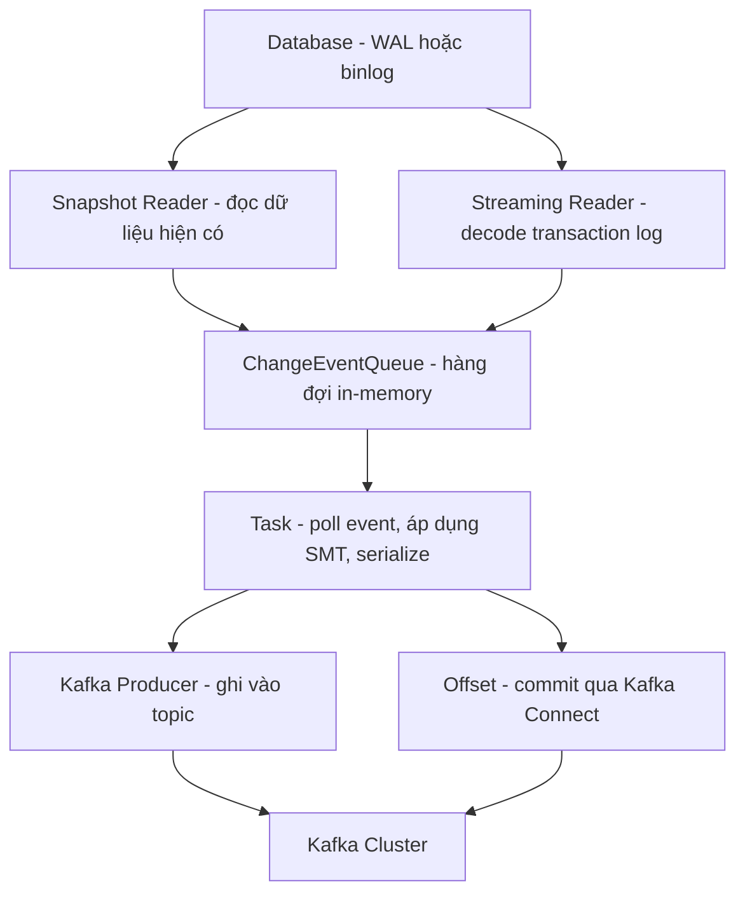
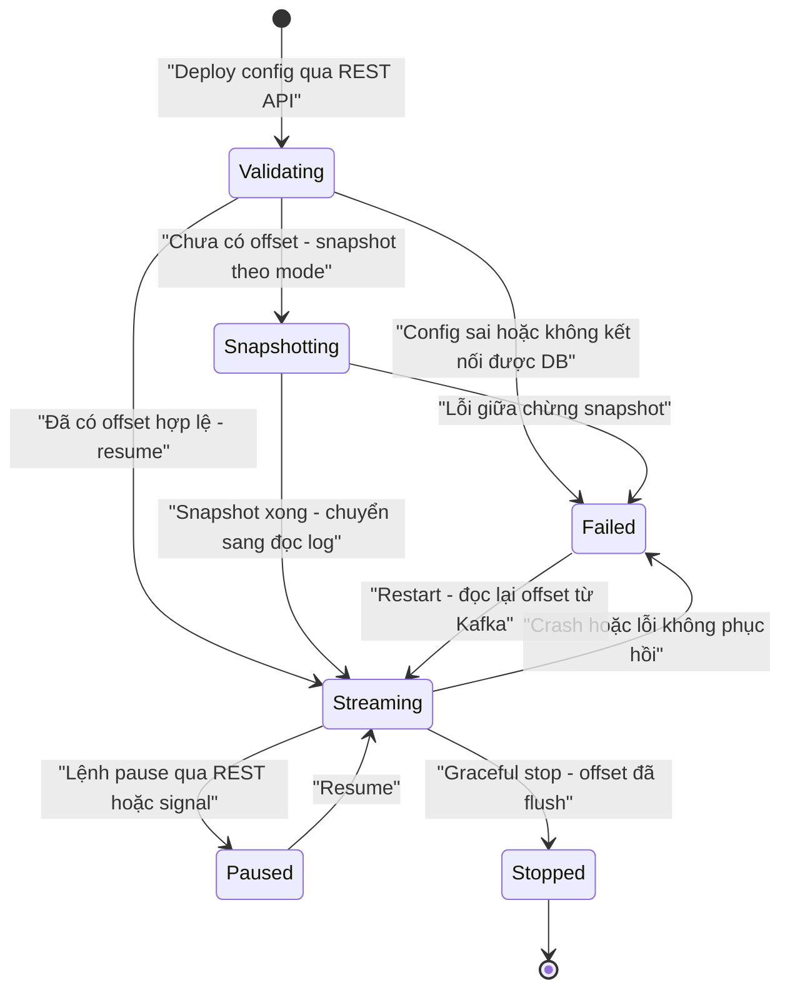

+++
title = "Chương 7: Debezium Internal Architecture"
date = "2026-02-20T14:00:00+07:00"
draft = false
tags = ["backend", "cdc", "kafka", "database"]
series = ["Change Data Capture"]
+++

Ở các chương trước, chúng ta đã phân tích cơ chế log-based CDC ở tầng database: WAL của PostgreSQL, binlog của MySQL, replication slot, logical decoding. Chương này đi vào bên trong Debezium — thành phần đứng giữa database và Kafka — để trả lời câu hỏi mà mọi kiến trúc sư phải trả lời được trước khi đưa Debezium vào production: **nó thực sự làm gì bên trong, trạng thái của nó nằm ở đâu, và điều gì xảy ra khi nó chết?**

Kinh nghiệm của tôi sau nhiều năm vận hành: hầu hết sự cố CDC nghiêm trọng không đến từ bug của Debezium, mà đến từ việc đội vận hành không hiểu **mô hình trạng thái** của nó — offset nằm ở đâu, schema history là gì, vì sao replication slot không advance. Chương này tồn tại để lấp các lỗ hổng đó.

## 7.1. Debezium là gì — và vì sao nó không phải một standalone service

Debezium **không phải** một service độc lập theo nghĩa thông thường. Nó là một **bộ source connector** — các plugin Java — được thiết kế để chạy trên **Kafka Connect**. Ngoài ra có hai hình thức đóng gói khác: **Debezium Server** (chạy standalone, đẩy event sang Kinesis, Pub/Sub, Redis Streams...) và **Debezium Engine** (nhúng như một library vào ứng dụng Java của bạn).

Vì sao đội Debezium chọn thiết kế "plugin trên Kafka Connect" thay vì tự xây một service riêng? Đây là quyết định kiến trúc rất đáng học:

1. **Bài toán khó nhất của CDC không phải là đọc log, mà là quản lý trạng thái và fault tolerance.** Một CDC service phải nhớ chính xác nó đã đọc đến đâu (offset), phải sống sót qua crash, phải deploy/scale được. Kafka Connect đã giải quyết tất cả những thứ này: offset storage, distributed worker, rebalancing, REST API quản lý lifecycle. Debezium chỉ cần tập trung vào phần nó giỏi nhất — decode transaction log của từng loại database.
2. **Đích đến tự nhiên của CDC event là Kafka.** Change event cần được lưu bền vững, replay được, nhiều consumer đọc độc lập — đó chính xác là mô hình của Kafka. Tự viết một producer "đúng" (idempotent, ordered, handle retry) không tầm thường; Kafka Connect làm sẵn.
3. **Tách biệt vòng đời vận hành.** Database team quản lý database, platform team quản lý Connect cluster, connector chỉ là config. Deploy một connector mới là một lệnh REST API, không phải một đợt release service.

**Đánh đổi:** bạn phải vận hành thêm một hệ thống phân tán (Kafka Connect) với những đặc tính riêng của nó — rebalance, internal topic, JVM tuning (chi tiết ở Chương 8). Với hệ thống nhỏ chỉ cần đẩy CDC vào một chỗ không phải Kafka, Debezium Server hoặc Engine hợp lý hơn; nhưng khi đó **bạn tự chịu trách nhiệm về offset storage và high availability** — Engine không có failover, crash là dừng, và nếu bạn lưu offset ra file local rồi mất file đó, bạn quay lại từ đầu. Với platform ở scale doanh nghiệp, mặc định đúng là Kafka Connect distributed mode.

## 7.2. Kiến trúc bên trong: từ transaction log đến Kafka

Một connector Debezium khi chạy được phân rã thành các tầng sau:



- **Connector** là thực thể logic: một cấu hình JSON đăng ký với Kafka Connect, đại diện cho "capture database X".
- **Task** là đơn vị thực thi. Với hầu hết source CDC, **một connector = một task duy nhất** — vì transaction log là một stream tuần tự, không chia song song được (Chương 8 phân tích sâu hơn).
- **Snapshot Reader** chịu trách nhiệm đọc trạng thái hiện tại của các bảng (SELECT) khi connector khởi động lần đầu.
- **Streaming Reader** kết nối vào cơ chế replication của database (logical replication với PostgreSQL, binlog client với MySQL, CDC tables với SQL Server) và chuyển mỗi thay đổi thành change event.
- **ChangeEventQueue** là hàng đợi in-memory nối reader (producer thread) với task (consumer thread). Hai config quan trọng: `max.queue.size` (mặc định 8192 event) và `max.batch.size` (mặc định 2048). Khi Kafka producer chậm, queue đầy, reader **bị block** — đây là cơ chế backpressure nội bộ. Hệ quả production: khi Kafka chậm, Debezium đọc WAL chậm lại, replication slot giữ WAL lâu hơn, disk database phình. Backpressure không biến mất, nó chỉ dịch chuyển về phía database.
- **Kafka producer** do Kafka Connect quản lý, ghi event vào topic theo quy ước `<topic.prefix>.<schema>.<table>`.

Điểm cần khắc sâu: **Debezium gần như stateless về mặt process**. Toàn bộ trạng thái cần để phục hồi — offset và schema history — nằm trong Kafka. Process chết không sao; **mất các topic trạng thái mới là thảm họa** (mục 7.5 và 7.8).

## 7.3. Connector Lifecycle



Các điểm hành vi quan trọng:

- **Validate:** Kafka Connect gọi `validate()` trước khi start — kiểm tra config, thử kết nối database, kiểm tra quyền (REPLICATION, quyền SELECT trên bảng). Lỗi ở đây rẻ; lỗi phát hiện sau khi snapshot chạy 6 tiếng thì đắt. Luôn dùng endpoint `PUT /connector-plugins/{type}/config/validate` trong CI trước khi deploy.
- **Ranh giới snapshot → streaming:** Debezium ghi lại vị trí log **tại thời điểm bắt đầu snapshot** (LSN/GTID), snapshot xong thì streaming từ vị trí đó. Nhờ vậy không mất thay đổi xảy ra trong lúc snapshot — nhưng có thể **trùng lặp** (một row vừa nằm trong snapshot, vừa xuất hiện lại như event update). Đây là lý do consumer CDC bắt buộc phải idempotent — nguyên tắc đã nêu từ Chương 2 và sẽ lặp lại ở Chương 9.
- **Crash recovery:** khi task restart, nó đọc offset cuối cùng đã commit từ topic `connect-offsets` và tiếp tục từ đó. Vì offset được flush **định kỳ** (`offset.flush.interval.ms`, mặc định 60 giây), một khoảng event có thể được phát lại → ngữ nghĩa mặc định là **at-least-once**.
- **Graceful stop vs crash:** graceful stop flush offset trước khi thoát, khoảng phát lại gần như bằng không. Crash (OOM, kill -9) để lại tối đa một chu kỳ flush chưa commit. Bài học vận hành: đừng bao giờ "restart cho nhanh" bằng kill -9 khi có thể dùng REST API.

## 7.4. Snapshot Mode — quyết định có hậu quả lớn nhất khi deploy

Khi connector khởi động lần đầu (chưa có offset), nó phải quyết định làm gì với dữ liệu **đã tồn tại** trong bảng. `snapshot.mode` điều khiển việc này:

| Mode | Hành vi | Khi nào dùng |
|---|---|---|
| `initial` (mặc định) | Snapshot schema + toàn bộ dữ liệu, sau đó streaming | Trường hợp chuẩn: downstream cần trạng thái đầy đủ |
| `initial_only` | Chỉ snapshot rồi dừng, không streaming | Migration một lần, seed dữ liệu |
| `no_data` (tên cũ: `schema_only`) | Chỉ snapshot schema, streaming từ vị trí log hiện tại | Downstream chỉ quan tâm thay đổi từ giờ trở đi, hoặc dữ liệu lịch sử được nạp bằng đường khác |
| `never` | Không snapshot gì, streaming từ **đầu log còn giữ được** | Gần như chỉ hợp lệ với MySQL khi bạn chắc chắn binlog còn nguyên từ thời điểm cần |
| `when_needed` | Snapshot nếu không có offset hoặc offset không còn hợp lệ (log đã purge) | Nghe tiện nhưng nguy hiểm — xem dưới |
| `recovery` | Chỉ dựng lại schema history topic bị mất/hỏng, không đọc lại dữ liệu | Sự cố schema history (mục 7.8) |

**Hậu quả chọn sai — các ca tôi đã gặp thật:**

- **`never` khi log đã bị purge:** team chọn `never` cho MySQL vì "không muốn snapshot bảng 500GB", nhưng binlog retention chỉ 3 ngày và connector được deploy sau khi hệ thống đã chạy nhiều tháng. Kết quả: toàn bộ dữ liệu lịch sử **không bao giờ** xuất hiện downstream, và tệ hơn — không ai phát hiện trong nhiều tuần vì event mới vẫn chảy bình thường. Dashboard analytics thiếu hụt âm thầm. Đây là loại lỗi không có error log.
- **`when_needed` gây re-snapshot bất ngờ:** connector down 5 ngày (quên alert), binlog purge, connector tự động snapshot lại bảng 2TB vào 9 giờ sáng thứ Hai — đúng giờ cao điểm, đè I/O lên database production. `when_needed` biến một sự cố dữ liệu (cần con người quyết định) thành một hành động tự động tốn kém. Quan điểm của tôi: ở production, **để `initial` và xử lý re-snapshot một cách chủ động bằng incremental snapshot** (mục 7.7), đừng để connector tự quyết.
- **`initial` với bảng khổng lồ mà không tính giờ:** snapshot là SELECT toàn bảng — với PostgreSQL chạy trong một transaction dài với snapshot isolation, giữ xmin horizon, cản vacuum. Snapshot 12 tiếng trên bảng nóng có thể gây bloat nghiêm trọng. Giải pháp hiện đại: `no_data` + **incremental snapshot** qua signal — snapshot theo chunk, xen kẽ với streaming, dừng/tiếp tục được.

## 7.5. Offset Storage — trái tim của khả năng phục hồi

Offset của Debezium là câu trả lời cho câu hỏi "tôi đã đọc đến đâu trong transaction log". Với Kafka Connect distributed mode, offset của **mọi** source connector được lưu trong topic nội bộ **`connect-offsets`** (compacted topic).

Mỗi bản ghi offset là cặp key/value JSON. Ví dụ với PostgreSQL connector:

```json
// key
["orders-connector", {"server": "prod-pg"}]
// value
{
  "lsn": 827094887136,
  "lsn_commit": 827094886992,
  "txId": 5843215,
  "ts_usec": 1752192000123456
}
```

Với MySQL, value chứa `file`, `pos` (vị trí binlog) và `gtids`. Ý nghĩa: khi restart, connector nói với database "cho tôi stream từ LSN/GTID này".

**Vì sao mất `connect-offsets` là thảm họa:** mất topic này, mọi connector trên cluster restart như thể lần đầu — connector `initial` sẽ **snapshot lại toàn bộ**, connector `no_data` sẽ **bỏ qua toàn bộ khoảng thời gian đã stream** và bắt đầu từ vị trí hiện tại (mất dữ liệu âm thầm). Với hàng chục connector trên các database hàng TB, đây là sự cố cấp P1 kéo dài nhiều ngày.

**Phòng thủ:**

1. `connect-offsets` phải có **replication factor 3**, `cleanup.policy=compact`. Kafka Connect tự tạo topic với config đúng, nhưng hãy kiểm tra — tôi từng thấy cluster mà ai đó tạo tay topic này với RF=1.
2. **Backup định kỳ:** consume toàn bộ topic (nó nhỏ, compacted) và lưu snapshot ra object storage. Một script `kafka-console-consumer --from-beginning` chạy hàng giờ là đủ.
3. **Ghi lại mapping offset ↔ thời gian** (từ metrics) để nếu phải khôi phục thủ công, bạn biết cần "tua" về đâu. Khôi phục offset thủ công là ghi một bản ghi mới đúng key vào topic — kỹ thuật này nên được diễn tập trước khi cần đến.

Lưu ý ngữ nghĩa quan trọng: offset trong Kafka và **replication slot trong PostgreSQL là hai nguồn trạng thái độc lập**. Debezium restart từ offset trong Kafka, đồng thời báo `confirmed_flush_lsn` cho slot. Nếu hai bên lệch nhau (ví dụ khôi phục offset cũ hơn slot), PostgreSQL có thể đã xóa WAL mà offset yêu cầu — replay thất bại. Hiểu quan hệ hai chiều này là điều kiện tiên quyết để xử lý sự cố CDC trên PostgreSQL.

## 7.6. Heartbeat — bài toán slot không advance

Đây là kiến thức production quan trọng bậc nhất với PostgreSQL, và là nguồn của vô số sự cố "disk đầy" khó hiểu.

**Bài toán:** replication slot chỉ advance (`confirmed_flush_lsn` tiến lên) khi Debezium **xác nhận đã xử lý** một vị trí WAL. Debezium chỉ xác nhận khi nó nhận và gửi được event. Nhưng WAL là **chung cho toàn bộ instance PostgreSQL** — mọi database, mọi bảng. Xét kịch bản:

- Connector capture bảng `orders` trong database `shop` — bảng này thay đổi rất ít.
- Trên cùng instance, database `logging` ghi hàng GB mỗi giờ.

WAL tăng liên tục vì `logging`, nhưng logical decoding của slot không phát ra event nào cho Debezium (không có thay đổi nào thuộc publication của nó). Debezium không nhận gì → không xác nhận gì → `confirmed_flush_lsn` **đứng yên** → PostgreSQL phải **giữ toàn bộ WAL** từ vị trí đó → disk đầy → database down. Điều trớ trêu: hệ thống chết vì bảng được capture *quá yên tĩnh*.

Tình huống tinh vi hơn: kể cả khi decoding plugin đọc qua các transaction không liên quan, Debezium chỉ commit offset khi nó có event để gửi đi — không có event, không có gì để flush, LSN xác nhận vẫn không tiến.

**Giải pháp hai tầng:**

1. **`heartbeat.interval.ms`** (ví dụ `10000`): Debezium định kỳ phát một event vào topic heartbeat (`__debezium-heartbeat.<prefix>`) kèm offset hiện tại. Việc offset được commit cho phép Debezium xác nhận LSN với slot ngay cả khi không có change event thật. Điều này giải quyết trường hợp "decoding có đọc tới nhưng không có gì để gửi".
2. **`heartbeat.action.query`** (ví dụ `INSERT INTO debezium_heartbeat (id, ts) VALUES (1, now()) ON CONFLICT (id) DO UPDATE SET ts = now();`): giải quyết trường hợp hiểm hơn — traffic nằm ở **database khác** trên cùng instance. Slot gắn với một database; nếu database đó hoàn toàn im lặng, decoding không có transaction nào để xử lý và LSN không thể tiến qua vùng WAL của database khác. Query này tạo một thay đổi thật **trong chính database được capture** (bảng heartbeat phải nằm trong publication), ép sinh ra event chảy qua slot, kéo `confirmed_flush_lsn` tiến lên đều đặn.

**Quy tắc tôi áp cho mọi deployment PostgreSQL:** luôn bật cả hai heartbeat config, luôn có alert trên `pg_replication_slots` (`restart_lsn` tụt lại so với `pg_current_wal_lsn()` quá ngưỡng, ví dụ 10GB), và từ PostgreSQL 13+ đặt `max_slot_wal_keep_size` làm van an toàn cuối cùng — chấp nhận slot bị vô hiệu (mất CDC, phải re-snapshot) còn hơn database down. Đó là một đánh đổi có chủ đích: **tính sẵn sàng của OLTP đứng trên tính liên tục của pipeline analytics.** Hãy chắc chắn tổ chức của bạn đồng ý với thứ tự ưu tiên đó trước khi đặt config.

## 7.7. Signal Table — điều khiển connector đang chạy

Làm sao bảo một connector đang chạy "snapshot lại bảng X" mà không restart, không đổi config? Debezium giải quyết bằng **signal**: một kênh lệnh vào connector.

**Signal qua bảng trong database nguồn:**

```sql
CREATE TABLE debezium_signal (
  id   VARCHAR(64) PRIMARY KEY,
  type VARCHAR(32) NOT NULL,
  data TEXT
);
```

Config: `signal.data.collection=public.debezium_signal` (bảng phải được capture/nằm trong publication). Gửi lệnh bằng một INSERT — Debezium thấy event của bảng này trên stream và diễn giải như lệnh:

```sql
INSERT INTO debezium_signal (id, type, data) VALUES (
  'signal-2026-07-11-01',
  'execute-snapshot',
  '{"data-collections": ["public.orders"], "type": "incremental"}'
);
```

Các signal hữu dụng: `execute-snapshot` (incremental snapshot ad-hoc), `stop-snapshot`, `pause-snapshot`/`resume-snapshot`. **Incremental snapshot** là ứng dụng quan trọng nhất: snapshot bảng theo từng chunk (mặc định 1024 row, chỉnh qua `incremental.snapshot.chunk.size`) dựa trên primary key, **xen kẽ với streaming**, dùng thuật toán watermark (ghi signal đánh dấu ranh giới chunk) để loại trùng giữa dữ liệu chunk và event streaming xảy ra đồng thời. Kết quả: thêm bảng mới vào connector đang chạy, hoặc "chữa" dữ liệu sau sự cố, mà không dừng pipeline và không snapshot lại từ đầu. Đây là công cụ vận hành đáng giá nhất Debezium thêm vào trong những năm gần đây.

**Signal qua Kafka topic** (`signal.kafka.topic`, bật channel `kafka` trong `signal.enabled.channels`): hữu ích khi bạn không muốn/không được phép ghi vào database nguồn (ví dụ capture từ read replica, hoặc chính sách cấm ghi). Lưu ý một giới hạn kỹ thuật: với incremental snapshot, watermark vẫn cần được **ghi vào nguồn** để đảm bảo tính đúng — trên môi trường read-only, PostgreSQL và MySQL có cơ chế watermark read-only riêng (dựa trên GTID với MySQL), cần kiểm tra kỹ tài liệu phiên bản bạn dùng trước khi thiết kế.

## 7.8. Schema History Topic — vì sao MySQL/SQL Server cần thêm một topic trạng thái

Binlog của MySQL (dạng ROW) ghi giá trị các cột **theo vị trí**, không kèm tên cột hay kiểu dữ liệu. Để diễn giải một binlog event tại vị trí X, Debezium phải biết **schema của bảng tại đúng thời điểm X** — không phải schema hiện tại. Nếu bảng đã được `ALTER TABLE ADD COLUMN` hai lần kể từ X, dùng schema hiện tại để đọc event cũ sẽ ra dữ liệu sai hoặc crash.

Vì vậy Debezium (MySQL, SQL Server, Oracle) duy trì **database schema history topic**: mỗi câu DDL đọc được từ binlog được ghi vào topic này kèm vị trí log. Khi restart, connector **đọc lại toàn bộ topic từ đầu**, dựng lại chuỗi schema trong bộ nhớ, rồi mới bắt đầu đọc binlog từ offset. PostgreSQL không cần cơ chế này vì mỗi message từ logical decoding plugin đã tự mô tả cấu trúc.

Config nhóm `schema.history.internal.*`:

```properties
schema.history.internal.kafka.topic=schema-history.prod-mysql
schema.history.internal.kafka.bootstrap.servers=kafka:9092
```

**Ba quy tắc sống còn:**

1. Topic này phải có **1 partition duy nhất** (thứ tự DDL là tuyệt đối), **`cleanup.policy=delete` với retention vô hạn** — tuyệt đối **không compact** (compaction xóa DDL cũ theo key, phá vỡ chuỗi lịch sử). Đây là lỗi cấu hình tôi gặp nhiều lần khi có chính sách "mọi topic phải compact hoặc retention 7 ngày" áp máy móc: sau 7 ngày, connector restart là chết.
2. **Mỗi connector một schema history topic riêng.** Dùng chung là hỏng cả hai.
3. **Mất topic này = connector không thể start** (`Database schema history was not found`). Đường cứu: `snapshot.mode=recovery` — dựng lại history từ schema hiện tại. Nhưng recovery chỉ **an toàn khi không có DDL nào xảy ra** giữa offset hiện tại và lúc recovery; nếu có, các event cũ sẽ bị diễn giải bằng schema mới — sai dữ liệu âm thầm. Nếu nghi ngờ có DDL trong khoảng đó, lựa chọn đúng (đau nhưng đúng) là re-snapshot.

## 7.9. Single Message Transform — sức mạnh và cái giá

Change event gốc của Debezium là "phong bì" đầy đủ: `before`, `after`, `source`, `op`, `ts_ms`. Nhiều sink không cần phong bì — chỉ cần trạng thái sau. SMT chạy trong Connect worker, biến đổi từng message trước khi ghi ra Kafka (source) hoặc trước khi vào sink.

Hai SMT thực sự phổ biến:

**ExtractNewRecordState (unwrap)** — làm phẳng event về nội dung `after`:

```json
"transforms": "unwrap",
"transforms.unwrap.type": "io.debezium.transforms.ExtractNewRecordState",
"transforms.unwrap.delete.tombstone.handling.mode": "rewrite",
"transforms.unwrap.add.fields": "op,source.ts_ms,source.lsn"
```

`rewrite` biến delete thành record có cờ `__deleted=true` thay vì chỉ tombstone — cần cho các sink không hiểu tombstone (JDBC, ClickHouse). Cái giá: **bạn vứt bỏ `before` và phần lớn metadata ngay tại nguồn** — mọi consumer tương lai cần diff before/after (audit, cache invalidation chọn lọc) sẽ không có. Nguyên tắc thiết kế platform của tôi: **giữ topic CDC gốc ở dạng phong bì đầy đủ, unwrap ở phía sink connector** — biến đổi là việc của người tiêu thụ, không phải của nguồn.

**Topic routing (RegexRouter, ByLogicalTableRouter)** — gộp các bảng shard `orders_00..orders_63` về một topic logic, hoặc đổi naming convention. Cần thiết với sharded database, nhưng nhớ rằng gộp topic là **trộn key space** — phải cấu hình key mở rộng để tránh hai row cùng PK ở hai shard ghi đè nhau trong compacted topic.

**Cái giá của SMT phức tạp:** SMT chạy đồng bộ trên hot path của task — mỗi microsecond nhân với hàng chục nghìn event/giây. SMT có logic nặng (parse JSON lồng nhau, gọi lookup) làm giảm throughput và tăng thời gian rebalance-recovery. Tệ hơn, SMT lỗi trên một message có thể làm **task FAILED** cả pipeline (tùy `errors.tolerance`). Quy tắc: SMT chỉ để biến đổi hình thức nhẹ, phi trạng thái; logic nghiệp vụ phức tạp thuộc về stream processor (Kafka Streams, Flink) — nơi có state, error handling và test hẳn hoi.

## 7.10. Ví dụ production: connector PostgreSQL điển hình

Cấu hình dưới đây là bộ khung tôi dùng làm chuẩn nội bộ — chỉ gồm các config **có hậu quả lớn**, kèm lý do:

```json
{
  "name": "prod-shop-orders",
  "config": {
    "connector.class": "io.debezium.connector.postgresql.PostgresConnector",

    "database.hostname": "pg-prod.internal",
    "database.port": "5432",
    "database.user": "debezium",
    "database.password": "${secrets:cdc/pg-prod:password}",
    "database.dbname": "shop",
    "topic.prefix": "prod-pg-shop",

    "plugin.name": "pgoutput",
    "slot.name": "dbz_shop_orders",
    "publication.name": "dbz_pub_orders",
    "publication.autocreate.mode": "filtered",

    "table.include.list": "public.orders,public.order_items,public.debezium_signal,public.debezium_heartbeat",
    "snapshot.mode": "initial",

    "heartbeat.interval.ms": "10000",
    "heartbeat.action.query": "INSERT INTO public.debezium_heartbeat (id, ts) VALUES (1, now()) ON CONFLICT (id) DO UPDATE SET ts = now()",

    "signal.data.collection": "public.debezium_signal",
    "incremental.snapshot.chunk.size": "4096",

    "max.queue.size": "16384",
    "max.batch.size": "4096",

    "tombstones.on.delete": "true",
    "decimal.handling.mode": "string",
    "time.precision.mode": "adaptive_time_microseconds",

    "errors.max.retries": "-1",
    "errors.retry.delay.initial.ms": "1000",
    "errors.retry.delay.max.ms": "60000"
  }
}
```

Giải thích theo nhóm:

- **Replication (`plugin.name`, `slot.name`, `publication.*`):** `pgoutput` là plugin chuẩn built-in, không cần cài extension. `publication.autocreate.mode=filtered` tạo publication chỉ cho bảng trong include list — dùng `all_tables` là bắt PostgreSQL decode mọi bảng, phí CPU và giữ WAL vô ích. Tên slot phải duy nhất và **được quản lý như tài sản**: connector bị xóa mà slot còn lại là quả bom disk hẹn giờ (slot mồ côi giữ WAL mãi mãi).
- **Phạm vi capture (`table.include.list`):** liệt kê tường minh, gồm cả bảng signal và heartbeat. Không dùng include list nghĩa là "capture mọi thứ" — bảng mới do team khác tạo tự động chảy vào pipeline của bạn, kèm mọi rắc rối về PII và dung lượng.
- **Heartbeat + signal:** như phân tích ở 7.6 và 7.7 — không có heartbeat trên instance nhiều database là chấp nhận rủi ro disk-full; không có signal table là mất khả năng incremental snapshot khi cần chữa dữ liệu.
- **Kiểu dữ liệu (`decimal.handling.mode=string`):** mặc định `precise` mã hóa NUMERIC thành bytes (Avro decimal logical type) — chính xác nhưng là nguồn lỗi tương thích kinh điển với consumer không hiểu logical type. `string` hy sinh khả năng tính toán trực tiếp để đổi lấy tính tương thích phổ quát. `double` thì **cấm với dữ liệu tiền tệ**.
- **Retry (`errors.max.retries=-1`):** với source CDC, phần lớn lỗi là transient (mạng, database failover). Retry vô hạn với backoff tốt hơn để task FAILED nằm chờ người — vì như Chương 8 sẽ nói, Connect **không tự restart task FAILED**.

Những gì cố ý **không** có ở đây: SMT unwrap (để ở sink), `snapshot.mode=when_needed` (không tự động hóa quyết định đắt tiền), và các config tuning lặt vặt khác — mặc định của Debezium nhìn chung tốt, hãy chỉ đổi thứ bạn hiểu hậu quả.

Một con số minh họa để định cỡ (đo trên môi trường lab, chỉ mang tính tham khảo): một task PostgreSQL với `pgoutput`, event ~1KB, Avro, đạt ổn định 15.000–30.000 event/giây; nghẽn thường ở serialize + producer, hiếm khi ở decode. Nếu bạn cần hơn mức đó cho **một** database, câu trả lời thường không phải tuning Debezium mà là xem lại thiết kế (tách database, giảm write amplification, lọc bảng).

## Tóm tắt chương

- Debezium là **bộ connector trên Kafka Connect**, không phải standalone service — thừa hưởng offset management, fault tolerance, lifecycle từ Connect; đánh đổi là phải vận hành thêm một hệ phân tán. Debezium Server/Engine dành cho ngữ cảnh không-Kafka, và bạn tự lo HA.
- Bên trong: snapshot reader + streaming reader đẩy vào **ChangeEventQueue**, task poll và produce ra Kafka. Queue đầy tạo backpressure ngược về database — sink chậm cuối cùng thành disk WAL phình ở nguồn.
- Trạng thái phục hồi nằm ở **`connect-offsets`** và **schema history topic** — mất offset topic là re-snapshot hoặc mất dữ liệu âm thầm; mất schema history là connector không start được. Cả hai phải RF=3, config cleanup đúng, có backup.
- **Snapshot mode** là quyết định deploy quan trọng nhất: `never`/`when_needed` chứa bẫy mất dữ liệu và re-snapshot bất ngờ; hướng hiện đại là `initial` hoặc `no_data` + **incremental snapshot qua signal**.
- **Heartbeat hai tầng** (`interval` + `action.query`) là bắt buộc với PostgreSQL nhiều database trên một instance — nếu không, slot đứng yên và WAL ăn hết disk. Kèm alert slot lag và `max_slot_wal_keep_size` làm van an toàn.
- SMT chỉ nên nhẹ và phi trạng thái; giữ topic gốc đầy đủ phong bì, biến đổi ở phía tiêu thụ.

## Đọc tiếp

Chương 7 nhiều lần trỏ về "Kafka Connect lo việc đó". **Chương 8: Kafka Connect — Nền tảng vận hành Connector** sẽ mở hộp đen này: worker, task, rebalance, ba internal topic, error handling và capacity planning — những thứ quyết định pipeline CDC của bạn sống sót qua sự cố hạ tầng như thế nào. Sau đó, **Chương 9** ghép tất cả thành pipeline hoàn chỉnh từ PostgreSQL đến ClickHouse, Elasticsearch và data warehouse.
