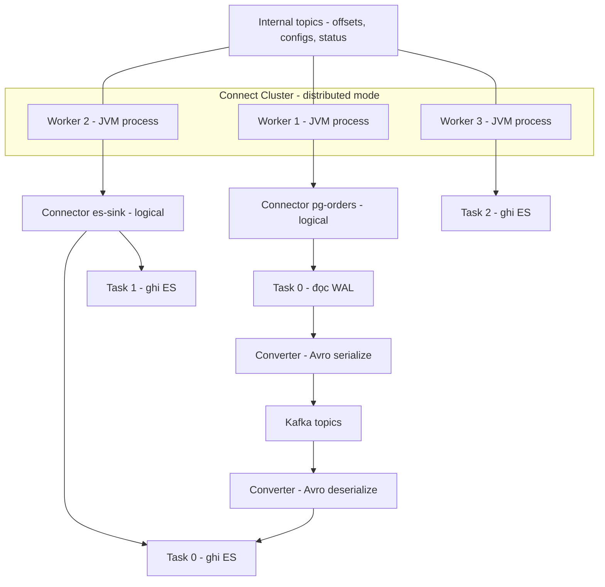
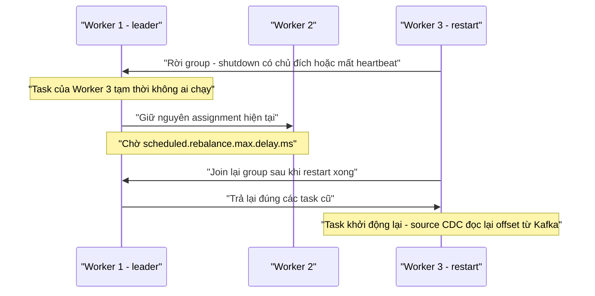

+++
title = "Chương 8: Kafka Connect — Nền tảng vận hành Connector"
date = "2026-02-20T15:00:00+07:00"
draft = false
tags = ["backend", "cdc", "kafka", "database"]
series = ["Change Data Capture"]
+++

Chương 7 kết thúc với một nhận định: phần khó nhất của CDC không phải đọc log mà là quản lý trạng thái và fault tolerance — và Debezium đẩy toàn bộ phần đó cho Kafka Connect. Chương này mở hộp đen Kafka Connect từ góc nhìn người vận hành platform. Nếu Debezium là động cơ, Connect là khung gầm: khi pipeline CDC gặp sự cố lúc 3 giờ sáng, thứ bạn thao tác gần như luôn là Connect — REST API, task state, rebalance, internal topic — chứ không phải code Debezium.

## 8.1. Bài toán Kafka Connect giải quyết

Trước Connect, mỗi team cần đưa dữ liệu vào/ra Kafka đều tự viết producer/consumer. Nghe đơn giản, nhưng mỗi bản tự viết phải giải lại cùng một tập bài toán:

- **Offset management:** đọc đến đâu, lưu ở đâu, restart thì sao — mỗi team một kiểu, phần lớn kiểu sai (offset trong file local, trong bảng MySQL không backup...).
- **Fault tolerance & HA:** process chết ai đọc tiếp? Ai phát hiện? Tự dựng leader election là một dự án riêng.
- **Scaling:** thêm throughput = viết lại phần chia việc.
- **Serialization:** mỗi pipeline một format, không Schema Registry, downstream vỡ mỗi khi ai đó thêm cột.
- **Vận hành:** không có API chuẩn để pause/resume/monitor; mỗi "connector tự chế" là một service riêng cần on-call riêng.

Kafka Connect chuẩn hóa tất cả thành một **framework**: bạn viết (hoặc dùng sẵn) plugin đọc/ghi hệ ngoài, framework lo offset, phân phối công việc, recovery, serialization, REST API. Với một platform có 30 pipeline dữ liệu, khác biệt giữa "30 service tự chế" và "1 Connect cluster + 30 file config JSON" là khác biệt giữa hỗn loạn và vận hành được. Đó là lý do vì sao — dù Connect có những phiền toái riêng sẽ nói dưới đây — nó vẫn là mặc định đúng cho CDC.

**Đánh đổi tổng quát:** Connect là framework Java chạy JVM, mô hình lập trình bó buộc (per-message, không join/aggregate), và mọi connector trên cùng cluster **chia sẻ số phận** ở mức worker. Nó không thay thế stream processor — Flink/Kafka Streams giải bài toán biến đổi có trạng thái; Connect giải bài toán **vận chuyển**. Nhầm vai trò này là nguồn của nhiều kiến trúc xấu (nhồi logic nghiệp vụ vào SMT — Chương 7 đã cảnh báo).

## 8.2. Kiến trúc: Worker, Connector, Task, Converter, Transform



Phân biệt bốn khái niệm hay bị lẫn:

- **Worker** là JVM process — đơn vị hạ tầng. Cluster = tập worker cùng `group.id`, cùng ba internal topic. Worker không "sở hữu" connector nào cố định; công việc được phân qua rebalance.
- **Connector** là thực thể **logic**: config + một instance nhỏ chạy trên một worker nào đó, nhiệm vụ duy nhất là quyết định chia việc thành bao nhiêu task và config từng task. Connector object không xử lý dữ liệu.
- **Task** là đơn vị **thực thi và song song hóa** — nơi dữ liệu thực sự chảy qua. Task được phân bổ ra các worker; worker chết thì task của nó được chuyển sang worker khác.
- **Converter** đứng giữa task và Kafka: serialize/deserialize (JsonConverter, AvroConverter, ProtobufConverter). Đây là **hợp đồng dữ liệu của platform** — chọn converter là quyết định ở tầng cluster/connector có hậu quả dài hạn (Chương 9 phân tích Schema Registry). **Transform (SMT)** chạy trước converter (source) hoặc sau (sink).

**Quan hệ connector:task với CDC — vì sao source CDC gần như luôn 1 task:** với sink connector, `tasks.max=8` nghĩa là 8 task chia nhau partition của topic — song song hóa tự nhiên. Nhưng source CDC đọc **transaction log — một stream tuần tự duy nhất, có thứ tự toàn cục**. Không thể cho hai task cùng đọc một WAL: ai giữ offset? Thứ tự transaction xử lý sao? PostgreSQL còn ràng buộc vật lý — một replication slot chỉ một connection đọc. Vì vậy Debezium PostgreSQL/MySQL luôn chạy 1 task cho một database bất kể `tasks.max` (SQL Server multi-database và MongoDB sharded là ngoại lệ có thể nhiều task — mỗi stream con một task).

Hệ quả thiết kế quan trọng: **scale CDC theo chiều ngang nghĩa là nhiều connector cho nhiều database, không phải nhiều task cho một database.** Nếu một database duy nhất sinh change nhanh hơn một task xử lý nổi, nút thắt nằm ở thiết kế nguồn — và như đã nói ở Chương 7, câu trả lời là lọc bảng, tách database, chứ không phải tìm cách "song song hóa việc đọc log".

## 8.3. Standalone vs Distributed mode

**Standalone:** một process, config từ file properties, offset lưu **file local** (`offset.storage.file.filename`). Không HA, không REST-driven config đúng nghĩa, offset chết theo máy. Chỗ dùng hợp lệ: máy dev, demo, edge case chạy một agent trên một máy cụ thể.

**Distributed:** nhiều worker (kể cả khi chỉ chạy **một** worker — vẫn nên dùng distributed mode), config qua REST API, offset/config/status trong Kafka topic. Worker chết → task tự chuyển. Đây là lựa chọn duy nhất cho production, và lý do sâu hơn "có HA": **trạng thái nằm trong Kafka thay vì trên máy**. Máy chạy standalone hỏng disk là mất offset — với CDC nghĩa là re-snapshot hoặc mất dữ liệu (Chương 7.5). Một worker distributed hỏng disk thì dựng worker mới, cùng `group.id`, mọi thứ tiếp tục. Tôi coi "standalone mode trên production" là finding mặc định trong mọi lần review kiến trúc CDC.

## 8.4. Ba internal topic — nơi cluster cất bộ não

| Topic (tên mặc định) | Nội dung | Config bắt buộc | Mất nó thì sao |
|---|---|---|---|
| `connect-offsets` | Offset mọi source connector | compact, RF=3, partition 25 (mặc định) | Source connector "mất trí nhớ": re-snapshot hoặc bỏ qua dữ liệu âm thầm — thảm họa (7.5) |
| `connect-configs` | Config connector + task, ghi tuần tự | compact, **1 partition duy nhất**, RF=3 | Cluster quên mọi connector đang chạy; phục hồi bằng re-submit config — đau nhưng sống được **nếu** config nằm trong Git |
| `connect-status` | Trạng thái RUNNING/FAILED/PAUSED của connector/task | compact, RF=3, 5 partition (mặc định) | Ít nghiêm trọng nhất — trạng thái được ghi lại khi cluster hoạt động; mất chủ yếu gây nhiễu ngắn hạn |

Ba điểm vận hành rút ra:

1. **`connect-configs` bắt buộc 1 partition** — thứ tự cập nhật config là tuyệt đối. Kafka Connect tự tạo đúng; nguy hiểm nằm ở cluster Kafka bật auto-create với default sai, hoặc người tạo tay "cho chuẩn hóa". Checklist khi dựng cluster mới: verify cả ba topic có `cleanup.policy=compact`, RF≥3, `min.insync.replicas=2`.
2. **Config connector phải sống trong Git, không phải chỉ trong `connect-configs`.** Internal topic là trạng thái runtime, không phải source of truth. Quy trình đúng: config JSON trong repo, CI validate (endpoint validate — Chương 7.3), CD gọi `PUT /connectors/{name}/config` (idempotent, tốt hơn POST). Khi đó mất `connect-configs` chỉ là sự cố hạ tầng, không phải mất tri thức.
3. Hai cluster Connect **không được dùng chung** internal topic hoặc `group.id` — triệu chứng là connector "nhảy" qua lại và offset lẫn lộn, lỗi kinh điển khi copy file config giữa các môi trường.

## 8.5. Rebalance — cái giá của tính đàn hồi

Worker trong cluster họp nhau qua group membership protocol (như consumer group). Khi thành viên thay đổi hoặc số connector/task thay đổi, cluster phải **phân bổ lại** task — đó là rebalance.

**Eager rebalancing (protocol cũ):** mọi worker **dừng toàn bộ task**, họp lại, phân bổ từ đầu, khởi động lại. Một worker khởi động lại rolling restart trên cluster 5 worker × 40 task = 40 task dừng/chạy lại nhiều lần liên tiếp. Gọi là "stop-the-world".

**Incremental cooperative rebalancing (mặc định từ Connect 2.3, `connect.protocol=compatible`/`sessioned`):** chỉ task **thực sự cần di chuyển** mới dừng; phần còn lại chạy tiếp. Khi một worker rời đi, task của nó không bị chia lại ngay mà chờ `scheduled.rebalance.max.delay.ms` (mặc định 5 phút) — đủ cho worker restart (deploy, OOM restart) quay lại nhận đúng task cũ, tránh hai lần rebalance cho một lần restart.



**Vì sao rebalance vẫn gây pause dù đã "cooperative":** task bị di chuyển phải stop sạch trên worker cũ (flush offset) rồi start trên worker mới — với Debezium nghĩa là ngắt kết nối replication, đọc lại offset, dựng lại schema history in-memory (MySQL: đọc lại toàn bộ schema history topic — bảng lớn nhiều DDL có thể mất hàng chục giây đến vài phút), kết nối lại slot. Trong khoảng đó CDC latency tăng vọt; event không mất (at-least-once) nhưng SLA latency bị thủng.

**Giảm ảnh hưởng:**

- Rolling restart có kỷ luật: từng worker một, chờ cluster ổn định (kiểm tra qua REST) mới sang worker kế.
- Chỉnh `scheduled.rebalance.max.delay.ms` khớp thời gian restart thực tế của bạn (restart 30 giây mà delay 5 phút = task nằm không 5 phút nếu worker không quay lại; ngược lại delay quá ngắn = rebalance kép).
- **Giảm bán kính ảnh hưởng bằng cách tách cluster** (mục 8.9): deploy sink connector mới không nên làm connector CDC nguồn tiền tệ phải restart task.
- Tránh thay đổi connector dồn dập — mỗi lần tạo/xóa/sửa config là một lần rebalance metadata.

## 8.6. REST API và lifecycle — task FAILED không tự sống lại

Toàn bộ quản trị qua REST (mặc định port 8083): tạo/sửa (`PUT /connectors/{name}/config`), trạng thái (`GET /connectors/{name}/status`), `pause`/`resume`/`stop`, restart (`POST /connectors/{name}/restart?includeTasks=true&onlyFailed=true` — tham số từ Connect 3.0 giúp restart đúng phần hỏng), xem offset và **sửa/xóa offset** (`GET/PATCH/DELETE /connectors/{name}/offsets`, từ Connect 3.6 — thao tác trước đây phải ghi tay vào topic, giờ có API chính thức; connector phải ở trạng thái STOPPED).

Điều quan trọng nhất mục này: **khi task chuyển FAILED — ví dụ exception không retry được, lỗi nghiêm trọng ở SMT/converter — Kafka Connect không tự restart nó.** Task nằm im ở FAILED vô hạn. Framework tự xử lý worker chết (rebalance), nhưng coi task fail là "lỗi cần con người xem xét". Triết lý này có lý (tự restart mù quáng một task crash-loop chỉ che triệu chứng), nhưng hệ quả vận hành thì tuyệt đối:

1. **Bắt buộc có monitoring trên task state** — scrape `GET /connectors/{name}/status` hoặc JMX metrics, alert khi bất kỳ task nào FAILED. Một pipeline CDC không có alert này sẽ có ngày "chết im lặng 4 ngày, phát hiện khi business hỏi vì sao dashboard đứng" — kịch bản tôi thấy ở nhiều tổ chức hơn tôi muốn thừa nhận. Với CDC PostgreSQL còn tệ hơn: connector chết nhưng **slot còn đó**, WAL tích lũy — sự cố analytics leo thang thành sự cố OLTP.
2. **Cần orchestration tự động có kiểm soát:** một job (cron/operator — Strimzi trên Kubernetes có tính năng auto-restart với backoff) restart task FAILED với giới hạn số lần, kèm alert. Retry trong connector (`errors.max.retries`) xử lý lỗi transient; orchestration xử lý lỗi cấp task; con người xử lý phần còn lại.

## 8.7. Sink connector và exactly-once

CDC vào Kafka mới là nửa đường; sink connector đưa dữ liệu tới đích. Ba sink phổ biến trong pipeline CDC:

- **JDBC sink:** ghi vào database quan hệ; hỗ trợ `insert.mode=upsert` (cần key), `delete.enabled=true` (hiểu tombstone). Thường cần SMT unwrap vì nó không hiểu phong bì Debezium. Cẩn thận `auto.evolve` — tiện nhưng nghĩa là schema đích bị điều khiển từ xa bởi thay đổi ở nguồn.
- **Elasticsearch sink:** document id = record key → update/delete tự nhiên theo `_id`; chi tiết ở Chương 9.
- **ClickHouse sink** (connector chính thức của ClickHouse): hỗ trợ exactly-once qua KeeperMap và batching — thứ ClickHouse cực kỳ cần (Chương 9).

**Exactly-once:**

- **Phía sink**, Connect framework không đảm bảo exactly-once tổng quát; đạt được hay không tùy sink: sink idempotent theo key (ES, JDBC upsert, ClickHouse ReplacingMergeTree) cho **effectively-once** — lý do nữa để pipeline CDC luôn thiết kế quanh upsert theo primary key.
- **Phía source**, từ Kafka 3.3 có `exactly.once.source.support`: worker dùng transaction — event và offset commit trong **cùng một transaction Kafka** — loại bỏ khoảng "đã gửi event nhưng chưa flush offset" gây duplicate khi crash. Giới hạn cần hiểu trước khi bật: phải bật trên **toàn cluster Connect** (rolling upgrade hai bước: `preparing` rồi `enabled`); connector phải hỗ trợ (Debezium các bản gần đây có, cần kiểm tra theo connector); consumer downstream phải đọc `read_committed`; throughput giảm do transaction overhead; và nó chỉ exactly-once **từ log vào Kafka** — không cứu duplicate do bản chất snapshot-chồng-streaming, càng không tự làm sink exactly-once. Quan điểm của tôi: với đa số pipeline CDC, **at-least-once + sink idempotent** đơn giản hơn, nhanh hơn, và đủ đúng; chỉ bật EOS source khi có consumer thật sự không thể idempotent.

## 8.8. Error handling: errors.tolerance, DLQ, retry

Ba tầng xử lý lỗi, đừng lẫn:

1. **Retry trong connector** (lỗi transient — mạng, timeout): `errors.retry.timeout`, backoff. Đúng chỗ cho "thử lại rồi sẽ được".
2. **Tolerance của framework** (lỗi từng message — deserialize hỏng, SMT nổ): `errors.tolerance=none` (mặc định: một message hỏng → task FAILED) hoặc `all` (bỏ qua message hỏng, đi tiếp).
3. **DLQ — chỉ cho sink:** `errors.deadletterqueue.topic.name` + `errors.deadletterqueue.context.headers.enable=true` (header ghi topic/partition/offset/lỗi gốc — không bật thì message trong DLQ gần như vô dụng để điều tra).

```properties
errors.tolerance=all
errors.deadletterqueue.topic.name=dlq.es-sink.orders
errors.deadletterqueue.topic.replication.factor=3
errors.deadletterqueue.context.headers.enable=true
errors.log.enable=true
```

Nguyên tắc quyết định cho **CDC nói riêng**: với **source**, `errors.tolerance=all` nghĩa là **âm thầm vứt change event** — một update vào bảng `orders` biến mất, downstream lệch vĩnh viễn không dấu vết. Với dữ liệu mà tính đầy đủ quan trọng (gần như mọi CDC), source nên fail-fast (`none`) và alert. Với **sink**, `all` + DLQ hợp lý: một message dị dạng không nên chặn cả pipeline, và DLQ giữ nó lại để xử lý sau. Nhưng DLQ chỉ có giá trị nếu **có quy trình tiêu thụ DLQ** — alert theo độ sâu DLQ, người chịu trách nhiệm điều tra, cách replay sau khi sửa. DLQ không ai đọc chỉ là thùng rác có tên đẹp, và với CDC, mỗi message nằm trong DLQ là một row đang sai ở đích.

## 8.9. Capacity planning — bao nhiêu worker, khi nào tách cluster

Con số dưới đây là **điểm xuất phát minh họa** từ kinh nghiệm, không phải hằng số — luôn đo trên workload của bạn:

- **Worker:** tối thiểu 3 (chịu được 1 node hỏng khi rolling restart). JVM heap 4–8GB; sink batch lớn (ES bulk, ClickHouse) ăn heap nhiều nhất — quá nửa sự cố OOM của Connect tôi gặp là sink buffer cộng dồn khi đích chậm.
- **Per task:** source Debezium ~0.5–1 CPU core và vài trăm MB heap ở tải 10–20 nghìn event/giây, event ~1KB, Avro (số lab, tham khảo); sink task nhẹ CPU hơn nhưng nặng memory theo batch size. Nghẽn thường ở converter (serialize) và compression trước tiên.
- **Mật độ:** giữ ~10–20 task/worker làm mức thoải mái. Trần thực tế không phải CPU mà là **bán kính rebalance**: cluster 200 task thì mỗi lần deploy connector mới hay restart worker, xác suất một task CDC quan trọng bị di chuyển là đáng kể.

**Khi nào tách cluster Connect riêng** — các ranh giới tách tôi khuyến nghị, theo thứ tự ưu tiên:

1. **Source CDC tách khỏi sink.** Source CDC là stateful và đắt khi gián đoạn (slot, WAL, schema history reload); sink là stateless-ish và deploy thường xuyên. Để chung, mỗi lần team analytics thêm một ES sink là connector CDC core banking rung lắc theo rebalance.
2. **Theo mức độ quan trọng:** pipeline tier-1 (thanh toán, đơn hàng) một cluster; thử nghiệm/nội bộ một cluster khác.
3. **Theo ranh giới tổ chức/tenant** khi nhiều team tự quản connector — quyền REST API của Connect quá thô để multi-tenant an toàn trên một cluster.

Chi phí của tách: thêm bộ ba internal topic, thêm dashboard, thêm máy. Với tổ chức dưới ~10 connector, một cluster là đủ; điểm gãy thường ở 20–30 connector hoặc khi sự cố rebalance đầu tiên làm thủng SLA của pipeline quan trọng — đừng đợi đến lần thứ hai.

Cuối cùng, một lời về **thứ phải monitor tối thiểu**: task state (8.6), consumer lag của sink, source record rate và `poll-batch-avg-time`, JVM heap/GC, và — với CDC — **slot lag phía database** (Chương 7.6). Connect không có UI; sức khỏe của nó là tập metrics bạn chủ động thu, và một cluster Connect không có bốn dashboard trên là một cluster chưa sẵn sàng production.

## Tóm tắt chương

- Kafka Connect chuẩn hóa bài toán vận chuyển dữ liệu vào/ra Kafka: offset, phân phối công việc, recovery, serialization, REST lifecycle — thay cho N bộ producer/consumer tự chế. Nó là tầng **vận chuyển**, không phải tầng xử lý.
- Mô hình: **Worker** (JVM, hạ tầng) — **Connector** (logic, chia việc) — **Task** (thực thi, đơn vị song song) — **Converter** (hợp đồng dữ liệu). Source CDC gần như luôn **1 task/database** vì transaction log là stream tuần tự duy nhất; scale bằng nhiều connector, không phải nhiều task.
- Production luôn **distributed mode** (kể cả 1 worker): trạng thái nằm trong Kafka, không nằm trên máy. Ba internal topic là bộ não cluster: `connect-offsets` mất là thảm họa dữ liệu, `connect-configs` mất thì sống được nếu config trong Git, cả ba phải compact + RF=3.
- **Incremental cooperative rebalancing** giảm nhưng không xóa gián đoạn: task di chuyển vẫn phải stop/start, CDC vẫn tăng latency (schema history reload, reconnect slot). Giảm ảnh hưởng bằng rolling restart kỷ luật, chỉnh `scheduled.rebalance.max.delay.ms`, và tách cluster để thu hẹp bán kính.
- **Task FAILED không tự restart** — alert trên task state là bắt buộc, kèm orchestration restart có giới hạn. Với CDC, connector chết còn kéo theo WAL tích lũy ở database nguồn.
- Error handling theo tầng: source fail-fast để không âm thầm mất change event; sink dùng `errors.tolerance=all` + DLQ có headers **và có quy trình tiêu thụ DLQ**. Exactly-once source (Kafka 3.3+) có thật nhưng nhiều điều kiện; đa số pipeline CDC nên chọn at-least-once + sink idempotent.
- Capacity: bắt đầu 3 worker, 10–20 task/worker; tách cluster theo trục source-CDC/sink và theo tier quan trọng trước khi cluster phình quá lớn.

## Đọc tiếp

Đến đây bạn đã có nguồn (Debezium — Chương 7) và nền tảng vận hành (Kafka Connect — chương này). **Chương 9: Xây dựng Event Pipeline hoàn chỉnh** ghép chúng thành hệ thống end-to-end: thiết kế topic và partition cho CDC, Schema Registry và compatibility mode, đưa dữ liệu vào ClickHouse với ReplacingMergeTree, vào Elasticsearch với xử lý tombstone, vào data lake với Iceberg/Delta — kèm latency budget từng chặng và các bài học thiết kế sai/tối ưu.
