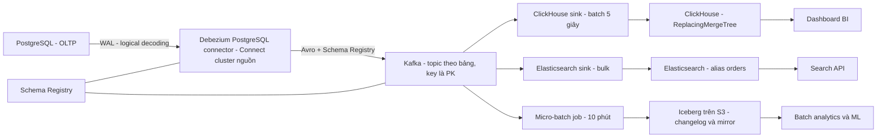

+++
title = "Chương 9: Xây dựng Event Pipeline hoàn chỉnh — Kafka đến ClickHouse, Elasticsearch, Data Warehouse"
date = "2026-02-20T16:00:00+07:00"
draft = false
tags = ["backend", "cdc", "kafka", "database"]
series = ["Change Data Capture"]
+++

Hai chương trước cho bạn nguồn (Debezium) và nền tảng (Kafka Connect). Chương này lắp mọi thứ thành pipeline hoàn chỉnh — và quan trọng hơn, chỉ ra các quyết định thiết kế **ở giữa** hai đầu: topic và partition, schema contract, cách từng loại đích tiêu hóa change event, và latency/backpressure của toàn tuyến. Kinh nghiệm của tôi: pipeline CDC thất bại ở production hiếm khi vì Debezium hay Kafka lỗi — nó thất bại vì **các quyết định thiết kế trung gian bị bỏ qua**: topic 200 partition cho bảng 50 nghìn row, JSON không schema, insert từng row vào ClickHouse. Cuối chương có đúng ví dụ đó, kèm bản chữa.

## 9.1. Kafka topic design cho CDC

### Naming và ánh xạ bảng → topic

Quy ước của Debezium: `<topic.prefix>.<schema>.<table>` — ví dụ `prod-pg-shop.public.orders`. Giữ nguyên quy ước này trừ khi có lý do mạnh (sharding — Chương 7.9): tên topic tự tài liệu hóa nguồn gốc, tooling và ACL đều dễ viết theo prefix. Mỗi bảng một topic — đừng gộp nhiều bảng vào một topic "cho gọn": bạn sẽ mất khả năng đặt retention/compaction riêng từng bảng và mọi consumer phải lọc thứ nó không cần.

### Partition strategy: key = primary key

Debezium mặc định dùng **primary key của row làm message key** → mọi thay đổi của cùng một row luôn vào cùng partition → **per-key ordering**: consumer thấy các phiên bản của một row đúng thứ tự. Đây là bất biến quan trọng nhất của pipeline CDC; gần như mọi cơ chế xử lý update/delete ở đích (upsert theo `_id` trong ES, ReplacingMergeTree trong ClickHouse) dựa trên nó.

Hai hệ quả phải hiểu:

- **Không có thứ tự giữa các key khác nhau.** Transaction chạm 2 row có thể xuất hiện ở 2 partition, consumer thấy chúng lệch thời điểm. Nếu downstream cần ranh giới transaction, phải dùng transaction metadata topic của Debezium (`provide.transaction.metadata=true`) và tự stitch — đắt; đa số hệ analytics chấp nhận eventual consistency theo row.
- **Đổi số partition của topic CDC là phá per-key ordering** (hash key đổi đích), và với compacted topic còn để lại phiên bản cũ ở partition cũ. Coi số partition của topic CDC là **bất biến sau khi tạo** — muốn đổi, tạo topic mới và re-snapshot/re-materialize. Vì vậy hãy quyết định đúng ngay từ đầu.

### Số partition — trade-off ba chiều

Nhiều partition = nhiều consumer song song ở sink, nhưng: nhiều file/metadata trên broker, rebalance consumer group lâu hơn, và mỗi partition nhỏ giọt làm batch ở sink kém hiệu quả (đặc biệt ClickHouse — mục 9.3). Nguồn CDC chỉ có **1 producer task** nên partition nhiều không tăng tốc ghi.

Heuristic tôi dùng (minh họa, điều chỉnh theo đo đạc): bảng dimension nhỏ (< vài triệu row, ít thay đổi) — **1–3 partition**; bảng fact/nóng — bắt đầu 6–12, định cỡ theo throughput đỉnh chia cho năng lực một sink consumer (ví dụ đỉnh 30 nghìn event/giây, một ES sink task tiêu ~5 nghìn/giây → 6–8 partition có dư địa). Con số "mặc định 200 partition cho mọi topic" là anti-pattern phổ biến nhất tôi gặp.

### Retention vs compaction

- **Compacted topic (`cleanup.policy=compact`)** giữ **phiên bản mới nhất theo key** + tombstone cho delete. Cực hợp với **bảng dimension**: topic trở thành "bản sao bảng" trong Kafka — consumer mới đọc từ đầu là dựng lại được toàn bộ trạng thái hiện tại (bootstrap cache, materialized view) mà không cần snapshot lại database. Điều kiện: Debezium phải phát tombstone (`tombstones.on.delete=true` — mặc định), và hiểu rằng compaction xóa **lịch sử trung gian** — topic compacted trả lời "trạng thái hiện tại là gì", không trả lời "chuyện gì đã xảy ra".
- **Retention theo thời gian (`delete`)** hợp với topic fact/audit nơi lịch sử từng event có giá trị. Retention phải dài hơn **thời gian sửa sự cố sink tệ nhất** cộng dư địa — sink chết 3 ngày với retention 24 giờ là mất dữ liệu vĩnh viễn (phải incremental snapshot lại). Tôi khuyến nghị tối thiểu 7 ngày cho topic CDC quan trọng; hoặc `compact,delete` kết hợp khi phù hợp.

**Replication factor:** 3, `min.insync.replicas=2`, producer `acks=all` (Connect source mặc định) — topic CDC là dữ liệu nghiệp vụ, không phải log tạm. RF=2 tiết kiệm 33% disk và trả giá bằng một sự cố mất broker kép nào đó trong tương lai.

## 9.2. Schema Registry — hợp đồng dữ liệu của pipeline

### Bài toán

Schema của bảng nguồn **sẽ** thay đổi — thêm cột là chuyện hàng tuần. Không có cơ chế quản lý schema, mỗi thay đổi ở nguồn là một canh bạc với mọi consumer: parse lỗi lúc 2 giờ sáng, hoặc tệ hơn — parse "thành công" ra dữ liệu sai. Schema Registry biến quan hệ producer-consumer thành **hợp đồng có kiểm chứng**: schema đăng ký tập trung, mỗi message chỉ mang **schema id** (5 byte) thay vì cả schema, và Registry **từ chối** schema mới vi phạm compatibility mode đã khai.

Hậu quả không dùng Registry ở scale lớn, nhìn thấy được bằng tiền: Debezium với JsonConverter mặc định (`schemas.enable=true`) nhét **toàn bộ schema vào từng message** — message 1KB dữ liệu thành 4–6KB (số minh họa từ payload thực tế tôi từng đo; tỷ lệ tùy độ rộng bảng, thường 3–5x). Nhân với hàng tỷ event: 3–5x chi phí disk Kafka, network, và CPU parse ở mọi consumer. Còn tắt `schemas.enable` để "JSON cho gọn" thì bạn mất luôn thông tin kiểu — consumer đoán kiểu từ giá trị, và `NUMERIC` thành chuỗi hay số là tùy hên xui từng ngày.

### Chọn format và compatibility mode

- **Avro:** hệ sinh thái Kafka/Connect/Debezium hỗ trợ sâu nhất, schema evolution rõ ràng, compact. **Mặc định đúng cho CDC.**
- **Protobuf:** hợp lý khi tổ chức đã chuẩn hóa Protobuf (gRPC) toàn công ty; tooling Kafka kém phong phú hơn Avro một chút.
- **JSON Schema:** giữ tính người-đọc-được của JSON nhưng vẫn to và chậm hơn binary; tôi chỉ dùng cho topic public-facing nơi consumer không kiểm soát được.

**Compatibility mode cho CDC: `BACKWARD` (hoặc `BACKWARD_TRANSITIVE`).** Lập luận: BACKWARD nghĩa là *consumer dùng schema mới đọc được dữ liệu ghi bằng schema cũ* — cho phép thêm field có default, xóa field. Trong CDC, producer (Debezium) đổi schema **trước** theo DDL ở nguồn, consumer nâng cấp **sau** — và consumer còn cần đọc lại dữ liệu cũ trong topic (replay, bootstrap từ compacted topic). BACKWARD khớp đúng trình tự đó. `FULL` an toàn hơn nhưng cấm cả thêm cột NOT NULL không default — quá chặt so với thực tế DDL của các team. Điều Registry mang lại lớn nhất không phải là encoding — mà là **DDL vi phạm hợp đồng bị chặn ngay tại Connect với error rõ ràng**, thay vì nổ rải rác ở 12 consumer sau đó vài giờ.

Lưu ý thực địa: một số thay đổi nguồn (đổi kiểu cột, đổi tên cột) không map được thành evolution hợp lệ — quy trình đúng là coi đó là **breaking change có nghi thức**: topic mới hoặc version mới, migrate consumer có kế hoạch. Schema Registry không xóa được breaking change; nó chỉ đảm bảo bạn *biết* mình đang làm một breaking change.

## 9.3. Pipeline vào ClickHouse

### Vì sao ClickHouse, và bài toán update/delete

ClickHouse là columnar OLAP: quét hàng tỷ row trong giây — đúng nhu cầu analytics trên dữ liệu CDC. Nhưng nó **ghét update/delete từng row** (mutation là thao tác nặng, offline về bản chất), trong khi CDC bản chất là dòng update/delete. Lời giải chuẩn: **đừng update — hãy insert phiên bản mới**, và để **ReplacingMergeTree** dọn phiên bản cũ khi merge background.

Ví dụ cụ thể — bảng `orders` từ PostgreSQL:

```sql
-- PostgreSQL nguồn
CREATE TABLE orders (
  id          BIGINT PRIMARY KEY,
  customer_id BIGINT NOT NULL,
  status      TEXT NOT NULL,
  amount      NUMERIC(18,2) NOT NULL,
  updated_at  TIMESTAMPTZ NOT NULL
);
```

```sql
-- ClickHouse đích
CREATE TABLE orders
(
    id          Int64,
    customer_id Int64,
    status      LowCardinality(String),
    amount      Decimal(18,2),
    updated_at  DateTime64(6),
    _version    UInt64,              -- lấy từ source.lsn hoặc ts_ms của Debezium
    _is_deleted UInt8 DEFAULT 0      -- 1 nếu event là delete
)
ENGINE = ReplacingMergeTree(_version, _is_deleted)
ORDER BY (id);
```

- **`_version`:** ReplacingMergeTree giữ row có version lớn nhất theo `ORDER BY` key. Dùng LSN (PostgreSQL) hoặc `source.ts_ms` — đơn điệu tăng theo từng key nhờ per-key ordering (9.1). Không có version column, "bản mới nhất" là bản insert sau cùng theo thời gian ghi vào ClickHouse — retry/replay sẽ làm sai.
- **`_is_deleted`:** delete từ CDC thành insert một row đánh dấu xóa (SMT unwrap với `rewrite` — Chương 7.9); ReplacingMergeTree với tham số thứ hai sẽ loại row này khi merge.
- **Cái giá của `FINAL`:** merge là background và **không có cam kết thời điểm** — SELECT thường có thể thấy 2 phiên bản của một order. `SELECT ... FINAL` ép dedup lúc đọc: đúng nhưng đắt (nặng CPU/memory, các phiên bản gần đây đã cải thiện nhiều nhưng vẫn đắt hơn hẳn đọc thường). Chiến lược thực dụng: query nào cần chính xác từng row (đối soát) dùng FINAL hoặc `GROUP BY id + argMax`; dashboard tổng hợp lớn chấp nhận sai số nhỏ trong vài phút; và cân nhắc partition theo thời gian để FINAL chỉ đụng partition nóng.

### Batch insert — luật số một của ClickHouse

Mỗi INSERT tạo một "part" trên disk; hàng nghìn insert nhỏ/giây tạo bão part khiến merge không kịp thở — lỗi `too many parts` và cluster quỳ. Luật: **insert theo batch nghìn-đến-triệu row, tần suất giây-đến-chục-giây** (khuyến nghị kinh điển: mỗi INSERT ≥ ~1000 row, lý tưởng 10k–500k; hoặc bật async_insert cho phía server gom). Ba con đường từ Kafka:

1. **ClickHouse Kafka Connect Sink (connector chính thức):** chạy trên Connect cluster sẵn có, gom batch theo `consume` cycle, exactly-once qua KeeperMap. Lựa chọn mặc định của tôi khi đã có Connect.
2. **Kafka table engine trong ClickHouse** (+ materialized view đẩy vào bảng đích): không cần hạ tầng thêm, nhưng consumer sống **trong** ClickHouse — lỗi parse, quản lý offset, monitoring đều khó thao tác hơn; nâng cấp ClickHouse là đụng pipeline.
3. **ClickPipes (ClickHouse Cloud) / Flink / tự viết:** managed hoặc khi cần transform phức tạp trước khi ghi.

Số minh họa để định cỡ (lab, tham khảo): một sink task gom batch 50 nghìn row, flush mỗi 5 giây, một node ClickHouse 16 core tiêu hóa 200–500 nghìn row/giây thoải mái. Cùng dữ liệu đó insert từng row: chết ở vài trăm row/giây kèm bão part. Chênh lệch **ba bậc độ lớn** — hoàn toàn do batching.

## 9.4. Pipeline vào Elasticsearch

Use case: search và lookup trên dữ liệu nghiệp vụ (tìm đơn hàng, autocomplete khách hàng) mà không đè query LIKE lên OLTP.

- **Ánh xạ:** document `_id` = message key (primary key) → mỗi row một document; index request với cùng `_id` là upsert tự nhiên — event CDC lặp lại (at-least-once) vô hại, hợp đồng idempotency đã nói ở Chương 8.7. **Đừng để ES tự đoán mapping** từ event đầu tiên (dynamic mapping đoán sai kiểu — số thành long, chuỗi thành text+keyword đúp): định nghĩa **index template** tường minh từ schema Avro, tắt dynamic cho field lạ (`"dynamic": "strict"` hoặc `false`) để một cột mới ở nguồn không âm thầm bơm rác vào mapping.
- **Delete:** Debezium phát tombstone (key, value=null) → ES sink với `behavior.on.null.values=delete` chuyển thành DELETE document theo `_id`. Nếu SMT unwrap nuốt mất tombstone mà không cấu hình `rewrite`/giữ tombstone, đích sẽ **giữ document ma vĩnh viễn** — lỗi cấu hình phổ biến nhất của pipeline CDC→ES, và nó không có triệu chứng cho đến khi ai đó tìm thấy đơn hàng đã xóa.
- **Reindex strategy:** đổi mapping trong ES gần như luôn là tạo index mới. Làm đúng: index có version (`orders_v2`) sau **alias** (`orders`); dựng `orders_v2` bằng cách replay topic CDC từ đầu (đây là lúc compacted topic tỏa sáng — đọc từ đầu là có trạng thái đầy đủ) hoặc trigger incremental snapshot (Chương 7.7), chờ đuổi kịp, **switch alias nguyên tử**. Không có compacted topic hay snapshot lại được, bạn sẽ phải `_reindex` nội bộ ES — không có dữ liệu mới từ nguồn trong lúc đó.
- **Bulk và backpressure:** ES sink dùng bulk API — chỉnh `batch.size` (2000–5000), `flush.timeout.ms`, `max.in.flight.requests`. Khi ES chậm (GC, merge, node hỏng): sink retry theo backoff → consumer poll chậm lại → **consumer lag tăng**. Đó là hành vi đúng — Kafka là bộ đệm hấp thụ. Việc của bạn: alert trên lag, và đảm bảo retention topic dài hơn thời gian sự cố ES tệ nhất (9.1). Đừng "chữa" bằng tăng batch vô hạn — sink OOM là đổi một sự cố lấy hai.

## 9.5. Data Lake / Data Warehouse: CDC vào Iceberg và Delta

Đích thứ ba: lịch sử đầy đủ, rẻ, cho batch analytics và ML. Bài toán giống ClickHouse — object storage không update tại chỗ — lời giải cũng cùng họ: **table format** (Iceberg, Delta Lake) hỗ trợ **merge-on-read**: delete/update ghi thành delete file/log entry, reader hợp nhất lúc đọc, compaction dọn dần.

- **Ingest:** hai trường phái. **Micro-batch** (Spark Structured Streaming trigger 5–15 phút, hoặc Kafka → S3 rồi COPY/MERGE vào warehouse): đơn giản, rẻ, file to tự nhiên — đủ cho đa số nhu cầu warehouse vì SLA ở đây là phút-giờ, không phải giây. **Streaming ingest** (Flink → Iceberg, hoặc connector Iceberg sink): latency phút xuống giây-chục-giây, đổi lấy vận hành phức tạp và file nhỏ nhiều hơn. Chọn theo SLA thật của người dùng cuối — tôi thấy quá nhiều pipeline streaming đắt đỏ phục vụ một dashboard được xem mỗi sáng một lần.
- **Small file problem:** ingest tần suất cao sinh vô số file nhỏ; scan chậm dần theo tuần vì metadata và open-file overhead. Compaction (Iceberg `rewrite_data_files`, Delta `OPTIMIZE`) **phải là job định kỳ có alert** ngay từ ngày đầu, không phải việc "làm sau" — chi phí compaction tăng theo lũy tích file bạn đã nợ.
- **Mẫu phổ biến:** giữ **append-only changelog table** (mọi event, immutable — nguồn sự thật để replay/audit) + **mirror table** cập nhật bằng MERGE định kỳ theo primary key với dedup theo LSN. Hai bảng, hai mục đích — đừng gộp.

## 9.6. End-to-end latency budget

"CDC realtime" là bao nhiêu? Câu trả lời đúng là một **ngân sách được phân bổ theo chặng và được đo từng chặng**. Con số dưới đây là điển hình cho pipeline khỏe mạnh (minh họa — đo hệ của bạn):

| Chặng | Cơ chế đo | Điển hình |
|---|---|---|
| Commit → Debezium đọc từ WAL/binlog | JMX `MilliSecondsBehindSource` | 10–200ms |
| Debezium xử lý + queue + produce vào Kafka | so `ts_ms` nguồn vs timestamp Kafka record | 10–100ms |
| Nằm chờ trong Kafka đến khi sink poll | consumer lag thời gian | 10–500ms |
| Sink batch + flush | batch window của sink | 1–10 giây (ClickHouse), 0.5–5 giây (ES) |
| Visible ở đích | ES refresh interval ~1 giây; ClickHouse ngay sau insert, dedup hoàn chỉnh chờ merge/FINAL | 0–2 giây |

Tổng điển hình: **2–15 giây** commit-to-visible cho ClickHouse/ES; phút-cấp cho lake micro-batch. Ba bài học:

1. **Batch window của sink thống trị ngân sách** — muốn giảm latency, đừng tối ưu Debezium trước, hãy nhìn `flush` của sink. Và nhớ trade-off ngược: batch nhỏ hơn = ClickHouse nhiều part hơn.
2. Đo bằng **event thật xuyên suốt**: một job ghi row canary có timestamp vào bảng nguồn mỗi 30 giây, đo lúc nó xuất hiện ở đích — một con số duy nhất phản ánh cả pipeline, thứ SLA nên viết trên đó.
3. Latency phân phối đuôi dài: p50 3 giây và p99 40 giây là bình thường (merge ES, GC, rebalance). Viết SLA theo percentile, đừng theo trung bình.

## 9.7. Backpressure toàn tuyến

Điều xảy ra khi một sink chậm/chết, lần theo chuỗi:

1. Sink consumer poll chậm → **consumer lag tăng**. Kafka hấp thụ — không gì hỏng ngay.
2. Lag kéo dài quá **retention** của topic → segment bị xóa trước khi kịp đọc → **mất dữ liệu**. Rủi ro thật đầu tiên; phòng bằng retention dư dả + alert lag theo *thời gian* (không chỉ số message).
3. **Database nguồn: không bị ảnh hưởng bởi sink chậm.** Đây là điểm mạnh kiến trúc của log-based CDC so với polling — consumer chậm không tạo thêm một query nào lên OLTP; Kafka cách ly hoàn toàn hai phía. Với polling-based, consumer chậm thường dẫn tới poll dày hơn/quét lại nặng hơn đè trực tiếp lên database.
4. **Ngoại lệ quan trọng:** nếu chậm ở **trước Kafka** — Debezium chết, Kafka đầy disk, ChangeEventQueue nghẽn (Chương 7.2) — thì **replication slot giữ WAL** và disk database phình (Chương 7.6). Ranh giới an toàn là Kafka: sau Kafka chậm bao nhiêu database cũng bình yên; trước Kafka nghẽn là sự cố OLTP đếm ngược.

Vậy bản đồ alert tối thiểu của pipeline: slot lag (database), connector/task state (Connect), consumer lag theo thời gian (Kafka), độ sâu DLQ, canary end-to-end. Năm tín hiệu — phủ được hầu hết kịch bản chết của pipeline.

## 9.8. Kiến trúc hoàn chỉnh — bản sai và bản tối ưu



**Ca thiết kế sai — tổng hợp từ các hệ thống có thật tôi từng review.** Team dựng CDC cho `orders` (~2 triệu row, đỉnh 800 change/giây) và `customers` (300 nghìn row, vài change/phút):

1. Mọi topic 200 partition, RF=2 — "để sau này scale". Thực tế: 1 producer task, sink 2 task; 200 partition chỉ mang lại rebalance chậm, batch vụn (mỗi partition nhỏ giọt vài row → batch sink không bao giờ đầy), và một lần mất 2 broker là mất luôn phân vùng dữ liệu.
2. JSON với `schemas.enable=true`, không Registry — message phình ~4x, disk Kafka và CPU consumer trả giá hàng ngày; một lần đổi kiểu cột ở nguồn làm 3 consumer nổ theo 3 kiểu khác nhau trong cùng buổi chiều.
3. Consumer tự viết insert **từng row** vào ClickHouse — `too many parts` sau 2 tuần khi traffic tăng; đội data mất một sprint đi "tune ClickHouse" trong khi lỗi nằm ở phía ghi.
4. Unwrap bỏ tombstone không `rewrite` — order xóa vẫn nằm trong ClickHouse và ES; phát hiện sau 3 tháng khi đối soát doanh thu lệch.

**Bản tối ưu:**

1. `orders`: 6 partition, RF=3, retention 14 ngày. `customers`: 1 partition, **compacted** + tombstone — bootstrap consumer mới không đụng database.
2. Avro + Schema Registry, `BACKWARD` compatibility; message ~4x nhỏ hơn, DDL vi phạm bị chặn tại Connect với error tường minh.
3. ClickHouse official sink, batch flush 5 giây; bảng `ReplacingMergeTree(_version, _is_deleted)` `ORDER BY id`, dashboard dùng tổng hợp thường, đối soát dùng FINAL trên partition nóng.
4. Unwrap với `delete.tombstone.handling.mode=rewrite` cho nhánh ClickHouse; nhánh ES giữ tombstone + `behavior.on.null.values=delete`; topic gốc giữ phong bì đầy đủ (nguyên tắc Chương 7.9).
5. Năm alert của mục 9.7 + canary 30 giây. SLA công bố: p99 commit-to-visible 30 giây cho ES/ClickHouse, 30 phút cho lake.

Khác biệt giữa hai bản không nằm ở công nghệ — cùng Debezium, cùng Kafka, cùng ClickHouse — mà ở chỗ bản sau **trả lời tường minh từng câu hỏi thiết kế** mà bản đầu đã mặc định cho qua.

## Tóm tắt chương

- Topic CDC: mỗi bảng một topic, **key = primary key** cho per-key ordering — bất biến nền tảng của mọi cơ chế upsert ở đích; số partition là quyết định gần-như-bất-biến, định cỡ theo năng lực sink, không theo "để dành". Dimension → compacted + tombstone (topic thành bản sao bảng, replay được); fact → retention dài hơn sự cố sink tệ nhất; RF=3.
- **Schema Registry không phải tùy chọn ở scale lớn:** Avro + `BACKWARD` cho CDC; giá trị lớn nhất là chặn breaking change tại nguồn thay vì nổ rải rác ở consumer; không có nó, JSON kèm schema phình 3–5x kích thước message.
- **ClickHouse:** không update — insert phiên bản mới, `ReplacingMergeTree(version, is_deleted)` dọn khi merge; FINAL đúng nhưng đắt, dùng có chọn lọc; và luật số một — **batch insert**, chênh lệch với insert từng row là ba bậc độ lớn.
- **Elasticsearch:** `_id` = key → upsert idempotent; template mapping tường minh; tombstone → delete document (mất tombstone = document ma); reindex qua index version + alias + replay từ compacted topic hoặc incremental snapshot.
- **Lake/warehouse:** Iceberg/Delta merge-on-read, changelog + mirror table, micro-batch trừ khi SLA thật sự cần streaming, compaction file nhỏ là job định kỳ bắt buộc.
- Latency budget: đo từng chặng, batch window của sink thống trị, SLA theo percentile với canary end-to-end. Backpressure: Kafka cách ly database khỏi sink chậm — điểm mạnh so với polling — nhưng nghẽn **trước** Kafka thì slot giữ WAL và trở thành sự cố OLTP.

## Đọc tiếp

Pipeline đã chạy — nhưng chạy được và vận hành được là hai chuyện khác nhau. Chương 10 — [CDC trong bức tranh kiến trúc](/series/cdc/10-cdc-va-kien-truc/): đặt CDC vào các pattern kiến trúc lớn hơn — Outbox Pattern, Event Sourcing, CQRS, materialized view, cache synchronization — để trả lời câu hỏi khi nào dùng CDC thuần, khi nào cần Outbox, và vì sao CDC không phải Event Sourcing.
