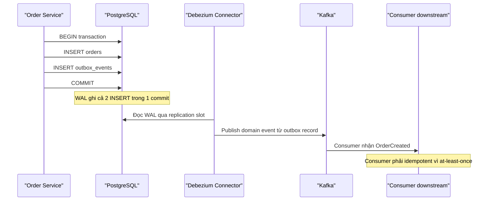
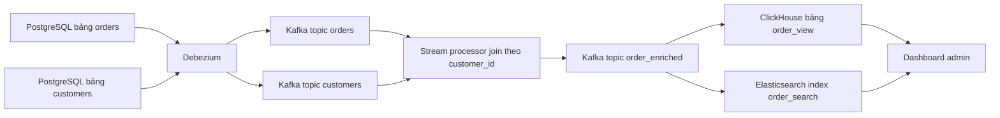

+++
title = "Chương 10: CDC trong bức tranh kiến trúc — Outbox, Event Sourcing, CQRS"
date = "2026-02-20T17:00:00+07:00"
draft = false
tags = ["backend", "cdc", "kafka", "database"]
series = ["Change Data Capture"]
+++

Đến chương này, chúng ta đã hiểu CDC hoạt động thế nào ở tầng cơ chế: transaction log, replication slot, connector, offset. Câu hỏi tiếp theo — và là câu hỏi mà một Tech Lead hay Solution Architect thực sự phải trả lời — là: **CDC đứng ở đâu trong kiến trúc tổng thể?** Nó thay thế cái gì, kết hợp với pattern nào, và quan trọng hơn: nó *không phải* là cái gì.

Tôi đã chứng kiến không ít team dùng CDC như một chiếc búa vạn năng: dùng CDC event thô làm domain event, gọi CDC là "event sourcing", hoặc kỳ vọng read model cập nhật tức thì như strong consistency. Cả ba đều là hiểu nhầm, và cả ba đều trả giá ở production. Chương này sẽ đi qua từng pattern, với câu hỏi xuyên suốt: *Tại sao? Đánh đổi gì? Làm sai thì hậu quả gì?*

## 10.1. Outbox Pattern — lời giải chuẩn cho bài toán dual write

### 10.1.1. Bài toán gốc: dual write không atomic

Hãy bắt đầu từ đoạn code mà hầu như service nào cũng từng có:

```java
@Transactional
public void createOrder(Order order) {
    orderRepository.save(order);          // ghi vào PostgreSQL
    kafkaProducer.send("order-created",   // publish event lên Kafka
        toEvent(order));
}
```

Trông vô hại, nhưng đây là **dual write**: hai hệ thống lưu trữ độc lập (database và Kafka), không có transaction chung. Có bốn kịch bản:

1. Cả hai thành công — mọi thứ ổn.
2. DB commit thành công, Kafka send thất bại (broker down, timeout) — order tồn tại nhưng downstream không bao giờ biết. **Mất event.**
3. Kafka send thành công *trước khi* transaction commit, rồi transaction rollback — downstream nhận event về một order không tồn tại. **Event ma.**
4. Service crash giữa hai bước — không xác định được trạng thái.

Bạn không thể sửa bằng cách đổi thứ tự hai lệnh — chỉ đổi kịch bản 2 thành kịch bản 3. Bạn cũng không thể sửa bằng retry đơn thuần, vì retry sau khi process crash đòi hỏi bạn phải *nhớ* rằng mình còn nợ một event — tức là phải ghi trạng thái đó vào đâu đó bền vững. Và "đâu đó bền vững, cùng transaction với business data" chính là... một cái bảng trong database. Đó là Outbox.

Distributed transaction (XA/2PC) giữa DB và Kafka về lý thuyết giải được, nhưng thực tế Kafka không hỗ trợ XA, và ngay cả khi có, 2PC mang theo blocking, coordinator là single point of failure, và throughput sụt nghiêm trọng. Trong 20 năm làm nghề, tôi chưa thấy hệ thống nào dùng 2PC giữa OLTP database và message broker mà sống khỏe ở quy mô lớn.

### 10.1.2. Cơ chế Outbox: một transaction, hai bảng

Ý tưởng cốt lõi: **thay vì ghi vào hai hệ thống, chỉ ghi vào một** — database — trong **cùng một transaction ACID**:

```sql
BEGIN;

INSERT INTO orders (id, customer_id, total_amount, status)
VALUES ('ord-9f2a', 'cus-771', 1250000, 'CREATED');

INSERT INTO outbox_events (id, aggregate_type, aggregate_id, event_type, payload, created_at)
VALUES (
    gen_random_uuid(),
    'order',
    'ord-9f2a',
    'OrderCreated',
    '{"orderId":"ord-9f2a","customerId":"cus-771","totalAmount":1250000,"items":[...]}',
    now()
);

COMMIT;
```

Atomic tuyệt đối: hoặc cả order lẫn event cùng tồn tại, hoặc cả hai cùng biến mất khi rollback. Không còn kịch bản 2, 3, 4.

Vấn đề còn lại: làm sao đưa record từ `outbox_events` lên Kafka? Có hai cách:

- **Polling publisher**: một job quét bảng outbox định kỳ, publish rồi đánh dấu/xóa. Hoạt động được, nhưng mang mọi nhược điểm của polling — độ trễ, tải query lặp, và phải tự xử lý thứ tự, concurrency giữa nhiều instance của publisher.
- **CDC đọc bảng outbox**: Debezium capture INSERT vào `outbox_events` từ WAL/binlog, publish lên Kafka. Không thêm một dòng query nào vào database, độ trễ mili-giây, thứ tự đúng theo commit order, và tính đúng đắn (at-least-once) được bảo đảm bởi cơ chế offset của connector.

**Outbox + CDC là combo chuẩn** vì nó tách hai mối quan tâm một cách sạch sẽ: transaction ACID của database bảo đảm *atomicity* giữa business data và event; transaction log + CDC bảo đảm *delivery* của event. Mỗi thành phần làm đúng việc nó giỏi nhất.



### 10.1.3. Debezium Outbox Event Router

Nếu để nguyên, event từ Debezium sẽ mang hình dạng change event (envelope `before/after/op/source`) trên topic tên `server.public.outbox_events` — không phải thứ consumer muốn. Debezium có sẵn SMT `EventRouter` để "bóc" outbox record thành domain event đúng nghĩa:

```json
{
  "name": "outbox-connector",
  "config": {
    "connector.class": "io.debezium.connector.postgresql.PostgresConnector",
    "table.include.list": "public.outbox_events",
    "tombstones.on.delete": "false",
    "transforms": "outbox",
    "transforms.outbox.type": "io.debezium.transforms.outbox.EventRouter",
    "transforms.outbox.table.field.event.key": "aggregate_id",
    "transforms.outbox.route.by.field": "aggregate_type",
    "transforms.outbox.route.topic.replacement": "domain.events.${routedByValue}",
    "transforms.outbox.table.expand.json.payload": "true"
  }
}
```

Kết quả: record với `aggregate_type = 'order'` được route sang topic `domain.events.order`, message key là `aggregate_id` (bảo đảm mọi event của cùng một order vào cùng partition — giữ thứ tự), payload là JSON domain event thuần, không còn envelope CDC. `event_type` được gắn vào header để consumer filter.

Hai chi tiết vận hành đáng chú ý:

- Đặt `tombstones.on.delete=false` — nếu bạn xóa record outbox sau khi publish, đừng để Debezium sinh tombstone event gây nhiễu.
- Debezium mặc định **bỏ qua UPDATE/DELETE trên bảng outbox** khi dùng EventRouter (nó chỉ quan tâm INSERT) — đây là hành vi đúng: outbox là append-only về mặt ngữ nghĩa.

### 10.1.4. Trade-off: bảng outbox phình to và chiến lược cleanup

Không có gì miễn phí. Bảng outbox là bảng ghi nóng nhất hệ thống — mọi transaction nghiệp vụ đều chèn vào nó. Với 500 event/giây, payload trung bình 1 KB, bạn sinh ~43 GB/ngày (số liệu minh họa điển hình). Không cleanup, sau một tháng bạn có bảng hơn 1 TB với index bloat kéo mọi INSERT chậm lại.

Các chiến lược cleanup, theo thứ tự tôi khuyên dùng:

1. **DELETE ngay trong cùng transaction** (kỹ thuật "insert-then-delete"): `INSERT` rồi `DELETE` chính record đó trong cùng transaction. Nghe ngược đời, nhưng với PostgreSQL, cả INSERT lẫn DELETE đều được ghi vào WAL — Debezium vẫn thấy INSERT event. Bảng vật lý luôn gần như rỗng. Nhược điểm: sinh dead tuple, cần autovacuum khỏe; và bạn mất khả năng đối soát lại bảng outbox khi cần điều tra.
2. **Batch delete theo thời gian**: job đêm xóa record cũ hơn N ngày (N = 3–7, đủ để đối soát và re-consume khi có sự cố). Nhớ delete theo batch nhỏ (10k–50k rows/lần) để tránh giữ lock và bloat WAL đột biến.
3. **Partition theo ngày + DROP PARTITION**: sạch nhất về mặt vacuum (DROP không sinh dead tuple), nhưng lưu ý với PostgreSQL logical replication, thao tác quản lý partition cần được kiểm tra kỹ với version Debezium bạn dùng.

Sai lầm tôi từng thấy: team để bảng outbox chạy 6 tháng không cleanup, autovacuum không theo kịp, `INSERT` p99 từ 2ms lên 40ms, kéo toàn bộ API checkout chậm theo. Outbox không cleanup là nợ kỹ thuật có lãi suất kép.

### 10.1.5. CDC thuần vs Outbox: khi nào dùng cái nào

Đây là quyết định kiến trúc thật sự, và tiêu chí phân định rõ ràng hơn nhiều người nghĩ:

| Tiêu chí | CDC thuần trên bảng nghiệp vụ | Outbox + CDC |
|---|---|---|
| Bản chất event | **Data change event** — "row này đã đổi" | **Domain event** — "nghiệp vụ này đã xảy ra" |
| Contract với consumer | Schema bảng nội bộ bị lộ ra ngoài | Payload thiết kế có chủ đích, versioned |
| Khi refactor schema DB | Vỡ mọi consumer — coupling chặt | Consumer không ảnh hưởng nếu contract giữ nguyên |
| Business intent | Mất — chỉ thấy state trước/sau | Giữ nguyên — `OrderCancelledByCustomer` vs `OrderCancelledByFraudCheck` |
| Effort phía producer | Zero — không sửa code ứng dụng | Phải sửa code: mọi nơi ghi data phải ghi kèm outbox |
| Phù hợp cho | Replication, data warehouse, cache/search sync, audit — các bài toán **data integration** | Giao tiếp giữa các bounded context, microservices — các bài toán **application integration** |

Quy tắc tôi dùng: **nếu consumer quan tâm đến "dữ liệu" — dùng CDC thuần; nếu consumer quan tâm đến "sự kiện nghiệp vụ" — dùng Outbox.** Đồng bộ bảng `products` sang Elasticsearch? CDC thuần, vì bạn thực sự cần data. Thông báo cho Shipping Service rằng đơn hàng đã thanh toán? Outbox, vì Shipping không nên biết (và không nên vỡ khi bạn đổi) cấu trúc bảng `orders`.

Một ví dụ cụ thể về cái giá của việc chọn sai: một team dùng CDC thuần trên bảng `orders` làm "event" cho 5 team khác consume. Sáu tháng sau họ cần tách cột `status` thành hai cột `fulfillment_status` và `payment_status`. Một thay đổi schema nội bộ hoàn toàn hợp lý — nhưng phải phối hợp release với 5 team, mất 2 tháng. Đó chính là **coupling qua schema**, thứ mà microservices sinh ra để tránh.

## 10.2. Event Sourcing vs CDC — đừng nhầm lẫn

Tôi nghe câu này thường xuyên: "Bọn em dùng Debezium nên coi như đã có Event Sourcing rồi." Không. Đây là hiểu nhầm về *bản chất*, không phải về công cụ.

### 10.2.1. Khác biệt bản chất: đâu là source of truth

- **Event Sourcing**: event là **source of truth**. State hiện tại là *dẫn xuất* — được tính bằng cách replay chuỗi event (`AccountOpened`, `MoneyDeposited`, `MoneyWithdrawn`). Ứng dụng ghi event trước tiên và duy nhất; muốn biết số dư, fold qua event stream (hoặc đọc snapshot — cũng là dẫn xuất).
- **CDC**: state trong database là **source of truth**. Event là *dẫn xuất* — được sinh ra từ việc quan sát state thay đổi. Ứng dụng ghi state; event chỉ là cái bóng của state.

Chiều mũi tên ngược nhau hoàn toàn:

```
Event Sourcing:  Event (gốc)  ──replay──▶  State (dẫn xuất)
CDC:             State (gốc)  ──capture──▶  Event (dẫn xuất)
```

Hệ quả thực tế của khác biệt này:

1. **CDC event thiếu intent.** UPDATE `status` từ `ACTIVE` sang `SUSPENDED` — vì khách yêu cầu, vì gian lận, hay vì lỗi vận hành sửa tay? CDC không biết. Event Sourcing biết, vì event *là* intent.
2. **CDC không capture thay đổi "trung gian" trong transaction** theo cách bạn nghĩ — và ngược lại, nhiều UPDATE liên tiếp cùng một row vẫn sinh nhiều event, nhưng bạn không thể tái tạo *lý do* của từng bước.
3. **Replay có ý nghĩa khác nhau.** Replay event-sourced stream tái tạo chính xác business history. Replay CDC topic chỉ tái tạo chuỗi state — đủ để rebuild read model, không đủ để trả lời câu hỏi nghiệp vụ như "bao nhiêu đơn bị hủy bởi fraud check trong Q1".
4. **Event Sourcing là quyết định thiết kế ứng dụng** (ảnh hưởng cách viết mọi dòng code domain); **CDC là quyết định hạ tầng** (ứng dụng không cần biết nó tồn tại).

### 10.2.2. CDC là con đường tiến hóa dần sang EDA

Nói vậy không có nghĩa CDC "thua" Event Sourcing — chúng giải bài toán khác nhau, và CDC có một ưu thế chiến lược mà tôi đánh giá rất cao: **nó cho phép hệ thống legacy tiến hóa sang event-driven architecture mà không cần rewrite**.

Lộ trình tôi đã áp dụng nhiều lần:

1. **Giai đoạn 1**: Bật CDC trên monolith database. Downstream mới (search, analytics, cache) consume change event. Monolith không đổi một dòng code. Team học vận hành Kafka/Connect trên luồng ít rủi ro.
2. **Giai đoạn 2**: Với các luồng nghiệp vụ quan trọng, thêm Outbox vào monolith — bắt đầu phát domain event có chủ đích. CDC infrastructure tái sử dụng nguyên vẹn.
3. **Giai đoạn 3**: Tách service mới, consume domain event từ outbox topic. Strangler pattern trên nền event.
4. **Giai đoạn 4** (nếu thật sự cần): một vài bounded context có yêu cầu audit/temporal mạnh chuyển hẳn sang Event Sourcing. Đa số context sẽ không bao giờ cần bước này — và đó là điều tốt.

Event Sourcing toàn hệ thống là khoản đầu tư rất đắt (event versioning, snapshot, rebuild, tư duy team). CDC cho bạn 70% lợi ích event-driven với 20% chi phí. Đừng để sự "thuần khiết kiến trúc" quyết định thay ROI.

## 10.3. CQRS và Materialized View — CDC là cỗ máy xây read model

### 10.3.1. CQRS không cần phải "to tát"

CQRS ở dạng thực dụng nhất: **write model tối ưu cho transaction, read model tối ưu cho query, hai model được đồng bộ bất đồng bộ**. Không bắt buộc Event Sourcing, không bắt buộc tách service. Và CDC là cơ chế đồng bộ tự nhiên nhất: write model là các bảng normalized trong PostgreSQL; CDC stream mọi thay đổi; một consumer (hoặc stream processor) biến đổi và ghi vào read store denormalized.

Vì sao CDC thay vì để ứng dụng tự ghi read model? Vì (a) tránh dual write — như mục 10.1; (b) read model có thể *rebuild từ đầu* bằng snapshot + replay mà không đụng vào code ứng dụng; (c) thêm read model mới (ví dụ ngày mai cần thêm một view trên ClickHouse) không cần release lại write service.

### 10.3.2. Ví dụ cụ thể: order + customer join thành view

Bài toán kinh điển: trang quản trị cần query "danh sách đơn hàng kèm tên khách, tier khách, tổng chi tiêu — filter theo 10 tiêu chí, sort tùy ý". Query này JOIN 3–4 bảng trên OLTP là tự sát ở quy mô lớn. Giải pháp: materialized view trên ClickHouse (analytics) hoặc Elasticsearch (search/filter).



Điểm kỹ thuật then chốt: **join hai CDC stream là stateful**. Khi event `orders` đến, dữ liệu `customers` tương ứng phải đã có sẵn ở đâu đó. Ba cách làm, theo mức độ phức tạp tăng dần:

1. **Lookup trực tiếp khi consume**: consumer nhận order event, query bảng customer (hoặc cache) để enrich. Đơn giản, nhưng tạo tải đọc lên DB và có race condition nếu customer chưa sync.
2. **Kafka Streams KTable-KTable join / Flink temporal join**: materialize topic `customers` thành state store (RocksDB), join local. Đúng đắn hơn, nhưng bạn phải vận hành state — rebalance, restore, disk.
3. **Denormalize tại sink**: ghi hai bảng riêng vào ClickHouse, JOIN lúc query (ClickHouse chịu JOIN tốt với dimension nhỏ) hoặc dùng dictionary cho bảng `customers`. Thực tế đây là cách tôi khuyên dùng đầu tiên vì ít moving part nhất.

Với Elasticsearch, lưu ý mô hình document: mỗi order là một document chứa sẵn `customer_name`, `customer_tier` (denormalized). Khi customer đổi tên — hiếm — chấp nhận update-by-query bất đồng bộ, hoặc chấp nhận staleness cho các field ít quan trọng. Đánh đổi này cần được nêu rõ với product owner, đừng tự quyết trong im lặng.

### 10.3.3. Search index, cache, analytics, audit — bốn ứng dụng kinh điển

**Search Index synchronization.** Bài toán: dữ liệu trong DB, tìm kiếm trong Elasticsearch/OpenSearch. CDC bảo đảm mọi thay đổi — kể cả từ script vận hành, migration, service khác ghi thẳng DB — đều sync sang index, điều mà application-level sync không làm được. Delete cũng được xử lý tự nhiên qua tombstone/delete event. Điều cần chấp nhận: search index trễ hơn DB vài trăm ms tới vài giây; nghiệp vụ "tạo xong tìm thấy ngay" cần xử lý riêng (xem 10.4).

**Cache Synchronization.** Hai chiến lược:

- *Invalidate*: nhận CDC event → DELETE key trong Redis. Read tiếp theo là cache miss, đọc DB, nạp lại. An toàn hơn vì cache luôn được nạp từ nguồn mới nhất.
- *Update*: nhận CDC event → SET giá trị mới vào Redis. Tiết kiệm cache miss, nhưng mở ra **race condition kinh điển**: CDC consumer SET giá trị từ event tại thời điểm T1; đồng thời một request cache-miss đọc DB tại T2 > T1 (giá trị mới hơn) nhưng SET vào Redis *sau* consumer — không sao; tệ hơn là chiều ngược lại: request đọc DB ra giá trị cũ tại T0, bị GC pause, SET vào cache *sau khi* CDC consumer đã SET giá trị mới — cache giữ giá trị cũ **vô thời hạn**.

Phòng thủ: (a) version check — mỗi value kèm version/updated_at, SET chỉ khi version mới hơn (Redis Lua script để so sánh atomic); (b) luôn đặt TTL làm lưới an toàn cuối — kể cả khi logic sai, dữ liệu bẩn chỉ sống tối đa TTL; (c) nếu không muốn phức tạp, chọn invalidate — chậm hơn một cache miss nhưng khó sai hơn nhiều. Nguyên tắc của tôi: **update-based cache sync chỉ khi đã có version check; còn lại dùng invalidate + TTL.**

**Analytics Pipeline.** CDC → Kafka → warehouse/lakehouse cho phép dashboard "gần real-time" thay vì T+1. Chi tiết ở chương 12; ở đây chỉ ghi nhận vị trí của nó trong bức tranh: đây là ứng dụng CDC có ROI dễ chứng minh nhất, thường là dự án CDC đầu tiên nên làm.

**Audit Log từ CDC.** Ưu điểm thật sự: *không xâm lấn code* — mọi thay đổi, kể cả UPDATE tay của DBA lúc 2 giờ sáng, đều bị ghi lại; không lệ thuộc developer nhớ gọi `auditService.log()`. Nhưng hạn chế phải nói thẳng: CDC event **không có business context** (thao tác này thuộc use case nào?) và thường **không biết ai thực hiện** — WAL không chứa application user, chỉ có DB user (thường là một connection pool user chung). Khắc phục một phần: ghi `app_user_id`, `request_id` vào cột riêng hoặc dùng cơ chế transaction metadata (ví dụ ghi một record "audit context" trong cùng transaction), nhưng như vậy lại xâm lấn code — mất luôn ưu điểm ban đầu. Kết luận thực dụng: CDC audit tốt cho *forensic data trail* (cái gì đổi, khi nào, từ giá trị nào sang giá trị nào); nếu compliance đòi *ai và tại sao*, bạn cần audit ở tầng application, hoặc kết hợp cả hai.

## 10.4. Consistency: nói thẳng về eventual và read-your-own-writes

### 10.4.1. Consistency của từng pattern

Mọi pattern trong chương này đều có chung một dòng chữ in nhỏ: **downstream là eventually consistent**. Cụ thể:

| Pattern | Điểm strong consistency | Điểm eventual consistency | Cửa sổ trễ điển hình (minh họa) |
|---|---|---|---|
| Outbox + CDC | Business data + outbox record (cùng transaction) | Consumer nhận event | 100ms – vài giây |
| CQRS read model | Write model | Read model | 200ms – vài giây; phút nếu backlog |
| Cache sync | DB | Redis | 50ms – 1s |
| Search sync | DB | Elasticsearch | 1s – 10s (do refresh interval) |
| Analytics | OLTP | Warehouse | giây – phút (micro-batch) |

Điều quan trọng không phải con số, mà là: **cửa sổ trễ không có cận trên bảo đảm**. Khi connector chết hoặc consumer backlog, "vài trăm ms" trở thành vài giờ. Kiến trúc của bạn phải *đúng* (không chỉ *chấp nhận được*) khi độ trễ là 1 giờ — nếu không, bạn đang xây trên cát. Đây là câu hỏi tôi luôn hỏi khi review design: "Nếu read model trễ 1 giờ, nghiệp vụ nào vỡ? Vỡ kiểu khó chịu hay kiểu mất tiền?"

### 10.4.2. Read-your-own-writes problem

Kịch bản: người dùng sửa địa chỉ giao hàng, bấm Lưu, trang reload — và thấy địa chỉ *cũ*, vì trang đọc từ read model chưa kịp sync. Với người dùng, đây không phải "eventual consistency" — đây là **bug**. Đây là vấn đề UX số một của mọi kiến trúc CQRS/CDC, và phải được thiết kế từ đầu chứ không vá sau.

Các giải pháp, theo thứ tự nên cân nhắc:

1. **Đọc write model cho chính resource vừa ghi** (read-after-write routing): sau khi user ghi thành công, các request đọc *của chính user đó, cho chính resource đó* trong N giây tiếp theo được route về primary DB. Đơn giản nhất nếu API gateway/service phân biệt được. Đánh đổi: thêm logic routing, và write model gánh thêm read.
2. **Trả về state trong write response**: API ghi trả luôn representation mới; client dùng nó cập nhật UI (optimistic UI). Không đụng backend read path. Đánh đổi: chỉ giải quyết được màn hình hiện tại, không giải quyết user mở tab khác.
3. **Version-based read**: write trả về `version` (hoặc LSN/offset); client gửi kèm `min_version` khi đọc; read model nếu chưa đạt version thì chờ hoặc fallback về primary. Đúng đắn nhất về mặt lý thuyết, phức tạp nhất về triển khai — chỉ đáng khi có nhiều read model và yêu cầu nghiêm ngặt.
4. **Session sticky vào cache tạm**: ghi xong, đặt bản mới vào Redis theo session; read ưu tiên Redis session cache. Biến thể của cách 1.
5. **Chấp nhận và thiết kế UX phù hợp**: hiển thị "Đang cập nhật…", disable edit trong vài giây. Rẻ nhất, và với nhiều nghiệp vụ (analytics, search) là hoàn toàn đủ.

Lưu ý tinh tế: read-your-own-writes chỉ là một trong họ vấn đề session consistency — còn có *monotonic reads* (user thấy dữ liệu mới rồi lại thấy dữ liệu cũ do hai request đập vào hai replica của read model có độ trễ khác nhau). Nếu read model có nhiều replica, hãy sticky session theo replica hoặc dùng version-based read.

### 10.4.3. Điều CDC không bao giờ cho bạn

Chốt lại phần consistency bằng ba giới hạn cứng, để không ai kỳ vọng nhầm:

1. **CDC không cho cross-system transaction.** Không có cách nào để "DB commit và Elasticsearch index và Redis update" xảy ra atomic. Nếu nghiệp vụ đòi điều đó, nghiệp vụ phải được thiết kế lại (saga, compensation) hoặc dữ liệu phải ở cùng một chỗ.
2. **CDC không cho exactly-once end-to-end miễn phí.** Pipeline là at-least-once; exactly-once *effect* phải do consumer idempotent tự kiến tạo (chương 11 và 13).
3. **CDC không thay thế thiết kế contract.** Event từ CDC thuần là schema nội bộ — dùng nó làm public contract là anti-pattern (chương 13).

## Tóm tắt chương

- **Dual write** (ghi DB + publish Kafka trong code) là lỗi kiến trúc, không phải lỗi implementation — không retry nào sửa được. **Outbox pattern** giải quyết tận gốc: ghi business data và event record trong cùng transaction ACID, để CDC đảm nhận delivery. Debezium EventRouter biến outbox record thành domain event đúng nghĩa. Cái giá: sửa code producer + cleanup bảng outbox nghiêm túc.
- **CDC thuần** phát *data change event* (lộ schema nội bộ, zero effort) — phù hợp data integration. **Outbox** phát *domain event* (contract chủ đích, giữ business intent) — phù hợp giao tiếp giữa các service. Chọn theo việc consumer cần "dữ liệu" hay cần "sự kiện nghiệp vụ".
- **CDC không phải Event Sourcing**: chiều mũi tên ngược nhau — Event Sourcing coi event là source of truth, CDC coi event là dẫn xuất của state. Nhưng CDC là con đường tiến hóa dần sang EDA cho hệ thống legacy mà không cần rewrite.
- **CQRS + CDC**: CDC là cỗ máy xây và rebuild read model (ClickHouse, Elasticsearch) mà không đụng code write service. Join stream là stateful — ưu tiên denormalize tại sink trước khi với tới Kafka Streams/Flink.
- **Cache sync**: mặc định dùng invalidate + TTL; chỉ dùng update khi có version check, vì race condition giữa cache update và read có thể để dữ liệu bẩn sống vô thời hạn.
- Mọi downstream của CDC là **eventually consistent, không có cận trên độ trễ**. Thiết kế phải trả lời được "nghiệp vụ nào vỡ nếu trễ 1 giờ", và **read-your-own-writes** phải được xử lý chủ động (route về write model, trả state trong response, hoặc version-based read).

## Đọc tiếp

Chương tiếp theo — **Chương 11: Production Failure Cases** — là chương quan trọng nhất của toàn bộ tài liệu: 20 sự cố production điển hình của pipeline CDC, từ replication slot làm đầy disk đến split-brain connector, mỗi case đi kèm cách điều tra bằng lệnh/query cụ thể, metric cần theo dõi và alert nên cấu hình. Nếu bạn chỉ đọc một chương trước khi vận hành CDC, hãy đọc chương đó.
