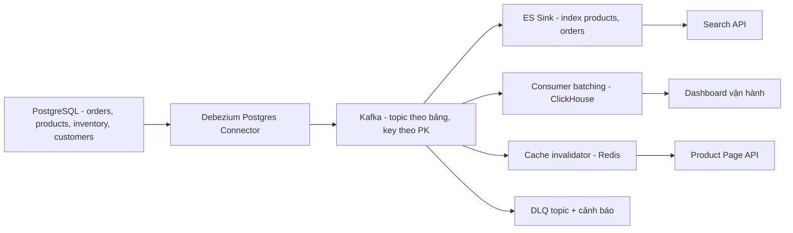
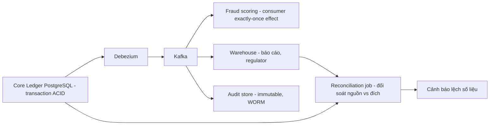
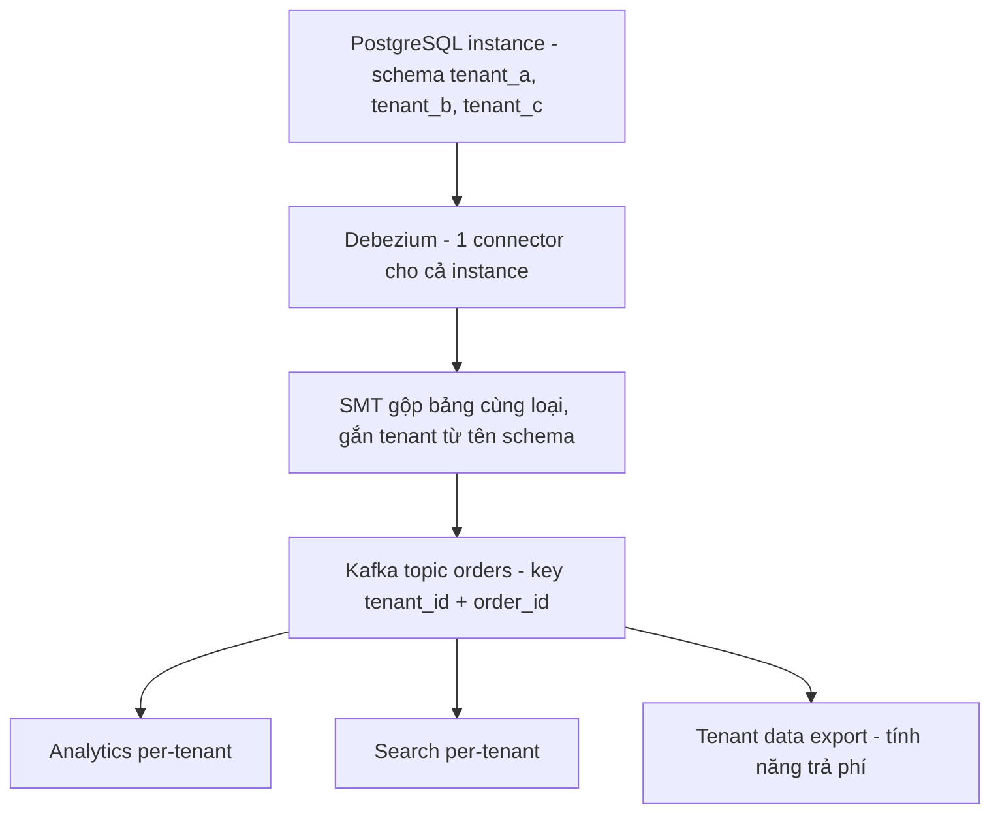

+++
title = "Chương 12: Kiến trúc CDC thực tế theo domain"
date = "2026-02-20T19:00:00+07:00"
draft = false
tags = ["backend", "cdc", "kafka", "database"]
series = ["Change Data Capture"]
+++

Hai chương trước cho bạn pattern (chương 10) và bản đồ rủi ro (chương 11). Chương này ghép chúng lại thành **thiết kế hoàn chỉnh theo từng loại hệ thống**. Cùng một công nghệ — Debezium, Kafka — nhưng bài toán e-commerce, FinTech hay SaaS multi-tenant dẫn đến những quyết định rất khác nhau, và điều làm nên một Solution Architect giỏi không phải là biết công cụ, mà là biết *bối cảnh nào bẻ cong thiết kế theo hướng nào*.

Mỗi case đi theo khung: bối cảnh business → vì sao chọn CDC (và vì sao không polling) → kiến trúc → scale/chi phí ước lượng (số liệu minh họa điển hình) → trade-off → bài học. Case e-commerce được phân tích sâu nhất; các case sau tập trung vào điểm khác biệt so với nó, tránh lặp lại.

## 12.1. E-commerce: case đầy đủ nhất

### Bối cảnh business

Một sàn thương mại điện tử cỡ vừa: ~2 triệu đơn hàng/tháng, catalog 5 triệu sản phẩm, đội ngũ ~80 engineer (số liệu minh họa). Ba nhu cầu đồng thời, cùng ăn từ một nguồn dữ liệu PostgreSQL:

1. **Search**: khách tìm sản phẩm theo tên, thuộc tính, giá, tồn kho — cần Elasticsearch, và tồn kho/giá phải cập nhật trong vài giây (bán hàng flash sale mà search hiển thị "còn hàng" khi đã hết là mất tiền và mất niềm tin).
2. **Analytics**: dashboard vận hành gần real-time — doanh thu theo phút, tỷ lệ hủy đơn, hiệu quả campaign — cần ClickHouse thay vì hành hạ OLTP bằng query aggregate.
3. **Cache**: trang chi tiết sản phẩm chịu tải đọc rất lớn — Redis cache, và cache sai giá là tai nạn nghiệp vụ.

### Vì sao chọn CDC, vì sao không polling

Trước CDC, hệ thống này thường có ba cơ chế sync riêng: cron re-index Elasticsearch mỗi 15 phút (quét `updated_at`), batch ETL đêm sang warehouse, và cache invalidation rải rác trong code ứng dụng. Ba cơ chế, ba loại bug:

- Polling theo `updated_at` **bỏ sót DELETE** (row biến mất khỏi bảng thì không còn `updated_at` để quét) và bỏ sót mọi cập nhật không đi qua ORM (script vận hành, bulk fix).
- Quét bảng 5 triệu sản phẩm mỗi 15 phút là một query nặng lặp vô hạn; muốn giảm trễ xuống 1 phút thì tải tăng 15 lần — polling có quan hệ nghịch giữa độ trễ và chi phí.
- Cache invalidation trong code là dual write trá hình: chỗ nhớ gọi, chỗ quên (chương 10).

CDC giải cả ba bằng một cơ chế: mọi thay đổi — kể cả DELETE, kể cả từ script — chảy qua WAL, một lần capture, ba consumer dùng chung. Độ trễ mili-giây với chi phí đọc trên database gần như bằng không.

### Kiến trúc

Các quyết định thiết kế đáng chú ý:

- **Hai connector, không phải một**: một cho nhóm bảng "nóng" (`orders`, `order_items`, `inventory` — ghi liên tục, downstream nhạy trễ) và một cho nhóm "nguội" (`products`, `customers`, `categories`). Lý do trực tiếp từ Case 12 chương 11: cô lập throughput, và một sự cố schema trên bảng nguội không dừng luồng inventory. Đánh đổi: hai slot = hai nguồn rủi ro WAL retention, và mất thứ tự cross-table giữa hai nhóm — chấp nhận được vì các consumer không join cross-nhóm theo thứ tự.
- **Search**: index `products` denormalized (nhúng category name, brand, giá, tồn kho vào document); `_id` = product id để upsert idempotent; `refresh_interval=5s`; mapping strict. Tồn kho cập nhật qua partial update từ topic `inventory`.
- **Analytics**: consumer tự viết (hoặc Kafka Connect ClickHouse sink) gom batch 50k rows hoặc 10 giây mới flush — bài học Case 16. Bảng `ReplacingMergeTree(version)` với version = LSN, dedup tự nhiên cho at-least-once.
- **Cache**: invalidate, không update — theo đúng khuyến nghị chương 10, kèm TTL 1 giờ làm lưới an toàn.
- **Outbox song song**: các domain event (`OrderPaid`, `OrderShipped`) cho các service khác (notification, loyalty) đi qua bảng outbox + EventRouter — không cho service khác ăn CDC event thô của bảng `orders`.

### Scale và chi phí ước lượng (minh họa)

- Peak ~3.000 change event/giây (flash sale ~15.000/giây trong vài phút); trung bình ~400/giây. Một Debezium task xử lý thoải mái — trần single task (Case 12) còn xa.
- Kafka: 3 broker vừa phải (hoặc managed ~vài trăm USD/tháng), topic CDC 6–12 partition, retention 7 ngày (~200 GB với Avro + lz4).
- Hạ tầng CDC tổng thể (Connect 2 worker, Schema Registry, monitoring) thêm khoảng 10–15% chi phí so với cụm database hiện có. Đáng nói hơn tiền máy: **cần tối thiểu 2 người biết vận hành pipeline này** — chi phí thật nằm ở đó.

### Trade-off và bài học

- Read-your-own-writes: seller sửa giá, mở trang search chưa thấy — xử lý bằng optimistic UI ở seller portal (chương 10), không cố ép search index "real-time tuyệt đối".
- Flash sale là bài kiểm tra backlog: pipeline được benchmark tiêu thụ 5× tốc độ peak để bảo đảm khả năng bắt kịp (bài học Case 14).
- Bài học lớn nhất về tổ chức: schema migration của team ứng dụng từng làm crash connector (Case 11) — sau đó quy trình review migration bắt buộc có mục "ảnh hưởng CDC". CDC thành công là vấn đề quy trình liên team nhiều hơn là công nghệ.

## 12.2. FinTech: CDC là kênh dẫn xuất, không bao giờ là transaction path

### Bối cảnh business

Ví điện tử / ngân hàng số: chuyển tiền, thanh toán. Yêu cầu đặc thù: audit đầy đủ cho regulator, đối soát (reconciliation) hàng ngày với đối tác, báo cáo gần real-time cho risk/fraud, và **sai một đồng cũng là sự cố nghiêm trọng**.

### Nguyên tắc số một: không dùng CDC cho luồng chuyển tiền chính

Đây là ranh giới tôi vẽ đậm nhất trong mọi buổi review kiến trúc FinTech. Luồng ghi nợ/ghi có giữa hai tài khoản phải là **một transaction ACID trong database** (hoặc saga có compensation được thiết kế tường minh). CDC là **dẫn xuất** — at-least-once, eventual, không có cận trên độ trễ (chương 10, 11). Đặt CDC vào đường đi của tiền nghĩa là đặt tính đúng đắn của số dư phụ thuộc vào một pipeline có thể trễ một giờ khi connector chết. Câu hỏi thử: "nếu pipeline dừng 6 giờ, có giao dịch nào sai không?" — câu trả lời bắt buộc là *không, chỉ có báo cáo trễ*.

CDC ở FinTech phục vụ các luồng *đọc*: sao kê gần real-time, feed cho hệ thống fraud, đổ warehouse, audit trail thứ cấp.

### Kiến trúc và các điểm khác biệt

- **Exactly-once semantics ở consumer**: pipeline là at-least-once (Case 9), nên consumer tài chính phải kiến tạo exactly-once *effect*: mọi event mang transaction id duy nhất từ nguồn; consumer ghi kết quả xử lý và event id **trong cùng một transaction** vào store đích (transactional inbox); event đã thấy thì bỏ qua. Với sink Kafka-to-Kafka, dùng Kafka transactions + `read_committed`. Không có "exactly-once bằng niềm tin".
- **Reconciliation job là thành phần bắt buộc, không phải tùy chọn**: job định kỳ (mỗi giờ/mỗi ngày) so khớp nguồn và đích — count theo khung thời gian, sum(amount) theo ngày, checksum theo dải id. Lý do: chương 11 cho thấy mất event là *có thể xảy ra* (Case 8, 19) và không có metric nào phát hiện trực tiếp — reconciliation là lưới cuối cùng, và với regulator, "chúng tôi đối soát hàng ngày" là câu trả lời được chấp nhận, "chúng tôi tin Kafka" thì không.
- **Audit**: CDC audit trail mạnh ở forensic (mọi thay đổi số dư đều có vết, kể cả sửa tay) nhưng thiếu "ai, tại sao" (chương 10) — nên hệ thống có *hai* lớp audit: application-level (user, lý do, phê duyệt) và CDC-level (giá trị trước/sau); lệch nhau giữa hai lớp cũng là tín hiệu điều tra.
- **PII/security**: cột số thẻ, CMND không được stream thô — column exclude/masking bằng SMT ngay tại connector (chi tiết chương 13).

### Trade-off và bài học

Chi phí kỹ thuật của FinTech CDC không nằm ở throughput (thường thấp hơn e-commerce) mà ở **mức độ nghi ngờ**: mọi thứ phải đối soát được, mọi consumer phải chứng minh idempotent. Bài học: đội nào coi reconciliation là "việc làm sau" đều hối hận; đội nào xây nó từ đầu thì ngủ ngon — và chính reconciliation từng là thứ phát hiện Case 8 (mất event do cấu hình) sau 3 ngày thay vì 3 tháng.

## 12.3. Social Network: fan-out feed và MongoDB Change Streams

### Bối cảnh

Mạng xã hội / cộng đồng: scale *ghi* rất lớn (post, like, comment — hàng trăm nghìn ghi/giây ở đỉnh, minh họa), yêu cầu feed gần real-time, dữ liệu chính trên MongoDB (schema linh hoạt cho content).

### Vì sao CDC, và điểm khác biệt

Bài toán trung tâm: **fan-out** — một post của người có 1 triệu follower phải đến 1 triệu feed. Fan-out-on-write toàn phần cho mọi user là không khả thi về chi phí; kiến trúc thực tế lai: fan-out-on-write cho user thường, fan-out-on-read cho celebrity. CDC (MongoDB Change Streams) đóng vai trò **nguồn phát sự kiện ghi**: post mới → change stream → Kafka → fleet của fan-out worker ghi vào feed store (Redis/Cassandra).

Vì sao không để application publish thẳng? Vẫn là dual write — và ở scale này, tỷ lệ lỗi nhỏ nhân với volume khổng lồ thành số tuyệt đối lớn: 0,01% event thất bại của 100 nghìn ghi/giây là 10 event mất mỗi giây.

Đặc thù MongoDB Change Streams so với Debezium/PostgreSQL:

- Change stream xây trên oplog của replica set; resume bằng **resume token** — token chỉ hợp lệ khi điểm đó *còn trong oplog*: oplog window chính là "binlog retention" của MongoDB (Case 8 phiên bản Mongo). Trên cluster ghi trăm nghìn ops/giây, oplog 50 GB có thể chỉ đủ vài giờ — **oplog window là metric sống còn**, alert khi < 24 giờ (minh họa).
- Sharded cluster: change stream hợp nhất từ mọi shard, đổi lấy chi phí phối hợp; tránh dùng một stream cho cả cluster khi có thể scope theo collection.
- `fullDocument: 'updateLookup'` trả document đầy đủ nhưng là *lookup tại thời điểm đọc* — có thể đã bị ghi đè bởi update sau (không hoàn toàn tương đương `after` của Debezium); từ MongoDB 6.0 có pre/post image cấu hình được — bật nó nếu consumer cần trạng thái chính xác từng bước.

### Trade-off và bài học

Feed là nghiệp vụ **chịu được mất mát nhẹ và trễ nhẹ** — một like đến feed muộn 30 giây không ai kiện — nên thiết kế được phép ưu tiên throughput hơn độ chặt: batch lớn, dedup lỏng (feed store tự nhiên idempotent theo post id). Bài học ngược với FinTech: *biết nghiệp vụ tha thứ điều gì* giúp tiết kiệm rất nhiều độ phức tạp. Hot partition (Case 14) ở đây là chuyện thường ngày — key theo author id thì celebrity là hot key; giải pháp: key theo post id cho luồng fan-out, và tách luồng celebrity xử lý riêng.

## 12.4. SaaS multi-tenant: kiến trúc tenant quyết định kiến trúc CDC

### Bối cảnh

SaaS B2B (CRM, HRM...) hàng nghìn tenant, nhu cầu: analytics per-tenant, search per-tenant, và đôi khi "data export/sync về hệ thống của khách" như một tính năng bán tiền.

### Shared schema vs schema-per-tenant — ảnh hưởng trực tiếp lên CDC

- **Shared schema** (mọi tenant chung bảng, có cột `tenant_id`): CDC đơn giản nhất — một connector, một bộ topic; tenant routing thực hiện ở consumer (hoặc SMT route theo `tenant_id` nếu thực sự cần topic riêng cho tenant lớn). Rủi ro: **noisy neighbor** — một tenant chạy bulk import 20 triệu rows chiếm băng thông pipeline, mọi tenant khác trễ theo (Case 14: hot partition theo tenant_id; cân nhắc key composite `tenant_id + entity_id`).
- **Schema-per-tenant / database-per-tenant**: cô lập đẹp cho OLTP nhưng là **cơn ác mộng CDC nếu làm ngây thơ**: 2.000 tenant × 1 connector = 2.000 connector, 2.000 slot (PostgreSQL giới hạn `max_replication_slots`, mỗi slot một walsender, một luồng rủi ro Case 1). Cách làm đúng: một connector *per database instance* (không phải per tenant) với `schema.include.list` rộng, topic routing bằng SMT (`ByLogicalTableRouter` gộp bảng cùng cấu trúc từ nhiều schema về một topic, thêm trường tenant từ tên schema). Chấp nhận rằng schema drift giữa các tenant (tenant nâng cấp lệch version) là nguồn lỗi thường trực — pipeline phải chịu được hai schema version song song (Schema Registry compatibility, chương 13).

### Trade-off và bài học

Câu hỏi định hình mọi thứ: *tenant lớn nhất chiếm bao nhiêu % traffic?* Nếu một tenant chiếm 40%, hãy thiết kế sẵn đường cô lập (connector/topic riêng cho tenant đó) ngay từ đầu — nâng cấp sau khi đã có sự cố noisy neighbor luôn đau hơn. Bài học thứ hai: tính năng "sync data về hệ thống khách hàng" xây trên CDC là nguồn doanh thu thật — nhưng phải là **contract có chủ đích** (outbox hoặc transform layer), không phải CDC event thô, vì bạn không thể refactor schema nội bộ nếu 50 khách hàng enterprise đang parse nó (anti-pattern chương 13).

## 12.5. Data Warehouse / Lakehouse: CDC thay thế batch ETL

### Bối cảnh và so sánh với batch ETL truyền thống

Nhu cầu cổ điển nhất: đưa dữ liệu OLTP (MySQL/PostgreSQL) về Snowflake/BigQuery/Iceberg cho BI. Batch ETL truyền thống (dump/`SELECT ... WHERE updated_at > X` mỗi đêm):

| | Batch ETL đêm | CDC micro-batch |
|---|---|---|
| Độ tươi dữ liệu | T+1 | phút |
| Tải lên nguồn | Query nặng, dồn cục vào giờ chạy | Đọc log, gần như zero, trải đều |
| DELETE | Bỏ sót hoặc phải full compare | Capture tự nhiên |
| Lịch sử thay đổi trong ngày | Mất — chỉ thấy trạng thái cuối | Đầy đủ từng thay đổi |
| Độ phức tạp vận hành | Thấp — cron + retry | Cao — cả chương 11 |
| Chi phí compute warehouse | Load lớn 1 lần/ngày, rẻ | Ingest liên tục + merge — dễ đắt hơn nếu ngây thơ |

Điểm cuối cùng đáng dừng lại: **CDC vào warehouse không tự động rẻ hơn**. Snowflake/BigQuery tính tiền compute; MERGE mỗi phút trên bảng tỷ rows đốt credit nhanh hơn nhiều so với một lần load đêm. Kiến trúc chi phí hợp lý: CDC ghi **append-only staging** (raw change log, rẻ) → MERGE vào bảng mô hình hóa theo lịch thưa hơn (15 phút – vài giờ tùy SLA của từng bảng) → bảng nào cần tươi mới trả tiền cho độ tươi. Với Iceberg: Kafka Connect Iceberg sink hoặc Flink CDC, chú ý compaction file nhỏ (họ hàng của Case 16 — small files là "too many parts" của lakehouse).

Một lợi ích ít được nhắc: CDC cho warehouse **lịch sử đầy đủ** — bảng SCD type 2 (slowly changing dimension) xây từ change log là tự nhiên, trong khi batch ETL chỉ thấy snapshot cuối ngày.

### Bài học

Đội data thường underestimate phần vận hành: pipeline này đứng trên toàn bộ chương 11, và người trực nó thường là data engineer chưa từng vận hành Kafka. Nếu đội chỉ cần T+1 và không có năng lực Kafka — batch ETL vẫn là câu trả lời đúng (chương 13 sẽ nói thẳng hơn). Managed CDC (Fivetran, Airbyte Cloud, Datastream...) là điểm giữa hợp lý: trả tiền theo volume để khỏi vận hành — thường rẻ hơn một headcount cho đến ngưỡng volume khá lớn.

## 12.6. Các case ngắn: analytics ClickHouse, search sync, audit log, cache

Bốn ứng dụng này đã được phân tích kỹ thuật ở chương 10 và 11; ở đây chỉ chốt góc nhìn kiến trúc theo domain:

**Real-time analytics với ClickHouse.** Điểm khác biệt so với warehouse ở 12.5: SLA tính bằng giây, phục vụ dashboard vận hành/sản phẩm chứ không phải BI tháng. Thiết kế xoay quanh ba chữ: **batch, ReplacingMergeTree, đừng UPDATE** (Case 16). Mô hình phổ biến: raw change table (append) + materialized view trong ClickHouse tự aggregate — đẩy phần transform vào ClickHouse thay vì stream processor, ít moving part hơn Flink cho 80% nhu cầu.

**Search engine sync.** Khác biệt chính giữa các domain nằm ở *độ tươi phải trả giá*: e-commerce inventory cần 5 giây, job board cần 5 phút — cùng kiến trúc nhưng `refresh_interval`, bulk size, và mức đầu tư monitoring khác hẳn. Đừng bê SLA của người khác về hệ của mình.

**Audit log.** Kiến trúc gọn: CDC → Kafka → append-only store (object storage/ClickHouse), retention dài, immutable. Nhớ giới hạn đã nêu ở chương 10: thiếu "ai, tại sao" — nếu compliance yêu cầu, phải bổ sung context từ tầng application. Điểm mạnh nhất: bắt được cả thay đổi *ngoài* ứng dụng — chính là loại thay đổi mà audit quan tâm nhất.

**Cache synchronization.** Chốt lại từ chương 10: invalidate + TTL là mặc định; update-based chỉ khi có version check. Ở góc nhìn domain: cache sync bằng CDC đáng đầu tư khi (a) tải đọc rất lớn và (b) nhiều nguồn ghi vào cùng dữ liệu (nhiều service, script vận hành) — nếu chỉ một service ghi, invalidation trong code với transaction hook đôi khi là đủ và đơn giản hơn nhiều.

## 12.7. Nhìn ngang các domain: bảng quyết định

| Domain | Điều nghiệp vụ tha thứ | Điều nghiệp vụ không tha thứ | Quyết định thiết kế đặc trưng |
|---|---|---|---|
| E-commerce | Analytics trễ vài phút | Search sai tồn kho lúc sale | Tách connector nóng/nguội; benchmark 5× peak |
| FinTech | Báo cáo trễ | Sai một đồng, thiếu audit | CDC ngoài transaction path; reconciliation bắt buộc |
| Social | Mất/trễ nhẹ một like | Feed đứng im | Ưu tiên throughput; tách luồng celebrity |
| SaaS multi-tenant | Tenant nhỏ trễ nhẹ | Tenant A thấy dữ liệu tenant B | Routing theo tenant; cô lập tenant lớn |
| Warehouse | Độ trễ 15 phút – giờ | Số liệu lệch nguồn không giải thích được | Staging append-only; MERGE theo lịch; đối soát |

Nếu phải rút một câu: **kiến trúc CDC tốt bắt đầu từ câu hỏi "nghiệp vụ tha thứ điều gì", không phải từ sơ đồ công nghệ.** Cùng một Debezium, người thiết kế cho FinTech và người thiết kế cho social network phải ra hai hệ thống khác nhau — nếu chúng giống nhau, một trong hai người đã sai.

## Tóm tắt chương

- **E-commerce** là case mẫu đầy đủ: một nguồn PostgreSQL nuôi ba downstream (Elasticsearch, ClickHouse, Redis) qua một lần capture; quyết định then chốt là tách connector nóng/nguội, sink idempotent, và benchmark khả năng bắt kịp sau backlog.
- **FinTech**: CDC không bao giờ nằm trên đường đi của tiền — nó là kênh dẫn xuất cho báo cáo/fraud/audit; exactly-once effect kiến tạo ở consumer (transactional inbox), và reconciliation job là thành phần bắt buộc, đồng thời là lưới phát hiện mất event cuối cùng.
- **Social network**: MongoDB Change Streams với resume token và oplog window là phiên bản Mongo của bài toán binlog retention; nghiệp vụ tha thứ mất mát nhẹ nên thiết kế được phép ưu tiên throughput; hot key từ celebrity phải tách luồng riêng.
- **SaaS multi-tenant**: mô hình tenant (shared vs schema-per-tenant) quyết định hình dạng CDC; nguyên tắc một connector per instance chứ không per tenant; cô lập tenant lớn từ ngày đầu; data export cho khách phải là contract có chủ đích.
- **Warehouse/lakehouse**: CDC thắng batch ETL về độ tươi, DELETE, lịch sử thay đổi — nhưng không tự động rẻ hơn; kiến trúc chi phí đúng là staging append-only + MERGE theo lịch; nếu T+1 là đủ và đội chưa có năng lực Kafka, batch ETL hoặc managed CDC là lựa chọn trưởng thành.
- Câu hỏi định hình mọi thiết kế: nghiệp vụ tha thứ điều gì — độ trễ, mất mát, hay chi phí — và không tha thứ điều gì.

## Đọc tiếp

Chương cuối — **Chương 13: Best Practices, Anti-patterns và Khi nào KHÔNG nên dùng CDC** — tổng kết toàn bộ tài liệu thành các nguyên tắc hành động: những practice phải làm kèm lý do, những anti-pattern đã gây tai nạn thật, ma trận quyết định polling / batch / outbox / CDC, và checklist trước khi bạn quyết định đưa CDC vào hệ thống của mình.
