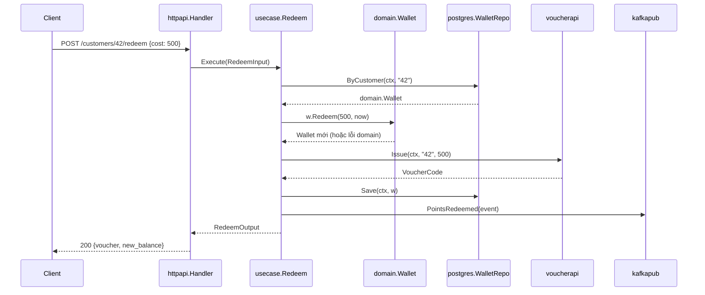

+++
title = "Chương 2.3 — Bốn vòng trong Go: từ Entity đến Framework"
date = "2026-07-08T01:00:00+07:00"
draft = false
tags = ["backend", "golang", "clean-architecture"]
series = ["Clean Architecture với Golang"]
+++

> **Level 2 – Engineering** · Chương này dựng một service hoàn chỉnh, chạy được, minh họa cả bốn vòng.

Bài toán xuyên suốt: **service quản lý ví điểm thưởng (loyalty wallet)** — nghiệp vụ đủ thật để có rule, đủ nhỏ để đọc hết:

- Khách tích điểm khi mua hàng (1 điểm / 10.000 VND, hạng GOLD nhân đôi).
- Đổi điểm lấy voucher; không cho âm điểm; mỗi ngày đổi tối đa 3 lần.

---

## 1. Vòng 1 — Entities (Enterprise Business Rules)

### Bản chất

Entity chứa **quy tắc đúng bất kể ứng dụng nào dùng nó** — quy tắc sẽ tồn tại kể cả khi công ty vận hành bằng giấy bút: "điểm không âm", "GOLD nhân đôi". Nó không biết use case nào gọi nó, không biết dữ liệu từ đâu đến.

Trong Go, entity là struct + method + hàm thuần, **giữ bất biến (invariant) của chính nó**. Đây là chỗ phân biệt domain model thật với "anemic model" (struct trần chỉ có field — mọi rule bị hút ra service, xem anti-pattern chương 9).

```go
// internal/loyalty/domain/wallet.go
package domain

import (
	"errors"
	"fmt"
	"time"
)

type Tier string

const (
	TierStandard Tier = "STANDARD"
	TierGold     Tier = "GOLD"
)

type Points int64

var (
	ErrInsufficientPoints = errors.New("loyalty: insufficient points")
	ErrRedeemLimitReached = errors.New("loyalty: daily redeem limit reached")
	ErrInvalidAmount      = errors.New("loyalty: invalid amount")
	ErrWalletNotFound     = errors.New("loyalty: wallet not found")
)

// Wallet là Entity: dữ liệu + rule bảo vệ bất biến của chính nó.
// Field unexported → bên ngoài KHÔNG THỂ tạo Wallet ở trạng thái sai.
type Wallet struct {
	customerID   string
	tier         Tier
	balance      Points
	redeemsToday int
	lastRedeemAt time.Time
}

// RehydrateWallet dùng cho tầng persistence dựng lại entity từ DB.
// Tách khỏi constructor nghiệp vụ để phân biệt "tạo mới" và "khôi phục".
func RehydrateWallet(customerID string, tier Tier, balance Points,
	redeemsToday int, lastRedeemAt time.Time) Wallet {
	return Wallet{customerID, tier, balance, redeemsToday, lastRedeemAt}
}

func NewWallet(customerID string, tier Tier) Wallet {
	return Wallet{customerID: customerID, tier: tier}
}

func (w Wallet) CustomerID() string { return w.customerID }
func (w Wallet) Balance() Points    { return w.balance }
func (w Wallet) Tier() Tier         { return w.tier }
func (w Wallet) RedeemsToday() int  { return w.redeemsToday }
func (w Wallet) LastRedeemAt() time.Time { return w.lastRedeemAt }

// EarnFromPurchase — Enterprise Rule: cách quy đổi tiền → điểm.
// Method nhận value receiver và trả Wallet mới: entity immutable,
// loại bỏ cả một lớp bug về shared mutable state.
func (w Wallet) EarnFromPurchase(amountVND int64) (Wallet, Points, error) {
	if amountVND <= 0 {
		return w, 0, fmt.Errorf("%w: %d", ErrInvalidAmount, amountVND)
	}
	earned := Points(amountVND / 10_000)
	if w.tier == TierGold {
		earned *= 2
	}
	w.balance += earned
	return w, earned, nil
}

const maxRedeemsPerDay = 3

// Redeem — Enterprise Rules: không âm điểm, tối đa 3 lần/ngày.
func (w Wallet) Redeem(cost Points, now time.Time) (Wallet, error) {
	if cost <= 0 {
		return w, fmt.Errorf("%w: cost %d", ErrInvalidAmount, cost)
	}
	if !sameDay(w.lastRedeemAt, now) {
		w.redeemsToday = 0
	}
	if w.redeemsToday >= maxRedeemsPerDay {
		return w, ErrRedeemLimitReached
	}
	if w.balance < cost {
		return w, fmt.Errorf("%w: have %d, need %d", ErrInsufficientPoints, w.balance, cost)
	}
	w.balance -= cost
	w.redeemsToday++
	w.lastRedeemAt = now
	return w, nil
}

func sameDay(a, b time.Time) bool {
	ay, am, ad := a.Date()
	by, bm, bd := b.Date()
	return ay == by && am == bm && ad == bd
}
```

Chú ý các quyết định thiết kế và lý do:

- **Field unexported + constructor**: bất biến được bảo vệ tại cửa. Không code nào ngoài package tạo được ví âm điểm. Trade-off: cần `Rehydrate` cho persistence — chấp nhận, vì nó biến "trạng thái sai" từ bug runtime thành điều không thể biểu diễn.
- **Immutable (value receiver, trả bản mới)**: dễ suy luận, an toàn concurrent. Trade-off: copy struct — không đáng kể với struct nhỏ; với aggregate lớn cân nhắc pointer receiver + kỷ luật.
- **`now` là tham số**, không gọi `time.Now()` trong entity: rule "3 lần/ngày" test được với thời gian bất kỳ. Entity thuần = deterministic.
- **Sentinel errors** thuộc domain, là một phần của ngôn ngữ nghiệp vụ.

## 2. Vòng 2 — Use Cases (Application Business Rules)

### Bản chất

Use case là **quy trình đặc thù của ứng dụng**: điều phối entity, quyết định thứ tự, gọi cổng ra ngoài. Rule "GOLD nhân đôi" là enterprise (sống mãi với doanh nghiệp); rule "sau khi đổi điểm thì phát event cho hệ thống voucher" là application (chỉ tồn tại vì hệ thống này thiết kế như vậy). Phân biệt này quyết định code đặt ở đâu khi cả hai đều là "business logic".

```go
// internal/loyalty/usecase/redeem.go
package usecase

import (
	"context"
	"fmt"
	"time"

	"myapp/internal/loyalty/domain"
)

// ==== Ports: nhu cầu của use case, use case sở hữu ====

type WalletRepo interface {
	// ByCustomer trả domain.ErrWalletNotFound nếu không có (contract!)
	ByCustomer(ctx context.Context, customerID string) (domain.Wallet, error)
	Save(ctx context.Context, w domain.Wallet) error
}

type VoucherIssuer interface {
	Issue(ctx context.Context, customerID string, cost domain.Points) (VoucherCode, error)
}

type EventPublisher interface {
	PointsRedeemed(ctx context.Context, e PointsRedeemedEvent) error
}

type VoucherCode string

type PointsRedeemedEvent struct {
	CustomerID string
	Cost       domain.Points
	Voucher    VoucherCode
	At         time.Time
}

// ==== Input/Output: kiểu đơn giản do use case định nghĩa ====

type RedeemInput struct {
	CustomerID string
	Cost       domain.Points
}

type RedeemOutput struct {
	Voucher    VoucherCode
	NewBalance domain.Points
}

// ==== Use case ====

type Redeem struct {
	wallets  WalletRepo
	vouchers VoucherIssuer
	events   EventPublisher
	now      func() time.Time
}

func NewRedeem(w WalletRepo, v VoucherIssuer, e EventPublisher, now func() time.Time) *Redeem {
	return &Redeem{wallets: w, vouchers: v, events: e, now: now}
}

func (uc *Redeem) Execute(ctx context.Context, in RedeemInput) (RedeemOutput, error) {
	w, err := uc.wallets.ByCustomer(ctx, in.CustomerID)
	if err != nil {
		return RedeemOutput{}, fmt.Errorf("load wallet: %w", err)
	}

	// Enterprise rules chạy trong entity — use case KHÔNG tự kiểm tra balance.
	w, err = w.Redeem(in.Cost, uc.now())
	if err != nil {
		return RedeemOutput{}, err // lỗi domain trả nguyên vẹn cho adapter dịch
	}

	// Application rules: thứ tự nghiệp vụ của HỆ THỐNG NÀY.
	code, err := uc.vouchers.Issue(ctx, in.CustomerID, in.Cost)
	if err != nil {
		return RedeemOutput{}, fmt.Errorf("issue voucher: %w", err)
	}
	if err := uc.wallets.Save(ctx, w); err != nil {
		return RedeemOutput{}, fmt.Errorf("save wallet: %w", err)
	}
	// Event lỗi không fail nghiệp vụ — quyết định thiết kế đọc thấy được.
	_ = uc.events.PointsRedeemed(ctx, PointsRedeemedEvent{
		CustomerID: in.CustomerID, Cost: in.Cost, Voucher: code, At: uc.now(),
	})

	return RedeemOutput{Voucher: code, NewBalance: w.Balance()}, nil
}
```

Ranh giới trách nhiệm rõ ràng: **entity giữ rule bất biến, use case giữ quy trình**. Nếu use case bắt đầu `if w.Balance() < cost` — nó đang cướp việc của entity, và rule sẽ dần vương vãi ra mọi use case chạm ví.

## 3. Vòng 3 — Interface Adapters

### Bản chất

Adapter là **người phiên dịch hai chiều**: dịch thế giới ngoài (HTTP, SQL, Kafka) sang ngôn ngữ trong (kiểu domain, input/output của use case) và ngược lại. Không chứa business rule — bài kiểm tra: xóa mọi adapter, nghiệp vụ vẫn nguyên vẹn và test được.

**Controller (HTTP → use case):**

```go
// internal/loyalty/adapter/httpapi/handler.go
package httpapi

import (
	"encoding/json"
	"errors"
	"net/http"

	"myapp/internal/loyalty/domain"
	"myapp/internal/loyalty/usecase"
)

type Handler struct{ redeem *usecase.Redeem }

func NewHandler(r *usecase.Redeem) *Handler { return &Handler{redeem: r} }

// DTO của TẦNG HTTP — cách API nói chuyện, tách khỏi cách domain nghĩ.
type redeemRequest struct {
	Cost int64 `json:"cost"`
}
type redeemResponse struct {
	Voucher    string `json:"voucher"`
	NewBalance int64  `json:"new_balance"`
}

func (h *Handler) Redeem(w http.ResponseWriter, r *http.Request) {
	customerID := r.PathValue("customerID") // Go 1.22 routing
	var req redeemRequest
	if err := json.NewDecoder(r.Body).Decode(&req); err != nil {
		writeErr(w, http.StatusBadRequest, "invalid json")
		return
	}

	out, err := h.redeem.Execute(r.Context(), usecase.RedeemInput{
		CustomerID: customerID,
		Cost:       domain.Points(req.Cost),
	})

	// Dịch lỗi domain → mã HTTP: trách nhiệm CỦA ADAPTER, không của domain.
	switch {
	case errors.Is(err, domain.ErrInsufficientPoints),
		errors.Is(err, domain.ErrInvalidAmount):
		writeErr(w, http.StatusUnprocessableEntity, err.Error())
	case errors.Is(err, domain.ErrRedeemLimitReached):
		writeErr(w, http.StatusTooManyRequests, err.Error())
	case errors.Is(err, domain.ErrWalletNotFound):
		writeErr(w, http.StatusNotFound, "wallet not found")
	case err != nil:
		writeErr(w, http.StatusInternalServerError, "internal error")
	default:
		json.NewEncoder(w).Encode(redeemResponse{
			Voucher: string(out.Voucher), NewBalance: int64(out.NewBalance),
		})
	}
}

func writeErr(w http.ResponseWriter, code int, msg string) {
	w.WriteHeader(code)
	json.NewEncoder(w).Encode(map[string]string{"error": msg})
}
```

**Gateway/Repository (use case → SQL):**

```go
// internal/loyalty/adapter/postgres/wallet_repo.go
package postgres

import (
	"context"
	"database/sql"
	"errors"
	"fmt"
	"time"

	"myapp/internal/loyalty/domain"
)

type WalletRepo struct{ db *sql.DB }

func NewWalletRepo(db *sql.DB) *WalletRepo { return &WalletRepo{db} }

// walletRow — DTO của TẦNG DB: ánh xạ schema, không phải domain model.
type walletRow struct {
	CustomerID   string
	Tier         string
	Balance      int64
	RedeemsToday int
	LastRedeemAt time.Time
}

func (r *WalletRepo) ByCustomer(ctx context.Context, id string) (domain.Wallet, error) {
	var row walletRow
	err := r.db.QueryRowContext(ctx,
		`SELECT customer_id, tier, balance, redeems_today, last_redeem_at
		 FROM wallets WHERE customer_id = $1`, id).
		Scan(&row.CustomerID, &row.Tier, &row.Balance, &row.RedeemsToday, &row.LastRedeemAt)
	if errors.Is(err, sql.ErrNoRows) {
		return domain.Wallet{}, domain.ErrWalletNotFound // dịch lỗi tại ranh giới
	}
	if err != nil {
		return domain.Wallet{}, fmt.Errorf("query wallet %s: %w", id, err)
	}
	return domain.RehydrateWallet(row.CustomerID, domain.Tier(row.Tier),
		domain.Points(row.Balance), row.RedeemsToday, row.LastRedeemAt), nil
}

func (r *WalletRepo) Save(ctx context.Context, w domain.Wallet) error {
	_, err := r.db.ExecContext(ctx,
		`INSERT INTO wallets (customer_id, tier, balance, redeems_today, last_redeem_at)
		 VALUES ($1,$2,$3,$4,$5)
		 ON CONFLICT (customer_id) DO UPDATE
		 SET balance=$3, redeems_today=$4, last_redeem_at=$5`,
		w.CustomerID(), string(w.Tier()), int64(w.Balance()), w.RedeemsToday(), w.LastRedeemAt())
	if err != nil {
		return fmt.Errorf("save wallet %s: %w", w.CustomerID(), err)
	}
	return nil
}

var _ interface {
	ByCustomer(context.Context, string) (domain.Wallet, error)
	Save(context.Context, domain.Wallet) error
} = (*WalletRepo)(nil)
```

## 4. Vòng 4 — Frameworks & Drivers + Composition Root

Vòng ngoài cùng gồm những thứ bạn **không viết**: net/http server, driver `lib/pq`, Kafka client. Code của bạn ở vòng này chỉ là **keo dán** — mỏng nhất có thể, tập trung tại `cmd/`:

```go
// cmd/loyalty/main.go
package main

import (
	"context"
	"database/sql"
	"log/slog"
	"net/http"
	"os"
	"os/signal"
	"syscall"
	"time"

	_ "github.com/lib/pq"

	"myapp/internal/loyalty/adapter/httpapi"
	"myapp/internal/loyalty/adapter/postgres"
	"myapp/internal/loyalty/adapter/voucherapi"
	"myapp/internal/loyalty/adapter/kafkapub"
	"myapp/internal/loyalty/usecase"
)

func main() {
	logger := slog.New(slog.NewJSONHandler(os.Stdout, nil))

	db, err := sql.Open("postgres", os.Getenv("DATABASE_URL"))
	if err != nil { logger.Error("open db", "err", err); os.Exit(1) }
	defer db.Close()

	// Lắp ráp: nơi DUY NHẤT mọi vòng gặp nhau
	redeem := usecase.NewRedeem(
		postgres.NewWalletRepo(db),
		voucherapi.NewClient(os.Getenv("VOUCHER_API_URL")),
		kafkapub.NewPublisher(os.Getenv("KAFKA_BROKERS")),
		time.Now,
	)
	h := httpapi.NewHandler(redeem)

	mux := http.NewServeMux()
	mux.HandleFunc("POST /customers/{customerID}/redeem", h.Redeem)

	srv := &http.Server{Addr: ":8080", Handler: mux}

	// Graceful shutdown — concern của vòng 4, nghiệp vụ không biết gì
	ctx, stop := signal.NotifyContext(context.Background(), syscall.SIGINT, syscall.SIGTERM)
	defer stop()
	go func() {
		if err := srv.ListenAndServe(); err != http.ErrServerClosed {
			logger.Error("server", "err", err)
		}
	}()
	<-ctx.Done()
	shutdownCtx, cancel := context.WithTimeout(context.Background(), 10*time.Second)
	defer cancel()
	srv.Shutdown(shutdownCtx)
}
```

## 5. Cấu trúc thư mục và sơ đồ tổng hợp

```
myapp/
├── go.mod
├── cmd/
│   └── loyalty/main.go              # Vòng 4: wiring, server, shutdown
└── internal/loyalty/
    ├── domain/                      # Vòng 1: chỉ stdlib
    │   ├── wallet.go
    │   └── wallet_test.go
    ├── usecase/                     # Vòng 2: import domain
    │   ├── redeem.go                #   ports + input/output + quy trình
    │   └── redeem_test.go
    └── adapter/                     # Vòng 3: import usecase + domain
        ├── httpapi/handler.go       #   controller
        ├── postgres/wallet_repo.go  #   gateway
        ├── voucherapi/client.go     #   external API adapter
        └── kafkapub/publisher.go    #   event publisher
```

```
Luồng request (control flow):
Client ──▶ httpapi.Handler ──▶ usecase.Redeem ──▶ domain.Wallet.Redeem()
                                    │──▶ voucherapi.Client ──▶ Voucher API
                                    │──▶ postgres.WalletRepo ──▶ Postgres
                                    └──▶ kafkapub.Publisher ──▶ Kafka

Luồng phụ thuộc (source dep) — tất cả trỏ vào trong:
httpapi ─┐
postgres ─┤
voucherapi├──▶ usecase ──▶ domain
kafkapub ─┘        ▲
     cmd/loyalty ──┴── (import tất cả để lắp ráp)
```

Sequence diagram (Mermaid):



## 6. Unit test hai vòng trong

```go
// internal/loyalty/domain/wallet_test.go — test enterprise rules
func TestWallet_Redeem_GioiHan3LanMotNgay(t *testing.T) {
	w := domain.RehydrateWallet("c1", domain.TierStandard, 1000, 0, time.Time{})
	now := time.Date(2026, 7, 8, 9, 0, 0, 0, time.UTC)

	var err error
	for i := 0; i < 3; i++ {
		w, err = w.Redeem(10, now)
		if err != nil { t.Fatalf("lan %d: %v", i+1, err) }
	}
	if _, err = w.Redeem(10, now); !errors.Is(err, domain.ErrRedeemLimitReached) {
		t.Fatalf("lan 4 phai bi chan, got %v", err)
	}
	// Sang ngay moi: reset
	if _, err = w.Redeem(10, now.Add(24*time.Hour)); err != nil {
		t.Fatalf("ngay moi phai duoc doi tiep: %v", err)
	}
}
```

Use case test với fake (pattern như chương 1.3 mục 5) — xác nhận quy trình: voucher lỗi → không save ví; save lỗi → trả lỗi; event lỗi → vẫn thành công. **Các quyết định orchestration giờ là code test được**, không phải tri thức truyền miệng.

## 7. Trade-off và biến thể thực dụng

- **Gộp domain + usecase**: với module nhỏ, một package `loyalty` chứa cả entity lẫn service (như ví dụ chương 1.3) là đủ — 2 vòng trong chung một package vẫn thỏa Dependency Rule. Tách 4 tầng đầy đủ khi module lớn hoặc nhiều use case chia sẻ domain.
- **Voucher lỗi sau khi Redeem?** Ví dụ trên gọi voucher trước, save sau — nếu save fail, voucher đã phát: bài toán consistency thật. Các lời giải (transactional outbox, saga) ở chương 7 và 11; điểm cần thấy ở đây: kiến trúc làm cho **câu hỏi này lộ ra ở một chỗ đọc được** thay vì chôn trong handler 300 dòng.
- **Không copy cấu trúc này cho mọi service**: đây là mức "đầy đủ nghi thức". Chương 3 trình bày phổ các mức từ tối giản đến đầy đủ và tiêu chí chọn.

## Tóm tắt

- Entity giữ rule bất biến của doanh nghiệp; use case giữ quy trình của ứng dụng; adapter phiên dịch; vòng 4 là keo dán mỏng.
- Câu hỏi xếp tầng: "code này có còn đúng nếu đổi giao thức/DB?" (→ vòng trong) và "rule này có sống sót nếu bỏ ứng dụng này?" (→ entity thay vì use case).
- Số tầng là công cụ, không phải nghi lễ — Dependency Rule mới là luật.

**Tiếp theo:** [Level 3 — Tổ chức project Go thực tế](/series/clean-architect/03-go-project-structure/01-package-organization/)
