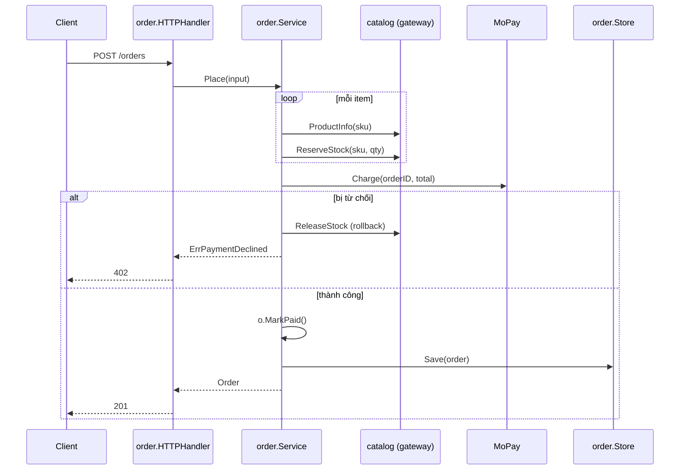

+++
title = "Chương 12.1 — E-commerce từng bước · Giai đoạn 1: Monolith khởi đầu đúng cách"
date = "2026-07-08T11:00:00+07:00"
draft = false
tags = ["backend", "golang", "clean-architecture"]
series = ["Clean Architecture với Golang"]
+++

> **Ví dụ tổng hợp** · Ba giai đoạn của cùng một hệ thống: (1) monolith gọn, (2) modular monolith khi nghiệp vụ dày lên, (3) tách service khi tổ chức đòi hỏi. Mỗi giai đoạn là quyết định có bối cảnh — không phải giai đoạn sau "xịn hơn" giai đoạn trước.

---

## Bối cảnh giai đoạn 1

Startup 3 engineer, 3 tháng để ra MVP bán hàng: đăng ký user, danh mục sản phẩm, đặt hàng, thanh toán qua một cổng (giả định "MoPay"). Chưa rõ nghiệp vụ sẽ phát triển hướng nào.

**Quyết định kiến trúc và lý do:**

- **Một binary, một database** — 3 người không có ngân sách vận hành cho nhiều service; độ trễ giao tiếp trong process = 0; refactor ranh giới còn rẻ.
- **Feature-based package ngay từ đầu** (`user`, `catalog`, `order`) — chi phí gần như 0 so với flat, mua sẵn đường tiến hóa (chương 3). Nhưng **không** dựng đủ 4 tầng mỗi module: mỗi package một file domain+service, một file store, một file http. Nghi thức tối thiểu.
- **Riêng `order` được đầu tư domain model thật** — vì đây là nơi rule tập trung (tồn kho, giá, trạng thái). `user` và `catalog` gần như CRUD → transaction script thẳng, *có chủ đích và ghi lại quyết định đó*.
- Interface chỉ mở ở 2 chỗ có lý do thật: cổng thanh toán (chắc chắn thêm cổng mới + cần fake để test) và kho lưu order (cần fake test rule).

Đây là bài học quan trọng nhất giai đoạn 1: **áp dụng Clean Architecture có chọn lọc theo mật độ rule, không phủ đều.**

## Cấu trúc thư mục

```
shop/
├── go.mod
├── cmd/shop/main.go              # composition root duy nhất
└── internal/
    ├── platform/
    │   ├── config/config.go
    │   └── httpserver/middleware.go
    ├── user/                     # CRUD có chủ đích — không nghi thức
    │   ├── user.go               # struct + validate + service
    │   ├── store.go              # SQL thẳng
    │   └── http.go
    ├── catalog/                  # CRUD có chủ đích
    │   ├── product.go
    │   ├── store.go
    │   └── http.go
    └── order/                    # NƠI CÓ RULE — domain model thật
        ├── order.go              # entity + trạng thái + rule
        ├── service.go            # use case + ports
        ├── service_test.go
        ├── store.go              # Postgres adapter
        ├── mopay.go              # payment adapter
        └── http.go
```

## Code phần lõi — module order

```go
// internal/order/order.go — entity và rule
package order

import (
	"errors"
	"time"
)

type Status string

const (
	StatusPending  Status = "PENDING"   // đã tạo, chờ thanh toán
	StatusPaid     Status = "PAID"
	StatusCanceled Status = "CANCELED"
)

var (
	ErrEmptyOrder     = errors.New("order: empty order")
	ErrNotFound       = errors.New("order: not found")
	ErrInvalidTransition = errors.New("order: invalid status transition")
	ErrOutOfStock     = errors.New("order: out of stock")
	ErrPaymentDeclined = errors.New("order: payment declined")
)

type Order struct {
	ID         string
	CustomerID string
	Lines      []Line
	TotalVND   int64
	Status     Status
	CreatedAt  time.Time
}

type Line struct {
	SKU      string
	Name     string // snapshot tên tại thời điểm đặt — giá và tên không đổi theo catalog
	Qty      int
	PriceVND int64  // snapshot giá
}

// MarkPaid — state machine tường minh, chặn chuyển trạng thái sai
func (o *Order) MarkPaid() error {
	if o.Status != StatusPending {
		return ErrInvalidTransition
	}
	o.Status = StatusPaid
	return nil
}

func (o *Order) Cancel() error {
	if o.Status == StatusPaid { // đơn đã trả tiền phải qua luồng refund, không cancel thẳng
		return ErrInvalidTransition
	}
	o.Status = StatusCanceled
	return nil
}
```

```go
// internal/order/service.go — use case + ports
package order

import (
	"context"
	"fmt"
	"time"
)

// ---- Ports ----

type Store interface {
	Save(ctx context.Context, o Order) error
	ByID(ctx context.Context, id string) (Order, error)
}

// CatalogGateway: order cần biết giá & tồn kho. Ở giai đoạn monolith,
// implementation gọi THẲNG package catalog — nhưng qua interface này,
// order không import catalog: ranh giới module giữ sẵn cho tương lai.
type CatalogGateway interface {
	ProductInfo(ctx context.Context, sku string) (ProductInfo, error)
	ReserveStock(ctx context.Context, sku string, qty int) error
	ReleaseStock(ctx context.Context, sku string, qty int) error
}

type ProductInfo struct {
	SKU, Name string
	PriceVND  int64
	InStock   int
}

type PaymentGateway interface {
	// Charge trả ErrPaymentDeclined khi bị từ chối (lỗi nghiệp vụ)
	Charge(ctx context.Context, orderID string, amountVND int64) error
}

// ---- Use case ----

type Service struct {
	store   Store
	catalog CatalogGateway
	payment PaymentGateway
	now     func() time.Time
	newID   func() string
}

func NewService(s Store, c CatalogGateway, p PaymentGateway,
	now func() time.Time, newID func() string) *Service {
	return &Service{s, c, p, now, newID}
}

type PlaceInput struct {
	CustomerID string
	Items      []struct {
		SKU string
		Qty int
	}
}

func (s *Service) Place(ctx context.Context, in PlaceInput) (Order, error) {
	if len(in.Items) == 0 {
		return Order{}, ErrEmptyOrder
	}

	// 1. Dựng line với giá snapshot + giữ chỗ tồn kho
	o := Order{ID: s.newID(), CustomerID: in.CustomerID,
		Status: StatusPending, CreatedAt: s.now()}
	reserved := make([]Line, 0, len(in.Items))
	for _, it := range in.Items {
		p, err := s.catalog.ProductInfo(ctx, it.SKU)
		if err != nil {
			s.rollbackReserved(ctx, reserved)
			return Order{}, fmt.Errorf("product %s: %w", it.SKU, err)
		}
		if err := s.catalog.ReserveStock(ctx, it.SKU, it.Qty); err != nil {
			s.rollbackReserved(ctx, reserved)
			return Order{}, fmt.Errorf("%w: %s", ErrOutOfStock, it.SKU)
		}
		line := Line{SKU: p.SKU, Name: p.Name, Qty: it.Qty, PriceVND: p.PriceVND}
		reserved = append(reserved, line)
		o.Lines = append(o.Lines, line)
		o.TotalVND += p.PriceVND * int64(it.Qty)
	}

	// 2. Thanh toán
	if err := s.payment.Charge(ctx, o.ID, o.TotalVND); err != nil {
		s.rollbackReserved(ctx, reserved)
		return Order{}, err // ErrPaymentDeclined hoặc transient — handler dịch
	}
	if err := o.MarkPaid(); err != nil {
		return Order{}, err
	}

	// 3. Lưu
	if err := s.store.Save(ctx, o); err != nil {
		// Tiền ĐÃ TRỪ mà đơn không lưu được — trường hợp phải bù thủ công.
		// Giai đoạn 1 chấp nhận + alert; giai đoạn 3 giải bằng saga/outbox.
		return Order{}, fmt.Errorf("CRITICAL save after charge: %w", err)
	}
	return o, nil
}

func (s *Service) rollbackReserved(ctx context.Context, lines []Line) {
	for _, l := range lines {
		_ = s.catalog.ReleaseStock(ctx, l.SKU, l.Qty) // best-effort, log ở impl
	}
}
```

Chú ý cách xử lý điểm yếu consistency được **ghi thành comment to rõ** thay vì giấu — kiến trúc trung thực với giới hạn của chính nó, và đánh dấu sẵn nơi giai đoạn sau phải giải.

```go
// internal/order/mopay.go — payment adapter
package order

// (Giai đoạn 1 đặt adapter cùng package cho gọn; giai đoạn 2 sẽ tách.
//  Interface + kiểu domain vẫn tách bạch nên việc di chuyển là cắt-dán.)

type MoPayGateway struct {
	baseURL string
	apiKey  string
	client  *http.Client
}

func (g *MoPayGateway) Charge(ctx context.Context, orderID string, amountVND int64) error {
	body, _ := json.Marshal(map[string]any{
		"reference": orderID, // reference = orderID → MoPay dedupe giúp ta idempotency
		"amount":    amountVND,
	})
	req, _ := http.NewRequestWithContext(ctx, "POST", g.baseURL+"/charge", bytes.NewReader(body))
	req.Header.Set("Authorization", "Bearer "+g.apiKey)
	resp, err := g.client.Do(req)
	if err != nil {
		return fmt.Errorf("mopay call: %w", err)
	}
	defer resp.Body.Close()
	if resp.StatusCode == http.StatusPaymentRequired {
		return ErrPaymentDeclined
	}
	if resp.StatusCode != http.StatusOK {
		return fmt.Errorf("mopay status %d", resp.StatusCode)
	}
	return nil
}
```

```go
// internal/order/http.go — delivery
func (h *HTTPHandler) Place(w http.ResponseWriter, r *http.Request) {
	var req placeOrderRequest
	if err := json.NewDecoder(r.Body).Decode(&req); err != nil {
		writeJSONErr(w, http.StatusBadRequest, "invalid json"); return
	}
	o, err := h.svc.Place(r.Context(), req.toInput(userIDFrom(r.Context())))
	switch {
	case errors.Is(err, order.ErrEmptyOrder):
		writeJSONErr(w, http.StatusBadRequest, err.Error())
	case errors.Is(err, order.ErrOutOfStock):
		writeJSONErr(w, http.StatusConflict, err.Error())
	case errors.Is(err, order.ErrPaymentDeclined):
		writeJSONErr(w, http.StatusPaymentRequired, err.Error())
	case err != nil:
		writeJSONErr(w, http.StatusInternalServerError, "internal error")
	default:
		w.WriteHeader(http.StatusCreated)
		json.NewEncoder(w).Encode(toOrderResponse(o))
	}
}
```

```go
// cmd/shop/main.go — toàn hệ thống trong một trang
func main() {
	cfg := config.MustLoad()
	db := mustOpen(cfg.DatabaseURL)
	defer db.Close()

	userSvc := user.NewService(user.NewStore(db))
	catalogSvc := catalog.NewService(catalog.NewStore(db))

	orderSvc := order.NewService(
		order.NewStore(db),
		catalog.NewOrderGateway(catalogSvc), // catalog implement order.CatalogGateway
		order.NewMoPay(cfg.MoPayURL, cfg.MoPayKey),
		time.Now, uuid.NewString,
	)

	mux := http.NewServeMux()
	user.Mount(mux, userSvc)
	catalog.Mount(mux, catalogSvc)
	order.Mount(mux, orderSvc)

	runWithGracefulShutdown(cfg, httpserver.Wrap(mux /* log, recover, auth */))
}
```

Một chi tiết đáng chú ý: `catalog.NewOrderGateway(catalogSvc)` — package **catalog** cung cấp adapter thỏa mãn interface của **order** (catalog import order, không ngược lại). Quan hệ giữa hai module nghiệp vụ cũng tuân thủ nguyên tắc consumer-side interface.

## Sequence diagram luồng đặt hàng



## Điều giai đoạn 1 làm đúng — và các vết nứt sẽ lớn dần

**Đúng:** ranh giới module theo nghiệp vụ có compiler bảo vệ; rule đơn hàng có domain model + unit test; hai cổng bên ngoài (payment, catalog) sau interface — đủ để test toàn bộ luồng Place bằng fake; nghi thức tỉ lệ với mật độ rule; toàn hệ thống một người đọc hiểu trong một buổi sáng.

**Vết nứt chấp nhận có chủ đích (theo dõi, chưa sửa):**

1. Charge-rồi-mất-đơn (đã đánh dấu CRITICAL) — cần outbox/saga khi doanh số tăng.
2. `ReserveStock` gọi qua service không chung transaction với Save — hết hàng ảo khi tải cao.
3. `order` biết khái niệm giá của `catalog` — khi có khuyến mãi phức tạp, cần module `pricing` riêng.
4. Chưa có event — module mới (email, loyalty) sẽ phải chen vào `Place()`.

Giai đoạn 2 xử lý các vết nứt này **khi và chỉ khi** chúng gây đau thật.

**Tiếp theo:** [Giai đoạn 2 — Modular Monolith](/series/clean-architect/12-vi-du-ecommerce/02-giai-doan-2-modular-monolith/)
