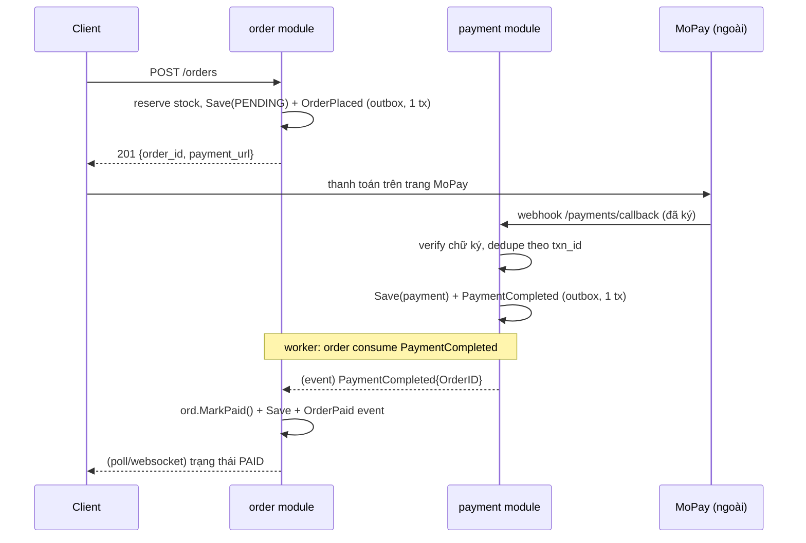

+++
title = "Chương 12.2 — E-commerce · Giai đoạn 2: Modular Monolith"
date = "2026-07-08T12:00:00+07:00"
draft = false
tags = ["backend", "golang", "clean-architecture"]
series = ["Clean Architecture với Golang"]
+++

> 18 tháng sau: 12 engineer chia 3 team, 50 nghìn đơn/ngày. Các vết nứt giai đoạn 1 giờ đau thật. Câu trả lời KHÔNG phải microservices — mà là siết ranh giới trong chính monolith.

---

## Bối cảnh và triệu chứng

- Team Payment muốn thêm VNPay + trả góp; mỗi lần sửa đụng `order.Service.Place` — file mà team Order cũng đang sửa hàng ngày. Merge conflict, release phải phối hợp.
- Marketing cần: gửi email sau đặt hàng, cộng điểm loyalty, đồng bộ CRM — ba team khác nhau cùng đòi chen code vào `Place()`. Hàm 40 dòng thành 180 dòng.
- Sự cố "charge rồi mất đơn" xảy ra thật 7 lần trong tháng cao điểm — mỗi lần một buổi điều tra + hoàn tiền thủ công.
- Query dashboard người bán làm chậm cả đường ghi (chung DB, khóa lẫn nhau).

**Chẩn đoán đúng bệnh trước khi kê đơn:** vấn đề là *ranh giới module chưa đủ chặt* và *coupling thời gian trong Place()* — không phải "vì chưa có microservices". Tách process bây giờ sẽ nhân các vấn đề trên với độ trễ mạng và partial failure. Modular monolith: giữ một binary, nâng ranh giới lên chuẩn "như thể sắp tách".

## Kiến trúc mục tiêu

```
shop/
├── cmd/
│   ├── shop/main.go            # binary chính: HTTP + tất cả module
│   └── worker/main.go          # binary phụ: outbox relay + consumers
└── internal/
    ├── platform/               # config, dbconn, httpserver, eventbus, outbox
    ├── user/
    ├── catalog/
    ├── pricing/                # MỚI: tách khỏi catalog khi khuyến mãi phức tạp
    ├── payment/                # MỚI: tách khỏi order — team Payment sở hữu
    │   ├── domain/  usecase/  adapter/{mopay,vnpay,httpapi}/
    ├── order/
    │   ├── domain/             # Order aggregate + domain events
    │   ├── usecase/            # PlaceOrder, CancelOrder + ports
    │   ├── query/              # CQRS mức 1: đọc thẳng SQL
    │   └── adapter/{httpapi,postgres,gateways}/
    ├── loyalty/                # MỚI: consumer của OrderPlaced
    └── notification/           # MỚI: consumer của OrderPlaced, PaymentCompleted
```

Bốn nâng cấp so với giai đoạn 1, mỗi cái trả lời một cơn đau:

### Nâng cấp 1 — Module contract tường minh + `internal/` lồng

Mỗi module public đúng một "cửa": package gốc chứa API cho module khác; ruột giấu vào internal:

```
internal/payment/
├── payment.go                  # PUBLIC: types + interface Facade cho module khác
├── module.go                   # PUBLIC: NewModule(...) — composition của module
└── internal/                   # ruột: module khác KHÔNG THỂ import (compiler chặn)
    ├── domain/ usecase/ adapter/
```

```go
// internal/payment/payment.go — hợp đồng công khai của module
package payment

type Facade interface {
	// Charge idempotent theo orderID.
	Charge(ctx context.Context, req ChargeRequest) (ChargeResult, error)
	Refund(ctx context.Context, orderID string) error
}

type ChargeRequest struct {
	OrderID   string
	Method    Method // MOPAY, VNPAY, INSTALLMENT
	AmountVND int64
}
```

Team Payment giờ đổi ruột thoải mái — thêm VNPay, đổi retry policy, tách bảng — **không PR nào chạm code team khác**. Đây là "microservices về mặt tổ chức, monolith về mặt vận hành".

### Nâng cấp 2 — Domain event + outbox thay cho chen code vào Place()

`Place()` không còn gọi email/loyalty/CRM. Nó phát `OrderPlaced` qua outbox (chương 7); consumer của các module kia tự đăng ký:

```go
// internal/order/usecase/place_order.go (rút gọn phần đã quen)
func (uc *PlaceOrder) Execute(ctx context.Context, in PlaceInput) (out PlaceOutput, err error) {
	// ... dựng order, reserve stock, charge qua payment.Facade ...
	err = uc.tx.WithinTx(ctx, func(ctx context.Context) error {
		if err := uc.orders.Save(ctx, ord); err != nil { return err }
		return uc.events.Publish(ctx, domain.OrderPlaced{ // ghi outbox CÙNG tx
			EventID: uc.newID(), OrderID: ord.ID(), CustomerID: ord.CustomerID(),
			TotalVND: ord.TotalVND(), At: uc.now(),
		})
	})
	return
}
```

```go
// cmd/worker/main.go — relay + consumer đăng ký
relay := outbox.NewRelay(db, bus)               // outbox → bus (in-process hoặc Kafka)
bus.Subscribe("order.placed", loyaltyMod.OnOrderPlaced)       // cộng điểm (idempotent)
bus.Subscribe("order.placed", notificationMod.OnOrderPlaced)  // gửi email
bus.Subscribe("order.placed", crmSync.OnOrderPlaced)
```

Thêm module thứ 4 phản ứng với đơn hàng = thêm một Subscribe — `Place()` bất biến. Đồng thời sự cố "charge rồi mất đơn" biến mất: Save + event nguyên tử; nếu charge thành công mà tx fail, consumer `payment.reconcile` phát hiện charge mồ côi qua webhook đối soát của MoPay và tự refund.

### Nâng cấp 3 — Luồng thanh toán thành 2 pha (state machine + webhook)

Bài học giai đoạn 1: charge đồng bộ trong request đặt hàng vừa chậm vừa tạo cửa sổ bất nhất. Chuyển sang mô hình chuẩn ngành:



Trạng thái đơn giờ là state machine domain thuần với timeout: `PENDING --15 phút không thanh toán--> EXPIRED` (một scheduled job phát `ExpireOrders` command). Mọi chuyển trạng thái đều qua method của aggregate — không UPDATE thẳng.

### Nâng cấp 4 — CQRS mức 1→2 cho dashboard

Dashboard người bán chuyển sang bảng chiếu `seller_stats` do projector cập nhật từ event (chương 10 mục 4) — đường đọc nặng rời khỏi các bảng giao dịch. Order list của khách vẫn CQRS mức 1 (SQL thẳng, chung DB).

## Kiểm soát ranh giới bằng CI

Modular monolith chỉ sống nếu ranh giới được máy móc canh giữ:

```yaml
# .golangci.yml (trích)
depguard:
  rules:
    order-module:
      files: ["**/internal/order/**"]
      deny:
        - pkg: "shop/internal/payment/internal"   # cấm với vào ruột module khác
        - pkg: "shop/internal/loyalty"            # order không được biết loyalty
                                                  # (chiều đúng: loyalty consume event của order)
```

Cộng với quy tắc dữ liệu: **mỗi bảng một module làm chủ**; module khác cần dữ liệu → gọi Facade hoặc consume event, cấm JOIN chéo module (schema tách theo prefix/schema Postgres để dễ audit — và để giai đoạn 3 tách DB không phải gỡ JOIN).

## Trade-off đã chấp nhận

- **Eventual consistency giữa module**: điểm loyalty cộng sau đặt hàng vài giây; email có thể đến trước khi trang kịp refresh. Đổi lấy: module độc lập deploy-logic, `Place()` bất biến, không mất event.
- **Worker binary thứ hai**: có thêm một thứ để vận hành, đổi lấy tách tải và cô lập lỗi consumer khỏi API.
- **Boilerplate module contract**: mỗi module thêm ~2 file public. Với 8 module là chấp nhận được; với 30 module li ti thì đã chia quá nhỏ — hợp nhất lại.
- **Chưa tách service**: nếu ngày mai một module cần scale độc lập gấp 50 lần hoặc cần đội on-call riêng, monolith này đã ở tư thế tách rẻ nhất có thể — đó chính là mục tiêu của giai đoạn 2.

**Tiếp theo:** [Giai đoạn 3 — Tách service khi tổ chức đòi hỏi](/series/clean-architect/12-vi-du-ecommerce/03-giai-doan-3-tach-service/)
