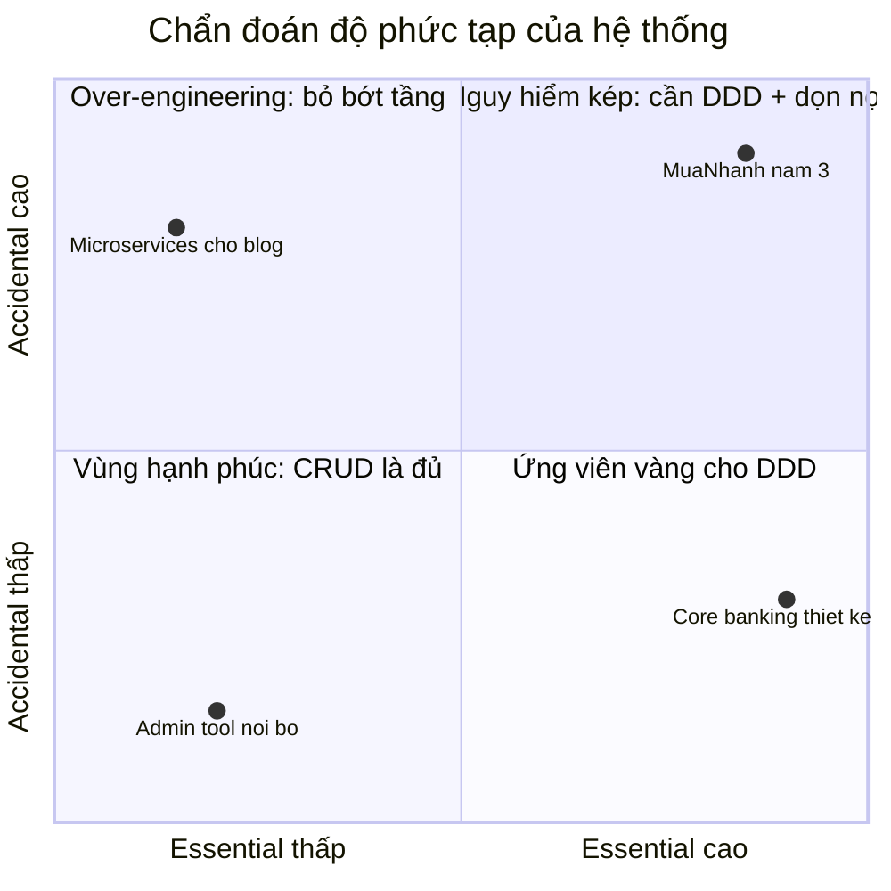
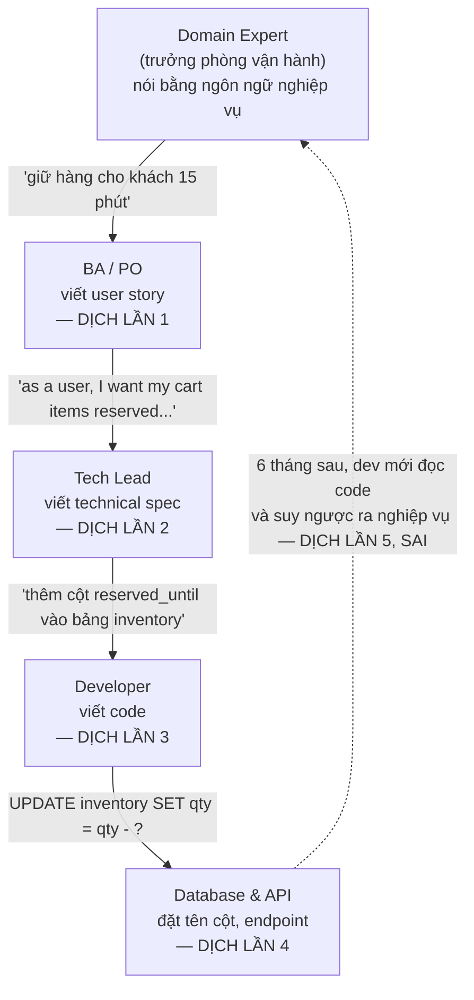
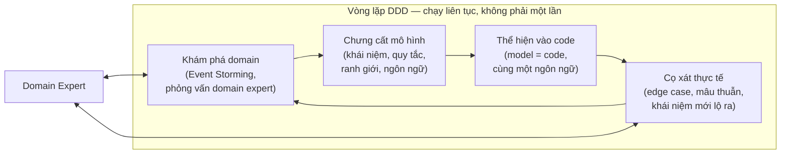

+++
title = "Chương 01 — Tại sao DDD ra đời: Business Complexity là kẻ thù thật sự"
date = "2026-07-09T08:00:00+07:00"
draft = false
tags = ["backend", "ddd", "architecture"]
series = ["Domain-Driven Design"]
+++

> **Vị trí trong bộ tài liệu:** Đây là chương mở đầu của bộ tài liệu Domain-Driven Design (xem [00-muc-luc.md](/series/domain-driven-design/00-muc-luc/)). Trước khi nói về Bounded Context, Aggregate hay Domain Event, chúng ta phải trả lời câu hỏi nền tảng nhất: **DDD sinh ra để giải quyết vấn đề gì, và tại sao những cách làm quen thuộc — database-first, CRUD, transaction script — lại thất bại?** Nếu bạn không đồng ý với chương này, mọi chương sau đều vô nghĩa với bạn. Chương tiếp theo: [02-domain-va-subdomain.md](/series/domain-driven-design/02-domain-va-subdomain/).

---

## 1. Problem Statement: Câu chuyện một hệ thống e-commerce Việt Nam

Tôi muốn bắt đầu không phải bằng định nghĩa, mà bằng một câu chuyện tôi đã chứng kiến lặp lại ít nhất năm lần trong 20 năm làm nghề — chỉ khác tên công ty.

### 1.1. Năm thứ nhất: CRUD và cảm giác chiến thắng

Một startup e-commerce Việt Nam — gọi là **MuaNhanh** — khởi động với đội 4 backend engineer. Bài toán ban đầu nghe rất đơn giản:

- Người dùng xem sản phẩm, thêm vào giỏ, đặt hàng.
- Admin quản lý sản phẩm, tồn kho, đơn hàng.
- Thanh toán COD và chuyển khoản.

Đội quyết định rất nhanh, và quyết định **rất hợp lý tại thời điểm đó**:

1. Thiết kế database trước: `users`, `products`, `orders`, `order_items`, `inventory`.
2. Mỗi bảng một REST resource: `GET/POST/PUT/DELETE /products`, `/orders`...
3. Mỗi resource một service class mỏng gọi thẳng repository/ORM.

Ba tháng sau, hệ thống chạy. Sáu tháng sau, có doanh thu. Đội tự tin: *"Phần mềm chỉ là CRUD thôi, đừng phức tạp hóa."*

Tôi nhấn mạnh: **ở giai đoạn này, họ đúng.** CRUD là lựa chọn tối ưu cho bài toán lúc đó. Sai lầm không nằm ở việc bắt đầu bằng CRUD — sai lầm nằm ở việc **không nhận ra thời điểm bài toán đã đổi bản chất**.

### 1.2. Năm thứ hai: Business rules bắt đầu chồng lên nhau

Công ty lớn lên. Phòng kinh doanh — những người mang tiền về — bắt đầu yêu cầu:

- **Khuyến mãi:** voucher giảm %, giảm tiền mặt, freeship, mua 2 tặng 1, flash sale theo khung giờ, voucher chỉ áp dụng cho khách mới, voucher không cộng dồn với flash sale *trừ khi* là khách VIP.
- **Tồn kho:** hàng đặt trước (pre-order), giữ hàng 15 phút khi vào checkout, kho ảo cho flash sale (chỉ bán tối đa 100 đơn vị dù kho thật còn 500), hàng bán qua livestream trừ kho riêng.
- **Đơn hàng:** hủy một phần, đổi sản phẩm sau khi đặt, tách đơn khi một phần hàng ở kho miền Nam, gộp đơn để đủ điều kiện freeship.
- **Hoàn tiền:** hoàn về ví nội bộ hay về thẻ? Nếu đơn dùng voucher thì hoàn bao nhiêu? Voucher có được trả lại không? Nếu voucher đã hết hạn *sau khi* đặt đơn thì sao? Nếu khách hoàn 1 trong 3 sản phẩm của đơn "mua 2 tặng 1" thì món quà tặng xử lý thế nào?

Hãy dừng lại ở câu hỏi cuối cùng. **"Hoàn 1 sản phẩm trong đơn mua 2 tặng 1"** — câu hỏi này không có câu trả lời kỹ thuật. Nó là một **quyết định nghiệp vụ** mà chính phòng kinh doanh cũng phải họp ba buổi mới chốt được. Nhưng trong codebase của MuaNhanh, logic này nằm ở đâu?

Câu trả lời: **ở khắp nơi và không ở đâu cả.**

```typescript
// order.service.ts — năm thứ hai của MuaNhanh (rút gọn từ file thật dài 2.400 dòng)
async refund(orderId: string, itemIds: string[], dto: RefundDto) {
  const order = await this.orderRepo.findOne({ where: { id: orderId }, relations: ['items', 'promotions'] });
  if (!order) throw new NotFoundException();

  // Fix bug #1245: đơn flash sale không được hoàn về thẻ
  if (order.isFlashSale && dto.method === 'CARD') {
    dto.method = 'WALLET';
  }

  let refundAmount = 0;
  for (const item of order.items.filter(i => itemIds.includes(i.id))) {
    refundAmount += item.price * item.quantity;
    // Fix bug #1391: trừ tiền voucher theo tỉ lệ
    if (order.voucherDiscount > 0) {
      refundAmount -= (item.price / order.subtotal) * order.voucherDiscount;
    }
    // TODO(khanh): xử lý case mua 2 tặng 1 — tạm thời chặn hoàn
    if (order.promotions.some(p => p.type === 'BUY2GET1')) {
      throw new BadRequestException('Đơn khuyến mãi không hỗ trợ hoàn một phần');
    }
  }

  // Fix bug #1502: cộng lại tồn kho, NHƯNG không cộng cho kho ảo flash sale
  if (!order.isFlashSale) {
    await this.inventoryService.increase(itemIds);
  }

  await this.paymentService.refund(order.userId, refundAmount, dto.method);
  order.status = 'PARTIALLY_REFUNDED';
  await this.orderRepo.save(order);
}
```

Đoạn code trên có mọi triệu chứng của căn bệnh:

- **Business rule trốn trong `if` fix bug.** Quy tắc "flash sale hoàn về ví" — một quyết định của CFO — được ghi lại dưới dạng comment `Fix bug #1245`. Sáu tháng sau, không ai dám xóa dòng đó vì không ai nhớ *tại sao* nó tồn tại.
- **Quy tắc bị chặn thay vì được mô hình hóa.** `TODO(khanh)` chặn hoàn tiền cho đơn mua 2 tặng 1 — nghĩa là hệ thống **không thể diễn đạt** một tình huống nghiệp vụ có thật. CSKH phải xử lý tay qua… Google Sheets.
- **Kiến thức nằm trong đầu người, không nằm trong code.** Khi Khánh nghỉ việc, quy tắc hoàn tiền theo tỉ lệ voucher trở thành khảo cổ học.

### 1.3. Năm thứ ba: Sụp đổ

Đến năm thứ ba, các con số nói thay:

| Chỉ số | Năm 1 | Năm 3 |
|---|---|---|
| Thời gian thêm 1 loại khuyến mãi mới | 2 ngày | 3–6 tuần |
| Tỉ lệ release gây bug ở module *khác* module được sửa | ~0% | ~40% |
| Số dòng của `order.service.ts` | 300 | 2.400 |
| Số người hiểu toàn bộ luồng hoàn tiền | 4/4 | 0/12 |
| Câu trả lời cho "hệ thống đang cho phép cộng dồn voucher nào với nhau?" | đọc code 5 phút | **không ai trả lời được** |

Dòng cuối cùng của bảng là nghiêm trọng nhất. Hệ thống đã trở thành **nguồn sự thật duy nhất về nghiệp vụ mà không ai đọc hiểu được nữa**. Phòng kinh doanh muốn biết chính sách hiện hành phải… đặt đơn thử. Kỹ sư muốn sửa phải chạy debugger qua 14 tầng gọi hàm. Mỗi chiến dịch sale 11/11 là một đêm trắng của cả đội.

MuaNhanh không chết vì thiếu kỹ thuật. Họ có Kubernetes, có Kafka, có đội SRE tốt. **Họ chết vì độ phức tạp nghiệp vụ (business complexity) không có chỗ ở trong kiến trúc phần mềm** — nó tràn ra, thấm vào mọi service class, mọi controller, mọi câu SQL.

Đây chính là loại vấn đề mà Domain-Driven Design sinh ra để giải quyết.

---

## 2. Tại sao cách làm truyền thống thất bại — mổ xẻ từng pattern

Trước khi nói DDD làm gì, phải hiểu chính xác **tại sao** các cách làm quen thuộc thất bại — và quan trọng không kém: **khi nào chúng không hề thất bại**. DDD không phủ định các pattern này; nó chỉ ra vùng áp dụng của chúng.

### 2.1. Database-first design: mô hình dữ liệu ≠ mô hình nghiệp vụ

**Cách làm:** Bắt đầu dự án bằng việc vẽ ERD. Bảng, cột, khóa ngoại. Sau đó generate entity từ schema, viết service quanh entity.

**Vì sao hấp dẫn:** Database là thứ "cứng" nhất, khó đổi nhất, nên thiết kế trước có vẻ an toàn. Công cụ hỗ trợ tốt (migration, ORM codegen). Tư duy quan hệ dữ liệu là kỹ năng phổ biến.

**Vì sao thất bại với domain phức tạp — phân tích first principles:**

Một schema quan hệ được tối ưu cho ba thứ: **lưu trữ không dư thừa (normalization), truy vấn, và toàn vẹn tham chiếu**. Không thứ nào trong ba thứ đó là *hành vi nghiệp vụ*. Schema trả lời câu hỏi "dữ liệu trông như thế nào khi đứng yên", trong khi nghiệp vụ là câu hỏi "điều gì được phép xảy ra, khi nào, và kéo theo hệ quả gì".

Ví dụ cụ thể: trong ERD của MuaNhanh, `orders.status` là một cột `VARCHAR`. Schema cho phép `UPDATE orders SET status = 'DELIVERED' WHERE id = ...` từ **bất kỳ đâu** — kể cả khi đơn chưa thanh toán. Quy tắc "đơn chỉ được chuyển sang DELIVERED sau khi SHIPPED" không tồn tại trong schema; nó phải được *tự giác* tuân thủ ở tầng service. Và bất cứ thứ gì cần tự giác trong một đội 12 người sẽ bị vi phạm.

Nói cách khác: **database-first tạo ra một hệ thống mà trạng thái hợp lệ và trạng thái bất hợp lệ có chi phí biểu diễn ngang nhau.** DDD làm điều ngược lại — thiết kế model sao cho trạng thái bất hợp lệ *không thể biểu diễn được* (make illegal states unrepresentable), hoặc ít nhất là phải đi qua một cổng duy nhất có kiểm soát (Aggregate — xem [07-aggregate.md](/series/domain-driven-design/07-aggregate/)).

**Khi nào database-first vẫn đúng:** hệ thống báo cáo, data warehouse, ứng dụng quản lý dữ liệu thuần túy (master data management), admin tool nội bộ. Ở đó dữ liệu *chính là* sản phẩm, hành vi mỏng.

### 2.2. Transaction Script: tốt cho đến khi các script bắt đầu nói chuyện với nhau

**Cách làm** (theo tên gọi của Martin Fowler trong *Patterns of Enterprise Application Architecture*): mỗi use case là một hàm thủ tục — nhận request, mở transaction, đọc dữ liệu, xử lý, ghi, đóng transaction. `placeOrder()`, `cancelOrder()`, `refundOrder()` — mỗi cái một script từ đầu đến cuối.

```go
// Transaction Script điển hình trong Go — không có gì sai ở quy mô nhỏ
func (s *OrderService) PlaceOrder(ctx context.Context, req PlaceOrderRequest) error {
    tx, _ := s.db.BeginTx(ctx, nil)
    defer tx.Rollback()

    stock, err := getStock(tx, req.ProductID)
    if err != nil || stock < req.Quantity {
        return ErrOutOfStock
    }
    if err := decreaseStock(tx, req.ProductID, req.Quantity); err != nil {
        return err
    }
    if err := insertOrder(tx, req); err != nil {
        return err
    }
    return tx.Commit()
}
```

**Điểm mạnh thật sự của Transaction Script — phải nói cho công bằng:**

- Dễ hiểu tuyệt đối: đọc từ trên xuống dưới là hiểu use case.
- Dễ debug: một stack trace = một luồng nghiệp vụ.
- Không có magic, không có tầng trừu tượng.
- Hiệu năng dễ kiểm soát: bạn thấy từng câu query.

**Điểm gãy:** Transaction Script gãy khi **các quy tắc nghiệp vụ bắt đầu được dùng chung giữa nhiều script**. Quy tắc "tính tiền hoàn theo tỉ lệ voucher" cần trong `refundOrder`, `cancelOrder`, `exchangeItem`, và cả `adminAdjustOrder`. Bạn có ba lựa chọn, cả ba đều tệ dần theo thời gian:

1. **Copy-paste** → các bản copy trôi dạt (drift), mỗi nơi một dị bản của quy tắc. Đây là nguồn gốc của loại bug "hoàn tiền qua app khác hoàn tiền qua CSKH".
2. **Tách ra hàm helper/util** → sau hai năm bạn có `order_utils.go` 3.000 dòng, nơi các hàm nhận 8 tham số và trả về tuple, vì helper không có *chỗ đứng khái niệm* — nó không thuộc về ai.
3. **Script gọi script** → `refundOrder` gọi `cancelOrder` gọi `updateInventory`… hình thành một đồ thị gọi hàm ngầm, nơi sửa một script làm gãy ba script khác. Đây chính xác là tỉ lệ 40% release gây bug chéo module của MuaNhanh.

Bản chất vấn đề: **Transaction Script tổ chức code theo use case, trong khi business rule lại sống xuyên qua nhiều use case.** Khi số quy tắc dùng chung vượt một ngưỡng, chi phí phối hợp giữa các script tăng theo cấp số nhân — vì mỗi cặp script tiềm năng là một điểm phối hợp.

**Khi nào Transaction Script vẫn là lựa chọn đúng:** dưới ~20 use case, ít quy tắc dùng chung, đội nhỏ, domain ổn định. Rất nhiều microservice tốt trong production thực chất là các Transaction Script được đóng gói gọn — và điều đó hoàn toàn ổn.

### 2.3. Anemic Domain Model: có xương mà không có cơ

Đây là anti-pattern nguy hiểm nhất vì **nó trông giống DDD**.

**Cách làm:** Có các class tên rất "domain" — `Order`, `Customer`, `Inventory` — nhưng chúng chỉ chứa dữ liệu (field + getter/setter). Toàn bộ hành vi nằm ở service. Martin Fowler gọi đây là *Anemic Domain Model* (mô hình thiếu máu) từ 2003.

```typescript
// ANEMIC — trông như domain model, thực chất là DTO có tên đẹp
@Entity()
export class Order {
  @PrimaryGeneratedColumn('uuid') id: string;
  @Column() status: string;                    // string tự do — nhận mọi giá trị
  @Column('decimal') totalAmount: number;
  @Column('decimal') voucherDiscount: number;
  @OneToMany(() => OrderItem, i => i.order) items: OrderItem[];
  // ... 30 field nữa, zero method
}

// Toàn bộ "trí tuệ" nằm ở service — và service thì ai cũng gọi được, theo bất kỳ thứ tự nào
@Injectable()
export class OrderService {
  applyVoucher(order: Order, voucher: Voucher) {
    order.voucherDiscount = voucher.calculate(order.totalAmount);
    order.totalAmount -= order.voucherDiscount;   // quên kiểm tra: voucher hết hạn? đã áp voucher khác?
  }
}
```

So sánh với model có hành vi (rich domain model):

```typescript
// RICH DOMAIN MODEL — quy tắc sống bên trong, không thể lách
export class Order {
  private constructor(
    private readonly _id: OrderId,
    private _status: OrderStatus,          // union type / enum — không phải string tự do
    private _lines: OrderLine[],
    private _appliedVoucher: Voucher | null,
  ) {}

  applyVoucher(voucher: Voucher, customer: Customer): void {
    if (this._status !== OrderStatus.Draft)
      throw new VoucherNotApplicableError('Chỉ áp voucher cho đơn nháp');
    if (this._appliedVoucher && !voucher.isStackableWith(this._appliedVoucher, customer.tier))
      throw new VoucherNotStackableError(this._appliedVoucher.code, voucher.code);
    if (voucher.isExpiredAt(Clock.now()))
      throw new VoucherExpiredError(voucher.code);
    this._appliedVoucher = voucher;
  }

  get total(): Money {
    const subtotal = this._lines.reduce((s, l) => s.add(l.lineTotal), Money.zero('VND'));
    return this._appliedVoucher ? this._appliedVoucher.applyTo(subtotal) : subtotal;
  }
}
```

Khác biệt cốt lõi không phải "method nằm ở đâu" — mà là **ai chịu trách nhiệm bảo vệ tính đúng đắn (invariant)**. Ở model anemic, tính đúng của `Order` phụ thuộc vào việc *mọi caller* đều gọi đúng service, đúng thứ tự, không quên bước nào. Ở rich model, `Order` **tự bảo vệ mình**: không tồn tại đường code nào tạo ra một Order vừa flash sale vừa cộng dồn voucher sai quy định — compile-time hoặc ngay lập tức runtime.

Quy tắc kinh nghiệm của tôi: **hỏi "nếu tôi là một junior dev cầm object này, tôi có thể làm hỏng nó bằng bao nhiêu cách?"** Anemic model: vô hạn cách. Rich model: các cách hỏng đã bị đóng cửa từng cái một.

**Cạm bẫy framework — điều Senior hay hiểu sai:** `@Entity()` của TypeORM hay struct có `gorm.Model` **không phải** Entity theo nghĩa DDD. Chúng là **persistence model** — ánh xạ bảng. Entity trong DDD được định nghĩa bởi *danh tính và vòng đời nghiệp vụ*, không phải bởi việc nó được lưu ở bảng nào (chi tiết ở [06-entity-va-value-object.md](/series/domain-driven-design/06-entity-va-value-object/)). Việc framework chiếm dụng từ "entity" là một trong những lý do lớn nhất khiến anemic model lan rộng: dev generate entity từ schema, thấy chữ "entity", tưởng mình đang làm domain modeling.

### 2.4. CRUD thinking: khi mọi nghiệp vụ bị ép thành 4 động từ

CRUD thinking là tầng tư duy nằm dưới cả ba pattern trên: **niềm tin rằng mọi thao tác nghiệp vụ đều quy về Create/Read/Update/Delete trên một resource.**

Hãy xem ngôn ngữ nghiệp vụ thật của MuaNhanh và bản dịch CRUD của nó:

| Nghiệp vụ nói | CRUD dịch thành | Cái gì bị mất |
|---|---|---|
| "Khách **đặt** đơn" | `POST /orders` | Việc đặt đơn kéo theo giữ kho, tính khuyến mãi, kiểm tra hạn mức COD |
| "CSKH **duyệt hoàn tiền** một phần" | `PUT /orders/{id}` với `status=PARTIALLY_REFUNDED` | Ai duyệt? Duyệt theo chính sách nào? Hoàn bao nhiêu? Voucher xử lý sao? |
| "Kho **xác nhận đã đóng gói**" | `PUT /orders/{id}` với `status=PACKED` | Điều kiện tiên quyết (đã thanh toán? còn hàng?) biến mất |
| "Khách **đổi ý hủy đơn** trước khi giao" | `DELETE /orders/{id}`?? | Hủy đơn không phải xóa dữ liệu — nó là một sự kiện nghiệp vụ có hệ quả (hoàn kho, hoàn tiền, thống kê) |

Chú ý pattern: **ba nghiệp vụ hoàn toàn khác nhau đều biến thành `PUT /orders/{id}`.** Endpoint update trở thành cái phễu nơi mọi ý định nghiệp vụ (intent) bị nghiền thành "một mớ field thay đổi". Server nhận payload `{ status: 'PARTIALLY_REFUNDED', refundAmount: 150000 }` và phải **đoán ngược** xem client đang định làm gì để chạy đúng logic. Việc đoán này chính là hàng trăm `if` trong `order.service.ts`.

Hệ quả sâu hơn của CRUD thinking:

1. **Mất intent → mất audit.** Khi mọi thứ là UPDATE, lịch sử chỉ ghi được "field X đổi từ A sang B", không ghi được "CSKH Nguyễn Văn A duyệt hoàn tiền theo chính sách đổi trả 7 ngày". Với fintech hay ngành có kiểm toán, đây là lỗi chí mạng.
2. **Mất intent → không phát sự kiện được.** Muốn bắn event "OrderCancelled" cho hệ thống kho? Với CRUD bạn phải diff trạng thái trước/sau để *suy ra* chuyện gì đã xảy ra — mong manh và sai dần theo thời gian.
3. **Update từng phần phá invariant.** `PUT` cho phép sửa `voucherDiscount` mà không sửa `totalAmount` — tạo ra bản ghi tự mâu thuẫn mà không tầng nào chặn.

DDD trả lời bằng cách mô hình hóa **hành vi và sự kiện** thay vì dữ liệu: `order.cancel(reason)` thay vì `PUT status`, `OrderCancelled` event thay vì diff. Đây là mầm của Domain Event ([10-domain-event.md](/series/domain-driven-design/10-domain-event/)) và của phong cách task-based API.

**Nhưng một lần nữa — CRUD không sai bản chất.** Trang quản lý danh mục sản phẩm của admin *đúng là* CRUD: tạo, sửa tên, sửa mô tả, ẩn sản phẩm. Ép DDD vào đó là lãng phí. Nghệ thuật nằm ở chỗ nhận ra **phần nào của hệ thống là CRUD thật và phần nào chỉ đang giả vờ là CRUD**.

---

## 3. Business complexity — không phải technical complexity — mới là kẻ thù chính

Đây là luận điểm trung tâm của toàn bộ chương, và là điều tôi muốn bạn mang theo kể cả khi quên hết phần còn lại.

### 3.1. Hai loại độ phức tạp

Khi một Senior Engineer nói "hệ thống này phức tạp", câu đó có thể mang hai nghĩa hoàn toàn khác nhau:

| | **Technical complexity** | **Business complexity** |
|---|---|---|
| Nguồn gốc | Quy mô, hiệu năng, phân tán, hạ tầng | Quy tắc, quy trình, ngoại lệ, chính sách của domain |
| Ví dụ | Sharding, cache invalidation, consensus, race condition | "Voucher không cộng dồn flash sale trừ khách VIP", "hoàn 1 món trong đơn mua 2 tặng 1" |
| Ai tạo ra | Kỹ sư (và định luật vật lý) | Thị trường, pháp luật, đối thủ, phòng kinh doanh |
| Có thể loại bỏ? | Phần lớn CÓ — bằng cách mua/dùng công cụ tốt hơn | **KHÔNG** — nó là chính lý do doanh nghiệp tồn tại |
| Công cụ giải quyết | Kubernetes, Kafka, Redis, DB tốt hơn, thuật toán | **Không có công cụ nào mua được** — chỉ có mô hình hóa |
| Nghề nghiệp thưởng cho ai giỏi nó | Rất rõ ràng (được phỏng vấn, được viết blog) | Âm thầm (ít ai khoe "tôi mô hình hóa chính sách hoàn tiền rất giỏi") |

Ngành của chúng ta có một thiên lệch hệ thống (systematic bias): **kỹ sư bị hấp dẫn bởi technical complexity và xem nhẹ business complexity.** Chuyển từ monolith sang microservices, thay PostgreSQL bằng CockroachDB, thêm Kafka — những việc này *thú vị*, *đo được*, *viết được vào CV*. Còn ngồi ba buổi với chị trưởng phòng vận hành để hiểu chính xác 9 trường hợp hoàn tiền — việc này *mệt*, *mơ hồ*, và *không có badge trên LinkedIn*.

Nhưng hãy quay lại MuaNhanh: họ sụp đổ với đầy đủ Kubernetes và Kafka. **Không một công nghệ nào trong stack của họ nhắm vào loại phức tạp đang giết họ.** Đó là chẩn đoán sai bệnh: uống kháng sinh (technical tooling) để trị ung thư (business complexity không được mô hình hóa).

### 3.2. Vì sao business complexity nguy hiểm hơn

**Thứ nhất: nó không thể bị loại bỏ, chỉ có thể được sắp xếp.** Bạn có thể xóa bỏ technical complexity bằng cách mua managed service, đơn giản hóa kiến trúc, giảm scale. Nhưng bạn không thể "xóa" quy tắc hoàn tiền — nó đến từ Nghị định về bảo vệ người tiêu dùng, từ chính sách của đối thủ, từ thực tế vận hành. Từ chối mô hình hóa nó không làm nó biến mất; nó chỉ chuyển từ *code có cấu trúc* sang *code không cấu trúc* + *bộ nhớ của nhân viên* + *file Excel của vận hành*.

**Thứ hai: nó tăng theo cấp số nhân qua tổ hợp.** 5 loại khuyến mãi × 4 phương thức thanh toán × 3 loại kho × 2 loại khách = 120 tổ hợp tiềm năng, mỗi tổ hợp có thể có luật riêng. Technical complexity thường tăng tuyến tính hoặc log theo scale; business complexity tăng **tổ hợp** theo số khái niệm tương tác nhau. Vũ khí duy nhất chống lại tăng trưởng tổ hợp là **chia vùng để các khái niệm không tương tác tự do** — đó chính là Bounded Context ([04-bounded-context.md](/series/domain-driven-design/04-bounded-context/)).

**Thứ ba: sai lầm về business complexity không có stack trace.** NullPointerException có stack trace. "Hoàn thừa 47 triệu do quên hoàn lượt voucher" không có stack trace — nó có... biên bản đối soát cuối tháng và một cuộc họp rất khó chịu với kế toán. Lỗi nghiệp vụ được phát hiện muộn hơn, tốn kém hơn, và thường được "sửa" bằng quy trình thủ công chồng lên hệ thống — làm hệ thống ngày càng xa sự thật.

### 3.3. Accidental vs Essential Complexity

Fred Brooks, trong tiểu luận kinh điển *No Silver Bullet* (1986), chia độ phức tạp phần mềm làm hai loại:

- **Essential complexity** — độ phức tạp *bản chất* của bài toán. Chính sách khuyến mãi của MuaNhanh có 9 trường hợp hoàn tiền vì *thực tế kinh doanh* có 9 trường hợp. Không cách viết code nào giảm được con số 9.
- **Accidental complexity** — độ phức tạp *do cách giải* sinh ra: ORM mapping, boilerplate, config YAML, những tầng gián tiếp không cần thiết, và — nghiêm trọng nhất — **sự mất mát cấu trúc khi dịch từ ngôn ngữ nghiệp vụ sang code**.

Ma trận sau đây là công cụ chẩn đoán tôi dùng khi review kiến trúc:



Bốn góc phần tư, bốn đơn thuốc khác nhau:

1. **Essential thấp + Accidental thấp** (admin tool): CRUD, Transaction Script. Đừng đụng vào.
2. **Essential thấp + Accidental cao** (blog chạy trên 12 microservices): bệnh over-engineering. Đơn thuốc là *bớt* kiến trúc, không phải thêm DDD.
3. **Essential cao + Accidental cao** (MuaNhanh năm 3): bệnh nặng nhất — nghiệp vụ phức tạp bị chôn dưới code hỗn loạn. Cần DDD *và* trả nợ kỹ thuật, theo từng vùng một.
4. **Essential cao + Accidental thấp**: trạng thái lý tưởng mà DDD nhắm tới — **code phức tạp đúng bằng nghiệp vụ, không hơn**.

Định nghĩa làm việc (working definition) tôi đề nghị: **DDD là tập hợp kỹ thuật để đưa accidental complexity về gần 0 đối với phần nghiệp vụ, sao cho độ phức tạp của code hội tụ về độ phức tạp bản chất của domain.** Nếu domain đơn giản mà code phức tạp → bạn dùng sai DDD. Nếu domain phức tạp mà code "đơn giản" → sự phức tạp đang trốn ở đâu đó (thường là trong đầu người vận hành), và nó sẽ quay lại đòi nợ.

### 3.4. Ví dụ đối chiếu nhanh ở ba quy mô

- **Ví dụ nhỏ (đúng chỗ của CRUD):** hệ thống quản lý phòng họp nội bộ 200 nhân viên. Đặt phòng, hủy phòng, xem lịch. Essential complexity gần 0. Transaction Script + PostgreSQL, 2 tuần, xong. Mang DDD vào đây là đốt tiền.
- **Ví dụ production (ranh giới bắt đầu mờ):** hệ thống đặt phòng cho chuỗi 40 khách sạn — overbooking có kiểm soát, giá động theo mùa, chính sách hủy theo hạng phòng và kênh bán (OTA vs trực tiếp), hoa hồng đại lý. Essential complexity đã đủ dày để những `if` rải rác bắt đầu phản chủ. Đây là vùng phải *quyết định có ý thức*, và phần lớn team thất bại vì không nhận ra mình đã bước qua ranh giới.
- **Ví dụ scale lớn (không có DDD là chết chắc):** sàn thương mại điện tử đa gian hàng — mỗi seller một chính sách vận chuyển, khuyến mãi sàn chồng khuyến mãi shop, tính phí seller theo ngành hàng, đối soát ba bên (sàn – seller – cổng thanh toán). Ở quy mô này, câu hỏi không còn là "có dùng DDD không" mà là "vùng nào của hệ thống cần DDD đậm, vùng nào CRUD là đủ" — chính là bài toán phân loại Subdomain của [chương 02](/series/domain-driven-design/02-domain-va-subdomain/).

---

## 4. Knowledge gap: khoảng trống giữa dev và domain expert

Nếu business complexity là kẻ thù, thì **knowledge gap là con đường tiếp tế của kẻ thù**.

### 4.1. Trò chơi "tam sao thất bản" trong phát triển phần mềm

Hãy đếm số lần "dịch" mà một quy tắc nghiệp vụ phải đi qua trong quy trình truyền thống:



Mỗi mũi tên là một lần nén mất thông tin (lossy translation). Đến lần dịch thứ tư, khái niệm nghiệp vụ "**giữ hàng** (reservation) — một cam kết có thời hạn với khách" đã biến thành "trừ một số nguyên trong bảng inventory". Và mũi tên nét đứt cuối cùng là nguy hiểm nhất: khi tài liệu lỗi thời (luôn luôn), **code trở thành nguồn sự thật, và dev mới học nghiệp vụ bằng cách dịch ngược từ code** — học từ một bản dịch đã hỏng.

### 4.2. Chi phí thật của knowledge gap

Knowledge gap không phải chi phí trừu tượng. Nó xuất hiện trong sổ sách dưới các dạng:

1. **Vòng lặp làm lại (rework loop):** dev hiểu sai → làm → demo → "không phải vậy" → làm lại. Mỗi vòng 1-2 sprint. Tôi từng đo ở một dự án: 35% velocity bị đốt vào rework do hiểu sai nghiệp vụ, không phải do bug kỹ thuật.
2. **Quyết định nghiệp vụ do dev tự đưa ra trong im lặng:** khi spec không nói rõ "đơn hủy thì voucher có hoàn không", dev *phải* chọn một hành vi để code chạy được — và thường chọn cái dễ code nhất, không phải cái đúng nghiệp vụ. Hàng trăm quyết định im lặng như vậy tích tụ thành một hệ thống hành xử theo cách không ai chủ đích thiết kế.
3. **Bus factor nghiệp vụ:** ở MuaNhanh, quy tắc phân bổ hoàn tiền tồn tại duy nhất trong đầu Khánh. Khánh nghỉ. Chi phí tuyển và đào tạo người thay không nằm ở việc học codebase — mà ở việc **khai quật lại nghiệp vụ từ code**.

### 4.3. Câu trả lời của DDD: thu hẹp số lần dịch về 0

Toàn bộ Phần I của cuốn sách Eric Evans xoay quanh một ý: **thay vì dịch qua nhiều tầng, hãy xây một mô hình chung (shared model) và một ngôn ngữ chung (Ubiquitous Language) mà cả domain expert lẫn dev cùng dùng — và code phải viết bằng đúng ngôn ngữ đó.**

Khi đó, "giữ hàng 15 phút" không bị dịch thành "cột reserved_until" nữa. Nó trở thành:

```typescript
// Ngôn ngữ nghiệp vụ sống TRONG code — domain expert đọc tên hàm là hiểu
const reservation = StockReservation.hold(items, ReservationPolicy.checkout()); // 15 phút
// ...
reservation.expire();   // nhả hàng khi hết hạn
reservation.confirm();  // chốt khi thanh toán thành công
```

```go
// Go — cùng ngôn ngữ, cùng khái niệm
res, err := stock.Hold(items, policy.Checkout()) // giữ hàng theo chính sách checkout
if err != nil { /* hết hàng để giữ */ }
// callback thanh toán thành công:
err = res.Confirm()
// cron quét hết hạn:
err = res.Expire()
```

Khi chị vận hành hỏi "flash sale giữ hàng 5 phút thay vì 15 được không?", câu trả lời là thêm `ReservationPolicy.flashSale()` — một khái niệm mới trong ngôn ngữ chung, không phải một `if` mới trong service 2.400 dòng. Đây là chủ đề của [chương 03 — Ubiquitous Language](/series/domain-driven-design/03-ubiquitous-language/).

---

## 5. Bối cảnh lịch sử: Eric Evans 2003 và cuốn sách màu xanh

DDD không phải phát minh trong phòng thí nghiệm — nó là **kết tinh kinh nghiệm** từ những dự án enterprise thập niên 1990–2000.

### 5.1. Bối cảnh trước 2003

- **OOP đã thắng về cú pháp nhưng thua về tư duy.** Java/C++ thống trị, ai cũng viết class — nhưng phần lớn class là cấu trúc dữ liệu + procedure, tức lập trình thủ tục mặc áo object. Lời hứa nguyên thủy của OO (Simula, Smalltalk — *mô phỏng khái niệm của bài toán*) bị lãng quên.
- **Kiến trúc enterprise nặng về hạ tầng.** Thời kỳ J2EE/EJB: để viết một quy tắc nghiệp vụ 5 dòng phải khai 3 interface và 200 dòng XML. Accidental complexity nuốt chửng essential complexity — kỹ sư giỏi nhất dành thời gian cho plumbing, không phải cho domain.
- **Các dự án thất bại giống nhau một cách kỳ lạ.** Không phải vì thiếu công nghệ, mà vì phần mềm và nghiệp vụ trôi xa nhau dần đến mức mỗi thay đổi nghiệp vụ là một cuộc phẫu thuật.

Eric Evans — một consultant làm các hệ thống tài chính, vận tải, sản xuất — nhận ra pattern chung: **những dự án thành công nhất là những dự án mà team hiểu sâu domain, và cấu trúc code phản chiếu trực tiếp mô hình nghiệp vụ trong đầu domain expert.** Năm 2003, ông xuất bản *Domain-Driven Design: Tackling Complexity in the Heart of Software* — "cuốn sách màu xanh" (Blue Book).

Chú ý phụ đề: ***Tackling Complexity in the Heart of Software***. "Heart of software" với Evans chính là domain — không phải framework, không phải database. Đây là tuyên ngôn, không phải mô tả kỹ thuật.

### 5.2. Cấu trúc tư tưởng của cuốn sách — và cách nó thường bị đọc sai

Cuốn sách có hai nửa, và bi kịch là ngành ta đọc kỹ nửa ít quan trọng hơn:

- **Strategic Design** (nửa quan trọng hơn): Ubiquitous Language, Bounded Context, Context Mapping, Core Domain. Trả lời: *hệ thống nên được chia thế nào, ngôn ngữ nào thống trị ở đâu, đầu tư vào đâu.*
- **Tactical Design** (nửa hay bị thần thánh hóa): Entity, Value Object, Aggregate, Repository, Factory, Domain Service, Domain Event. Trả lời: *trong một Bounded Context, code được tổ chức thế nào.*

Trong 20 năm, tôi chứng kiến vô số team "làm DDD" bằng cách nhảy thẳng vào tactical patterns — tạo folder `entities/`, `repositories/`, `value-objects/` — mà chưa từng vẽ một Context Map hay ngồi với một domain expert. Kết quả là thứ cộng đồng gọi là **DDD-Lite hội chứng nặng**: toàn bộ chi phí cấu trúc, gần như zero lợi ích chiến lược. Nếu chỉ được chọn một nửa, **hãy chọn Strategic Design** — Bounded Context đúng với anemic model bên trong vẫn sống tốt hơn nhiều so với Aggregate "chuẩn sách" trong một khối bùn lớn (Big Ball of Mud) không biên giới.

Sau Evans, hệ sinh thái trưởng thành thêm: Vaughn Vernon với *Implementing Domain-Driven Design* (2013, "Red Book") đưa hướng dẫn thực chiến; Alberto Brandolini với **Event Storming** — workshop khám phá domain bằng sự kiện; Vlad Khononov với *Learning DDD* (2021) nối DDD với các kiến trúc hiện đại. DDD cũng trở thành nền tư duy của microservices đúng nghĩa: ranh giới service tốt = ranh giới Bounded Context ([13-ddd-va-distributed-systems.md](/series/domain-driven-design/13-ddd-va-distributed-systems/)).

---

## 6. Bản chất: DDD là phương pháp TƯ DUY, không phải tập hợp class

Đến đây ta có thể phát biểu bản chất của DDD — và tôi cố tình đặt nó ở giữa chương thay vì đầu chương, vì định nghĩa chỉ có nghĩa khi bạn đã thấm vấn đề.

### 6.1. DDD tồn tại để làm gì

**DDD là một phương pháp tư duy và tập hợp thực hành nhằm: (1) đặt domain — không phải công nghệ — vào trung tâm của thiết kế; (2) quản lý business complexity bằng cách chia hệ thống theo ranh giới ngữ nghĩa; (3) xóa knowledge gap bằng một ngôn ngữ chung sống trong code.**

Nó **bảo vệ** ba tài sản:

1. **Tri thức nghiệp vụ** — không cho nó tan vào if/else vô danh hay bốc hơi theo nhân sự.
2. **Tính đúng đắn (invariant)** — các quy tắc bất khả xâm phạm của nghiệp vụ được thi hành bởi model, không phụ thuộc kỷ luật của từng dev.
3. **Khả năng tiến hóa** — khi nghiệp vụ đổi (chắc chắn sẽ đổi), phạm vi thay đổi trong code khớp với phạm vi thay đổi trong nghiệp vụ, không lan tràn.

Nó **giảm complexity** không phải bằng cách làm nghiệp vụ đơn giản đi (bất khả thi — essential complexity), mà bằng hai đòn:

- **Chia để trị theo ngữ nghĩa:** Bounded Context chặn sự bùng nổ tổ hợp — khái niệm trong context này không được tương tác tự do với context khác.
- **Triệt tiêu chi phí dịch:** Ubiquitous Language làm code và nghiệp vụ dùng chung một hệ khái niệm — accidental complexity do dịch thuật về gần 0.

### 6.2. Điều DDD KHÔNG phải

- **Không phải cấu trúc folder.** `domain/`, `application/`, `infrastructure/` là hệ quả có thể có, không phải bản chất. Tôi từng thấy hệ thống DDD tốt viết trong một module Go phẳng, và thảm họa anemic có đủ 4 layer.
- **Không phải "dùng nhiều design pattern".** Repository, Factory chỉ là công cụ phục vụ model. Dùng Repository mà không có model đáng bảo vệ thì chỉ là thêm một tầng gián tiếp.
- **Không phải cây đũa thần kiến trúc.** DDD không thay bạn quyết định sync vs async, SQL vs NoSQL. Nó cho bạn *đơn vị ngữ nghĩa đúng* để đưa các quyết định đó.
- **Không phải all-or-nothing.** Bạn có thể — và nên — áp dụng DDD đậm nhạt khác nhau cho từng phần hệ thống, theo bản đồ Subdomain ([chương 02](/series/domain-driven-design/02-domain-va-subdomain/)).

### 6.3. Cách hoạt động — vòng lặp tri thức của DDD



Điểm then chốt: mũi tên `D → A`. Model không được "chốt" ở giai đoạn thiết kế rồi đóng băng. Khi code cọ xát thực tế và lộ ra khái niệm mới ("hóa ra *giữ hàng* và *đặt trước* là hai thứ khác nhau!"), model được tinh chỉnh, ngôn ngữ được cập nhật, code được refactor theo. Evans gọi đây là **Knowledge Crunching** và **Refactoring Toward Deeper Insight** — DDD là một *quá trình học* được thể chế hóa, không phải một bản vẽ.

---

## 7. Điểm mạnh — Điểm yếu — Trade-off

### 7.1. Điểm mạnh

1. **Chi phí thay đổi ổn định theo thời gian.** Đây là lợi ích số một. Hệ CRUD có chi phí thay đổi tăng dần (đồ thị hockey stick); hệ DDD tốt giữ chi phí gần phẳng vì thay đổi nghiệp vụ ánh xạ cục bộ vào code. Với sản phẩm sống 5-10 năm, khoản chênh này lớn hơn mọi chi phí ban đầu.
2. **Tri thức nghiệp vụ được vật chất hóa.** Code trở thành tài liệu nghiệp vụ chính xác duy nhất — thứ tài liệu không bao giờ lỗi thời vì nó *chính là* hệ thống đang chạy.
3. **Test nghiệp vụ thuần túy.** Domain model không phụ thuộc DB/framework → test invariant bằng unit test chạy mili-giây, không cần docker-compose. Độ phủ quy tắc nghiệp vụ tăng vọt.
4. **Ranh giới tổ chức và kỹ thuật khớp nhau.** Bounded Context cho phép chia team theo domain (team Khuyến mãi, team Kho vận) — mỗi team làm chủ ngôn ngữ, model, và deployment của mình. Đây là tiền đề của microservices lành mạnh và của "team topology" hợp lý.
5. **Onboarding nhanh hơn ở tầng nghiệp vụ.** Dev mới đọc `order.applyVoucher()` và các Domain Event là nắm được nghiệp vụ — không phải khảo cổ qua 14 tầng gọi hàm.

### 7.2. Điểm yếu — nói thẳng, không tô hồng

1. **Chi phí trả trước cao.** Event Storming, phỏng vấn domain expert, tranh luận về ngôn ngữ — tất cả tốn thời gian *trước khi* có dòng code chạy được. Startup pre-product-market-fit thường không có thời gian đó (và pivot làm model công phu thành rác).
2. **Learning curve gắt và dễ học lệch.** Đội chưa từng làm DDD sẽ mất 3-6 tháng để dùng đúng. Nguy hiểm hơn: học lệch (chỉ tactical patterns) tạo ra hệ thống *phức tạp hơn* CRUD mà không thêm giá trị — tệ nhất của cả hai thế giới.
3. **Chi phí tổ chức (organizational cost) — thứ ít được nói tới nhất.** DDD đòi domain expert ngồi với dev *định kỳ*. Ở nhiều công ty Việt Nam, "domain expert" là trưởng phòng vận hành đang chữa cháy 10 tiếng/ngày — không có họ, DDD chỉ còn là dev tự tưởng tượng nghiệp vụ với vocabulary đẹp hơn. Muốn DDD, quản lý phải *mua* thời gian đó — đây là quyết định của CTO/CEO, không phải của tech lead.
4. **Nhiều code hơn cho cùng một tính năng đơn giản.** Một form CRUD trong hệ DDD full-stack có thể cần Command, Handler, Aggregate, Repository interface + implementation, mapper. Với tính năng thực sự đơn giản, đây là thuế không đáng nộp.
5. **Khó tuyển và khó giữ chuẩn.** Codebase DDD đòi mọi người cùng hiểu quy ước. Một dev mới "đi tắt" gán thẳng field, bypass Aggregate — model mục dần nếu không có review chặt.

### 7.3. Bảng trade-off — trả lời bốn câu hỏi bắt buộc

| Quyết định | Tại sao? | Đánh đổi gì? | Không áp dụng thì sao? | Áp dụng sai thì sao? |
|---|---|---|---|---|
| Đầu tư mô hình hóa domain thay vì code thẳng CRUD | Business complexity là chi phí lớn nhất vòng đời sản phẩm phức tạp | Thời gian ra tính năng đầu chậm hơn 20-50% | Với domain phức tạp: chi phí thay đổi tăng phi mã, kết cục kiểu MuaNhanh | Over-engineering: domain đơn giản gánh 5 tầng trừu tượng, team kiệt sức vì nghi lễ |
| Rich model thay vì anemic | Invariant phải được thi hành bởi model, không bằng kỷ luật | Khó dùng "đồ chơi" ORM (auto-mapping, lazy loading) một cách hồn nhiên | Bug nghiệp vụ kiểu "ai đó quên check" tái diễn vô hạn | Nhồi cả logic điều phối (orchestration) vào entity → god object mới |
| Ngôn ngữ chung với domain expert | Triệt tiêu chi phí dịch — nguồn rework lớn nhất | Thời gian định kỳ của cả dev lẫn business | Knowledge gap tồn tại vĩnh viễn, dev tự quyết nghiệp vụ trong im lặng | "Ngôn ngữ chung" chỉ có trong wiki, code vẫn gọi mọi thứ là `data`, `item`, `process()` |
| Chia Bounded Context | Chặn bùng nổ tổ hợp của khái niệm | Chi phí tích hợp giữa các context (mapping, event) | Một model khổng lồ nơi "Order" phải thỏa mãn 5 phòng ban cùng lúc | Chia theo bảng dữ liệu / theo team sẵn có thay vì theo ngữ nghĩa → distributed monolith |

---

## 8. Production Considerations

Những điều phải cân nhắc khi mang tư duy DDD vào hệ thống đang chạy tiền thật:

1. **DDD không miễn nhiễm với vấn đề phân tán.** Model đẹp đến đâu thì network vẫn partition, message vẫn duplicate. DDD cho bạn đơn vị đúng để suy nghĩ (Aggregate = ranh giới transaction, Domain Event = đơn vị tích hợp), nhưng idempotency, outbox pattern, saga vẫn là việc phải làm ([13-ddd-va-distributed-systems.md](/series/domain-driven-design/13-ddd-va-distributed-systems/)).
2. **Di cư từ hệ CRUD đang chạy: không big-bang.** Đừng bao giờ "viết lại theo DDD". Chiến lược đúng là khoanh vùng core domain đau nhất, dựng Bounded Context mới bên cạnh, chuyển luồng dần (strangler fig). MuaNhanh nếu được cứu thì bắt đầu từ module Khuyến mãi + Hoàn tiền — nơi chảy máu nhiều nhất — chứ không phải viết lại cả sàn.
3. **Ranh giới model và ranh giới dữ liệu.** Rich model đòi hydrate đủ dữ liệu để kiểm tra invariant — cẩn thận N+1 và độ lớn Aggregate. Đây là lý do Aggregate phải nhỏ ([07-aggregate.md](/series/domain-driven-design/07-aggregate/)) và đọc-ghi nên tách (CQRS ở mức hợp lý — [12-ddd-va-kien-truc.md](/series/domain-driven-design/12-ddd-va-kien-truc/)).
4. **Chuẩn bị cho nghiệp vụ đổi ngôn ngữ.** Khi công ty đổi chính sách (VD: gộp "voucher" và "mã freeship" thành "ưu đãi"), model phải refactor theo. Hãy dành ngân sách refactor định kỳ — model lỗi thời so với nghiệp vụ chính là accidental complexity quay trở lại.
5. **Quan sát được (observability) theo ngôn ngữ nghiệp vụ.** Log và metric nên nói ngôn ngữ domain: đếm `OrderCancelled` theo `reason`, alert khi `RefundRejected` tăng bất thường — thay vì chỉ đếm HTTP 500. Đây là quà tặng miễn phí của Domain Event mà nhiều team quên nhận.

## 9. Best Practices

1. **Bắt đầu từ Strategic, không phải Tactical.** Vẽ Context Map và bảng Subdomain trước khi tạo bất kỳ class Entity nào.
2. **Đo essential complexity trước khi chọn công cụ.** Câu hỏi kiểm tra: "nghiệp vụ này có bao nhiêu quy tắc mà nếu vi phạm thì mất tiền/mất uy tín/phạm luật?" Dưới 5 → CRUD. Trên 20 và tăng → DDD.
3. **Domain expert là thành viên dự án, không phải người được phỏng vấn một lần.** Lịch cố định (VD: 2 giờ/tuần) với người vận hành thật. Không có cam kết này, hạ mục tiêu xuống: chỉ làm Ubiquitous Language + Bounded Context, đừng hứa hẹn hơn.
4. **Để code nói ngôn ngữ nghiệp vụ ngay cả khi chưa "làm DDD".** Đổi `updateOrder(dto)` thành `cancelOrder(reason)`, `confirmPackaging()` — riêng việc đặt tên theo intent đã loại được một nửa số quyết định im lặng, với chi phí gần bằng 0. Đây là bước đầu không hối tiếc (no-regret move).
5. **Viết invariant thành test trước khi viết model.** "Đơn flash sale không bao giờ hoàn về thẻ" phải là một unit test đọc được. Test là nơi ngôn ngữ chung được xác minh.
6. **Giữ nhật ký quyết định mô hình (model decision log).** Mỗi lần chốt "tách *giữ hàng* khỏi *đặt trước*", ghi 5 dòng lý do. Sáu tháng sau, đây là kho báu chống khảo cổ học.

## 10. Anti-patterns — và vì sao chúng nguy hiểm

1. **DDD trang trí (Decorative DDD):** đủ folder `domain/`, `aggregate/`, nhưng entity toàn getter/setter và logic vẫn ở service. Nguy hiểm vì *đắt hơn CRUD mà không an toàn hơn CRUD* — và vì nó làm cả team tin rằng "DDD không hiệu quả".
2. **Nhảy thẳng vào tactical patterns:** đã mổ xẻ ở mục 5.2. Nguy hiểm vì tactical không có strategic là tối ưu cục bộ trong một phân vùng sai.
3. **Model thỏa mãn mọi phòng ban (God Model):** một class `Order` duy nhất phục vụ Sales, Kho, Kế toán, CSKH — 60 field, 40 method, mọi thay đổi của phòng này làm run rẩy phòng kia. Nguy hiểm vì nó tái tạo chính vấn đề DDD sinh ra để giải — trong bộ áo DDD. Thuốc giải là Bounded Context ([04](/series/domain-driven-design/04-bounded-context/)).
4. **Coi framework entity là domain entity:** đã nói ở 2.3. Nguy hiểm vì nó khóa domain model vào hình dạng của bảng SQL — mọi giới hạn của ORM trở thành giới hạn của tư duy nghiệp vụ.
5. **"Chúng ta sẽ thêm nghiệp vụ vào model sau":** khởi đầu anemic với lời hứa refactor. Không bao giờ có "sau" — vì mỗi ngày trôi qua lại thêm 10 chỗ gán field trực tiếp cần sửa. Nếu định làm rich model, làm từ commit đầu tiên của module đó.
6. **DDD như tôn giáo:** áp Aggregate + Repository + Domain Event cho form đổi mật khẩu. Nguy hiểm vì nó đốt uy tín của phương pháp — lần sau bạn đề xuất DDD cho chỗ *thật sự cần*, không ai nghe nữa.

## 11. Khi nào KHÔNG nên dùng DDD

Trung thực đến cùng — đừng dùng DDD khi:

1. **Domain thật sự là CRUD.** Danh bạ nội bộ, quản lý tài sản đơn giản, landing page + form. Essential complexity gần 0 → Transaction Script/Active Record là *kiến trúc đúng*, không phải "tạm bợ".
2. **Startup chưa có product-market fit.** Domain còn đổi hàng tuần theo pivot. Model công phu hôm nay là chi phí chìm ngày mai. Code nhanh, học nhanh, chấp nhận vứt. (Nhưng vẫn giữ practice số 4 ở trên — đặt tên theo nghiệp vụ là miễn phí.)
3. **Không tiếp cận được domain expert.** DDD không có nguồn tri thức đầu vào giống nhà máy không có nguyên liệu. Làm outsourcing mà khách chỉ đưa spec PDF và không cho gặp người nghiệp vụ? Hạ vũ khí xuống mức: đặt tên tốt + module hóa rõ.
4. **Hệ thống thiên về technical complexity.** Proxy, gateway, hệ thống streaming, image processing pipeline — độ khó nằm ở hiệu năng và độ tin cậy, không ở quy tắc nghiệp vụ. Dùng công cụ của kỹ thuật hệ thống, không phải DDD.
5. **Team không có người từng làm và không có thời gian học.** DDD học lệch tệ hơn không học — nếu deadline 3 tháng và cả team mới với DDD, chọn kiến trúc đơn giản làm tốt còn hơn kiến trúc phức tạp làm sai. Đầu tư học DDD ở dự án có không gian thở.
6. **Phần mềm vứt được (throwaway).** Tool chạy một lần, PoC, script migration. Hiển nhiên — nhưng nhắc vì tôi từng thấy PoC có đủ 4 layer và 30 interface.

Danh sách chi tiết hơn cùng các case thực tế nằm ở [chương 16 — Anti-patterns và khi nào không dùng DDD](/series/domain-driven-design/16-anti-patterns-va-khi-nao-khong-dung-ddd/).

---

## 12. Tóm tắt chương

- Hệ thống nghiệp vụ phức tạp không chết vì thiếu công nghệ — chúng chết vì **business complexity không có chỗ ở trong kiến trúc**, tràn vào if/else, cron job và trí nhớ nhân viên.
- Database-first, Transaction Script, Anemic Model, CRUD thinking đều **có vùng hợp lệ** — thảm họa xảy ra khi dùng chúng vượt vùng hợp lệ mà không nhận ra thời điểm bài toán đổi bản chất.
- Phân biệt **essential complexity** (của bài toán — không giảm được) và **accidental complexity** (của lời giải — giảm được). DDD nhắm vào việc đưa accidental về gần 0 cho phần nghiệp vụ.
- **Knowledge gap** giữa dev và domain expert là nguồn rework và bug nghiệp vụ lớn nhất; vũ khí của DDD là ngôn ngữ chung sống trong code.
- DDD = **Strategic Design trước, Tactical Design sau**. Làm ngược lại là anti-pattern phổ biến nhất.
- DDD là **phương pháp tư duy có chi phí thật** — chi phí học, chi phí tổ chức, chi phí thời gian. Chỉ đầu tư nơi essential complexity đủ cao để hoàn vốn.

## Đọc tiếp

Chương này đã xác lập *tại sao* phải quản lý business complexity. Câu hỏi tiếp theo mang tính chiến lược: **complexity đó nằm ở đâu trong doanh nghiệp của bạn, và phần nào đáng đầu tư nhất?** Đó là bài toán phân loại Domain / Subdomain — Core, Supporting, Generic — và quyết định build vs buy vs outsource.

→ **[Chương 02 — Domain và Subdomain](/series/domain-driven-design/02-domain-va-subdomain/)**

Các chương liên quan đã nhắc trong bài: [03 — Ubiquitous Language](/series/domain-driven-design/03-ubiquitous-language/) · [04 — Bounded Context](/series/domain-driven-design/04-bounded-context/) · [07 — Aggregate](/series/domain-driven-design/07-aggregate/) · [16 — Anti-patterns](/series/domain-driven-design/16-anti-patterns-va-khi-nao-khong-dung-ddd/)

