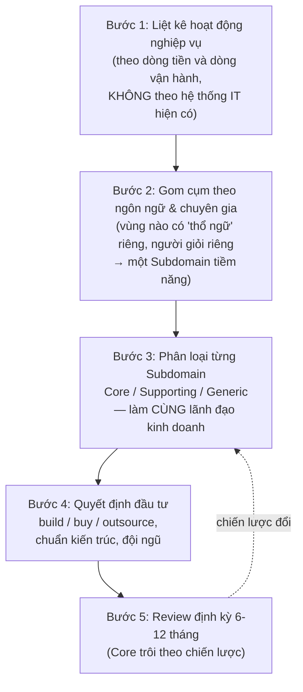
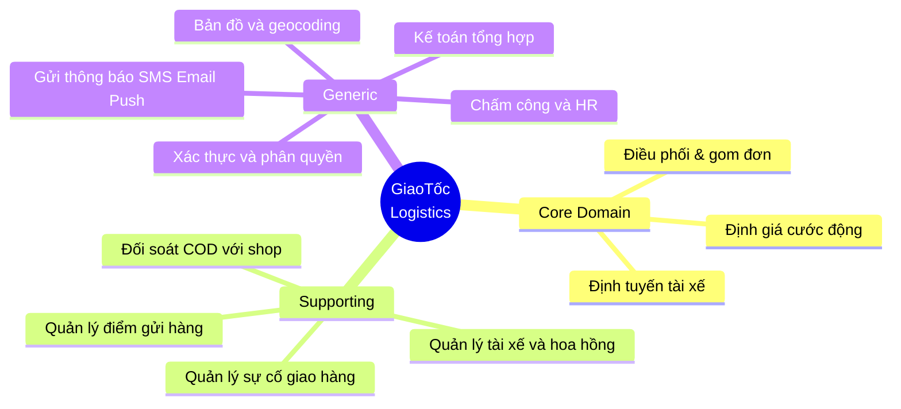
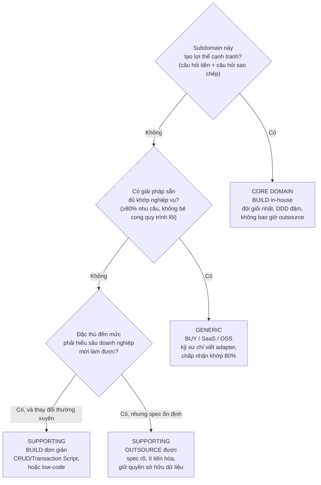

+++
title = "Chương 02 — Domain và Subdomain: Bản đồ chiến lược trước khi viết dòng code đầu tiên"
date = "2026-07-09T09:00:00+07:00"
draft = false
tags = ["backend", "ddd", "architecture"]
series = ["Domain-Driven Design"]
+++

> **Vị trí trong bộ tài liệu:** Chương trước ([01 — Tại sao DDD ra đời](/series/domain-driven-design/01-tai-sao-ddd-ra-doi/)) đã xác lập rằng business complexity là kẻ thù chính và DDD là phương pháp tư duy để quản lý nó. Chương này trả lời câu hỏi chiến lược đầu tiên mà mọi Architect phải trả lời **trước khi** chọn công nghệ, vẽ kiến trúc hay tạo class: *độ phức tạp nghiệp vụ nằm ở đâu trong doanh nghiệp, phần nào tạo ra tiền, và phần nào đáng đầu tư kỹ sư giỏi nhất?* Đây là nội dung Strategic Design thuần túy — chưa có một dòng Entity hay Aggregate nào. Chương tiếp theo: [03 — Ubiquitous Language](/series/domain-driven-design/03-ubiquitous-language/). Mục lục: [00-muc-luc.md](/series/domain-driven-design/00-muc-luc/).

---

## 1. Problem Statement: Ba câu chuyện về việc đầu tư sai chỗ

### 1.1. Câu chuyện thứ nhất: Đội giỏi nhất làm việc ít giá trị nhất

Một công ty logistics Việt Nam — gọi là **GiaoTốc** — có 60 kỹ sư. Khi tôi vào review, tôi hỏi CTO một câu đơn giản: *"Ba kỹ sư giỏi nhất của anh đang làm gì?"*

Câu trả lời: một người đang viết lại hệ thống quản lý nhân sự nội bộ ("vì HR than phần mềm cũ xấu"), một người đang tự xây hệ thống gửi email/SMS ("vì dùng dịch vụ ngoài tốn tiền"), người còn lại đang maintain hệ thống chấm công.

Trong khi đó, thứ làm nên tên tuổi GiaoTốc — **thuật toán gom đơn và điều phối tài xế khiến chi phí giao mỗi đơn thấp hơn đối thủ 18%** — được viết bởi một kỹ sư mid-level đã nghỉ việc, không ai dám sửa, và đang chạy như một hộp đen.

Không có quyết định kỹ thuật nào sai ở đây. Cái sai là **quyết định phân bổ**: công ty đối xử với mọi phần mềm như nhau, nên nguồn lực chảy về nơi ồn ào nhất (HR than phiền) thay vì nơi giá trị nhất (lợi thế cạnh tranh 18%).

### 1.2. Câu chuyện thứ hai: Tự xây thứ nên mua

Một fintech cho vay tiêu dùng dành 14 tháng và 8 kỹ sư để tự xây... hệ thống quản lý tài liệu nội bộ và hệ thống ticket CSKH — hai thứ có hàng chục SaaS làm tốt hơn với giá vài trăm USD/tháng. Lý do được đưa ra: "dữ liệu nhạy cảm" và "về lâu dài tự chủ công nghệ". Trong 14 tháng đó, **mô hình chấm điểm tín dụng** — trái tim của một công ty cho vay, nơi mỗi 1% cải thiện tỉ lệ nợ xấu đáng giá hàng chục tỉ — vẫn là một file Excel do phòng thẩm định tự vận hành.

### 1.3. Câu chuyện thứ ba: Mua thứ nên tự xây

Chiều ngược lại cũng chết người. Một sàn TMĐT quyết định dùng trọn một "giải pháp khuyến mãi" đóng gói của bên thứ ba để tiết kiệm thời gian. Sáu tháng sau, phòng marketing muốn chạy chương trình "mua kèm deal sốc theo khung giờ, cộng dồn có điều kiện với voucher shop" — thứ mà đối thủ chưa có và có thể tạo khác biệt. Câu trả lời từ vendor: "roadmap Q3 năm sau". Lợi thế cạnh tranh tiềm năng chết trong hàng đợi tính năng của một công ty khác. Họ đã **outsource chính vũ khí của mình**.

### 1.4. Mẫu số chung

Ba câu chuyện, một căn bệnh: **không có bản đồ phân loại các vùng nghiệp vụ theo giá trị chiến lược**. Mọi quyết định — tuyển ai, đặt kỹ sư giỏi ở đâu, build hay buy, kiến trúc đậm hay nhạt — đều cần một bản đồ như vậy làm nền. DDD gọi bản đồ đó là **phân rã Domain thành các Subdomain** và phân loại chúng thành **Core / Supporting / Generic**.

Ba câu hỏi xuyên suốt chương:

1. **Tại sao** phải phân loại — code chạy được là chạy được, phân loại để làm gì?
2. **Đánh đổi gì** — phân loại sai thì trả giá thế nào, và phân loại đúng tốn công ra sao?
3. **Không làm thì sao** — điều gì xảy ra với công ty đối xử mọi subdomain như nhau?

---

## 2. Tại sao DDD đưa ra khái niệm Domain/Subdomain

### 2.1. Bối cảnh: bài toán phân bổ nguồn lực là bài toán cổ nhất

Khái niệm Core Domain xuất hiện ngay trong Blue Book của Eric Evans (2003), ở phần "Strategic Design" — và Evans về sau nhiều lần nói rằng nếu được viết lại, ông sẽ đưa phần này lên **đầu** sách thay vì cuối, vì đây là phần bị bỏ qua nhiều nhất nhưng quan trọng nhất.

Trực giác của Evans đến từ quan sát: mọi doanh nghiệp đều có **một vài** hoạt động khiến khách chọn họ thay vì đối thủ, và **rất nhiều** hoạt động chỉ cần "đủ tốt". Kế toán của Shopee không giỏi hơn kế toán của Tiki đến mức khách chọn sàn vì kế toán. Nhưng logistics của Shopee so với đối thủ thì có. Phần mềm phản chiếu doanh nghiệp — nên phần mềm cũng phải có vùng "xuất sắc bắt buộc" và vùng "đủ tốt là đủ".

- **Business problem:** nguồn lực kỹ sư luôn hữu hạn và đắt. Phân bổ đều nghĩa là phân bổ sai — vì giá trị không phân bố đều.
- **Technical problem:** mức đầu tư kiến trúc (rich model, test kỹ, refactor liên tục) rất đắt; áp cho toàn hệ thống thì phá sản tiến độ, không áp cho đâu cả thì core mục nát. Cần tiêu chí *ở đâu đậm, ở đâu nhạt*.
- **Design problem:** không thể quyết định Bounded Context, context mapping, hay build-vs-buy nếu chưa biết vùng nào là gì. Subdomain là **đầu vào** của mọi quyết định strategic phía sau.

### 2.2. Định nghĩa làm việc — sau khi đã có vấn đề

- **Domain**: toàn bộ lĩnh vực hoạt động và tri thức mà doanh nghiệp vận hành trong đó. Domain của GiaoTốc là "giao nhận hàng hóa"; của fintech kia là "cho vay tiêu dùng". Domain thuộc về **không gian bài toán (problem space)** — nó tồn tại dù bạn có viết phần mềm hay không.
- **Subdomain**: một vùng nghiệp vụ tương đối tự trị bên trong Domain, với ngôn ngữ, quy tắc và chuyên gia riêng. "Điều phối tài xế", "tính cước", "quản lý kho", "kế toán" là các Subdomain của GiaoTốc. Quan trọng: Subdomain cũng thuộc **problem space** — bạn *khám phá* ra chúng (chúng có sẵn trong cách doanh nghiệp vận hành), chứ không *thiết kế* ra chúng. Thứ bạn thiết kế là Bounded Context — thuộc không gian lời giải (solution space) — và đó là [chương 04](/series/domain-driven-design/04-bounded-context/). Nhầm hai thứ này là lỗi kinh điển, ta sẽ quay lại ở mục Anti-patterns.

Ba loại Subdomain:

| Loại | Định nghĩa vận hành | Câu hỏi kiểm tra | Ví dụ (sàn TMĐT) |
|---|---|---|---|
| **Core Domain** | Nơi doanh nghiệp **thắng hoặc thua** — lợi thế cạnh tranh nằm ở đây; làm tốt hơn đối thủ tạo ra tiền | "Nếu phần này tốt gấp đôi, doanh thu/chi phí có đổi đáng kể không? Đối thủ có dễ sao chép không?" | Engine khuyến mãi & định giá, hệ thống gợi ý, điều phối kho vận |
| **Supporting Subdomain** | Cần thiết cho vận hành, **đặc thù** cho doanh nghiệp (không mua sẵn được), nhưng làm xuất sắc không tạo lợi thế | "Bắt buộc phải có, phải tự làm vì đặc thù, nhưng khách hàng có chọn ta vì nó không? — Không." | Quản lý gian hàng seller, quy trình duyệt sản phẩm |
| **Generic Subdomain** | Bài toán **chung của mọi công ty**, đã có lời giải thương mại/mã nguồn mở tốt | "Có ít nhất 3 vendor/OSS giải quyết trọn vẹn bài toán này không?" | Gửi email/SMS, thanh toán (cổng), xác thực, kế toán, chấm công |

Lưu ý ngay một điểm tinh tế: **phân loại phụ thuộc vào doanh nghiệp, không phụ thuộc vào bản chất kỹ thuật.** "Thanh toán" là Generic với sàn TMĐT (dùng cổng ngoài) nhưng là **Core** với chính công ty cổng thanh toán. "Gửi thông báo" là Generic với hầu hết mọi người nhưng là Core với một công ty làm nền tảng messaging. Không tồn tại bảng tra cứu vạn năng — phân loại là một **phán đoán chiến lược**, và vì thế nó phải làm cùng người kinh doanh, không phải trong phòng kín của kỹ sư.

---

## 3. Bản chất: Subdomain tồn tại để làm gì, bảo vệ điều gì

### 3.1. Nó là công cụ phân bổ, không phải công cụ vẽ sơ đồ

Bản chất của phân loại Subdomain là **một hàm phân bổ**: nhận vào nguồn lực hữu hạn (kỹ sư giỏi, thời gian, ngân sách kiến trúc, sự chú ý của lãnh đạo), trả ra quyết định *đổ bao nhiêu vào đâu*. Nó bảo vệ hai thứ:

1. **Bảo vệ Core khỏi sự pha loãng.** Không có bản đồ, nguồn lực chảy theo "ai kêu to" (như câu chuyện HR của GiaoTốc) hoặc theo "cái gì vui" (kỹ sư thích viết lại hệ thống notification bằng Rust). Bản đồ Subdomain là hàng rào giữ kỹ sư giỏi nhất ở lại nơi tạo ra tiền.
2. **Bảo vệ phần còn lại khỏi over-engineering.** Chiều ngược lại quan trọng không kém: bản đồ cho phép nói *"phần này là Generic, dùng SaaS, không bàn nữa"* và *"phần này Supporting, CRUD là đủ, không cần Aggregate"* — tiết kiệm được chuyển thẳng về Core.

### 3.2. Cách nó giảm complexity

Nhớ lại chương 01: business complexity tăng theo **tổ hợp** khi các khái niệm tương tác tự do. Phân rã Subdomain là nhát cắt đầu tiên chặn sự bùng nổ đó — trước cả Bounded Context:

- Nó cắt bài toán "xây hệ thống cho công ty logistics" (bất khả tư duy) thành 8-12 bài toán "xây/mua giải pháp cho từng vùng nghiệp vụ" (tư duy được, ước lượng được, tuyển người được).
- Nó cho phép **chuẩn chất lượng khác nhau hợp pháp tồn tại**: Core được test 95% coverage và review 2 người; internal tool được phép "chạy là được". Không có bản đồ, hoặc mọi thứ cùng chuẩn cao (vỡ tiến độ) hoặc cùng chuẩn thấp (vỡ core).
- Nó là đơn vị để **đo lường sức khỏe đầu tư**: nếu 70% sprint points quý này rơi vào Generic subdomain, có chuyện rồi.

### 3.3. Core Domain không đứng yên — nó trôi

Điểm mà rất nhiều tài liệu bỏ qua: **phân loại có ngày hết hạn.** Core hôm nay có thể thành Generic ngày mai và ngược lại:

- **Core → Generic (thị trường đuổi kịp):** năm 2012, tự xây hạ tầng chat realtime có thể là lợi thế; năm 2026 có hàng chục dịch vụ làm tốt hơn — ai còn tự maintain là đang gánh nợ. Video call từng là core của nhiều startup y tế từ xa; giờ là một SDK.
- **Generic → Core (chiến lược đổi):** một chuỗi bán lẻ dùng phần mềm loyalty mua sẵn; đến ngày dữ liệu điểm thưởng trở thành trung tâm chiến lược cá nhân hóa, loyalty engine phải được kéo về tự xây.
- **Supporting → Core (khám phá bất ngờ):** Amazon xây hạ tầng server cho chính mình (supporting) rồi nhận ra nó bán được — AWS trở thành business riêng với Core Domain riêng.

Hệ quả thực hành: bản đồ Subdomain phải được **review định kỳ** (6-12 tháng) cùng lãnh đạo kinh doanh, như review ngân sách. Một Architect trưởng thành giữ bản đồ này như CFO giữ bảng cân đối.

---

## 4. Cách hoạt động: quy trình phân rã và hai case study đầy đủ

### 4.1. Quy trình phân rã domain — luồng thực hiện



Hai câu hỏi sàng lọc quan trọng nhất ở Bước 3, theo thứ tự:

1. **Câu hỏi tiền:** "Nếu vùng này tốt *gấp đôi* thì doanh thu tăng / chi phí giảm bao nhiêu? Nếu nó tệ *gấp đôi* thì sao?" — Core cho câu trả lời bất đối xứng lớn ở cả hai chiều. Generic cho câu trả lời gần như "không đổi" ở chiều tốt lên.
2. **Câu hỏi sao chép:** "Đối thủ có mua/copy được thứ này trong 6 tháng không?" — nếu có, nó không phải lợi thế cạnh tranh bền, cân nhắc lại nhãn Core.

Và một câu hỏi phản biện để chống ngụy biện: **"Chúng ta có đang gọi nó là Core chỉ vì chúng ta đã lỡ xây nó không?"** (sunk cost mặc áo chiến lược — gặp thường xuyên đến mức tôi hỏi câu này trong mọi buổi review).

### 4.2. Case study 1: Công ty logistics GiaoTốc

Domain: giao nhận hàng hóa nội địa, 2 triệu đơn/tháng, thế mạnh là giao nhanh nội thành chi phí thấp.



Phân tích từng nhãn — kèm lý do, vì nhãn không có lý do là nhãn vô giá trị:

| Subdomain | Loại | Tại sao | Quyết định đầu tư |
|---|---|---|---|
| **Điều phối & gom đơn** | Core | Nguồn gốc lợi thế chi phí 18%; thuật toán nhồi đơn theo tuyến là thứ đối thủ chưa sao chép được | Build in-house. Đội mạnh nhất (5 kỹ sư + 1 data scientist). Rich domain model, thử nghiệm A/B liên tục, tài liệu quyết định đầy đủ |
| **Định giá cước động** | Core | Giá theo giờ cao điểm/thời tiết/tải hệ thống quyết định trực tiếp margin và tỉ lệ nhận đơn của tài xế | Build. Chung đội với điều phối vì hai vùng đối thoại chặt |
| **Định tuyến tài xế** | Core (nhưng *thuê nền*) | Trải nghiệm tài xế đi tuyến ngắn nhất là lợi thế — nhưng **bản đồ và ma trận khoảng cách là Generic** (Google/OSRM). Core là tầng logic nghiệp vụ trên đó: ràng buộc COD, khung giờ nhận của shop, thói quen tài xế | Build tầng nghiệp vụ, buy tầng bản đồ. Ví dụ đẹp về việc một Subdomain có thể *chứa* thành phần generic |
| **Đối soát COD** | Supporting | Bắt buộc phải có, đặc thù theo quy trình của GiaoTốc (không SaaS nào khớp), nhưng làm xuất sắc không kéo thêm khách | Build với chuẩn vừa phải: Transaction Script + test cho các ca đối soát lệch. Không cần Aggregate cầu kỳ |
| **Quản lý sự cố** | Supporting | Quy trình đền bù, hàng thất lạc đặc thù | Build đơn giản, ưu tiên cấu hình được quy trình |
| **Thông báo, xác thực, kế toán, HR, chấm công** | Generic | Hàng chục giải pháp tốt sẵn có; không khách hàng nào chọn GiaoTốc vì màn hình chấm công | Buy/SaaS toàn bộ. Kỹ sư chỉ viết adapter |

Đây chính là lời giải cho câu chuyện 1.1: ba kỹ sư giỏi nhất phải được rút khỏi HR/notification/chấm công (Generic — mua) và đặt vào điều phối + định giá (Core đang mồ côi).

### 4.3. Case study 2: Fintech cho vay tiêu dùng

Domain: cho vay tiêu dùng tín chấp, giải ngân qua app, thu hồi nợ qua đối tác. Lợi nhuận = (lãi thu được) − (nợ xấu) − (chi phí vận hành + vốn).

| Subdomain | Loại | Tại sao | Quyết định |
|---|---|---|---|
| **Chấm điểm tín dụng (credit scoring)** | **Core số 1** | Mỗi 1% nợ xấu giảm = hàng chục tỉ. Dữ liệu hành vi độc quyền + mô hình là thứ không mua được (mô hình mua sẵn tính trên dữ liệu chung, không có lợi thế) | Build. Đội giỏi nhất. Đây là chỗ file Excel của phòng thẩm định phải được thay bằng hệ thống thật |
| **Định giá khoản vay theo rủi ro (risk-based pricing)** | Core | Lãi suất cá nhân hóa theo rủi ro quyết định cả tỉ lệ chuyển đổi lẫn margin | Build, gắn chặt với scoring |
| **Quản lý vòng đời khoản vay (loan servicing)** | Supporting | Lịch trả, phân bổ gốc/lãi, phạt trễ — bắt buộc đúng tuyệt đối và đặc thù theo sản phẩm vay, nhưng làm "hay hơn" không thêm khách. Chú ý: **Supporting vẫn có thể cần độ chính xác Core** — chính xác ≠ chiến lược | Build với kỷ luật cao về tính đúng (đây là tiền!), nhưng model ổn định, ít cần tiến hóa nhanh |
| **KYC/eKYC** | Generic (bắt buộc bởi luật) | Mọi fintech đều phải làm giống nhau theo quy định; các vendor eKYC (OCR giấy tờ, liveness) làm tốt hơn tự xây | Buy + adapter. Nhưng **luồng phê duyệt tổng thể** (khi nào cần KYC lại, ngưỡng rủi ro) là Supporting của riêng mình |
| **Giải ngân & thu hộ** | Generic | Tích hợp ngân hàng/ví — chuẩn hóa cao | Buy/tích hợp cổng |
| **Nhắc nợ (collection)** | Supporting → có thể thành Core | Hiện tại outsource đối tác. Nhưng nếu dữ liệu cho thấy chiến lược nhắc nợ cá nhân hóa giảm nợ xấu đáng kể → kéo về thành Core. Đánh dấu ★ theo dõi trong review kỳ tới | Outsource có đo lường; giữ dữ liệu về mình |
| **Sổ cái kế toán, báo cáo NHNN** | Generic | Chuẩn ngành, phần mềm sẵn | Buy |

Hai bài học từ case này:

1. **"Đúng tuyệt đối" không đồng nghĩa "Core".** Loan servicing sai một đồng là scandal — nhưng nó vẫn là Supporting vì làm tốt hơn chuẩn không tạo thêm khách. Phân loại đo **giá trị chiến lược**, không đo mức nghiêm trọng của lỗi. Hệ quả: Supporting vẫn có thể cần test nghiêm ngặt — chuẩn *chất lượng* và nhãn *chiến lược* là hai trục khác nhau.
2. **Ranh giới Generic có tầng nghiệp vụ bọc ngoài.** eKYC là Generic nhưng *chính sách* dùng eKYC (ngưỡng, tần suất, luồng ngoại lệ) là của riêng mình. Mua lõi, tự viết vỏ chính sách — pattern lặp lại ở khắp nơi (bản đồ của GiaoTốc cũng vậy).

### 4.4. Ma trận quyết định build / buy / outsource



Diễn giải từng ô — kèm phần "vì sao" và "đánh đổi":

**BUILD cho Core.** Vì lợi thế cạnh tranh theo định nghĩa là thứ không mua được — nếu mua được thì đối thủ cũng mua được, hết lợi thế. Đánh đổi: đắt nhất, chậm nhất, rủi ro nhất — chấp nhận được *chỉ vì* phần thưởng bất đối xứng. Hệ quả kiến trúc: đây là nơi duy nhất mặc định xứng đáng với DDD "full option" — rich model, Ubiquitous Language chặt chẽ, Event Storming định kỳ, kỹ sư giỏi nhất, và **không bao giờ giao cho outsourcing** (bạn sẽ mất chính quá trình học — knowledge crunching — vốn là một nửa giá trị).

**BUY cho Generic.** Vì bạn đang mua hàng nghìn giờ kỹ sư của vendor với giá subscription — bài toán của họ là Core của họ, họ làm tốt hơn bạn mãi mãi. Đánh đổi: khớp ~80% nhu cầu, phụ thuộc roadmap vendor, chi phí thoát (exit cost). Kỷ luật bắt buộc: **bọc vendor sau một adapter/anti-corruption layer** ([05 — Context Mapping](/series/domain-driven-design/05-context-mapping/)) để ngày đổi vendor không phải mổ toàn thân.

**BUILD-đơn-giản hoặc OUTSOURCE cho Supporting.** Đây là vùng quyết định tinh tế nhất. Build đơn giản khi nghiệp vụ còn đổi thường xuyên (vòng phản hồi nội bộ nhanh hơn vòng hợp đồng outsource). Outsource khi spec đã ổn định và ít tiến hóa. Đánh đổi của outsource: chi phí giao tiếp + chất lượng khó kiểm — nên chỉ giao thứ *mô tả được trọn vẹn bằng spec*. Theo định nghĩa, Core không bao giờ mô tả được trọn vẹn bằng spec (nếu được thì nó đã không phải Core).

### 4.5. Nhãn Subdomain quyết định "liều lượng DDD" — nhìn bằng code

Cùng một công ty, hai vùng, hai chuẩn kiến trúc hợp pháp khác nhau. Đây là điểm nhiều team bỏ lỡ: **DDD cho phép — thậm chí yêu cầu — sự không đồng đều có chủ đích.**

**Core (GiaoTốc — điều phối): rich model, ngôn ngữ nghiệp vụ đậm đặc**

```typescript
// core/dispatch/domain/route-plan.ts — NestJS, nhưng domain layer không biết gì về Nest
export class RoutePlan {
  private constructor(
    private readonly id: RoutePlanId,
    private readonly driver: DriverRef,
    private stops: DeliveryStop[],
    private status: RoutePlanStatus,
  ) {}

  /** Nhồi thêm đơn vào tuyến đang chạy — trái tim của lợi thế 18% */
  absorb(order: OrderRef, constraints: AbsorptionPolicy): AbsorptionResult {
    if (this.status !== RoutePlanStatus.InProgress) {
      return AbsorptionResult.rejected('ROUTE_NOT_ACTIVE');
    }
    if (!constraints.codCapacityAllows(this.totalCod(), order.codAmount)) {
      return AbsorptionResult.rejected('COD_LIMIT_EXCEEDED'); // tài xế không được ôm quá X tiền mặt
    }
    const detour = this.estimateDetour(order.dropPoint);
    if (detour.exceeds(constraints.maxDetour)) {
      return AbsorptionResult.rejected('DETOUR_TOO_LONG');
    }
    this.stops = this.reoptimize([...this.stops, DeliveryStop.forOrder(order)]);
    return AbsorptionResult.accepted(this.id, detour, new OrderAbsorbedIntoRoute(this.id, order.id));
  }
}
```

**Supporting (GiaoTốc — quản lý điểm gửi hàng): Transaction Script thẳng tuột, và điều đó ĐÚNG**

```go
// supporting/dropoffpoint/service.go — CRUD trung thực, không xấu hổ
func (s *DropOffPointService) Update(ctx context.Context, id string, req UpdateRequest) error {
    if req.Name == "" || !validPhone(req.Phone) {
        return ErrInvalidInput
    }
    return s.db.WithContext(ctx).
        Model(&DropOffPoint{}).
        Where("id = ?", id).
        Updates(map[string]any{"name": req.Name, "phone": req.Phone, "open_hours": req.OpenHours}).
        Error
}
```

Nếu ai đó trong team đòi viết `DropOffPointAggregate` với `Value Object OpenHours` và Domain Event `DropOffPointRenamed` — bản đồ Subdomain là văn bản để từ chối: *"Vùng này Supporting, chuẩn ở đây là đơn giản, mang sức đó sang team Dispatch."* Ngược lại, nếu ai đó đề nghị "sửa nhanh" `RoutePlan` bằng cách gán thẳng field từ controller — cũng chính bản đồ đó là căn cứ để chặn.

## 5. Điểm mạnh

- **Biến tranh luận cảm tính thành quyết định có khung**: "nên tự xây hay mua" từ cuộc cãi nhau theo sở thích công nghệ trở thành câu hỏi kiểm chứng được — *"nó có tạo khác biệt cạnh tranh không?"*. Khung này người không viết code (CEO, CFO) cũng tham gia được, vì nó nói ngôn ngữ đầu tư.
- **Cho phép không đồng đều có chủ đích** (mục 4.5): tiết kiệm chính xác ở chỗ đáng tiết kiệm, đầu tư đậm chính xác ở chỗ đáng đầu tư. Không có bản đồ subdomain, mọi chuẩn kiến trúc là "một cỡ cho tất cả" — và cỡ nào cũng sai ở đâu đó.
- **Định hướng nhân sự**: người giỏi nhất đặt vào Core. Nghe hiển nhiên, nhưng không có bản đồ, người giỏi nhất thường trôi về chỗ *cháy to nhất* — mà chỗ cháy to thường là Supporting làm ẩu, không phải Core.
- **Là đầu vào của mọi quyết định strategic phía sau**: ranh giới Bounded Context, quan hệ context map, thứ tự refactor legacy — tất cả tra cứu ngược về bản đồ này.

## 6. Điểm yếu

- **Đòi hiểu biết kinh doanh thật**: phân loại Core/Supporting sai thì mọi quyết định hạ nguồn sai theo. Mà người trả lời đúng câu "lợi thế cạnh tranh của ta là gì" thường không ngồi trong phòng kỹ thuật — cần kéo được lãnh đạo kinh doanh vào, chi phí chính trị không nhỏ.
- **Bản đồ trôi theo thời gian** (mục 3.3): phân loại đúng năm nay có thể sai năm sau. Không có lịch xem lại định kỳ, bản đồ thành cổ vật — và quyết định đầu tư dựa trên cổ vật.
- **Dễ bị lạm dụng làm vũ khí chính trị**: team nào cũng muốn phần mình là "Core" (ngân sách, headcount, uy tín). Không có tiêu chí khách quan được chốt trước, buổi phân loại subdomain thành cuộc chia ghế.
- **Ranh giới mờ ở doanh nghiệp nhỏ**: công ty 15 người, một dev đụng cả ba loại subdomain trong một tuần — bản đồ vẫn hữu ích cho quyết định build/buy nhưng ít tác dụng tổ chức team.

## 7. Trade-off

- **Đầu tư đều vs đầu tư lệch**: đầu tư đều cho cảm giác an toàn ("chỗ nào cũng tử tế") nhưng thực chất là lấy giờ kỹ sư giỏi trợ cấp cho phần thị trường không trả tiền, và bỏ đói phần thị trường trả tiền. Đầu tư lệch đúng chỗ tạo khác biệt — trả giá bằng những vùng Supporting "xấu xí có kiểm soát" mà dev nhìn hơi ngứa mắt. Chấp nhận ngứa mắt là một năng lực của kiến trúc sư.
- **Generic mua ngoài vs tự chủ**: mua (payment gateway, KYC, maps API) đổi tiền lấy tốc độ và chất lượng chuyên môn hóa, trả bằng phụ thuộc nhà cung cấp (giá tăng, API đổi, service sập theo họ). Nguyên tắc: mua Generic, nhưng **bọc sau interface của mình** (Anti-Corruption Layer — chương 05) để ngày đổi nhà cung cấp là đổi adapter, không phải mổ nghiệp vụ.
- **Chia mịn vs chia thô**: bản đồ 30 subdomain cho công ty 40 dev là bản đồ để ngắm; bản đồ 3 subdomain cho tập đoàn là vô dụng theo chiều ngược lại. Độ mịn đúng: mỗi subdomain đủ nhỏ để gán cho một nhóm người và một quyết định đầu tư riêng, đủ lớn để quyết định đó đáng bàn.

## 8. Production Considerations

- **Review bản đồ subdomain mỗi 6–12 tháng** hoặc khi có biến cố chiến lược (đối thủ mới, M&A, pivot). Đưa vào lịch architecture review, có mặt người kinh doanh.
- **Ghi ADR cho mỗi quyết định build/buy** kèm nhãn subdomain tại thời điểm quyết định — để hai năm sau người mới hiểu *tại sao* thanh toán lại là mua ngoài, và biết điều kiện nào thì xem xét lại.
- **Khi Supporting phình to**: dấu hiệu là team liên tục vá thứ "không quan trọng" — hoặc phân loại sai từ đầu (nó là Core trá hình), hoặc nó đang trôi thành Core (mục 3.3). Cả hai đều cần họp lại bản đồ, không cần thêm người vá.
- **Khi mua Generic thất bại giữa đường** (vendor tăng giá 5 lần, sập SLA): nếu đã bọc ACL thì thay vendor là dự án hạ tầng cỡ tuần; nếu để API vendor lan khắp codebase thì là dự án cỡ quý. Chi phí ACL là bảo hiểm — đóng trước, rẻ; đóng sau, đắt.
- **Đo lường**: tỷ lệ giờ kỹ sư rót vào Core vs Supporting vs Generic là chỉ số sức khỏe chiến lược. Nhiều công ty giật mình khi đo lần đầu: 70% giờ đổ vào Generic tự xây.

## 9. Best Practices

- Bắt đầu buổi phân loại bằng câu hỏi cho người kinh doanh: *"Nếu đối thủ sao chép được một phần hệ thống của ta, phần nào làm anh/chị mất ngủ?"* — đó là ứng viên Core.
- Kiểm tra chéo bằng phản đề: *"Nếu phần này ta làm ở mức 'đủ dùng như mọi đối thủ', khách có rời bỏ ta không?"* — không thì nó không phải Core.
- Mỗi subdomain một dòng: tên, loại, lý do phân loại, quyết định đầu tư, ngày review — cả bản đồ nằm gọn một trang. Bản đồ hai chục trang là bản đồ không ai đọc.
- Nhãn subdomain viết vào README của module/service tương ứng — để dev mở code là biết chuẩn chất lượng vùng này là gì.
- Đừng phân loại một mình: bản đồ subdomain vẽ solo bởi architect là *giả thuyết*; nó chỉ thành *bản đồ* sau khi người kinh doanh xác nhận.

## 10. Anti-patterns

- **Mọi thứ đều là Core**: phổ biến nhất, vì "cái gì của mình chả quan trọng". Hậu quả: đầu tư dàn trải trở lại — bản đồ có cũng như không. Nếu hơn ~30% hệ thống là "Core", buổi phân loại đã thất bại.
- **Nhầm Generic thành Core vì đã lỡ tự xây**: "hệ thống email marketing tự viết là tài sản quý" — sunk cost mặc áo chiến lược. Câu hỏi đúng không phải "nó có giá trị không" mà "tiếp tục nuôi nó có tạo khác biệt cạnh tranh không".
- **Nhầm Core thành Generic vì ngoài kia có bán thứ na ná**: "routing có Google Maps rồi" — trong khi lợi thế của GiaoTốc là routing *với ràng buộc COD và hành vi tài xế Việt Nam* mà không SaaS nào có. Mua Generic để thay Core là tự cắt động mạch.
- **Phân loại theo độ khó kỹ thuật**: "phần này thuật toán khó → Core". Sai trục: Core đo bằng khác biệt cạnh tranh, không bằng độ khó. Có thứ khó mà Generic (video transcoding), có thứ dễ mà Core (một rule tính phí độc quyền).
- **Bản đồ vẽ một lần rồi đóng khung**: xem mục 3.3 — Core trôi. Bản đồ tĩnh trong doanh nghiệp động là bản đồ sai có thời hạn.

## 11. Khi nào KHÔNG cần phân tích Subdomain

Khi toàn bộ hệ thống nằm gọn trong một quyết định đầu tư: tool nội bộ vài màn hình, MVP một tính năng, dự án outsource theo spec cố định — chia subdomain là nghi thức thừa vì không có nguồn lực nào để phân bổ khác nhau. Cũng chưa cần khi startup chưa biết lợi thế cạnh tranh của mình là gì (chưa có product-market fit) — lúc đó *mọi phân loại đều là đoán*; hãy ship, học, và vẽ bản đồ khi câu trả lời "khách trả tiền vì cái gì" bắt đầu ổn định. Dấu hiệu cần vẽ bản đồ lần đầu: lần đầu tiên bạn phải chọn giữa hai việc lớn mà không đủ người làm cả hai.

## Đọc tiếp

Đã biết *đầu tư vào đâu*. Câu hỏi tiếp theo: những gì team hiểu về từng vùng nghiệp vụ làm sao đi vào code mà không méo mó? [Chương 03 — Ubiquitous Language](/series/domain-driven-design/03-ubiquitous-language/).

- Quay lại: [01 — Tại sao DDD ra đời](/series/domain-driven-design/01-tai-sao-ddd-ra-doi/) · [Mục lục](/series/domain-driven-design/00-muc-luc/)
- Liên quan: [04 — Bounded Context](/series/domain-driven-design/04-bounded-context/) (subdomain thuộc problem space, bounded context thuộc solution space — cặp khái niệm hay bị nhầm nhất)

