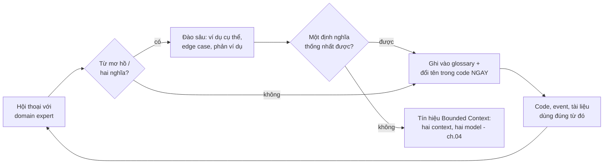

+++
title = "Chương 03 — Ubiquitous Language: Ngôn ngữ chung là nền móng, không phải phụ kiện"
date = "2026-07-09T10:00:00+07:00"
draft = false
tags = ["backend", "ddd", "architecture"]
series = ["Domain-Driven Design"]
+++

> Vị trí trong bộ tài liệu: chương cuối của phần Foundations. Chương [01](/series/domain-driven-design/01-tai-sao-ddd-ra-doi/) chỉ ra business complexity là kẻ thù chính; chương [02](/series/domain-driven-design/02-domain-va-subdomain/) dạy cách chia domain để phân bổ nguồn lực. Chương này trả lời câu hỏi nền tảng hơn cả hai: **làm sao để những gì team hiểu về nghiệp vụ không bị bóp méo trên đường đi từ cuộc họp vào code**. Không có chương này, mọi pattern phía sau đều xây trên cát.

## 1. Problem Statement: Chi phí dịch thuật vô hình đang ăn mòn team của bạn

### 1.1. Một hội thoại có thật

Cuộc họp giữa chị Hà (trưởng phòng vận hành sàn TMĐT) và Nam (senior backend):

> **Hà**: Đơn *treo* quá 48 tiếng thì phải *nhả hàng* về kho nhé.
> **Nam**: OK, tức là em update record trong bảng `orders` set `status = 4`, xong chạy job bù lại `quantity` trong bảng `inventory` đúng không chị?
> **Hà**: Chị không biết bảng gì, ý chị là khách đặt mà không thanh toán thì đừng giữ hàng của người khác nữa.
> **Nam**: Vâng thì em hiểu là update status với cộng lại số lượng...
> **Hà**: Ừ chắc thế...

Hai người **tưởng** đã hiểu nhau. Ba tuần sau sự cố: Nam "nhả hàng" bằng cách cộng lại `quantity` — nhưng chị Hà nói "nhả hàng" nghĩa nghiệp vụ là *hủy giữ chỗ* (reservation), còn hàng đã xuất kho chờ giao thì phải tạo *lệnh hoàn kho* có kiểm đếm. Hai khái niệm khác nhau — "reservation release" và "return to stock" — bị nén vào một cụm từ mơ hồ "nhả hàng", và mỗi bên giải nén theo từ điển riêng của mình. Bug này không phải bug code. **Code chạy đúng như Nam hiểu. Nam hiểu sai như cách con người luôn hiểu sai nhau.**

### 1.2. Tại sao doanh nghiệp gặp vấn đề này ở quy mô hệ thống

Trong một team, mỗi thông tin nghiệp vụ đi qua chuỗi dịch: *domain expert nói (ngôn ngữ nghiệp vụ) → BA ghi ticket (ngôn ngữ tài liệu) → dev đọc và nghĩ (ngôn ngữ bảng/cột/API) → code (ngôn ngữ kỹ thuật)*. Mỗi mắt xích mất hoặc méo một ít ngữ nghĩa — như trò chơi "tam sao thất bản". Với hệ thống CRUD nhỏ, sai lệch nhỏ và sửa rẻ. Với hệ thống mà business rule chồng chéo (chương 01), sai lệch ngữ nghĩa **tích lũy vào model** — và model sai thì mọi tính năng xây trên nó đều sai theo, càng về sau càng đắt.

Nếu không giải quyết: (1) mỗi cuộc họp tốn 30% thời gian để "định nghĩa lại từ"; (2) dev thành "thợ dịch ticket" thay vì người hiểu nghiệp vụ — mọi edge case phải hỏi lại, chờ, block; (3) tri thức nghiệp vụ sống trong đầu vài người, nghỉ việc là mất; (4) code không đọc ra nghiệp vụ, người mới học hệ thống bằng khảo cổ.

## 2. Tại sao DDD đưa ra Ubiquitous Language

- **Bối cảnh**: Evans nhận ra các dự án thành công có chung một đặc điểm không nằm ở công nghệ — team dùng **một** ngôn ngữ xuyên suốt từ phòng họp đến tên class. Ông đặt nó làm nền của toàn bộ phương pháp, *trước* mọi pattern kỹ thuật.
- **Business problem**: tri thức domain là tài sản đắt nhất và dễ thất thoát nhất. Mỗi lần dịch là một lần thất thoát.
- **Technical problem**: khi code dùng từ khác với nghiệp vụ (`status = 4` thay vì `ReservationExpired`), việc *đối chiếu code với yêu cầu* trở thành công việc thủ công, dễ sai, và không ai làm khi deadline gần.
- **Design problem**: model là **thỏa thuận ngữ nghĩa** giữa người và máy. Không có ngôn ngữ chung thì không có thỏa thuận — chỉ có hai model song song (một trong đầu domain expert, một trong code) trôi xa nhau dần.

## 3. Bản chất

### 3.1. Nó là gì — và nó KHÔNG phải là gì

Ubiquitous Language là **bộ từ vựng nghiệp vụ được cả team (dev + domain expert) thống nhất, có định nghĩa chặt, và được dùng ở MỌI nơi**: hội thoại, ticket, tài liệu, tên class, tên method, tên event, tên bảng, log message, alert. "Ubiquitous" — *ở khắp nơi* — là từ khóa: một glossary đắp chiếu trên Confluence mà code vẫn gọi `data`, `info`, `processFlag` thì không phải Ubiquitous Language, đó là từ điển chết.

Nó không phải là "dev học từ của business" một chiều. Nó là ngôn ngữ **được rèn qua va chạm hai chiều**: dev ép business định nghĩa chặt những từ họ dùng lỏng ("đơn *treo* nghĩa chính xác là gì? chưa thanh toán, hay thanh toán fail, hay cả hai?"), business ép dev bỏ từ kỹ thuật vô nghĩa với họ. Quá trình rèn ngôn ngữ **chính là** quá trình modeling — hai việc là một.

### 3.2. Nó bảo vệ điều gì

Nó bảo vệ **tính toàn vẹn ngữ nghĩa của model** trên đường truyền giữa người và người, giữa người và code. Cụ thể:

- **Chống đồng âm khác nghĩa** (một từ, nhiều nghĩa): "nhả hàng" ở mục 1.1. Khi phát hiện một từ mang hai nghĩa không ép được vào một định nghĩa — đó là **tín hiệu vàng của ranh giới Bounded Context** (chương 04).
- **Chống đồng nghĩa khác âm** (nhiều từ, một nghĩa): "khách", "user", "member", "account" cùng chỉ một thứ → bốn cách đặt tên trong code, join nhầm, hiểu nhầm.
- **Chống khái niệm ngầm** (implicit concept): nghiệp vụ có khái niệm mà code không có tên cho nó — như "reservation" trong câu chuyện mở đầu. Khái niệm không tên thì không ai bảo vệ invariant của nó.

### 3.3. Nó giảm complexity như thế nào

Nó không giảm essential complexity (nghiệp vụ vẫn phức tạp vậy) — nó **xóa accidental complexity của việc dịch**. Khi domain expert nói "reservation hết hạn thì release" và trong code có đúng `reservation.release()`, khoảng cách giữa yêu cầu và thay đổi code tiến về 0. Review code trở thành review nghiệp vụ. Onboarding đọc code là học nghiệp vụ. Đó là lợi ích kép ít phương pháp nào mua được.

## 4. Cách hoạt động

### 4.1. Ngôn ngữ đi vào code như thế nào — ví dụ xuyên suốt

Cùng một yêu cầu "đơn treo quá 48h thì nhả hàng", hai phiên bản code:

```typescript
// TRƯỚC — ngôn ngữ kỹ thuật, nghiệp vụ vô hình
async processOrders() {
  const orders = await this.repo.find({ where: { status: 2, updatedAt: LessThan(cutoff) } });
  for (const o of orders) {
    o.status = 4;
    await this.invRepo.increment({ productId: o.productId }, 'quantity', o.qty);
  }
}
// Đọc đoạn này, ai trả lời được: status 2 là gì? 4 là gì? increment này là "nhả giữ chỗ"
// hay "hoàn kho"? Muốn biết phải đi hỏi — tri thức nằm ngoài code.
```

```typescript
// SAU — Ubiquitous Language: mỗi từ trong code là từ của nghiệp vụ
async releaseExpiredReservations() {
  const expired = await this.reservations.findExpired(Duration.hours(48));
  for (const reservation of expired) {
    reservation.release(ReleaseReason.PAYMENT_TIMEOUT); // phát event ReservationReleased
  }
}
// Domain expert đọc HIỂU được đoạn này khi pair review. Và khi chị Hà nói thêm
// "hàng đã xuất kho thì phải hoàn kho có kiểm đếm" — team thấy ngay: đó là
// khái niệm KHÁC (StockReturn), không nhét vào release() được.
```

```go
// Go — cùng nguyên tắc: tên type/method là từ nghiệp vụ
func (s *ReservationService) ReleaseExpired(ctx context.Context) error {
    expired, err := s.reservations.FindExpired(ctx, 48*time.Hour)
    if err != nil { return err }
    for _, r := range expired {
        if err := r.Release(domain.ReasonPaymentTimeout); err != nil { return err }
        // r phát event ReservationReleased — tên event cũng là ngôn ngữ chung
    }
    return nil
}
```

Chú ý điều xảy ra ở comment cuối đoạn TypeScript: ngôn ngữ chặt **làm lộ khái niệm ẩn** (StockReturn ≠ ReservationRelease). Đây là cơ chế quan trọng nhất: đặt tên đúng không phải thẩm mỹ — nó là công cụ *phát hiện model sai*.

### 4.2. Quy trình rèn ngôn ngữ



Vòng lặp này chạy mãi mãi — ngôn ngữ tiến hóa cùng hiểu biết. Điểm chốt: **đổi tên trong code ngay khi ngôn ngữ đổi**. Trì hoãn rename là để hai model bắt đầu trôi xa nhau; sáu tháng sau `Shipment` trong code nghĩa là thứ mà business đã gọi là `Consignment` từ lâu, và mọi cuộc họp lại cần phiên dịch.

### 4.3. Event Storming — công cụ rèn ngôn ngữ nhanh nhất

Event Storming (Alberto Brandolini) là workshop dán giấy: cả team + domain expert dán các **sự kiện nghiệp vụ ở thì quá khứ** ("Đơn đã đặt", "Tiền đã trừ", "Hàng đã giữ chỗ") lên tường theo dòng thời gian, rồi truy ngược: lệnh nào gây ra event này? ai ra lệnh? rule nào chặn nó? Giá trị kép: (1) event ở thì quá khứ ép mọi người nói bằng **sự kiện nghiệp vụ** thay vì bảng và API; (2) chỗ nào hai người dán hai tờ giấy khác từ cho cùng một sự kiện — mâu thuẫn ngôn ngữ lộ ra **trước khi viết code**, chi phí sửa bằng giá một tờ giấy. Output của một buổi Event Storming tốt: dòng event chính, các cụm event gợi ý ranh giới context, và một trang glossary đầu tiên.

### 4.4. Ngôn ngữ có ranh giới — cầu nối sang Bounded Context

Thử thống nhất từ "Order" cho toàn công ty TMĐT:

| Phòng | "Order" nghĩa là | Quan tâm |
|---|---|---|
| Sales | Giỏ hàng đã chốt, tổng tiền, khuyến mãi | Giá, thanh toán |
| Kho vận | Danh sách món cần nhặt và đóng gói | Vị trí kệ, cân nặng, kiện |
| Kế toán | Chứng từ doanh thu | Hóa đơn, thuế, kỳ ghi nhận |

Ba định nghĩa **không hợp nhất được** — và cố hợp nhất sẽ ra một class Order 80 field mà mỗi phòng dùng 15 field (chương 01 đã mổ xẻ). Kết luận nền tảng: **Ubiquitous Language chỉ nhất quán bên trong một ranh giới ngữ nghĩa**. Ranh giới đó chính là Bounded Context — chủ đề chương [04](/series/domain-driven-design/04-bounded-context/). Không có ngôn ngữ, không vẽ được ranh giới; đó là lý do chương này đứng trước.

## 5. Điểm mạnh

- **Rẻ nhất trong toàn bộ DDD**: không cần framework, không cần refactor lớn — bắt đầu bằng một buổi nói chuyện và vài lần rename. ROI cao nhất trên mỗi giờ đầu tư.
- **Phát hiện lỗi model trước khi viết code** — sửa một từ trong glossary rẻ hơn sửa một aggregate đã có dữ liệu production một triệu lần (nghĩa đen).
- **Giảm bus factor**: tri thức nghiệp vụ nằm trong code và glossary, không chỉ trong đầu người.
- **Là điều kiện cần của mọi pattern phía sau**: aggregate đặt tên sai thì ranh giới sai; event đặt tên mơ hồ thì consumer hiểu nhầm.

## 6. Điểm yếu

- **Cần domain expert thật sự tham gia đều đặn** — chi phí tổ chức lớn nhất. Công ty coi "gặp dev" là việc phiền thì ngôn ngữ chung chết yểu.
- **Kỷ luật liên tục, không có điểm kết thúc**: một sprint lơi lỏng là từ mới lại vào code tùy tiện.
- **Rename có chi phí thật**: đổi tên khái niệm đã ăn vào API công khai, tên bảng, event đã publish — cần chiến lược versioning (mục 8).
- **Vấn đề song ngữ Việt–Anh** (đặc thù team Việt): nghiệp vụ nói tiếng Việt, code viết tiếng Anh — bản thân việc đặt tên đã là một lần dịch. Không xử lý thì mỗi dev tự dịch một kiểu: "đối soát" thành `reconcile`, `crossCheck`, `compare` ở ba module.

## 7. Trade-off

- **Từ chuẩn ngành vs từ nội bộ**: "reconciliation" chuẩn ngành fintech nhưng team vận hành gọi "đối soát" và có quy trình riêng hơi khác chuẩn. Chọn từ của **domain expert của bạn**, không phải từ trong sách — model phục vụ nghiệp vụ của bạn, không phục vụ Wikipedia.
- **Ngôn ngữ chặt vs tốc độ MVP**: startup 3 người chưa tìm ra product-market fit thì nghiệp vụ đổi hàng tuần — glossary chặt chẽ là ma sát. Mức đầu tư đúng lúc đó: đặt tên tử tế, chưa cần quy trình. Ngôn ngữ chung đắt dần theo số người và tuổi hệ thống — đầu tư tỷ lệ thuận.
- **Một ngôn ngữ toàn công ty vs mỗi context một ngôn ngữ**: đã phân tích ở 4.4 — cố một ngôn ngữ toàn cục là chống lại thực tại tổ chức. Trade-off thật là *đặt ranh giới ở đâu*, không phải *có ranh giới hay không*.

## 8. Production Considerations

- **Glossary sống trong repo** (markdown cạnh code, review như code), không trong wiki mồ côi. Mỗi Bounded Context một glossary.
- **Rename ngôn ngữ nội bộ**: làm ngay, IDE lo phần nặng. **Rename chạm API/event công khai**: versioning — API v2 dùng tên mới, v1 deprecate có lộ trình; event mới tên mới, consumer migrate dần (chi tiết chương 13 và 14).
- **Quy ước song ngữ cho team Việt**: một bảng ánh xạ Việt→Anh trong glossary, chốt một lần, dùng mãi ("đối soát" = `Reconciliation`, "nhả giữ chỗ" = `ReleaseReservation`). Từ nghiệp vụ đặc thù không có tiếng Anh chuẩn (vd "COD đối soát 2 chiều") — chọn một tên, ghi định nghĩa, đừng dịch word-by-word.
- **Đưa vào Definition of Done**: PR đổi hành vi nghiệp vụ phải dùng đúng từ glossary; từ mới phải kèm cập nhật glossary.
- **Log và alert cũng là ngôn ngữ**: on-call lúc 3h sáng đọc `ReservationReleaseFailed reason=STOCK_ALREADY_SHIPPED` tự hiểu được; đọc `process error code 57` thì phải gọi điện cho người viết code.

## 9. Best Practices

- Nói chuyện với domain expert bằng **ví dụ cụ thể và phản ví dụ**, không bằng định nghĩa trừu tượng: "đơn thanh toán fail 2 lần rồi thành công thì có tính là *treo* trong khoảng giữa không?"
- Săn **danh từ mơ hồ** ("xử lý", "process", "manage", "data", "info") và **thì hiện tại mơ hồ** — ép về động từ nghiệp vụ + thì rõ ràng.
- Event đặt tên **quá khứ + nghiệp vụ**: `ReservationReleased`, không phải `UpdateInventoryEvent`.
- Mỗi khi nghe domain expert dùng một từ mà code chưa có — dừng lại, hỏi, có thể bạn vừa tìm thấy khái niệm ẩn đáng giá.
- Đo sức khỏe ngôn ngữ bằng câu hỏi: *"Domain expert nghe đọc tên các method của aggregate chính, họ có gật đầu không?"*

## 10. Anti-patterns

- **Glossary chết**: có tài liệu, code không theo — tệ hơn không có vì tạo ảo giác đã làm xong.
- **Dev-speak trong hội thoại nghiệp vụ**: "chị ơi em set flag is_active = false nhé" — ép domain expert học ngôn ngữ máy, chiều dịch ngược lãng phí đúng bằng chiều xuôi.
- **Một từ hai nghĩa được "giải quyết" bằng prefix**: `SalesOrder`, `WarehouseOrder`, `AccountingOrder` chung một class cha `BaseOrder` — mâu thuẫn ngữ nghĩa không biến mất, nó chui vào inheritance và nổ ra ở đa hình (đúng ra phải tách context — chương 04).
- **Dịch máy móc từng chữ**: "phiếu xuất kho kiêm vận chuyển nội bộ" thành `ExportSlipCumInternalTransport` — chọn khái niệm (`InternalTransferNote`), không dịch cụm từ.
- **Đặt tên theo bảng có sẵn**: bảng legacy tên `tbl_don_hang_x2` không phải lý do để khái niệm trong code tên `DonHangX2`.

## 11. Khi nào KHÔNG cần đầu tư vào Ubiquitous Language

Trung thực: **không bao giờ là 0** — đặt tên tử tế luôn đáng tiền, kể cả trong script một lần. Nhưng mức *quy trình* (glossary, workshop, review ngôn ngữ) không đáng đầu tư khi: hệ thống là CRUD mỏng trên một domain ai cũng hiểu (todo app, landing page, admin nội bộ vài màn hình); team 1–2 người kiêm luôn domain expert; hoặc prototype sẽ vứt trong một tháng. Dấu hiệu cần nâng mức đầu tư: lần đầu tiên bạn nghe hai người trong team dùng một từ với hai nghĩa và gây ra một bug — từ đó trở đi, chi phí của việc *không có* ngôn ngữ chung đã lớn hơn chi phí xây nó.

## Đọc tiếp

Ngôn ngữ chỉ nhất quán trong một ranh giới — vậy ranh giới đó xác định thế nào, và chuyện gì xảy ra ở biên? [Chương 04 — Bounded Context](/series/domain-driven-design/04-bounded-context/).

- Quay lại: [02 — Domain và Subdomain](/series/domain-driven-design/02-domain-va-subdomain/) · [Mục lục](/series/domain-driven-design/00-muc-luc/)
- Liên quan: [10 — Domain Event](/series/domain-driven-design/10-domain-event/) (event là ngôn ngữ chung ở dạng chạy được)
