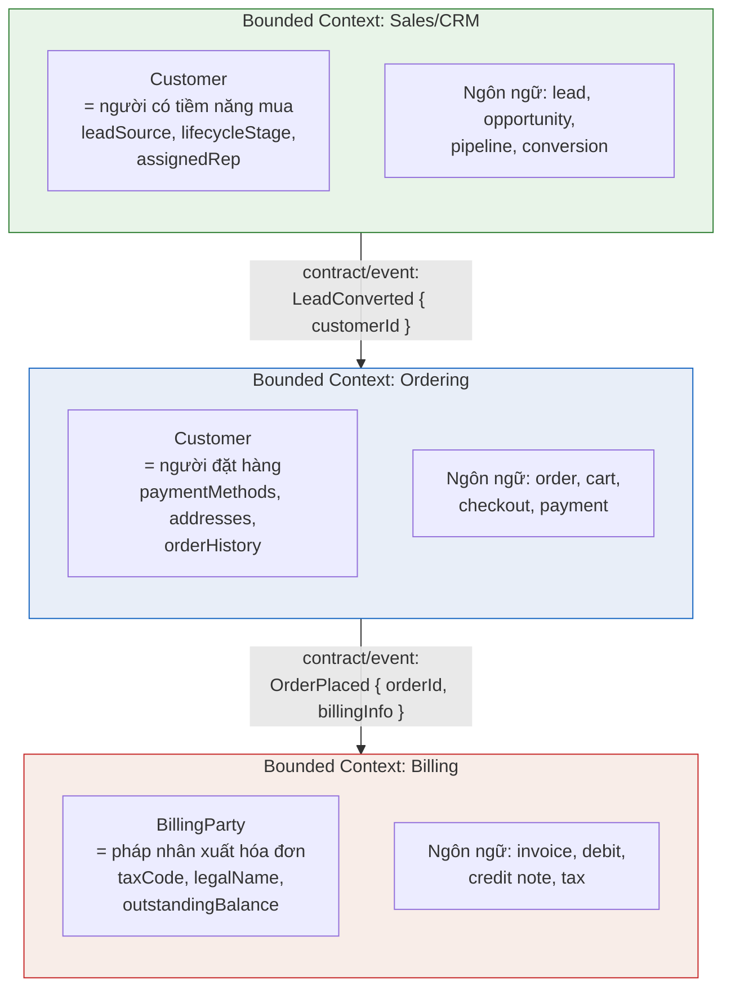
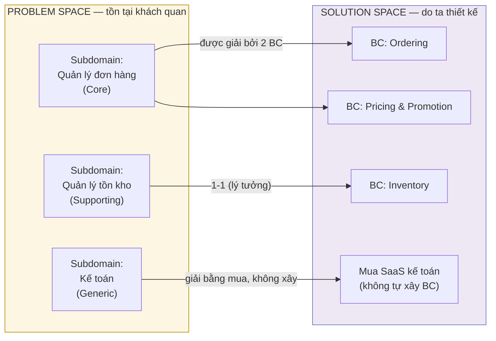
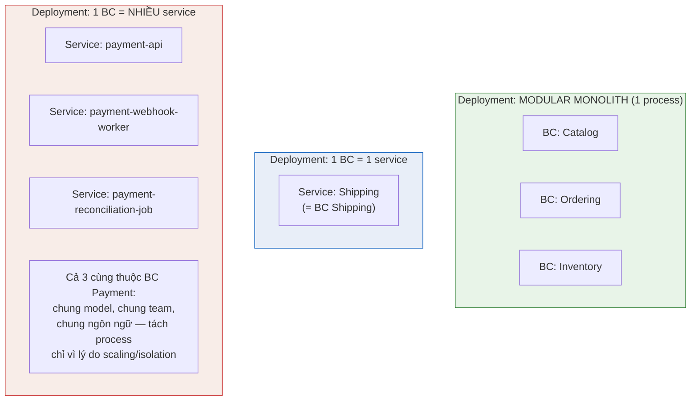
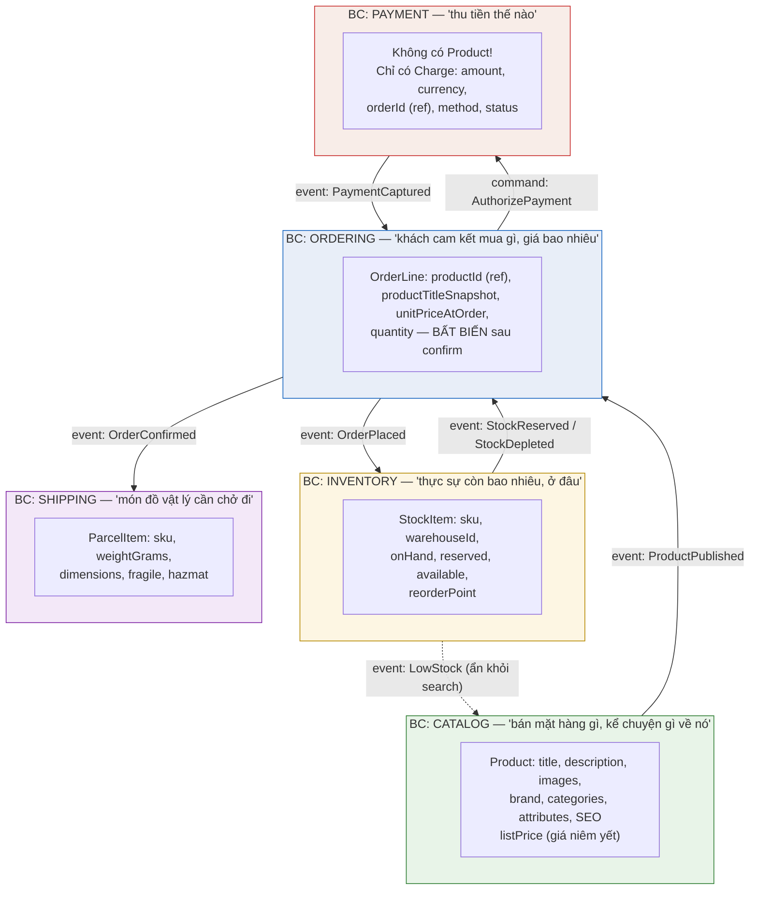
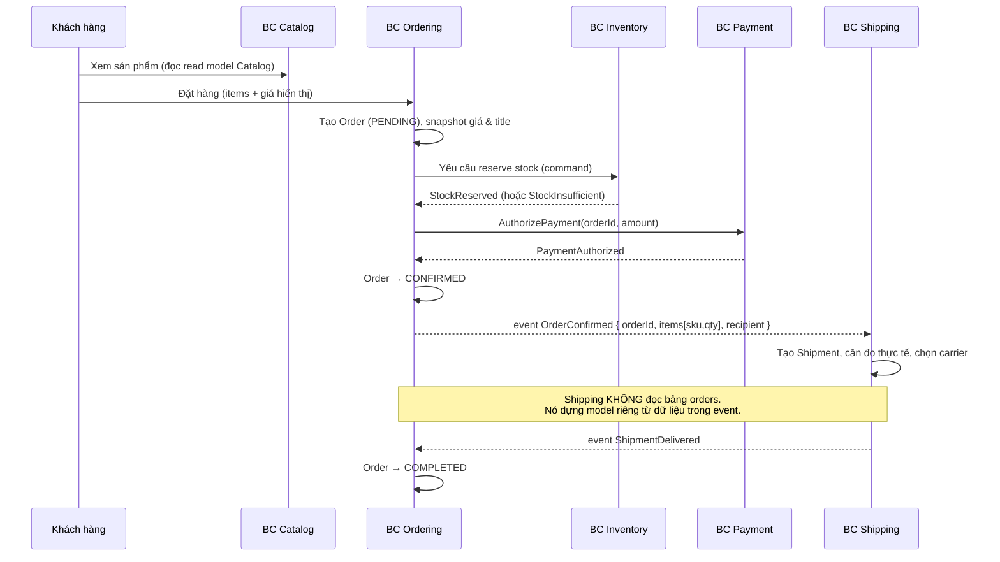

+++
title = "Chương 04 — Bounded Context: Ranh Giới Ngữ Nghĩa Của Model"
date = "2026-07-09T11:00:00+07:00"
draft = false
tags = ["backend", "ddd", "architecture"]
series = ["Domain-Driven Design"]
+++

> **Vị trí chương này trong chuỗi tài liệu:** Ở [chương 02](/series/domain-driven-design/02-domain-va-subdomain/), chúng ta đã mổ xẻ domain và subdomain — tức là *bài toán* mà business đang phải giải. Ở [chương 03](/series/domain-driven-design/03-ubiquitous-language/), chúng ta thống nhất rằng ngôn ngữ chung giữa engineer và domain expert là nền móng của mọi model tốt. Chương này trả lời câu hỏi tiếp theo, và cũng là câu hỏi quan trọng bậc nhất của DDD chiến lược: **ngôn ngữ đó, model đó, có hiệu lực đến đâu? Ranh giới của nó nằm ở chỗ nào?** Nếu bạn chỉ được đọc một chương duy nhất trong toàn bộ phần strategic design, hãy đọc chương này. Chương kế tiếp — [05: Context Mapping](/series/domain-driven-design/05-context-mapping/) — sẽ nói về chuyện gì xảy ra *giữa* các ranh giới đó.

---

## Mục lục chương

1. [Câu chuyện mở đầu: cuộc họp 4 tiếng về chữ "Customer"](#1-câu-chuyện-mở-đầu-cuộc-họp-4-tiếng-về-chữ-customer)
2. [Vì sao Enterprise Model — một model thống nhất cho toàn công ty — luôn thất bại](#2-vì-sao-enterprise-model--một-model-thống-nhất-cho-toàn-công-ty--luôn-thất-bại)
3. [Tại sao DDD đưa ra khái niệm Bounded Context](#3-tại-sao-ddd-đưa-ra-khái-niệm-bounded-context)
4. [Bản chất của Bounded Context: ranh giới ngữ nghĩa, không phải ranh giới kỹ thuật](#4-bản-chất-của-bounded-context-ranh-giới-ngữ-nghĩa-không-phải-ranh-giới-kỹ-thuật)
5. [Một khái niệm — nhiều nghĩa: Order, Customer, Product qua từng context](#5-một-khái-niệm--nhiều-nghĩa-order-customer-product-qua-từng-context)
6. [Bounded Context vs Subdomain: problem space vs solution space](#6-bounded-context-vs-subdomain-problem-space-vs-solution-space)
7. [Bounded Context vs Microservice: KHÔNG phải quan hệ 1-1](#7-bounded-context-vs-microservice-không-phải-quan-hệ-1-1)
8. [Cách xác định ranh giới: linguistic, team, business capability](#8-cách-xác-định-ranh-giới-linguistic-team-business-capability)
9. [Shared Database — kẻ phá hoại ranh giới thầm lặng](#9-shared-database--kẻ-phá-hoại-ranh-giới-thầm-lặng)
10. [Case study: hệ thống e-commerce chia context](#10-case-study-hệ-thống-e-commerce-chia-context)
11. [Ví dụ thiết kế SAI: bảng `products` 80 cột dùng chung](#11-ví-dụ-thiết-kế-sai-bảng-products-80-cột-dùng-chung)
12. [Ví dụ refactor: tách bảng 80 cột thành các context](#12-ví-dụ-refactor-tách-bảng-80-cột-thành-các-context)
13. [Module NestJS / package Go KHÔNG tự động là Bounded Context](#13-module-nestjs--package-go-không-tự-động-là-bounded-context)
14. [Điểm mạnh — Điểm yếu — Trade-off](#14-điểm-mạnh--điểm-yếu--trade-off)
15. [Production Considerations](#15-production-considerations)
16. [Best Practices](#16-best-practices)
17. [Anti-patterns và vì sao chúng nguy hiểm](#17-anti-patterns-và-vì-sao-chúng-nguy-hiểm)
18. [Khi nào KHÔNG nên tách Bounded Context](#18-khi-nào-không-nên-tách-bounded-context)
19. [Tóm tắt cho người bận rộn](#19-tóm-tắt-cho-người-bận-rộn)

---

## 1. Câu chuyện mở đầu: cuộc họp 4 tiếng về chữ "Customer"

Tôi từng ngồi trong một cuộc họp thiết kế hệ thống cho một công ty bán lẻ đa kênh. Mục tiêu buổi họp rất "đơn giản": thống nhất schema cho entity `Customer` dùng chung toàn công ty. Có mặt: team CRM, team Ordering, team Kế toán, team Logistics, và team Data.

Bốn tiếng sau, whiteboard trông như thế này:

- Team **CRM** khăng khăng `Customer` phải có `leadSource`, `lifecycleStage`, `assignedSalesRep`, lịch sử tương tác. Với họ, một "customer" có thể là người *chưa từng mua gì* — chỉ cần để lại số điện thoại là đã thành customer.
- Team **Ordering** nói customer chưa mua hàng thì không phải customer. Họ cần `defaultPaymentMethod`, `shippingAddresses`, `orderHistory`. Và quan trọng: với họ, customer *không được phép xóa* nếu còn đơn hàng đang xử lý.
- Team **Kế toán** chỉ quan tâm `taxCode`, `legalName`, `billingAddress`, công nợ. Họ gọi thứ đó là "khách hàng" nhưng thực chất là *pháp nhân xuất hóa đơn* — một công ty mẹ có thể là một "customer" kế toán duy nhất trong khi CRM đếm 15 người liên hệ.
- Team **Logistics** thậm chí không cần biết customer là ai — họ chỉ cần *một cái tên và một địa chỉ để in lên vận đơn*. Đổi số điện thoại người nhận cho một đơn cụ thể không được phép làm thay đổi "customer" gốc.

Kết cục của buổi họp: một entity `Customer` với **47 field**, trong đó khoảng 40 field là nullable vì "không phải team nào cũng dùng". Sáu tháng sau, không team nào dám sửa entity đó vì không ai biết field nào của ai, migration nào sẽ làm vỡ team nào. Mỗi thay đổi cần họp liên team. Velocity của cả bốn team giảm dần theo từng quý.

**Vấn đề không nằm ở kỹ thuật. Vấn đề nằm ở một giả định sai lầm: rằng tồn tại MỘT khái niệm "Customer" thống nhất cho toàn công ty.** Không tồn tại. Chưa bao giờ tồn tại. Business tự nó đã dùng cùng một từ cho những khái niệm khác nhau — và điều đó *hoàn toàn bình thường* đối với business, chỉ trở thành thảm họa khi engineer cố ép tất cả vào một model.

Bounded Context là câu trả lời của DDD cho vấn đề này. Nhưng trước khi nói về giải pháp, hãy hiểu thật kỹ vì sao con đường "một model cho tất cả" chắc chắn thất bại.

---

## 2. Vì sao Enterprise Model — một model thống nhất cho toàn công ty — luôn thất bại

### 2.1. Problem Statement

Ý tưởng Enterprise Model (hay Canonical Data Model, Unified Model) nghe cực kỳ hợp lý trên giấy:

> "Nếu cả công ty dùng chung một định nghĩa về Customer, Order, Product... thì sẽ không còn chuyện dữ liệu lệch nhau, không còn duplicate, tích hợp giữa các hệ thống sẽ dễ dàng, báo cáo sẽ nhất quán."

Ý tưởng này đã được thử đi thử lại suốt 30 năm — dưới các tên gọi: Enterprise Data Model, Canonical Schema trên ESB, Master Data Management làm "single source of truth" cho *mọi* thuộc tính, "One Platform To Rule Them All". Và nó thất bại lặp đi lặp lại, ở những công ty có ngân sách và nhân tài hàng đầu thế giới. Đây không phải thất bại do thực thi kém. Đây là thất bại do **bản chất bài toán**.

### 2.2. Tại sao thất bại — phân tích từ first principles

**Lý do 1 — Ngữ nghĩa phụ thuộc mục đích sử dụng.** Một model không phải là "bản chụp thực tại". Model là **công cụ giải một bài toán cụ thể**. Bản đồ tàu điện ngầm bóp méo khoảng cách địa lý một cách cố ý — và nhờ thế nó *tốt hơn* bản đồ vệ tinh cho mục đích đi tàu. Không có bản đồ "đúng tuyệt đối", chỉ có bản đồ đúng cho mục đích. Team Kế toán và team CRM giải hai bài toán khác nhau, nên model tối ưu của họ *phải* khác nhau. Ép chung một model nghĩa là ép ít nhất một bên dùng bản đồ sai mục đích.

**Lý do 2 — Model hợp nhất là union của mọi yêu cầu, nên nó là model tồi cho tất cả.** Khi gộp yêu cầu của N team, model kết quả chứa mọi field, mọi ràng buộc, mọi trạng thái của cả N team. Nó không tối ưu cho bất kỳ ai. Entity `Customer` 47 field ở câu chuyện mở đầu là ví dụ: nó *đủ* cho mọi team về mặt dữ liệu, nhưng *sai* cho mọi team về mặt hành vi — invariant của team này là điều vô nghĩa (hoặc cản trở) với team kia.

**Lý do 3 — Chi phí phối hợp tăng theo bình phương.** Với một model dùng chung bởi N team, mỗi thay đổi cần sự đồng thuận của N team. Số kênh giao tiếp cần thiết là N(N-1)/2. Ở 3 team, còn chịu được. Ở 8 team, mọi thay đổi vào model chung trở thành dự án chính trị. Kết quả thực tế quan sát được ở mọi công ty: **model chung bị đóng băng**. Không ai dám sửa. Các team bắt đầu "làm lậu": thêm bảng phụ, thêm JSON column `metadata`, thêm service riêng cache lại dữ liệu theo cách mình muốn. Enterprise Model chết về mặt thực tế nhưng vẫn tồn tại về mặt hình thức — trường hợp tệ nhất có thể.

**Lý do 4 — Business tự nó không thống nhất, và không cần thống nhất.** Đây là điểm mấu chốt mà engineer hay bỏ qua. Phòng Sales và phòng Kế toán đã dùng từ "khách hàng" theo nghĩa khác nhau *hàng chục năm* mà công ty vẫn vận hành tốt. Sự "mâu thuẫn" ngữ nghĩa này không phải là bug của tổ chức — nó là **feature**: mỗi phòng ban tối ưu ngôn ngữ cho công việc của mình. Phần mềm cố "sửa" sự đa nghĩa này là phần mềm đang chống lại cách business vận hành, và business luôn thắng.

**Lý do 5 — Định luật Conway.** Cấu trúc hệ thống phần mềm phản chiếu cấu trúc giao tiếp của tổ chức làm ra nó. Một model thống nhất đòi hỏi một cấu trúc giao tiếp thống nhất — tức mọi team liên quan phải giao tiếp mật thiết, liên tục, với chi phí thấp. Điều đó không tồn tại ở tổ chức trên ~20 người. Bạn không thể dựng một artifact kỹ thuật (unified model) đi ngược lại cấu trúc giao tiếp thực tế của tổ chức và mong nó sống sót. (Chúng ta sẽ quay lại Conway's Law kỹ hơn ở [chương 05](/series/domain-driven-design/05-context-mapping/).)

### 2.3. Câu hỏi kiểm chứng

Mỗi khi ai đó đề xuất "chuẩn hóa một model Customer/Product dùng chung toàn công ty", hãy hỏi bốn câu:

1. **Tại sao** ta tin rằng các team khác nhau có cùng nhu cầu ngữ nghĩa? (Thường là không có bằng chứng, chỉ có mong muốn.)
2. **Đánh đổi gì?** Ta đổi tính nhất quán bề mặt lấy chi phí phối hợp N², model tồi cho mọi bên, và velocity giảm dài hạn.
3. **Không làm thì sao?** Các team giữ model riêng và tích hợp qua contract — đúng là có chi phí translation, nhưng chi phí đó *cục bộ và kiểm soát được*.
4. **Làm sai thì hậu quả gì?** Model chung bị đóng băng, các team làm lậu, dữ liệu "chuẩn" trở thành dữ liệu không ai tin — tình trạng tệ hơn cả trước khi chuẩn hóa.

> **Lưu ý công bằng:** Master Data Management *có* chỗ đứng — cho một tập rất hẹp các thuộc tính định danh (mã số thuế, mã sản phẩm quốc tế GTIN, ID định danh khách hàng để nối dữ liệu). Cái thất bại là việc kéo dài MDM thành "một model đầy đủ dùng chung". Chia sẻ *định danh* thì được; chia sẻ *toàn bộ model và hành vi* thì không.

---

## 3. Tại sao DDD đưa ra khái niệm Bounded Context

Eric Evans quan sát thấy nghịch lý sau ở các dự án lớn:

- Muốn model hữu ích, model phải **thống nhất nội bộ** (internally consistent) — mỗi thuật ngữ chỉ một nghĩa, mỗi khái niệm chỉ một cách biểu diễn, không mâu thuẫn. DDD gọi tính chất này là *unification*.
- Nhưng như phần trên đã chứng minh, **không thể** duy trì tính thống nhất đó trên phạm vi toàn doanh nghiệp — chi phí tăng phi tuyến và ngữ nghĩa vốn dĩ khác nhau giữa các nhóm.

Nếu không thể thống nhất *toàn cục*, và không thống nhất thì model vô dụng, vậy lối thoát là gì? Câu trả lời của Evans mang tính nhảy vọt về tư duy:

> **Đừng cố thống nhất model. Hãy thống nhất model TRONG MỘT RANH GIỚI ĐƯỢC TUYÊN BỐ RÕ RÀNG, và chấp nhận — thậm chí chào đón — việc các ranh giới khác nhau có model khác nhau.**

Tức là: thay vì chiến đấu vô vọng cho một model toàn cục, ta **hạ mục tiêu xuống mức khả thi** (thống nhất cục bộ) và **nâng tính tường minh lên mức tối đa** (ranh giới phải được tuyên bố, vẽ ra, ai cũng biết). Bounded Context chính là ranh giới đó: phạm vi mà trong đó một model cụ thể, một Ubiquitous Language cụ thể, có hiệu lực và được giữ nhất quán.

Điểm tinh tế nhất: Bounded Context không phải là công cụ *chia nhỏ* hệ thống. Nó là công cụ **bảo vệ tính toàn vẹn ngữ nghĩa** của từng model. Việc chia nhỏ chỉ là hệ quả.

---

## 4. Bản chất của Bounded Context: ranh giới ngữ nghĩa, không phải ranh giới kỹ thuật

### 4.1. Định nghĩa làm việc

**Bounded Context là ranh giới (về ngôn ngữ, về code, về team, và thường về dữ liệu) mà bên trong đó một domain model cụ thể được định nghĩa, nhất quán và có hiệu lực. Bước qua ranh giới, cùng một từ có thể mang nghĩa khác, và model bên này không có quyền lực gì với bên kia.**

Hãy chú ý ba tính chất bản chất:

**Thứ nhất — nó là ranh giới của NGHĨA, không phải của dữ liệu.** Câu hỏi định hình Bounded Context không phải "dữ liệu này lưu ở đâu?" mà là "**khi tôi nói từ X trong phòng này, mọi người hiểu là gì?**". Trong context Ordering, "Product" nghĩa là "một thứ có giá, có thể đặt mua". Trong context Shipping, "Product" nghĩa là "một kiện hàng có cân nặng và kích thước". Hai nghĩa, hai model, hai vòng đời — dù ngoài đời chúng trỏ về cùng một chiếc điện thoại trên kệ kho.

**Thứ hai — nó là ranh giới ĐƯỢC TUYÊN BỐ, không phải ranh giới tự phát.** Mọi codebase đều có các "vùng nghĩa" ngầm định — chỗ này `status` nghĩa là trạng thái thanh toán, chỗ kia `status` nghĩa là trạng thái giao hàng. Cái làm nên Bounded Context là việc ranh giới được **nói ra thành lời, vẽ lên context map, và được bảo vệ có chủ đích**: có team sở hữu, có contract ở biên, có quy tắc "model bên trong không rò ra ngoài".

**Thứ ba — bên trong ranh giới, tính nhất quán là LUẬT.** Trong một Bounded Context, không được phép có hai class `Order` mang nghĩa khác nhau, không được phép có hai cách tính `totalAmount`. Nếu bạn phát hiện điều đó đang xảy ra, thì hoặc là model đang mục nát, hoặc là — thú vị hơn — bạn vừa phát hiện ra rằng nơi đó thực chất là *hai* context đang bị nhốt chung một chuồng.

### 4.2. Cách hoạt động — nhìn tổng thể



Ba context, ba model "Customer" khác nhau (context Billing thậm chí không gọi nó là Customer). Giữa các context là **contract tường minh** — event hoặc API — chứ không phải là truy cập trực tiếp vào model của nhau. Mỗi mũi tên trên hình là một quan hệ cần quản trị: đó chính là chủ đề của [chương 05 — Context Mapping](/series/domain-driven-design/05-context-mapping/).

### 4.3. Hệ quả tư duy quan trọng: trùng lặp khái niệm là bình thường, trùng lặp trong một context là bệnh

Nhiều engineer được huấn luyện phản xạ DRY (Don't Repeat Yourself) đến mức thấy hai class `Product` ở hai module là ngứa mắt, muốn gom lại ngay. Bounded Context đảo ngược trực giác đó:

- Hai class `Product` ở **hai context khác nhau** không phải là duplication — chúng là **hai khái niệm khác nhau tình cờ trùng tên**. Gom chúng lại mới là bug.
- Hai class `Product` trong **cùng một context** mới là bệnh — vi phạm tính thống nhất nội bộ.

DRY áp dụng cho *tri thức* (knowledge), không phải cho *chữ giống nhau*. "Product của Catalog" và "Product của Shipping" là hai mảnh tri thức khác nhau. Đây là một trong những điều chỉnh tư duy giá trị nhất mà DDD mang lại cho senior engineer.

---

## 5. Một khái niệm — nhiều nghĩa: Order, Customer, Product qua từng context

Phần này đi sâu vào hiện tượng trung tâm: **polysemy** — một từ, nhiều nghĩa. Đây không phải hiện tượng hiếm; nó là *mặc định* ở mọi doanh nghiệp đủ lớn.

### 5.1. "Order" — sáu bộ mặt của một từ

| Context | "Order" nghĩa là gì | Thuộc tính cốt lõi | Vòng đời | Invariant đặc thù |
|---|---|---|---|---|
| **Ordering / Checkout** | Cam kết mua hàng của khách | line items, tổng tiền, discount, payment status | Placed → Confirmed → Completed/Cancelled | Tổng tiền = Σ(line items) − discount; không sửa items sau khi Confirmed |
| **Fulfillment / Warehouse** | Danh sách món cần nhặt và đóng gói | pick list, vị trí kệ, packing slip | Received → Picking → Packed | Không pick quá số lượng đã reserve |
| **Shipping** | Lô hàng cần vận chuyển | kiện, cân nặng, địa chỉ, carrier, tracking | LabelCreated → InTransit → Delivered | Một order có thể tách thành nhiều shipment |
| **Billing / Accounting** | Căn cứ ghi nhận doanh thu | invoice lines, thuế suất, kỳ kế toán | Invoiced → Paid → (Refunded) | Bút toán bất biến; sửa sai bằng bút toán đảo, không sửa đè |
| **Customer Support** | Chuỗi sự kiện để giải quyết khiếu nại | timeline, tickets liên quan, SLA | mở theo ticket, không có "trạng thái order" riêng | Chỉ đọc; không được thay đổi order thật |
| **Analytics** | Một dòng fact trong data warehouse | denormalized snapshot tại thời điểm đặt | ghi một lần, không sửa | Immutable; đúng-tại-thời-điểm, không đúng-hiện-tại |

Hãy để ý cột **Invariant**: đây là bằng chứng mạnh nhất cho việc phải tách model. Invariant "không sửa items sau khi Confirmed" (Ordering) và invariant "một order tách thành nhiều shipment" (Shipping) không thể sống chung trong một class mà không biến class đó thành một mớ if-else theo "chế độ". Khi các invariant xung đột nhau, đó là ranh giới context đang gào lên đòi được công nhận.

### 5.2. "Customer" — như đã thấy ở câu chuyện mở đầu

Tóm tắt lại bằng góc nhìn model:

- **CRM:** `Customer` là aggregate giàu hành vi vòng đời sales (qualify, convert, churn). Có thể tồn tại mà chưa từng mua gì.
- **Ordering:** `Customer` gần như chỉ là identity + sổ địa chỉ + phương thức thanh toán. Hành vi thật nằm ở `Order`.
- **Billing:** không phải `Customer` mà là `BillingParty` — pháp nhân. Quan hệ nhiều-nhiều với "người" ở CRM.
- **Shipping:** không có customer. Chỉ có `Recipient` — value object gồm tên + số điện thoại + địa chỉ, sống trong từng shipment, sửa được cho từng đơn mà không ảnh hưởng ai.

Điểm cuối rất đáng ngẫm: đôi khi cách model đúng nhất cho "Customer" ở một context là **không model nó**. Shipping không cần khái niệm customer — cố nhét vào chỉ tạo coupling vô ích.

### 5.3. "Product" — sẽ được mổ xẻ toàn diện ở mục 10

Chúng ta dành riêng case study e-commerce (mục 10) cho "Product", vì nó là ví dụ giàu chi tiết nhất. Trước đó, cần làm rõ hai cặp phân biệt mà gần như mọi team đều nhầm: Bounded Context vs Subdomain, và Bounded Context vs Microservice.

---

## 6. Bounded Context vs Subdomain: problem space vs solution space

Đây là **điểm bị nhầm lẫn nhiều nhất trong toàn bộ DDD chiến lược** — kể cả trong sách vở và bài nói hội thảo. Đáng nhầm, vì trong trường hợp lý tưởng chúng trùng nhau 1-1, khiến người ta tưởng chúng là một.

### 6.1. Phân biệt cốt lõi

| | **Subdomain** | **Bounded Context** |
|---|---|---|
| Thuộc về | **Problem space** — không gian bài toán | **Solution space** — không gian giải pháp |
| Là gì | Một mảng hoạt động của business, tồn tại **khách quan** dù có phần mềm hay không | Một ranh giới model **do ta thiết kế** để giải bài toán |
| Ai quyết định | Business quyết định (bằng cách nó vận hành) | Architect/team quyết định (bằng thiết kế) |
| Ta có thể thay đổi không | Không — chỉ có thể *khám phá* nó đúng hay sai | Có — ta vẽ lại ranh giới khi cần |
| Ví dụ | "Công ty này phải quản lý tồn kho" | "Hệ thống Inventory với model riêng, team riêng, ngôn ngữ riêng" |
| Câu hỏi đặc trưng | "Business cần giải quyết những gì?" | "Ta tổ chức model và code thành những vùng nào?" |

Một câu ghi nhớ: **Subdomain là thứ bạn TÌM THẤY. Bounded Context là thứ bạn VẼ RA.** Bạn không "thiết kế" subdomain, cũng không "khám phá" bounded context.

### 6.2. Quan hệ giữa hai bên — không phải lúc nào cũng 1-1



Các cấu hình gặp trong thực tế:

- **1 subdomain ↔ 1 bounded context:** trạng thái lý tưởng, nên hướng tới cho core subdomain.
- **1 subdomain → nhiều bounded context:** subdomain "Quản lý đơn hàng" có thể phức tạp đến mức tách thành BC Ordering và BC Pricing — hai model, hai ngôn ngữ, dù cùng phục vụ một bài toán. Hợp lệ và phổ biến.
- **1 bounded context ôm nhiều subdomain:** thường là dấu hiệu xấu (model phục vụ nhiều bài toán sẽ bị kéo giãn), nhưng chấp nhận được ở hệ thống nhỏ hoặc với các generic subdomain gộp chung. Ví dụ: một BC "Back-office" ôm cả quản lý user nội bộ lẫn cấu hình hệ thống.
- **Subdomain không có bounded context nào:** vì ta mua ngoài (SaaS kế toán) — quyết định *không xây* cũng là một quyết định solution space.

### 6.3. Vì sao nhầm lẫn này nguy hiểm trong thực tế

Hậu quả thực tế của việc đánh đồng hai khái niệm:

**Nhầm kiểu 1 — coi bounded context là "khách quan", đi "tìm" nó như tìm subdomain.** Team ngồi tranh cãi bất tận "ranh giới ĐÚNG của context là gì" như thể có đáp án duy nhất trong tự nhiên. Không có. Bounded context là quyết định thiết kế với trade-off; câu hỏi đúng là "ranh giới nào *phù hợp nhất* với đội hình team, mức độ thay đổi, và chiến lược của ta *lúc này*" — và câu trả lời được phép thay đổi theo thời gian.

**Nhầm kiểu 2 — coi subdomain là thứ tùy ý vẽ.** Team "quyết định" rằng công ty mình không có subdomain tồn kho vì... không thích làm. Subdomain không biến mất chỉ vì bạn không model nó — nó sẽ quay lại dưới dạng những cục logic tồn kho rải rác trong BC Ordering, không ai sở hữu, không ai hiểu toàn cảnh.

**Nhầm kiểu 3 — ánh xạ máy móc phân loại core/supporting/generic sang chất lượng code.** Phân loại core/supporting/generic là thuộc tính của *subdomain* (bài toán), giúp quyết định đầu tư: core thì xây kỹ với đội mạnh nhất, generic thì mua. Nó không tự động quy định kiến trúc bên trong từng BC. Một BC giải supporting subdomain vẫn cần ranh giới sạch — nó chỉ không cần model tinh xảo bằng.

> **Quy tắc bỏ túi:** Khi thảo luận, hãy tự hỏi "câu này đang nói về bài toán hay về giải pháp?". "Chúng ta có cần tính phí ship theo vùng không?" — problem space, hỏi business. "Logic tính phí ship nên nằm ở BC Shipping hay BC Ordering?" — solution space, hỏi architect. Trộn hai loại câu hỏi trong một cuộc tranh luận là nguồn gốc của 90% cuộc họp không lối ra.

---

## 7. Bounded Context vs Microservice: KHÔNG phải quan hệ 1-1

Nhầm lẫn phổ biến thứ hai, và đắt tiền hơn nhiều: **"mỗi bounded context = một microservice"**. Câu này sai theo cả hai chiều.

### 7.1. Vì sao người ta hay đánh đồng

Có lý do lịch sử: phong trào microservices (~2014) mượn DDD làm công cụ trả lời câu hỏi "cắt service theo đường nào?". Câu trả lời "cắt theo bounded context" tốt hơn hẳn "cắt theo entity" (kiểu UserService, ProductService, OrderService — thảm họa distributed CRUD). Nhưng "bounded context là *đường cắt tốt* cho microservice" bị truyền miệng thành "bounded context *là* microservice". Từ một heuristic đúng thành một đẳng thức sai.

### 7.2. Phân biệt bản chất

- **Bounded Context là ranh giới NGỮ NGHĨA / THIẾT KẾ** — trả lời câu hỏi "model nào có hiệu lực ở đâu, từ này nghĩa là gì ở đây". Nó tồn tại độc lập với cách deploy.
- **Microservice là ranh giới TRIỂN KHAI / VẬN HÀNH** — trả lời câu hỏi "cái gì được deploy, scale, fail độc lập với cái gì". Nó là quyết định về process, network, và operations.

Hai loại ranh giới này *có thể* trùng nhau, nhưng không *bắt buộc* trùng nhau:



**Hợp lệ: nhiều BC trong một monolith.** Ba context Catalog, Ordering, Inventory sống trong cùng một process, mỗi context một module với ranh giới ngữ nghĩa nghiêm ngặt, giao tiếp qua interface tường minh. Đây là modular monolith — với đa số công ty, đây là điểm khởi đầu *đúng*. Bạn nhận được 80% lợi ích của bounded context (model sạch, ngôn ngữ rõ, team tự chủ về thiết kế) mà không trả chi phí distributed systems (network partition, eventual consistency, distributed tracing, on-call phức tạp).

**Hợp lệ: một BC gồm nhiều service.** BC Payment có thể gồm ba deployable: API đồng bộ, worker xử lý webhook, job đối soát chạy đêm. Chúng chung model, chung team, chung ngôn ngữ — chỉ tách process vì đặc tính vận hành khác nhau (latency-sensitive vs throughput-oriented vs batch). Vẫn là *một* bounded context.

**KHÔNG hợp lệ: một service chứa nhiều model lẫn lộn không ranh giới.** Đó không phải "một BC lớn" — đó là big ball of mud có REST API.

### 7.3. Hệ quả thực tiễn — thứ tự quyết định đúng

1. **Xác định bounded context trước** — thuần túy bằng phân tích ngữ nghĩa, team, business capability (mục 8). Chưa nói gì đến deploy.
2. **Chọn deployment topology sau** — dựa trên nhu cầu *vận hành*: scale độc lập? fault isolation? tech stack khác? team release độc lập? Nếu không có nhu cầu nào đủ mạnh, để chung process.
3. **Ranh giới BC là bất biến thiết kế; topology là quyết định có thể đổi.** Tách một BC từ monolith ra service riêng là việc *tương đối* an toàn *nếu* ranh giới ngữ nghĩa đã sạch từ trước. Ngược lại, gộp hai service vốn chung một BC lại thành một cũng dễ. Cái đắt nhất là **vẽ lại ranh giới ngữ nghĩa** — dù trong monolith hay giữa các service.

**Không áp dụng phân biệt này thì sao?** Bạn sẽ rơi vào một trong hai hố: (a) tách 40 microservice theo entity/bảng, mỗi request đi qua 8 service, mọi thay đổi business chạm 5 repo — distributed monolith; hoặc (b) sợ hố (a) nên giữ monolith nhưng không giữ ranh giới bên trong — big ball of mud. Cả hai đều bắt nguồn từ việc trộn câu hỏi ngữ nghĩa với câu hỏi triển khai.

> **Kinh nghiệm 20 năm gói trong một câu:** ranh giới ngữ nghĩa sai thì microservices biến nó thành thảm họa phân tán, monolith biến nó thành thảm họa tập trung — công cụ deploy không cứu được thiết kế. Ngược lại, ranh giới ngữ nghĩa đúng thì deploy kiểu gì cũng sống được.

---

## 8. Cách xác định ranh giới: linguistic, team, business capability

Đây là phần "làm thế nào". Không có thuật toán cơ học, nhưng có ba lăng kính hội tụ — khi cả ba chỉ về cùng một đường cắt, bạn có thể tự tin cao độ.

### 8.1. Lăng kính 1 — Linguistic boundary (ranh giới ngôn ngữ)

Nguyên lý: **ranh giới context nằm ở chỗ nghĩa của từ thay đổi**. Cách dò:

**Dấu hiệu A — cùng từ, khác nghĩa (polysemy).** Ngồi với domain expert của hai phòng ban, hỏi cùng một câu: "Một Product có thể hết hàng không?". Người Catalog nói "Product không bao giờ hết hàng, nó chỉ là thông tin mô tả". Người Inventory nói "tất nhiên, đó là chuyện tôi lo cả ngày". Hai câu trả lời trái ngược cho cùng một từ → hai context.

**Dấu hiệu B — cùng nghĩa, khác từ (synonymy).** Team A gọi "shipment", team B gọi "delivery", team C gọi "consignment" cho cùng một thứ. Thường tiết lộ các nhóm ngôn ngữ khác nhau đã hình thành tự nhiên → ứng viên ranh giới.

**Dấu hiệu C — từ cần tính từ bổ nghĩa để khỏi hiểu lầm.** Khi mọi người trong họp phải nói "à ý tôi là *sales* order chứ không phải *purchase* order", "customer theo nghĩa *kế toán*" — ngôn ngữ đang tự vá víu cho sự thiếu vắng ranh giới. Mỗi cụm tính từ ổn định ("billing customer", "shipping address rules") là một context tiềm năng.

**Dấu hiệu D — trong code: field vô nghĩa theo ngữ cảnh.** Mở entity ra và hỏi từng field: "nghiệp vụ nào đọc/ghi field này?". Nếu câu trả lời chia entity thành các cụm field rời nhau (cluster A chỉ dùng bởi luồng catalog, cluster B chỉ dùng bởi luồng kho) — entity đó đang là nơi giam giữ nhiều model.

**Dấu hiệu E — trạng thái enum "nở" theo nhiều trục.** `OrderStatus` có 23 giá trị trộn lẫn `PAYMENT_PENDING`, `PICKING`, `SHIPPED`, `INVOICE_ISSUED`, `REFUND_REQUESTED`? Đó là 4 state machine của 4 context bị ép chung một enum. Mỗi trục trạng thái độc lập là một context tiềm năng.

### 8.2. Lăng kính 2 — Team boundary (ranh giới tổ chức)

Nguyên lý: **một bounded context nên được sở hữu bởi đúng một team; một team có thể sở hữu vài context, nhưng một context không nên bị chia cho nhiều team.**

Lý do từ first principles: tính thống nhất nội bộ của model chỉ duy trì được khi những người sửa model giao tiếp với nhau *hàng ngày, chi phí thấp*. Đó chính là định nghĩa của một team. Hai team sửa chung một model thì model sẽ phân mảnh ngữ nghĩa trong vòng vài quý — Conway's Law không phải là lời khuyên, nó là lực hấp dẫn.

Cách dò theo lăng kính này:

- **Ai trả lời được câu hỏi nghiệp vụ?** Nếu mọi thắc mắc về pricing đều phải hỏi chị A team X, còn thắc mắc về tồn kho phải hỏi anh B team Y — ranh giới tri thức đã tồn tại, hãy công nhận nó.
- **Luồng phê duyệt thay đổi.** Thay đổi nào cần một team duyệt → trong một context. Thay đổi nào cần hai team ngồi lại thương lượng → đang vắt qua ranh giới (và nên biến cuộc thương lượng đó thành contract tường minh — chương 05).
- **Cảnh giác chiều ngược lại:** đừng để cấu trúc team *hiện tại* (vốn có thể là kết quả của lịch sử tuyển dụng lộn xộn) đóng đinh ranh giới ngữ nghĩa sai. Nếu lăng kính linguistic và capability cùng chỉ ra ranh giới khác với đội hình team hiện tại, phương án đúng thường là **đổi đội hình team** (Inverse Conway Maneuver) chứ không phải bẻ cong model theo team.

### 8.3. Lăng kính 3 — Business capability (năng lực nghiệp vụ)

Nguyên lý: **cắt theo "khả năng làm được việc gì" của business, không cắt theo dữ liệu, không cắt theo layer kỹ thuật.**

Một business capability là một việc business làm được, có đầu vào — đầu ra — thước đo riêng: "định giá sản phẩm", "quản lý tồn kho", "thực hiện giao hàng", "thu tiền". Đặc điểm nhận dạng capability tốt:

- Diễn đạt bằng **động từ nghiệp vụ**, không phải danh từ dữ liệu. "Fulfill orders" là capability; "Order data" không phải.
- Có **KPI riêng**: tỉ lệ giao đúng hẹn (Shipping), độ chính xác tồn kho (Inventory), conversion rate (Catalog/Search). KPI khác nhau → áp lực tiến hóa khác nhau → nên tách model để mỗi bên tiến hóa theo nhịp riêng.
- **Ổn định hơn quy trình và cơ cấu tổ chức.** Công ty tái cơ cấu phòng ban thường xuyên, nhưng "phải thu được tiền" và "phải giao được hàng" thì bất biến hàng thập kỷ. Ranh giới bám theo capability sẽ bền hơn ranh giới bám theo sơ đồ tổ chức tháng này.

Anti-pattern đối chiếu: cắt theo **layer kỹ thuật** ("API context", "database context", "frontend context") hoặc theo **entity** ("User context" chứa mọi thứ đụng đến user). Cả hai đều đảm bảo mọi thay đổi nghiệp vụ vắt ngang tất cả các "context" — tức là bạn không có bounded context nào cả, chỉ có big ball of mud được sắp xếp ngăn nắp.

### 8.4. Quy trình thực dụng khi ba lăng kính mâu thuẫn

Thực tế ba lăng kính không phải lúc nào cũng hội tụ. Thứ tự ưu tiên tôi dùng:

1. **Linguistic là trọng tài cuối cùng cho ranh giới ngữ nghĩa** — vì nó phản ánh bản chất bài toán. Nếu nghĩa của từ khác nhau, model *phải* khác nhau, bất kể team hay capability nói gì.
2. **Capability quyết định độ thô của đường cắt** — linguistic có thể chỉ ra 15 vi-sai ngữ nghĩa, nhưng không phải vi-sai nào cũng đáng một context riêng; gom theo capability để có số context quản trị được.
3. **Team là ràng buộc thực thi** — ranh giới đẹp mấy mà không có team sở hữu thì chỉ là hình vẽ. Nếu chỉ có 2 team, đừng vẽ 9 context; hãy vẽ 3-4 context và ghi chú các đường tách tương lai.

Công cụ workshop hiệu quả nhất cho việc này theo kinh nghiệm của tôi: **EventStorming** (big picture) — trải toàn bộ domain event lên tường, các cụm event + các điểm "đổi ngôn ngữ" trong cuộc thảo luận sẽ lộ ra ranh giới tự nhiên nhanh hơn bất kỳ buổi phân tích schema nào.

---

## 9. Shared Database — kẻ phá hoại ranh giới thầm lặng

### 9.1. Problem Statement

Đây là tình huống tôi gặp ở *đa số* công ty tự nhận "đã áp dụng DDD": code chia module/service đẹp đẽ theo context — Catalog, Ordering, Inventory — nhưng tất cả trỏ vào **cùng một database, đọc ghi cùng những bảng**. Team tự hào về kiến trúc. Rồi một ngày team Catalog thêm ràng buộc NOT NULL vào cột `weight` của bảng `products`, và service Ordering sập lúc 2 giờ sáng.

Câu hỏi đặt ra: nếu các context đã tách ở tầng code, tại sao shared database vẫn phá hỏng mọi thứ?

### 9.2. Bản chất: schema là model, và database biến model thành contract ngầm

Trả lời từ first principles: **ranh giới của bounded context là ranh giới của model, và schema database chính là một dạng biểu diễn của model.** Khi hai context đọc ghi chung một bảng, chúng đang **chia sẻ model** — bất kể code được xếp vào thư mục nào. Ranh giới trên sơ đồ kiến trúc là giả; ranh giới thật nằm ở chỗ dữ liệu.

Cụ thể, shared database phá hoại theo bốn cơ chế:

**Cơ chế 1 — Coupling cấu trúc không nhìn thấy.** Mọi cột, mọi kiểu dữ liệu, mọi constraint của bảng chung trở thành **contract công khai giữa các context — nhưng là contract không được tuyên bố, không versioning, không ai review**. API thay đổi thì có contract test bắt được; schema chung thay đổi thì chỉ có production bắt được. Đây là lý do sự cố "NOT NULL lúc 2 giờ sáng" ở trên: team Catalog không hề biết Ordering ghi vào bảng đó với `weight = null`.

**Cơ chế 2 — Phá tính thống nhất ngữ nghĩa bằng cách ép chung một biểu diễn.** Bảng chung buộc mọi context chấp nhận *một* cách biểu diễn. Catalog muốn `price` là cấu trúc phức tạp (giá theo phân khúc, theo thời gian); Ordering chỉ cần giá chốt tại thời điểm đặt. Bảng chung ép cả hai vào một cột `price DECIMAL` — cả hai model đều bị thui chột. Tệ hơn: khi Ordering đọc `products.price` *lúc fulfil đơn* thay vì lúc đặt đơn, giá thay đổi giữa chừng sẽ tính sai tiền — bug ngữ nghĩa kinh điển của shared table, compiler và test đều không bắt được.

**Cơ chế 3 — Vô hiệu hóa invariant của aggregate.** Context Ordering bảo vệ invariant "không sửa line items sau khi confirm" bằng logic trong aggregate. Nhưng nếu context khác (hoặc một anh backend "fix nhanh" bằng SQL console) ghi thẳng vào bảng `order_items`, invariant bị bypass hoàn toàn. Database chung nghĩa là **quyền ghi không kiểm soát được** — mọi công sức thiết kế aggregate trở thành trang trí.

**Cơ chế 4 — Đóng băng tiến hóa.** Muốn refactor model Catalog? Phải kiểm tra xem Ordering, Inventory, Reporting, và ba cái cron job không ai nhớ có đọc bảng này không. Không ai dám chắc → không ai dám sửa → schema chung trở thành tầng trầm tích. Đây chính là số phận của Enterprise Model (mục 2) tái hiện ở tầng dữ liệu.

### 9.3. Nguyên tắc và các mức thực dụng

Nguyên tắc chuẩn: **mỗi bounded context sở hữu dữ liệu của mình; không context nào đọc/ghi trực tiếp vào dữ liệu của context khác; mọi trao đổi đi qua contract (API, event, published language).**

Lưu ý quan trọng cho người làm thực tế — "database riêng" không nhất thiết là "server riêng". Các mức tách, từ nhẹ đến nặng:

| Mức | Cách làm | Ngăn được gì | Phù hợp |
|---|---|---|---|
| 0 | Chung bảng, chung schema | Không ngăn được gì — đây là shared database đúng nghĩa | Không khuyến nghị giữa các context |
| 1 | Chung DB instance, **mỗi context một schema/namespace riêng**, user DB riêng không có quyền cross-schema | Ngăn coupling cấu trúc và ghi chéo; chưa ngăn join lén nếu cấp quyền ẩu | Modular monolith — điểm khởi đầu tốt |
| 2 | Mỗi context một database riêng trên hạ tầng chung | Như mức 1 + ngăn tuyệt đối join chéo | Đa số hệ thống vừa |
| 3 | Mỗi context DB riêng, công nghệ tùy chọn (Postgres/Redis/Elasticsearch...) | Tự do tiến hóa hoàn toàn | Hệ scale lớn, team đông |

Điều thực sự quan trọng không phải số server, mà là **kỷ luật quyền truy cập**: context A không có credential để chạm vào dữ liệu của context B. Kỷ luật này phải được thực thi bằng cơ chế (grant, network policy, lint kiến trúc) chứ không phải bằng lời hứa.

**Còn Reporting/Analytics thì sao?** Nhu cầu "join dữ liệu mọi context để báo cáo" là chính đáng — nhưng lời giải không phải shared database, mà là mỗi context **publish dữ liệu ra** (event stream, CDC → data warehouse), và analytics xây model *riêng của nó* (chính analytics cũng là một context, với model dạng fact/dimension). Đừng để nhu cầu đọc báo cáo trở thành cái cớ giữ shared database cho luồng transactional.

**Đánh đổi phải trả khi tách dữ liệu (nói thẳng, không tô hồng):**
- Mất JOIN chéo context → phải composition ở tầng ứng dụng hoặc build read model riêng. Tốn công thật.
- Mất transaction ACID chéo context → phải chấp nhận eventual consistency + saga/outbox cho luồng liên context. Độ phức tạp tăng đáng kể ([chương 13](/series/domain-driven-design/13-ddd-va-distributed-systems/) bàn kỹ).
- Dữ liệu duplicate có kiểm soát giữa các context → cần cơ chế đồng bộ qua event và chấp nhận độ trễ.

Nếu hệ của bạn nhỏ (một team, vài module), các chi phí này có thể chưa đáng trả — xem mục 18. Nhưng hãy trả lời trung thực: bạn đang *chọn* hoãn tách dữ liệu như một trade-off có ý thức, hay đang *trôi* vào shared database vì tiện?

---

## 10. Case study: hệ thống e-commerce chia context

Đây là ví dụ xương sống của chương. Hệ thống e-commerce cỡ vừa (nghĩ đến một sàn bán lẻ nội địa: vài trăm nghìn SKU, vài chục nghìn đơn/ngày), chia thành 5 bounded context: **Catalog, Ordering, Inventory, Shipping, Payment**.

### 10.1. Bức tranh tổng thể



### 10.2. Cùng là "Product" — năm model khác nhau

Đây là trái tim của case study. Cùng một chiếc "iPhone 15 Pro 256GB Titan Tự Nhiên" ngoài đời:

| | Catalog | Ordering | Inventory | Shipping | Payment |
|---|---|---|---|---|---|
| **Tên khái niệm** | `Product` | `OrderLine` (product chỉ là snapshot) | `StockItem` | `ParcelItem` | *(không tồn tại)* |
| **Nó là gì** | Nội dung để bán và tìm kiếm | Cam kết thương mại tại một thời điểm | Số đếm vật lý tại một kho | Vật thể có khối lượng cần vận chuyển | — |
| **Identity** | `productId` | `orderId + lineNo` | `sku + warehouseId` | `parcelId + lineNo` | — |
| **Giá** | `listPrice` — có thể đổi mỗi giờ | `unitPriceAtOrder` — **đóng băng vĩnh viễn** | không có giá | khai giá trị để bảo hiểm | `amount` tổng, không quan tâm từng món |
| **Có thể "hết" không** | Không — chỉ có `published/unpublished` | Không — line đã đặt là đã đặt | **Có** — đây là toàn bộ lẽ sống của nó | Không | — |
| **Ai sửa được** | Team content/merchandising | Không ai, sau confirm | Hệ thống kho + kiểm kê | Nhân viên đóng gói (cân thực tế) | — |
| **Tần suất thay đổi model** | Cao (thuộc tính mới, SEO, biến thể) | Thấp (nghiệp vụ đặt hàng ổn định) | Trung bình | Thấp | Trung bình (phương thức thanh toán mới) |

Bốn quan sát rút ra:

**Một — Snapshot thay vì reference sống.** `OrderLine` lưu `productTitleSnapshot` và `unitPriceAtOrder` thay vì join sang Catalog lúc cần. Vì sao? Vì **đơn hàng là tài liệu pháp lý tại một thời điểm** — khách mua với giá 29.990.000₫ thì hóa đơn mãi mãi là 29.990.000₫, dù Catalog tăng giá ngay phút sau. Nếu dùng shared database và join lấy giá hiện hành, bạn có bug sai tiền — loại bug làm mất niềm tin khách hàng và tiền thật. Ranh giới context ở đây không phải "kiến trúc đẹp", nó là **tính đúng đắn nghiệp vụ**.

**Hai — Identity khác nhau tiết lộ model khác nhau.** Catalog định danh bằng `productId`. Inventory định danh bằng `sku + warehouseId` — cùng SKU ở hai kho là hai StockItem, vì tồn kho là thuộc tính của *vị trí*. Không cách gì ép hai identity scheme này vào một entity mà không làm hỏng một trong hai.

**Ba — Sự vắng mặt cũng là thiết kế.** Payment không có khái niệm product. Nó thu 31.240.000₫ cho order X — xong. Nếu ai đó "cho đủ" thêm quan hệ Payment→Product, mỗi thay đổi model product sẽ lan sang hệ thanh toán, hệ nhạy cảm nhất về compliance, để đổi lấy đúng con số 0 giá trị.

**Bốn — Tần suất thay đổi khác nhau biện minh cho ranh giới.** Catalog đổi model liên tục theo nhu cầu marketing; Ordering cần ổn định như bàn thạch. Nhốt chung một model nghĩa là mỗi lần marketing thêm thuộc tính SEO, bạn phải regression test luồng đặt hàng. Tách context = tách nhịp tiến hóa.

### 10.3. Luồng nghiệp vụ xuyên context: đặt hàng



Chú ý điểm ghi trong Note: khi Shipping nhận `OrderConfirmed`, nó **không quay lại query database của Ordering**. Toàn bộ dữ liệu nó cần nằm trong event (hoặc lấy qua API công khai của Ordering), và nó **dịch** sang model riêng (`Shipment`, `ParcelItem`, `Recipient`). Ordering có refactor nội bộ kiểu gì, Shipping không hề hấn — miễn contract event giữ nguyên. Đây chính là điều shared database không bao giờ cho bạn.

### 10.4. Phiên bản scale lớn: các context tiếp tục phân bào

Khi hệ thống lớn lên (hàng triệu SKU, trăm nghìn đơn/ngày, 15+ team), các context trên sẽ tách tiếp — và điều đó lành mạnh:

- **Catalog** tách ra **Search & Discovery** (model tối ưu cho Elasticsearch, ngôn ngữ là "relevance, ranking, facet") và **Pricing & Promotion** (ngôn ngữ là "campaign, price rule, flash sale" — với sàn lớn đây là core subdomain đúng nghĩa, có team riêng).
- **Ordering** tách ra **Cart** (dữ liệu nóng, sống ngắn, chấp nhận mất mát nhất định) và **Order Management** (dữ liệu pháp lý, sống dài, không được mất).
- **Inventory** tách ra **Warehouse Operations** (pick/pack, vị trí kệ, ca kíp — bài toán vận hành vật lý) khỏi **Stock Availability** (con số available phục vụ bán hàng — bài toán đếm với độ trễ thấp).

Nhận xét quan trọng: các đường tách này *không đoán trước được* từ ngày đầu, và **không cần đoán trước**. Chúng lộ ra khi ngôn ngữ trong team bắt đầu phân hóa ("stock theo nghĩa vận hành kho hay theo nghĩa hiển thị web?") — đúng lúc đó mới tách. Bounded context là living design, không phải bản vẽ đóng khung ngày kickoff.

---

## 11. Ví dụ thiết kế SAI: bảng `products` 80 cột dùng chung

Bây giờ nhìn mặt còn lại. Đây là thiết kế tôi gặp nhiều lần trong đời, ở những công ty rất khác nhau — nó phổ biến đến mức đáng được giải phẫu chi tiết.

### 11.1. Hiện trường

Một bảng `products` — trái tim của hệ thống, mọi module đều đọc ghi:

```sql
CREATE TABLE products (
    id                      BIGINT PRIMARY KEY,
    -- Cụm Catalog (team Content sở hữu... trên lý thuyết)
    name                    VARCHAR(500),
    slug                    VARCHAR(500),
    description             TEXT,
    short_description       TEXT,
    brand_id                BIGINT,
    category_id             BIGINT,
    meta_title              VARCHAR(255),        -- SEO
    meta_description        VARCHAR(500),        -- SEO
    images                  JSON,
    attributes              JSON,                -- "thuộc tính động", không ai biết schema
    -- Cụm Pricing (team nào sở hữu? không rõ)
    price                   DECIMAL(15,2),       -- giá gì? niêm yết? sale? không ai chắc
    original_price          DECIMAL(15,2),
    cost_price              DECIMAL(15,2),       -- giá vốn — lộ cho cả frontend đọc!
    sale_price              DECIMAL(15,2),
    sale_start_at           TIMESTAMP,
    sale_end_at             TIMESTAMP,
    -- Cụm Inventory
    stock_quantity          INT,                 -- kho nào?? tổng mọi kho??
    reserved_quantity       INT,
    low_stock_threshold     INT,
    warehouse_location      VARCHAR(100),        -- chỉ đúng khi có 1 kho (hết đúng từ 2022)
    allow_backorder         BOOLEAN,
    -- Cụm Shipping
    weight                  DECIMAL(10,3),
    width                   DECIMAL(10,2),
    height                  DECIMAL(10,2),
    length                  DECIMAL(10,2),
    is_fragile              BOOLEAN,
    shipping_class          VARCHAR(50),
    -- Cụm Tax/Accounting
    tax_class               VARCHAR(50),
    tax_rate                DECIMAL(5,2),        -- duplicate với bảng tax_rules, lệch nhau từ lâu
    accounting_code         VARCHAR(50),
    -- Cụm Marketplace (thêm 2023 khi mở bán trên sàn ngoài)
    marketplace_sku         VARCHAR(100),
    marketplace_price       DECIMAL(15,2),
    marketplace_sync_status VARCHAR(20),
    -- Cụm trạng thái — enum trộn nhiều trục
    status                  VARCHAR(30),         -- draft/active/out_of_stock/discontinued/
                                                 -- pending_review/hidden/deleted...
    is_active               BOOLEAN,             -- quan hệ với status? 3 dev, 4 câu trả lời
    is_featured             BOOLEAN,
    is_new                  BOOLEAN,             -- "new" theo định nghĩa của ai?
    -- ... thêm ~35 cột nữa cùng thể loại, tổng cộng 80 ...
    created_at              TIMESTAMP,
    updated_at              TIMESTAMP,
    deleted_at              TIMESTAMP            -- soft delete... nhưng vài luồng quên filter
);
```

### 11.2. Giải phẫu: vì sao đây là thảm họa, từng triệu chứng một

**Triệu chứng 1 — `status` trộn nhiều state machine.** `out_of_stock` (trục tồn kho) đứng cạnh `pending_review` (trục biên tập nội dung) và `discontinued` (trục vòng đời thương mại). Một sản phẩm có thể *đồng thời* hết hàng VÀ đang chờ duyệt nội dung — nhưng cột chỉ chứa được một giá trị. Kết quả thực tế: sản phẩm hết hàng, nhân viên kho set `out_of_stock`, đè mất trạng thái `pending_review`, sản phẩm chưa duyệt nội dung tự động hiện lên web khi có hàng lại. Bug này *không thể fix triệt để* trong thiết kế này — chỉ có thể vá bằng thêm cờ boolean (và bảng này đã có `is_active` là kết quả của một lần vá như thế).

**Triệu chứng 2 — `stock_quantity` là con số dối trá.** Khi công ty mở kho thứ hai, con số này trở thành "tổng mọi kho" — vô dụng cho việc hứa ngày giao (cần biết kho *nào* có hàng) và cho vận hành kho. Team Inventory bèn tạo bảng `warehouse_stocks` riêng, nhưng *không dám bỏ* cột cũ vì 14 chỗ trong code và 3 cái báo cáo đang đọc nó. Từ đó tồn tại hai nguồn số tồn kho, lệch nhau, và câu cửa miệng của CS là "anh check giúp em số nào đúng".

**Triệu chứng 3 — Ghi đè chéo và lock contention.** Nhân viên content sửa description, hệ thống kho cập nhật `stock_quantity` mỗi khi có đơn, cron đồng bộ marketplace ghi `marketplace_sync_status` mỗi 5 phút — tất cả `UPDATE products SET ... WHERE id = ?`. Ba luồng nghiệp vụ không liên quan gì nhau tranh nhau lock trên cùng row. ORM nào dùng "save cả object" (rất phổ biến) còn gây lost update: content editor mở form lúc 9:00, bấm lưu lúc 9:05, đè `stock_quantity` bằng giá trị cũ lúc 9:00. Đơn hàng oversell. Truy vết mất ba ngày vì "không ai đụng vào tồn kho cả".

**Triệu chứng 4 — Rò rỉ dữ liệu nhạy cảm.** `cost_price` (giá vốn) nằm cùng bảng với dữ liệu hiển thị web. Chỉ cần một endpoint serialize thiếu cẩn thận (`SELECT *` + toJSON) là giá vốn lộ ra API công khai. Đã xảy ra. Ở thiết kế đúng, giá vốn thuộc context Procurement/Accounting và *về mặt vật lý* không nằm trong tầm với của code phục vụ web.

**Triệu chứng 5 — Không ai sở hữu, nên không ai dám sửa.** Hỏi "team nào own bảng `products`?" và nhận về sự im lặng. Migration lên bảng này cần thông báo cho 5 team, test regression 4 luồng. Kết quả: mọi nhu cầu mới được giải bằng cách *thêm cột nullable* hoặc *nhét vào JSON `attributes`* — bảng phình từ 40 cột (2019) lên 80 cột (2024), và đà này không có điểm dừng. Đây chính là Enterprise Model chết từ từ như mô tả ở mục 2 — hiện hình bằng DDL.

**Điểm cần thẳng thắn:** thiết kế này *không* ra đời vì team ngu ngốc. Nó ra đời vì ở năm thứ nhất, một bảng products là thiết kế *hợp lý* — hệ nhỏ, một team, một kho. Sai lầm không nằm ở điểm xuất phát; sai lầm nằm ở chỗ **không ai công nhận các ranh giới ngữ nghĩa khi chúng xuất hiện** (kho thứ hai, kênh marketplace, team content tách riêng) — mỗi lần như vậy chỉ thêm cột thay vì tách model. Bounded context không phải để phán xét quá khứ; nó là kỷ luật nhận diện *thời điểm phải tách*.

---

## 12. Ví dụ refactor: tách bảng 80 cột thành các context

Refactor một bảng nằm giữa tim hệ thống đang chạy là ca mổ tim hở. Nguyên tắc: **không big-bang**. Lộ trình thực chiến, từng bước có thể dừng và thu lợi ích ngay:

### 12.1. Bước 0 — Vẽ bản đồ sở hữu (2-4 tuần, không sửa dòng code nào)

Liệt kê 80 cột, với mỗi cột trả lời: luồng nghiệp vụ nào *ghi*? luồng nào *đọc*? team nào hiểu nghĩa của nó? Công cụ: grep codebase + query log + hỏi từng team. Kết quả là ma trận cột × context — và thường tự nó đã gây sốc ("cột này 3 năm không ai ghi", "cột này hai team hiểu hai nghĩa khác nhau"). Đây chính là áp dụng lăng kính linguistic (mục 8.1, dấu hiệu D) vào dữ liệu.

### 12.2. Bước 1 — Dựng ranh giới trong code trước, giữ nguyên database

Tạo các module theo context (Catalog, Inventory, Shipping...), mỗi module có repository riêng chỉ đọc/ghi *các cột thuộc về nó*, map vào model riêng của nó. Cấm mọi truy cập bảng `products` ngoài các repository này (enforce bằng lint/review). Database chưa đổi một cột nào — nhưng từ giờ, mọi phụ thuộc đã đi qua cửa có kiểm soát. Riêng bước này đã diệt được lost update (mỗi repo chỉ UPDATE cột của mình) và rò rỉ `cost_price` (model Catalog không có field đó).

### 12.3. Bước 2 — Tách dữ liệu từng context một, theo độ đau giảm dần

Thứ tự chọn theo *độ đau hiện tại* nhân *độ rõ ranh giới*. Với bảng trên: **Inventory tách trước** (đau nhất — oversell mất tiền thật; ranh giới rõ nhất — `sku + warehouse`). Kỹ thuật chuẩn: expand → migrate → contract.

1. **Expand:** tạo bảng mới `inventory.stock_items (sku, warehouse_id, on_hand, reserved, ...)` trong schema riêng. Dual-write từ code Inventory module (ghi cả bảng cũ và mới), backfill dữ liệu cũ.
2. **Migrate:** chuyển dần các luồng *đọc* sang bảng mới, so số hai nguồn chạy song song (reconciliation job) cho đến khi tin cậy.
3. **Contract:** ngừng ghi cột cũ; cột `stock_quantity` trên `products` được giữ thêm một thời gian như **read model được đồng bộ từ event `StockLevelChanged`** (cho các báo cáo cũ), rồi khai tử hẳn.

Lặp lại chu trình với Shipping (cụm cân nặng/kích thước → `shipping.parcel_profiles`), Pricing, Marketplace-sync... Mỗi chu trình kéo dài vài sprint và **có thể dừng giữa chừng** — hệ thống ở mọi thời điểm đều chạy được, tốt hơn hôm trước.

### 12.4. Bước 3 — Cái còn lại chính là Catalog

Sau khi các cụm rời đi, bảng `products` teo lại còn ~20 cột thuần nội dung — và bây giờ nó *chính là* bảng của context Catalog, có chủ sở hữu rõ ràng (team Content Platform), có quyền tiến hóa độc lập. Enum `status` được tách thành hai trục rõ nghĩa: `editorial_status` (draft/in_review/approved) thuộc Catalog và khái niệm "còn bán được không" trở thành **suy diễn lúc đọc** từ dữ liệu Inventory + Catalog, không lưu trùng nữa.

**Chi phí thật của toàn bộ cuộc refactor này** (để bạn ước lượng khi thuyết phục stakeholder): với hệ cỡ đã tả, đội 2-3 engineer chủ lực, 2-3 quý, chưa kể chi phí cơ hội. Không rẻ. Đó là lý do bài học lớn nhất của mục này không phải "cách refactor" mà là: **chi phí công nhận một ranh giới lúc nó mới xuất hiện nhỏ hơn hàng chục lần chi phí khai quật nó sau 5 năm.**

---

## 13. Module NestJS / package Go KHÔNG tự động là Bounded Context

Cạm bẫy cuối cùng, dành riêng cho người viết code hàng ngày: tưởng rằng cứ dùng cơ chế module hóa của framework là có bounded context. Không. Module/package là **công cụ đóng gói code**; bounded context là **cam kết về ngữ nghĩa**. Cái sau có thể *dùng* cái trước làm vỏ, nhưng không được sinh ra tự động từ cái trước.

### 13.1. NestJS: module giả — module thật

**Thiết kế SAI — module chỉ là thư mục, model chung xuyên thấu:**

```typescript
// ❌ SAI: shared/entities/product.entity.ts
// Một entity TypeORM 80-field dùng chung, export cho mọi module — 
// đây là bảng 80 cột của mục 11, phiên bản code.
@Entity('products')
export class Product {
  @PrimaryGeneratedColumn() id: number;
  @Column() name: string;
  @Column('decimal') price: number;
  @Column('int') stockQuantity: number;      // của Inventory
  @Column('decimal') weight: number;          // của Shipping
  @Column('decimal') costPrice: number;       // của Accounting — lộ khắp nơi
  // ... 75 field nữa
}

// ❌ ordering/ordering.service.ts — module Ordering ghi thẳng field của Inventory
@Injectable()
export class OrderingService {
  constructor(@InjectRepository(Product) private products: Repository<Product>) {}

  async placeOrder(items: CartItem[]) {
    for (const item of items) {
      const p = await this.products.findOneBy({ id: item.productId });
      p.stockQuantity -= item.quantity;  // Ordering tự tay trừ kho — bypass mọi
      await this.products.save(p);       // invariant của Inventory (không âm? reserve? kho nào?)
    }
    // ...
  }
}
```

Có `OrderingModule`, `InventoryModule` trên sơ đồ — nhưng cả hai import chung `Product` entity, nghĩa là **một model, không ranh giới**. NestJS hoàn toàn hài lòng với code này; framework không biết gì về ngữ nghĩa của bạn.

**Thiết kế ĐÚNG — mỗi context một model riêng, giao tiếp qua contract:**

```typescript
// ✅ contexts/inventory/domain/stock-item.ts — model RIÊNG của Inventory
// Không import gì từ context khác. Identity riêng: sku + warehouseId.
export class StockItem {
  private constructor(
    readonly sku: Sku,
    readonly warehouseId: WarehouseId,
    private onHand: number,
    private reserved: number,
  ) {}

  get available(): number { return this.onHand - this.reserved; }

  /** Invariant sống ở đây và CHỈ ở đây — không ai trừ kho từ bên ngoài. */
  reserve(qty: number): DomainEvent[] {
    if (qty <= 0) throw new InvalidQuantityError(qty);
    if (this.available < qty) throw new InsufficientStockError(this.sku, qty, this.available);
    this.reserved += qty;
    return [new StockReserved(this.sku.value, this.warehouseId.value, qty)];
  }
}

// ✅ contexts/inventory/inventory.module.ts — biên giới công khai của context
@Module({
  providers: [ReserveStockHandler, StockItemRepository],
  exports: [InventoryFacade],   // CHỈ export facade — không export entity,
})                              // không export repository, không export service nội bộ
export class InventoryModule {}

// ✅ contexts/inventory/inventory.facade.ts — contract mà context khác được thấy
// Nhận/trả DTO nguyên thủy, KHÔNG BAO GIỜ nhận/trả domain object nội bộ.
@Injectable()
export class InventoryFacade {
  constructor(private readonly reserveStock: ReserveStockHandler) {}

  async reserve(req: { sku: string; quantity: number }): Promise<ReservationResult> {
    return this.reserveStock.execute(req);
  }
}

// ✅ contexts/ordering/application/place-order.handler.ts
// Ordering chỉ biết InventoryFacade — không biết StockItem tồn tại trên đời.
@Injectable()
export class PlaceOrderHandler {
  constructor(
    private readonly orders: OrderRepository,
    private readonly inventory: InventoryFacade,
  ) {}

  async execute(cmd: PlaceOrderCommand): Promise<OrderId> {
    const order = Order.place(cmd.customerId, cmd.lines); // snapshot giá & title tại đây
    for (const line of order.lines) {
      const r = await this.inventory.reserve({ sku: line.sku, quantity: line.quantity });
      if (!r.ok) return order.reject(`Hết hàng: ${line.sku}`);
    }
    await this.orders.save(order);
    return order.id;
  }
}
```

Khác biệt cốt lõi giữa hai phiên bản không phải là số file — mà là **ba cam kết**: (1) mỗi context có model riêng với invariant riêng; (2) `exports` của module chỉ chứa facade/contract, không bao giờ chứa domain model; (3) dữ liệu qua biên là DTO, buộc mỗi bên tự dịch sang model của mình. Trong monolith NestJS, ba cam kết này nên được **thực thi bằng máy**: `eslint-plugin-boundaries` hoặc dependency-cruiser với rule "context A không được import từ `contexts/b/**` ngoại trừ `contexts/b/api/**`". Ranh giới không được lint là ranh giới sẽ mục — không phải vì team thiếu ý thức, mà vì deadline luôn thắng ý thức.

### 13.2. Go: package không cứu bạn khỏi model chung

Cùng bài học trong Go — nơi cám dỗ còn lớn hơn vì văn hóa Go chuộng struct đơn giản dùng chung:

```go
// ❌ SAI: internal/models/product.go — package "models" dùng chung toàn repo
// Đây là anti-pattern phổ biến nhất trong các codebase Go tôi từng audit:
// một package models/ (hoặc entities/) chứa struct 1-1 với bảng DB,
// import bởi tất cả mọi nơi. Package đó CHÍNH LÀ shared database dạng code.
package models

type Product struct {
    ID            int64
    Name          string
    Price         decimal.Decimal
    StockQuantity int     // của Inventory
    WeightGrams   int     // của Shipping
    CostPrice     decimal.Decimal // của Accounting
    // ... 70 field nữa
}
```

```go
// ✅ ĐÚNG: mỗi context một cây package, model riêng, biên giới là interface.

// internal/inventory/domain/stockitem.go
package domain

// StockItem là model riêng của Inventory — package ordering không import được
// kiểu này (enforce bằng go-arch-lint / depguard, xem dưới).
type StockItem struct {
    sku         SKU
    warehouseID WarehouseID
    onHand      int
    reserved    int
}

func (s *StockItem) Available() int { return s.onHand - s.reserved }

// Reserve là NƠI DUY NHẤT được phép tăng reserved — invariant có một địa chỉ nhà.
func (s *StockItem) Reserve(qty int) error {
    if qty <= 0 {
        return ErrInvalidQuantity
    }
    if s.Available() < qty {
        return &InsufficientStockError{SKU: s.sku, Requested: qty, Available: s.Available()}
    }
    s.reserved += qty
    return nil
}
```

```go
// internal/ordering/app/place_order.go
package app

import "context"

// StockReserver là contract do ORDERING định nghĩa (consumer-side interface,
// idiom chuẩn Go): Ordering tuyên bố nó cần gì, không import gì của Inventory.
type StockReserver interface {
    Reserve(ctx context.Context, sku string, qty int) (ReservationResult, error)
}

type PlaceOrderHandler struct {
    orders OrderRepository
    stock  StockReserver // interface — không biết Inventory hiện thực ra sao
}
```

```go
// internal/platform/wiring/inventory_adapter.go — mảnh ghép ở tầng composition root
package wiring

// Adapter dịch contract của Ordering sang lời gọi vào Inventory.
// Đây là điểm DUY NHẤT trong toàn codebase biết đến cả hai context.
type inventoryAdapter struct {
    facade *inventory.Facade
}

func (a *inventoryAdapter) Reserve(ctx context.Context, sku string, qty int) (app.ReservationResult, error) {
    res, err := a.facade.Reserve(ctx, inventory.ReserveRequest{SKU: sku, Quantity: qty})
    if err != nil {
        return app.ReservationResult{}, fmt.Errorf("inventory reserve: %w", err)
    }
    return app.ReservationResult{OK: res.OK, Reason: res.Reason}, nil // dịch model
}
```

Ba idiom Go phục vụ bounded context đáng thuộc lòng: (1) **consumer-side interface** — context tiêu dùng tự định nghĩa interface nó cần, phá chiều import; (2) **`internal/` package** — Go compiler tự chặn import từ ngoài cây, dùng `internal/inventory/internal/domain` nếu muốn chặt chẽ tuyệt đối; (3) **kiểm tra kiến trúc bằng máy**: `depguard`/`go-arch-lint` trong CI với rule "package `ordering/**` cấm import `inventory/**` trừ `inventory/api`". Một lần nữa: **ranh giới thật là ranh giới được enforce**, còn lại là quy ước sẽ bay hơi sau ba lần đổi nhân sự.

---

## 14. Điểm mạnh — Điểm yếu — Trade-off

### 14.1. Điểm mạnh

1. **Model nhỏ, sâu, đúng mục đích.** Mỗi context chỉ model cái nó cần → model đơn giản hơn *và* giàu hành vi hơn cùng lúc. `StockItem` 4 field với invariant chặt đánh bại `Product` 80 field không invariant ở mọi tiêu chí.
2. **Team tự chủ, giảm chi phí phối hợp từ N² về tuyến tính.** Thay đổi trong ranh giới không cần hỏi ai; chỉ thay đổi contract mới cần đàm phán. Đây là lợi ích *tổ chức*, và nó lớn hơn lợi ích kỹ thuật.
3. **Cô lập thay đổi và cô lập rủi ro.** Refactor Catalog không làm regression Ordering. Dữ liệu nhạy cảm (giá vốn, thông tin thanh toán) nằm ngoài tầm với vật lý của code không liên quan.
4. **Tự do tiến hóa theo nhịp riêng.** Context thay đổi nhanh (Catalog) và context cần ổn định (Payment) không còn trói vào nhau.
5. **Là điều kiện tiên quyết cho mọi lộ trình kiến trúc.** Muốn đi microservices? Cần ranh giới trước. Muốn giữ monolith khỏe mạnh? Cũng cần ranh giới. Bounded context là khoản đầu tư không hối tiếc (no-regret move) hiếm hoi trong kiến trúc.

### 14.2. Điểm yếu

1. **Chi phí translation thường trực.** Mỗi biên giới là code dịch model (mapper, adapter, ACL) phải viết và bảo trì. Với N context liên thông nhiều, tổng lượng "code không mang logic nghiệp vụ" là đáng kể.
2. **Dữ liệu trùng lặp có kiểm soát + eventual consistency.** Ordering giữ snapshot của Catalog; Shipping giữ bản sao địa chỉ. Cần cơ chế đồng bộ, cần trả lời "số nào đúng tại thời điểm nào" — độ phức tạp nhận thức tăng thật.
3. **Vẽ sai ranh giới thì rất đắt để vẽ lại.** Hai context bị tách sai (thực chất là một) sẽ chat với nhau liên tục, thay đổi nào cũng chạm cả hai — bạn nhận đủ chi phí của phân tách mà không nhận lợi ích nào. Gộp lại hay vẽ lại đều là dự án lớn.
4. **Đòi hỏi kỷ luật liên tục.** Ranh giới bị xói mòn từng ngày bởi các "shortcut hợp lý" (một cái join nhỏ thôi mà, một import tạm thôi mà). Không có enforcement tự động + văn hóa review, ranh giới chết trong 12-18 tháng.
5. **Mất khả năng nhìn xuyên suốt bằng một câu query.** "Cho anh danh sách đơn hàng kèm tồn kho hiện tại và trạng thái giao" giờ cần composition hoặc read model riêng, không còn là một câu JOIN.

### 14.3. Trade-off trung tâm 1: Shared Database vs Bounded Context (dữ liệu riêng)

| Tiêu chí | Shared Database | Dữ liệu riêng theo context |
|---|---|---|
| Consistency | ACID mạnh, JOIN thoải mái | Eventual giữa các context; ACID chỉ trong context |
| Tốc độ ban đầu | Nhanh hơn rõ rệt | Chậm hơn (contract, mapper, đồng bộ) |
| Tốc độ sau 2-3 năm | Giảm dần đều (coupling tích tụ) | Giữ được (thay đổi cục bộ) |
| Coupling | Ẩn, không kiểm soát, phát nổ ở production | Tường minh, kiểm soát tại contract |
| Khả năng sửa schema | Tiến dần về 0 | Tự do trong ranh giới |
| Rủi ro chính | Đóng băng tiến hóa, bug ngữ nghĩa xuyên module | Vẽ sai ranh giới, chi phí đồng bộ |

**Kết luận có điều kiện, không giáo điều:** hệ một team, một sản phẩm, tuổi đời dự kiến ngắn hoặc domain chưa rõ — shared database (trong một context lớn duy nhất) là lựa chọn *đúng*, đừng để ai làm bạn xấu hổ vì nó. Điểm gãy nằm ở khoảng **2-3 team trở lên cùng sửa một schema, hoặc khi các cụm ngữ nghĩa đã phân hóa rõ** — từ đó trở đi, mỗi tháng trì hoãn tách là mỗi tháng lãi suất kép của technical debt.

### 14.4. Trade-off trung tâm 2: Monolith vs Microservices — dưới ánh sáng của bounded context

Bounded context làm câu hỏi này *dễ hơn* vì nó tách hai quyết định vốn bị trộn lẫn: ranh giới ngữ nghĩa (bắt buộc phải có, mọi kịch bản) và ranh giới triển khai (tùy chọn, theo nhu cầu vận hành).

- **Modular monolith với context rõ ràng**: đủ cho đại đa số hệ thống dưới ~10 team. Chi phí vận hành thấp, refactor ranh giới còn rẻ, transaction nội bộ dễ. Điểm yếu: cần kỷ luật lint/review để giữ ranh giới; scale toàn khối.
- **Microservices theo context**: trả thêm chi phí distributed systems (network, observability, deploy, on-call, eventual consistency *bắt buộc* thay vì tùy chọn) để mua fault isolation, scale độc lập, release độc lập, đa dạng tech stack. Chỉ đáng khi các nhu cầu đó *có thật và đo được*.
- **Con đường khuyến nghị mặc định**: modular monolith với ranh giới nghiêm → tách dần từng context ra service *khi và chỉ khi* xuất hiện áp lực vận hành cụ thể (context này cần scale 50x các context khác; context kia cần release 20 lần/ngày trong khi khối còn lại release tuần). Ranh giới ngữ nghĩa tốt làm cho cuộc tách sau này rẻ; đó là giá trị thật của việc đầu tư sớm vào bounded context — **nó giữ cho các cánh cửa tương lai mở, mà không bắt bạn bước qua cửa nào sớm.**

---

## 15. Production Considerations

### 15.1. Team organization

- **Một context — một team sở hữu (một team có thể own nhiều context).** Ghi rõ ownership vào CODEOWNERS/service catalog. Context "của chung" là context của không ai — nó sẽ mục nhanh nhất.
- **Ranh giới context nên xuất hiện trong on-call và SLO**: alert của Inventory đổ về team own Inventory. Nếu một sự cố thường trực đòi hỏi 3 team cùng dậy lúc 2h sáng, đó là tín hiệu ranh giới sai (hoặc quan hệ giữa các context sai — xem chương 05).
- **Inverse Conway Maneuver khi cần**: nếu ranh giới ngữ nghĩa đúng đắn đòi hỏi đội hình khác hiện tại, đề xuất đổi đội hình là việc của architect/tech lead — và cần trình bày bằng ngôn ngữ business (velocity, lead time, số sự cố liên team) chứ không phải bằng thuật ngữ DDD.

### 15.2. Versioning và tiến hóa contract

- Model **bên trong** context: tự do thay đổi, không cần thông báo ai — đó là toàn bộ ý nghĩa của ranh giới.
- Contract **ở biên** (API, event schema): quản trị như sản phẩm công khai — semantic versioning, backward compatibility mặc định (chỉ thêm field optional), consumer-driven contract test (Pact hoặc tương đương) trong CI, deprecation policy có thời hạn và có đo lường ai còn dùng version cũ.
- Event schema đáng đầu tư schema registry (dù là Avro/Protobuf registry hay chỉ một repo JSON Schema có CI check) ngay khi có consumer thứ hai.

### 15.3. Integration

- Chi tiết các pattern quan hệ (ai theo ai, ai bảo vệ model bằng ACL, khi nào dùng chung kernel) là toàn bộ [chương 05](/series/domain-driven-design/05-context-mapping/). Ở mức chương này, một nguyên tắc: **mọi tương tác xuyên context phải đi qua cửa được tuyên bố** — facade/API/event — và dữ liệu qua cửa là DTO/schema, không phải domain object.
- Chuẩn bị sẵn "khớp nối đo được": log/trace gắn context name, dashboard cho lưu lượng xuyên biên. Hai context chat với nhau quá dày đặc là chỉ báo sớm nhất của ranh giới vẽ sai — hãy đo nó thay vì tranh cãi cảm tính.
- Trong monolith: enforce ranh giới bằng lint kiến trúc (mục 13) và tách schema DB theo context (mục 9.3, mức 1) ngay từ khi còn rẻ.

### 15.4. Tài liệu hóa

- Duy trì **một trang context map** (Mermaid trong repo là đủ) + với mỗi context một đoạn "context charter": tên, mục đích một câu, ngôn ngữ đặc trưng (5-10 thuật ngữ kèm nghĩa *trong context này*), team sở hữu, contract công khai. Tổng cộng vài trang — nhưng là vài trang được đọc nhiều nhất bởi người mới.
- Cập nhật context map là nghi thức mỗi quý của nhóm tech lead. Bản đồ sai còn tệ hơn không có bản đồ.

---

## 16. Best Practices

1. **Bắt đầu từ ngôn ngữ, không phải từ dữ liệu.** Ngồi vào các cuộc họp nghiệp vụ và nghe chỗ nào nghĩa của từ gãy. Đường gãy ngôn ngữ là đường vẽ context đáng tin hơn mọi sơ đồ ERD.
2. **Thà ít context mà thật, còn hơn nhiều context mà giả.** Bắt đầu với 3-5 context thô; tách tiếp khi ngôn ngữ phân hóa. Mười lăm context cho 8 engineer là tự sát bằng chi phí biên giới.
3. **Đặt tên context theo capability (động từ hóa được), không theo entity.** "Ordering", "Fulfillment", "Pricing" — không phải "ProductService", "UserService". Tên theo entity kéo tư duy về CRUD và về enterprise model.
4. **Mỗi context một identity scheme riêng, tham chiếu chéo bằng ID + snapshot.** Không truyền domain object qua biên. Không FK vật lý chéo context.
5. **Enforce bằng máy từ ngày đầu**: lint import trong monolith, quyền DB theo schema, contract test ở biên. Quy ước không được máy kiểm là quy ước đã chết, chỉ chưa chôn.
6. **Chấp nhận duplication giữa các context như cái giá của tự chủ.** Hai hàm format địa chỉ ở hai context không phải nợ kỹ thuật; import chung một "AddressUtils" kéo theo transitive dependency giữa hai context mới là nợ.
7. **Ghi lại quyết định ranh giới bằng ADR** (Architecture Decision Record): vì sao tách/không tách, tín hiệu nào sẽ khiến xét lại. Sáu tháng sau bạn sẽ cảm ơn chính mình.
8. **Nuôi dưỡng ranh giới như nuôi cây, không xây như xây tường.** Review định kỳ: context nào đang phình ngôn ngữ (đến lúc tách)? cặp context nào chat quá dày (ranh giới sai hoặc nên gộp)? Bounded context tốt nhất tôi từng thấy đều đã được vẽ lại ít nhất một lần.

---

## 17. Anti-patterns và vì sao chúng nguy hiểm

### 17.1. Shared Domain (chung domain model giữa các context)

Package `shared-domain`/`common-entities` chứa `Product`, `Customer`, `Money`... import bởi mọi context. Nguy hiểm vì nó **tái lập enterprise model bằng cửa sau**: mọi context giờ coupling qua package chung; một thay đổi cho nhu cầu của Catalog buộc Ordering re-test và re-deploy; và tệ nhất, nó **ngăn mỗi context phát triển ngôn ngữ riêng** — mọi người lại tư duy bằng một model "trung bình cộng" tồi cho tất cả. Nếu thật sự có mảnh model đáng chia sẻ (hiếm), hãy làm Shared Kernel *có chủ đích, có hợp đồng, phạm vi tối thiểu* — chương 05 sẽ chỉ ra vì sao ngay cả Shared Kernel cũng là pattern phải dè chừng. Lưu ý: thư viện kỹ thuật thuần túy (logger, HTTP client, kiểu `Money` *dạng cấu trúc dữ liệu không mang nghiệp vụ*) không phải shared domain — lằn ranh là *có tri thức nghiệp vụ hay không*.

### 17.2. Shared Database giữa các context

Đã mổ xẻ toàn bộ ở mục 9. Tóm tắt mức độ nguy hiểm: nó vô hiệu hóa ranh giới *trong im lặng* — kiến trúc trên giấy vẫn đẹp trong khi coupling thật tích tụ dưới hầm, và bạn chỉ biết khi migration của team này đánh sập service của team kia.

### 17.3. Context theo layer kỹ thuật hoặc theo entity

"API context / DB context / batch context", hoặc "User context / Product context / Order context" kiểu một-entity-một-service. Nguy hiểm vì **mọi thay đổi nghiệp vụ đều vắt ngang tất cả các ranh giới** — bạn trả đủ chi phí phân tách (contract, translation, phối hợp) và nhận về đúng con số 0 lợi ích cô lập. Đây là nguồn gốc số một của "distributed monolith".

### 17.4. Ranh giới danh nghĩa (context trên slide, không trên code)

Context map treo trên Confluence, nhưng code import chéo thoải mái, DB chung, không lint, không contract test. Nguy hiểm kép: chịu chi phí *nhận thức* của kiến trúc phức tạp mà không có lợi ích nào, **và** tạo niềm tin sai — các quyết định sau đó ("mình tách service X ra nhé, ranh giới có sẵn rồi") được xây trên nền không tồn tại.

### 17.5. Nanocontext — chia vụn theo mốt

Mười lăm "context" cho một sản phẩm 6 engineer, thường do copy kiến trúc của các bài blog công ty nghìn kỹ sư. Nguy hiểm vì chi phí biên giới (translation, contract, đồng bộ, cognitive load) là chi phí *cố định trên mỗi ranh giới* — chia càng vụn tổng chi phí càng lớn, trong khi lợi ích tự chủ team bằng 0 (làm gì có 15 team). Triệu chứng dễ nhận: một user story chạm 4 "context" trở lên là chuyện thường tuần.

### 17.6. God Context

Một context "Core" phình ra ôm 70% hệ thống, các context khác chỉ là vệ tinh mỏng. Thường do mọi thứ khó phân loại đều bị ném vào Core. Nguy hiểm vì nó chính là big ball of mud đội mũ DDD — và vì cái tên "Core" tạo cảm giác chính danh cho sự phình to. Thuốc: mỗi quý nhìn vào context to nhất và hỏi "ngôn ngữ trong này còn thống nhất không?".

---

## 18. Khi nào KHÔNG nên tách Bounded Context

Không thần thánh hóa: bounded context là công cụ có giá. Những tình huống *không nên* tách, hoặc nên tối thiểu hóa:

1. **Hệ nhỏ, một team, domain đơn giản.** Một ứng dụng quản lý nội bộ 5 màn hình CRUD không cần 4 context — nó cần *một* context được đặt tên đàng hoàng và một schema sạch. Chi phí biên giới sẽ lớn hơn toàn bộ độ phức tạp của domain.
2. **Domain chưa hiểu rõ / sản phẩm đang tìm product-market fit.** Ranh giới vẽ lúc mù mờ gần như chắc chắn sai, và ranh giới sai đắt hơn không có ranh giới (mục 14.2). Giai đoạn này: một context, model linh hoạt, tốc độ học là vua. Vẽ context map *nháp* để suy nghĩ thì tốt; bê tông hóa nó thì chưa.
3. **Startup giai đoạn sống còn với runway tính bằng tháng.** Trả trước chi phí kiến trúc cho tương lai 3 năm khi chưa chắc sống qua năm nay là phân bổ vốn sai. Kỷ luật tối thiểu đáng giữ: đặt tên module theo capability và tránh God Object — để cánh cửa refactor sau này còn mở.
4. **Generic subdomain sắp mua ngoài.** Đừng thiết kế context tinh xảo cho mảng kế toán nếu quý sau mua SaaS. Thứ cần thiết kế là *lớp tích hợp* với SaaS đó (và đó là chuyện của chương 05 — ACL).
5. **Khi động cơ tách là kỹ thuật thuần túy** ("cho dễ scale", "cho giống Netflix") mà không chỉ ra được đường gãy *ngữ nghĩa* hoặc *tổ chức* nào. Scale giải quyết được bằng nhiều cách rẻ hơn (cache, read replica, sharding); ranh giới ngữ nghĩa sai thì không cách nào rẻ để sửa.
6. **Khi tổ chức không có khả năng duy trì kỷ luật biên giới.** Nghe phũ, nhưng thật: nếu văn hóa hiện tại là "fix nhanh bằng SQL console vào thẳng production", thì tách 6 database chỉ tạo ra 6 chỗ để fix nhanh. Sửa văn hóa vận hành trước, hoặc song song, rồi hãy nhân số ranh giới lên.

Nguyên tắc tổng: **số bounded context đúng là số nhỏ nhất mà tại đó các ngôn ngữ nghiệp vụ khác nhau không còn giẫm chân nhau và các team không còn chờ nhau.** Không nhỏ hơn — và không lớn hơn.

---

## 19. Tóm tắt cho người bận rộn

- **Enterprise model thất bại vì bản chất**, không phải vì thực thi: ngữ nghĩa phụ thuộc mục đích, model hợp nhất là model tồi cho mọi bên, chi phí phối hợp N², và Conway's Law. Đừng thử lại lần nữa.
- **Bounded Context = ranh giới hiệu lực của một model và một ngôn ngữ.** Thống nhất tuyệt đối bên trong; chấp nhận khác biệt bên ngoài; ranh giới phải được tuyên bố và enforce.
- **Cùng một từ — "Order", "Customer", "Product" — mang nghĩa khác nhau ở context khác nhau.** Đó không phải duplication cần diệt; đó là tri thức nghiệp vụ cần tôn trọng. DRY áp dụng cho tri thức, không cho chữ trùng nhau.
- **Subdomain là bài toán (tìm thấy); Bounded Context là giải pháp (vẽ ra).** Trộn hai câu hỏi này là nguồn của các cuộc họp không lối thoát.
- **Bounded Context ≠ Microservice.** Ngữ nghĩa trước, deployment sau. Nhiều context trong một monolith: tốt. Một context gồm nhiều service: hợp lệ. Quyết định ngược thứ tự: thảm họa ở cả hai hướng.
- **Xác định ranh giới bằng ba lăng kính hội tụ**: linguistic (nghĩa gãy ở đâu), team (ai own được), business capability (KPI và nhịp tiến hóa riêng).
- **Shared database là kẻ phá ranh giới nguy hiểm nhất** vì nó phá trong im lặng: schema chung = model chung = không có context nào cả, bất kể code chia module đẹp đến đâu.
- **Module NestJS / package Go chỉ là vỏ.** Bounded context là cam kết ngữ nghĩa + enforcement bằng máy (lint import, quyền DB, contract test). Không enforce = không tồn tại.
- **Đừng tách khi**: hệ nhỏ, domain mù mờ, team đơn lẻ, hoặc động cơ chỉ là thời trang kiến trúc. Số context đúng là số nhỏ nhất đủ để ngôn ngữ và team không giẫm chân nhau.

Ranh giới đã vẽ xong. Nhưng các context không sống cô lập — chúng phải nói chuyện với nhau, và *cách* chúng nói chuyện (ai theo ai, ai bảo vệ mình bằng lớp chống nhiễm, ai chia sẻ gì với ai) là một tập pattern hoàn chỉnh, nơi kỹ thuật gặp chính trị tổ chức.

---

## Đọc tiếp

- **Chương tiếp theo: [05 — Context Mapping: Các Pattern Quan Hệ Giữa Các Bounded Context](/series/domain-driven-design/05-context-mapping/)** — Partnership, Shared Kernel, Customer/Supplier, Conformist, Anti-Corruption Layer, Open Host Service, Published Language, Separate Ways, Big Ball of Mud — và vì sao context map là tài liệu chính trị quan trọng nhất mà một architect có thể vẽ.
- Chương trước: [03 — Ubiquitous Language](/series/domain-driven-design/03-ubiquitous-language/)
- Về mục lục: [00 — Mục lục](/series/domain-driven-design/00-muc-luc/)
- Nhảy tới tactical design: [06 — Entity và Value Object](/series/domain-driven-design/06-entity-va-value-object/)
