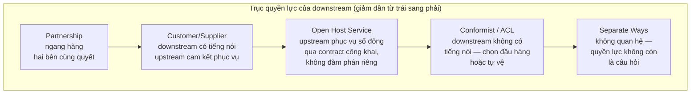
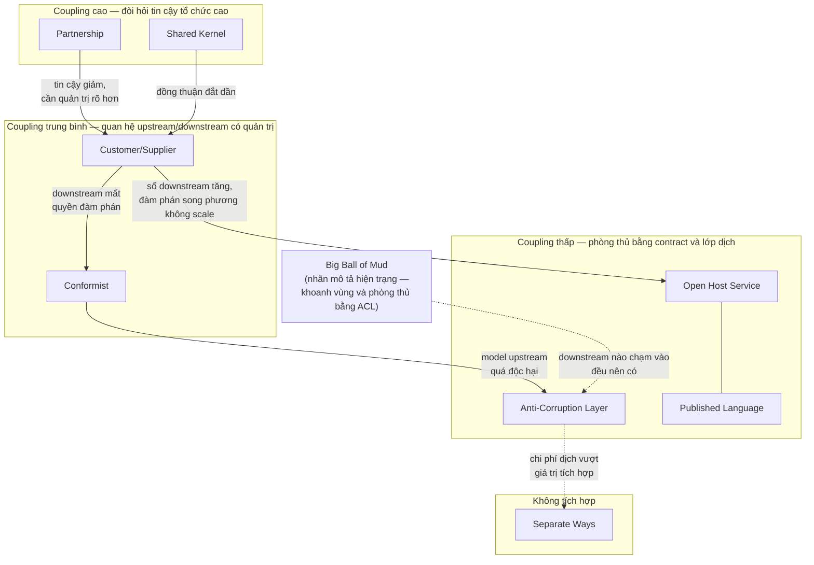
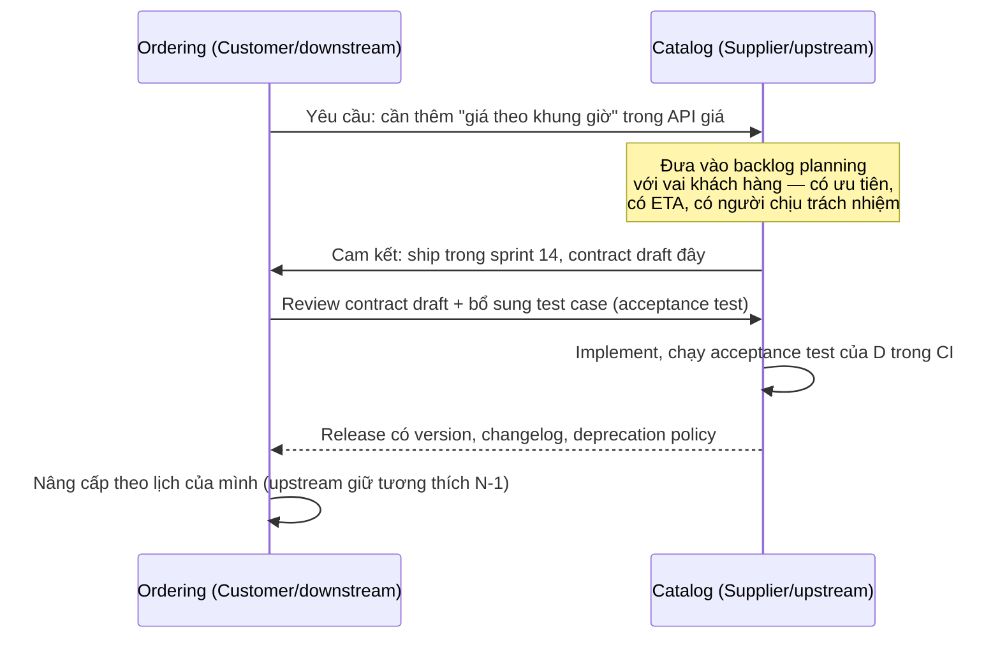
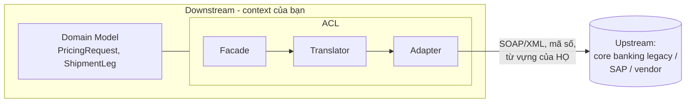
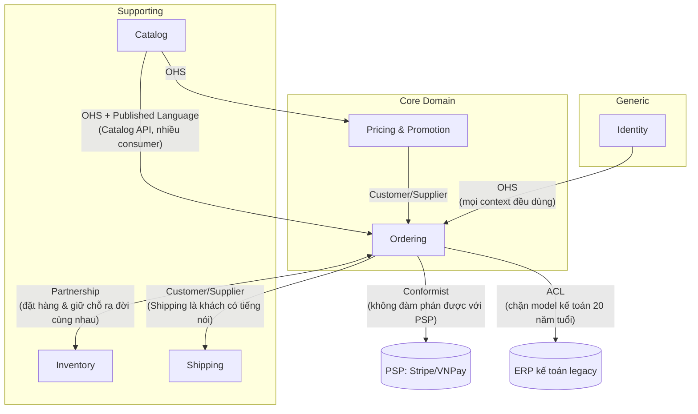

+++
title = "Chương 05 — Context Mapping: Bản Đồ Quyền Lực Giữa Các Bounded Context"
date = "2026-07-09T12:00:00+07:00"
draft = false
tags = ["backend", "ddd", "architecture"]
series = ["Domain-Driven Design"]
+++

> **Vị trí chương này trong chuỗi tài liệu:** Ở [chương 04](/series/domain-driven-design/04-bounded-context/), chúng ta đã vẽ xong ranh giới — mỗi Bounded Context có model riêng, ngôn ngữ riêng, team riêng. Nhưng ranh giới không có nghĩa là cô lập: Ordering vẫn phải biết giá từ Catalog, Shipping vẫn phải nhận đơn từ Ordering, và cả hệ thống vẫn phải nói chuyện với core banking 20 năm tuổi của đối tác. Chương này trả lời câu hỏi: **các context quan hệ với nhau như thế nào — về mặt kỹ thuật, và quan trọng hơn, về mặt tổ chức và quyền lực?** Đây là chương khép lại phần strategic design; từ [chương 06](/series/domain-driven-design/06-entity-va-value-object/) trở đi chúng ta đi vào tactical design — xây dựng model *bên trong* một context.

---

## Mục lục chương

1. [Problem Statement: cuộc tích hợp làm sập roadmap của ba team](#1-problem-statement-cuộc-tích-hợp-làm-sập-roadmap-của-ba-team)
2. [Tại sao DDD đưa ra Context Map](#2-tại-sao-ddd-đưa-ra-context-map)
3. [Bản chất: Context Map là công cụ chính trị/tổ chức, không chỉ kỹ thuật](#3-bản-chất-context-map-là-công-cụ-chính-trịtổ-chức-không-chỉ-kỹ-thuật)
4. [Từ vựng nền: Upstream, Downstream, và trục quyền lực](#4-từ-vựng-nền-upstream-downstream-và-trục-quyền-lực)
5. [Conway's Law thể hiện trong Context Map](#5-conways-law-thể-hiện-trong-context-map)
6. [Toàn cảnh 9 pattern — bảng tra nhanh](#6-toàn-cảnh-9-pattern--bảng-tra-nhanh)
7. [Partnership — hai team ngang hàng, thành bại cùng nhau](#7-partnership--hai-team-ngang-hàng-thành-bại-cùng-nhau)
8. [Shared Kernel — mảnh model dùng chung, con dao hai lưỡi](#8-shared-kernel--mảnh-model-dùng-chung-con-dao-hai-lưỡi)
9. [Customer/Supplier — quan hệ khách hàng có tiếng nói](#9-customersupplier--quan-hệ-khách-hàng-có-tiếng-nói)
10. [Conformist — khi bạn không có quyền đàm phán](#10-conformist--khi-bạn-không-có-quyền-đàm-phán)
11. [Anti-Corruption Layer (ACL) — lớp phòng thủ ngữ nghĩa](#11-anti-corruption-layer-acl--lớp-phòng-thủ-ngữ-nghĩa)
12. [Open Host Service — mở cổng cho số đông](#12-open-host-service--mở-cổng-cho-số-đông)
13. [Published Language — ngôn ngữ công bố](#13-published-language--ngôn-ngữ-công-bố)
14. [Separate Ways — đường ai nấy đi](#14-separate-ways--đường-ai-nấy-đi)
15. [Big Ball of Mud — gọi tên vùng đầm lầy](#15-big-ball-of-mud--gọi-tên-vùng-đầm-lầy)
16. [Code mẫu ACL: TypeScript (NestJS) và Go](#16-code-mẫu-acl-typescript-nestjs-và-go)
17. [Context Map hoàn chỉnh cho một hệ thống thực tế](#17-context-map-hoàn-chỉnh-cho-một-hệ-thống-thực-tế)
18. [Điểm mạnh — Điểm yếu — Trade-off](#18-điểm-mạnh--điểm-yếu--trade-off)
19. [Production Considerations](#19-production-considerations)
20. [Best Practices](#20-best-practices)
21. [Anti-patterns và vì sao chúng nguy hiểm](#21-anti-patterns-và-vì-sao-chúng-nguy-hiểm)
22. [Khi nào KHÔNG cần Context Mapping bài bản](#22-khi-nào-không-cần-context-mapping-bài-bản)
23. [Tóm tắt cho người bận rộn](#23-tóm-tắt-cho-người-bận-rộn)

---

## 1. Problem Statement: cuộc tích hợp làm sập roadmap của ba team

Một fintech Việt Nam, năm thứ ba hoạt động. Team Lending (12 người) xây sản phẩm cho vay tiêu dùng — đây là core business. Để giải ngân và thu nợ, họ phải tích hợp với core banking của ngân hàng đối tác — một hệ thống T24 đã customize 15 năm, API là SOAP, tài liệu là file PDF 400 trang bản scan, field đặt tên kiểu `TXN_AMT_LCY_2`, và mọi thay đổi phía ngân hàng cần 6 tháng lead time qua ba tầng phê duyệt.

Tech lead của Lending, dưới áp lực deadline, chọn con đường "nhanh nhất": gọi thẳng SOAP API từ service của mình, và — đây mới là điểm chí mạng — **để các khái niệm của T24 thấm vào domain model**. `LoanAccount` của họ bắt đầu có field `arrangementId` (khái niệm T24), status của khoản vay copy nguyên bộ mã trạng thái T24 (`"1"`, `"2"`, `"9A"`...), logic tính lãi viết theo cách T24 làm tròn số.

Mười tám tháng sau, chuyện gì xảy ra?

- Ngân hàng nâng cấp T24, đổi một số mã trạng thái. **Domain logic của Lending gãy** — không phải tầng tích hợp gãy, mà logic nghiệp vụ cho vay gãy, vì hai thứ đã là một.
- Công ty muốn thêm ngân hàng đối tác thứ hai (dùng core khác). Ước tính ban đầu: 2 tháng. Ước tính sau khi khảo sát code: **8 tháng**, vì khái niệm của ngân hàng thứ nhất đã ăn vào 40+ file domain.
- Team Accounting và team Collection — hai team nội bộ đọc dữ liệu khoản vay — cũng đã học và dùng bộ mã T24 trong code của *họ*. Vết nhiễm lan qua ba team.

Bây giờ đặt câu hỏi kiểu first principles: **lỗi ở đâu?** Không phải ở SOAP, không phải ở T24 (nó cũ nhưng nó chạy đúng việc của nó), không phải ở năng lực code của team. Lỗi ở chỗ: **quan hệ giữa hai context này chưa bao giờ được gọi tên và thiết kế một cách có chủ đích.** Team Lending là bên yếu thế tuyệt đối trong quan hệ (không thể yêu cầu ngân hàng đổi gì), nhưng họ hành xử như thể model bên kia là đáng tin và ổn định. Họ cần một quyết định tường minh — "chúng ta là downstream không có quyền đàm phán, vậy chúng ta phải tự vệ bằng một lớp dịch" — nhưng quyết định đó chưa bao giờ được đưa ra, nên mặc định (default) đã thắng: mặc định là *thẩm thấu*.

Đây là mẫu số chung của hàng nghìn hệ thống: **quan hệ giữa các context luôn tồn tại, dù bạn có thiết kế nó hay không. Nếu bạn không thiết kế, nó sẽ tự hình thành theo con đường ít trở lực nhất — và con đường đó hầu như luôn là con đường tồi.**

### Không giải quyết thì sao?

Nếu các quan hệ giữa context không được đặt tên, thỏa thuận và bảo vệ:

1. **Model bị nhiễm chéo** (như câu chuyện trên): khái niệm ngoại lai ăn sâu vào domain, chi phí gỡ tăng theo cấp số nhân với thời gian.
2. **Kỳ vọng lệch nhau giữa các team**: team A tưởng team B sẽ phục vụ nhu cầu của mình (quan hệ Customer/Supplier); team B tưởng team A phải tự thích nghi (Conformist). Không ai sai theo góc nhìn của mình — nhưng integration trễ 2 quý và hai team đổ lỗi cho nhau.
3. **Quyết định kiến trúc bị đưa ra ngầm bởi người ít thông tin nhất**: một dev junior, dưới deadline, quyết định "gọi thẳng DB của team kia cho nhanh" — và quyết định 30 phút đó định hình coupling của hệ thống trong 5 năm.

---

## 2. Tại sao DDD đưa ra Context Map

Sau khi Bounded Context giải quyết bài toán "model có hiệu lực đến đâu", lập tức nảy ra bài toán thứ hai: hệ thống thật có 5–20 context, và giá trị nghiệp vụ hầu như luôn chảy *xuyên qua* nhiều context (một đơn hàng chạm Catalog → Ordering → Payment → Inventory → Shipping). Eric Evans nhận ra rằng:

**Thứ nhất — tổng thể phải được nhìn thấy.** Từng context có thể được thiết kế đẹp, nhưng nếu không ai nhìn thấy bức tranh các quan hệ, hệ thống tổng thể vẫn có thể là một mớ rối. Context Map ra đời trước hết như một **công cụ mô tả hiện thực**: vẽ ra *cái đang có*, kể cả những phần xấu xí — chứ không phải vẽ *cái ước mơ*. Điểm này cực kỳ quan trọng và hay bị làm ngược: context map trước tiên là bản đồ khảo sát, sau đó mới là bản quy hoạch.

**Thứ hai — quan hệ giữa các context là một số hữu hạn các mẫu lặp lại.** Quan sát đủ nhiều tổ chức, Evans và cộng đồng (đặc biệt là Vaughn Vernon trong Red Book) nhận thấy các quan hệ integration không phải vô hạn biến thể, mà quy về khoảng 9 pattern — mỗi pattern là một tổ hợp của: *ai phụ thuộc ai* (hướng dòng chảy), *ai có quyền lực đàm phán* (chính trị), và *ai trả chi phí dịch model* (kỹ thuật). Gọi tên được pattern nghĩa là: hai team có từ vựng chung để thỏa thuận kỳ vọng, và architect có checklist chi phí để cân nhắc.

**Thứ ba — vì phần lớn thất bại integration là thất bại tổ chức, không phải kỹ thuật.** REST hay gRPC, sync hay async — đó là chi tiết. Câu hỏi quyết định thành bại là: *nếu upstream đổi API, downstream có được báo trước không? Ai fix? Deadline của ai bị ảnh hưởng? Escalate lên ai?* Các pattern context mapping mã hóa chính các câu trả lời đó.

> **Tại sao phải có từ vựng pattern? Không có thì sao?** Không có từ vựng chung, mỗi cuộc thảo luận integration là một cuộc đàm phán từ số không, và kỳ vọng ngầm sẽ lấp chỗ trống. Khi tech lead nói "quan hệ của mình với core banking là **Conformist qua ACL**", cả team lập tức hiểu: đừng mơ đề xuất thay đổi phía họ, mọi chi phí thích nghi thuộc về ta, và tuyến phòng thủ là lớp dịch của ta. Một câu, thay cho ba cuộc họp.

---

## 3. Bản chất: Context Map là công cụ chính trị/tổ chức, không chỉ kỹ thuật

Đây là luận điểm trung tâm của chương, nên tôi nói thẳng và nói trước:

> **Context Map là bản đồ quyền lực. Mỗi mũi tên trên đó là một câu trả lời cho câu hỏi: "khi hai bên xung đột lợi ích, ai thắng, và ai trả tiền?"**

Nhìn lại 9 pattern dưới lăng kính này, bạn sẽ thấy chúng thực chất là **phổ các cấu hình quyền lực**:

| Cấu hình quyền lực | Pattern tương ứng |
|---|---|
| Hai bên ngang hàng, ràng buộc số phận | Partnership, Shared Kernel |
| Downstream có tiếng nói, upstream phải lắng nghe | Customer/Supplier |
| Downstream không có tiếng nói | Conformist (đầu hàng), ACL (tự vệ) |
| Upstream phục vụ số đông, không đàm phán song phương | Open Host Service + Published Language |
| Không quan hệ | Separate Ways |
| Vùng không có luật | Big Ball of Mud (+ ACL quanh nó) |

Vài hệ quả thực dụng của cách nhìn này:

**Một — Context Map phải do người có thẩm quyền tổ chức tham gia vẽ.** Nếu chỉ engineer vẽ với nhau, bản đồ sẽ mô tả kỹ thuật đúng nhưng cam kết tổ chức rỗng: bạn vẽ mũi tên "Customer/Supplier" giữa team mình và team Platform, nhưng team Platform chưa từng đồng ý nhận vai Supplier — nghĩa là họ không đưa nhu cầu của bạn vào sprint planning của họ — thì mũi tên đó là hư cấu. Một quan hệ trên context map chỉ *có thật* khi cả hai team (và manager của họ) thừa nhận nó.

**Hai — thay đổi pattern là quyết định chính trị, đắt hơn nhiều so với thay đổi công nghệ.** Chuyển từ REST sang gRPC là việc của một sprint. Chuyển từ Conformist sang Customer/Supplier nghĩa là *thay đổi cán cân quyền lực* — thường đòi hỏi thay đổi reporting line, ngân sách, hoặc hợp đồng với vendor. Architect giỏi nhận ra: nhiều "vấn đề kiến trúc" thực chất là vấn đề quyền lực đội lốt, và giải nó bằng công nghệ là vô ích.

**Ba — Context Map lỗi thời còn nguy hiểm hơn không có.** Vì nó mô tả quan hệ tổ chức, mà tổ chức thì đổi (reorg, team giải thể, vendor mới), context map cần được xem lại theo nhịp — quý một lần là hợp lý. Bản đồ 2 năm tuổi treo trên Confluence mô tả những team không còn tồn tại là bản đồ dẫn người mới đi lạc.

**Bốn — không phải quan hệ nào cũng cần "sửa".** Nhìn thấy chữ Conformist hay Big Ball of Mud trên bản đồ, phản xạ của engineer là "phải cải tạo". Sai. Đôi khi Conformist là lựa chọn *đúng* (mục 10), và Big Ball of Mud được khoanh vùng tốt là kết quả *tốt* (mục 15). Bản đồ giúp bạn phân bổ nỗ lực có chủ đích: chỗ nào đáng đầu tư ACL, chỗ nào cứ đầu hàng cho rẻ.

---

## 4. Từ vựng nền: Upstream, Downstream, và trục quyền lực

Trước khi vào từng pattern, cần nắm chắc hai từ vựng nền, vì mọi pattern đều mô tả bằng chúng.

**Upstream (U)** và **Downstream (D)**: mượn ẩn dụ dòng sông. Upstream là bên mà *thay đổi của nó chảy xuống* ảnh hưởng bên kia; Downstream là bên *hứng* thay đổi đó. Catalog publish giá → Ordering dùng giá: Catalog là upstream, Ordering là downstream. Lưu ý ba điểm hay nhầm:

- Upstream/downstream nói về **hướng phụ thuộc**, không phải hướng gọi API hay hướng dữ liệu chạy. Ordering *gọi* API của Catalog (call hướng lên) nhưng Ordering vẫn là downstream (phụ thuộc hướng xuống). Với event: Catalog *đẩy* event xuống Ordering — vẫn Catalog là upstream.
- Upstream **không có nghĩa là quan trọng hơn**. Ordering (core business) có thể là downstream của một context phụ trợ. Vị trí trên dòng chảy và giá trị nghiệp vụ là hai trục độc lập.
- Một context có thể đồng thời là upstream của bên này và downstream của bên kia — hầu hết đều thế.

**Quyền lực đàm phán**: cùng một cấu trúc upstream/downstream, quan hệ có thể rất khác tùy downstream có ảnh hưởng được lên roadmap của upstream không. Đây chính là trục phân biệt Customer/Supplier với Conformist — cấu trúc kỹ thuật giống hệt nhau, cấu trúc quyền lực ngược nhau.



Khi phân tích bất kỳ quan hệ integration nào, hãy hỏi đúng thứ tự ba câu:

1. **Ai là upstream, ai là downstream?** (hướng phụ thuộc)
2. **Downstream có quyền đàm phán không?** (chính trị)
3. **Ai trả chi phí dịch model, và tuyến phòng thủ đặt ở đâu?** (kỹ thuật)

Trả lời xong ba câu, pattern gần như tự lộ ra.

---

## 5. Conway's Law thể hiện trong Context Map

Conway's Law — *"tổ chức thiết kế hệ thống sẽ tạo ra thiết kế sao chép cấu trúc giao tiếp của tổ chức đó"* — không phải khẩu hiệu trang trí; trên context map, nó hiện hình theo những cách rất cụ thể, quan sát được:

**Quan hệ báo cáo hiện hình thành pattern.** Hai context thuộc hai team cùng một manager, ngồi cùng tầng, ăn trưa cùng nhau → gần như chắc chắn bạn sẽ thấy Partnership hoặc Shared Kernel (giao tiếp rẻ nên ranh giới lỏng). Hai context thuộc hai phòng ban khác nhau, khác KPI → quan hệ trượt về Customer/Supplier hoặc Conformist. Context của vendor bên ngoài, khác công ty → Conformist hoặc ACL là gần như bắt buộc. **Chi phí giao tiếp tổ chức quyết định độ dày của lớp phòng thủ kỹ thuật** — đó là Conway's Law phát biểu theo ngôn ngữ context mapping.

**Reorg làm mutate context map — dù không ai đụng vào code.** Ví dụ thực tế tôi từng chứng kiến: team Platform và team Payments vốn chung một tribe, quan hệ Partnership, chung một Shared Kernel nhỏ (bộ type `Money`, `AccountRef`). Sau reorg, Payments chuyển sang business unit khác, KPI khác, planning cycle khác. Trong 6 tháng, Shared Kernel trở thành nguồn xung đột liên tục (bên này cần đổi, bên kia veto), rồi hai bên lặng lẽ fork nó. Codebase "tự động" trôi từ Shared Kernel sang Separate Ways để khớp với cấu trúc tổ chức mới. **Nếu context map của bạn mâu thuẫn với org chart, org chart sẽ thắng** — luôn luôn, chỉ là nhanh hay chậm.

**Hệ quả cho architect — Inverse Conway Maneuver ở tầm quan hệ:** muốn hai context có quan hệ Partnership bền, hãy đảm bảo hai team có điều kiện tổ chức cho nó (chung planning cycle, chung cấp escalate, mục tiêu không xung đột). Muốn một context làm Open Host Service phục vụ 10 team, hãy đảm bảo team đó được *đo lường và cấp ngân sách* như một nhà cung cấp platform — nếu KPI của họ chỉ là feature riêng của họ, cái "host service" sẽ mục nát vì không ai được thưởng khi bảo trì nó. **Chọn pattern trên giấy mà không cấp điều kiện tổ chức tương ứng là vẽ tiểu thuyết.**

Một mẹo chẩn đoán tôi hay dùng khi audit hệ thống lạ: *xin org chart và lịch họp liên team trước khi đọc code*. Từ đó đoán context map, rồi mới đối chiếu với code. Độ khớp thường trên 80% — và 20% lệch chính là những chỗ đang đau: hoặc code đi trước tổ chức (mũi tên kỹ thuật tồn tại nhưng không team nào nhận trách nhiệm), hoặc tổ chức đi trước code (hai team đã tách nhưng vẫn xích chung một database).

---

## 6. Toàn cảnh 9 pattern — bảng tra nhanh

Trước khi đi sâu từng pattern (mỗi pattern theo template: bối cảnh quyền lực sinh ra nó → khi nào dùng → chi phí → ví dụ thực tế), đây là bảng tra nhanh để bạn định vị:

| Pattern | Cấu hình quyền lực | Ai trả chi phí thích nghi | Mức coupling | Tín hiệu nhận biết nên dùng |
|---|---|---|---|---|
| **Partnership** | Hai team ngang hàng, thành bại ràng buộc | Cả hai, qua phối hợp liên tục | Cao (về tổ chức) | Feature của bên này vô nghĩa nếu bên kia không ship |
| **Shared Kernel** | Ngang hàng, tin cậy rất cao | Cả hai, mọi thay đổi cần đồng thuận | Rất cao (về code) | Một mảnh model nhỏ, ổn định, cả hai cùng cần chính xác như nhau |
| **Customer/Supplier** | Downstream có tiếng nói thật | Chủ yếu upstream (phục vụ) | Trung bình | Upstream đưa nhu cầu downstream vào planning của họ |
| **Conformist** | Downstream không có tiếng nói | Downstream, bằng cách *không dịch* | Cao (một chiều) | Model upstream đủ sạch/gần với nhu cầu, hoặc ta quá nhỏ để đòi hỏi |
| **Anti-Corruption Layer** | Downstream không có tiếng nói | Downstream, bằng cách *dịch* | Thấp (được cách ly) | Model upstream xấu/lạ/legacy, domain của ta đáng bảo vệ |
| **Open Host Service** | Upstream phục vụ nhiều downstream | Upstream trả một lần (xây contract tốt) | Thấp | ≥3 downstream có nhu cầu tương tự nhau |
| **Published Language** | Trung lập, chuẩn chung | Cả hai dịch sang chuẩn | Thấp | Cần contract ổn định, versioned, nhiều bên đọc |
| **Separate Ways** | Không quan hệ | Không ai — mỗi bên tự làm lấy | Không | Chi phí tích hợp > giá trị tích hợp |
| **Big Ball of Mud** | Vô chính phủ (nhãn hiện trạng) | Mọi người, liên tục, vô hình | Hỗn loạn | Không tìm thấy ranh giới model nhất quán bên trong |

Và bức tranh tổng: các pattern không loại trừ nhau — một cạnh trên context map thường ghép 2–3 pattern (ví dụ kinh điển: **OHS + Published Language** phía upstream, **ACL** phía downstream, trên cùng một mũi tên).



Cách đọc diagram: các mũi tên nét liền là **hướng thoái hóa/tiến hóa tự nhiên** của quan hệ khi điều kiện tổ chức thay đổi. Ghi nhớ điều này: pattern không phải trạng thái vĩnh viễn — nó là ảnh chụp của một cân bằng quyền lực, và sẽ trôi khi cân bằng đổi.

---
## 7. Partnership — hai team ngang hàng, thành bại cùng nhau

### Bối cảnh quyền lực sinh ra pattern này

Partnership sinh ra từ tình huống tổ chức mà **không bên nào là upstream của bên kia một cách rõ ràng, và cả hai cùng chết nếu một bên trễ**. Điển hình: hai team ngang cấp, cùng một mục tiêu release, phụ thuộc vòng tròn về nghiệp vụ. Không bên nào ra lệnh được cho bên kia — và cũng không cần: động cơ hợp tác đến từ số phận chung, không từ hierarchy.

Ví dụ thực tế: team **Ordering** và team **Promotion** của một sàn TMĐT chuẩn bị chiến dịch 11/11. Promotion cần Ordering nhúng logic áp voucher vào checkout; Ordering cần Promotion trả kết quả tính khuyến mãi đúng và nhanh (checkout p99 < 300ms). Feature "flash sale" chỉ tồn tại khi *cả hai* ship. Ai upstream ai downstream? Không phân định được — dữ liệu và ràng buộc chảy cả hai chiều trong cùng một use case.

### Khi nào dùng

- Hai context phụ thuộc lẫn nhau theo cả hai chiều trong cùng luồng nghiệp vụ, và tách thứ tự "ai trước ai sau" là bất khả thi.
- Hai team có điều kiện tổ chức để phối hợp chặt: chung planning cycle hoặc sẵn sàng khớp lịch, chung cấp escalate đủ gần (cùng director là lý tưởng), niềm tin lẫn nhau đã có nền.
- Giai đoạn khám phá nghiệp vụ mới: hai team cùng mò một domain chưa rõ, interface giữa họ đổi hàng tuần — đóng cứng contract lúc này là quá sớm, Partnership cho phép hai bên tiến hóa cùng nhau.

### Bản chất và cách hoạt động

Partnership **không quy định cơ chế kỹ thuật cụ thể** — nó quy định cơ chế *cam kết*: lập kế hoạch chung, interface được thiết kế chung (không bên nào áp đặt), thất bại tích hợp được xử lý như thất bại chung (không đổ lỗi), và hai bên chủ động khớp release. Về kỹ thuật, hai bên vẫn giữ model riêng, contract riêng — Partnership không có nghĩa là chung code (đó là Shared Kernel, pattern khác).

Cơ chế vận hành tối thiểu mà tôi yêu cầu khi hai team tuyên bố Partnership:

1. **Joint planning** mỗi đầu sprint/quarter — không phải "sync meeting" nghe nhau báo cáo, mà cùng cắt scope và cùng ký vào một danh sách deliverable có tên hai team.
2. **Contract test hai chiều** chạy trong CI của cả hai — thay đổi của bên nào làm gãy kỳ vọng bên kia thì build đỏ *ngay tại bên gây ra*.
3. **Kênh escalate chung, một cấp**: khi kẹt, cả hai lead cùng lên một người quyết. Partnership mà escalate phải đi qua hai VP khác nhau là Partnership trên giấy.

### Chi phí

- **Chi phí phối hợp thường trực và cao nhất trong các pattern có tổ chức**: họp chung, khớp lịch, đàm phán interface liên tục. Với hai team ở hai múi giờ, chi phí này có thể nuốt 15–20% capacity.
- **Không scale theo số quan hệ**: một team làm Partnership nghiêm túc được với 1–2 team là kịch trần. Team tuyên bố Partnership với 5 team nghĩa là không Partnership với ai cả.
- **Mong manh trước reorg**: như đã nói ở mục 5, Partnership sống bằng điều kiện tổ chức. Đổi manager, đổi KPI một bên — quan hệ trượt về Customer/Supplier hoặc tệ hơn, và nếu không ai cập nhật thiết kế integration theo, code sẽ giữ mức coupling của niềm tin cũ trong cấu trúc quyền lực mới. Đó là công thức tai nạn.

### Áp dụng sai thì hậu quả gì?

Sai phổ biến nhất: dán nhãn Partnership cho quan hệ thực chất là Customer/Supplier để... né việc phân định trách nhiệm ("mình là đối tác mà, cùng nhau cả"). Hậu quả: khi sự cố xảy ra, không có ai là bên cam kết SLA, mọi post-mortem thành trận đổ lỗi. Ngược lại, hai bên là Partnership thật nhưng quản lý như hai vendor xa lạ (chỉ nói chuyện qua ticket) thì interface sẽ ổn định một cách giả tạo — nó không đổi vì *đàm phán đắt quá*, trong khi nghiệp vụ cần nó đổi. Feature chết vì ma sát.

---

## 8. Shared Kernel — mảnh model dùng chung, con dao hai lưỡi

### Bối cảnh quyền lực sinh ra pattern này

Shared Kernel sinh ra từ tình huống: hai team quan hệ rất gần (thường là Partnership, hoặc vừa tách từ một team), và có **một mảnh model mà cả hai cần giống nhau một cách tuyệt đối** — đến mức dịch qua lại giữa hai phiên bản là vừa phí công vừa rủi ro. Thay vì mỗi bên một bản + translation, hai bên **cùng sở hữu chung** một mảnh code/schema: mọi thay đổi phải được cả hai đồng thuận, test suite của cả hai phải xanh.

Lịch sử của nó rất thật: pattern này mô tả điều xảy ra khi một team lớn tách đôi — có một phần model cả hai nửa đều đụng vào hằng ngày, và tách nó ngay lập tức thì đau hơn giữ chung. Shared Kernel là **thỏa thuận đình chiến có kiểm soát**, không phải mục tiêu thiết kế lý tưởng.

### Khi nào dùng

- Mảnh chung **nhỏ và ổn định**: bộ Value Object nền (`Money`, `Quantity`, `CustomerId`), một event schema lõi, một mảnh tính toán mà hai bên bắt buộc cho ra kết quả giống hệt nhau (ví dụ: công thức tính phí mà cả Billing lẫn Quotation phải khớp từng đồng — lệch một đồng là ticket khiếu nại).
- Hai team có kỷ luật kỹ thuật cao và kênh phối hợp rẻ (Conway's Law: cùng tribe, cùng repo, cùng review culture).
- Chi phí duy trì hai bản + dịch **đo được là cao hơn** chi phí đồng thuận. Đây phải là phép tính, không phải cảm giác "DRY cho đẹp".

### Chi phí

- **Mọi thay đổi cần đồng thuận N bên** — chính là căn bệnh Enterprise Model thu nhỏ. Kernel càng to, bệnh càng nặng. Vì thế quy tắc số một: giữ kernel **nhỏ đến mức khó chịu**. Kernel khỏe là kernel vài file; kernel vài chục file là Enterprise Model đang mọc lại từ hạt giống.
- **Coupling ở tầng sâu nhất**: chung code nghĩa là chung release cadence cho mảnh đó, chung breaking change, chung nợ kỹ thuật.
- **Chi phí quản trị hiện vật**: cần CODEOWNERS bắt buộc review chéo, versioning rõ (publish như package có semver là cách lành mạnh), và contract test của cả hai bên chạy trên mọi PR đụng kernel.

### Ví dụ thực tế và ví dụ SAI

**Dùng đúng** (production tôi từng review): hai context Billing và Payment của một công ty SaaS chia sẻ một package `money-core` gồm đúng 4 file: `Money` (số tiền + currency, phép cộng trừ có kiểm tra currency), `ExchangeRate`, quy tắc làm tròn theo chuẩn kế toán, và `InvoiceId`/`PaymentId`. Hai năm, 11 thay đổi, zero sự cố lệch số. Nhỏ, ổn định, bắt buộc khớp tuyệt đối — đúng ba tiêu chí.

**Dùng sai** (cũng production, công ty khác): package `common-domain` chứa 70+ entity dùng chung cho 6 service — `User`, `Product`, `Order` đầy đủ logic. Về danh nghĩa là "Shared Kernel", về thực chất là Enterprise Model đóng gói npm. Mỗi lần bump version là một chiến dịch phối hợp 6 team kéo dài hàng tuần; các team bắt đầu ghim version cũ để né, và đến lúc có 4 version tồn tại song song trong production thì "shared" chỉ còn trong tên gói. Bài học: **Shared Kernel không có cơ chế đồng thuận thực thi được thì chỉ là shared library — và shared library chứa domain model là anti-pattern** (xem mục 21).

> **Không dùng Shared Kernel thì sao?** Thì mỗi bên giữ bản model riêng và dịch ở biên — tức là mặc định lành mạnh của DDD. Hãy coi Shared Kernel là ngoại lệ phải biện minh, không phải lựa chọn mặc định. Nếu phân vân, đừng share.

---

## 9. Customer/Supplier — quan hệ khách hàng có tiếng nói

### Bối cảnh quyền lực sinh ra pattern này

Đây là quan hệ upstream/downstream **được quản trị tử tế**: upstream (Supplier) thừa nhận downstream (Customer) là khách hàng của mình, và nhu cầu của downstream **được đưa vào quy trình planning của upstream với quyền ưu tiên thật**. Cấu hình quyền lực: downstream không ra lệnh được, nhưng có tiếng nói được thể chế hóa — như khách hàng trả tiền có quyền yêu cầu, còn nhà cung cấp có quyền xếp lịch.

Pattern này sinh ra ở các tổ chức đủ trưởng thành để trả lời câu hỏi "team platform/team dữ liệu phục vụ ai?" một cách tường minh. Nó là trạng thái *mặc định lành mạnh* cho quan hệ giữa hai team nội bộ cùng công ty.

### Khi nào dùng

- Phụ thuộc một chiều rõ ràng (không phải hai chiều như Partnership).
- Hai bên cùng tổ chức hoặc có hợp đồng — tức tồn tại cơ chế khiến cam kết của Supplier *có răng*: chung cấp quản lý để escalate, hoặc SLA hợp đồng.
- Upstream có năng lực và động cơ phục vụ: nhu cầu của downstream nằm trong KPI/OKR của upstream. **Nếu không có dòng này, bạn không có Customer/Supplier dù hai bên có thiện chí đến đâu** — thiện chí không sống sót qua mùa deadline.

### Cách hoạt động

Cơ chế cốt lõi là **đưa nhu cầu downstream vào planning upstream** một cách nghi thức hóa:



Hai chi tiết kỹ thuật làm nên khác biệt giữa Customer/Supplier thật và giả:

1. **Acceptance test do downstream viết, chạy trong CI của upstream** (consumer-driven contract testing — Pact là công cụ phổ biến). Đây là "chữ ký hợp đồng" bằng máy: upstream không thể vô tình phá downstream mà không biết.
2. **Deprecation policy tường minh**: upstream được quyền tiến hóa, nhưng phải giữ tương thích N-1 version trong một khoảng thời gian thỏa thuận. Quyền lực của Customer không phải là quyền đóng băng Supplier — mà là quyền *được báo trước và có lộ trình*.

### Chi phí

- Upstream mất một phần quyền tự quyết roadmap và gánh chi phí duy trì tương thích + vận hành quy trình (backlog khách hàng, versioning, changelog).
- Downstream phải làm nghĩa vụ khách hàng tử tế: nêu nhu cầu sớm, viết acceptance test, nâng cấp đúng hạn thay vì ôm version cũ vô thời hạn.
- Chi phí đàm phán song phương tăng tuyến tính theo số customer — khi Supplier có 5–7 customer trở lên, đàm phán riêng từng bên không còn scale, đó là tín hiệu chuyển sang Open Host Service (mục 12).

### Áp dụng sai thì hậu quả gì?

Kịch bản kinh điển: hai bên *gọi nhau* là Customer/Supplier nhưng nhu cầu của Customer không bao giờ thắng nổi feature riêng của Supplier trong planning. Downstream chờ 3 sprint, deadline không đợi, họ làm gì? **Workaround**: gọi thẳng vào database của upstream, hoặc scrape dữ liệu từ API nội bộ không cam kết. Giờ hệ thống có một đường phụ thuộc ngầm không ai quản — tệ hơn cả Conformist tường minh. Quy luật đáng nhớ: **quan hệ không được thể chế hóa sẽ bị thay thế bằng workaround, và workaround là pattern tồi nhất trong mọi pattern vì nó không có tên trên bản đồ.**

---

## 10. Conformist — khi bạn không có quyền đàm phán

### Bối cảnh quyền lực sinh ra pattern này

Conformist mô tả tình huống downstream phụ thuộc upstream nhưng **không có bất kỳ đòn bẩy nào**: upstream không biết đến bạn, không quan tâm, hoặc không thể thay đổi vì bạn. Ba nguồn phổ biến:

- **SaaS/vendor bên thứ ba**: bạn tích hợp Stripe, Salesforce, Shopee OpenAPI, Google Ads API. Bạn là một trong trăm nghìn khách; API của họ là luật, đàm phán là ảo tưởng.
- **Hệ thống nội bộ "quá lớn để lay chuyển"**: ERP toàn tập đoàn, core banking, hệ thống của công ty mẹ. Về danh nghĩa cùng nhà; về quyền lực, bạn vẫn là hạt cát.
- **Chuẩn ngành**: SWIFT MT/ISO 20022, NAPAS specs, chuẩn HL7 y tế. "Upstream" ở đây là cả một ngành.

Khi không đàm phán được, downstream có đúng hai lựa chọn có tên: **Conformist** (dùng luôn model của upstream làm model của mình, không dịch) hoặc **ACL** (tự vệ bằng lớp dịch — mục 11). Conformist là lựa chọn *đầu hàng có chủ đích* — và chữ quan trọng là "có chủ đích".

### Khi nào dùng — vì Conformist KHÔNG phải lúc nào cũng là cái xấu

Đây là điểm bị hiểu sai nhiều nhất: Conformist là một **quyết định kinh tế hợp lệ**, không phải sự lười biếng, khi hội đủ:

- **Model upstream đủ tốt hoặc đủ gần nhu cầu của bạn**: ví dụ bạn xây tool nội bộ phân tích quảng cáo trên Google Ads — model `Campaign/AdGroup/Ad` của Google chính là domain của bài toán, dịch nó sang "ngôn ngữ riêng" chỉ tạo ra một tầng gián tiếp vô nghĩa.
- **Phần phụ thuộc không phải core domain của bạn**: nó nằm ở rìa, ít logic riêng, giá trị chiến lược thấp — đầu tư ACL ở đây là lãng phí đạn dược.
- **Bạn cần tốc độ và chấp nhận rủi ro tính sau**: startup 5 người tích hợp một SaaS — conform trước, nếu sản phẩm sống và phần này hóa ra quan trọng, nâng cấp lên ACL sau (một refactor có chi phí biết trước, nếu bạn kỷ luật giữ phần conform trong một module).

### Chi phí — và đây là chỗ phải nhìn thẳng

- **Ngôn ngữ của bạn bị chiếm đóng**: team bạn sẽ *nói* bằng từ vựng của vendor. Domain expert nói "khách đặt cọc", code nói `PaymentIntent` — khoảng cách ngôn ngữ này chính là thứ [chương 03](/series/domain-driven-design/03-ubiquitous-language/) cảnh báo, và nó âm thầm định hình cách team *nghĩ* về nghiệp vụ.
- **Breaking change của upstream đánh thẳng vào lõi**: không có lớp đệm, khi vendor đổi API, mọi nơi dùng model đó trong code của bạn cùng gãy. Với vendor có deprecation policy tử tế (Stripe) thì chịu được; với upstream đổi thất thường thì đây là bom nổ chậm.
- **Chi phí chuyển vendor ≈ viết lại**: conform với vendor A nghĩa là model của A ở khắp nơi; thay bằng vendor B là cuộc đại phẫu. Đây là vendor lock-in ở tầng ngữ nghĩa — sâu hơn lock-in ở tầng hạ tầng nhiều.

### Ví dụ thực tế

Một công ty logistics tôi tư vấn dùng Salesforce làm CRM. Team CS-tooling (3 người) xây tool nội bộ trên dữ liệu Salesforce, chọn Conformist: dùng thẳng object model `Account/Contact/Opportunity/Case` của Salesforce, field naming giữ nguyên. Quyết định **đúng**: team quá nhỏ để nuôi một lớp dịch, tool không phải core business, và cả phòng CS vốn đã nói "ngôn ngữ Salesforce" hàng ngày — conform ở đây thậm chí *khớp* với ubiquitous language của người dùng.

Cùng công ty đó, team Pricing (core domain — định giá cước là lợi thế cạnh tranh) ban đầu cũng conform theo model `Opportunity` của Salesforce để lấy dữ liệu deal. Sai lầm: logic định giá — tài sản quý nhất — bắt đầu mọc các nhánh `if opportunity.stage === 'Negotiation'` khắp nơi. Sau một năm, họ trả nợ bằng cách chèn ACL vào giữa: `Opportunity` của Salesforce được dịch thành `PricingRequest` nội bộ ngay tại biên, core pricing không còn biết Salesforce tồn tại. **Cùng một upstream, hai quan hệ khác nhau cho hai context khác nhau — đó chính là tư duy context mapping**: pattern là thuộc tính của *từng cạnh*, không phải của vendor.

> **Quy tắc ngón tay cái:** Conformist cho phần rìa, ACL cho phần lõi. Nếu phải conform ở phần lõi vì thiếu nguồn lực — được, nhưng hãy ghi nó vào context map như một khoản nợ có tên, có chủ, có điều kiện trả (ví dụ: "nâng cấp lên ACL khi có khách hàng thứ hai / khi team đủ 5 người"). Nợ có hồ sơ thì trả được; nợ vô danh thì thành di sản.

---

## 11. Anti-Corruption Layer (ACL) — lớp phòng thủ ngữ nghĩa

### Bối cảnh quyền lực sinh ra pattern này

Bạn là downstream của một upstream mà bạn **không tin** về mặt ngữ nghĩa — legacy 15 năm tuổi, vendor có model xa lạ, hệ thống của công ty vừa M&A — nhưng model nội bộ của bạn **đáng được bảo vệ** (thường vì bạn là Core Domain). Bạn không có quyền bắt upstream đổi, và bạn từ chối để model của họ chảy vào lõi của mình. ACL là câu trả lời: một lớp dịch đứng ở biên, phía **downstream sở hữu và trả phí**.

### Bản chất và cách hoạt động

ACL không phải là "wrapper gọi API" — đó mới là adapter kỹ thuật. ACL là **phiên dịch ngữ nghĩa hai chiều**: nhận model của người ta (mã trạng thái số, field viết tắt tiếng Đức của SAP, XML 40 tầng của core banking) và trả ra **khái niệm trong Ubiquitous Language của bạn**. Nó gồm ba mảnh ghép quen thuộc: *adapter* (nói chuyện giao thức — REST/SOAP/file), *translator* (dịch model — phần quan trọng nhất), và đôi khi *facade* (gom nhiều lệnh gọi upstream thành một thao tác nghiệp vụ của bạn).



Nó bảo vệ điều gì: **ngôn ngữ và invariant của model lõi**. Không có ACL, mỗi lần chạm upstream là một lần từ vựng ngoại lai xâm nhập — ban đầu là một field enum lạ, sáu tháng sau business rule của bạn viết bằng thuật ngữ của SAP, và model của bạn không còn là của bạn (từ "corruption" trong tên pattern nghĩa đen là vậy).

### Khi nào dùng

- Tích hợp **legacy không thể sửa**: core banking, ERP, hệ thống của công ty bị mua lại.
- Upstream là vendor mà bạn *dự định có ngày thay*: ACL biến "thay vendor" từ đại phẫu thành thay adapter.
- Downstream là **Core Domain**: gần như bắt buộc — lõi không được nói tiếng nước ngoài.
- Strangler fig khi refactor legacy (chương [14](/series/domain-driven-design/14-ddd-trong-production/)): ACL là công cụ số một để hệ mới sống cạnh hệ cũ mà không nhiễm model cũ.

### Chi phí

- **Viết và nuôi lớp dịch**: mỗi khái niệm một mapper, mỗi thay đổi upstream một lần cập nhật. Với upstream ổn định thì rẻ; upstream đổi hàng tuần thì ACL là chỗ tiêu bảo trì đáng kể (nhưng vẫn rẻ hơn để thay đổi đó lan vào lõi).
- **Độ trễ và điểm hỏng mới**: thêm một tầng là thêm latency và thêm chỗ có bug — bug dịch (mapping sai một enum) là loại bug âm thầm và khó thấy nhất.
- **Cám dỗ nhét logic vào ACL**: lớp dịch dần mọc business rule ("nếu khách loại B thì coi như hạng bạc") — logic nghiệp vụ trốn trong lớp hạ tầng, không ai test đủ. Kỷ luật: ACL chỉ **dịch**, không **quyết định**.

### Áp dụng sai thì hậu quả gì?

Dựng ACL cho *mọi* tích hợp kể cả giữa hai team nội bộ hợp tác tốt — bạn trả phí phiên dịch cho cuộc nói chuyện không cần phiên dịch, và tệ hơn: hai team lẽ ra nên thống nhất ngôn ngữ (Partnership/Shared Kernel) giờ mỗi bên một từ điển, chi phí đồng bộ ngữ nghĩa nhân đôi vĩnh viễn. ACL là thuế bảo hộ — chỉ đáng đóng khi bên kia thực sự là "nước ngoài".

---

## 12. Open Host Service — mở cổng cho số đông

### Bối cảnh quyền lực sinh ra pattern này

Bạn là upstream bị **nhiều** downstream cùng cần. Nếu chiều từng người kiểu Customer/Supplier, bạn chết vì N mối quan hệ song phương: mỗi team một endpoint riêng, một định dạng riêng, một lịch họp riêng. Đến ngưỡng đó, quan hệ song phương phải chuyển thành **dịch vụ công cộng**: một cổng chuẩn, mở, tài liệu hóa — ai cần thì tự phục vụ.

### Bản chất và cách hoạt động

Open Host Service (OHS) là quyết định *sản phẩm hóa* sự tích hợp: API công khai + hợp đồng rõ + versioning + tài liệu, thiết kế cho **trường hợp dùng tổng quát** thay vì cho từng khách. Nó thường đi cặp với **Published Language** (mục 13) — ngôn ngữ chuẩn mà cổng đó nói. Ví von đúng: Customer/Supplier là may đo; OHS là may sẵn size S/M/L — rẻ trên mỗi khách, nhưng không vừa in từng người.

Trong nội bộ, OHS là các "platform API" (Identity, Billing, Notification cho mọi team dùng); ra ngoài, nó là public API kiểu Stripe/GitHub. Dấu hiệu nhận biết một OHS tử tế: downstream mới tích hợp được **mà không cần họp với team upstream**.

### Khi nào dùng — và chi phí

Dùng khi số downstream ≥ 3 và nhu cầu của họ đủ giống nhau để tổng quát hóa. Chi phí phải nhìn thẳng: thiết kế API tổng quát khó gấp nhiều lần API song phương; versioning và backward compatibility trở thành nghĩa vụ dài hạn (đã publish là không rút lại được); và luôn có downstream mà nhu cầu *không* vừa size may sẵn — với họ, hoặc mở thêm cơ chế mở rộng, hoặc chấp nhận họ tự xoay (họ sẽ dựng ACL phía họ). Áp dụng sai — publish API tổng quát khi mới có một khách hàng — là tổng quát hóa từ mẫu số một: API trừu tượng sai chỗ, và bạn gánh nghĩa vụ compatibility cho thiết kế chưa ai kiểm chứng.

---

## 13. Published Language — ngôn ngữ công bố

Published Language là **ngôn ngữ trao đổi được tài liệu hóa và cam kết**, đứng độc lập với model nội bộ của cả hai bên: schema của event trên Kafka (Avro/Protobuf + schema registry), OpenAPI spec của public API, hay chuẩn ngành (ISO 20022 trong banking, HL7/FHIR trong y tế, GS1 trong logistics). Điểm cốt lõi hay bị bỏ qua: **Published Language KHÔNG phải model nội bộ của upstream phơi ra**. Nó là ngôn ngữ *thứ ba*, thiết kế riêng cho việc trao đổi — upstream dịch model nội bộ ra nó, downstream dịch nó vào model nội bộ. Nhờ tầng đệm đó, upstream refactor nội bộ thoải mái miễn giữ hợp đồng, downstream không bị xô đổ.

Khi nào dùng: cùng chỗ với OHS (đi cặp); giữa các bounded context giao tiếp qua event (integration event schema **là** published language của bạn — chương [10](/series/domain-driven-design/10-domain-event/) và [13](/series/domain-driven-design/13-ddd-va-distributed-systems/)); khi ngành có chuẩn sẵn thì dùng chuẩn ngành thay vì phát minh (ISO 20022 có sẵn nghìn trang định nghĩa mà đối tác của bạn đã hiểu).

Chi phí và bẫy: ngôn ngữ công bố là **cam kết công khai** — đổi breaking là đổi hợp đồng với mọi consumer, nên nó tiến hóa chậm và cần quy trình (schema registry, compatibility check trong CI, deprecation policy). Bẫy phổ biến nhất: lười tách, lấy luôn JSON serialize của entity nội bộ làm "schema event" — ngày refactor entity là ngày phá hợp đồng với cả công ty mà không ai duyệt. Đó là Shared Kernel trá hình đội lốt Published Language.

---

## 14. Separate Ways — đường ai nấy đi

Pattern bị lãng quên nhất, và là pattern **rẻ nhất**: hai context *không tích hợp gì cả*. Mỗi bên tự giải quyết phần nhu cầu trùng nhau, chấp nhận trùng lặp dữ liệu/chức năng, đổi lấy độc lập tuyệt đối.

Khi nào đây là lựa chọn đúng: chi phí tích hợp (xây + nuôi + phối hợp giữa hai team + coupling dài hạn) **lớn hơn** chi phí trùng lặp. Ví dụ thật: team Marketing cần danh sách khách để gửi chiến dịch, team CS cần hồ sơ khách để xử lý ticket. Phản xạ kiến trúc sư non tay: "xây Customer service dùng chung!" — và thế là hai team có nhu cầu tiến hóa khác nhau bị xích vào một model chung, mọi thay đổi phải đàm phán (chính là căn bệnh mục 8 Shared Kernel). Phương án Separate Ways: Marketing giữ bản copy tối giản (email, tên, tag) sync một chiều mỗi đêm; CS giữ hồ sơ riêng của họ. Trùng vài field, nhưng hai team không bao giờ phải họp với nhau — với hai context ít liên quan, đó là món hời.

Chi phí thật: dữ liệu trùng sẽ **lệch**, và phải trả lời trước "lệch thì sao, nguồn sự thật là ai". Áp dụng sai — Separate Ways cho hai context *thực chất cần* nhất quán (Inventory và Ordering tự nuôi hai bản tồn kho) — là oversell và đối soát thủ công mỗi tuần. Câu hỏi kiểm định: *"Nếu hai bản dữ liệu lệch nhau một ngày, có ai mất tiền không?"* Có → phải tích hợp. Không → Separate Ways xứng đáng được cân nhắc nghiêm túc hơn bạn tưởng.

---

## 15. Big Ball of Mud — gọi tên vùng đầm lầy

Đây không phải pattern để *áp dụng* — nó là nhãn để **khoanh vùng và cách ly**. Trên context map, vùng Big Ball of Mud là nơi không có ranh giới ngữ nghĩa: model chồng chéo, mọi thứ gọi mọi thứ, một bảng 200 cột ba nghĩa. Điều Evans khuyên không phải "dọn nó ngay" (thường bất khả thi về ROI) mà là: **vẽ một đường quanh nó, ghi rõ "đầm lầy", và bảo vệ các context lành mạnh khỏi nó bằng ACL**. Đừng để model của đầm lầy chảy vào context mới; đừng mơ "chuẩn hóa" nó bằng một dự án big-bang. Chiến lược thoát đầm lầy — strangler fig, bubble context — là chủ đề của chương [14](/series/domain-driven-design/14-ddd-trong-production/). Giá trị của việc *gọi tên* nằm ở chỗ: nó biến một sự xấu hổ ngầm thành một thực thể có ranh giới trên bản đồ, có chiến lược đối xử, có kế hoạch — thay vì thứ mà mọi người vờ như không thấy và thỉnh thoảng lại có ai đó "sửa nhanh một tí" làm nó to thêm.

---

## 16. Code mẫu ACL: TypeScript (NestJS) và Go

Tình huống: context **Lending** (core domain — quyết định cho vay) cần dữ liệu tài khoản từ **core banking T24 legacy** (SOAP, mã trạng thái số, field viết tắt). Yêu cầu: model Lending tuyệt đối không biết T24 tồn tại.

```typescript
// lending/domain/ports/account-snapshot.port.ts — DOMAIN định nghĩa nó cần gì
export interface AccountSnapshotPort {
  /** Ảnh chụp tài khoản theo ngôn ngữ của Lending — không phải của T24 */
  getSnapshot(customerId: CustomerId): Promise<AccountSnapshot>;
}

export class AccountSnapshot {           // Value Object trong ngôn ngữ Lending
  constructor(
    readonly customerId: CustomerId,
    readonly averageBalance3m: Money,
    readonly hasActiveOverdraft: boolean,
    readonly standing: 'GOOD' | 'WATCH' | 'DELINQUENT',
  ) {}
}
```

```typescript
// lending/infrastructure/acl/t24.acl.ts — ACL: adapter + translator
@Injectable()
export class T24AccountAcl implements AccountSnapshotPort {
  constructor(private readonly soap: T24SoapClient) {}

  async getSnapshot(customerId: CustomerId): Promise<AccountSnapshot> {
    // 1. ADAPTER: nói giao thức của họ
    const raw = await this.soap.call('ACC.DETAILS', { CUS_NO: customerId.value });

    // 2. TRANSLATOR: dịch ngữ nghĩa của họ → khái niệm của MÌNH
    return new AccountSnapshot(
      customerId,
      Money.vnd(parseT24Amount(raw.AVG_BAL_3M)),        // "1.234.567,89-" kiểu T24 → Money
      raw.OD_STATUS === '1' || raw.OD_STATUS === '3',   // tri thức bí truyền về mã của T24
      this.translateStanding(raw.CUST_STAT),            //   được GIAM GIỮ tại đây, một chỗ duy nhất
    );
  }

  private translateStanding(stat: string): AccountSnapshot['standing'] {
    switch (stat) {
      case '01': case '02': return 'GOOD';
      case '11': return 'WATCH';
      case '21': case '22': case '23': return 'DELINQUENT';
      default:
        // Nguyên tắc ACL: gặp giá trị lạ thì FAIL TO SAFE + alert, không đoán bừa
        throw new UntranslatableUpstreamValue('T24.CUST_STAT', stat);
    }
  }
}
```

```go
// Go — cùng cấu trúc: port ở domain, ACL ở infra
// lending/domain/ports.go
package domain

type AccountSnapshotPort interface {
    GetSnapshot(ctx context.Context, customerID CustomerID) (AccountSnapshot, error)
}

// lending/infra/t24acl/acl.go
package t24acl

type ACL struct{ client *t24.SoapClient }

func (a *ACL) GetSnapshot(ctx context.Context, id domain.CustomerID) (domain.AccountSnapshot, error) {
    raw, err := a.client.Call(ctx, "ACC.DETAILS", map[string]string{"CUS_NO": id.String()})
    if err != nil {
        return domain.AccountSnapshot{}, fmt.Errorf("t24 unavailable: %w", err)
    }
    standing, err := translateStanding(raw.CustStat) // toàn bộ tri thức mã T24 ở một file
    if err != nil {
        return domain.AccountSnapshot{}, err // giá trị lạ → lỗi tường minh, không đoán
    }
    return domain.AccountSnapshot{
        CustomerID:         id,
        AverageBalance3m:   parseT24Amount(raw.AvgBal3m),
        HasActiveOverdraft: raw.ODStatus == "1" || raw.ODStatus == "3",
        Standing:           standing,
    }, nil
}
```

Bài kiểm tra chất lượng ACL: (1) grep `T24`/`CUST_STAT` trong thư mục `domain/` phải ra **0 kết quả**; (2) test của rule cho vay dùng fake `AccountSnapshotPort` — không mock SOAP; (3) ngày ngân hàng thay T24 bằng core khác, chỉ thư mục `acl/` được đụng tới.

---

## 17. Context Map hoàn chỉnh cho một hệ thống thực tế

Sàn TMĐT quy mô vừa — sáu context nội bộ, hai hệ ngoài:



Đọc bản đồ này như đọc một bản phân tích rủi ro: cạnh **Conformist với PSP** nghĩa là khi PSP đổi API, Ordering phải chạy theo — chấp nhận vì webhook payment không phải chỗ tạo khác biệt. Cạnh **ACL với ERP** là khoản phí bảo hộ có chủ đích cho Core. Cạnh **Partnership ORD–INV** là cạnh đắt nhất về phối hợp — hai team này phải chung sprint planning; nếu một ngày tổ chức tách họ về hai phòng khác nhau, cạnh này *sẽ* thoái hóa thành Customer/Supplier dù không ai quyết định điều đó (Conway's Law, mục 5). Context map tốt khiến những sự thật như vậy **nhìn thấy được trước khi chúng xảy ra**.

---

## 18. Điểm mạnh — Điểm yếu — Trade-off

**Điểm mạnh.** Context map là tài liệu kiến trúc hiếm hoi mô tả *sự thật chính trị* chứ không chỉ sự thật kỹ thuật: ai phụ thuộc ai, ai phải chạy theo ai, phí phối hợp nằm ở cạnh nào. Nó cho architect ngôn ngữ để ra quyết định có tên ("chỗ này tôi chọn Conformist, chấp nhận rủi ro X, đổi lấy Y") thay vì để quan hệ giữa các hệ thống *tự hình thành* theo quán tính — vì quan hệ tự hình thành hầu như luôn là phiên bản tệ: shared database, shared model, và nợ vô danh.

**Điểm yếu.** Bản đồ mô tả hiện trạng — nó **trôi** khi tổ chức đổi (reorg, M&A, người đi kẻ đến) và không tự cập nhật. Vẽ đúng đòi hỏi sự trung thực khó chịu ("quan hệ với team X thực chất là Conformist dù trên giấy là Partnership") — nhiều tổ chức không sẵn sàng viết sự thật đó ra. Và các pattern dễ bị dùng như nhãn dán trang trí thay vì quyết định có hệ quả.

**Trade-off cốt lõi giữa các pattern** — xếp theo trục *độc lập ↔ phí phối hợp*: Separate Ways (độc lập tuyệt đối, trùng lặp dữ liệu) → ACL (độc lập ngữ nghĩa, trả phí lớp dịch) → Customer/Supplier (phụ thuộc có đàm phán, trả phí quy trình) → Conformist (phụ thuộc không đàm phán, trả bằng ngôn ngữ bị chiếm) → Shared Kernel (dính chặt một phần, trả phí đồng thuận mọi thay đổi) → Partnership (dính chặt toàn phần, trả phí đồng bộ nhịp làm việc). Không có điểm nào "tốt nhất" — chỉ có điểm khớp với tương quan lực lượng và độ quan trọng của context của bạn.

---

## 19. Production Considerations

- **Review context map mỗi quý và sau mỗi reorg** — reorg là sự kiện đổi bản đồ mạnh hơn mọi quyết định kỹ thuật (Conway).
- **Mỗi cạnh có chủ**: cạnh ACL — ai nuôi lớp dịch; cạnh Customer/Supplier — ai là product owner của hợp đồng; cạnh Shared Kernel — quy trình duyệt thay đổi là gì. Cạnh không chủ là cạnh sẽ mục.
- **Contract test cho mọi cạnh có hợp đồng** (OHS, Published Language, Customer/Supplier): consumer-driven contract (Pact hoặc schema-compat check trong CI) biến "upstream vô tình phá downstream" từ sự cố production thành CI đỏ.
- **Versioning ở biên**: published language theo semver + deprecation window; ACL nên chịu được N và N−1 version của upstream trong giai đoạn chuyển.
- **Theo dõi độ mục của cạnh**: cạnh Partnership mà hai team ba tháng không nói chuyện, cạnh Conformist mà bắt đầu có mapper dịch ngược xuôi — bản đồ đã lệch thực tế, cập nhật bản đồ hoặc cập nhật thực tế.

## 20. Best Practices

- Vẽ **hiện trạng trước** (as-is), kể cả xấu — rồi mới vẽ bản đồ mong muốn (to-be) và lộ trình. Bản đồ chỉ có to-be là bản đồ tự sướng.
- Pattern gắn cho **từng cạnh**, không cho từng hệ thống — cùng một upstream có thể là Conformist với team này và ACL với team kia (ví dụ Salesforce ở mục 10).
- Quyết định pattern theo **ba biến**: tương quan quyền lực (đàm phán được không?), độ quan trọng của context mình (Core cần ACL, rìa conform được), tần suất thay đổi của upstream.
- Ghi mỗi cạnh một dòng ADR: pattern, lý do, chi phí chấp nhận, điều kiện xem lại.
- Treo bản đồ ở nơi mọi người thấy (README kiến trúc, onboarding doc) — bản đồ trong đầu architect thì không điều phối được ai.

## 21. Anti-patterns và vì sao chúng nguy hiểm

- **Shared database giữa các context** — hai context "tích hợp" bằng cách đọc bảng của nhau: mọi pattern trên bản đồ thành vô nghĩa vì schema là hợp đồng ngầm không version, không chủ, đổi một cột sập hai hệ. Đây là cạnh tệ nhất có thể có, và là cạnh phổ biến nhất trong thực tế.
- **Partnership danh nghĩa**: giấy tờ nói partnership, thực tế một bên luôn nhường — quan hệ thật là Customer/Supplier hoặc Conformist. Nguy hiểm vì kế hoạch dựa trên quan hệ giả: bạn tưởng đàm phán được deadline, đến lúc cần thì không.
- **ACL mọc business logic** (mục 11): rule nghiệp vụ trốn trong lớp dịch, không test, không ai biết — đến khi nó sai thì truy vết cực khó.
- **Published Language = entity nội bộ serialize** (mục 13): refactor nội bộ phá hợp đồng công khai — coupling xuyên qua thứ lẽ ra là tầng đệm.
- **Không có bản đồ**: không phải anti-pattern "trung tính" — vì quan hệ giữa các context *luôn tồn tại*, không vẽ ra chỉ có nghĩa là không ai quản trị chúng.

## 22. Khi nào KHÔNG cần Context Mapping bài bản

Một context duy nhất (ứng dụng nhỏ, một team ≤ 5 người) — không có cạnh thì không cần bản đồ cạnh. Startup giai đoạn khám phá với monolith một module: khoan vẽ, ranh giới còn đổi hàng tháng — nhưng ngay khi có tích hợp bên ngoài đầu tiên (PSP, SaaS), hãy quyết định *có chủ đích* Conformist hay ACL cho riêng cạnh đó. Ngưỡng cần bản đồ đầy đủ: từ ~3 context / 2 team trở lên, hoặc lần đầu một thay đổi của team này làm sập team kia mà không ai lường trước — sự cố đó chính là hóa đơn đầu tiên của việc thiếu bản đồ.

## 23. Tóm tắt cho người bận rộn

Context map = ai phụ thuộc ai + phụ thuộc kiểu gì + phí trả ở đâu. Chín pattern là chín mức giá trên trục độc-lập-đối-lấy-phối-hợp. Chọn pattern theo quyền lực đàm phán và độ quý của context mình: **lõi thì phòng thủ (ACL), rìa thì thuận theo (Conformist), số đông thì chuẩn hóa (OHS + Published Language), không đáng thì đừng tích hợp (Separate Ways), đầm lầy thì khoanh vùng (Big Ball of Mud)**. Và định lý nền: bản đồ context về dài hạn sẽ hội tụ về bản đồ tổ chức — muốn đổi kiến trúc, sớm muộn phải đổi tổ chức (chương [14](/series/domain-driven-design/14-ddd-trong-production/)).

## Đọc tiếp

Strategic design đã xong khung: chia domain (02), rèn ngôn ngữ (03), vẽ ranh giới (04), quản trị quan hệ (05). Giờ đi vào **bên trong** một bounded context — xây model bằng gì: [Chương 06 — Entity và Value Object](/series/domain-driven-design/06-entity-va-value-object/).

- Quay lại: [04 — Bounded Context](/series/domain-driven-design/04-bounded-context/) · [Mục lục](/series/domain-driven-design/00-muc-luc/)
