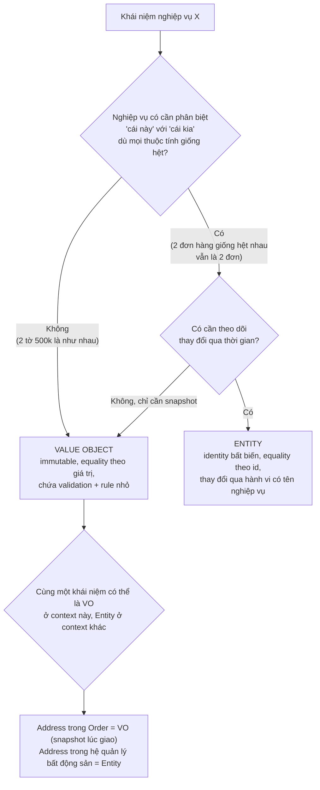
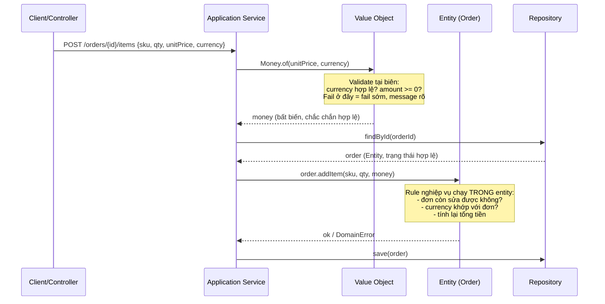
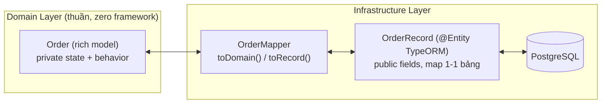

+++
title = "Chương 6: Entity và Value Object — Hai viên gạch đầu tiên của Tactical Design"
date = "2026-07-09T13:00:00+07:00"
draft = false
tags = ["backend", "ddd", "architecture"]
series = ["Domain-Driven Design"]
+++

> **Vị trí chương này:** Từ chương 1 đến chương 5, chúng ta đã đi qua Strategic Design — cách chia hệ thống thành Domain, Subdomain, Bounded Context và cách các context nói chuyện với nhau. Từ chương này trở đi, chúng ta bước vào **Tactical Design**: cách viết code *bên trong* một Bounded Context. Entity và Value Object là hai building block cơ bản nhất — mọi thứ khác (Aggregate ở chương 7, Repository ở chương 8, Domain Service ở chương 9) đều xây trên hai khái niệm này. Nếu bạn hiểu sai Entity/Value Object, toàn bộ phần còn lại của Tactical Design sẽ méo theo.

---

## 1. Problem Statement — Những bug quen thuộc mà bạn đã từng gặp

Trước khi nói về khái niệm, hãy nhìn ba sự cố production có thật (đã đổi tên, nhưng kịch bản thì đội nào cũng từng dính ít nhất một):

### Sự cố 1: Cộng 100 USD với 100 VND ra 200

Một hệ thống thanh toán đa tiền tệ. Model như sau:

```typescript
// order.entity.ts — "entity" theo nghĩa TypeORM
@Entity()
export class Order {
  @PrimaryGeneratedColumn('uuid')
  id: string;

  @Column('decimal')
  totalAmount: number;   // 100 là 100 gì? USD? VND? cent hay đồng?

  @Column()
  currency: string;      // nằm ở cột khác, chẳng liên quan gì đến totalAmount
}
```

Ở một service nào đó, ai đó viết:

```typescript
order.totalAmount = order.totalAmount + refund.amount;
```

`refund.amount` là VND, `order.totalAmount` là USD. Compiler không phàn nàn — cả hai đều là `number`. Test không bắt được — test chỉ dùng một loại tiền. Bug sống 4 tháng trên production cho đến khi kế toán đối soát cuối quý.

**Câu hỏi first-principles:** tại sao compiler không cứu được chúng ta? Vì trong model này, "tiền" không tồn tại. Chỉ có `number` và `string` tồn tại. Tri thức "tiền có currency, hai loại tiền khác nhau không cộng được với nhau" nằm trong đầu developer, không nằm trong code.

### Sự cố 2: Đơn hàng đã giao vẫn bị hủy

```typescript
// Ở một chỗ nào đó trong codebase 300k dòng
order.status = 'CANCELLED';
await orderRepo.save(order);
```

Rule nghiệp vụ là "đơn đã giao (DELIVERED) không được hủy". Rule này *có* được implement — trong `OrderService.cancelOrder()`. Nhưng một developer khác, làm feature "admin bulk update", không biết đến rule đó và set thẳng `status`. Vì `status` là public field với setter tự do, không gì ngăn được anh ta.

**Câu hỏi first-principles:** rule "đơn DELIVERED không được hủy" thuộc về *ai*? Nó thuộc về khái niệm Order. Nhưng trong code, Order chỉ là túi dữ liệu — rule bị đẩy ra service, và service thì có thể bị bypass.

### Sự cố 3: Hai user "trùng nhau" mà không trùng

Hệ thống CRM merge dữ liệu khách hàng. Code so sánh khách hàng bằng email:

```go
if customerA.Email == customerB.Email {
    merge(customerA, customerB)
}
```

Một bản ghi có email `"Gavin@Smartbit.One "` (viết hoa, thừa dấu cách do import từ Excel), bản kia là `"gavin@smartbit.one"`. Hệ thống coi là hai người khác nhau → gửi hai hóa đơn, hai chiến dịch marketing, khách hàng phàn nàn. Ngược lại, có nơi khác trong hệ thống lại so sánh khách hàng bằng... số điện thoại, và hai người dùng chung số công ty bị merge nhầm thành một.

**Câu hỏi first-principles:** khi nào hai "thứ" là một? Với email — hai email là một khi *giá trị chuẩn hóa* của chúng bằng nhau. Với khách hàng — hai khách hàng là một khi *identity* của họ là một, bất kể email hay số điện thoại thay đổi. Hai loại "bằng nhau" này hoàn toàn khác nhau, và trộn lẫn chúng là nguồn của cả hai bug trên.

Ba sự cố, một gốc rễ chung: **model không phân biệt được thứ gì có identity và thứ gì chỉ là giá trị, và không đặt rule nghiệp vụ vào đúng chỗ của nó.** Đó chính xác là vấn đề mà Entity và Value Object giải quyết.

---

## 2. Tại sao DDD đưa ra hai khái niệm này?

Eric Evans không phát minh ra Entity và Value Object từ hư không. Ông quan sát một thực tế: trong mọi domain, các khái niệm nghiệp vụ chia thành hai họ có *ngữ nghĩa bằng nhau* (equality semantics) khác nhau:

1. **Những thứ nghiệp vụ quan tâm "nó là cái nào"** — khách hàng, đơn hàng, tài khoản, hợp đồng. Khách hàng Nguyễn Văn A đổi email, đổi số điện thoại, thậm chí đổi tên — vẫn là khách hàng đó, vẫn nợ công ty 50 triệu. Cái làm nên "nó" là **identity xuyên suốt thời gian**, không phải thuộc tính tại một thời điểm.

2. **Những thứ nghiệp vụ chỉ quan tâm "nó bằng bao nhiêu / nó là gì"** — 500.000 VND, địa chỉ "12 Nguyễn Huệ, Q1", khoảng thời gian 01/07–15/07, email `gavin@smartbit.one`. Không ai hỏi "tờ 500 nghìn *nào*?" khi thanh toán. Hai tờ 500 nghìn là hoàn toàn thay thế được cho nhau (fungible). Cái làm nên "nó" là **toàn bộ giá trị của nó**.

Nếu bạn dùng chung một cách model cho cả hai họ (mà thói quen ORM-first đẩy chúng ta vào: mọi thứ đều là class có `id` và các cột), bạn sẽ:

- So sánh nhầm loại equality (sự cố 3).
- Cho phép mutate những thứ đáng lẽ bất biến (sự cố 1 — tiền bị cộng bừa).
- Không có chỗ tự nhiên để đặt rule nghiệp vụ (sự cố 2 — rule trôi dạt ra service).

DDD tách bạch hai họ này thành **Entity** (identity-based) và **Value Object** (value-based), kèm theo các quy tắc thiết kế riêng cho từng loại. Đó không phải là "pattern cho đẹp" — đó là cách ép ngữ nghĩa nghiệp vụ vào type system để compiler và cấu trúc code bảo vệ bạn.

---

## 3. Bản chất — mỗi khái niệm bảo vệ điều gì?

### 3.1. Entity bảo vệ: identity và tính liên tục của vòng đời

**Entity** là khái niệm nghiệp vụ được định danh bằng identity, có vòng đời (được sinh ra, thay đổi trạng thái qua thời gian, có thể kết thúc), và **hai Entity bằng nhau khi và chỉ khi identity bằng nhau**.

Điểm mấu chốt không phải "nó có id" — mọi row trong DB đều có primary key. Điểm mấu chốt là **tính liên tục (continuity)**: Order #12345 lúc 9h sáng ở trạng thái PENDING và lúc 3h chiều ở trạng thái SHIPPED là *cùng một đơn hàng*, và lịch sử thay đổi của nó có ý nghĩa nghiệp vụ. Ai đặt? Đặt lúc nào? Đã qua những trạng thái nào? Câu chuyện đó gắn với identity.

Hệ quả thiết kế:

- **Identity phải bất biến và được gán sớm** — lý tưởng là ngay lúc tạo (UUID/ULID sinh ở application), không đợi DB auto-increment. Một Entity chưa có identity là một Entity "chưa tồn tại đầy đủ", và code xử lý nó sẽ đầy `if (order.id === undefined)`.
- **Trạng thái thay đổi qua hành vi, không qua setter** — vì mỗi thay đổi trạng thái là một *sự kiện nghiệp vụ* có điều kiện và hệ quả (cancel một đơn hàng ≠ set status = CANCELLED; nó còn kiểm tra điều kiện, hoàn tiền, ghi lý do, phát event).
- **Equality theo id, và chỉ theo id.** So sánh field-by-field hai Order là vô nghĩa về mặt nghiệp vụ.

### 3.2. Value Object bảo vệ: tính đúng đắn của giá trị và các rule nhỏ đi kèm

**Value Object (VO)** là khái niệm được định danh bằng chính giá trị của nó, không có identity, không có vòng đời, và **immutable**. Hai VO bằng nhau khi mọi thành phần giá trị bằng nhau.

VO không phải là "struct tiện lợi". Nó là **nơi cư trú của các business rule nhỏ nhưng chí mạng**:

- `Money` biết rằng hai currency khác nhau không cộng được, rằng tiền không âm (trong ngữ cảnh giá bán), rằng chia tiền phải xử lý phần dư (bài toán chia 100 đồng cho 3 người).
- `Email` biết cách chuẩn hóa (lowercase, trim) và validate format — **một lần, tại nơi sinh ra**, thay vì rải regex ở 14 chỗ.
- `DateRange` biết rằng `start <= end`, biết cách kiểm tra hai khoảng có overlap không — rule nền tảng của mọi hệ booking.
- `Quantity` biết rằng số lượng phải nguyên dương và không vượt quá giới hạn đặt hàng.

**Vì sao VO phải immutable?** Đây không phải là sở thích functional programming. Có ba lý do rất thực dụng:

1. **Loại bỏ aliasing bug.** Nếu `Money` mutable và hai Order cùng giữ reference đến một object `Money`, sửa tiền của đơn này làm hỏng đơn kia. Đây là loại bug cực khó debug vì nơi gây bug và nơi biểu hiện bug cách xa nhau. Immutable → share thoải mái, không bao giờ hỏng ngầm.
2. **Validate một lần là đủ.** VO chỉ có thể được tạo qua constructor/factory có validate. Vì không ai sửa được nó sau đó, một VO tồn tại ⇒ nó hợp lệ, mãi mãi. Toàn bộ code phía sau *không cần* defensive check nữa. So sánh với primitive: `string email` phải được re-validate ở mọi nơi nghi ngờ, hoặc (thực tế hơn) không được validate ở đâu cả.
3. **An toàn concurrency miễn phí.** Object bất biến đọc từ nhiều goroutine/nhiều request đồng thời không cần lock. Trong Go, điều này loại bỏ hẳn một họ data race.

Nói cách khác: **immutability biến "hy vọng dữ liệu đúng" thành "bằng chứng dữ liệu đúng" ở mức type system.** Mỗi VO là một hợp đồng: "nếu bạn cầm được tôi, tôi hợp lệ".

### 3.3. Primitive Obsession — gốc của rất nhiều bug production

**Primitive obsession** là thói quen dùng kiểu nguyên thủy (`string`, `number`, `float64`) để biểu diễn khái niệm nghiệp vụ. Nó là anti-pattern phổ biến nhất trong backend code, và tai hại vì:

| Dùng primitive | Hậu quả thực tế |
|---|---|
| `amount: number` | Cộng USD với VND (sự cố 1); nhầm cent với đồng; sai số float (`0.1 + 0.2 !== 0.3`) trên tiền |
| `email: string` | Email chưa chuẩn hóa lọt vào DB; duplicate account; so sánh sai |
| `userId: string`, `orderId: string` | Truyền nhầm tham số: `transfer(toId, fromId)` đảo chỗ — compiler im lặng vì cả hai đều là string |
| `startDate, endDate: Date` rời rạc | `endDate < startDate` lọt qua; logic overlap viết lại 5 lần, sai 2 lần |
| `percent: number` | 0.15 hay 15? Mỗi module hiểu một kiểu; bug giảm giá 1500% |

Điểm chung: **compiler mù nghiệp vụ**. Khi mọi thứ là `string`/`number`, type system chỉ kiểm tra được "đây có phải chuỗi ký tự không" — câu hỏi vô giá trị. Khi bạn nâng lên `Email`, `Money`, `OrderId`, type system bắt đầu kiểm tra được câu hỏi nghiệp vụ: "chỗ này cần tiền, anh đưa tôi cái gì đây?"

Chi phí sửa một bug production kiểu này (điều tra, hotfix, đối soát dữ liệu, xin lỗi khách) luôn lớn hơn nhiều lần chi phí viết một class `Money` 80 dòng. Đó là phép tính ROI đơn giản nhất trong DDD.

---

## 4. Cách hoạt động

### 4.1. Sơ đồ phân loại: khi nào là Entity, khi nào là Value Object?

Câu hỏi quyết định không phải "nó có id trong DB không" mà là **"nghiệp vụ có cần theo dõi nó qua thời gian không?"**



Lưu ý dòng cuối cùng của sơ đồ — nó quan trọng hơn vẻ ngoài của nó: **Entity/VO là quyết định theo Bounded Context, không phải thuộc tính tuyệt đối của khái niệm.** "Địa chỉ giao hàng" trong đơn hàng là VO — nếu khách sửa địa chỉ nhà sau khi đơn đã giao, đơn hàng cũ *không được* thay đổi (nó là bằng chứng lịch sử: hàng đã giao đến đâu). Nhưng "địa chỉ" trong hệ thống quản lý tòa nhà là Entity — tòa nhà đổi tên đường vẫn là tòa nhà đó. Đây là lý do chương 4 (Bounded Context) phải đứng trước chương này.

### 4.2. Vòng đời và dòng chảy dữ liệu



Hai điểm nhìn vào sơ đồ:

1. **Dữ liệu thô chết ở biên.** Từ sau bước `Money.of(...)`, không còn `number` + `string` trôi nổi nữa — chỉ còn `Money`. Vùng lõi của hệ thống làm việc hoàn toàn với các kiểu đã được chứng minh hợp lệ.
2. **Application Service không chứa rule.** Nó điều phối: parse input thành VO, load Entity, gọi hành vi, save. Rule "đơn còn sửa được không" nằm trong `order.addItem` — nơi duy nhất, không thể bypass (chi tiết hơn ở chương 9).

---

## 5. Đối chiếu quan trọng: Entity của DDD ≠ "entity" của ORM

Đây là ngộ nhận số một của developer Việt Nam (và thế giới) khi tiếp cận DDD, vì chúng ta học từ ORM trước: TypeORM có decorator `@Entity`, GORM có struct map bảng, JPA có `@Entity`. Cùng một chữ, hai khái niệm gần như không liên quan:

| | "Entity" của ORM (TypeORM/GORM/JPA) | Entity của DDD |
|---|---|---|
| Bản chất | **Row mapping** — cấu trúc dữ liệu ánh xạ 1-1 với bảng | **Khái niệm nghiệp vụ** có identity, vòng đời, hành vi |
| Sinh ra từ đâu | Schema database ("có bảng orders thì có class Order") | Ubiquitous Language ("nghiệp vụ nói về Đơn hàng") |
| Ai quyết định hình dạng | DBA / nhu cầu lưu trữ / normalization | Domain expert / invariant nghiệp vụ |
| Hành vi | Không có (hoặc chỉ hook lifecycle của ORM) | Là phần quan trọng nhất: `order.cancel()`, `order.addItem()` |
| Setter/public field | Bắt buộc phải có để ORM hydrate | Tránh tối đa; state thay đổi qua method nghiệp vụ |
| Quan hệ | Foreign key, eager/lazy relations | Aggregate boundary, reference bằng id (chương 7) |
| Validation | Constraint DB, decorator validate từng field | Invariant xuyên nhiều field, được bảo vệ trong hành vi |
| Equality | Theo primary key (tình cờ giống DDD) | Theo identity — nhưng là identity *nghiệp vụ* |

Nói ngắn gọn: **`@Entity` của TypeORM trả lời "dữ liệu này nằm ở đâu"; Entity của DDD trả lời "khái niệm này là gì và được phép làm gì".** Một cái là persistence concern, một cái là domain concern. Việc chúng trùng tên là tai nạn lịch sử đáng tiếc nhất trong thuật ngữ ngành.

### 5.1. Anemic Domain Model sinh ra từ thói quen ORM-first như thế nào

Quy trình quen thuộc của một team backend điển hình:

1. Nhận requirement → **thiết kế bảng trước** (ERD).
2. Generate/viết ORM entity từ bảng: class toàn field + getter/setter, không hành vi.
3. Cần logic? Viết vào `OrderService`. Service nhận entity, đọc field, tính toán, set field, save.
4. Sáu tháng sau: `OrderService` 3.000 dòng, logic về Order còn rải thêm ở `PaymentService`, `AdminService`, `CronJob`, và 2 cái stored procedure không ai dám đụng.

Kết quả là **Anemic Domain Model** — model "thiếu máu": class mang tên nghiệp vụ (`Order`, `Customer`) nhưng bên trong rỗng ruột, toàn data không behavior. Martin Fowler gọi đây là anti-pattern vì nó trả chi phí của OOP (class, object, mapping) mà không nhận lợi ích nào của OOP (encapsulation, hành vi gắn dữ liệu).

Tại sao anemic model nguy hiểm, cụ thể?

- **Rule không có địa chỉ thường trú.** "Đơn DELIVERED không được hủy" nằm ở service nào? Developer mới không biết → viết lại → hai version rule → drift → bug sự cố 2.
- **Mọi state đều sửa được từ mọi nơi.** Public setter = lời mời bypass rule. Không phải developer cẩu thả — mà là *không có cách nào biết* rule tồn tại.
- **Test đắt đỏ.** Muốn test rule phải dựng service, mà service kéo theo repository, kéo theo DB/mock. Trong khi rich model: `new Order(...); order.cancel(); expect(...)` — pure, chạy hàng nghìn test trong một giây.
- **Ubiquitous Language chết.** Nghiệp vụ nói "hủy đơn", code nói `setStatus(CANCELLED)` + `setUpdatedAt(now)` + `setCancelReason(...)` ở ba nơi. Khoảng cách ngôn ngữ (chương 3) mở rộng dần cho đến khi không ai dịch nổi.

Cần công bằng: anemic model **không phải lúc nào cũng sai**. Với CRUD thuần túy (quản lý danh mục tỉnh thành, config), anemic + ORM là lựa chọn *đúng* — rẻ và đủ. Nó chỉ trở thành anti-pattern khi domain có rule thật mà model không chứa rule. Xem mục 12 (Khi nào KHÔNG nên dùng).

---

## 6. Code mẫu: Money Value Object và Order Entity — TypeScript và Go

### 6.1. Money Value Object — TypeScript (dùng được trong NestJS)

Yêu cầu nghiệp vụ của `Money`: lưu bằng đơn vị nhỏ nhất (đồng/cent) dưới dạng số nguyên để tránh floating point; không cho cộng/trừ/so sánh khác currency; không âm khi trừ quá; immutable tuyệt đối.

```typescript
// src/shared/domain/money.ts — KHÔNG import gì từ TypeORM/NestJS
export type CurrencyCode = 'VND' | 'USD' | 'EUR';

const MINOR_UNIT: Record<CurrencyCode, number> = {
  VND: 0,   // VND không có đơn vị lẻ
  USD: 2,   // cent
  EUR: 2,
};

export class CurrencyMismatchError extends Error {
  constructor(a: CurrencyCode, b: CurrencyCode) {
    super(`Không thể thao tác giữa hai loại tiền khác nhau: ${a} và ${b}`);
  }
}

export class Money {
  // private + readonly: không sửa được từ ngoài, không sửa được từ trong
  private constructor(
    private readonly _amount: bigint,        // đơn vị nhỏ nhất, bigint để không tràn số
    private readonly _currency: CurrencyCode,
  ) {}

  /** Cánh cổng duy nhất — mọi validate nằm ở đây */
  static of(amountInMinorUnit: bigint | number, currency: CurrencyCode): Money {
    const amount = BigInt(amountInMinorUnit);
    if (amount < 0n) {
      throw new Error(`Money không được âm: ${amount} ${currency}`);
    }
    if (!(currency in MINOR_UNIT)) {
      throw new Error(`Currency không được hỗ trợ: ${currency}`);
    }
    return new Money(amount, currency);
  }

  static zero(currency: CurrencyCode): Money {
    return new Money(0n, currency);
  }

  /** Parse từ số thập phân người dùng nhập, ví dụ "10.50" USD → 1050 cent */
  static parse(decimalString: string, currency: CurrencyCode): Money {
    const digits = MINOR_UNIT[currency];
    if (!/^\d+(\.\d+)?$/.test(decimalString)) {
      throw new Error(`Định dạng số tiền không hợp lệ: "${decimalString}"`);
    }
    const [intPart, fracPart = ''] = decimalString.split('.');
    if (fracPart.length > digits) {
      throw new Error(`${currency} chỉ có ${digits} chữ số lẻ, nhận được "${decimalString}"`);
    }
    const minor = BigInt(intPart) * BigInt(10 ** digits) +
                  BigInt(fracPart.padEnd(digits, '0') || '0');
    return Money.of(minor, currency);
  }

  get amount(): bigint { return this._amount; }
  get currency(): CurrencyCode { return this._currency; }

  private assertSameCurrency(other: Money): void {
    if (this._currency !== other._currency) {
      throw new CurrencyMismatchError(this._currency, other._currency);
    }
  }

  // ===== Mọi phép toán trả về Money MỚI — không bao giờ mutate =====

  add(other: Money): Money {
    this.assertSameCurrency(other);
    return new Money(this._amount + other._amount, this._currency);
  }

  subtract(other: Money): Money {
    this.assertSameCurrency(other);
    const result = this._amount - other._amount;
    if (result < 0n) {
      throw new Error(
        `Kết quả trừ tiền bị âm: ${this._amount} - ${other._amount} ${this._currency}`,
      );
    }
    return new Money(result, this._currency);
  }

  multiply(factor: number): Money {
    if (!Number.isInteger(factor) || factor < 0) {
      throw new Error(`Hệ số nhân phải là số nguyên không âm: ${factor}`);
    }
    return new Money(this._amount * BigInt(factor), this._currency);
  }

  /** Chia tiền cho n phần, phần dư dồn vào các phần đầu — bài toán split bill kinh điển */
  allocate(parts: number): Money[] {
    if (!Number.isInteger(parts) || parts <= 0) {
      throw new Error(`Số phần chia phải nguyên dương: ${parts}`);
    }
    const n = BigInt(parts);
    const base = this._amount / n;
    const remainder = this._amount % n;
    return Array.from({ length: parts }, (_, i) =>
      new Money(base + (BigInt(i) < remainder ? 1n : 0n), this._currency),
    );
  }

  // ===== So sánh =====

  equals(other: Money): boolean {
    return this._currency === other._currency && this._amount === other._amount;
  }

  isGreaterThan(other: Money): boolean {
    this.assertSameCurrency(other);
    return this._amount > other._amount;
  }

  isGreaterThanOrEqual(other: Money): boolean {
    this.assertSameCurrency(other);
    return this._amount >= other._amount;
  }

  isZero(): boolean { return this._amount === 0n; }

  toString(): string {
    const digits = MINOR_UNIT[this._currency];
    if (digits === 0) return `${this._amount} ${this._currency}`;
    const s = this._amount.toString().padStart(digits + 1, '0');
    return `${s.slice(0, -digits)}.${s.slice(-digits)} ${this._currency}`;
  }
}
```

Đọc lại ba bug ở mục 1 và soi vào class này:

- **Tiền âm** → `subtract` throw ngay tại chỗ, message chỉ đích danh phép trừ nào. Không cần luồng nào "nhớ kiểm tra".
- **Cộng nhầm currency** → `add` throw `CurrencyMismatchError`. Bug 4 tháng trở thành exception trong 4 giây đầu tiên chạy test.
- **Floating point** → `bigint` đơn vị nhỏ nhất. `0.1 + 0.2` không còn tồn tại trong hệ quy chiếu này.

Chú ý `allocate`: chia 100 VND cho 3 người ra `[34, 33, 33]` — tổng vẫn đúng 100. Nếu dùng `number` và chia float, tổng ba phần là `99.99999...`. Đây là loại rule "nhỏ mà chí mạng" chỉ có chỗ đứng tự nhiên trong Value Object.

### 6.2. Money Value Object — Go

Go không có class/private constructor, nhưng đạt được cùng mức bảo vệ bằng **unexported field + package boundary**:

```go
// package domain/money — file money.go
package money

import (
	"errors"
	"fmt"
)

type Currency string

const (
	VND Currency = "VND"
	USD Currency = "USD"
	EUR Currency = "EUR"
)

var minorUnitDigits = map[Currency]int{VND: 0, USD: 2, EUR: 2}

var (
	ErrCurrencyMismatch = errors.New("hai loại tiền khác nhau")
	ErrNegativeAmount   = errors.New("số tiền không được âm")
	ErrUnknownCurrency  = errors.New("currency không được hỗ trợ")
)

// Money là value object: field unexported, chỉ tạo được qua New.
// Truyền theo VALUE (không phải *Money) → mỗi bên giữ bản copy riêng,
// immutability được đảm bảo bởi ngữ nghĩa copy của Go.
type Money struct {
	amount   int64 // đơn vị nhỏ nhất
	currency Currency
}

func New(amountMinor int64, c Currency) (Money, error) {
	if _, ok := minorUnitDigits[c]; !ok {
		return Money{}, fmt.Errorf("%w: %s", ErrUnknownCurrency, c)
	}
	if amountMinor < 0 {
		return Money{}, fmt.Errorf("%w: %d %s", ErrNegativeAmount, amountMinor, c)
	}
	return Money{amount: amountMinor, currency: c}, nil
}

func Zero(c Currency) Money { return Money{amount: 0, currency: c} }

func (m Money) Amount() int64      { return m.amount }
func (m Money) Currency() Currency { return m.currency }
func (m Money) IsZero() bool       { return m.amount == 0 }

func (m Money) assertSame(o Money) error {
	if m.currency != o.currency {
		return fmt.Errorf("%w: %s và %s", ErrCurrencyMismatch, m.currency, o.currency)
	}
	return nil
}

// Add trả về Money MỚI — receiver theo value nên không thể mutate m gốc.
func (m Money) Add(o Money) (Money, error) {
	if err := m.assertSame(o); err != nil {
		return Money{}, err
	}
	return Money{amount: m.amount + o.amount, currency: m.currency}, nil
}

func (m Money) Subtract(o Money) (Money, error) {
	if err := m.assertSame(o); err != nil {
		return Money{}, err
	}
	if m.amount < o.amount {
		return Money{}, fmt.Errorf("%w: %d - %d %s",
			ErrNegativeAmount, m.amount, o.amount, m.currency)
	}
	return Money{amount: m.amount - o.amount, currency: m.currency}, nil
}

func (m Money) Multiply(factor int64) (Money, error) {
	if factor < 0 {
		return Money{}, fmt.Errorf("%w: hệ số %d", ErrNegativeAmount, factor)
	}
	return Money{amount: m.amount * factor, currency: m.currency}, nil
}

// Equals: value object so sánh bằng TOÀN BỘ giá trị.
// Go cho phép m == o với struct comparable — nhưng viết method rõ ràng hơn.
func (m Money) Equals(o Money) bool {
	return m.currency == o.currency && m.amount == o.amount
}

func (m Money) GreaterThanOrEqual(o Money) (bool, error) {
	if err := m.assertSame(o); err != nil {
		return false, err
	}
	return m.amount >= o.amount, nil
}
```

Khác biệt phong cách đáng chú ý giữa hai ngôn ngữ:

- TypeScript throw exception; Go trả `error`. Cả hai đều là "fail sớm, fail rõ" — chọn theo idiom của ngôn ngữ, đừng bê exception style sang Go.
- Go dùng **value semantics** (receiver và tham số theo value, không pointer) — đây là cách tự nhiên nhất để có immutability trong Go. Nếu bạn thấy `*Money` ở đâu đó, gần như chắc chắn là code smell.
- Field unexported + constructor trong cùng package = chỉ package `money` tạo được `Money` hợp lệ. Lưu ý một lỗ hổng của Go: `money.Money{}` (zero value) vẫn tạo được từ ngoài package — vì vậy nên thiết kế sao cho zero value vô hại (amount 0, currency rỗng sẽ fail ở phép toán đầu tiên do mismatch), và có thể thêm check `m.currency == ""` trong `assertSame` nếu muốn chặt hơn.

### 6.3. Order Entity có hành vi — TypeScript

Đây là Entity theo đúng nghĩa DDD: state private, thay đổi duy nhất qua hành vi mang tên nghiệp vụ, mỗi hành vi tự bảo vệ rule của nó.

```typescript
// src/ordering/domain/order.ts — thuần TypeScript, zero dependency framework
import { Money, CurrencyCode } from '../../shared/domain/money';

export class OrderId {
  private constructor(readonly value: string) {}
  static of(value: string): OrderId {
    if (!/^[0-9a-f-]{36}$/i.test(value)) throw new Error(`OrderId không hợp lệ: ${value}`);
    return new OrderId(value);
  }
  equals(other: OrderId): boolean { return this.value === other.value; }
}

export enum OrderStatus {
  PENDING = 'PENDING',
  CONFIRMED = 'CONFIRMED',
  SHIPPED = 'SHIPPED',
  DELIVERED = 'DELIVERED',
  CANCELLED = 'CANCELLED',
}

export class OrderLine {
  constructor(
    readonly productId: string,
    readonly unitPrice: Money,
    private _quantity: number,
  ) {
    if (!Number.isInteger(_quantity) || _quantity <= 0) {
      throw new Error(`Số lượng phải nguyên dương: ${_quantity}`);
    }
  }
  get quantity(): number { return this._quantity; }
  subtotal(): Money { return this.unitPrice.multiply(this._quantity); }
  increaseQuantity(by: number): void {
    if (!Number.isInteger(by) || by <= 0) throw new Error(`Tăng số lượng phải nguyên dương`);
    this._quantity += by;
  }
}

export class DomainError extends Error {}

export class Order {
  private constructor(
    readonly id: OrderId,
    private _status: OrderStatus,
    private readonly _currency: CurrencyCode,
    private readonly _lines: OrderLine[],
    private _cancelReason: string | null,
  ) {}

  static create(id: OrderId, currency: CurrencyCode): Order {
    return new Order(id, OrderStatus.PENDING, currency, [], null);
  }

  get status(): OrderStatus { return this._status; }
  /** Trả về bản copy — không cho bên ngoài mutate mảng nội bộ */
  get lines(): readonly OrderLine[] { return [...this._lines]; }

  // ===== HÀNH VI, không phải setter =====

  addItem(productId: string, unitPrice: Money, quantity: number): void {
    if (this._status !== OrderStatus.PENDING) {
      throw new DomainError(
        `Chỉ thêm được item khi đơn ở trạng thái PENDING, hiện tại: ${this._status}`,
      );
    }
    if (unitPrice.currency !== this._currency) {
      throw new DomainError(
        `Đơn hàng dùng ${this._currency}, item lại có giá ${unitPrice.currency}`,
      );
    }
    const existing = this._lines.find((l) => l.productId === productId);
    if (existing) {
      existing.increaseQuantity(quantity); // gộp line, không tạo line trùng
    } else {
      this._lines.push(new OrderLine(productId, unitPrice, quantity));
    }
  }

  removeItem(productId: string): void {
    if (this._status !== OrderStatus.PENDING) {
      throw new DomainError(`Không sửa được item khi đơn đã ${this._status}`);
    }
    const idx = this._lines.findIndex((l) => l.productId === productId);
    if (idx === -1) throw new DomainError(`Đơn không chứa sản phẩm ${productId}`);
    this._lines.splice(idx, 1);
  }

  confirm(): void {
    if (this._status !== OrderStatus.PENDING) {
      throw new DomainError(`Không confirm được đơn đang ở trạng thái ${this._status}`);
    }
    if (this._lines.length === 0) {
      throw new DomainError(`Không confirm được đơn rỗng`);
    }
    this._status = OrderStatus.CONFIRMED;
  }

  cancel(reason: string): void {
    // RULE của sự cố 2 — giờ nó sống ở đây, MỘT nơi, không thể bypass
    const cancellable = [OrderStatus.PENDING, OrderStatus.CONFIRMED];
    if (!cancellable.includes(this._status)) {
      throw new DomainError(
        `Đơn ở trạng thái ${this._status} không thể hủy (chỉ hủy được PENDING/CONFIRMED)`,
      );
    }
    if (!reason?.trim()) throw new DomainError(`Hủy đơn bắt buộc có lý do`);
    this._status = OrderStatus.CANCELLED;
    this._cancelReason = reason.trim();
  }

  total(): Money {
    return this._lines.reduce(
      (sum, line) => sum.add(line.subtotal()),
      Money.zero(this._currency),
    );
  }
}
```

So sánh trực diện với phiên bản anemic:

```typescript
// ANEMIC — mọi nơi đều làm được điều này:
order.status = 'CANCELLED';           // đơn DELIVERED? Kệ.
order.totalAmount = -500;             // tiền âm? Kệ.

// RICH — chỉ có một con đường, và con đường đó có rule:
order.cancel('Khách đổi ý');          // throw nếu đã DELIVERED
order.total();                        // luôn được TÍNH từ lines, không set được → không bao giờ lệch
```

Điểm tinh tế nhất: `total()` là **giá trị dẫn xuất (derived)** — nó được tính, không được lưu như một field có setter. Cả một họ bug "tổng tiền lệch với chi tiết" biến mất vì trạng thái lệch *không thể biểu diễn được*.

### 6.4. Order Entity — Go

```go
// package ordering/domain — file order.go
package domain

import (
	"errors"
	"fmt"

	"yourapp/domain/money"
)

type OrderStatus string

const (
	StatusPending   OrderStatus = "PENDING"
	StatusConfirmed OrderStatus = "CONFIRMED"
	StatusShipped   OrderStatus = "SHIPPED"
	StatusDelivered OrderStatus = "DELIVERED"
	StatusCancelled OrderStatus = "CANCELLED"
)

var ErrDomainRule = errors.New("vi phạm rule nghiệp vụ")

type OrderLine struct {
	ProductID string
	UnitPrice money.Money
	Quantity  int64
}

func (l OrderLine) Subtotal() (money.Money, error) {
	return l.UnitPrice.Multiply(l.Quantity)
}

// Order là ENTITY: identity (id) bất biến, state unexported,
// mọi thay đổi đi qua method có tên nghiệp vụ.
type Order struct {
	id           string
	status       OrderStatus
	currency     money.Currency
	lines        []OrderLine
	cancelReason string
}

func NewOrder(id string, c money.Currency) (*Order, error) {
	if id == "" {
		return nil, fmt.Errorf("%w: order id rỗng", ErrDomainRule)
	}
	return &Order{id: id, status: StatusPending, currency: c}, nil
}

func (o *Order) ID() string          { return o.id }
func (o *Order) Status() OrderStatus { return o.status }

// Lines trả về COPY để bên ngoài không mutate được slice nội bộ.
func (o *Order) Lines() []OrderLine {
	out := make([]OrderLine, len(o.lines))
	copy(out, o.lines)
	return out
}

func (o *Order) AddItem(productID string, unitPrice money.Money, qty int64) error {
	if o.status != StatusPending {
		return fmt.Errorf("%w: chỉ thêm item khi PENDING, hiện tại %s", ErrDomainRule, o.status)
	}
	if unitPrice.Currency() != o.currency {
		return fmt.Errorf("%w: đơn dùng %s, item có giá %s",
			ErrDomainRule, o.currency, unitPrice.Currency())
	}
	if qty <= 0 {
		return fmt.Errorf("%w: số lượng phải dương, nhận %d", ErrDomainRule, qty)
	}
	for i := range o.lines {
		if o.lines[i].ProductID == productID {
			o.lines[i].Quantity += qty // gộp line trùng
			return nil
		}
	}
	o.lines = append(o.lines, OrderLine{ProductID: productID, UnitPrice: unitPrice, Quantity: qty})
	return nil
}

func (o *Order) Confirm() error {
	if o.status != StatusPending {
		return fmt.Errorf("%w: không confirm được đơn %s", ErrDomainRule, o.status)
	}
	if len(o.lines) == 0 {
		return fmt.Errorf("%w: không confirm được đơn rỗng", ErrDomainRule)
	}
	o.status = StatusConfirmed
	return nil
}

func (o *Order) Cancel(reason string) error {
	if o.status != StatusPending && o.status != StatusConfirmed {
		return fmt.Errorf("%w: đơn %s không thể hủy", ErrDomainRule, o.status)
	}
	if reason == "" {
		return fmt.Errorf("%w: hủy đơn bắt buộc có lý do", ErrDomainRule)
	}
	o.status = StatusCancelled
	o.cancelReason = reason
	return nil
}

func (o *Order) Total() (money.Money, error) {
	sum := money.Zero(o.currency)
	for _, l := range o.lines {
		sub, err := l.Subtotal()
		if err != nil {
			return money.Money{}, err
		}
		sum, err = sum.Add(sub)
		if err != nil {
			return money.Money{}, err
		}
	}
	return sum, nil
}
```

Nhận xét cho Go engineer: Entity dùng **pointer receiver** (`*Order`) vì nó *có* vòng đời và *được phép* thay đổi trạng thái — ngược với Value Object dùng value receiver. Chính quy ước receiver này trong Go là tín hiệu đọc-code rất tốt: thấy value receiver → value object, thấy pointer receiver + field unexported → entity.

---

## 7. Ví dụ refactor: từ CRUD/anemic sang rich model — từng bước

Kịch bản thật: hệ thống subscription SaaS. Yêu cầu mới: "khách được nâng cấp gói bất kỳ lúc nào, nhưng hạ cấp chỉ có hiệu lực từ kỳ thanh toán sau; gói đã hủy không được đổi".

### Bước 0 — hiện trạng anemic

```typescript
// subscription.entity.ts (TypeORM) — túi dữ liệu
@Entity()
export class Subscription {
  @PrimaryColumn() id: string;
  @Column() plan: string;              // 'free' | 'pro' | 'enterprise'
  @Column() status: string;            // 'active' | 'cancelled'
  @Column() nextBillingDate: Date;
  @Column({ nullable: true }) pendingPlan: string | null;
}

// subscription.service.ts — 100% logic ở đây
async changePlan(subId: string, newPlan: string) {
  const sub = await this.repo.findOneBy({ id: subId });
  const rank = { free: 0, pro: 1, enterprise: 2 };
  if (sub.status === 'cancelled') throw new BadRequestException('cancelled');
  if (rank[newPlan] > rank[sub.plan]) {
    sub.plan = newPlan;                 // upgrade ngay
  } else {
    sub.pendingPlan = newPlan;          // downgrade chờ kỳ sau
  }
  await this.repo.save(sub);
}
```

Vấn đề tiềm tàng: một cron job billing khác đọc `pendingPlan` và apply — nhưng nó được viết bởi team khác, quên check `status === 'cancelled'`. Một admin tool thì set thẳng `sub.plan`. Rule "gói đã hủy không được đổi" tồn tại ở đúng một hàm, trong khi có ba đường ghi dữ liệu.

### Bước 1 — gom khái niệm vào Value Object

`plan` là string trôi nổi kèm bảng `rank` — đó là một khái niệm nghiệp vụ (`Plan`) đang bị nghiền thành primitive:

```typescript
export class Plan {
  private static readonly RANK: Record<string, number> = { free: 0, pro: 1, enterprise: 2 };
  private constructor(readonly name: string) {}
  static of(name: string): Plan {
    if (!(name in Plan.RANK)) throw new Error(`Plan không tồn tại: ${name}`);
    return new Plan(name);
  }
  isUpgradeFrom(other: Plan): boolean { return Plan.RANK[this.name] > Plan.RANK[other.name]; }
  equals(other: Plan): boolean { return this.name === other.name; }
}
```

### Bước 2 — chuyển hành vi vào Entity

```typescript
export class Subscription {
  private constructor(
    readonly id: string,
    private _plan: Plan,
    private _status: 'active' | 'cancelled',
    private _pendingPlan: Plan | null,
    private _nextBillingDate: Date,
  ) {}

  changePlan(newPlan: Plan): void {
    if (this._status === 'cancelled') {
      throw new DomainError('Gói đã hủy không thể thay đổi');
    }
    if (newPlan.equals(this._plan)) {
      throw new DomainError('Gói mới trùng gói hiện tại');
    }
    if (newPlan.isUpgradeFrom(this._plan)) {
      this._plan = newPlan;              // upgrade: hiệu lực ngay
      this._pendingPlan = null;          // upgrade xóa mọi downgrade đang chờ
    } else {
      this._pendingPlan = newPlan;       // downgrade: chờ kỳ billing
    }
  }

  /** Cron billing gọi hàm này — rule vẫn được bảo vệ vì đi qua cùng entity */
  applyBillingCycle(now: Date): void {
    if (this._status === 'cancelled') return;
    if (this._pendingPlan) {
      this._plan = this._pendingPlan;
      this._pendingPlan = null;
    }
    this._nextBillingDate = addMonths(now, 1);
  }
}
```

### Bước 3 — service teo lại thành điều phối

```typescript
async changePlan(subId: string, newPlanName: string) {
  const plan = Plan.of(newPlanName);               // validate tại biên
  const sub = await this.subscriptionRepo.findById(subId);
  sub.changePlan(plan);                            // rule chạy trong entity
  await this.subscriptionRepo.save(sub);
}
```

Điều đã thay đổi về chất: cron job, admin tool, API — **mọi đường ghi giờ buộc phải đi qua `changePlan`/`applyBillingCycle`**, vì field đã private. Rule có một địa chỉ thường trú. Test rule giờ là pure unit test không cần DB. Và đây là điểm thường bị bỏ qua: refactor này **không đụng schema database** — bảng giữ nguyên, chỉ model trong code thay đổi. Refactor sang rich model có thể làm dần, module nào đau nhất làm trước.

---

## 8. Persistence mapping: tách domain model khỏi ORM model, hay chấp nhận trộn?

Câu hỏi thực dụng nhất chương này: `Order` rich model ở trên không có decorator TypeORM — vậy lưu xuống DB kiểu gì? Có hai trường phái, và **cả hai đều hợp lệ tùy bối cảnh**.

### Phương án A: Tách hẳn — domain model riêng, persistence model riêng



```typescript
// infrastructure/order.record.ts — ORM entity, chỉ là hình dạng của bảng
@Entity('orders')
export class OrderRecord {
  @PrimaryColumn() id: string;
  @Column() status: string;
  @Column() currency: string;
  @OneToMany(() => OrderLineRecord, (l) => l.order, { cascade: true, eager: true })
  lines: OrderLineRecord[];
}

// infrastructure/order.mapper.ts
export class OrderMapper {
  static toDomain(r: OrderRecord): Order {
    // Dùng hàm reconstitute — khôi phục entity từ dữ liệu ĐÃ hợp lệ trong DB,
    // không chạy lại rule "create" (đơn cũ có thể được tạo dưới rule cũ)
    return Order.reconstitute(
      OrderId.of(r.id),
      r.status as OrderStatus,
      r.currency as CurrencyCode,
      r.lines.map((l) => new OrderLine(l.productId, Money.of(BigInt(l.unitPriceMinor), r.currency as CurrencyCode), l.quantity)),
    );
  }
  static toRecord(o: Order): OrderRecord { /* chiều ngược lại */ }
}
```

- **Được gì:** domain model tự do tuyệt đối (private field, VO, bigint...), không thỏa hiệp với giới hạn của ORM; đổi ORM/DB không chạm domain; test domain thuần không kéo TypeORM.
- **Mất gì:** viết và maintain mapper — mỗi field thêm mới sửa 3 chỗ (domain, record, mapper); dễ lỗi mapping lệch nếu không có test; với model to, mapper là boilerplate thật sự.
- **Khi nào chọn:** core domain, model có nhiều VO và invariant, team ≥ trung bình, tuổi thọ hệ thống dài.

### Phương án B: Trộn — một class vừa là domain model vừa là ORM entity

Chấp nhận decorator TypeORM/tag GORM nằm ngay trên rich model, nhưng **giữ kỷ luật**: field vẫn private (TypeORM hydrate được qua reflection), không dùng public setter, hành vi vẫn là method nghiệp vụ.

```typescript
@Entity('orders')
export class Order {
  @PrimaryColumn()
  private readonly id: string;

  @Column()
  private status: OrderStatus;

  // behavior giữ nguyên như mục 6.3
  cancel(reason: string): void { /* ... rule ... */ }
}
```

- **Được gì:** không có mapper, ít code hơn hẳn, một nguồn sự thật về hình dạng dữ liệu.
- **Mất gì:** domain model bị ORM ràng buộc — VO phải có transformer/embedded để map cột, quan hệ lazy-loading có thể kích hoạt query ngầm trong method nghiệp vụ (nguy hiểm), migration schema kéo domain model thay đổi theo, và cám dỗ "thêm cái setter cho tiện" luôn thường trực vì decorator nhắc bạn rằng đây "chỉ là bảng".
- **Khi nào chọn:** supporting subdomain, model đơn giản, team nhỏ, cần tốc độ; hoặc Go + GORM nơi struct tag ít xâm lấn hơn decorator.

**Lời khuyên thực dụng:** đừng chọn một phương án cho toàn hệ thống. Chọn **theo từng Bounded Context**: context lõi (thanh toán, đặt hàng) tách hẳn; context phụ (quản lý banner, config) trộn cho nhanh. Sự nhất quán đáng giá, nhưng không đáng giá bằng việc đặt effort đúng chỗ — đây chính là tinh thần của [chương 02 — Domain & Subdomain](/series/domain-driven-design/02-domain-va-subdomain/).

---

## 9. Điểm mạnh — Điểm yếu — Trade-off

### 9.1. Điểm mạnh

1. **Rule có địa chỉ thường trú và không thể bypass.** Toàn bộ giá trị của Entity/VO quy về một câu: muốn vi phạm rule, bạn phải sửa code của chính class đó — và diff đó sẽ hiện ra ở code review.
2. **Fail sớm, gần nguồn lỗi.** VO chặn dữ liệu bẩn tại biên hệ thống; stack trace chỉ thẳng nơi gây lỗi thay vì nơi lỗi phát nổ (thường là DB constraint ba tầng phía sau).
3. **Test rẻ.** Rich model là pure object: hàng nghìn unit test chạy trong một giây, không DB, không mock framework.
4. **Code tự tài liệu hóa.** `order.cancel(reason)` đọc như câu nghiệp vụ. Danh sách method của Entity chính là danh sách use case mà nghiệp vụ nói tới — Ubiquitous Language sống trong code.
5. **Refactor an toàn.** Đổi cách tính `total()` chỉ đụng một hàm; compiler chỉ ra mọi nơi dùng khi đổi signature của VO.

### 9.2. Điểm yếu

1. **Nhiều code hơn cho việc đơn giản.** Một CRUD form 5 field trở thành 3 class + mapper. Với domain nghèo rule, đây là thuần chi phí.
2. **Đường cong học tập của team.** Dev quen ORM-first sẽ viết setter trá hình (`updateStatus(s)` không có rule bên trong vẫn là setter). Cần review kỷ luật trong 2–3 tháng đầu.
3. **Ma sát với ecosystem.** ORM, serializer (`class-transformer`), validation pipe của NestJS đều được thiết kế quanh object public-field. Dùng rich model là bơi hơi ngược dòng — làm được, nhưng tốn setup.
4. **Cám dỗ over-engineering.** Không phải string nào cũng cần thành VO. `description` của sản phẩm là string, cứ để nó là string.

### 9.3. Trade-off trung tâm: Simplicity vs Rich Domain Model

| Tiêu chí | Anemic + ORM-first | Rich Entity/VO |
|---|---|---|
| Tốc độ viết feature đầu tiên | **Nhanh hơn rõ rệt** | Chậm hơn 20–50% |
| Tốc độ viết feature thứ 20 (cùng module) | Chậm dần — phải dò rule rải rác | **Nhanh dần — rule đã tập trung** |
| Xác suất bug vi phạm rule | Tăng theo số luồng code | Gần như hằng số |
| Chi phí onboard dev mới | Thấp lúc đầu, cao khi codebase lớn | Cao lúc đầu, thấp về sau |
| Phù hợp | CRUD, prototype, supporting subdomain | Core domain, rule dày, tuổi thọ dài |

Điểm gãy (break-even) thường nằm ở chỗ: **khi một rule nghiệp vụ được nhắc đến ở ≥ 2 luồng code khác nhau**, chi phí của rich model bắt đầu hoàn vốn. Trước điểm đó, anemic rẻ hơn thật.

---

## 10. Production Considerations

- **Performance của VO:** cấp phát object mới cho mỗi phép toán gần như không bao giờ là bottleneck trong service nghiệp vụ (I/O DB lớn hơn 3–5 bậc). Ngoại lệ: vòng lặp nóng xử lý hàng triệu phần tử (pricing engine, báo cáo) — ở đó cứ dùng primitive *cục bộ bên trong* một hàm, rồi trả kết quả ra dưới dạng VO. Tối ưu cục bộ, giữ hợp đồng ở biên.
- **Serialization:** VO với private field không JSON.stringify đẹp được. Đừng bao giờ serialize domain model trả thẳng ra API — dùng DTO/response model riêng. Điều này nghe như việc thừa nhưng chính nó ngăn schema API bị khóa cứng vào hình dạng domain model (và ngược lại).
- **Migration dữ liệu cũ:** khi thêm VO có validation vào hệ thống đang chạy, dữ liệu cũ trong DB có thể *không qua nổi* constructor (email viết hoa, tiền lẻ float...). Cần hàm `reconstitute` khoan dung hơn `create` (log warning thay vì throw) hoặc chiến dịch làm sạch dữ liệu trước khi bật validation cứng. Đừng để việc load một đơn hàng năm 2019 làm sập luồng đọc năm 2026.
- **Testing:** phần lớn test nên là unit test trên Entity/VO thuần (nhanh, không hạ tầng). Thêm một lớp test mapper (round-trip: domain → record → domain phải ra object tương đương) — lớp test rẻ này bắt gần hết bug mapping.
- **Đo đạc thực tế:** nếu muốn thuyết phục team, đo hai chỉ số trước/sau refactor một module: (1) số bug production liên quan rule nghiệp vụ của module đó, (2) thời gian viết test cho một rule mới. Số liệu thuyết phục hơn mọi bài giảng về DDD.

---

## 11. Best Practices và Anti-patterns

### 11.1. Best Practices

1. **Validate trong constructor/factory, và chỉ ở đó.** Một cánh cổng duy nhất. Nếu có nhiều cách tạo (parse từ string, từ minor unit, reconstitute từ DB) — tất cả đều là static factory, tất cả đều hội tụ về cùng bộ check.
2. **Đặt tên method theo Ubiquitous Language.** `cancel()`, `confirm()`, `applyBillingCycle()` — không phải `setStatus()`, `update()`. Nếu không tìm được tên nghiệp vụ cho một thay đổi state, đó là dấu hiệu bạn chưa hiểu nghiệp vụ của thay đổi đó.
3. **Identity sinh sớm, ở application layer** (UUID/ULID), không đợi DB auto-increment — Entity hợp lệ ngay từ trước khi save, và code không phải xử lý "entity nửa vời chưa có id".
4. **Getter trả về copy hoặc readonly view** cho collection nội bộ (`[...this._lines]`, `copy(out, o.lines)`) — nếu không, encapsulation chỉ là trang trí.
5. **VO nhỏ và tập trung.** `Money` lo tiền, đừng nhét format hiển thị theo locale vào đó (đó là việc của presentation layer).
6. **Bắt đầu từ chỗ đau nhất.** Không refactor cả codebase. Chọn module có nhiều bug rule nhất, chuyển nó sang rich model, đo kết quả, rồi lan dần.

### 11.2. Anti-patterns và vì sao nguy hiểm

| Anti-pattern | Biểu hiện | Vì sao nguy hiểm |
|---|---|---|
| **Setter trá hình** | `updateStatus(s: OrderStatus)` — nhận giá trị bất kỳ, không rule | Có hình dáng rich model nhưng bảo vệ bằng 0; tệ hơn anemic vì tạo cảm giác an toàn giả |
| **VO mutable** | `money.amount += x` hoặc `Money` có setter | Mở lại toàn bộ họ aliasing bug mà VO sinh ra để diệt |
| **Entity so sánh theo giá trị** | `deepEqual(orderA, orderB)` để xem "có phải cùng đơn" | Hai đơn khác nhau tình cờ giống hệt field → bị coi là một; logic merge/dedupe sai âm thầm |
| **VO "biết quá nhiều"** | `Money.saveToDatabase()`, `Email.sendVerification()` | VO kéo dependency hạ tầng vào domain; mất tính pure, mất tính test rẻ |
| **Validation ở DTO rồi thôi** | class-validator trên request DTO, domain model nhận primitive | Rule chỉ chặn được một cửa (HTTP); cron, message consumer, admin script đi cửa khác — đúng kịch bản sự cố 2 |
| **God Entity** | `Order` biết inventory, shipping fee, loyalty point, email template | Đây là vấn đề ranh giới — thuộc về chương 7 (Aggregate); Entity phình to là triệu chứng ranh giới aggregate sai |
| **Obsession ngược** | Mọi string đều thành VO, kể cả `note`, `description` | Chi phí không đổi lấy giá trị bằng 0; làm team dị ứng với VO nói chung |

---

## 12. Khi nào KHÔNG nên dùng (rich Entity/Value Object)

Không thần thánh hóa: rich model là công cụ có giá, và có những nơi giá đó không đáng trả.

1. **CRUD thuần túy.** Màn hình quản lý danh mục (tỉnh thành, đơn vị tính, banner): dữ liệu vào — hiển thị — sửa — lưu, không rule xuyên field. ORM entity + validation decorator là lựa chọn *đúng*, không phải "DDD chưa tới".
2. **Prototype / MVP cần tốc độ tối đa.** Khi bạn chưa biết sản phẩm có sống không, chi phí trả trước của rich model là chi phí có thể chết trước khi hoàn vốn. Viết anemic, đánh dấu chỗ có rule bằng comment/TODO, refactor khi sản phẩm chứng minh được sự sống.
3. **Pipeline dữ liệu / ETL / báo cáo.** Dữ liệu chảy qua để biến đổi hình dạng, không có vòng đời nghiệp vụ. Struct/record + hàm thuần là mô hình tự nhiên hơn.
4. **Team chưa sẵn sàng và không có người dẫn.** Rich model nửa mùa (setter trá hình khắp nơi) cho cảm giác an toàn giả — nguy hiểm hơn anemic model trung thực. Nếu không có ít nhất một người giữ kỷ luật qua code review trong vài tháng đầu, hoãn lại.
5. **Domain thật sự nghèo rule.** Có những hệ thống mà độ phức tạp nằm ở hạ tầng (throughput, latency, tích hợp) chứ không nằm ở nghiệp vụ. DDD tactical patterns giải quyết độ phức tạp *nghiệp vụ* — dùng nó cho độ phức tạp hạ tầng là dùng sai thuốc.

Quy tắc ngón tay cái: **đếm số câu "nếu... thì không được..." mà domain expert nói về một khái niệm.** Từ 3 câu trở lên → khái niệm đó xứng đáng là rich Entity/VO. Dưới đó → cứ để CRUD.

---

## Tóm tắt chương

- Entity = identity + vòng đời + transition hợp lệ; so sánh bằng id. Value Object = giá trị + rule + immutable; so sánh bằng toàn bộ giá trị; đã tồn tại là hợp lệ.
- Immutability của VO không phải thẩm mỹ — nó xóa sổ aliasing bug, temporal coupling và data race, đổi lấy chi phí cấp phát thường không đáng kể.
- Primitive obsession là gốc của họ bug "compiler mù nghiệp vụ": nhầm currency, đảo tham số, float trên tiền. VO đưa nghiệp vụ vào type system.
- `@Entity` của ORM là row mapping; Entity của DDD là khái niệm nghiệp vụ có hành vi. Trùng tên là tai nạn thuật ngữ. ORM-first sinh ra anemic model — hợp lệ cho CRUD, tai họa cho domain nhiều rule.
- Persistence mapping: tách domain/ORM model (an toàn, tốn mapper) hay trộn (nhanh, ràng buộc) — chọn theo từng Bounded Context, không chọn một lần cho cả hệ thống.
- Entity/VO mới bảo vệ được *từng object*. Câu hỏi tiếp theo — bảo vệ invariant *xuyên nhiều object* trong môi trường concurrent — cần một khái niệm lớn hơn.

## Đọc tiếp

- **[Chương 07 — Aggregate & Aggregate Root](/series/domain-driven-design/07-aggregate/)**: chương quan trọng nhất của Tactical Design — consistency boundary, transaction boundary, và bài toán oversell kinh điển.
- [Chương 08 — Repository & Factory](/series/domain-driven-design/08-repository-va-factory/): lưu và tái tạo aggregate mà không để ORM dắt mũi domain.
- [Chương 09 — Domain Service & Application Service](/series/domain-driven-design/09-domain-service-va-application-service/): logic không thuộc về Entity/VO nào thì sống ở đâu.
- Quay lại: [Chương 05 — Context Mapping](/series/domain-driven-design/05-context-mapping/) · [Mục lục](/series/domain-driven-design/00-muc-luc/)

