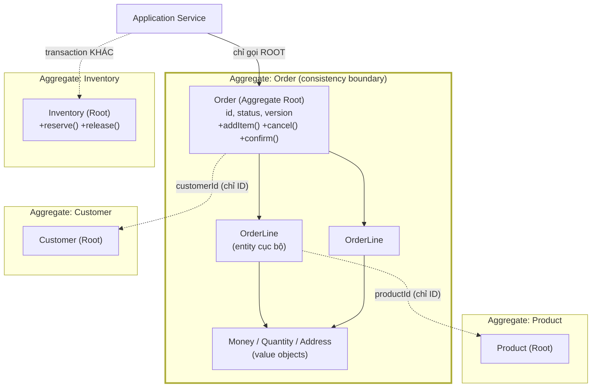
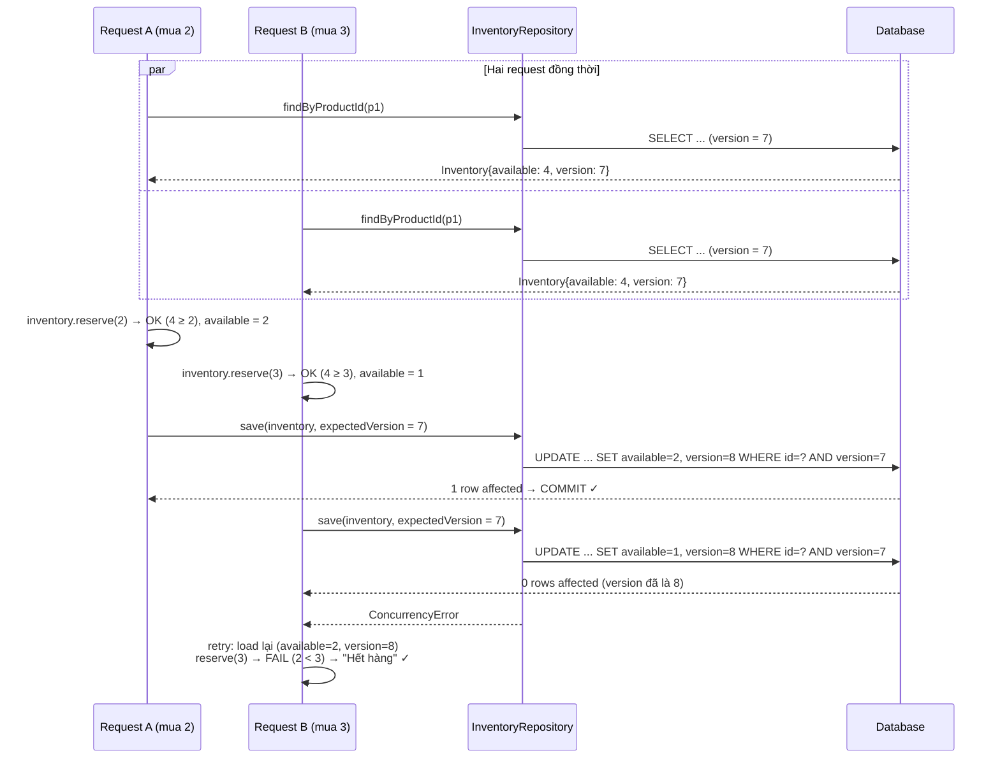
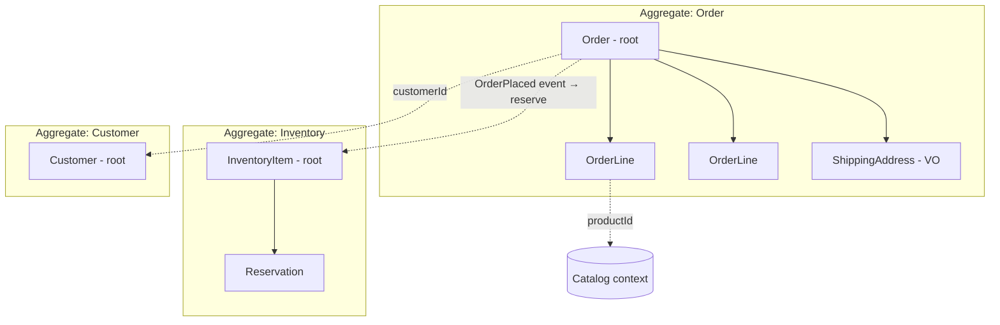

+++
title = "Chương 07 — Aggregate và Aggregate Root: Consistency Boundary trong thế giới concurrent"
date = "2026-07-09T14:00:00+07:00"
draft = false
tags = ["backend", "ddd", "architecture"]
series = ["Domain-Driven Design"]
+++

> **Vị trí chương này:** Đây là chương quan trọng nhất của toàn bộ Tactical Design — nếu chỉ được đọc kỹ một chương trong nửa sau tài liệu, hãy đọc chương này. [Chương 06](/series/domain-driven-design/06-entity-va-value-object/) cho chúng ta Entity và Value Object — công cụ bảo vệ tính đúng đắn của *từng object riêng lẻ*. Nhưng bug đắt nhất trong production hiếm khi nằm ở một object: nó nằm ở **invariant xuyên nhiều object, bị xé rách bởi các request chạy đồng thời**. Aggregate là câu trả lời của DDD cho đúng bài toán đó. Hiểu sai Aggregate thì Repository ([chương 08](/series/domain-driven-design/08-repository-va-factory/)), Domain Event ([chương 10](/series/domain-driven-design/10-domain-event/)) và toàn bộ phần distributed systems ([chương 13](/series/domain-driven-design/13-ddd-va-distributed-systems/)) sẽ sai theo.

---

## 1. Problem Statement: Bán 1.200 chiếc điện thoại khi kho chỉ có 1.000

### 1.1. Sự cố oversell kinh điển

Đêm sale 11/11. Một sàn thương mại điện tử mở bán flash sale 1.000 chiếc điện thoại. Code xử lý đặt hàng — nhìn qua hoàn toàn "hợp lý":

```typescript
async placeOrder(productId: string, quantity: number) {
  // Bước 1: đọc tồn kho
  const inventory = await this.inventoryRepo.findOne({ where: { productId } });

  // Bước 2: kiểm tra rule nghiệp vụ
  if (inventory.available < quantity) {
    throw new BadRequestException('Hết hàng');
  }

  // Bước 3: trừ kho
  inventory.available -= quantity;
  await this.inventoryRepo.save(inventory);

  // Bước 4: tạo đơn
  await this.orderRepo.save({ productId, quantity, status: 'CONFIRMED' });
}
```

Rule nghiệp vụ được viết rõ ràng: *"không bán quá số tồn kho"*. Có `if` kiểm tra hẳn hoi. Test pass. QA duyệt. Nhưng đêm sale, hệ thống bán ra **1.237 chiếc**.

Nguyên nhân không nằm ở dòng nào cả — nó nằm **giữa** các dòng. Hai request đồng thời:

```text
Thời điểm   Request A (mua 2)                Request B (mua 3)
t1          đọc inventory: available = 4
t2                                           đọc inventory: available = 4
t3          check: 4 >= 2 → OK
t4                                           check: 4 >= 3 → OK
t5          ghi available = 4 - 2 = 2
t6                                           ghi available = 4 - 3 = 1   ← ĐÈ LÊN
                                             (đúng ra phải là -1 → phải bị chặn)
```

Cả hai request đều "tuân thủ rule" trên bản dữ liệu mà chúng nhìn thấy. Nhưng khoảng thời gian giữa **đọc–kiểm tra–ghi** không được bảo vệ: đây là lỗi *check-then-act* (hay *lost update*) — rule đúng trên từng request, sai trên tổng thể. Đêm đó, 237 khách nhận email xác nhận cho món hàng không tồn tại.

### 1.2. Cùng một bệnh, nhiều bộ mặt

Bug này không phải đặc sản của thương mại điện tử. Nó là **một trong những họ bug đắt nhất của backend**, xuất hiện ở mọi domain:

- **Ví điện tử:** hai lệnh rút tiền đồng thời, cả hai đều thấy balance đủ → balance âm.
- **Booking:** hai người cùng đặt phòng cuối cùng của khách sạn → double booking, đền tiền khách.
- **Ride-hailing:** hai dispatcher cùng gán một tài xế cho hai chuyến.
- **Banking:** limit thẻ tín dụng bị vượt vì hai giao dịch cùng check limit trước khi ghi.
- **SaaS:** gói 5 seat nhưng 7 user được thêm vào, vì hai admin cùng bấm invite.

Điểm chung của tất cả: **một quy tắc nghiệp vụ ràng buộc nhiều mẩu dữ liệu (invariant), và quy tắc đó phải đúng *tại mọi thời điểm*, kể cả khi hàng trăm request cùng đọc–ghi.** "Tổng tiền đơn = tổng các dòng", "available ≥ 0", "số seat active ≤ seat đã mua", "một phòng một đêm chỉ một khách" — nghiệp vụ phát biểu chúng như chuyện hiển nhiên. Hệ thống thì không có khái niệm nào để *chứa* chúng.

Câu hỏi first-principles của chương này: **invariant sống ở đâu, và cái gì bảo vệ nó khỏi concurrency?**

- Đặt `if` trong service? — Sự cố 1.1 chứng minh là không đủ: check và act không nguyên tử.
- Khóa cả bảng / khóa cả database? — Đúng nhưng chết throughput: đêm sale mà serialize toàn bộ đơn hàng thì hệ thống thành single lane.
- Đẩy hết vào constraint DB? — Chặn được vài trường hợp đơn giản (`CHECK available >= 0`), nhưng invariant nghiệp vụ phức tạp (trạng thái đơn, limit theo hạng khách...) không nhét nổi vào constraint, và lỗi bật ra ở tầng thấp nhất, xa ngôn ngữ nghiệp vụ nhất.

DDD trả lời khác: **khoanh một vùng dữ liệu vừa đủ quanh mỗi invariant, và quy định vùng đó là đơn vị nguyên tử của mọi thay đổi.** Vùng đó gọi là **Aggregate**.

---

## 2. Tại sao DDD đưa ra khái niệm Aggregate

Trước Evans, dev đã có transaction, đã có lock. Vấn đề không phải là thiếu cơ chế — vấn đề là **không có nguyên tắc nào cho biết transaction nên ôm bao nhiêu dữ liệu**. Thực tế có hai thái cực đều tệ:

1. **Transaction ôm quá rộng.** "Cho chắc", dev load nguyên object graph: Order kéo Customer kéo tất cả Order khác của Customer kéo Product kéo Inventory... rồi save tất cả trong một transaction. Hệ quả: transaction dài, lock lan rộng, hai luồng chẳng liên quan gì về nghiệp vụ vẫn chặn nhau (sửa email khách hàng block việc xác nhận đơn), deadlock xuất hiện ngẫu nhiên dưới tải.
2. **Transaction ôm quá hẹp / tùy hứng.** Mỗi service tự quyết định save cái gì. Invariant "tổng đơn = tổng dòng" bị xé làm đôi khi một luồng save Order mà quên save OrderLine, hoặc hai luồng mỗi luồng sửa một nửa.

Cả hai thái cực có chung một gốc: **ranh giới transaction được quyết định bởi thói quen kỹ thuật (object graph của ORM, tiện tay của dev), không được quyết định bởi nghiệp vụ.** Đóng góp thật sự của khái niệm Aggregate không phải là phát minh cơ chế mới — mà là đưa ra **nguyên tắc quyết định ranh giới**:

> **Ranh giới của một đơn vị thay đổi nguyên tử = ranh giới của invariant cần bảo vệ. Không hơn, không kém.**

Invariant "available ≥ 0" ràng buộc dữ liệu tồn kho của *một* sản phẩm → vùng nguyên tử là tồn kho của một sản phẩm. Invariant "tổng đơn = tổng dòng" ràng buộc Order và các OrderLine *của nó* → vùng nguyên tử là một Order cùng các dòng của nó. Còn "email của khách hàng" chẳng nằm trong invariant nào của đơn hàng → Customer **không** thuộc vùng nguyên tử của Order, dù ERD có foreign key nối chúng.

---

## 3. Bản chất — Aggregate là gì và bảo vệ điều gì

### 3.1. Định nghĩa làm việc

**Aggregate** là một cụm Entity và Value Object được khoanh lại quanh một (vài) invariant, với các tính chất:

1. Có đúng **một Entity làm cổng vào duy nhất** — **Aggregate Root**. Mọi thay đổi từ bên ngoài phải đi qua root; không ai được với tay vào sửa entity con trực tiếp.
2. Aggregate là **consistency boundary**: mọi invariant nội bộ phải đúng *tại cuối mỗi thao tác* trên aggregate (strong consistency bên trong).
3. Aggregate là **transaction boundary**: một transaction load nguyên aggregate, sửa qua root, save nguyên aggregate — nguyên tử.
4. Aggregate là **concurrency boundary**: hai thao tác trên *cùng một* aggregate phải tuần tự hóa với nhau (qua lock hoặc version); hai thao tác trên *hai aggregate khác nhau* được tự do song song.

Ba chữ "boundary" đó là cùng một ranh giới nhìn từ ba góc — và đó chính là cái hay: **quyết định một lần (theo invariant), được cả ba**.

### 3.2. Aggregate KHÔNG phải là gì — ba ngộ nhận chết người

**Ngộ nhận 1: Aggregate = object graph.** "Order có quan hệ với Customer, Product, Payment → gom hết vào aggregate Order." Sai. Quan hệ (association) là chuyện *dữ liệu nào liên quan dữ liệu nào* — hầu như mọi thứ trong hệ thống đều liên quan nhau qua vài bước nhảy. Aggregate là chuyện *dữ liệu nào phải thay đổi cùng nhau một cách nguyên tử*. Tập thứ hai nhỏ hơn tập thứ nhất rất nhiều.

**Ngộ nhận 2: Aggregate = "nhóm bảng liên quan" / JOIN.** Nhiều dev đọc lướt DDD rồi khoanh aggregate theo cụm foreign key trên ERD. Nhưng ERD mô tả *cấu trúc lưu trữ*; aggregate mô tả *đơn vị bảo vệ invariant*. Hai bảng có FK vẫn có thể thuộc hai aggregate (orders → customers), và một aggregate có thể trải trên nhiều bảng (orders + order_lines) hoặc nằm gọn trong một document JSON.

**Ngộ nhận 3: Aggregate = eager-loading relations của ORM.** `relations: ['customer', 'items', 'items.product']` của TypeORM hay `Preload` của GORM chỉ nói "load kèm gì cho đỡ query" — quyết định *tối ưu đọc*. Aggregate là quyết định *ghi và nhất quán*. Trộn hai thứ này dẫn đến hệ quả kinh điển: dev thấy ORM load được cả graph thì save cả graph, và ranh giới transaction trở thành sản phẩm phụ ngẫu nhiên của cấu hình lazy/eager — thứ có thể bị đổi trong một PR "tối ưu performance" mà không ai nhận ra mình vừa đổi ngữ nghĩa nhất quán của hệ thống.

### 3.3. Nó bảo vệ điều gì, nói cho cùng?

Một câu: **Aggregate bảo vệ lời hứa của nghiệp vụ trước sự thật của concurrency.** Nghiệp vụ hứa "không bao giờ bán quá kho". Hạ tầng thì có hàng trăm request/giây. Aggregate là hợp đồng ba bên:

- Với **domain**: mọi rule nội bộ được kiểm tra trong hành vi của root — không đường vòng.
- Với **persistence**: load nguyên con, save nguyên con, trong một transaction.
- Với **concurrency**: mỗi aggregate một "hàng đợi" tuần tự (thực thi bằng optimistic version hoặc pessimistic lock); giữa các aggregate là song song và eventual consistency.

Và mặt còn lại của hợp đồng, quan trọng không kém: **những gì nằm ngoài ranh giới thì aggregate *từ chối* hứa hẹn nhất quán tức thời.** Đơn hàng không hứa tên khách hàng in trên đơn luôn khớp bản ghi Customer mới nhất. Sự "từ chối" này không phải điểm yếu — nó là điều kiện để hệ thống scale. Chương [13](/series/domain-driven-design/13-ddd-va-distributed-systems/) xây tiếp trên chính nền này.

---

## 4. Cách hoạt động

### 4.1. Cấu trúc: root là cổng duy nhất



Ba điều phải đọc ra từ hình:

1. **Đường liền** (bên trong aggregate) = object reference thật, load cùng nhau, save cùng nhau.
2. **Đường đứt** (giữa các aggregate) = **chỉ giữ ID** (`customerId: CustomerId`), không giữ object reference. Muốn dữ liệu của Customer? Application Service load riêng qua repository của Customer.
3. Application Service không bao giờ gọi `orderLine.setQuantity(...)` — OrderLine là nội tạng của Order, chỉ Order được đụng vào, vì chỉ Order biết invariant tổng thể.

### 4.2. Dòng chảy một thao tác ghi — với optimistic concurrency



Đây chính là kịch bản oversell ở mục 1.1 — nhưng lần này request B **không thể** ghi đè: mệnh đề `WHERE version = 7` biến "đọc–kiểm tra–ghi" thành thao tác nguyên tử về mặt logic. B retry, nhìn thấy sự thật mới, và rule nghiệp vụ chạy lại trên sự thật mới. Không lock giữ lâu, không serialize toàn hệ thống — chỉ những request *đụng cùng một aggregate* mới phải giải quyết xung đột với nhau.

### 4.3. Ba quy tắc vàng của aggregate

Đúc kết từ Evans và Vaughn Vernon ("Effective Aggregate Design"), ba quy tắc sau là xương sống thực hành:

**Quy tắc 1 — Reference giữa các aggregate bằng ID, không bằng object.**

```typescript
// SAI: kéo object của aggregate khác vào trong
class Order {
  customer: Customer;        // giờ save(order) có save customer không? Ai biết.
  items: { product: Product; qty: number }[];
}

// ĐÚNG: chỉ giữ identity
class Order {
  customerId: CustomerId;    // rõ ràng: Order không chịu trách nhiệm về Customer
  lines: OrderLine[];        // OrderLine giữ productId, không giữ Product
}
```

Tại sao? Vì object reference là lời mời mutate: cầm được `order.customer` thì sớm muộn có người viết `order.customer.email = ...` và save cả cụm — ranh giới transaction vỡ âm thầm. Giữ ID còn có tác dụng phụ quý giá: aggregate nhỏ, load nhanh, serialize được, và sẵn sàng cho ngày dữ liệu Customer chuyển sang service khác (ID vẫn đúng, object reference thì tan vỡ).

**Quy tắc 2 — Một transaction chỉ sửa một aggregate.**

Nếu một use case "cần" sửa hai aggregate trong một transaction, có hai khả năng: (a) ranh giới aggregate sai — hai thứ đó thực ra chung invariant, nên gộp; hoặc (b) — thường xuyên hơn — sự nhất quán giữa chúng **không cần tức thời**, nên tách: sửa aggregate thứ nhất + phát domain event trong transaction, aggregate thứ hai được cập nhật khi xử lý event (eventual consistency). Quy tắc này nghe cực đoan nhưng có lý do sâu: transaction đa aggregate tái tạo đúng bệnh "lock lan rộng" mà aggregate sinh ra để chữa, và nó **không thể** giữ được khi các aggregate rời sang service/database khác nhau. Thiết kế theo quy tắc này từ đầu là mua sẵn vé cho tương lai phân tán. (Ngoại lệ thực dụng: xem mục Production Considerations.)

**Quy tắc 3 — Giữa các aggregate: chấp nhận eventual consistency.**

Câu hỏi kiểm định do Vernon đề xuất: *"Nếu dữ liệu này lệch nhau trong N giây, nghiệp vụ có mất tiền/vi phạm pháp lý không?"* Hỏi domain expert, không hỏi dev. "Available có được âm 5 giây không?" — Không, mất tiền thật → trong ranh giới, strong consistency. "Tên khách trên đơn có được cũ 5 giây so với profile không?" — Được, chẳng ai chết → ngoài ranh giới, eventual. Đa số câu trả lời của nghiệp vụ là "được", nhiều hơn dev tưởng rất nhiều — dev có thiên kiến strong consistency vì nó dễ nghĩ, không phải vì nghiệp vụ cần.

### 4.4. Xác định ranh giới aggregate từ invariant thật — không phải từ sơ đồ ERD

Đây là kỹ năng quan trọng nhất của chương này, và là chỗ đa số team làm sai. Quy trình đúng đi từ **câu hỏi nghiệp vụ**, không đi từ quan hệ khóa ngoại:

1. Liệt kê các **business rule phải đúng tại mọi thời điểm** (invariant). Không phải rule chung chung — phải là rule mà nếu vi phạm trong 1 giây thì có hậu quả thật.
2. Với mỗi invariant, khoanh vùng **tập dữ liệu tối thiểu** cần đọc-và-ghi nguyên tử để bảo vệ nó.
3. Tập dữ liệu đó là một ứng viên aggregate. Mọi thứ ngoài tập đó — tham chiếu bằng ID.

Áp dụng cho Order:

| Rule | Có phải invariant tức thời? | Kết luận về ranh giới |
|---|---|---|
| "Tổng tiền Order = tổng các OrderLine + phí − giảm giá" | Có — sai một giây là sai hóa đơn, sai số tiền trừ của khách | Order và OrderLine **cùng** aggregate |
| "Order không quá 50 line" | Có — rule kiểm ngay lúc thêm line | Trong aggregate Order |
| "Không bán quá tồn kho" | Có — nhưng dữ liệu là của **Inventory**, không phải Order | Invariant của aggregate **Inventory**, Order chỉ *yêu cầu* reserve |
| "Email trên đơn khớp email mới nhất của Customer" | Không — lệch vài giây vô hại | Customer là aggregate khác, Order giữ `customerId` + snapshot |
| "Khách VIP được freeship" | Không — tính tại thời điểm đặt, sau đó là dữ liệu lịch sử | Đọc từ Customer lúc đặt, ghi kết quả vào Order |

Nhìn bảng trên sẽ thấy: **cùng một use case "đặt hàng" chạm vào 3 aggregate** (Order, Inventory, Customer) nhưng chỉ *ghi* vào từng cái ở những transaction khác nhau. Đó là điều ERD không bao giờ nói cho bạn: ERD chỉ có quan hệ, không có nhịp độ nhất quán.



Đường liền = chứa trong ranh giới, ghi nguyên tử cùng nhau. Đường đứt = tham chiếu ID hoặc event, eventual consistency.

### 4.5. Ví dụ thiết kế SAI và quá trình tách — God Aggregate giải phẫu từng bước

Thiết kế "tự nhiên" mà một team quen ORM sẽ làm — map thẳng object graph từ ERD:

```typescript
// SAI — God Aggregate: Order ôm cả thế giới
class Order {
  customer: Customer;            // aggregate khác, bị nuốt vào
  items: OrderItem[];
  payments: Payment[];           // vòng đời riêng, bị nuốt vào
  shipments: Shipment[];         // vòng đời riêng, bị nuốt vào
  inventoryItems: InventoryItem[]; // dữ liệu tranh chấp cao, bị nuốt vào

  placeOrder() {
    for (const item of this.items) {
      const inv = this.inventoryItems.find(i => i.productId === item.productId);
      inv.available -= item.qty;           // sửa aggregate khác trong cùng transaction
    }
    this.customer.loyaltyPoints += this.total * 0.01;  // sửa aggregate khác nữa
    this.payments.push(Payment.pending(this.total));
  }
}
```

Hậu quả đo được trong production:

- **Lock contention**: mọi đơn chứa iPhone 15 đều phải ghi vào cùng row inventory của iPhone 15 → với optimistic lock là bão retry, với pessimistic lock là hàng đợi serialize. Flash sale sập vì chính thiết kế, không phải vì thiếu server.
- **Transaction dài**: load Customer + N Product + M InventoryItem để "đảm bảo nhất quán" → transaction giữ connection lâu, pool cạn.
- **Memory**: load một Order kéo theo cả object graph — hydrate hàng trăm object cho một thao tác đổi địa chỉ giao hàng.
- **Không thể tách service**: Order, Inventory, Customer dính trong một transaction nghĩa là mãi mãi chung một database.

Tách từng bước — mỗi bước một quyết định có lý do:

**Bước 1 — Đuổi Customer ra.** Invariant nào giữa Order và Customer cần tức thời? Không có. Cộng điểm loyalty trễ 2 giây không ai kiện. → Order giữ `customerId`, cộng điểm chuyển thành handler của event `OrderPlaced`.

**Bước 2 — Đuổi Inventory ra.** Đây là quyết định khó nhất vì "không oversell" LÀ invariant tức thời — nhưng nó là invariant **của Inventory**, được bảo vệ bằng optimistic lock trên aggregate InventoryItem (mục 4.2). Order không cần ôm inventory để chống oversell; nó cần **quy trình**: reserve trước (transaction trên Inventory) → đặt hàng (transaction trên Order) → nếu bước sau fail thì release (compensation). Đây chính là mầm của Saga (chương 13).

**Bước 3 — Đuổi Payment và Shipment ra.** Chúng có vòng đời riêng (Payment có thể retry, refund; Shipment có thể tách kiện) và state machine riêng. Order chỉ cần biết *kết quả* qua event: `PaymentConfirmed` → `order.markPaid()`.

Kết quả: aggregate Order chỉ còn Order + OrderLine + các Value Object — đúng bằng tập dữ liệu của invariant "tổng tiền" và "giới hạn line". Nhỏ, load nhanh, ít tranh chấp, sẵn sàng phân tán.

### 4.6. Aggregate quá nhỏ — sai theo chiều ngược lại

Sau khi nghe "aggregate phải nhỏ", có team tách OrderLine thành aggregate riêng. Giờ "thêm line và cập nhật tổng tiền" chạm hai aggregate → hoặc chấp nhận tổng tiền sai tạm thời (khách thấy hóa đơn sai — không chấp nhận được), hoặc quay lại transaction đa aggregate (vi phạm quy tắc 2). Bài học: **nhỏ nhất có thể, nhưng không nhỏ hơn invariant**. Ranh giới đúng không phải là "nhỏ" hay "to" — là *khớp với invariant*.

### 4.7. Code hoàn chỉnh — TypeScript (NestJS)

```typescript
// domain/order/order.aggregate.ts — KHÔNG import gì từ NestJS/TypeORM
import { DomainEvent, OrderPlaced, OrderCancelled } from './events';
import { Money } from '../shared/money.vo';
import { OrderLine } from './order-line.entity';

export class OrderDomainError extends Error {}

export class Order {
  private constructor(
    readonly id: string,
    readonly customerId: string,
    private lines: OrderLine[],
    private status: 'DRAFT' | 'PLACED' | 'PAID' | 'CANCELLED',
    public version: number,           // optimistic concurrency
    private events: DomainEvent[] = [],
  ) {}

  static draft(id: string, customerId: string): Order {
    return new Order(id, customerId, [], 'DRAFT', 0);
  }

  // Hành vi nghiệp vụ — KHÔNG phải setter
  addLine(productId: string, unitPrice: Money, qty: number): void {
    this.assertDraft();
    if (qty <= 0) throw new OrderDomainError('Số lượng phải dương');
    if (this.lines.length >= 50) throw new OrderDomainError('Đơn tối đa 50 dòng');
    const existing = this.lines.find(l => l.productId === productId);
    existing ? existing.increase(qty) : this.lines.push(OrderLine.of(productId, unitPrice, qty));
    // invariant "tổng tiền = tổng line" tự đúng vì total() là derived — không lưu cache để lệch
  }

  place(): void {
    this.assertDraft();
    if (this.lines.length === 0) throw new OrderDomainError('Đơn rỗng không thể đặt');
    this.status = 'PLACED';
    this.events.push(new OrderPlaced(this.id, this.customerId,
      this.lines.map(l => ({ productId: l.productId, qty: l.qty })), this.total()));
  }

  cancel(reason: string): void {
    if (this.status === 'PAID') throw new OrderDomainError('Đơn đã thanh toán, dùng luồng refund');
    if (this.status === 'CANCELLED') return; // idempotent
    this.status = 'CANCELLED';
    this.events.push(new OrderCancelled(this.id, reason));
  }

  total(): Money {
    return this.lines.reduce((sum, l) => sum.add(l.subtotal()), Money.zero('VND'));
  }

  pullEvents(): DomainEvent[] {           // repository lấy ra sau khi save
    const out = this.events; this.events = []; return out;
  }

  private assertDraft(): void {
    if (this.status !== 'DRAFT') throw new OrderDomainError(`Không sửa được đơn ở trạng thái ${this.status}`);
  }
}
```

Ba điểm cần soi kỹ, vì chúng là khác biệt với entity ORM:

1. **Không có setter.** Mọi thay đổi đi qua method mang tên nghiệp vụ, và method *kiểm tra invariant trước khi đổi state*. TypeORM entity với `@Column() status: string` cho phép bất kỳ ai `order.status = 'PAID'` — invariant chỉ tồn tại trong trí nhớ của dev viết review.
2. **Event sinh ra cùng chỗ với thay đổi state.** `place()` vừa đổi status vừa ghi `OrderPlaced` — không thể có chuyện đổi status mà quên phát event, vì chúng là một cử động.
3. **`total()` là hàm suy diễn,** không phải cột cache — loại nguyên một họ bug "tổng tiền lệch".

### 4.8. Code hoàn chỉnh — Go

```go
// internal/order/domain/order.go — package domain KHÔNG import gorm/sql
package domain

import "errors"

var (
    ErrNotDraft  = errors.New("đơn không ở trạng thái draft")
    ErrEmpty     = errors.New("đơn rỗng không thể đặt")
    ErrTooMany   = errors.New("đơn tối đa 50 dòng")
)

type OrderStatus string

const (
    StatusDraft     OrderStatus = "DRAFT"
    StatusPlaced    OrderStatus = "PLACED"
    StatusCancelled OrderStatus = "CANCELLED"
)

type Order struct {
    id         string
    customerID string
    lines      []OrderLine
    status     OrderStatus
    Version    int            // optimistic concurrency, repo dùng khi UPDATE
    events     []DomainEvent  // unexported: chỉ hành vi domain được ghi vào
}

func DraftOrder(id, customerID string) *Order {
    return &Order{id: id, customerID: customerID, status: StatusDraft}
}

func (o *Order) AddLine(productID string, unitPrice Money, qty int) error {
    if o.status != StatusDraft { return ErrNotDraft }
    if qty <= 0 { return errors.New("số lượng phải dương") }
    if len(o.lines) >= 50 { return ErrTooMany }
    for i := range o.lines {
        if o.lines[i].ProductID == productID {
            o.lines[i].Qty += qty
            return nil
        }
    }
    o.lines = append(o.lines, OrderLine{ProductID: productID, UnitPrice: unitPrice, Qty: qty})
    return nil
}

func (o *Order) Place() error {
    if o.status != StatusDraft { return ErrNotDraft }
    if len(o.lines) == 0 { return ErrEmpty }
    o.status = StatusPlaced
    o.events = append(o.events, OrderPlaced{OrderID: o.id, CustomerID: o.customerID, Total: o.Total()})
    return nil
}

func (o *Order) Total() Money {
    sum := Zero("VND")
    for _, l := range o.lines { sum = sum.Add(l.Subtotal()) }
    return sum
}

func (o *Order) PullEvents() []DomainEvent {
    out := o.events; o.events = nil; return out
}
```

Điểm Go-specific đáng chú ý: field unexported (`lines`, `status`) + method exported là cơ chế encapsulation tự nhiên của Go — package ngoài **không thể** sửa state trực tiếp, compiler ép ranh giới giúp bạn. So với struct GORM mọi field exported kèm tag `gorm:"column:..."` — cả codebase sửa được mọi thứ, invariant không có chỗ đứng.

### 4.9. Đối chiếu framework: Aggregate ≠ nhóm bảng, ≠ relations của ORM

| Câu hỏi | ORM (TypeORM/GORM) trả lời | DDD trả lời |
|---|---|---|
| "Cái gì đi cùng cái gì?" | Theo khóa ngoại + cấu hình `relations`/`Preload` | Theo invariant cần bảo vệ nguyên tử |
| "Load sâu đến đâu?" | Tùy query — mỗi chỗ một kiểu, `JOIN` tự do | Luôn nguyên aggregate, không hơn không kém |
| "Save cái gì?" | `cascade: true` — save lan theo graph, ai biết tới đâu | Nguyên aggregate, một transaction, tăng version |
| "Ai giữ rule?" | Không ai — hoặc service layer nhớ thì giữ | Root — mọi mutation đi qua nó |

`cascade: true` của TypeORM và `gorm:"foreignKey"` + `Save` lan truyền là hai tính năng khiến dev **tưởng** mình có aggregate: "save order thì line tự save, tiện quá". Nhưng cascade là cơ chế *persistence*, không phải cơ chế *consistency* — nó không chặn ai load OrderLine riêng và update thẳng, không kiểm invariant, không tăng version nguyên tử. Aggregate là cam kết ở tầng thiết kế; cascade chỉ là tiện ích ở tầng lưu trữ. Dùng cascade để *cài đặt* việc lưu aggregate thì được; coi cascade *là* aggregate thì hỏng.

## 5. Điểm mạnh

- **Đưa race condition từ "bug ngẫu nhiên" về "thiết kế có chủ đích"**: ranh giới aggregate + version là câu trả lời có hệ thống cho câu hỏi "cái gì phải nguyên tử" — thay vì mỗi dev tự quyết bằng transaction tùy hứng.
- **Invariant có địa chỉ**: muốn biết rule của Order, đọc class Order. Không phải grep 14 service.
- **Đơn vị scale tự nhiên**: aggregate độc lập theo ID → shard theo aggregate ID, cache theo aggregate, đo lock contention theo aggregate. Hạ tầng phân tán "khớp" với model.
- **Đơn vị test tự nhiên**: test invariant là test thuần trên object, không cần DB. `order.place()` trên đơn rỗng phải throw — một dòng assert, chạy một mili giây.

## 6. Điểm yếu

- **Learning curve thật sự dốc**: xác định ranh giới từ invariant đòi hỏi hiểu nghiệp vụ sâu — kỹ năng đắt và hiếm hơn kỹ năng viết code. Team thiếu domain expert access sẽ vẽ ranh giới bằng phỏng đoán, và ranh giới sai thì đau hơn không có ranh giới.
- **Ranh giới sai phải trả giá bằng refactor + data migration**: đổi ranh giới aggregate là đổi transaction boundary lẫn schema — không phải rename.
- **Nhiều code hơn CRUD** cho cùng một tính năng đơn giản: với màn hình admin sửa vài field, aggregate + version + event là nghi lễ thừa.
- **Eventual consistency đẩy chi phí sang chỗ khác**: bỏ transaction đa aggregate nghĩa là phải xây compensation, retry, monitoring cho luồng event — chi phí không mất đi, nó đổi dạng (xem chương 13).

## 7. Trade-off

- **Consistency vs throughput**: aggregate to → nhiều thứ nhất quán tức thời, nhưng lock contention cao, throughput ghi thấp. Aggregate nhỏ → throughput cao, nhưng nhiều cặp dữ liệu chỉ eventual consistent. Không có cấu hình đúng tuyệt đối — chỉ có cấu hình khớp với mức chịu đựng của nghiệp vụ.
- **Optimistic vs pessimistic**: optimistic (version) thắng khi xung đột hiếm — không giữ lock, chỉ trả giá khi va chạm. Pessimistic (`SELECT ... FOR UPDATE`) thắng khi xung đột dày đặc trên ít row nóng (flash sale một SKU) — retry storm của optimistic còn đắt hơn chờ lock. Đo tỉ lệ conflict rồi hãy chọn, đừng chọn theo tôn giáo.
- **Model thuần vs tiện ích ORM**: tách domain model khỏi ORM model (mapping hai chiều) mua được sự thuần khiết, trả bằng boilerplate. Dùng chung một class thì ngược lại. Nguyên tắc thực dụng: Core Domain tách, Supporting để chung (chi tiết ở chương 06 và 12).

## 8. Production Considerations

- **Retry có giới hạn + backoff** cho ConcurrencyError; quá N lần thì trả lỗi cho user hoặc đẩy vào queue. Retry vô hạn trên SKU nóng = tự DDoS.
- **Hot aggregate**: một aggregate bị ghi dồn dập (tồn kho SKU flash-sale, số dư ví merchant lớn) là điểm nghẽn thiết kế. Kỹ thuật giảm: tách reservation thành aggregate con theo đợt, sharding theo bucket (10 bucket tồn kho cộng dồn), hoặc chuyển sang mô hình append (ledger — chương 15a phần fintech).
- **Version cột số nguyên là đủ** — đừng vội event sourcing chỉ để có concurrency control.
- **Load aggregate**: nguyên tắc "load cả aggregate" áp cho **đường ghi**; đường đọc (danh sách, báo cáo) đi read model/query riêng, không hydrate aggregate (chương 13, CQRS).
- **Ngoại lệ thực dụng cho quy tắc "một transaction một aggregate"**: khi hai aggregate cùng database và luồng nghiệp vụ thật sự cần, một transaction sửa hai aggregate là lỗi nhẹ hơn xây saga sớm. Nhưng ghi rõ trong ADR — đó là nợ có chủ đích, phải trả trước khi tách service.
- **Testing**: invariant test thuần (không DB) cho mọi rule; concurrency test (hai goroutine/hai request thật đua nhau) cho các aggregate nóng — bug concurrency không hiện ra trong unit test tuần tự.

## 9. Best Practices

- Bắt đầu từ **danh sách invariant viết bằng tiếng nghiệp vụ**, có chữ ký của domain expert, rồi mới vẽ ranh giới.
- Aggregate **nhỏ nhất đủ chứa invariant**. Mặc định một Entity root + vài Value Object; thêm entity con chỉ khi invariant bắt buộc.
- Reference bằng ID. Luôn luôn. Kể cả khi "tiện" là kéo object vào.
- Root là cổng duy nhất — không expose collection con mutable ra ngoài (`getLines()` trả bản readonly).
- Mutation nào cũng qua method mang tên nghiệp vụ trong Ubiquitous Language: `cancel()`, `markPaid()` — không `setStatus()`.
- Event sinh trong aggregate, publish sau persist (mẫu pullEvents + outbox — chương 10 và 13).
- Đặt version từ ngày đầu — thêm optimistic lock vào hệ thống đang chạy là migration đau đớn.

## 10. Anti-patterns

- **God Aggregate** (mục 4.5) — ôm mọi thứ "cho chắc", chết vì lock và memory.
- **Aggregate vụn** (mục 4.6) — tách nhỏ đến mức invariant homeless, phải vá bằng transaction đa aggregate, tệ hơn cả không tách.
- **Anemic aggregate** — có class Order nhưng toàn getter/setter, rule vẫn ở service: hình thức aggregate, nội dung transaction script. Nhận biết: đếm method mang tên nghiệp vụ; bằng 0 là anemic.
- **Sửa aggregate khác trong event handler cùng transaction** — event chỉ là cách gọi hàm gián tiếp, coupling còn khó thấy hơn gọi thẳng (chương 10).
- **Load aggregate để đọc danh sách** — hydrate 500 Order object cho một màn hình list; dùng query/read model.
- **Bỏ qua version vì "hệ thống ít người dùng"** — race condition không cần nhiều user, chỉ cần hai request; và lúc có nhiều user thì không ai còn nhớ chỗ nào thiếu lock.

## 11. Khi nào KHÔNG cần nghĩ về Aggregate

Khi dữ liệu **không có invariant đa bản ghi** và **không có ghi cạnh tranh**: bảng cấu hình, danh mục tĩnh, CMS content, form nhập liệu một người sửa. Ở đó "aggregate" của bạn là một row, update là update, CRUD + validation field là đủ và nhanh gấp ba lần để viết. Dùng đủ nghi lễ aggregate/version/event cho một bảng `settings` là dấu hiệu cargo-cult (chương 16). Câu kiểm tra nhanh: *"Có rule nào ràng buộc nhiều bản ghi phải đúng cùng lúc, và có hai người ghi đè nhau được không?"* — hai câu "không" thì đóng chương này lại, dùng CRUD.

## Đọc tiếp

Aggregate được load và save như thế nào mà không để ORM xâm thực domain — đó là việc của Repository: [Chương 08 — Repository và Factory](/series/domain-driven-design/08-repository-va-factory/).

- Quay lại: [06 — Entity và Value Object](/series/domain-driven-design/06-entity-va-value-object/) · [Mục lục](/series/domain-driven-design/00-muc-luc/)
- Liên quan trực tiếp: [10 — Domain Event](/series/domain-driven-design/10-domain-event/) (event sinh từ aggregate) · [13 — DDD và Distributed Systems](/series/domain-driven-design/13-ddd-va-distributed-systems/) (saga, eventual consistency giữa các aggregate)
