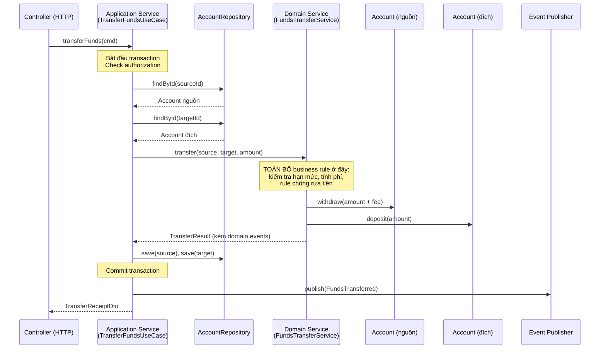

+++
title = "Chương 9: Domain Service và Application Service — Tách \"nồi lẩu\" Service ra đúng tầng"
date = "2026-07-09T16:00:00+07:00"
draft = false
tags = ["backend", "ddd", "architecture"]
series = ["Domain-Driven Design"]
+++

> **Vị trí chương này**: Bạn đã đi qua Entity, Value Object (chương 6), Aggregate (chương 7), Repository và Factory (chương 8). Đến đây, mô hình domain của bạn đã có "xương sống". Nhưng thực tế sẽ nhanh chóng ném vào mặt bạn một câu hỏi: *có những nghiệp vụ không thuộc về bất kỳ Entity nào cả — nhét nó vào đâu?* Chương này trả lời câu hỏi đó, và quan trọng hơn: mổ xẻ cái `OrderService` 500 dòng mà gần như mọi codebase NestJS/Go đều có, rồi tách nó ra từng lớp một. Đây là chương "bẩn tay" nhất từ đầu tài liệu đến giờ.

---

## 1. Problem Statement: Nghiệp vụ không có "nhà"

Hãy bắt đầu bằng bài toán kinh điển nhất của mọi tài liệu DDD, nhưng lần này ta đi đến tận cùng của nó: **chuyển tiền giữa hai tài khoản**.

Bạn đã học chương 7: logic nghiệp vụ nên nằm trong Aggregate. Vậy thử đặt logic chuyển tiền vào `Account`:

```typescript
// Phương án 1: đặt vào account nguồn?
class Account {
  transferTo(target: Account, amount: Money): void {
    this.withdraw(amount);
    target.deposit(amount); // Account này đang SỬA một Aggregate khác!
  }
}
```

Có ba vấn đề nghiêm trọng:

1. **Vi phạm ranh giới Aggregate**. Chương 7 đã nói rất rõ: một transaction chỉ nên sửa một Aggregate. `account.transferTo(target)` sửa hai Aggregate trong một lời gọi — ranh giới nhất quán bị phá.
2. **Ngôn ngữ sai**. Trong nghiệp vụ ngân hàng, "chuyển tiền" không phải là hành vi *của một tài khoản*. Nó là một **nghiệp vụ liên quan đến hai tài khoản, chính sách phí, hạn mức, và quy định chống rửa tiền**. Domain expert không nói "tài khoản A chuyển tiền" — họ nói "**thực hiện một giao dịch chuyển tiền** từ A sang B". Chủ ngữ của câu không phải là Account.
3. **Kiến thức lạc chỗ**. Quy tắc "phí chuyển liên ngân hàng là 0.05%, tối thiểu 10.000đ, miễn phí nếu khách hàng hạng Platinum" — quy tắc này biết về *cả hai* tài khoản, biết về *chính sách phí*, biết về *hạng khách hàng*. Nhét nó vào `Account` nghĩa là bắt `Account` biết quá nhiều thứ không phải của nó.

Ví dụ thứ hai, đời thường hơn: **tính giá đơn hàng**. Giá cuối cùng phụ thuộc vào: bảng giá theo khu vực, khuyến mãi đang chạy, hạng thành viên, số lượng mua, chính sách giá sàn của ngành hàng. Logic này cần dữ liệu từ `Order`, `Customer`, `Promotion`, `PricingPolicy` — bốn Aggregate khác nhau. Đặt vào Aggregate nào cũng khiên cưỡng.

Và đây là lúc 90% team làm điều tự nhiên nhất: **nhét vào Service**.

```typescript
@Injectable()
export class OrderService {
  // ... 500 dòng sau đó
}
```

Vấn đề không phải là "dùng service". Vấn đề là chữ "service" trong NestJS/Spring/Go idiom **không phân biệt gì cả** — nó là cái thùng chứa mọi thứ: business rule, transaction, gọi repository, gửi email, check quyền, map DTO. Sáu tháng sau, bạn có một class mà:

- Không ai dám sửa vì không biết dòng nào là business rule, dòng nào là plumbing.
- Không test được business rule mà không mock 8 dependency.
- Business rule bị **lặp** ở service khác vì không ai biết nó đã tồn tại.

DDD trả lời vấn đề này bằng cách **tách chữ "service" thành hai khái niệm khác nhau về bản chất**: Domain Service và Application Service.

**Nếu không giải quyết vấn đề này thì sao?** Codebase của bạn vẫn chạy. Nhưng chi phí thay đổi tăng theo hàm mũ: mỗi rule mới phải đọc lại toàn bộ service để chắc chắn không phá rule cũ; mỗi bug fix ở một chỗ có nguy cơ bỏ sót bản copy của rule ở chỗ khác. Đây chính xác là con đường dẫn về Big Ball of Mud mà chương 1 đã cảnh báo.

---

## 2. Tại sao DDD đưa ra hai khái niệm này

Eric Evans đưa ra **Domain Service** trong Blue Book với một quan sát rất first-principles:

> Một số khái niệm trong domain vốn dĩ là **hành động/hoạt động (activity)**, không phải **vật (thing)**. Ép chúng thành trách nhiệm của một Entity hay Value Object sẽ bóp méo mô hình.

Nói cách khác: mô hình domain phải phản ánh cách domain expert *nói*. Khi expert nói "hệ thống định tuyến chọn tuyến đường rẻ nhất", chủ ngữ là "hệ thống định tuyến" (Routing Service) — không phải Cargo, không phải Route. Cố nhét logic đó vào Cargo là **bẻ cong ngôn ngữ để chiều framework**, đi ngược lại Ubiquitous Language (chương 3).

Còn **Application Service** đến từ kiến trúc phân tầng (Layered Architecture / Hexagonal — sẽ đào sâu ở chương 12): cần một nơi đứng giữa thế giới bên ngoài (HTTP, message queue, cron) và domain model, để:

- Dịch input thô (DTO, request) thành lời gọi domain.
- Quản lý những thứ domain **không được biết**: transaction, authorization, retry, logging, publish event ra ngoài.

Hai khái niệm, hai lý do tồn tại khác nhau:

| | Domain Service | Application Service |
|---|---|---|
| Tồn tại vì | Nghiệp vụ không có "nhà" tự nhiên trong Entity/VO | Cần lớp điều phối giữa thế giới ngoài và domain |
| Trả lời câu hỏi | "Nghiệp vụ này tính toán/quyết định **thế nào**?" | "Use case này **gồm những bước gì**?" |
| Thuộc tầng | Domain layer | Application layer |
| Có business rule? | **Có — đó là toàn bộ lý do nó tồn tại** | **Không — tuyệt đối không** |

**Tại sao phải tách?** Vì hai loại code này thay đổi vì hai lý do khác nhau (Single Responsibility hiểu theo nghĩa gốc: *one reason to change*). Business rule đổi khi nghiệp vụ đổi. Orchestration đổi khi hạ tầng/quy trình kỹ thuật đổi (thêm cache, đổi cách publish event, thêm audit log). Trộn chúng nghĩa là mỗi thay đổi hạ tầng đều rủi ro chạm vào business rule và ngược lại.

**Đánh đổi gì?** Nhiều file hơn, nhiều lớp hơn, đường đi của một request dài hơn khi debug. Với CRUD đơn giản, đây là chi phí không đáng trả — xem mục 11.

---

## 3. Bản chất của từng loại

### 3.1. Domain Service — nghiệp vụ thuần, stateless, nói ngôn ngữ domain

Một Domain Service đúng nghĩa có 4 đặc tính, và **thiếu một trong bốn thì nó không phải Domain Service**:

1. **Chứa business rule thật sự** — nó tính toán, quyết định, kiểm tra một chính sách nghiệp vụ. Nếu bỏ nó đi, domain expert sẽ hỏi "thế quy tắc X nằm ở đâu?".
2. **Stateless** — không giữ trạng thái giữa các lần gọi. Mọi dữ liệu cần thiết được truyền vào qua tham số (thường là các Aggregate/VO đã được load sẵn). Stateless không có nghĩa là không có dependency — nó có thể phụ thuộc vào một *domain interface* (ví dụ `ExchangeRateProvider`), nhưng bản thân nó không nhớ gì.
3. **Tên là động từ/hoạt động trong Ubiquitous Language** — `TransferFundsService`, `PricingService`, `RoutingService`, `OverbookingPolicy`. Nếu bạn không tìm được cái tên nghiệp vụ cho nó mà chỉ nghĩ ra được `OrderHelper`, `OrderManager`, `OrderUtils` — đó là dấu hiệu bạn chưa hiểu nó làm gì, hoặc nó không phải Domain Service.
4. **Không biết gì về hạ tầng** — không import ORM, không biết HTTP, không mở transaction, không publish message ra Kafka. Nó chỉ biết Entity, Value Object, và các interface thuần domain.

Một cách kiểm tra nhanh: **Domain Service phải chạy được trong unit test không cần mock framework nào**. Nếu test nó cần `TestingModule` của NestJS hay `sqlmock` của Go, nó đã lai tạp.

### 3.2. Application Service — kịch bản của use case

Application Service (một số tài liệu gọi là Use Case, Interactor — trong Clean Architecture) là **kịch bản điều phối**. Mỗi public method của nó tương ứng một use case: `placeOrder`, `cancelOrder`, `transferFunds`. Trách nhiệm của nó:

- **Transaction boundary**: mở/đóng transaction, quyết định cái gì atomic.
- **Load và persist Aggregate** qua Repository.
- **Authorization**: user này có được thực hiện use case này không (lưu ý: đây là *access control kỹ thuật*; còn quy tắc kiểu "chỉ manager mới được duyệt đơn trên 100 triệu" là *business rule* — thuộc domain).
- **Điều phối**: gọi Aggregate method, gọi Domain Service, theo đúng thứ tự của use case.
- **Publish event** sau khi persist thành công (chi tiết ở chương 10).
- **Dịch kết quả** về DTO/response.

Và một điều nó **tuyệt đối không làm: chứa business rule**. Phép thử đơn giản: nếu trong Application Service xuất hiện `if` mà điều kiện là một khái niệm nghiệp vụ (`if (order.total > 500_000)`, `if (customer.tier === 'GOLD')`) — business rule đang rò rỉ. `if` hợp lệ trong Application Service chỉ là điều phối kỹ thuật: `if (!order) throw new NotFoundException()`, `if (!(await this.auth.can(user, 'order:cancel'))) throw new ForbiddenException()`.

Một Application Service tốt đọc như **mục lục của use case**, không phải nội dung:

```typescript
async placeOrder(cmd: PlaceOrderCommand): Promise<OrderId> {
  // 1. Load những gì cần
  // 2. Gọi domain (Aggregate + Domain Service) để ra quyết định nghiệp vụ
  // 3. Persist
  // 4. Publish event
  // 5. Trả kết quả
}
```

Bất kỳ ai đọc method này phải hiểu use case gồm những bước gì trong 30 giây, mà **không cần hiểu bất kỳ quy tắc nghiệp vụ nào**.

### 3.3. Bảng phân định trách nhiệm — dán lên tường team

| Câu hỏi | Nơi trả lời |
|---|---|
| Đơn hàng này có hợp lệ không? | Aggregate (`Order`) |
| Phí chuyển khoản là bao nhiêu? | Domain Service (`TransferFeePolicy`) |
| Hai tài khoản này chuyển tiền cho nhau thế nào? | Domain Service (`FundsTransferService`) |
| Use case "đặt hàng" gồm những bước gì? | Application Service (`PlaceOrderUseCase`) |
| Lưu order vào Postgres thế nào? | Repository implementation (infrastructure) |
| User có quyền gọi API này không? | Application Service (+ Guard/Middleware) |
| Sau khi đặt hàng thì gửi email thế nào? | Event handler (chương 10) |
| Request JSON map sang command thế nào? | Controller / Presentation layer |

---

## 4. Cách hoạt động: dòng chảy của một use case

Dòng chảy chuẩn của một use case có cả hai loại service:



Mấy điểm cần soi kỹ trên diagram:

- **Application Service không biết phí tính thế nào** — nó chỉ biết "bước 3 là gọi FundsTransferService".
- **Domain Service không biết transaction tồn tại** — nó nhận hai Aggregate đã load sẵn, thao tác trên object in-memory.
- **Domain Service không tự save** — persist là việc của Application Service. Đây là điểm nhiều người làm sai: inject Repository vào Domain Service rồi gọi `save()` bên trong, khiến Domain Service dính vào vòng đời persistence. (Inject Repository vào Domain Service để *đọc* thì tranh cãi được — xem Best Practices; để *ghi* thì gần như luôn sai.)
- Chuyển tiền sửa 2 Aggregate trong 1 transaction — đây là **ngoại lệ có chủ đích** của rule chương 7, chấp nhận được khi cả hai Aggregate cùng nằm trong một database và nghiệp vụ đòi hỏi atomic thật sự (ngân hàng nội bộ). Ở hệ phân tán, bạn sẽ cần saga/process manager — chương 13.

---

## 5. Mổ xẻ "nồi lẩu": OrderService 500 dòng điển hình

Đây là phần quan trọng nhất chương. Dưới đây là một `OrderService` NestJS được rút gọn nhưng **giữ nguyên cấu trúc tội lỗi** của phiên bản 500 dòng ngoài đời — kiểu class bạn mở ra ở bất kỳ công ty nào cũng thấy:

```typescript
// ======== TRƯỚC: order.service.ts — cái nồi lẩu ========
@Injectable()
export class OrderService {
  constructor(
    @InjectRepository(OrderEntity) private orderRepo: Repository<OrderEntity>,
    @InjectRepository(CustomerEntity) private customerRepo: Repository<CustomerEntity>,
    @InjectRepository(ProductEntity) private productRepo: Repository<ProductEntity>,
    @InjectRepository(PromotionEntity) private promoRepo: Repository<PromotionEntity>,
    private readonly dataSource: DataSource,
    private readonly mailerService: MailerService,
    private readonly smsService: SmsService,
    private readonly inventoryClient: InventoryHttpClient,
    private readonly logger: Logger,
  ) {}

  async createOrder(dto: CreateOrderDto, userId: string): Promise<OrderResponseDto> {
    // [P] Authorization lẫn vào giữa
    const customer = await this.customerRepo.findOne({ where: { userId } });
    if (!customer) throw new UnauthorizedException();
    if (customer.status === 'BLOCKED') {
      throw new ForbiddenException('Customer is blocked'); // [B?] rule hay access control?
    }

    // [P] Load dữ liệu
    const products = await this.productRepo.findBy({ id: In(dto.items.map(i => i.productId)) });

    // [B] Business rule 1: kiểm tra tồn kho — trộn với gọi HTTP [I]
    for (const item of dto.items) {
      const stock = await this.inventoryClient.getStock(item.productId);
      if (stock < item.quantity) {
        throw new BadRequestException(`Product ${item.productId} out of stock`);
      }
    }

    // [B] Business rule 2: tính giá — 80 dòng if/else trong bản thật
    let subtotal = 0;
    for (const item of dto.items) {
      const product = products.find(p => p.id === item.productId)!;
      let price = product.basePrice;
      if (customer.tier === 'GOLD') price = price * 0.95;        // rule hạng thành viên
      if (item.quantity >= 10) price = price * 0.97;             // rule số lượng
      subtotal += price * item.quantity;
    }

    // [B] Business rule 3: khuyến mãi
    const promo = dto.promoCode
      ? await this.promoRepo.findOne({ where: { code: dto.promoCode } })
      : null;
    let discount = 0;
    if (promo) {
      if (promo.expiresAt < new Date()) throw new BadRequestException('Promo expired');
      if (subtotal < promo.minOrderValue) throw new BadRequestException('Order too small');
      if (promo.usedCount >= promo.maxUsage) throw new BadRequestException('Promo exhausted');
      discount = Math.min(subtotal * promo.percent / 100, promo.maxDiscount);
    }

    // [B] Business rule 4: phí ship
    let shippingFee = 30_000;
    if (subtotal - discount >= 500_000) shippingFee = 0;         // freeship
    if (customer.tier === 'PLATINUM') shippingFee = 0;

    // [P] Transaction + persist — trộn với business rule 5
    return this.dataSource.transaction(async (em) => {
      const order = em.create(OrderEntity, {
        customerId: customer.id,
        items: dto.items,
        subtotal,
        discount,
        shippingFee,
        total: subtotal - discount + shippingFee,
        status: subtotal - discount + shippingFee > 20_000_000
          ? 'PENDING_APPROVAL'                                   // [B] rule 5: đơn to phải duyệt
          : 'CONFIRMED',
      });
      await em.save(order);
      if (promo) {
        promo.usedCount += 1;                                    // [B] rule 6, giấu trong transaction
        await em.save(promo);
      }

      // [I] Side effects trong transaction — chương 10 sẽ chửi đoạn này
      await this.mailerService.sendOrderConfirmation(customer.email, order);
      if (customer.tier === 'PLATINUM') {
        await this.smsService.send(customer.phone, `Đơn ${order.id} đã xác nhận`);
      }
      this.logger.log(`Order ${order.id} created`);

      return this.toDto(order); // [P] mapping
    });
  }
}
```

Ký hiệu: `[B]` = business rule (domain), `[P]` = plumbing/orchestration (application), `[I]` = infrastructure. Hãy đếm: **6 business rule, 4 loại plumbing, 3 loại infrastructure** — trong MỘT method. Bản 500 dòng ngoài đời còn có thêm `updateOrder`, `cancelOrder`, `getOrders` với các rule *lặp lại một phần* của `createOrder` (ví dụ tính lại giá khi update — và lệch nhau sau vài lần sửa).

### Dấu hiệu nhận biết logic đặt sai chỗ

Trước khi tách, hãy học cách **ngửi**. Các dấu hiệu sau gần như luôn đúng:

1. **`if` nghiệp vụ trong Application Service / Controller** — `customer.tier === 'GOLD'` nằm cạnh `dataSource.transaction` → rule đang ở tầng application.
2. **Entity chỉ có getter/setter, mọi tính toán ở service** — anemic model (chương 6). `order.status = 'CONFIRMED'` gán từ bên ngoài thay vì `order.confirm()`.
3. **Cùng một rule xuất hiện ≥ 2 chỗ** — freeship trên 500k được check ở `createOrder`, ở `updateOrder`, và ở... frontend. Khi rule đổi thành 600k, ai nhớ đủ 3 chỗ?
4. **Test business rule phải mock repository/mailer** — muốn test "GOLD được giảm 5%" mà phải dựng `TestingModule` với 9 provider → rule đang chôn dưới plumbing.
5. **Domain Service có `await this.repo.save(...)`** — chiều ngược lại: plumbing rò xuống domain.
6. **Tên method không có trong ngôn ngữ nghiệp vụ** — `processOrderData()`, `handleOrderLogic()` — nếu domain expert nghe tên method mà không hiểu, tầng đã lẫn.
7. **Sửa cấu hình hạ tầng (đổi mailer, thêm cache) buộc phải đụng file chứa business rule** — hai lý do thay đổi đang sống chung một file.

### Tách từng bước

**Bước 1 — Đẩy rule về Aggregate trước, Domain Service sau.** Nguyên tắc: Domain Service là *phương án cuối*, không phải phương án đầu. Rule nào chỉ cần dữ liệu của Order → vào `Order`. Rule "đơn > 20 triệu phải duyệt" chỉ cần total của order → `Order.place()` tự quyết định status. Rule "promo hết hạn/hết lượt" chỉ cần dữ liệu Promotion → `Promotion.redeem()`.

**Bước 2 — Rule cần nhiều Aggregate → Domain Service.** Tính giá cần Product + Customer tier + quantity → `PricingService`. Phí ship cần subtotal + tier → `ShippingFeePolicy`. Đây là những "hoạt động" thật sự trong ngôn ngữ nghiệp vụ.

**Bước 3 — Application Service chỉ còn kịch bản.** Load, gọi domain, persist, publish, map.

**Bước 4 — Side effect ra khỏi transaction, thành event handler.** Email/SMS không được nằm trong transaction — nếu mailer chậm 5 giây, bạn giữ lock DB 5 giây; nếu mailer lỗi, đơn hàng hợp lệ bị rollback. Chi tiết chương 10.

Kết quả sau khi tách:

```typescript
// ======== SAU (1): Domain layer — order.ts ========
// Rule chỉ cần dữ liệu của Order → nằm TRONG Order
export class Order {
  private constructor(
    public readonly id: OrderId,
    public readonly customerId: CustomerId,
    private readonly lines: OrderLine[],
    private pricing: OrderPricing,   // VO: subtotal, discount, shippingFee, total
    private status: OrderStatus,
  ) {}

  static place(customerId: CustomerId, lines: OrderLine[], pricing: OrderPricing): Order {
    if (lines.length === 0) throw new EmptyOrderError();
    const status = pricing.total.greaterThan(Money.vnd(20_000_000))
      ? OrderStatus.PendingApproval          // rule 5: sống ở đây
      : OrderStatus.Confirmed;
    const order = new Order(OrderId.generate(), customerId, lines, pricing, status);
    order.record(new OrderPlaced(order.id, customerId, pricing.total)); // chương 10
    return order;
  }
}

// ======== SAU (2): Domain Service — pricing.service.ts ========
// Rule cần Product + Customer + Promotion → Domain Service, THUẦN, stateless
export class PricingService {
  price(lines: PricingLine[], customer: Customer, promo: Promotion | null): OrderPricing {
    const subtotal = lines
      .map(l => this.unitPrice(l, customer).multiply(l.quantity))
      .reduce((a, b) => a.add(b), Money.zero('VND'));

    const discount = promo ? promo.discountFor(subtotal) : Money.zero('VND');
    // Promotion.discountFor() tự kiểm tra hết hạn/hết lượt/min order — rule của NÓ

    const shippingFee = ShippingFeePolicy.feeFor(subtotal.subtract(discount), customer.tier);
    return OrderPricing.of(subtotal, discount, shippingFee);
  }

  private unitPrice(line: PricingLine, customer: Customer): Money {
    let price = line.basePrice;
    if (customer.tier.isGold()) price = price.multiply(0.95);
    if (line.quantity >= 10) price = price.multiply(0.97);
    return price;
  }
}

// ======== SAU (3): Application Service — place-order.usecase.ts ========
@Injectable()
export class PlaceOrderUseCase {
  constructor(
    private readonly orders: OrderRepository,        // interface, chương 8
    private readonly customers: CustomerRepository,
    private readonly catalog: CatalogReader,
    private readonly promotions: PromotionRepository,
    private readonly pricing: PricingService,        // domain service
    private readonly stockChecker: StockAvailabilityChecker, // domain interface, infra implement
    private readonly uow: UnitOfWork,
    private readonly events: EventPublisher,
  ) {}

  async execute(cmd: PlaceOrderCommand): Promise<OrderId> {
    const customer = await this.customers.findByUserId(cmd.userId);
    if (!customer) throw new UnauthorizedException();

    const lines = await this.catalog.pricingLinesFor(cmd.items);
    await this.stockChecker.ensureAvailable(cmd.items);  // rule "phải còn hàng" — domain
                                                          // interface; gọi HTTP — infra implement
    const promo = cmd.promoCode
      ? await this.promotions.findByCode(cmd.promoCode)
      : null;

    // Toàn bộ quyết định nghiệp vụ dồn vào 2 dòng — không một if nghiệp vụ nào ở đây
    const pricingResult = this.pricing.price(lines, customer, promo);
    const order = Order.place(customer.id, toOrderLines(cmd.items), pricingResult);
    if (promo) promo.redeem();

    await this.uow.commit(async () => {
      await this.orders.save(order);
      if (promo) await this.promotions.save(promo);
    });

    await this.events.publishAll(order.pullDomainEvents()); // email/SMS thành handler — chương 10
    return order.id;
  }
}
```

So sánh trước/sau:

- `PlaceOrderUseCase.execute` đọc như mục lục: load → check stock → tính giá → tạo order → persist → publish. **Không một con số nghiệp vụ nào** (500k, 5%, 20 triệu) xuất hiện ở tầng application.
- Muốn biết freeship tính thế nào? Mở `ShippingFeePolicy` — một file, một trách nhiệm, một chỗ để sửa.
- Muốn test rule GOLD giảm 5%? `new PricingService().price(...)` — không mock gì cả.
- Email/SMS biến mất khỏi transaction — chúng thành event handler của `OrderPlaced`.

**Cảnh báo trung thực**: số file tăng từ 1 lên ~7. Với team 2 người làm MVP, đây có thể là over-engineering. Giá trị của việc tách tỉ lệ thuận với: tuổi thọ dự kiến của code, số người cùng sửa, tần suất rule thay đổi. Cả ba thấp → đừng tách vội.

### Cùng ca mổ đó, phiên bản Go

Go không có `@Injectable()`, nhưng "nồi lẩu" thì giống hệt — một struct ôm `*sql.DB`, `*http.Client`, SMTP client và 500 dòng trộn lẫn:

```go
// ======== TRƯỚC: service/order.go — nồi lẩu phiên bản Go ========
type OrderService struct {
	db        *sql.DB
	inventory *http.Client
	mailer    *smtp.Client
	cfg       *Config
}

func (s *OrderService) CreateOrder(ctx context.Context, userID string, req CreateOrderRequest) (*Order, error) {
	// query customer, check BLOCKED...
	// loop items: gọi HTTP check stock GIỮA lúc tính giá...
	// if customer.Tier == "GOLD" { price *= 0.95 }  // rule chôn giữa sql.Rows.Scan
	// tx, _ := s.db.BeginTx(ctx, nil)
	// ... 15 câu Exec, rule "đơn > 20tr phải duyệt" viết inline trong câu INSERT
	// s.mailer.SendMail(...) TRONG transaction
	// tx.Commit()
	return nil, nil // bản thật: 500 dòng, 9 return err khác nhau
}
```

Sau khi tách — điểm mấu chốt ở Go là **ranh giới được compiler cưỡng chế bằng package**: package `domain` không import `database/sql`, `net/http`, hay package `app`. Một dòng import sai là thấy ngay trong review, thậm chí lint (`depguard`) chặn được từ CI:

```go
// ======== SAU (1): domain/pricing.go — DOMAIN SERVICE ========
// package domain: KHÔNG import database/sql, net/http, smtp
package domain

type PricingService struct{}

func (PricingService) Price(lines []PricingLine, customer Customer, promo *Promotion) (OrderPricing, error) {
	subtotal := ZeroVND()
	for _, l := range lines {
		price := l.BasePrice
		if customer.Tier.IsGold() {
			price = price.MultiplyPercent(95)
		}
		if l.Quantity >= 10 {
			price = price.MultiplyPercent(97)
		}
		subtotal = subtotal.Add(price.MultiplyQty(l.Quantity))
	}

	discount := ZeroVND()
	if promo != nil {
		d, err := promo.DiscountFor(subtotal) // Promotion tự giữ rule hết hạn/hết lượt
		if err != nil {
			return OrderPricing{}, err // domain error: ErrPromoExpired, ErrPromoExhausted...
		}
		discount = d
	}

	shipping := ShippingFeeFor(subtotal.Subtract(discount), customer.Tier)
	return NewOrderPricing(subtotal, discount, shipping), nil
}

// domain/stock.go — domain INTERFACE, hạ tầng implement (dependency inversion)
type StockAvailabilityChecker interface {
	EnsureAvailable(ctx context.Context, items []OrderItem) error
}
```

```go
// ======== SAU (2): app/place_order.go — APPLICATION SERVICE ========
package app

type PlaceOrderUseCase struct {
	orders     domain.OrderRepository
	customers  domain.CustomerRepository
	catalog    domain.CatalogReader
	promotions domain.PromotionRepository
	pricing    domain.PricingService
	stock      domain.StockAvailabilityChecker
	tx         TxManager
	events     EventPublisher
}

func (uc *PlaceOrderUseCase) Execute(ctx context.Context, cmd PlaceOrderCommand) (domain.OrderID, error) {
	customer, err := uc.customers.FindByUserID(ctx, cmd.UserID)
	if err != nil {
		return domain.OrderID{}, err
	}
	lines, err := uc.catalog.PricingLinesFor(ctx, cmd.Items)
	if err != nil {
		return domain.OrderID{}, err
	}
	if err := uc.stock.EnsureAvailable(ctx, cmd.Items); err != nil {
		return domain.OrderID{}, err
	}
	var promo *domain.Promotion
	if cmd.PromoCode != "" {
		if promo, err = uc.promotions.FindByCode(ctx, cmd.PromoCode); err != nil {
			return domain.OrderID{}, err
		}
	}

	// Toàn bộ quyết định nghiệp vụ: 2 lời gọi, 0 chữ if nghiệp vụ
	pricing, err := uc.pricing.Price(lines, *customer, promo)
	if err != nil {
		return domain.OrderID{}, err
	}
	order, err := domain.PlaceOrder(customer.ID, toOrderLines(cmd.Items), pricing)
	if err != nil {
		return domain.OrderID{}, err
	}
	if promo != nil {
		if err := promo.Redeem(); err != nil {
			return domain.OrderID{}, err
		}
	}

	if err := uc.tx.Within(ctx, func(ctx context.Context) error {
		if err := uc.orders.Save(ctx, order); err != nil {
			return err
		}
		if promo != nil {
			return uc.promotions.Save(ctx, promo)
		}
		return nil
	}); err != nil {
		return domain.OrderID{}, err
	}

	uc.events.PublishAll(ctx, order.PullDomainEvents())
	return order.ID, nil
}
```

Nhận xét riêng cho Go: đống `if err != nil` làm Application Service *trông* dài hơn bản TypeScript, nhưng đừng nhầm — đó là plumbing của ngôn ngữ, không phải business rule. Phép thử vẫn nguyên giá trị: trong `Execute` không có một phép so sánh nào trên số tiền, hạng khách, hay trạng thái đơn.

### Hai lát cắt thực tế để đối chiếu

**Ví dụ production — pricing ở một sàn TMĐT cỡ vừa.** Giá hiển thị = giá gốc theo khu vực → trừ khuyến mãi tốt nhất đang active → cộng phụ phí giao nhanh → làm tròn theo quy tắc kế toán. Cùng một công thức được dùng ở **năm nơi**: trang sản phẩm, giỏ hàng, checkout, admin preview, batch re-price ban đêm. Trước khi có `PricingService` domain thuần, công thức tồn tại ở ba bản copy và đã từng gây sự cố thật: giỏ hàng hiển thị một giá, checkout tính giá khác — khách khiếu nại, CS tra tay từng đơn. Sau khi gom về một Domain Service nhận `(lines, buyerProfile, activePromotions, deliveryOptions)` và trả `PriceQuote` (VO có breakdown từng dòng): khi marketing đổi rule "chỉ áp 1 khuyến mãi tốt nhất" thành "cộng dồn tối đa 2", diff là **một class + một bộ unit test**, cả năm nơi đổi theo trong một lần deploy. Việc *lấy* promotion active từ đâu (Redis cache ở trang sản phẩm, DB ở checkout) vẫn khác nhau giữa các use case — vì đó là việc của từng Application Service, đúng như phân vai.

**Ví dụ scale lớn — chuyển tiền liên ngân hàng.** Ở scale ngân hàng, chuyển khoản qua Napas không thể là một transaction: trừ tiền bên gửi là Aggregate trong hệ mình, ghi có bên nhận nằm ở ngân hàng khác. Kiến trúc khi đó đổi hẳn ở tầng application: Application Service không còn mở một transaction bao hai account, mà tạo Aggregate `TransferInstruction` (PENDING) rồi điều phối saga với compensation (chương 13). Nhưng nhìn vào diff của đợt chuyển đổi đó: `TransferFeePolicy`, rule hạn mức, rule chống rửa tiền — **không đổi một dòng**, vì luật kinh doanh không đổi khi topology hạ tầng đổi. Nếu hai tầng này trộn nhau từ đầu, đợt chuyển đổi đồng nghĩa viết lại nghiệp vụ phí và hạn mức — và viết lại nghiệp vụ tài chính là đúng chỗ bug đắt nhất chui vào. Đây là lý do thực dụng nhất, đo đếm được, của toàn bộ chương này: **phần phải viết lại khi hệ thống lớn lên là Application Service; phần được phép sống sót nguyên vẹn là Domain Service.**

---

## 6. Testing: hai loại service, hai chiến lược khác hẳn nhau

Sự tách bạch chỉ trả cổ tức thật sự khi bạn test đúng cách cho từng loại. Nếu bạn test cả hai giống nhau, bạn đã trả chi phí tách mà không nhận về gì.

### 6.1. Domain Service: unit test thuần, phủ dày, chạy tính bằng mili giây

Mỗi test case là một dòng trong "bảng chính sách" của phòng nghiệp vụ. Không TestingModule, không mock, không DB:

```typescript
// pricing.service.spec.ts
describe('PricingService', () => {
  const pricing = new PricingService();

  it.each([
    { tier: 'STANDARD', qty: 1,  base: 100_000, want: 100_000 },
    { tier: 'GOLD',     qty: 1,  base: 100_000, want: 95_000  },
    { tier: 'GOLD',     qty: 10, base: 100_000, want: 92_150  }, // chồng ưu đãi: 0.95 * 0.97
    { tier: 'STANDARD', qty: 9,  base: 100_000, want: 100_000 }, // biên: dưới ngưỡng sỉ
  ])('tier=$tier qty=$qty', ({ tier, qty, base, want }) => {
    const result = pricing.price(
      [lineWith({ basePrice: Money.vnd(base), quantity: qty })],
      customerWith({ tier }),
      null,
    );
    expect(result.unitPriceOf(0).equals(Money.vnd(want))).toBe(true);
  });

  it('freeship xét trên số tiền SAU giảm giá, không phải trước', () => {
    // 520k, promo giảm 50k -> còn 470k -> KHÔNG freeship.
    // Test này là biên bản chốt một cuộc tranh cãi nghiệp vụ có thật —
    // unit test domain là tài liệu nghiệp vụ có thể chạy được.
    const result = pricing.price(
      [lineWith({ basePrice: Money.vnd(520_000), quantity: 1 })],
      customerWith({ tier: 'STANDARD' }),
      promoFlat(Money.vnd(50_000)),
    );
    expect(result.shippingFee.equals(Money.vnd(30_000))).toBe(true);
  });
});
```

```go
// domain/pricing_test.go — table-driven, style Go chuẩn, không sqlmock
func TestPricingService(t *testing.T) {
	pricing := domain.PricingService{}
	cases := []struct {
		name string
		tier domain.Tier
		qty  int
		want int64
	}{
		{"standard no discount", domain.TierStandard, 1, 100_000},
		{"gold 5 percent off", domain.TierGold, 1, 95_000},
		{"gold stacks with bulk", domain.TierGold, 10, 92_150},
		{"one below bulk threshold", domain.TierStandard, 9, 100_000},
	}
	for _, tc := range cases {
		t.Run(tc.name, func(t *testing.T) {
			got, err := pricing.Price(linesQty(tc.qty, 100_000), customerTier(tc.tier), nil)
			require.NoError(t, err)
			require.Equal(t, tc.want, got.UnitPrice(0).Amount())
		})
	}
}
```

Bộ test này chạy vài nghìn case trong dưới một giây, chạy được offline, chạy được trong pre-commit hook. Với domain có tiền bạc, đây là điều kiện để dám deploy chiều thứ Sáu.

### 6.2. Application Service: test kịch bản, KHÔNG test lại nghiệp vụ

Sai lầm phổ biến nhất: viết lại toàn bộ test giá/phí/promo ở tầng use case với mock. Kết quả là bộ test chậm, giòn (đổi chữ ký repository là gãy 40 test), và trùng lặp. Ở tầng này chỉ assert **kịch bản**:

- Đúng thứ được lưu (order + promo trong cùng transaction).
- Event được publish **sau** khi commit, không publish khi rollback.
- Stock check fail → không có gì được lưu.
- Authorization fail → dừng trước khi chạm domain.

Dùng **fake in-memory** thay vì mock từng call — fake mô phỏng hành vi (một `InMemoryOrderRepository` với map bên trong), mock thì đóng đinh kỳ vọng vào từng lời gọi và gãy mỗi lần refactor:

```typescript
it('không publish event nếu save thất bại', async () => {
  const orders = new InMemoryOrderRepository();
  orders.failNextSave(new Error('db down'));
  const events = new RecordingEventPublisher();
  const uc = new PlaceOrderUseCase(orders, customers, catalog, promos,
                                   new PricingService(), passingStock, uow, events);

  await expect(uc.execute(validCommand())).rejects.toThrow('db down');
  expect(events.published).toHaveLength(0); // kịch bản, không phải nghiệp vụ
});
```

Tỷ lệ lành mạnh trong thực tế: test domain nhiều gấp 3–5 lần test application. Nếu tỷ lệ của bạn đang ngược lại, đó là chỉ báo định lượng rằng nghiệp vụ nằm sai tầng — quay lại mục 5 và soi checklist "ngửi".

Tầng thứ ba — integration test cho repository implementation thật (testcontainers + Postgres) — đã bàn ở chương 8; ở đây chỉ nhắc: đừng bắt use case test gánh việc đó.

---

## 7. Điểm mạnh

1. **Business rule test được với chi phí gần bằng không.** Như trên — và hệ quả ít ai nói: khi test rẻ, người ta *viết* test cho case biên. Khi test đắt, người ta viết một happy path rồi thôi. Chất lượng test không phải vấn đề đạo đức, nó là vấn đề kinh tế.
2. **Thay đổi được định vị trước khi mở code.** "Đổi biểu phí ship" → mở `ShippingFeePolicy`. "Thêm audit log khi đặt hàng" → mở `PlaceOrderUseCase`. Thời gian *tìm chỗ sửa* — thứ chiếm phần lớn thời gian maintain — giảm hẳn.
3. **Nghiệp vụ sống sót qua thay đổi kiến trúc.** Monolith lên microservice, REST sang gRPC, Postgres thêm shard: viết lại Application Service, còn `PricingService` và `Order` không đổi một dòng. Nghiệp vụ là phần đắt nhất để viết lại đúng — sự tách bạch này là bảo hiểm rẻ nhất cho phần đắt nhất.
4. **Code trở thành nơi đối chiếu nghiệp vụ.** Khi audit hỏi "phí chuyển khoản tính thế nào", bạn chỉ vào một class có tên nghiệp vụ, thay vì grep `0.05` khắp repo.
5. **Song song hóa công việc trong team.** Người giỏi nghiệp vụ làm domain, người giỏi hạ tầng làm application/infrastructure, gặp nhau tại interface — ít giẫm chân hơn hẳn so với 5 người cùng sửa một god service.

## 8. Điểm yếu

1. **Nhiều file, nhiều indirection.** Flow đặt hàng trước đây đọc một mạch trong một file; giờ nhảy qua use case → domain service → aggregate → repository interface → implementation. IDE hỗ trợ tốt, nhưng chi phí nhận thức là thật, đặc biệt với người mới vào codebase lần đầu.
2. **Ranh giới đòi hỏi phán đoán.** "Customer bị BLOCKED không được đặt hàng" — là access control (application) hay business rule (domain)? Câu trả lời phụ thuộc *ai sở hữu rule*: nếu phòng vận hành khóa khách gian lận theo chính sách kinh doanh → domain; nếu là cơ chế an ninh kỹ thuật → application. Team thiếu người phân xử sẽ hoặc tranh cãi kéo dài, hoặc đặt bừa.
3. **Nguy cơ nghi lễ hóa.** Team "học được pattern mới" có xu hướng tạo Domain Service cho mọi thứ, kể cả những logic một hàm thuần là đủ, sinh ra hàng chục class một method.
4. **Chi phí mapping.** Domain Service nhận domain object → phải load và map từ persistence model. Nếu chỉ cần `tier` mà load cả aggregate `Customer` 12 quan hệ, bạn trả giá bằng query. (Thuốc: input hẹp — nhận `CustomerProfile` VO thay vì cả aggregate.)

## 9. Trade-off — trả gì, nhận gì, và khi nào lỗ

**Trả:** số file nhân ba, một tầng interface, thời gian tranh luận ranh giới, learning curve.

**Nhận:** nghiệp vụ tập trung một chỗ + test rẻ + miễn nhiễm thay đổi hạ tầng + code đối thoại được với domain expert.

Bài toán hòa vốn, nói thẳng:

- **Domain phức tạp, sống lâu, nhiều người sửa, rule đổi thường xuyên** (pricing, billing, ledger, risk, loyalty): hòa vốn trong vài tháng. Một bug biểu phí ra production thường đắt hơn toàn bộ chi phí tách.
- **CRUD + vài validation** (danh mục, cấu hình, admin nội bộ): không bao giờ hòa vốn. Service gọi thẳng ORM là thiết kế *đúng* cho lớp bài toán đó.
- **Không áp dụng khi lẽ ra phải áp dụng thì sao?** God service lớn dần theo feature, test suite chậm dần vì mọi test cần DB, rule nhân bản và lệch nhau, và "đổi biểu phí" trở thành task ba ngày kèm hai regression bug — đúng quỹ đạo Big Ball of Mud chương 1.
- **Áp dụng sai thì sao?** Hai kịch bản: (a) *tách vỏ không tách ruột* — có thư mục `domain/` nhưng rule vẫn ở use case: trả đủ chi phí, nhận về con số không; (b) *Domain Service hút sạch logic khỏi Entity* — anemic model đội mũ DDD, nguy hiểm hơn cả không tách vì nó trông có vẻ đúng. Chi tiết ở mục Anti-patterns.

## 10. Production Considerations

**Performance.** Domain Service stateless → singleton an toàn, không lock, scale ngang miễn phí. Điểm nghẽn thật nằm ở Application Service: nó quyết định load gì. Nguyên tắc: tối ưu query ở application/infrastructure (projection, batch load), **không bao giờ** tối ưu bằng cách cho Domain Service tự query — đó là cánh cửa để hạ tầng nhiễm ngược vào domain. Nếu Domain Service cần dữ liệu ngoài (tỷ giá, bảng giá), inject qua *domain interface* (`ExchangeRateProvider`) và để Application Service quyết định lấy trước hay lazy.

**Versioning chính sách.** Biểu phí đổi từ 01/08 nhưng đơn đặt trước đó tính theo biểu cũ. Đừng rải `if (date > ...)` khắp policy. Hai kỹ thuật, thứ tự ưu tiên rõ ràng: (1) **snapshot kết quả** — lưu nguyên `OrderPricing` breakdown vào đơn tại thời điểm đặt; mọi nghiệp vụ sau đó (refund, đối soát) đọc snapshot, không tính lại. Tính-lại-quá-khứ là nguồn bug đối soát kinh điển. (2) Chỉ khi nghiệp vụ *thật sự* cần re-price, dùng provider theo hiệu lực: `pricingPolicyFor(effectiveDate)` trả về đúng version của policy.

**Cưỡng chế ranh giới bằng công cụ, không bằng lời hứa.** Go: package layout + `depguard`/`go vet` custom. TypeScript: `dependency-cruiser` hoặc ESLint `import/no-restricted-paths` cấm `src/domain/**` import từ `src/application/**` và `src/infrastructure/**`, chạy trong CI. Ranh giới không được máy kiểm tra sẽ mòn dần sau mỗi lần "cho tiện, deadline gấp".

**Observability.** Log, trace, metric là việc của Application Service (và middleware) — span `PlaceOrder` với các attribute kỹ thuật. Domain không import logger; nếu cần dấu vết nghiệp vụ ("vì sao đơn này bị chuyển PENDING_APPROVAL?"), câu trả lời đúng là Domain Event (chương 10) hoặc kết quả trả về có breakdown — không phải `logger.info` rải trong policy.

## 11. Best Practices

1. **Entity/Aggregate trước, Domain Service sau.** Mỗi lần định viết Domain Service, hỏi: "logic này có thật sự cần dữ liệu của nhiều hơn một Aggregate không?" Không → nó thuộc về Aggregate. Domain Service là phương án cuối, không phải phương án mặc định.
2. **Một use case = một Application Service** (hoặc một method), đặt tên theo hành động của người dùng: `PlaceOrderUseCase`, `CancelOrderUseCase`. Cái tên `OrderService` là lời mời gọi mở rộng vô hạn — tránh ngay từ đầu.
3. **Domain Service nhận object, không nhận ID.** Nhận ID nghĩa là nó phải tự load → phải có repository → nhiễm hạ tầng, khó test. Load là việc của Application Service.
4. **Domain error riêng, map ở rìa.** Domain throw `PromoExpiredError`; presentation layer map sang 422. `BadRequestException` xuất hiện trong `domain/` là dấu hiệu nhiễm.
5. **Giữ Application Service dưới ~30 dòng logic/use case** (Go: không tính `if err != nil`). Vượt ngưỡng → hoặc nghiệp vụ đang rò vào, hoặc use case cần tách.
6. **Review tên Domain Service với domain expert** như review public API. `PricingService` phải là từ họ dùng trong họp. `OrderCalculationManager` thì không.
7. **Authorization ở application, business precondition ở domain.** Câu hỏi phân xử: "nếu rule này đổi, ai ký quyết định?" Phòng nghiệp vụ → domain. Engineering/security → application.
8. **Application Service không gọi Application Service khác.** Logic chung giữa hai use case hoặc là domain (kéo vào policy/aggregate) hoặc là hạ tầng (kéo xuống gateway) — không gọi ngang, vì gọi ngang tạo lưới phụ thuộc và transaction lồng nhau khó lường.

## 12. Anti-patterns — và vì sao nguy hiểm

### 12.1. Domain Service hút hết logic khỏi Entity → anemic model quay lại bằng cửa sau

Anti-pattern nguy hiểm nhất chương, vì nó **trông giống DDD**:

```typescript
// SAI: OrderDomainService làm hết, Order chỉ còn là túi getter/setter
export class OrderDomainService {
  addLine(order: Order, line: OrderLine): void {
    if (order.getStatus() !== 'PENDING') throw new Error('cannot modify');
    order.getLines().push(line);                      // thò tay vào ruột Order
    order.setTotal(order.getTotal().add(line.total)); // invariant do NGƯỜI NGOÀI giữ hộ
  }
  confirm(order: Order): void { /* ... */ }
  cancel(order: Order): void { /* ... */ }
}
```

Đây chính là anemic domain model (chương 6) khoác áo mới — procedural code mang tên "DomainService" nên không ai dám nghi ngờ trong review. Hậu quả kép: (1) mất encapsulation — bất kỳ ai cũng gọi được `setTotal` mà quên cộng line, vì invariant sống *bên ngoài* object sở hữu state; (2) Domain Service phình thành god class thứ hai, đúng thứ bạn vừa chạy trốn. **Phép thử:** xóa Domain Service đi — nếu Entity không còn cách nào tự bảo vệ invariant của nó, logic đó thuộc về Entity, trả về. Domain Service hợp lệ chỉ *phối hợp nhiều* domain object hoặc chứa phép toán không có nhà; nó **không bao giờ sở hữu invariant của một Aggregate**.

### 12.2. Application Service "béo" — business rule trá hình dưới lốt orchestration

```typescript
// SAI: trông như plumbing, thực chất là 3 business rule
async cancelOrder(orderId: string): Promise<void> {
  const order = await this.orders.findById(orderId);
  if (order.status === 'SHIPPED') throw new BadRequestException();      // rule 1
  if (daysSince(order.placedAt) > 7) throw new BadRequestException();   // rule 2
  const refund = order.paidByCard
    ? order.total.multiply(0.98)                                        // rule 3: phí hoàn thẻ 2%
    : order.total;
  // ...
}
```

Nguy hiểm vì ba rule này **vô hình với domain model**: ai đọc class `Order` sẽ tin cancel là vô điều kiện. Ngày batch job hủy đơn tự động gọi thẳng `order.cancel()`, cả ba rule bị bypass — và đó là bug loại "chạy êm 6 tháng rồi nổ vào mùa sale". Sửa: `order.cancel(clock)` tự giữ rule 1–2; phí hoàn thẻ vào `RefundPolicy`.

### 12.3. Domain Service nhiễm hạ tầng

`PricingService` nhận `EntityManager` "để tiện query khuyến mãi đang chạy". Từ hôm đó: test cần DB, không tái sử dụng được trong worker, mọi lần nâng version ORM chạm vào file nghiệp vụ. Con đường nhiễm luôn bắt đầu bằng một lần "cho tiện" — vì thế mới cần lint rule chặn import, không trông vào kỷ luật.

### 12.4. Service gọi Service gọi Service

`OrderService` → `CustomerService` → `LoyaltyService` → quay lại `OrderService`. Vòng phụ thuộc giữa các `@Injectable()` là triệu chứng của việc *không tồn tại ranh giới nào cả*: không aggregate rõ, không use case rõ, chỉ có lưới mì. NestJS còn "giúp" bạn sống chung với nó bằng `forwardRef()` — coi mỗi lần gõ `forwardRef` là một chuông báo cháy thiết kế.

### 12.5. `Helper`, `Util`, `Manager` mang nghiệp vụ

`OrderHelper.calculateDiscount()` — business rule trốn trong static util: không domain expert nào tìm thấy, không ai test tử tế, và ba tháng sau có `OrderHelper2`. Nếu nó là nghiệp vụ, nó xứng đáng một cái tên nghiệp vụ và một mái nhà trong `domain/`.

## 13. Khi nào KHÔNG nên dùng sự tách bạch này

- **CRUD thuần / form-over-data**: admin panel, quản lý danh mục, màn hình cấu hình. `CategoryService` gọi thẳng Prisma là thiết kế đúng — đừng để ai chê nó "chưa đủ DDD".
- **Prototype, tính năng đang dò product-market fit**: khi chưa biết rule sống được mấy tuần, transaction script vứt đi rẻ hơn. Tách khi rule chứng minh nó ở lại và phức tạp lên — refactor từ nồi lẩu sang tách tầng (mục 5) là con đường bình thường, không phải thất bại.
- **Supporting/generic subdomain (chương 2)**: dồn nỗ lực mô hình hóa cho core domain; chỗ khác, "đơn giản và chạy được" là tiêu chuẩn đúng.
- **Team chưa vững Entity/Aggregate (chương 6–7)**: tách service khi domain model còn anemic chỉ tạo ra ba tầng anemic thay vì một. Thứ tự học các chương của tài liệu này không ngẫu nhiên.
- **Batch/script một lần, glue code**: không có domain thì không có gì để tách.

Câu chốt của chương: **Domain Service và Application Service là công cụ quản lý độ phức tạp nghiệp vụ. Nơi không có độ phức tạp nghiệp vụ, công cụ này chỉ còn lại đúng cái giá của nó.**

---

## Đọc tiếp

Suốt chương này, mỗi lần đụng đến email, SMS, cộng điểm, ta đều nói "chương 10 sẽ xử lý". Đến lúc trả nợ: Application Service đã gọi `publishAll(order.pullDomainEvents())` — cơ chế đằng sau dòng code đó, và vì sao side effect phải rời khỏi transaction, là toàn bộ nội dung của **[10-domain-event.md](/series/domain-driven-design/10-domain-event/)**.

- Chương trước: [08-repository-va-factory.md](/series/domain-driven-design/08-repository-va-factory/)
- Chương sau: [10-domain-event.md](/series/domain-driven-design/10-domain-event/) → [11-specification.md](/series/domain-driven-design/11-specification/) → [12-ddd-va-kien-truc.md](/series/domain-driven-design/12-ddd-va-kien-truc/)

