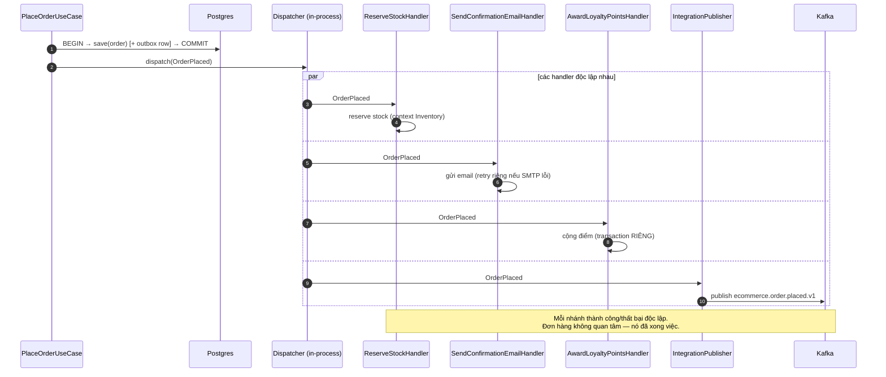

+++
title = "Chương 10: Domain Event — Ghi lại những gì ĐÃ xảy ra, để phần còn lại của hệ thống tự lo"
date = "2026-07-09T17:00:00+07:00"
draft = false
tags = ["backend", "ddd", "architecture"]
series = ["Domain-Driven Design"]
+++

> **Vị trí chương này**: Chương 9 kết thúc bằng một món nợ: `PlaceOrderUseCase` gọi `events.publishAll(order.pullDomainEvents())` và hứa "chương 10 giải thích". Email xác nhận, SMS cho khách Platinum, cộng điểm loyalty, trừ kho — tất cả đã bị đuổi ra khỏi transaction đặt hàng mà chưa nói rõ chúng đi đâu. Chương này trả món nợ đó. Domain Event cũng là cây cầu nối sang phần sau của tài liệu: không hiểu nó thì không đọc được chương 12 (kiến trúc), chương 13 (distributed systems), và toàn bộ các case study 15a/15b.

---

## 1. Problem Statement: một method làm việc của bốn phòng ban

Quay lại `createOrder` phiên bản "nồi lẩu" ở chương 9, nhìn riêng đoạn cuối:

```typescript
return this.dataSource.transaction(async (em) => {
  await em.save(order);
  await this.mailerService.sendOrderConfirmation(customer.email, order);   // phòng CSKH
  await this.smsService.send(customer.phone, `Đơn ${order.id}...`);        // phòng CSKH
  await this.loyaltyService.addPoints(customer.id, order.total * 0.01);    // phòng loyalty
  await this.inventoryClient.reserve(order.items);                         // phòng kho
  await this.analyticsClient.track('order_created', order);                // phòng data
  return this.toDto(order);
});
```

Trông "gọn" — mọi thứ một chỗ, một transaction, atomic. Nhưng hãy chạy từng câu hỏi first-principles:

**Câu hỏi 1: Nghiệp vụ "đặt hàng" có thật sự bao gồm gửi email không?** Hỏi domain expert: "Nếu email hỏng, đơn hàng có được tạo không?" — "Có chứ, email chỉ là thông báo." Vậy tại sao trong code, mailer ném exception thì **transaction rollback và đơn hàng biến mất**? Code đang tuyên bố một rule nghiệp vụ mà không ai phê duyệt: *đặt hàng thất bại khi SMTP thất bại*. Đây không phải bug hạ tầng — đây là **mô hình sai nghiệp vụ**.

**Câu hỏi 2: Transaction này giữ lock bao lâu?** `em.save` mất 5ms. Gửi email 300ms–3s (SMTP bên thứ ba). Gọi loyalty service 50–500ms. Gọi inventory 50–500ms. Transaction giữ row lock trên bảng `orders` (và có thể `promotions`) suốt vài giây. Nhân với lưu lượng mùa sale: connection pool cạn, lock chờ nhau, hệ thống sập vì... email chậm.

**Câu hỏi 3: Chuyện gì xảy ra khi có yêu cầu mới?** "Khi khách đặt đơn đầu tiên, tặng voucher." Bạn mở `createOrder`, thêm dòng thứ sáu vào transaction. Rồi "đơn > 5 triệu thì báo Slack cho sales". Dòng thứ bảy. Method này giờ phụ thuộc **bảy hệ thống**; muốn test phải mock bảy thứ; team loyalty muốn đổi công thức điểm phải sửa file của team order. Mỗi feature mới làm *nơi phát sinh nghiệp vụ* phình thêm — coupling tăng tuyến tính theo số phòng ban quan tâm đến đơn hàng.

**Câu hỏi 4: Nghiệp vụ nói gì?** Domain expert mô tả: "*Khi* đơn hàng được đặt, *thì* kho giữ hàng, *thì* khách nhận email, *thì* điểm được cộng." Ngôn ngữ tự nhiên của nghiệp vụ là **sự kiện và phản ứng** — "khi X xảy ra thì Y". Nhưng code lại viết dưới dạng **một thủ tục tuần tự do một chủ thể thực hiện hết**. Mô hình trong đầu expert và mô hình trong code đã lệch nhau — và chương 3 (Ubiquitous Language) đã nói cái giá của độ lệch đó.

Tóm lại, vấn đề có ba mặt:

1. **Coupling**: nơi phát sinh sự kiện nghiệp vụ phải biết mọi bên quan tâm.
2. **Transaction phình to**: những việc không cần atomic bị nhét vào vùng atomic, trả giá bằng lock, latency, và rollback vô lý.
3. **Sai ngôn ngữ**: nghiệp vụ nói "khi–thì", code nói "làm hết trong một hàm".

**Không giải quyết thì sao?** Hệ thống vẫn chạy — cho đến khi nó không chạy nữa: một sự cố mailer kéo sập việc đặt hàng (sự cố có thật ở nhiều công ty, thường được phát hiện đúng lúc chạy campaign); và về dài hạn, mọi feature liên quan đến đơn hàng đều phải đi qua một method, biến nó thành điểm tắc nghẽn của cả tổ chức, không chỉ của code.

---

## 2. Tại sao DDD đưa ra Domain Event

Domain Event không có trong Blue Book (2003) — Eric Evans bổ sung nó sau, và Vaughn Vernon (Red Book, 2013) nâng nó thành building block hạng nhất. Lý do nó xuất hiện muộn rất đáng suy ngẫm: cộng đồng DDD nhận ra rằng **Aggregate giải quyết được nhất quán bên trong ranh giới, nhưng chưa trả lời được câu hỏi "phần còn lại của thế giới phản ứng thế nào"**.

Chương 7 đã đặt rule: một transaction chỉ sửa một Aggregate. Rule này lập tức sinh ra câu hỏi: vậy khi `Order` được đặt mà `Inventory`, `LoyaltyAccount`, `CustomerNotification` — các Aggregate khác, thậm chí Bounded Context khác — cần thay đổi theo, thì cơ chế nào chở thông tin qua ranh giới? Nếu không có câu trả lời chính thức, developer sẽ quay lại gọi thẳng service của nhau trong cùng transaction — và rule của chương 7 chết trên giấy.

Domain Event là câu trả lời chính thức đó, dựa trên một quan sát first-principles về chính nghiệp vụ:

> Trong thế giới thật, các phòng ban phối hợp với nhau **qua sự kiện đã xảy ra**, không qua việc gọi thẳng vào tay nhau. Kho không đứng cạnh quầy thu ngân; kho đọc *phiếu* "đơn #123 đã được đặt" rồi hành động. Kế toán ghi sổ từ *chứng từ*. Sự kiện — một mẩu giấy ghi lại việc đã rồi — chính là giao thức phối hợp tự nhiên của mọi tổ chức, có trước máy tính hàng trăm năm.

DDD chỉ làm một việc: đưa mẩu giấy đó vào mô hình, đặt tên nó bằng Ubiquitous Language, và biến nó thành first-class citizen — `OrderPlaced`, `PaymentConfirmed`, `ShipmentDelivered`.

**Đánh đổi mà DDD chấp nhận khi chọn con đường này**: từ bỏ "mọi thứ nhất quán ngay lập tức" để đổi lấy decoupling. Kho biết về đơn hàng *sau* một khoảng trễ. Đó không phải khuyết điểm của pattern — đó là thừa nhận sự thật rằng thế giới thật cũng vận hành như vậy (kho ngoài đời cũng không giữ hàng *cùng lúc tuyệt đối* với thao tác bấm nút của khách). Phần khó là kỹ thuật đảm bảo "sau một khoảng trễ" không biến thành "không bao giờ" — mục 8 xử lý chuyện đó.

---

## 3. Bản chất: sự kiện là QUÁ KHỨ, và quá khứ thì bất biến

Bóc hết framework, một Domain Event là:

> **Một bản ghi bất biến, đặt tên ở thì quá khứ bằng ngôn ngữ nghiệp vụ, mô tả một sự việc có ý nghĩa với domain expert đã xảy ra tại một thời điểm xác định.**

Từng vế đều mang nghĩa thiết kế:

**"Thì quá khứ"** — `OrderPlaced`, không phải `PlaceOrder` (đó là Command — một *yêu cầu* có thể bị từ chối) và không phải `OrderPlacing`. Sự kiện là việc đã rồi: không handler nào có quyền "từ chối" một event. Nếu bạn thấy mình muốn handler veto event → bạn đang cần Command hoặc một bước kiểm tra *trước khi* aggregate thay đổi, không phải event. Quy ước ngữ pháp này nghe hình thức nhưng nó cưỡng chế một mô hình tư duy: **quyết định xảy ra một lần, tại aggregate; phản ứng xảy ra nhiều lần, ở nơi khác, sau đó.**

**"Bất biến"** — đã xảy ra thì không sửa được. Về code: mọi field `readonly`, không setter, không chứa reference đến object có thể thay đổi (mục 11 sẽ cho thấy vi phạm điều này gây bug kiểu gì).

**"Có ý nghĩa với domain expert"** — `OrderPlaced` là domain event; `OrderRowInserted` không phải. Nếu sự kiện chỉ mô tả cơ học kỹ thuật (row inserted, cache invalidated), nó không thuộc domain model. Phép thử: đọc tên event cho domain expert, họ phải gật đầu "à, lúc đó bên tôi phải làm X".

**"Tại một thời điểm xác định"** — event luôn mang `occurredAt`. Chuỗi event của một aggregate là *lịch sử nghiệp vụ* của nó — đây cũng là nền của Event Sourcing (chương 12 chạm tới), nhưng lưu ý ngay: **dùng Domain Event không bắt buộc dùng Event Sourcing**. Hai thứ hay bị đánh đồng; bạn có thể (và đa số nên) dùng event để tích hợp mà vẫn lưu state bằng bảng quan hệ bình thường.

Một event tối thiểu trong TypeScript và Go:

```typescript
// domain/events/order-placed.ts
export class OrderPlaced {
  readonly occurredAt: Date;
  constructor(
    readonly eventId: string,          // để dedupe — mục 8
    readonly orderId: string,          // ID, không phải object Order
    readonly customerId: string,
    readonly totalAmount: number,      // snapshot giá trị tại thời điểm xảy ra
    readonly currency: string,
    readonly lines: ReadonlyArray<{ productId: string; quantity: number }>,
  ) {
    this.occurredAt = new Date();
  }
}
```

```go
// domain/events.go
type OrderPlaced struct {
	EventID     string
	OccurredAt  time.Time
	OrderID     string
	CustomerID  string
	TotalAmount int64  // minor units — chương 6 đã bàn về Money
	Currency    string
	Lines       []OrderPlacedLine // slice copy, không share với aggregate
}

func (e OrderPlaced) EventName() string { return "order.placed" }
```

Để ý ba quyết định lặp lại ở cả hai ngôn ngữ: chỉ chứa **ID và giá trị snapshot** (không chứa object sống), có **eventId** riêng, và Go dùng **value type + slice copy** để bất biến trên thực tế chứ không chỉ trên văn bản.

### 3.1. Domain Event vs Integration Event — chỗ nhầm lẫn đắt nhất

Đây là phân biệt bị nhầm nhiều nhất trong thực tế, và nhầm ở đây thì trả giá bằng coupling giữa các team — đắt hơn nhiều so với coupling giữa các class.

| | Domain Event | Integration Event |
|---|---|---|
| Phạm vi | **Bên trong** một Bounded Context | **Giữa** các Bounded Context / service |
| Khán giả | Handler trong cùng codebase, cùng team | Team khác, service khác, có khi công ty khác |
| Ngôn ngữ | Ubiquitous Language của context đó, tham chiếu domain type thoải mái | Ngôn ngữ **hợp đồng công khai** (Published Language — chương 5), kiểu dữ liệu nguyên thủy/schema |
| Được phép đổi? | Tương đối tự do — refactor nội bộ, sửa cùng một PR | **Là public API** — đổi phải versioning, backward compatible |
| Cơ chế chuyển | In-process (EventEmitter, dispatcher, cùng transaction outbox) | Message broker (Kafka, RabbitMQ, SNS/SQS) |
| Độ mịn | Mịn, nhiều event nhỏ theo mô hình nội bộ | Thô hơn, được **thiết kế có chủ đích** cho bên ngoài |
| Ví dụ | `OrderLineDiscountApplied` | `ecommerce.order.placed.v1` |

Sai lầm kinh điển: **phát thẳng Domain Event nội bộ lên Kafka cho service khác consume**. Cảm giác ban đầu là "tiện — event có sẵn rồi". Sáu tháng sau, bạn muốn refactor nội bộ: đổi tên field, gộp hai event, đổi cấu trúc `lines`. Không được nữa — ba team khác đang parse đúng cái JSON đó. **Mô hình nội bộ của bạn đã trở thành public API mà bạn không hề ký hợp đồng.** Đây chính là lý do chương 4 vẽ ranh giới Bounded Context: thứ đi qua ranh giới phải là hợp đồng có chủ đích, không phải nội tạng rò ra ngoài.

Cách làm đúng: một handler nội bộ (thường đặt tên translator/publisher ở tầng application) nghe Domain Event và **dịch** sang Integration Event:

```typescript
// application/integration/order-events-translator.ts
@Injectable()
export class OrderIntegrationPublisher {
  @OnEvent(OrderPlaced.name)
  async handle(e: OrderPlaced): Promise<void> {
    // Dịch từ mô hình nội bộ -> hợp đồng công khai, versioned
    await this.broker.publish('ecommerce.order.placed.v1', {
      event_id: e.eventId,
      occurred_at: e.occurredAt.toISOString(),
      order_id: e.orderId,
      customer_id: e.customerId,
      total: { amount: e.totalAmount, currency: e.currency },
      line_count: e.lines.length,   // bên ngoài KHÔNG cần chi tiết từng line -> không cho
    });
  }
}
```

Bản dịch này là nơi bạn *quyết định* thế giới bên ngoài được biết gì. Nội bộ đổi thoải mái, chỉ cần bản dịch giữ nguyên output — đúng vai trò Anti-Corruption Layer chiều đi (chương 5).

Quy tắc nhớ nhanh: **Domain Event là câu chuyện bạn kể trong nhà; Integration Event là thông cáo báo chí.** Không ai đưa nguyên biên bản họp nội bộ cho báo chí.

---

## 4. Cách hoạt động: từ aggregate đến handler

### 4.1. Aggregate phát event thế nào — collect trước, publish sau khi persist

Câu hỏi kỹ thuật quan trọng nhất của pattern: **ai publish, và publish lúc nào?** Câu trả lời sai phổ biến là aggregate tự publish ngay trong method (`this.eventBus.emit(...)` bên trong `Order.place`). Sai vì hai lẽ: (1) aggregate phải ôm event bus — hạ tầng nhiễm vào domain, đúng căn bệnh chương 9 vừa chữa; (2) **event bay đi trước khi transaction commit** — nếu save thất bại, email "đặt hàng thành công" đã gửi cho một đơn hàng không tồn tại. Đây là loại bug làm mất lòng tin của khách nhanh nhất.

Pattern chuẩn — **collect trong aggregate, publish sau khi persist**:

```mermaid
sequenceDiagram
    participant AS as Application Service
    participant O as Order (Aggregate)
    participant R as Repository
    participant DB as Database
    participant D as Event Dispatcher

    AS->>O: Order.place(...)
    Note over O: Quyết định nghiệp vụ<br/>this.record(new OrderPlaced(...))<br/>Event nằm YÊN trong aggregate
    AS->>R: save(order)
    R->>DB: BEGIN; INSERT ...; COMMIT
    Note over DB: Transaction đã chốt.<br/>Sự thật đã tồn tại.
    AS->>O: pullDomainEvents()
    O-->>AS: [OrderPlaced]
    AS->>D: publishAll(events)
    Note over D: Từ đây mới có side effect
```

Base class phía TypeScript:

```typescript
// domain/aggregate-root.ts
export abstract class AggregateRoot {
  private domainEvents: object[] = [];

  protected record(event: object): void {
    this.domainEvents.push(event);
  }

  pullDomainEvents(): object[] {
    const events = this.domainEvents;
    this.domainEvents = [];        // pull = lấy và xóa, chống publish đúp
    return events;
  }
}

// domain/order.ts
export class Order extends AggregateRoot {
  static place(customerId: CustomerId, lines: OrderLine[], pricing: OrderPricing): Order {
    if (lines.length === 0) throw new EmptyOrderError();
    const order = new Order(OrderId.generate(), customerId, lines, pricing, OrderStatus.initial(pricing));
    order.record(new OrderPlaced(
      EventId.generate().value,
      order.id.value,
      customerId.value,
      pricing.total.amount,
      pricing.total.currency,
      lines.map(l => ({ productId: l.productId.value, quantity: l.quantity })),
    ));
    return order;
  }

  confirmPayment(payment: PaymentReceipt): void {
    if (!this.status.canConfirmPayment()) throw new InvalidOrderStateError(this.id, 'confirmPayment');
    this.status = OrderStatus.Paid;
    this.record(new PaymentConfirmed(EventId.generate().value, this.id.value, payment.reference));
  }
}
```

Và phía Go — event slice trong aggregate, dispatcher tường minh:

```go
// domain/order.go
type Order struct {
	id     OrderID
	// ... state
	events []DomainEvent // slice event chưa publish
}

type DomainEvent interface {
	EventName() string
}

func (o *Order) record(e DomainEvent) { o.events = append(o.events, e) }

// PullDomainEvents trả về event đã tích lũy và xóa buffer — gọi đúng một lần sau khi save.
func (o *Order) PullDomainEvents() []DomainEvent {
	out := o.events
	o.events = nil
	return out
}

func PlaceOrder(customerID CustomerID, lines []OrderLine, pricing OrderPricing) (*Order, error) {
	if len(lines) == 0 {
		return nil, ErrEmptyOrder
	}
	o := &Order{id: NewOrderID() /* ... */}
	o.record(OrderPlaced{
		EventID:     NewEventID(),
		OccurredAt:  time.Now().UTC(),
		OrderID:     o.id.String(),
		CustomerID:  customerID.String(),
		TotalAmount: pricing.Total().Amount(),
		Currency:    pricing.Total().Currency(),
		Lines:       toEventLines(lines), // copy, không share slice
	})
	return o, nil
}
```

```go
// app/dispatcher.go — dispatcher in-process tối giản, đủ dùng thật
type Handler func(ctx context.Context, e domain.DomainEvent) error

type Dispatcher struct {
	mu       sync.RWMutex
	handlers map[string][]Handler // eventName -> handlers
}

func (d *Dispatcher) Subscribe(eventName string, h Handler) {
	d.mu.Lock()
	defer d.mu.Unlock()
	d.handlers[eventName] = append(d.handlers[eventName], h)
}

func (d *Dispatcher) Dispatch(ctx context.Context, events ...domain.DomainEvent) {
	for _, e := range events {
		d.mu.RLock()
		hs := d.handlers[e.EventName()]
		d.mu.RUnlock()
		for _, h := range hs {
			if err := h(ctx, e); err != nil {
				// KHÔNG return: một handler hỏng không được chặn handler khác.
				// Log + đẩy vào retry queue; nghiệp vụ chính đã commit rồi.
				slog.ErrorContext(ctx, "event handler failed",
					"event", e.EventName(), "err", err)
			}
		}
	}
}
```

Chi tiết `if err != nil` **không return** trong dispatcher đáng một phút dừng lại: đơn hàng đã commit — sự thật đã tồn tại. Handler email hỏng không được phép ngăn handler loyalty chạy, càng không được phép "hủy" đơn. Trách nhiệm của hệ thống lúc này là *retry cho đến khi xong* (mục 8), không phải rollback.

### 4.2. Một event, nhiều handler — bức tranh đầy đủ



So với "nồi lẩu" ở mục 1: thêm yêu cầu "tặng voucher đơn đầu tiên" giờ là **thêm một handler mới** — không mở file `PlaceOrderUseCase`, không thêm dependency, không kéo dài transaction. Team loyalty tự sở hữu handler của họ. Đó là toàn bộ giá trị của pattern gói trong một câu: **nơi phát sinh sự kiện đóng lại với thay đổi; nơi phản ứng mở ra cho mở rộng.**

### 4.3. Event handler và eventual consistency — chấp nhận trễ một cách có kỷ luật

Mỗi handler chạy trong **transaction riêng** (hoặc không transaction nào). Nghĩa là tồn tại khoảnh khắc: đơn hàng đã có, điểm chưa cộng, kho chưa giữ. Hệ thống **eventually consistent** giữa các aggregate/context.

Điều cần khắc sâu: đây là **quyết định nghiệp vụ, không phải quyết định kỹ thuật**, nên phải hỏi domain expert đúng câu: *"Kho giữ hàng trễ 2 giây so với lúc đặt đơn — chấp nhận được không? Trễ 5 phút thì sao? Nếu cuối cùng giữ hàng thất bại (hết hàng thật) thì đơn xử lý thế nào?"* Câu cuối quan trọng nhất: eventual consistency buộc bạn thiết kế **luồng đền bù** (compensation) — `OrderPlaced` → kho báo `StockReservationFailed` → order chuyển `CANCELLED_OUT_OF_STOCK` + hoàn tiền. Trong thế giới đồng bộ, thất bại là exception + rollback; trong thế giới event, thất bại là **một sự kiện nghiệp vụ nữa** cần được mô hình hóa tử tế. Nhiều team ngã ở đúng chỗ này: họ vẽ happy path bằng event rất đẹp rồi bỏ trống nhánh thất bại.

Ngược lại, có những thứ **không được** eventual: trừ tiền và ghi sổ ledger phải cùng transaction — thì chúng phải cùng một Aggregate (chương 7), không dùng event. Ranh giới aggregate và ranh giới eventual consistency là **cùng một đường kẻ** — đó là lý do hai chương này phải đọc cạnh nhau.

### 4.4. Thiết kế payload — đủ nhưng không thừa

Hai thái cực đều sai:

```typescript
// SAI kiểu 1 — event gầy đến vô dụng
class OrderPlaced { constructor(readonly orderId: string) {} }
// Mọi handler đều phải query lại Order → N handler = N query,
// và query lúc XỬ LÝ có thể thấy state ĐÃ KHÁC lúc phát (order vừa bị cancel).

// SAI kiểu 2 — chở cả aggregate lên event
class OrderPlaced { constructor(readonly order: Order) {} }
// (1) Handler cầm được object sống → cám dỗ gọi order.cancel() trong handler — event
// thành cổng mutation. (2) Serialize cả aggregate = schema event dính chặt cấu trúc nội
// bộ, refactor Order là phá mọi consumer. (3) Payload phình theo aggregate.
```

Nguyên tắc đúng: **event mang dữ liệu bất biến mô tả sự kiện, đủ cho các handler đã biết, tại thời điểm nó xảy ra** — các ID liên quan, các giá trị nghiệp vụ chốt tại khoảnh khắc đó (số tiền, số lượng), metadata (eventId, occurredAt, version). Giá trị chốt tại khoảnh khắc là điểm tinh tế: `OrderPlaced` mang `totalAmount` *lúc đặt* — kể cả sau này đơn sửa giá, event lịch sử không đổi, vì quá khứ không đổi.

```typescript
export class OrderPlaced {
  readonly eventId = randomUUID();          // để consumer dedup (chương 13)
  readonly occurredAt = new Date();
  static readonly eventType = 'order.placed';
  static readonly schemaVersion = 1;

  constructor(
    readonly orderId: string,
    readonly customerId: string,
    readonly lines: ReadonlyArray<{ productId: string; qty: number }>,
    readonly totalAmount: { amount: string; currency: string }, // primitive hóa, không chở VO class
  ) {}
}
```

### 4.5. Go — event trong aggregate và dispatcher tối giản

```go
// internal/order/domain/events.go
package domain

type DomainEvent interface {
    EventType() string
    OccurredAt() time.Time
}

type OrderPlaced struct {
    ID         string    // eventId
    At         time.Time
    OrderID    string
    CustomerID string
    Total      MoneyDTO  // primitive hóa để serialize ổn định
}

func (e OrderPlaced) EventType() string     { return "order.placed" }
func (e OrderPlaced) OccurredAt() time.Time { return e.At }
```

```go
// internal/shared/eventbus/dispatcher.go — in-process, đồng bộ gọi, lỗi cô lập
package eventbus

type Handler func(ctx context.Context, e domain.DomainEvent) error

type Dispatcher struct {
    mu       sync.RWMutex
    handlers map[string][]Handler
}

func (d *Dispatcher) Subscribe(eventType string, h Handler) {
    d.mu.Lock(); defer d.mu.Unlock()
    d.handlers[eventType] = append(d.handlers[eventType], h)
}

func (d *Dispatcher) Dispatch(ctx context.Context, events ...domain.DomainEvent) {
    d.mu.RLock(); defer d.mu.RUnlock()
    for _, e := range events {
        for _, h := range d.handlers[e.EventType()] {
            if err := h(ctx, e); err != nil {
                // Lỗi của MỘT handler không được kéo sập handler khác,
                // càng không được rollback nghiệp vụ đã commit:
                slog.Error("event handler failed", "event", e.EventType(), "err", err)
                // → đẩy vào retry queue / DLQ tùy mức quan trọng của handler
            }
        }
    }
}
```

Ghi chú trung thực về dispatcher in-process: gọi handler *sau khi commit* nghĩa là nếu process chết giữa chừng, một số handler chưa chạy — event "mất". Với handler chỉ-tiện-ích (email) có thể chấp nhận; với handler nghiệp vụ (giữ kho) thì không — lời giải đầy đủ là **outbox pattern**: event ghi vào bảng outbox *cùng transaction* với aggregate, một relay đọc outbox và phát lại đến khi thành công. Chi tiết ở [chương 13](/series/domain-driven-design/13-ddd-va-distributed-systems/); ở tầm chương này chỉ cần nhớ: *mức độ đảm bảo giao event là một quyết định thiết kế theo từng handler, không phải mặc định của framework*.

### 4.6. Event versioning cơ bản

Event đã publish là hợp đồng — nhất là integration event đã ra khỏi context. Quy tắc tối thiểu đủ dùng:

- **Thay đổi cộng thêm** (thêm field optional): không cần version mới, consumer cũ bỏ qua field lạ (schema phải ở chế độ backward-compatible — Avro/Protobuf + registry làm hộ việc kiểm).
- **Thay đổi phá vỡ** (đổi tên/xóa field, đổi ngữ nghĩa): event **mới** — `order.placed.v2` — chạy song song v1 trong thời gian chuyển; producer phát cả hai (double-publish) hoặc có translator v2→v1; consumer migrate dần; v1 khai tử theo deprecation window có thông báo.
- **Không bao giờ** sửa ngữ nghĩa của field mà giữ nguyên tên — loại thay đổi không tool nào bắt được, chỉ nổ ở production.

Domain event nội bộ (chưa ra khỏi process) thì thoải mái hơn nhiều: refactor như refactor code thường, IDE lo. Đây là thêm một lý do để **giữ event nội bộ và event tích hợp là hai lớp tách biệt** (mục 3.1): lớp nội bộ rẻ để đổi, lớp công bố đắt để đổi — trộn hai lớp là trả giá đắt cho mọi thay đổi.

## 5. Điểm mạnh

- **Decoupling đúng chiều nhân quả**: nơi gây sự kiện không biết nơi phản ứng — thêm phản ứng mới không đụng code cũ. Tổ chức cũng decouple theo: team loyalty tự sở hữu handler của mình.
- **Transaction ngắn lại**: side-effect rời khỏi transaction chính → giữ lock ngắn, throughput ghi tăng, một SMTP chậm không kéo sập việc đặt hàng.
- **Event là Ubiquitous Language chạy được**: dòng event (`OrderPlaced → StockReserved → PaymentConfirmed`) đọc lên là quy trình nghiệp vụ — domain expert kiểm tra được logic hệ thống mà không đọc code.
- **Mở đường cho mọi pattern phân tán**: outbox, saga, CQRS projection, event sourcing (chương 13) đều đứng trên vai domain event. Làm đúng chương này thì chương 13 là bước đi tự nhiên; làm sai thì chương 13 là đầm lầy.

## 6. Điểm yếu

- **Luồng điều khiển tàng hình**: "chuyện gì xảy ra khi đặt hàng?" không còn trả lời được bằng đọc một hàm — phải biết mọi handler đã subscribe. Thiếu tài liệu/tooling thì debug là đi săn ma; stack trace đứt ở ranh giới dispatch.
- **Eventual consistency phải thiết kế nhánh thất bại** (mục 4.3): compensation, trạng thái trung gian, câu trả lời cho user khi nhánh sau fail — khối lượng thiết kế thật, hay bị bỏ quên sau happy path.
- **Ordering và duplicate**: hai event cùng aggregate đến sai thứ tự, một event giao hai lần — consumer phải idempotent (chương 13). Đây là thuế phải đóng, không có đường miễn.
- **Nghi lễ với hệ nhỏ**: app 3 màn hình mà mỗi hành động một event + 5 file handler là kiến trúc trình diễn.

## 7. Trade-off

- **Gọi thẳng vs phát event**: gọi thẳng — thấy được, debug dễ, nhất quán tức thời, nhưng coupling và transaction dài. Event — mở rộng rẻ, transaction ngắn, nhưng gián tiếp và eventual. Quy tắc chọn: *kết quả có cần ngay trong transaction này không?* Cần (trừ kho ngay để báo user "hết hàng") → gọi thẳng/cùng aggregate. Không cần (email, điểm, analytics) → event. Đừng chọn theo mốt.
- **Event gầy vs event béo** (mục 4.4): gầy → consumer tự query (thêm coupling ngược + đọc state mới hơn thời điểm event); béo → schema nặng, dính cấu trúc nội bộ. Điểm cân bằng: đủ cho consumer *hiện tại* + ID để ai cần thêm thì tự lấy.
- **In-process vs qua broker**: in-process — rẻ, đơn giản, đủ cho modular monolith; broker — bền, phân tán được, nhưng kéo theo cả bộ máy vận hành (Kafka, schema registry, DLQ, monitoring). Bắt đầu in-process + outbox, lên broker khi có consumer ngoài process — đừng mua Kafka trước khi có gì để chở.

## 8. Production Considerations

- **Đặt observability từ ngày đầu**: correlation-id xuyên chuỗi event (đặt vào metadata mọi event), structured log ở dispatcher, metric số event phát/xử lý/lỗi theo loại. Không có ba thứ này, hệ event là hộp đen.
- **DLQ + cảnh báo** cho handler nghiệp vụ; retry với backoff và **giới hạn số lần** — handler lỗi vĩnh viễn (bug) mà retry vô hạn là kẹt hàng đợi.
- **Tài liệu hóa dòng event**: một trang "event catalog" mỗi context — event nào, ai phát, ai nghe, schema version. Không có nó, sáu tháng sau chính team cũng không dám xóa handler nào.
- **Test**: unit test aggregate assert event phát ra đúng (event là output kiểm được của hành vi — điểm test rất đẹp); integration test cho từng handler; contract test cho integration event.
- **Cẩn thận handler chạm aggregate khác**: mỗi handler mở transaction riêng, load aggregate qua repository, save tử tế — không "tiện tay" update SQL thẳng trong handler.
- **Thứ tự trong một aggregate**: nếu consumer cần thứ tự, partition theo aggregate ID (Kafka key = orderId) — thứ tự toàn cục là ảo tưởng đắt tiền, thứ tự theo aggregate là đủ cho hầu hết nghiệp vụ.

## 9. Best Practices

- Tên event = **quá khứ + ngôn ngữ nghiệp vụ**: `OrderPlaced`, `ReservationReleased`. Thấy tên kiểu `SendEmailEvent`, `UpdateInventoryCommand`-đội-lốt-event — đó là mệnh lệnh, không phải sự kiện (xem anti-pattern).
- Event sinh **bên trong aggregate**, cùng cử động với thay đổi state (chương 07) — không phát event "vu vơ" từ application service cho state mà nó không sở hữu.
- Publish **sau commit** (hoặc outbox) — không bao giờ trước.
- Payload primitive hóa + immutable + kèm `eventId`, `occurredAt`, `schemaVersion` từ ngày đầu — thêm sau là migration.
- Tách hai lớp: domain event (nội bộ, đổi rẻ) / integration event (công bố, đổi đắt) — có translator ở biên.
- Mỗi handler một trách nhiệm, idempotent, sở hữu bởi team sở hữu nghiệp vụ đó.

## 10. Anti-patterns

- **Event là RPC trá hình**: phát `ChargeCustomerRequested` và *chờ* đúng một handler làm việc đó — bạn đang gọi hàm qua message bus: vẫn coupling ngữ nghĩa như gọi thẳng nhưng mất stack trace, mất type-check, thêm độ trễ. Nếu cần ra lệnh, dùng command tường minh; event chỉ để *thông báo điều đã xảy ra*.
- **Handler sửa aggregate khác trong cùng transaction** với event nguồn: eventual consistency giả — thực chất là transaction xuyên aggregate (chương 07) giấu sau dispatcher, giữ đủ nhược điểm của cả hai thế giới.
- **Event chứa mutable reference / cả aggregate** (mục 4.4).
- **Chuỗi event làm luồng chính**: A phát event → handler B phát event → handler C phát event... luồng nghiệp vụ chính trở thành chuỗi domino ngầm không ai nhìn thấy toàn cảnh — đây là lúc cần saga/process manager tường minh (chương 13) thay vì choreography vô chính phủ.
- **Một event god-payload** dùng chung cho 5 nghiệp vụ khác nhau với 30 field optional — consumer đoán field nào có khi nào: ngôn ngữ chung thoái hóa thành túi dữ liệu.

## 11. Khi nào KHÔNG nên dùng Domain Event

Khi hành động không có side-effect ngoài chính nó (CRUD danh mục — sửa tên xong là xong, không ai cần biết); khi mọi consumer đều cần kết quả **ngay trong transaction** (thì đó không phải chỗ tách); khi hệ nhỏ một team mà chuỗi side-effect ngắn và ổn định (gọi thẳng 2 hàm dễ đọc hơn 2 handler + dispatcher). Câu kiểm tra: *"Có ít nhất hai nơi phản ứng độc lập với chuyện này, hoặc nơi phản ứng có được phép trễ/ thất bại độc lập không?"* — chưa có thì khoan; ngày có yêu cầu thứ ba nhét vào cùng method, event tự nhiên trở thành lựa chọn rẻ hơn, lúc đó refactor cũng chưa muộn.

## Đọc tiếp

Business rule dạng điều kiện — "khách này có đủ điều kiện áp mã?" — không phải event cũng chẳng phải service. Nó có pattern riêng: [Chương 11 — Specification](/series/domain-driven-design/11-specification/).

- Quay lại: [09 — Domain Service và Application Service](/series/domain-driven-design/09-domain-service-va-application-service/) · [Mục lục](/series/domain-driven-design/00-muc-luc/)
- Liên quan trực tiếp: [07 — Aggregate](/series/domain-driven-design/07-aggregate/) (event sinh từ đâu) · [13 — DDD và Distributed Systems](/series/domain-driven-design/13-ddd-va-distributed-systems/) (outbox, idempotency, saga — phần "vận hành" của event)
