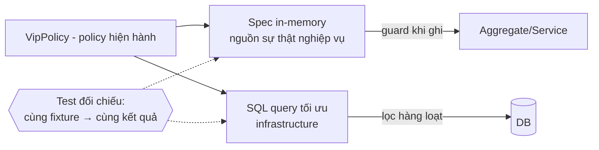

+++
title = "Chương 11 — Specification: Business rule dạng điều kiện cũng xứng đáng có nhà"
date = "2026-07-09T18:00:00+07:00"
draft = false
tags = ["backend", "ddd", "architecture"]
series = ["Domain-Driven Design"]
+++

> Vị trí trong bộ tài liệu: chương khép lại phần Tactical Design. Entity/Value Object (06) chứa rule của *một* object, Aggregate (07) giữ invariant khi *ghi*, Domain Service (09) chứa nghiệp vụ vắt qua nhiều object, Domain Event (10) lan truyền *hậu quả*. Còn một loại rule chưa có nhà: **câu hỏi có/không về một object** — "khách này có đủ điều kiện X không?". Chương này ngắn hơn các chương trước, vì pattern nhỏ — nhưng nó hay bị dùng sai theo cả hai chiều: không dùng khi cần, và lạm dụng khi không cần.

## 1. Problem Statement: một rule, bốn phiên bản, ba kết quả

Sàn TMĐT có rule "khách hàng đủ điều kiện nhận ưu đãi VIP": đã chi tiêu ≥ 10 triệu trong 12 tháng, không có đơn hoàn tiền gian lận, và tài khoản không bị hạn chế. Sau một năm, grep codebase tìm thấy rule này ở **bốn nơi**:

```typescript
// promotion.service.ts — phiên bản đầy đủ
if (spent12m >= 10_000_000 && !hasFraudulentRefund && !isRestricted) {...}

// checkout.controller.ts — ai đó quên vế gian lận
if (customer.spent12m >= 10_000_000 && !customer.isRestricted) {...}

// customer-list.query.ts — SQL, ngưỡng đã cũ từ lần đổi policy trước
WHERE total_spent_12m >= 5000000 AND restricted = false

// notification.job.ts — copy từ controller, kèm luôn cái sai
```

Khi business đổi policy ("thêm điều kiện: có ít nhất 3 đơn thành công"), dev sửa 2 trong 4 chỗ — tìm ra bằng grep từ khóa, mà từ khóa mỗi chỗ một kiểu. Kết quả production: khách thấy badge VIP ở trang cá nhân (chỗ sửa rồi) nhưng checkout không áp ưu đãi (chỗ chưa sửa). Ticket CS, mất niềm tin, và một buổi chiều truy vết.

Vấn đề gốc: **"đủ điều kiện VIP" là một khái niệm nghiệp vụ, nhưng trong code nó không phải một khái niệm — nó là bốn đoạn boolean rời rạc**. Khái niệm không có tên và không có nhà thì không ai cập nhật được nó một lần cho cả hệ thống.

## 2. Tại sao DDD đưa ra Specification

- **Bối cảnh**: Evans & Martin Fowler viết chung paper về pattern này khi nhận ra các rule dạng *predicate* (trả lời có/không) xuất hiện lặp lại ở ba nhu cầu khác nhau — kiểm tra một object (validation/guard), lọc tập hợp (selection), và mô tả yêu cầu cho object chưa tồn tại (specification for building) — mà code cho ba nhu cầu đó thường trùng lặp và trôi lệch nhau.
- **Business problem**: chính sách kinh doanh dạng điều kiện (điều kiện ưu đãi, điều kiện duyệt vay, điều kiện miễn phí ship) là loại rule **đổi thường xuyên nhất** — marketing đổi ngưỡng mỗi quý. Rule đổi nhanh mà rải rác nhiều nơi là công thức tai nạn.
- **Design problem**: predicate không thuộc về entity nào trọn vẹn (rule VIP cần dữ liệu chi tiêu + lịch sử hoàn tiền + trạng thái tài khoản), nhét vào entity thì entity phình; nhét vào service thì thành if-rừng không tái sử dụng; viết thẳng vào query thì logic nghiệp vụ chôn trong SQL.

## 3. Bản chất

Specification là **một business rule dạng điều kiện được đóng gói thành object có tên trong Ubiquitous Language**, với một API duy nhất: `isSatisfiedBy(candidate) → boolean`. Ba điều nó mang lại, xếp theo độ quan trọng thực tế:

1. **Một khái niệm — một chỗ**: "đủ điều kiện VIP" giờ là class `VipEligibility`; đổi policy là sửa một file, mọi nơi dùng tự đúng theo. Đây là 80% giá trị.
2. **Kết hợp được**: `and/or/not` cho phép lắp rule phức từ rule đơn như lắp LEGO — `eligibleForVip.and(notInCooldown).or(manuallyWhitelisted)` — mỗi mảnh test riêng được.
3. **Tách "hỏi" khỏi "làm"**: entity giữ hành vi (làm), specification giữ tiêu chí (hỏi) — hai loại thay đổi có nhịp khác nhau được tách khỏi nhau: policy đổi hàng quý, hành vi đổi hàng năm.

Nó bảo vệ điều gì: **tính nhất quán của chính sách kinh doanh trên toàn hệ thống** — đúng loại bug ở mục 1. Nó giảm complexity bằng cách biến điều kiện lồng nhau vô danh thành cây các khái niệm có tên, đọc lên thành câu nghiệp vụ.

## 4. Cách hoạt động

### 4.1. TypeScript — specification cơ bản và kết hợp

```typescript
// domain/shared/specification.ts
export abstract class Specification<T> {
  abstract isSatisfiedBy(candidate: T): boolean;

  and(other: Specification<T>): Specification<T> { return new AndSpec(this, other); }
  or(other: Specification<T>): Specification<T>  { return new OrSpec(this, other); }
  not(): Specification<T>                        { return new NotSpec(this); }
}

class AndSpec<T> extends Specification<T> {
  constructor(private a: Specification<T>, private b: Specification<T>) { super(); }
  isSatisfiedBy(c: T) { return this.a.isSatisfiedBy(c) && this.b.isSatisfiedBy(c); }
}
// OrSpec, NotSpec tương tự
```

```typescript
// domain/promotion/vip-eligibility.spec.ts — RULE CÓ TÊN, CÓ NHÀ
export class SpentEnough extends Specification<CustomerProfile> {
  constructor(private readonly threshold: Money) { super(); }
  isSatisfiedBy(c: CustomerProfile) { return c.spentLast12Months.gte(this.threshold); }
}

export class NoFraudulentRefund extends Specification<CustomerProfile> {
  isSatisfiedBy(c: CustomerProfile) { return !c.hasFraudulentRefund; }
}

export class AccountInGoodStanding extends Specification<CustomerProfile> {
  isSatisfiedBy(c: CustomerProfile) { return !c.isRestricted; }
}

// Policy hiện hành — MỘT chỗ duy nhất để sửa khi marketing đổi ý:
export const vipEligibility = (policy: VipPolicy) =>
  new SpentEnough(policy.minSpent)
    .and(new NoFraudulentRefund())
    .and(new AccountInGoodStanding());
```

Bốn chỗ ở mục 1 giờ cùng gọi `vipEligibility(policy).isSatisfiedBy(profile)`. Thêm điều kiện "≥ 3 đơn thành công" = thêm một spec + một `.and()` — một dòng diff, bốn nơi tự đúng.

### 4.2. Go — idiomatic: interface + function

Go không cần class hierarchy — function type là đủ và tự nhiên hơn:

```go
// internal/promotion/domain/spec.go
package domain

type Spec[T any] func(T) bool

func And[T any](specs ...Spec[T]) Spec[T] {
    return func(c T) bool {
        for _, s := range specs { if !s(c) { return false } }
        return true
    }
}
func Not[T any](s Spec[T]) Spec[T] { return func(c T) bool { return !s(c) } }

// Các rule có tên:
func SpentEnough(threshold Money) Spec[CustomerProfile] {
    return func(c CustomerProfile) bool { return c.SpentLast12M.GTE(threshold) }
}
func NoFraudulentRefund(c CustomerProfile) bool { return !c.HasFraudulentRefund }
func GoodStanding(c CustomerProfile) bool       { return !c.IsRestricted }

func VipEligibility(p VipPolicy) Spec[CustomerProfile] {
    return And(SpentEnough(p.MinSpent), NoFraudulentRefund, GoodStanding)
}
```

Bài học đối chiếu framework nằm ngay đây: pattern không đòi OOP — **bản chất là "rule có tên, một chỗ, kết hợp được"**, còn class hay closure là chi tiết. Team Go bê nguyên class hierarchy kiểu Java vào là cargo cult; team TypeScript dùng plain function cũng hoàn toàn hợp lệ.

### 4.3. Ba công dụng — và công dụng thứ ba mới là chỗ gãy

**(a) Guard nghiệp vụ** — dùng trong aggregate/domain service trước khi làm: `if (!vipEligibility.isSatisfiedBy(profile)) throw new NotEligible()`. Trơn tru, không có bẫy.

**(b) Validation/giải thích** — biến thể hữu ích: trả về *lý do* không đạt (`WhyNotSatisfied(c) []Reason`) để hiển thị cho user "cần chi tiêu thêm 2 triệu để đạt VIP". Đáng làm khi UX cần.

**(c) Tiêu chí lọc trong repository** — đây là chỗ lý thuyết và thực tế va nhau. Lý thuyết đẹp: `customerRepo.findSatisfying(vipEligibility)`. Thực tế: spec là **hàm chạy trong memory**, còn lọc 5 triệu khách phải là **SQL**. Ba lối ra, thành thật về trade-off:

| Lối ra | Cách làm | Trả giá |
|---|---|---|
| Lọc in-memory | Load hết rồi filter bằng spec | Chỉ ổn với tập nhỏ (≤ vài nghìn); 5 triệu row là OOM |
| Dịch spec → SQL | Mỗi spec biết sinh mảnh `WHERE` của nó (hoặc dùng expression tree) | Xây mini-ORM: đắt, rò rỉ chi tiết SQL vào domain, JOIN phức là bất khả thi — đường này hiếm khi đáng đi |
| **Hai hiện thân, một bài test** (khuyên dùng) | Query SQL viết tay tối ưu ở infrastructure; spec in-memory là **nguồn sự thật về nghiệp vụ**; property-based/fixture test đối chiếu hai bên cho cùng kết quả | Duy trì hai chỗ — nhưng mỗi chỗ làm đúng việc của nó, và test giữ chúng không trôi lệch |

Lối thứ ba nghe "kém thanh lịch" nhưng là lối các hệ thống lớn thực sự đi: SQL được tự do tối ưu (index, denormalize), domain giữ được rule chạy được để guard và test, và cái test đối chiếu chính là hợp đồng chống lại bug "badge hiện mà ưu đãi không áp" ở mục 1.



## 5. Điểm mạnh

- Chính sách kinh doanh **đổi một chỗ, đúng mọi nơi** — đúng thuốc cho loại rule đổi thường xuyên nhất.
- Rule có tên trong Ubiquitous Language → hội thoại với business khớp code: "điều kiện VIP gồm ba vế" — mở file thấy đúng ba vế.
- Test cực rẻ: predicate thuần, không hạ tầng — bảng test case policy chạy trong mili giây.
- Kết hợp cho phép **cá nhân hóa policy theo cấu hình** (mỗi chiến dịch một tổ hợp spec) mà không if-else phình.

## 6. Điểm yếu

- Thêm một tầng gián tiếp: rule một dòng mà bọc class + and/or là nghi lễ (xem mục 11).
- Vấn đề "hai hiện thân" với dữ liệu lớn (mục 4.3c) — không có lời giải miễn phí, chỉ có lời giải có kỷ luật.
- Spec cần **dữ liệu đã load** (CustomerProfile với spentLast12M tính sẵn) — thiết kế input cho spec là việc thật: ai tính profile đó, cache thế nào.

## 7. Trade-off

- **Spec vs method trên entity**: rule dùng một chỗ, gắn chặt một entity → method trên entity (`order.canBeCancelled()`) là đúng nhà, đừng tách. Rule dùng nhiều nơi / tổ hợp theo cấu hình / đổi theo policy → spec. Tiêu chí là *tần suất đổi và số nơi dùng*, không phải độ phức tạp.
- **Spec vs rule engine**: khi business đòi *tự cấu hình* rule không cần deploy (khuyến mãi thay đổi hàng ngày), spec cứng trong code không đủ — cần rule engine/DSL. Trả giá: mất type-safety, khó test, dễ thành "lập trình trong database". Spec là điểm dừng đúng cho đa số; rule engine chỉ khi tần suất đổi vượt tần suất deploy.

## 8. Production Considerations

- **Version policy, không chỉ code**: đơn đã duyệt theo policy cũ phải giải thích được bằng policy cũ — lưu `policyVersion` vào quyết định (nhất là fintech/lending: audit sẽ hỏi "tại sao hồ sơ này duyệt?").
- Ngưỡng số (10 triệu, 12 tháng) đưa vào **policy object/config có version**, không hard-code trong spec — spec giữ *cấu trúc* rule, policy giữ *tham số*.
- Test đối chiếu spec ↔ SQL chạy trong CI với fixture đủ biên (đúng ngưỡng, lệch 1 đồng, null...).
- Log quyết định của spec quan trọng kèm input snapshot — truy vết "tại sao hôm đó khách này không được ưu đãi" là câu CS hỏi thật.

## 9. Best Practices

- Tên spec là **danh từ hóa của điều kiện nghiệp vụ**: `VipEligibility`, `RefundablePurchase` — không phải `CustomerSpec1`.
- Spec **thuần và stateless**: không gọi repository, không I/O bên trong `isSatisfiedBy` — dữ liệu cần thì nhận qua candidate/constructor. Spec có I/O là service trá hình, mất khả năng test rẻ và kết hợp an toàn.
- Giữ cây kết hợp **nông** (≤ 2–3 tầng and/or); sâu hơn thì đặt tên cho tầng giữa thành spec mới.
- Một spec một file/một hàm, cạnh domain model của context đó — không có thư mục `specifications/` dùng chung toàn hệ thống (rule là của từng context).

## 10. Anti-patterns

- **Spec-hóa mọi if**: `IsNotNull`, `StringNotEmpty` bọc class specification — nghi lễ hóa validation nguyên thủy, codebase phồng gấp ba để trông "chuẩn DDD". Nguy hiểm vì làm team dị ứng pattern trước khi thấy giá trị thật của nó.
- **Spec có side-effect hoặc I/O**: `isSatisfiedBy` bên trong gọi API tính điểm tín dụng — giờ nó không thuần, không kết hợp an toàn (and ngắn mạch làm side-effect lúc chạy lúc không), không test rẻ.
- **Generic spec dịch-mọi-thứ-sang-SQL tự chế**: sáu tháng xây expression tree translator, rốt cuộc chỉ dùng được cho query phẳng — chi phí của một mini-ORM, giá trị của một cái `WHERE`. Nếu thấy mình đang viết translator, dừng lại và dùng lối "hai hiện thân" (mục 4.3c).
- **Spec làm túi đựng logic vô chủ**: cái gì không biết đặt đâu cũng thành "spec" kể cả tính toán ra số (đó là domain service/VO method, spec chỉ trả bool).

## 11. Khi nào KHÔNG nên dùng Specification

Rule một dòng, một chỗ dùng, không có dấu hiệu sẽ tổ hợp — viết if trực tiếp hoặc method trên entity; pattern-hóa nó là mua bảo hiểm cho thứ không có rủi ro. Ứng dụng CRUD với validation field đơn giản — dùng validator của framework (class-validator, go-playground/validator) đúng mục đích của chúng. Specification phát huy khi và chỉ khi: rule mang **tên nghiệp vụ**, được **dùng ≥ 2 nơi** hoặc **đổi theo policy**, hoặc cần **tổ hợp theo cấu hình**. Chưa chạm một trong ba điều kiện đó — cứ để cái if sống yên.

## Đọc tiếp

Tactical Design khép lại tại đây. Phần tiếp theo trả lời câu hỏi tầm hệ thống: các mảnh này đặt vào kiến trúc nào — layer ra sao, module chia thế nào, và khi nào thành microservices: [Chương 12 — DDD và Kiến trúc](/series/domain-driven-design/12-ddd-va-kien-truc/).

- Quay lại: [10 — Domain Event](/series/domain-driven-design/10-domain-event/) · [Mục lục](/series/domain-driven-design/00-muc-luc/)
- Liên quan: [09 — Domain Service](/series/domain-driven-design/09-domain-service-va-application-service/) (phân biệt "hỏi" và "làm") · [08 — Repository](/series/domain-driven-design/08-repository-va-factory/) (vấn đề query needs)
