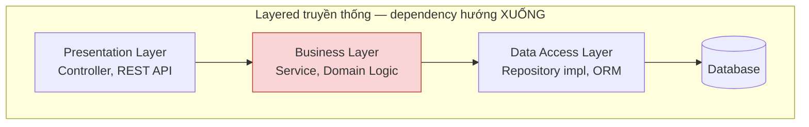
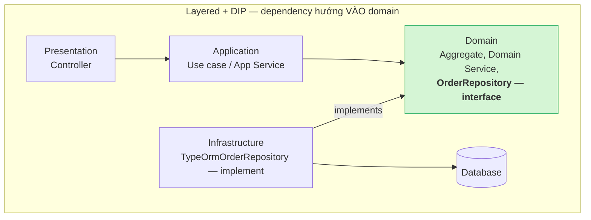
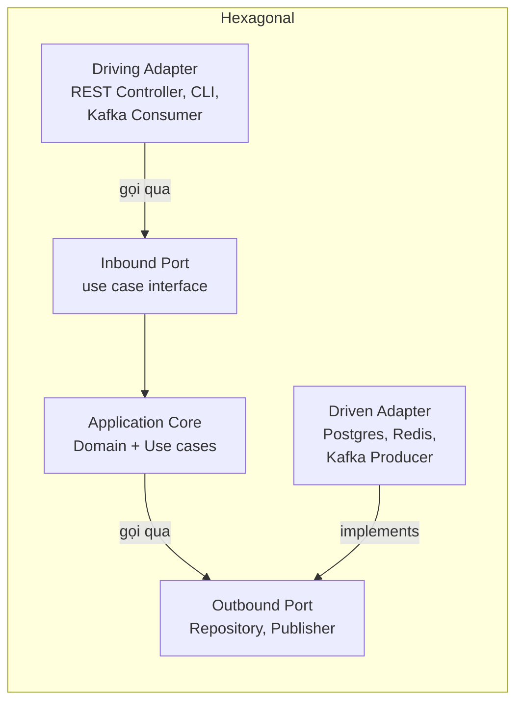
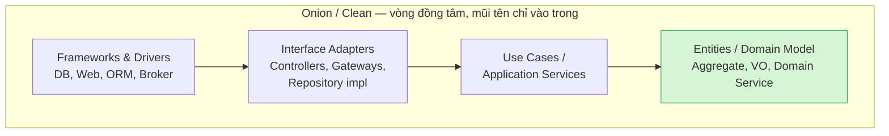
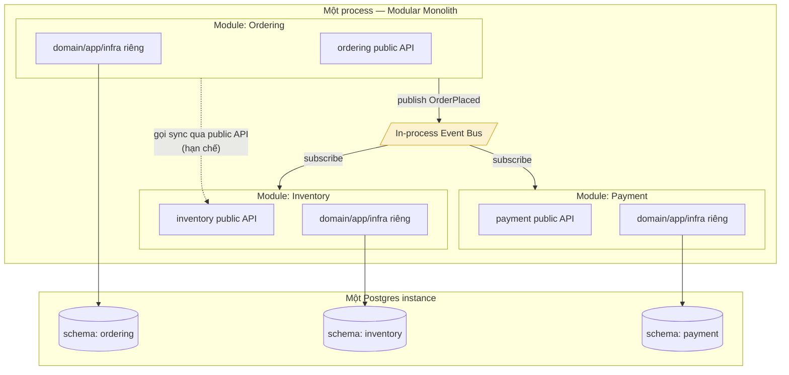
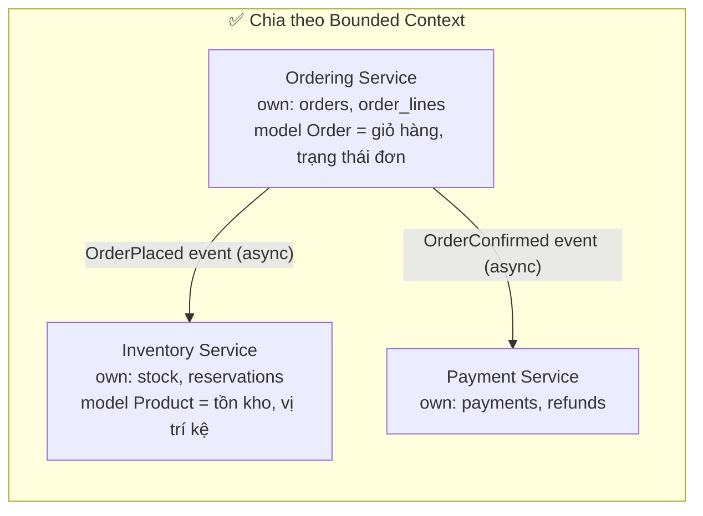
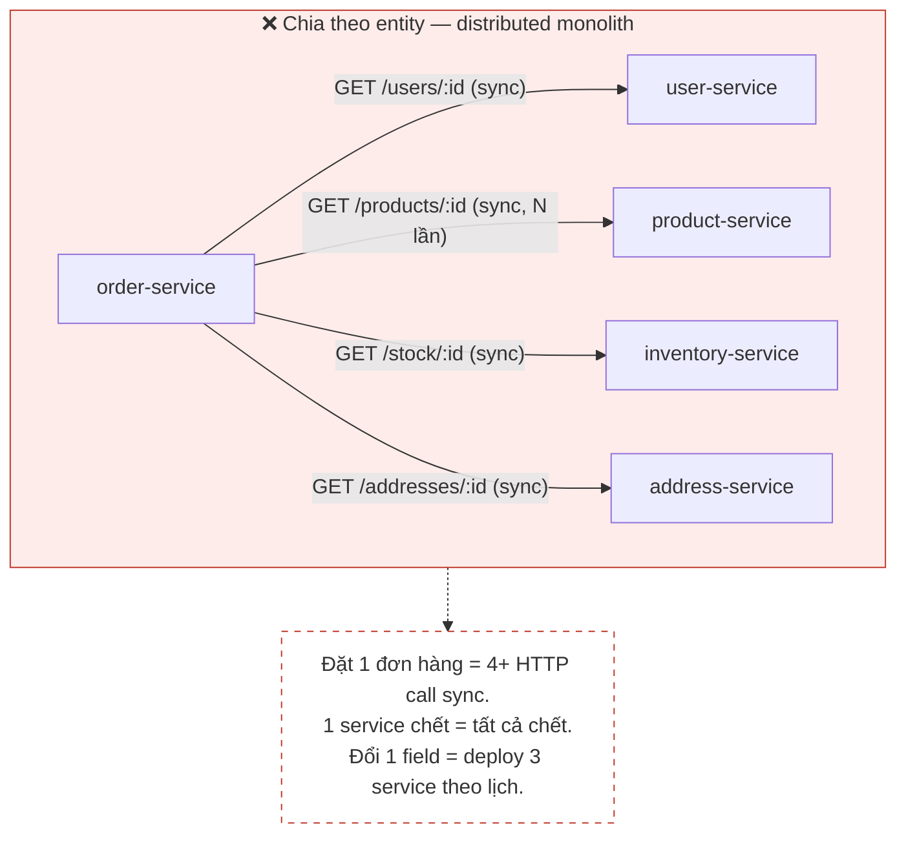

+++
title = "Chương 12: DDD và Kiến trúc hệ thống"
date = "2026-07-09T19:00:00+07:00"
draft = false
tags = ["backend", "ddd", "architecture"]
series = ["Domain-Driven Design"]
+++

> **Vị trí trong lộ trình**: Đến chương này, bạn đã có đầy đủ tactical patterns — Entity, Value Object, Aggregate, Repository, Domain Service, Domain Event, Specification. Câu hỏi tiếp theo không còn là "mô hình hóa domain thế nào" mà là "**đặt cái domain model đó vào đâu trong codebase, và bảo vệ nó bằng cách nào**". Chương này trả lời câu hỏi đó: từ layered architecture truyền thống, qua Hexagonal/Onion/Clean, đến cấu trúc thư mục cụ thể cho NestJS và Go, rồi mở rộng lên câu hỏi lớn hơn — Modular Monolith hay Microservices. Chương 13 sẽ tiếp tục với các pattern cho distributed systems.

---

## 12.1. Vấn đề thực tế: domain model đẹp nhưng chết yểu

Bắt đầu bằng một câu chuyện quen thuộc.

Team của bạn vừa xong 3 tuần event storming. Bounded context rõ ràng. Aggregate `Order` được thiết kế cẩn thận: invariant "tổng tiền các dòng hàng phải khớp `totalAmount`", "không được thêm dòng hàng khi order đã `CONFIRMED`" — tất cả nằm gọn trong aggregate. Code review buổi đầu ai cũng gật gù.

Sáu tháng sau, bạn mở lại file `order.entity.ts`:

```typescript
@Entity('orders')
export class Order {
  @PrimaryGeneratedColumn('uuid')
  id: string;

  @Column({ type: 'decimal', precision: 12, scale: 2 })
  totalAmount: number;

  @Column()
  status: string;

  @ManyToOne(() => Customer, { eager: true })
  customer: Customer;

  @OneToMany(() => OrderLine, (line) => line.order, { cascade: true })
  lines: OrderLine[];

  // Method nghiệp vụ đâu rồi? Không còn ai gọi nữa.
  // Logic confirm() giờ nằm rải rác trong 4 service khác nhau,
  // mỗi service tự query, tự check status, tự save.
}
```

Domain model không chết vì thiết kế sai. Nó chết vì **không có gì bảo vệ nó**:

- ORM decorator ép entity phải có setter public, constructor rỗng → invariant trong constructor bị vô hiệu.
- Developer mới cần thêm tính năng gấp → gọi thẳng `orderRepository.update({ status: 'CONFIRMED' })` từ controller, bỏ qua toàn bộ aggregate.
- Business logic cần data từ 3 bảng → viết luôn raw SQL trong service, logic "order nào được hủy" giờ nằm trong mệnh đề `WHERE`.
- Đổi từ PostgreSQL sang thêm cache Redis → phải sửa cả domain layer vì domain đang `import` trực tiếp TypeORM.

**Đây là bài toán của chương này**: DDD cho bạn một domain model giàu ngữ nghĩa, nhưng nếu kiến trúc không tạo ra một "vành đai bảo vệ" quanh nó, model sẽ bị xói mòn từng commit một — cho đến khi chỉ còn là cái vỏ anemic với decorator ORM.

### DDD không quy định kiến trúc — nhưng đặt ra một yêu cầu bắt buộc

Điểm nhiều người hiểu sai: Eric Evans **không** phát minh ra Hexagonal hay Clean Architecture, và sách Blue Book cũng không bắt bạn dùng kiến trúc nào cụ thể. Trong sách gốc, Evans chỉ dùng layered architecture 4 tầng khá truyền thống.

Cái DDD thực sự yêu cầu chỉ có một câu:

> **Domain layer phải được cô lập (isolated) — không phụ thuộc vào bất kỳ chi tiết kỹ thuật nào: database, framework, message broker, HTTP.**

Tại sao yêu cầu này quan trọng đến mức bắt buộc?

1. **Domain model là nơi tri thức nghiệp vụ sống**. Nếu nó lẫn với code kỹ thuật, tri thức nghiệp vụ bị pha loãng — đọc code không còn thấy business rule, chỉ thấy ORM và HTTP.
2. **Business rule thay đổi theo nhịp của business, infrastructure thay đổi theo nhịp của công nghệ**. Hai nhịp này khác nhau. Trộn chung nghĩa là mỗi lần upgrade framework, bạn có nguy cơ phá business rule; mỗi lần đổi business rule, bạn phải test lại cả tầng kỹ thuật.
3. **Test domain logic phải nhanh và không cần hạ tầng**. Nếu test một invariant của `Order` cần dựng PostgreSQL trong Docker, team sẽ không viết test — và invariant không được bảo vệ.

Mọi kiến trúc trong chương này — Layered cải tiến, Hexagonal, Onion, Clean — chỉ là **các cách khác nhau để thỏa mãn đúng một yêu cầu đó**. Hiểu điều này rồi thì tranh cãi "Hexagonal hay Clean tốt hơn" trở nên vô nghĩa, như tranh cãi hai cách vẽ khác nhau của cùng một bản thiết kế.

---

## 12.2. Layered Architecture truyền thống — và vì sao domain bị nhiễm bẩn

### Problem Statement

Layered architecture (Presentation → Business → Data Access → Database) là kiến trúc mặc định của hầu hết framework và hầu hết developer được dạy ở trường. Nó không sai — nó giải quyết đúng bài toán "tách concerns theo tầng". Nhưng nó có một khiếm khuyết chí mạng đối với DDD: **chiều của dependency**.

### Cách hoạt động và điểm gãy



Nhìn vào mũi tên: **Business Layer phụ thuộc vào Data Access Layer**. Nghĩa là:

- Domain code phải `import` các kiểu dữ liệu của tầng dưới (ORM entity, query builder, DB connection).
- Compile/build domain cần có mặt tầng data access.
- Đơn vị test domain kéo theo cả tầng data access.

Từ điểm gãy này, sự nhiễm bẩn diễn ra theo đúng một kịch bản, lặp lại ở mọi codebase:

**Giai đoạn 1 — Nhiễm bẩn cấu trúc.** ORM yêu cầu entity có constructor rỗng, field public hoặc setter. Aggregate mất khả năng tự bảo vệ invariant ngay từ khâu khởi tạo:

```typescript
// Domain muốn thế này:
class Order {
  private constructor(private readonly lines: OrderLine[]) {
    if (lines.length === 0) throw new EmptyOrderError();
  }
  static place(customerId: CustomerId, lines: OrderLine[]): Order { /* ... */ }
}

// Nhưng TypeORM/Hibernate ép thành thế này:
@Entity()
class Order {
  @OneToMany(() => OrderLine, l => l.order)
  lines: OrderLine[]; // public, ai gán gì cũng được

  constructor() {} // bắt buộc rỗng để ORM hydrate
}
```

**Giai đoạn 2 — Nhiễm bẩn hành vi.** Vì entity giờ chỉ là túi dữ liệu, logic dạt ra service. Service phình to, gọi lẫn nhau, và vì service ở tầng business phụ thuộc data access, developer bắt đầu "tiện tay" viết query tối ưu ngay trong nghiệp vụ:

```typescript
// Business rule "order được hủy khi chưa giao và trong 24h"
// giờ nằm trong SQL — vô hình với domain model
const cancellable = await this.dataSource.query(`
  SELECT * FROM orders
  WHERE status NOT IN ('SHIPPED', 'DELIVERED')
    AND created_at > NOW() - INTERVAL '24 hours'
    AND id = $1
`, [orderId]);
```

**Giai đoạn 3 — Nhiễm bẩn tri thức.** Sau một năm, muốn biết "quy tắc hủy đơn là gì" bạn phải đọc: 2 service, 3 câu SQL, 1 trigger trong DB, và 1 đoạn validate ở frontend. Ubiquitous Language chết. Đây chính là hệ thống mà chương 01 mô tả — thứ DDD sinh ra để tránh.

### Vì sao layered truyền thống vẫn phổ biến?

Công bằng mà nói:

- **Điểm mạnh**: dễ hiểu, dễ dạy, framework hỗ trợ sẵn, phù hợp CRUD app nơi business logic mỏng. Với app quản lý danh mục 10 bảng, layered truyền thống là lựa chọn *đúng* — DDD ở đó là over-engineering (xem chương 16).
- **Điểm yếu**: như phân tích trên — dependency hướng xuống làm domain không thể cô lập.

**Kết luận kỹ thuật**: vấn đề không phải "có layer", mà là **chiều mũi tên giữa business và data access**. Sửa được chiều mũi tên là sửa được tất cả. Và công cụ để sửa chính là Dependency Inversion.

---

## 12.3. Dependency Inversion — chìa khóa của mọi thứ phía sau

### Bản chất

Dependency Inversion Principle (DIP) phát biểu: *module cấp cao không phụ thuộc module cấp thấp; cả hai phụ thuộc vào abstraction, và abstraction do phía cấp cao sở hữu*.

Áp vào DDD, câu này dịch ra rất cụ thể:

> **Domain layer định nghĩa interface (Repository, Gateway, Publisher...). Infrastructure layer implement các interface đó. Mũi tên dependency đảo chiều: infrastructure phụ thuộc domain, không phải ngược lại.**



Chú ý điểm tinh tế: **Data access layer không biến mất — nó chuyển từ "tầng dưới domain" thành "plugin cắm vào domain"**. Interface `OrderRepository` nằm trong domain, viết bằng ngôn ngữ domain (`findById(OrderId): Order`), không lộ chi tiết SQL/ORM.

### Code cụ thể

**TypeScript (NestJS):**

```typescript
// ===== domain/repositories/order.repository.ts =====
// Interface thuộc DOMAIN. Không import gì từ TypeORM.
export interface OrderRepository {
  findById(id: OrderId): Promise<Order | null>;
  save(order: Order): Promise<void>;
  nextIdentity(): OrderId;
}

// Token để NestJS inject (TS interface bị xóa lúc runtime)
export const ORDER_REPOSITORY = Symbol('ORDER_REPOSITORY');

// ===== infrastructure/persistence/typeorm-order.repository.ts =====
// Implementation thuộc INFRASTRUCTURE. Import TypeORM thoải mái ở đây.
@Injectable()
export class TypeOrmOrderRepository implements OrderRepository {
  constructor(
    @InjectRepository(OrderRecord) // OrderRecord: persistence model, KHÔNG phải domain Order
    private readonly repo: Repository<OrderRecord>,
    private readonly mapper: OrderMapper,
  ) {}

  async findById(id: OrderId): Promise<Order | null> {
    const record = await this.repo.findOne({
      where: { id: id.value },
      relations: { lines: true },
    });
    return record ? this.mapper.toDomain(record) : null;
  }

  async save(order: Order): Promise<void> {
    await this.repo.save(this.mapper.toRecord(order));
  }

  nextIdentity(): OrderId {
    return OrderId.generate();
  }
}

// ===== ordering.module.ts — nơi duy nhất "biết" cả hai phía =====
@Module({
  providers: [
    { provide: ORDER_REPOSITORY, useClass: TypeOrmOrderRepository },
    PlaceOrderHandler,
  ],
})
export class OrderingModule {}
```

**Go:**

```go
// ===== internal/ordering/domain/order_repository.go =====
// Interface thuộc domain package. Zero import về DB.
package domain

type OrderRepository interface {
    FindByID(ctx context.Context, id OrderID) (*Order, error)
    Save(ctx context.Context, order *Order) error
}

// ===== internal/ordering/infra/postgres/order_repository.go =====
package postgres

type OrderRepository struct {
    db *pgxpool.Pool
}

// Compile-time check: implementation phải khớp interface của domain
var _ domain.OrderRepository = (*OrderRepository)(nil)

func (r *OrderRepository) FindByID(ctx context.Context, id domain.OrderID) (*domain.Order, error) {
    row := r.db.QueryRow(ctx,
        `SELECT id, customer_id, status, total_amount FROM orders WHERE id = $1`, id.String())
    // ... scan vào struct persistence rồi map sang domain.Order qua factory
    // để invariant được kiểm tra lại khi rehydrate
    return mapRowToOrder(row)
}

func (r *OrderRepository) Save(ctx context.Context, o *domain.Order) error {
    // ... upsert
    return nil
}
```

Điểm quan trọng trong cả hai ngôn ngữ: **wiring (nối interface với implementation) xảy ra ở tầng ngoài cùng** — NestJS module hoặc hàm `main()`/`wire` của Go. Domain không bao giờ biết implementation nào đang chạy.

### Trade-off phải nói thẳng

Đảo chiều dependency không miễn phí:

| Được | Mất |
|---|---|
| Domain test bằng in-memory repository, chạy < 1ms/test | Phải viết và maintain mapper domain ↔ persistence model |
| Đổi DB/ORM không đụng domain | Nhiều file hơn: interface + impl + mapper + token |
| Business rule tập trung, đọc được | Mất một số tính năng ORM "tiện" (lazy loading xuyên aggregate, dirty tracking tự động) |
| Onboard dev mới: đọc domain là hiểu nghiệp vụ | Học phí cho team quen active-record style |

**Không áp dụng thì sao?** Với hệ thống business logic mỏng: chẳng sao cả, đừng áp dụng. Với hệ thống logic dày: bạn sẽ trả giá bằng kịch bản nhiễm bẩn ở mục 12.2 — trả chậm nhưng trả đủ, thường vào năm thứ 2-3 của codebase khi tốc độ ra tính năng giảm dần đều.

**Áp dụng sai thì sao?** Sai phổ biến nhất: định nghĩa interface trong domain nhưng interface lại **lộ chi tiết hạ tầng** — `findByQueryBuilder(qb: SelectQueryBuilder)`, trả về `Promise<OrderRecord>` (persistence model) thay vì `Order`. Lúc đó bạn có đủ số file của DIP nhưng không có sự cô lập — tệ hơn cả không làm, vì tốn công mà không được gì.

---

## 12.4. Hexagonal, Onion, Clean — ba cái tên, một bản chất

### Tại sao ra đời ba (thực ra là nhiều hơn) kiến trúc?

- **Hexagonal (Ports & Adapters)** — Alistair Cockburn, 2005. Xuất phát từ nỗi đau: không thể test ứng dụng mà không dựng UI và DB. Ý tưởng: ứng dụng là lõi, giao tiếp với thế giới qua **port** (interface), thế giới cắm vào qua **adapter**.
- **Onion Architecture** — Jeffrey Palermo, 2008. Cùng nỗi đau, diễn đạt bằng các vòng tròn đồng tâm: domain model trong cùng, infrastructure ngoài cùng, dependency chỉ hướng vào trong.
- **Clean Architecture** — Robert C. Martin, 2012. Tổng hợp cả hai (và thêm DCI, BCE), chuẩn hóa tên tầng: Entities → Use Cases → Interface Adapters → Frameworks & Drivers, cùng "The Dependency Rule": source code dependency chỉ được chỉ vào trong.

### Bản chất chung — và vì sao khác biệt nhỏ hơn người ta nghĩ

Cả ba đều là **Dependency Inversion áp dụng có hệ thống**, phát biểu cùng 3 mệnh đề:

1. Domain/business logic ở trung tâm, không import gì từ bên ngoài.
2. Mọi dependency hướng vào trong (vào domain).
3. Thế giới bên ngoài (DB, HTTP, message broker, UI) là chi tiết, cắm vào qua abstraction.





Khác biệt thực sự chỉ là **góc nhìn và mức độ chi tiết hóa**:

| | Hexagonal | Onion | Clean |
|---|---|---|---|
| Ẩn dụ | Lục giác, port & adapter | Củ hành, vòng đồng tâm | Vòng đồng tâm + Dependency Rule |
| Nhấn mạnh | Sự đối xứng inbound/outbound — DB và UI đều là "bên ngoài" như nhau | Domain model là tâm, tách domain service khỏi application service | Chuẩn hóa tên tầng, quy tắc qua biên giới (boundary crossing) |
| Quy định số tầng trong lõi | Không — lõi là một khối | Có — Domain Model → Domain Services → Application Services | Có — Entities → Use Cases |
| Trên thực tế code khác nhau? | **Gần như không.** Cùng là interface trong domain/application, implementation ở ngoài, wiring ở composition root | | |

Tranh cãi "team mình theo Clean hay Hexagonal" đa số là tranh cãi về **tên thư mục**. Câu hỏi đáng hỏi hơn nhiều: *"domain layer của mình đã import framework nào chưa?"* — trả lời được câu đó là biết kiến trúc có đang làm nhiệm vụ của nó không, bất kể tên gọi.

### Điểm mạnh chung

- Domain test không cần hạ tầng → test nhanh, viết nhiều, invariant được bảo vệ liên tục.
- Trì hoãn quyết định kỹ thuật: chọn DB, broker sau khi domain đã hình thành ("delay decisions" — lợi thế thật, ít người tận dụng).
- Nhiều adapter cho một port: REST + gRPC + CLI cùng gọi một use case; Postgres cho production, in-memory cho test.
- Ranh giới rõ giúp code review: PR đụng vào `domain/` được soi kỹ hơn PR đụng `infrastructure/`.

### Điểm yếu chung — nói thẳng

- **Nhiều file, nhiều mapping.** Một tính năng "thêm trường ghi chú vào order" có thể đụng: domain entity, persistence record, mapper, DTO request, DTO response. Với thay đổi thuần CRUD, đây là thuế.
- **Học phí team.** Developer quen "controller gọi service gọi repository ORM" cần thời gian để ngừng import TypeORM vào domain. Không có enforce tự động (lint rule, kiểm tra import), kiến trúc sẽ mục dần.
- **Cám dỗ cargo cult.** Dễ copy cấu trúc thư mục mà không copy tư duy — xem mục 12.9.

### Khi nào KHÔNG nên dùng

- Ứng dụng CRUD thuần, logic mỏng, đội < 3 người, vòng đời ngắn: dùng layered đơn giản + framework convention. Thuế mapping của Clean Architecture ở đây cao hơn lợi ích.
- Prototype cần validate ý tưởng trong 2 tuần: tốc độ quan trọng hơn độ sạch; khi ý tưởng sống sót hãy tái cấu trúc.
- Script, batch job, tool nội bộ.

Nguyên tắc: **độ dày của kiến trúc phải tỷ lệ với độ dày của business logic** — không phải với độ "nghiêm túc" mà team muốn thể hiện.

---

## 12.5. Cấu trúc thư mục cụ thể — NestJS và Go

Lý thuyết đủ rồi. Dưới đây là hai cấu trúc tôi đã dùng và bảo trì qua nhiều dự án production. Nguyên tắc xuyên suốt cho cả hai: **thư mục cấp cao nhất chia theo bounded context (business), bên trong mỗi context mới chia theo layer (kỹ thuật)** — không phải ngược lại. Chia `controllers/`, `services/`, `repositories/` ở cấp cao nhất là chia theo loại kỹ thuật, khiến một thay đổi business rải qua ba thư mục và ranh giới context vô hình.

### 12.5.1. NestJS — module theo bounded context

```text
src/
├── ordering/                        # Bounded Context: Đặt hàng
│   ├── domain/                      # ── KHÔNG import NestJS, TypeORM, bất kỳ framework nào
│   │   ├── model/
│   │   │   ├── order.ts             # Aggregate Root (class thuần TS)
│   │   │   ├── order-line.ts        # Entity con trong aggregate
│   │   │   ├── order-id.ts          # Value Object
│   │   │   ├── money.ts             # Value Object
│   │   │   └── order-status.ts      # enum/union + quy tắc chuyển trạng thái
│   │   ├── event/
│   │   │   ├── order-placed.event.ts
│   │   │   └── order-confirmed.event.ts
│   │   ├── repository/
│   │   │   └── order.repository.ts  # interface + DI token
│   │   ├── service/
│   │   │   └── pricing.service.ts   # Domain Service (nếu thật sự cần)
│   │   └── error/
│   │       └── ordering.errors.ts   # lỗi nghiệp vụ có tên (EmptyOrderError...)
│   ├── application/                 # ── import domain; KHÔNG import infrastructure
│   │   ├── command/
│   │   │   ├── place-order/
│   │   │   │   ├── place-order.command.ts
│   │   │   │   └── place-order.handler.ts
│   │   │   └── confirm-order/
│   │   ├── query/                   # đọc — được phép đi đường tắt, xem chương 13 (CQRS)
│   │   │   └── get-order-detail/
│   │   └── port/
│   │       └── payment-gateway.port.ts   # outbound port không thuộc domain thuần
│   ├── infrastructure/              # ── import domain + application; chứa mọi thứ "bẩn"
│   │   ├── persistence/
│   │   │   ├── order.record.ts      # @Entity() TypeORM — persistence model
│   │   │   ├── order.mapper.ts      # record ↔ domain
│   │   │   └── typeorm-order.repository.ts
│   │   ├── messaging/
│   │   │   └── kafka-order-event.publisher.ts
│   │   └── external/
│   │       └── stripe-payment.gateway.ts
│   ├── presentation/                # ── adapter phía driving
│   │   ├── http/
│   │   │   ├── order.controller.ts
│   │   │   └── dto/                 # request/response DTO — KHÔNG phải domain model
│   │   └── consumer/
│   │       └── inventory-events.consumer.ts
│   └── ordering.module.ts           # composition root của context: wiring DI
├── inventory/                       # Bounded Context khác — cùng cấu trúc
│   └── ...
├── shared-kernel/                   # RẤT nhỏ: Money, các base class DomainEvent...
│   └── ...
└── app.module.ts
```

Các quyết định đáng chú ý và lý do:

- **`domain/` không có một dòng `import '@nestjs/...'` nào.** Kể cả `@Injectable()`. Domain Service cần inject? Không — Domain Service nhận dependency qua tham số method hoặc constructor thuần, còn wiring để application/module lo. Đây là ranh giới cứng, kiểm tra được bằng máy (xem đoạn ESLint bên dưới).
- **DTO của presentation tách khỏi command của application.** Controller nhận `PlaceOrderRequestDto` (có decorator class-validator), dịch sang `PlaceOrderCommand` (object thuần). Nghe thừa, nhưng nó cho phép cùng một command được gọi từ HTTP, Kafka consumer, cron job — mỗi nơi validate theo cách của mình.
- **`shared-kernel/` phải nhỏ và bị canh gác.** Mọi thứ trong đó là coupling giữa các context (xem [Chương 5 - Context Mapping](/series/domain-driven-design/05-context-mapping/)). Quy tắc thực dụng: chỉ nhận Value Object thật sự phổ quát (`Money`, `Email`) và base class kỹ thuật (`DomainEvent`, `AggregateRoot`). Không bao giờ nhận Entity.

**Enforce ranh giới bằng máy — không có nó, cấu trúc thư mục chỉ là lời hứa.** Với NestJS/TypeScript, dùng `eslint-plugin-boundaries` hoặc dependency-cruiser:

```jsonc
// .dependency-cruiser.js (rút gọn) — CI fail nếu vi phạm
{
  "forbidden": [
    {
      "name": "domain-doc-lap",
      "comment": "domain không được import framework/infrastructure",
      "severity": "error",
      "from": { "path": "src/[^/]+/domain" },
      "to": { "path": "(node_modules/(@nestjs|typeorm|kafkajs)|src/[^/]+/(infrastructure|presentation|application))" }
    },
    {
      "name": "khong-xuyen-context",
      "comment": "context A không được import ruột context B — chỉ qua public API",
      "severity": "error",
      "from": { "path": "^src/ordering" },
      "to": { "path": "^src/(inventory|payment)/(?!index)" }
    }
  ]
}
```

### 12.5.2. Go — internal package theo bounded context

Go có vũ khí mà TypeScript không có: thư mục `internal/` được **compiler** cưỡng chế — package ngoài module không import được. Kết hợp với quy ước mỗi context một cây package:

```text
.
├── cmd/
│   ├── api/main.go                  # composition root: wiring tất cả
│   └── worker/main.go               # binary riêng cho consumer/cron — cùng code, khác entrypoint
├── internal/
│   ├── ordering/                    # Bounded Context
│   │   ├── domain/                  # ── chỉ import stdlib (+ shared kernel nếu có)
│   │   │   ├── order.go             # Aggregate: struct + method, field không export
│   │   │   ├── order_id.go
│   │   │   ├── money.go
│   │   │   ├── events.go
│   │   │   ├── repository.go        # interface OrderRepository
│   │   │   └── errors.go            # var ErrOrderNotFound = errors.New(...)
│   │   ├── app/                     # ── use case; import domain
│   │   │   ├── place_order.go
│   │   │   ├── confirm_order.go
│   │   │   └── ports.go             # PaymentGateway, EventPublisher interface
│   │   ├── infra/                   # ── import domain + app
│   │   │   ├── postgres/
│   │   │   │   ├── order_repository.go
│   │   │   │   └── record.go        # struct scan DB, map sang domain
│   │   │   └── kafka/
│   │   │       └── publisher.go
│   │   ├── ports/                   # ── driving adapter (đặt tên http/ cũng được)
│   │   │   ├── rest/handler.go
│   │   │   └── consumer/inventory_consumer.go
│   │   └── ordering.go              # PUBLIC API của context: facade + constructor
│   ├── inventory/
│   │   └── ... (cùng cấu trúc)
│   └── shared/
│       └── ddd/                     # base type: AggregateBase, Event...
├── go.mod
└── Makefile
```

Điểm đáng chú ý riêng của Go:

- **Aggregate bảo vệ invariant bằng unexported field.** `type Order struct { id OrderID; status Status; lines []Line }` — field viết thường, package khác *không thể* gán trực tiếp, bắt buộc đi qua method. Đây là encapsulation được compiler bảo kê, mạnh hơn `private` của TS (thứ biến mất lúc runtime).
- **`ordering.go` ở gốc context là public API.** Các context khác (và `cmd/`) chỉ import `internal/ordering`, không import `internal/ordering/domain`. Enforce bằng lint (`go-arch-lint`, `gochecknoglobals` + custom rule) hoặc đơn giản là convention + code review nếu team nhỏ.
- **Nhiều binary, một codebase.** `cmd/api` và `cmd/worker` là hai deployable từ cùng module — bước đệm tự nhiên trước khi tách service thật (mục 12.7).

Enforce ranh giới trong Go bằng `go-arch-lint`:

```yaml
# .go-arch-lint.yml
components:
  ordering-domain: { in: internal/ordering/domain }
  ordering-app:    { in: internal/ordering/app }
  ordering-infra:  { in: internal/ordering/infra/** }
deps:
  ordering-domain:
    mayDependOn: []                    # domain không phụ thuộc gì
  ordering-app:
    mayDependOn: [ordering-domain]
  ordering-infra:
    mayDependOn: [ordering-domain, ordering-app]
```

### 12.5.3. Lời khuyên chung cho cả hai stack

1. **Đừng tạo đủ 4 thư mục cho context chỉ có CRUD.** Context `notification` chỉ nhận event và bắn email? Một file handler + một file gateway là đủ. Cấu trúc đầy đủ dành cho core domain.
2. **Mapper là code nhàm chán — cứ để nó nhàm chán.** Đừng dùng thư viện auto-mapping "thông minh" (reflection-based): chúng giấu lỗi mapping đến runtime. 40 dòng gán tay, compiler kiểm tra, là cái giá đúng.
3. **Query đọc được phép "đi tắt"** — từ handler query xuống thẳng SQL, bỏ qua domain model. Đây không phải phá luật, đây là CQRS mức nhẹ — chương 13 nói kỹ. Luật bất di bất dịch chỉ áp cho **đường ghi** (command).

---

## 12.6. Modular Monolith — điểm khởi đầu đúng cho đa số hệ thống

### Problem Statement

Năm 2020-2022, tôi chứng kiến ít nhất bốn team khởi động dự án mới bằng 8-15 microservices "vì sau này sẽ scale". Cả bốn đều trả giá: mỗi tính năng đụng 3 service, deploy phải xếp lịch theo thứ tự, debug một request cần mở 5 dashboard, và — trớ trêu nhất — ranh giới service sai gần hết vì lúc chia **chưa ai hiểu domain**. Chia hệ thống thành các phần phân tán là quyết định *khó đảo ngược nhất* trong kiến trúc, vậy mà nó thường được đưa ra vào lúc team *biết ít nhất* về domain: ngày đầu dự án.

Modular Monolith là câu trả lời cho nghịch lý đó: **lấy ranh giới của microservices (bounded context) nhưng chi phí vận hành của monolith (một deployable)**.

### Bản chất

Một process, một deployable — nhưng bên trong chia thành các module theo bounded context, và ranh giới giữa các module được **cưỡng chế** (bằng compiler, lint, cấu trúc package) chứ không chỉ vẽ trên slide:

- Mỗi module có domain/application/infrastructure riêng (chính là cấu trúc mục 12.5).
- Module giao tiếp với nhau qua **public API** (facade, interface) hoặc **in-process event** — không bao giờ import thẳng vào ruột nhau, không bao giờ đụng bảng của nhau.
- Mỗi module sở hữu schema/bảng của riêng nó. Cùng một database instance được, nhưng **khác schema** và cấm foreign key xuyên module — vì FK xuyên module chính là coupling ở tầng dữ liệu, thứ sẽ giết bạn khi muốn tách service sau này.



### Vì sao đây là điểm khởi đầu đúng

So sánh chi phí thẳng thừng, cùng một hệ thống 3 context:

| Chi phí | Modular Monolith | Microservices |
|---|---|---|
| Deploy | 1 pipeline, 1 artifact | N pipeline, orchestration, versioning API giữa service |
| Transaction xuyên context | Local transaction hoặc in-process event — đơn giản | Saga, outbox, eventual consistency (toàn bộ chương 13) |
| Refactor ranh giới khi nhận ra chia sai | Đổi tên package, di chuyển file, compiler dẫn đường — **một buổi chiều** | Đổi API contract, migrate dữ liệu giữa DB, deploy phối hợp — **một quý** |
| Debug | Một stack trace | Distributed tracing, correlation id, 5 dashboard |
| Chi phí sai lầm về ranh giới | Thấp | Rất cao |

Dòng thứ ba là dòng quan trọng nhất. **Ranh giới bounded context chỉ lộ ra sau khi bạn sống với domain một thời gian** — event storming giỏi đến đâu cũng chỉ cho phỏng đoán ban đầu. Modular Monolith cho phép ranh giới *tiến hóa rẻ*. Microservices đóng băng ranh giới vào network boundary + database riêng + team riêng — sai là trả giá đắt.

Và điểm then chốt: **nếu bạn không giữ nổi ranh giới module trong một monolith — nơi vi phạm chỉ là một dòng import — thì bạn càng không giữ nổi ranh giới giữa các microservices**, nơi vi phạm là một HTTP call ai đó thêm vào lúc 2 giờ sáng để fix production. Modular monolith là bài kiểm tra kỷ luật của team trước khi trả tiền cho distributed system.

### Điều kiện để "modular" không thành khẩu hiệu

1. **Ranh giới enforce bằng máy** — dependency-cruiser/ESLint boundaries (TS), `internal/` + arch lint (Go). Không có CI check, sáu tháng sau module sẽ import chéo nhau như mì spaghetti.
2. **Cấm query xuyên module ở tầng DB.** Không join bảng của module khác, không FK xuyên schema. Cần dữ liệu của module khác cho màn hình đọc? Gọi public API, hoặc subscribe event để build read model riêng.
3. **Giao tiếp giữa module ưu tiên event, hạn chế gọi sync.** Mỗi lời gọi sync xuyên module là một chỗ sẽ thành HTTP call khi tách service — càng ít càng dễ tách.
4. **Mỗi module test độc lập được.** Test của `ordering` không dựng `inventory`.

### Khi nào KHÔNG dừng ở modular monolith

Modular monolith không phải đích đến vĩnh viễn. Tín hiệu thật sự để tách (mục 12.7 chi tiết hơn): nhu cầu scale *khác nhau* giữa các module, nhịp deploy *xung đột* giữa các team, hoặc yêu cầu isolation (fault, security, compliance). Lưu ý cả ba đều là tín hiệu **vận hành/tổ chức**, không phải tín hiệu "codebase to quá".

---

## 12.7. Microservices và DDD — Bounded Context là đơn vị chia service

### Problem Statement

Câu hỏi "chia microservices thế nào" thực chất là câu hỏi "vẽ ranh giới ở đâu" — và đây chính xác là câu hỏi mà strategic DDD ([Chương 4](/series/domain-driven-design/04-bounded-context/)) đã trả lời từ trước khi microservices ra đời. Sự trùng khớp không ngẫu nhiên: cả hai cùng tìm **đơn vị tự trị về nghiệp vụ** — nơi một model, một ngôn ngữ, một nhóm quy tắc nhất quán khép kín với nhau.

### Chia ĐÚNG: theo Bounded Context

Một service = một (hoặc vài) bounded context trọn vẹn: sở hữu model riêng, dữ liệu riêng, và **tự quyết định được** phần lớn nghiệp vụ của mình mà không phải hỏi service khác.



Nhận diện service chia đúng: xử lý một request nghiệp vụ chủ yếu **trong nội bộ service**; giao tiếp với service khác thưa, async, qua event; mỗi service hiểu "Product"/"Customer" theo model *riêng của nó* (đúng tinh thần bounded context — cùng một từ, khác model).

### Chia SAI: theo entity / theo bảng

Đây là lỗi phổ biến nhất tôi gặp khi review kiến trúc: nhìn vào ERD, mỗi bảng (hoặc cụm bảng) đẻ một service — `user-service`, `product-service`, `order-service`, `address-service`… Trông "chuẩn microservices", thực chất là **đem các bảng của một database dán vào sau các HTTP API**.



Vì sao chia theo entity chắc chắn sai? Vì **entity không phải đơn vị nghiệp vụ tự trị**. "Đặt hàng" cần user + product + stock + address *cùng lúc* — khi mỗi thứ nằm một service, use case nghiệp vụ nào cũng thành chuỗi call sync xuyên network. Kết quả là **distributed monolith**: coupling y như monolith (mọi thứ gọi mọi thứ, deploy phải phối hợp) nhưng cộng thêm toàn bộ thuế của distributed system (network failure, latency, partial failure, versioning). Tệ hơn cả hai lựa chọn gốc — bạn trả tiền cho microservices và nhận về monolith.

Dấu hiệu nhận biết distributed monolith trong hệ thống đang chạy:

- Một tính năng "bình thường" cần sửa và deploy ≥ 3 service, theo thứ tự bắt buộc.
- Sequence diagram của một request trông như bát mì: A gọi B gọi C gọi lại A.
- Có "shared database" mà nhiều service cùng đọc-ghi, hoặc service này query thẳng bảng của service kia "cho nhanh".
- Team sợ deploy giữa tuần vì "không biết ảnh hưởng đến ai".
- Availability toàn hệ thống = tích availability từng service: 6 service 99.9% gọi sync nối tiếp → 99.4% — mỗi tháng hơn 4 giờ downtime tự tay thiết kế ra.

### Khi nào tách một module thành service

Từ modular monolith, tách module X thành service khi (và chỉ khi) có ít nhất một lý do **vận hành** cụ thể:

1. **Scale lệch**: module `pricing` cần 40 instance lúc flash sale, phần còn lại cần 3. Scale cả monolith = trả tiền 40 bản của mọi thứ.
2. **Nhịp deploy xung đột**: team recommendation muốn deploy 10 lần/ngày, team billing bị audit yêu cầu release theo quy trình 2 tuần. Chung deployable = nhịp nhanh bị nhịp chậm kéo.
3. **Isolation**: module xử lý PCI-DSS cần vành đai bảo mật riêng; module ML ăn CPU không được phép làm chết checkout; module cần công nghệ khác hẳn (Go service trong hệ NestJS vì cần p99 < 5ms).
4. **Tổ chức (Conway)**: hai team ở hai múi giờ liên tục giẫm chân nhau trong cùng codebase, và ranh giới module đã ổn định > 6 tháng.

Checklist trước khi tách — thiếu cái nào thì khoan tách:

- [ ] Ranh giới module đã **ổn định** (ít nhất 2 quý không phải di chuyển code xuyên ranh giới).
- [ ] Giao tiếp với module khác **đã là event/async là chủ yếu** — nếu đang gọi sync dày đặc, tách ra chỉ đổi function call thành HTTP call, tức là tự chế distributed monolith.
- [ ] Không còn join/FK xuyên module ở tầng DB.
- [ ] Team có sẵn nền tảng vận hành: tracing, centralized logging, CI/CD per-service, on-call. Đây là chi phí cố định trả trước, không phụ thuộc số service.
- [ ] Đã trả lời được: consistency giữa service này và phần còn lại chấp nhận eventual ở những điểm nào (chương 13).

Trình tự tách an toàn: (1) module đã sạch trong monolith → (2) chuyển giao tiếp in-process event sang message broker nhưng vẫn một deployable → (3) tách deployable, dữ liệu vẫn chung instance khác schema → (4) tách hẳn database. Mỗi bước có thể dừng lại hoặc quay đầu. Nhảy thẳng từ (1) đến (4) là chỗ các dự án gãy.

---

## 12.8. Ví dụ thiết kế SAI: "Clean Architecture" cargo cult

Đây là codebase có thật (đã đổi tên), được giới thiệu trong buổi onboarding là *"bọn mình theo Clean Architecture chuẩn Uncle Bob, 5 layer"*. Cấu trúc thư mục nhìn rất đúng:

```text
src/order/
├── domain/entities/order.entity.ts
├── domain/repositories/order.repository.interface.ts
├── application/services/order.service.ts
├── infrastructure/repositories/order.repository.ts
└── presentation/controllers/order.controller.ts
```

Mở code ra:

```typescript
// domain/entities/order.entity.ts
// "Entity của domain layer" — nhưng nhìn kỹ:
@Entity('orders')                    // ① decorator TypeORM ngay trong domain/
export class OrderEntity {
  @PrimaryGeneratedColumn('uuid') id: string;
  @Column() status: string;          // ② string trần, không phải type có quy tắc
  @Column('decimal') totalAmount: number;
  @Column() customerId: string;
  // ③ KHÔNG một method nghiệp vụ nào. Anemic tuyệt đối.
}
```

```typescript
// application/services/order.service.ts — 1.800 dòng
@Injectable()
export class OrderService {
  async confirmOrder(orderId: string): Promise<OrderEntity> {
    const order = await this.orderRepo.findById(orderId);
    if (!order) throw new NotFoundException();

    // ④ TOÀN BỘ business rule nằm ở đây, dạng thủ tục:
    if (order.status !== 'PENDING' && order.status !== 'REVIEWING') {
      throw new BadRequestException('Invalid status');
    }
    if (order.totalAmount > 50_000_000) {
      const approved = await this.approvalService.check(orderId); // gọi service khác
      if (!approved) { order.status = 'REVIEWING'; return this.orderRepo.save(order); }
    }
    order.status = 'CONFIRMED';                    // ⑤ set trực tiếp, không invariant nào cản
    order.confirmedAt = new Date();
    await this.orderRepo.save(order);
    await this.mailer.send(/* ... */);             // ⑥ side effect trộn giữa logic
    return order;
  }
  // ... 40 method tương tự, nhiều method copy-paste đoạn check status của nhau
}
```

```typescript
// domain/repositories/order.repository.interface.ts
export interface IOrderRepository {
  findById(id: string): Promise<OrderEntity | null>;      // ⑦ trả persistence entity
  createQueryBuilder(alias: string): SelectQueryBuilder<OrderEntity>; // ⑧ !!!
  save(order: OrderEntity): Promise<OrderEntity>;
}
```

Chẩn đoán: hệ thống này có **hình thức** của Clean Architecture (đủ 5 thư mục, có interface repository, có DI) nhưng **không có nội dung** nào của nó:

- ① và ⑦: domain "layer" import TypeORM và lộ persistence model qua interface → sự cô lập bằng không. Đổi ORM vẫn phải sửa "domain".
- ③④⑤: toàn bộ tri thức nghiệp vụ nằm trong service dưới dạng transaction script; entity không bảo vệ được gì. Quy tắc "đơn > 50 triệu phải duyệt" bị copy-paste ở 3 method, đã lệch nhau ở 1 chỗ (một chỗ so sánh `>=`) — bug production có thật, phát hiện sau 5 tháng.
- ⑧: `createQueryBuilder` trong "domain interface" nghĩa là mọi nơi dùng repository đều có thể viết query tùy ý — abstraction thủng đáy.

Chi phí kép của cargo cult: team này trả **đủ thuế** của Clean Architecture (nhiều file, nhiều lớp, interface, DI token, onboarding lâu hơn) mà nhận về **zero lợi ích** (không test được domain thiếu DB, không đổi được hạ tầng, logic vẫn rải rác). Tệ nhất là chi phí niềm tin: sau dự án này, cả team kết luận "Clean Architecture chỉ vẽ vời" — và pattern bị đổ oan cho lỗi triển khai.

Bài học rút gọn: **thước đo của kiến trúc không phải cấu trúc thư mục, mà là ba câu hỏi**: (1) test được business rule mà không dựng hạ tầng không? (2) `grep -r "typeorm" src/*/domain/` có ra kết quả không? (3) đọc aggregate có thấy được quy tắc nghiệp vụ không? Ba câu này 10 phút là trả lời xong, và không lừa được ai.

---

## 12.9. Tổng kết chương — các quyết định và cách quyết

| Câu hỏi | Trả lời ngắn | Vì sao |
|---|---|---|
| DDD bắt buộc kiến trúc nào? | Không kiến trúc nào — nhưng bắt buộc domain được cô lập | Business rule và infrastructure thay đổi theo nhịp khác nhau |
| Layered truyền thống sai ở đâu? | Chiều dependency: business phụ thuộc data access | Infrastructure định hình domain thay vì ngược lại |
| Hexagonal vs Onion vs Clean? | Cùng bản chất: domain ở tâm + dependency trỏ vào trong (DIP) | Khác biệt là thuật ngữ; chọn một bộ, ghi ADR, không tranh cãi lại |
| Tách persistence model khỏi domain model? | Có, với core domain; không, với CRUD phụ trợ | Chi phí mapper đổi lấy invariant được bảo vệ — chỉ đáng ở nơi có invariant |
| Bắt đầu monolith hay microservices? | Modular monolith, ranh giới enforce bằng máy | Ranh giới rẻ để sửa; tách service khi có lý do vận hành cụ thể |
| Chia service theo gì? | Bounded context — tuyệt đối không theo entity/bảng | Entity không tự trị về nghiệp vụ → chia theo entity sinh distributed monolith |

Kiến trúc trong chương này giải quyết bài toán **trong một process**. Ngay khi bạn có hai deployable trở lên — dù chỉ là API + worker — một loạt bài toán mới xuất hiện: event đi qua network có thể lặp, mất, đến trễ; transaction không còn trải qua hai database; "lưu xong rồi publish" không còn atomic. Đó là nội dung của chương tiếp theo.

---

## Đọc tiếp

- **Chương tiếp theo**: [13 - DDD và Distributed Systems](/series/domain-driven-design/13-ddd-va-distributed-systems/) — Event-driven architecture, CQRS, Saga, Outbox, Event Sourcing, Idempotency, và vì sao 2PC chết trong microservices.
- **Sau đó**: [14 - DDD trong Production](/series/domain-driven-design/14-ddd-trong-production/) — vận hành hệ thống DDD thật: migration, observability, evolve model.
- **Nền tảng liên quan**: [04 - Bounded Context](/series/domain-driven-design/04-bounded-context/) (đơn vị chia service), [05 - Context Mapping](/series/domain-driven-design/05-context-mapping/) (quan hệ giữa các context), [09 - Domain Service và Application Service](/series/domain-driven-design/09-domain-service-va-application-service/) (tầng use case).
- **Mục lục**: [00 - Mục lục](/series/domain-driven-design/00-muc-luc/)
