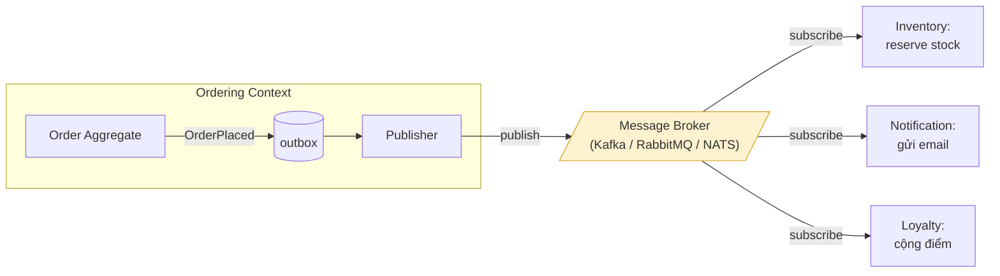
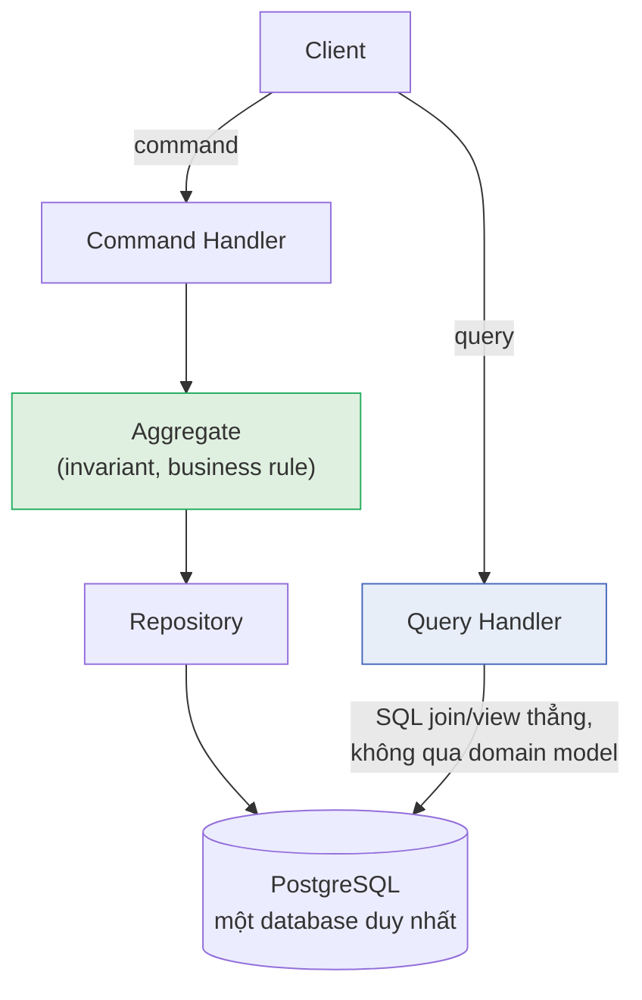
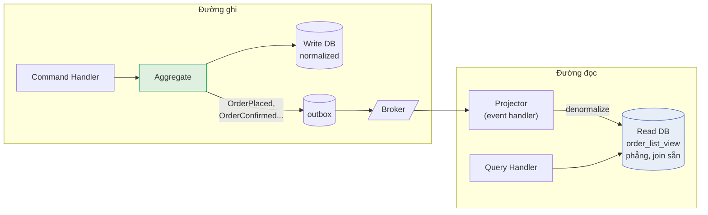
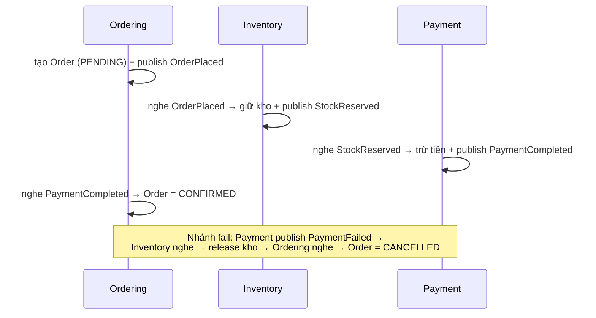
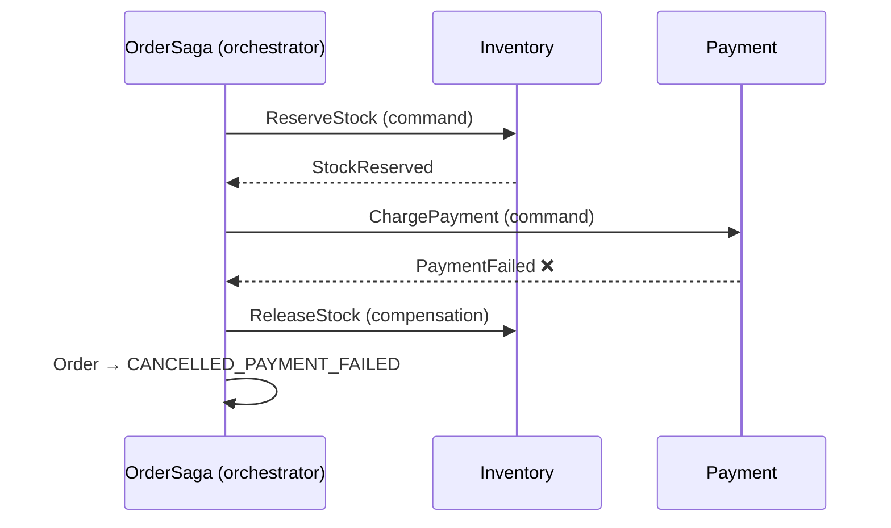
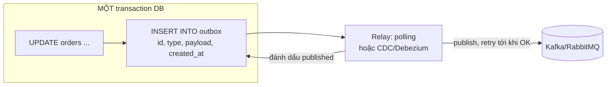

+++
title = "Chương 13: DDD và Distributed Systems"
date = "2026-07-09T20:00:00+07:00"
draft = false
tags = ["backend", "ddd", "architecture"]
series = ["Domain-Driven Design"]
+++

> **Vị trí trong lộ trình**: Chương 12 kết thúc ở ranh giới của một process — kiến trúc bảo vệ domain model bên trong một deployable. Chương này bước qua ranh giới đó. Ngay khi hệ thống của bạn có từ hai deployable trở lên (dù chỉ là API + worker, chưa cần tới microservices), một loạt định luật vật lý mới có hiệu lực: message có thể lặp, mất, đến trễ hoặc sai thứ tự; transaction không trải qua hai database; "lưu xong rồi publish" không còn là một hành động atomic. Đây là chương dài nhất của bộ tài liệu, vì đây là nơi phần lớn hệ thống production thật sự gãy — không phải ở chỗ model Entity hay Value Object, mà ở chỗ hai bounded context nói chuyện với nhau qua một đường mạng không đáng tin. Sau chương này là [14 - DDD trong Production](/series/domain-driven-design/14-ddd-trong-production/).

Trước khi vào từng pattern, cần nói thẳng một điều làm kim chỉ nam cho cả chương: **mọi pattern trong chương này đều là chi phí, không phải tính năng**. CQRS, Saga, Outbox, Event Sourcing — không cái nào làm hệ thống của bạn "xịn" hơn. Chúng là các khoản thuế bạn *buộc phải* trả khi quyết định phân tán hệ thống, và mức thuế tỷ lệ thuận với mức độ phân tán. Kỹ năng quan trọng nhất của architect ở đây không phải là biết dùng pattern, mà là biết **khi nào chưa phải trả** — giữ được bao nhiêu thứ trong một local transaction thì giữ.

---

## 13.1. Event-driven Architecture + DDD: khi các Bounded Context nói chuyện với nhau

### Problem Statement

Bắt đầu từ một tình huống production cụ thể. Hệ thống e-commerce có hai bounded context đã tách thành hai service: `Ordering` và `Inventory`. Khi khách đặt hàng, tồn kho phải được giữ chỗ (reserve). Phiên bản đầu tiên ai cũng viết:

```typescript
// Trong OrderService — gọi sync sang Inventory
async placeOrder(cmd: PlaceOrderCommand) {
  const order = Order.place(/* ... */);
  await this.orderRepo.save(order);
  await this.inventoryClient.reserve(order.id, order.lines); // HTTP call
}
```

Ba tháng sau, các sự cố lần lượt xuất hiện:

1. **Inventory deploy lúc 14h** → mọi request đặt hàng fail trong 90 giây, dù bản thân Ordering hoàn toàn khỏe. Availability của Ordering giờ bị *nhân* với availability của Inventory.
2. **Inventory chậm vì batch job** → p99 của đặt hàng nhảy từ 200ms lên 8 giây. Latency của bạn = tổng latency của mọi service bạn gọi sync.
3. **Save order thành công, gọi reserve thất bại vì timeout** — nhưng thực ra Inventory *đã* reserve xong, chỉ là response bị mất. Giờ hệ thống có một reservation mồ côi, và không ai biết.
4. Marketing muốn thêm tính năng "gửi email xác nhận" và "cộng điểm loyalty" khi đặt hàng. Mỗi tính năng mới = thêm một dòng gọi sync trong `placeOrder` = thêm một điểm chết, và `Ordering` giờ phải *biết* về Notification, Loyalty — những context chẳng liên quan gì đến việc đặt hàng.

Cả bốn vấn đề có chung một gốc: **coupling thời gian (temporal coupling)** — Ordering chỉ hoàn thành được việc của mình nếu tất cả các bên kia sống, nhanh, và trả lời đúng lúc đó.

### Tại sao event ra đời cho bài toán này

Nhìn lại nghiệp vụ bằng ngôn ngữ của domain expert: *"Khi đơn hàng được đặt, kho cần giữ chỗ hàng."* Câu này có cấu trúc **sự kiện → phản ứng**, không phải **mệnh lệnh**. Ordering không "ra lệnh" cho Inventory — nó chỉ tuyên bố một sự thật đã xảy ra: `OrderPlaced`. Việc ai phản ứng thế nào với sự thật đó là chuyện của họ. Domain event ([Chương 10](/series/domain-driven-design/10-domain-event/)) đã cho bạn khái niệm này *bên trong* một context; ở đây ta kéo nó *xuyên* context, qua một message broker.

### Bản chất

Đảo chiều sự phụ thuộc về mặt tri thức: thay vì **Ordering biết tất cả những ai cần phản ứng** (và gọi từng người), **những ai cần phản ứng tự biết mình quan tâm đến OrderPlaced**. Ordering chỉ còn một nhiệm vụ: publish sự thật, một lần, đáng tin cậy (đáng tin cậy đến đâu — mục 13.4 Outbox trả lời).



Bốn vấn đề ban đầu biến đổi thế nào:

- Inventory chết 90 giây → message nằm chờ trong broker, Inventory sống lại thì xử lý tiếp. Ordering không hề hấn.
- Inventory chậm → không ảnh hưởng latency đặt hàng; đặt hàng trả về ngay sau khi ghi order + outbox.
- Timeout mất response → không còn khái niệm response; thay vào đó là at-least-once delivery + idempotent consumer (mục 13.6).
- Thêm Loyalty → Loyalty tự subscribe, Ordering **không sửa một dòng code nào**.

Nhưng — và đây là chữ "nhưng" quan trọng nhất chương — bạn vừa đổi bốn vấn đề trên lấy một loạt vấn đề mới: kho có thể *chưa* được giữ chỗ tại thời điểm đơn hàng "đặt thành công" (eventual consistency — mục 13.7), message có thể được xử lý hai lần (mục 13.6), và nếu reserve *thất bại thật* (hết hàng) thì đơn đã đặt phải làm sao (Saga — mục 13.3). Event-driven không xóa độ phức tạp; nó **dời độ phức tạp từ lúc request sang lúc thiết kế**.

### Domain Event vs Integration Event — ranh giới bắt buộc phải vẽ

Sai lầm phổ biến và đắt nhất trong event-driven + DDD: **publish thẳng domain event nội bộ ra broker**. Hai loại event này khác nhau về bản chất, dù thường trùng tên:

| | Domain Event (nội bộ context) | Integration Event (giữa các context) |
|---|---|---|
| Người nghe | Code trong cùng bounded context | Context khác, team khác, có thể chưa tồn tại |
| Ngôn ngữ | Ubiquitous language của context, tham chiếu domain object thoải mái | Contract công khai — chỉ kiểu dữ liệu nguyên thủy, ID, số |
| Nhịp thay đổi | Đổi thoải mái khi refactor model | Đổi là breaking change, cần versioning, deprecation policy |
| Độ chi tiết | Giàu — phục vụ logic nội bộ | Tối thiểu đủ dùng — mỗi field thêm vào là cam kết bảo trì vĩnh viễn |
| Ví dụ | `OrderPlaced { order: Order }` (cả aggregate) | `ordering.order-placed.v1 { orderId, customerId, lines: [{sku, qty}], totalAmount, currency, occurredAt }` |

Vì sao phải tách? Vì **event schema chính là API**. Khi bạn publish domain event nội bộ ra broker, mọi field của aggregate trở thành contract công khai: sáu tháng sau bạn đổi tên field `totalAmount` → `grandTotal` trong lúc refactor domain model — và ba consumer của ba team khác chết cùng lúc, dù bạn "chỉ refactor nội bộ". Bạn đã vô tình biến domain model — thứ cần tự do tiến hóa nhất — thành thứ bị đóng băng bởi các team khác. Đây chính xác là mất mát mà bounded context sinh ra để tránh ([Chương 4](/series/domain-driven-design/04-bounded-context/)).

Cách làm đúng: domain event sinh ra trong aggregate → một translator ở tầng application/infrastructure của context map nó sang integration event (một class/struct riêng, version tường minh) → publish. Translator này chính là **Anti-Corruption Layer chiều đi** ([Chương 5](/series/domain-driven-design/05-context-mapping/)).

```typescript
// integration-events/order-placed.v1.ts — CONTRACT công khai, đóng băng có chủ đích
export class OrderPlacedV1 {
  static readonly type = 'ordering.order-placed.v1';
  constructor(
    public readonly eventId: string,        // UUID — phục vụ dedup (13.6)
    public readonly occurredAt: string,     // ISO-8601, luôn UTC
    public readonly orderId: string,
    public readonly customerId: string,
    public readonly lines: ReadonlyArray<{ sku: string; quantity: number }>,
    public readonly totalAmount: string,    // string cho tiền — tránh IEEE 754
    public readonly currency: string,
  ) {}
}

// application/order-placed.translator.ts
export function toIntegrationEvent(e: OrderPlacedDomainEvent): OrderPlacedV1 {
  return new OrderPlacedV1(
    randomUUID(),
    e.occurredAt.toISOString(),
    e.order.id.value,
    e.order.customerId.value,
    e.order.lines.map(l => ({ sku: l.sku.value, quantity: l.quantity })),
    e.order.total.amount.toString(),
    e.order.total.currency,
  );
}
```

### Coupling qua schema — sự thật ít người nói

Event-driven hay được quảng cáo là "decoupling". Chính xác hơn: nó gỡ **coupling thời gian** (không cần cùng sống) và **coupling tri thức chiều publish** (producer không biết consumer), nhưng **giữ nguyên coupling qua schema**: consumer vẫn phụ thuộc vào cấu trúc và *ngữ nghĩa* của event. `totalAmount` là trước hay sau giảm giá? Đơn vị của `quantity` là cái hay thùng? Hiểu sai ngữ nghĩa còn tệ hơn lỗi schema — schema sai thì crash ngay, ngữ nghĩa sai thì chạy êm và ra số sai trong báo cáo tài chính.

Production considerations cho schema:

- **Schema registry** (Confluent Schema Registry với Avro/Protobuf, hoặc tối thiểu là JSON Schema trong repo chung) + compatibility check trong CI. Quy tắc thực dụng: chỉ cho phép thay đổi **backward-compatible** — thêm field optional được, đổi tên/xóa field/đổi kiểu là không.
- **Version trong tên event** (`order-placed.v1`) cho breaking change: publish song song v1 + v2 một thời gian, theo dõi consumer lag của v1 về 0 rồi mới tắt. Quá trình này tính bằng quý, không bằng sprint — đó là cái giá thật của "sửa một event đã public".
- **Event là dữ liệu bất biến vĩnh viễn**: consumer mới có thể đọc lại event 2 năm tuổi (nếu retention dài / event sourcing). Mọi version từng publish phải parse được mãi mãi.

### Điểm mạnh / Điểm yếu / Khi nào KHÔNG dùng

**Mạnh**: gỡ temporal coupling — availability và latency của các context độc lập nhau; thêm consumer không sửa producer; broker hấp thụ spike (backpressure tự nhiên); event log là dấu vết nghiệp vụ quý giá cho debug và analytics.

**Yếu (nói thẳng)**: debug từ "đọc một stack trace" thành "lần theo correlation id qua 4 service và một broker"; eventual consistency lây lan sang UX và phải giải thích cho business (13.7); hạ tầng broker là hệ thống stateful phức tạp phải vận hành (Kafka không phải thứ "cài xong quên đi"); flow nghiệp vụ trở nên **vô hình** — không file code nào chứa toàn cảnh "đặt hàng thì chuyện gì xảy ra", nó nằm rải trong các subscription. Không có tài liệu hóa event flow (event catalog, hoặc tool như AsyncAPI), sau 2 năm không ai dám tắt một consumer vì không biết ai phụ thuộc nó.

**KHÔNG dùng khi**: (1) hai bên *thực sự* cần kết quả ngay trong request — kiểm tra hạn mức tín dụng trước khi cho vay không thể "eventual"; lúc đó gọi sync và chấp nhận coupling, đó là quyết định đúng chứ không phải thất bại; (2) toàn bộ các "context" đang nằm trong một monolith và một database — in-process event + local transaction rẻ và đủ, đừng dựng Kafka để hai module cách nhau một function call nói chuyện qua network; (3) team chưa có nền tảng observability — event-driven mù quan trắc là hệ thống không debug nổi.

---

## 13.2. CQRS: khi một model không thể phục vụ hai ông chủ

### Problem Statement

Vấn đề gốc của CQRS không phải performance — nó là **xung đột hình dạng model**. Nhìn hai yêu cầu này trong cùng hệ thống e-commerce:

**Yêu cầu ghi (command)**: "Xác nhận đơn hàng — nhưng chỉ khi đơn ở trạng thái hợp lệ, tổng tiền khớp, và đơn > 50 triệu phải qua duyệt." Model tối ưu cho việc này là **aggregate nhỏ, đóng gói chặt** ([Chương 7](/series/domain-driven-design/07-aggregate/)): load đúng một `Order` với các dòng hàng của nó, chạy invariant, ghi lại. Càng ít dữ liệu càng tốt — mỗi field thừa là surface cho race condition và lock contention.

**Yêu cầu đọc (query)**: "Màn hình quản trị: danh sách đơn hàng kèm *tên khách hàng, hạng thành viên, tên sản phẩm, trạng thái giao vận từ đối tác, tổng chi tiêu 12 tháng của khách* — filter theo 8 tiêu chí, sort, phân trang." Model tối ưu cho việc này là **bảng phẳng denormalized** join sẵn từ 6 nguồn — thứ chẳng liên quan gì đến ranh giới aggregate, thậm chí vắt ngang nhiều bounded context.

Ép một model phục vụ cả hai, bạn sẽ làm hỏng cả hai — và đây là quá trình tôi đã thấy diễn ra ở nhiều codebase:

- Đường đọc ép qua aggregate: load 500 aggregate + N+1 query để render một trang danh sách; hoặc tệ hơn, aggregate bắt đầu **phình ra vì nhu cầu hiển thị** — thêm `customerName`, `productThumbnail` vào `Order` "cho tiện màn hình list". Aggregate giờ to, invariant loãng, lock contention tăng.
- Repository mọc method kiểu `findForAdminScreenV2WithCustomerAndShipping(...)` — mỗi màn hình một method, interface repository thành bãi rác query.

### Bản chất

CQRS (Command Query Responsibility Segregation) chỉ nói một câu: **đường ghi và đường đọc được phép dùng model khác nhau**. Hết. Nó không nói gì về Event Sourcing, không bắt buộc hai database, không bắt buộc message broker. Nó là sự thừa nhận rằng "một model duy nhất cho mọi việc" — di sản của thời CRUD — là một ràng buộc tự áp đặt, và với domain phức tạp, ràng buộc đó đắt hơn lợi ích.

Điều quan trọng nhất: **CQRS là một dải quang phổ, không phải công tắc bật/tắt**. Chọn mức thấp nhất đủ dùng:

### Mức 1 — Tách code path, chung database (đa số hệ thống chỉ cần đến đây)

Command đi qua aggregate + repository như mọi khi. Query **bỏ qua toàn bộ domain model**, đi thẳng xuống SQL/view, trả về DTO phẳng:



```typescript
// application/query/get-order-list.handler.ts — KHÔNG đụng domain model
@Injectable()
export class GetOrderListHandler {
  constructor(@InjectDataSource() private readonly ds: DataSource) {}

  async execute(q: GetOrderListQuery): Promise<Paginated<OrderListItemDto>> {
    // Join thoải mái, vắt ngang "ranh giới aggregate" — hợp pháp vì chỉ ĐỌC.
    // Đọc không cần invariant; invariant chỉ tồn tại để bảo vệ thay đổi.
    const rows = await this.ds.query(
      `SELECT o.id, o.status, o.total_amount,
              c.full_name AS customer_name, c.tier AS customer_tier,
              s.carrier_status
       FROM ordering.orders o
       JOIN crm.customers_view c ON c.id = o.customer_id
       LEFT JOIN shipping.shipments_view s ON s.order_id = o.id
       WHERE ($1::text IS NULL OR o.status = $1)
       ORDER BY o.placed_at DESC
       LIMIT $2 OFFSET $3`,
      [q.status ?? null, q.pageSize, q.offset],
    );
    return paginate(rows, q);
  }
}
```

Chi phí mức này gần bằng **không** (bớt code là đằng khác — không phải nhồi query vào repository), và nó giải phóng aggregate khỏi áp lực hiển thị. Trong Go, tương tự: package `app` có `PlaceOrderHandler` đi qua domain, và `GetOrderListHandler` cầm thẳng `*pgxpool.Pool`. Lưu ý duy nhất: query handler chỉ được **SELECT** — một dòng UPDATE trong query handler là vi phạm kỷ luật nghiêm trọng, vì nó lách qua mọi invariant.

### Mức 2 — Read model riêng, cập nhật qua projection từ event

Khi nào mức 1 hết đủ? Khi (a) query join quá đắt ở scale hiện tại (màn hình dashboard join 8 bảng, chạy 3 giây), (b) dữ liệu cần đọc vắt ngang nhiều **service** (không còn chung DB để join), hoặc (c) tỷ lệ đọc/ghi lệch đến mức cần scale hai chiều độc lập (1000 đọc : 1 ghi). Lúc đó: dựng read model riêng (bảng denormalized, Elasticsearch, Redis...), cập nhật bởi **projector** subscribe event:



```go
// internal/ordering/readmodel/order_list_projector.go
// Projector: nhận event, ghi bảng đọc phẳng. Không business rule — chỉ reshape dữ liệu.
func (p *OrderListProjector) OnOrderPlaced(ctx context.Context, e OrderPlacedV1) error {
	// Idempotent bằng upsert theo order_id — replay event không tạo dòng đôi (xem 13.6)
	_, err := p.db.Exec(ctx, `
		INSERT INTO order_list_view (order_id, customer_id, customer_name, status, total_amount, placed_at)
		VALUES ($1, $2, $3, 'PLACED', $4, $5)
		ON CONFLICT (order_id) DO UPDATE SET
			status = EXCLUDED.status, total_amount = EXCLUDED.total_amount`,
		e.OrderID, e.CustomerID, p.customerName(ctx, e.CustomerID), e.TotalAmount, e.OccurredAt)
	return err
}
```

Cái giá của mức 2 — kê đủ, đừng để ai nói "chỉ là thêm một consumer":

1. **Staleness**: read model trễ sau write, từ mili giây đến (khi sự cố) hàng giờ. UX phải thiết kế cho điều này: user bấm "Xác nhận đơn" xong quay lại danh sách — đơn vẫn hiện "chờ xác nhận"? Các kỹ thuật vá: optimistic UI, đọc-của-chính-mình (read-your-writes: sau command, đọc từ write model cho riêng user đó), hiện "đang cập nhật…". Không kỹ thuật nào miễn phí.
2. **Rebuild**: projector có bug → read model sai → phải replay toàn bộ event để build lại. Bạn cần quy trình rebuild (chạy projector version mới song song vào bảng mới, so khớp, swap) — thứ phải viết và diễn tập *trước khi* cần đến.
3. **Monitoring bắt buộc**: projection lag là metric hạng nhất, có alert. Read model chết âm thầm là loại sự cố tồi tệ nhất — hệ thống "vẫn chạy", chỉ là số liệu sai dần.
4. **Mỗi read model là một consumer phải quản lý vòng đời**: schema riêng, migration riêng, versioning theo event.

### CQRS KHÔNG bắt buộc kèm Event Sourcing

Phải nói riêng một mục vì ngộ nhận này gây thiệt hại thật. CQRS và Event Sourcing (13.5) hay được dạy chung một bài, dẫn đến niềm tin "làm CQRS là phải lưu event thay vì state". Sai. Quan hệ thật:

- CQRS mức 1 và 2 hoạt động hoàn hảo với write model lưu **state bình thường** trong Postgres. Event cho projection lấy từ outbox (13.4) hoặc CDC.
- Chiều ngược lại mới gần đúng: đã Event Sourcing thì gần như *bắt buộc* CQRS (vì query trực tiếp trên event log rất bất tiện).
- Kết luận thực dụng: **CQRS mức 1: dùng rộng rãi, gần như free. CQRS mức 2: dùng khi có lý do đo đếm được. Event Sourcing: một quyết định hoàn toàn riêng, ngưỡng cao hơn nhiều** (13.5).

### Anti-patterns của CQRS

- **Command handler trả về dữ liệu màn hình**: command trả về `OrderDetailDto` join sẵn mọi thứ "cho tiện FE" — đường ghi lại gánh nhu cầu đọc, tách làm gì nữa. Command trả về ID + kết quả (hoặc void); FE query sau.
- **CQRS toàn hệ thống như tôn giáo**: mọi module, kể cả CRUD danh mục 3 bảng, đều đủ lễ bộ CommandBus/QueryBus/Handler/DTO ba tầng. Module `country` có `CreateCountryCommand`, `CreateCountryHandler`, `CountryCreatedEvent`... để làm cái việc INSERT một dòng. Chi phí đọc-hiểu code tăng gấp ba, lợi ích bằng không. CQRS áp cho **từng bounded context** có nhu cầu, không phải cho cả codebase.
- **Query handler gọi command** hoặc chứa side effect — phá vỡ tính chất "gọi query bao nhiêu lần cũng vô hại", thứ mà mọi tầng cache/retry phía trên đang ngầm dựa vào.
- **Một "read model" nhưng ghi tay từ hai nơi**: vừa projector cập nhật, vừa có chỗ UPDATE thẳng vào bảng view "cho nhanh" — read model giờ không rebuild được nữa vì không còn là hàm thuần của event stream.

---

## 13.3. Saga / Process Manager: transaction nghiệp vụ dài hơn một aggregate

### Problem Statement

"Đặt hàng" ở quy mô phân tán là bốn việc trên bốn context/service: tạo đơn (Ordering) → giữ kho (Inventory) → trừ tiền (Payment) → tạo vận đơn (Shipping). Không còn database chung, không còn `BEGIN...COMMIT` bao trùm. Bước 3 fail thì bước 1, 2 đã commit rồi — kho bị giữ vô chủ, đơn treo mãi ở `PENDING`. Không giải quyết: tồn kho ảo tăng dần, tiền và hàng lệch nhau, và đội vận hành đối soát tay mỗi tuần — chi phí vận hành ăn hết lợi ích của việc tách service.

### Bản chất

Saga là **transaction nghiệp vụ được viết lại thành chuỗi transaction cục bộ + các hành động đền bù (compensation)**. Cam kết của nó khác ACID: không phải "tất cả hoặc không gì" tức thời, mà là "**cuối cùng, hoặc tất cả đã xong, hoặc mọi bước đã làm đều được hoàn tác**" (atomicity kéo giãn theo thời gian, không có isolation). Compensation không phải rollback kỹ thuật — nó là **nghiệp vụ ngược** có thật: hủy giữ kho, hoàn tiền, hủy vận đơn. Điều này dẫn tới hệ quả quan trọng nhất mà người ta hay bỏ qua: *thiết kế saga là việc của domain modeling, không phải của hạ tầng* — phải hỏi domain expert "trừ tiền rồi mà hết hàng thì làm gì? hoàn tiền hay giữ credit? khách được thông báo thế nào?" — từng nhánh thất bại là một quyết định nghiệp vụ.

### Hai kiểu điều phối: Choreography vs Orchestration

**Choreography** — không ai chỉ huy, các context phản ứng dây chuyền qua event:



**Orchestration** — một Process Manager cầm state machine, ra lệnh từng bước:



Trade-off thẳng thắn: **choreography** rẻ khởi đầu, không thêm thành phần, decoupling đẹp — nhưng luồng nghiệp vụ *tàng hình*: không file nào mô tả toàn cảnh, thêm bước là sửa nhiều consumer, và trả lời "saga của đơn #123 đang ở đâu?" đòi hỏi lần theo log của bốn service. **Orchestration** thêm một thành phần phải nuôi (saga có state, cần persist, cần chính nó cũng crash-safe) — đổi lại luồng nghiệp vụ nằm ở *một chỗ đọc được*, trạng thái từng saga query được, thêm bước sửa một nơi. Quy tắc kinh nghiệm: **≤ 3 bước và luồng ổn định → choreography; ≥ 4 bước, có nhánh phức, cần theo dõi vận hành → orchestration**. Và một saga orchestrator thuộc về context *sở hữu quy trình* (OrderSaga thuộc Ordering) — không phải một "saga service" trung tâm điều phối mọi thứ (đó là ESB tái sinh).

### Những thứ saga KHÔNG cho bạn — và cách bù

Saga không có isolation: giữa các bước, thế giới nhìn thấy trạng thái trung gian (kho đã giữ, đơn chưa confirm). Hệ quả phải thiết kế: (1) **trạng thái trung gian là trạng thái nghiệp vụ hợp lệ, có tên** — `AWAITING_PAYMENT`, không phải "inconsistent"; (2) **semantic lock** — hàng đã giữ thì người khác không đặt được, chính reservation là khóa; (3) **timeout cho mọi bước chờ** — Payment không trả lời sau 15 phút thì saga phải tự quyết (retry/hủy), không treo vĩnh viễn; (4) **mọi bước và mọi compensation phải idempotent** (13.6) vì lệnh có thể được giao lại.

### Anti-patterns của Saga

- **Saga không có compensation** — vẽ happy path, nhánh fail "để sau": chính là hệ thống treo đơn ở problem statement, chỉ khác là giờ có thêm Kafka.
- **Compensation không thể fail được cũng... fail** — hoàn tiền lỗi thì làm gì? Cần retry + DLQ + cảnh báo cho người: tầng cuối của mọi saga là quy trình vận hành có con người.
- **Saga xuyên context của team khác bằng command** — ra lệnh `ReserveStock` cho team khác là coupling kiểu ông chủ; hợp đồng đúng giữa các team ngang hàng thường là event + phản ứng (choreography ở biên team, orchestration bên trong team).
- **Dùng saga khi một aggregate là đủ** — hai bước cùng database, cùng context: gộp aggregate hoặc dùng một transaction. Saga là thuế của phân tán; đừng đóng thuế khi chưa phân tán.

---

## 13.4. Outbox Pattern: giải bài toán dual-write

### Problem Statement — dual-write là gì và vì sao mọi hệ event đều đâm vào nó

Use case ghi của bạn kết thúc bằng hai việc: commit vào database và publish event lên broker. Hai hệ thống khác nhau, **không có transaction chung**. Thứ tự nào cũng có kịch bản chết: commit DB trước, publish sau → process chết giữa chừng, event mất, kho không bao giờ biết có đơn (bug âm thầm, chỉ lộ khi đối soát); publish trước, commit sau → DB rollback, event "ma" đã bay đi, kho giữ hàng cho đơn không tồn tại. Retry không cứu được — đây là bài toán nguyên tử, không phải bài toán độ bền.

### Bản chất và cách hoạt động

Outbox biến hai-lần-ghi thành **một-lần-ghi**: event được INSERT vào bảng `outbox` **trong cùng transaction** với aggregate — atomicity mượn của chính database. Một tiến trình relay sau đó đọc outbox và publish, retry đến khi thành công, đánh dấu đã gửi.



```go
// Relay kiểu polling — đủ dùng cho đa số hệ thống trước ngưỡng chục nghìn event/giây
func (r *Relay) Tick(ctx context.Context) error {
    rows, err := r.db.QueryContext(ctx, `
        SELECT id, event_type, payload FROM outbox
        WHERE published_at IS NULL
        ORDER BY id
        LIMIT 100
        FOR UPDATE SKIP LOCKED`) // nhiều relay instance không giẫm nhau
    if err != nil { return err }
    for rows.Next() {
        var e OutboxRow
        rows.Scan(&e.ID, &e.Type, &e.Payload)
        if err := r.broker.Publish(ctx, e.Type, e.Payload); err != nil {
            return err // dừng batch — lần tick sau thử lại, KHÔNG mất event
        }
        r.db.ExecContext(ctx, `UPDATE outbox SET published_at = now() WHERE id = $1`, e.ID)
    }
    return rows.Err()
}
```

Hai cách chạy relay: **polling** (như trên — đơn giản, thêm độ trễ ~giây, thêm tải đọc DB) và **CDC** (Debezium đọc WAL của Postgres/MySQL và đẩy thẳng row outbox lên Kafka — độ trễ thấp, không tải query, đổi lại vận hành thêm một hệ Kafka Connect + hiểu biết về WAL). Bắt đầu bằng polling; lên CDC khi độ trễ giây hoặc tải polling thành vấn đề đo được.

Hệ quả cần khắc: outbox cho bạn **at-least-once** — relay có thể publish xong nhưng chết trước khi đánh dấu, event đi hai lần. Không có at-most-once lẫn exactly-once đầu-cuối với chi phí hợp lý; lời giải nằm ở **phía consumer idempotent** (13.6). Outbox + consumer idempotent = effectively-once — cặp pattern này đi với nhau như ổ khóa và chìa.

### Khi nào KHÔNG cần outbox

Event chỉ-tiện-ích mà mất cũng không ai đối soát (analytics best-effort, cache warm-up) — publish thẳng sau commit là đủ, outbox là nghi lễ. Ngưỡng cần outbox: event mà việc **mất nó tạo ra lệch nghiệp vụ giữa hai context** (đơn có mà kho không biết). Kiểm tra bằng câu hỏi: "event này mất, ai mất tiền / ai phải đối soát tay?" — có người → outbox.

---

## 13.5. Event Sourcing: lưu lịch sử thay vì lưu hiện tại

### Problem Statement — khi "hiện tại" không đủ để trả lời câu hỏi nghiệp vụ

Ngân hàng số nhận yêu cầu từ kiểm toán: "số dư tài khoản này ngày 15/3 là bao nhiêu, và chuỗi giao dịch nào dẫn tới con số đó?" Hệ thống lưu state (`balance = 5.230.000`) không trả lời được — UPDATE đã nghiền nát lịch sử. Team vá bằng bảng audit log ghi tay... và audit log ghi tay thì thiếu chỗ này sót chỗ kia, vì nó là *phụ phẩm* chứ không phải *nguồn sự thật*. Cùng họ vấn đề: tranh chấp với khách ("tôi đã hủy trước hạn!"), phân tích hành vi ("khách bỏ giỏ ở bước nào?"), sửa bug dữ liệu ("rule tính phí sai suốt 2 tuần — tính lại toàn bộ").

### Bản chất

Event Sourcing đảo ngược vai trò: **chuỗi event bất biến là nguồn sự thật; state chỉ là cache suy diễn**. `Account` không có cột `balance` — nó có stream `AccountOpened, MoneyDeposited(2tr), MoneyWithdrawn(500k)...`; số dư = kết quả replay stream. Lưu ý phân biệt tinh tế: đây là bước nhảy xa hơn hẳn domain event (chương 10) — ở đó event là *thông báo phụ* bên cạnh state; ở đây event **là** dữ liệu, xóa event tức là xóa sự thật.

Đổi lại bạn nhận được: audit hoàn hảo miễn phí (nguồn sự thật *chính là* audit log), truy vấn thời gian ("state tại thời điểm T" = replay tới T), sửa lỗi quá khứ bằng replay với logic đã vá, và khả năng mọc read model mới từ dữ liệu lịch sử ("giá như ta đã track X từ đầu" — với event sourcing, bạn *đã* track).

### Chi phí thật — phần các bài blog ít nói

- **Schema của event là mãi mãi**: state-based đổi schema thì migrate bảng một lần; event-sourced thì event 3 năm trước vẫn phải đọc được hôm nay → upcaster/versioning cho *từng* event type, vĩnh viễn. Đây là gánh nặng lớn nhất, và nó tăng theo tuổi hệ thống.
- **Replay dài → cần snapshot**: tài khoản 500k event không thể replay mỗi lần load → snapshot định kỳ + replay phần đuôi — thêm một tầng cơ chế phải xây và nuôi.
- **Query khó → gần như bắt buộc CQRS**: "tìm mọi tài khoản số dư > X" không chạy được trên event log → projection ra read model, ăn trọn chi phí CQRS mức 2.
- **Học phí team cao nhất trong chương này**: tư duy đảo ngược, debug lạ (state sai = tìm event sai *hoặc* logic replay sai), xóa dữ liệu theo GDPR trên log bất biến là bài toán riêng (crypto-shredding).
- **Không thể "thử một chút"**: chuyển một aggregate sang event sourcing là đổi toàn bộ tầng persistence của nó — quyết định khó đảo ngược bậc nhất trong tài liệu này.

### Quyết định

Dùng cho **từng aggregate/context** (không phải toàn hệ thống) khi lịch sử LÀ nghiệp vụ: sổ cái tài chính, hồ sơ pháp lý, quy trình duyệt nhiều bước cần tái hiện, hệ thống tính phí phức tạp hay bị chất vấn. **Không dùng** khi nhu cầu thật chỉ là audit — bảng audit + outbox rẻ hơn mười lần; càng không dùng cho CRUD ("CustomerAddressChanged event cho form sửa địa chỉ" là ví dụ SAI kinh điển — chi phí event sourcing, giá trị của một cột `updated_at`). Đa số hệ thống, kể cả hệ thống lớn tử tế, **không cần event sourcing** — và một ledger bất biến kiểu double-entry (chương 15a, FinTech) cho bạn 70% lợi ích audit với 20% chi phí.

---

## 13.6. Idempotency: thuế bắt buộc của at-least-once

### Problem Statement

Chuỗi đã xây ở trên — outbox at-least-once, broker redeliver khi consumer chậm ack, saga retry khi timeout — tất cả hội tụ về một sự thật: **mọi message đều có thể đến ≥ 2 lần**. Consumer ngây thơ `balance += amount` nhận `MoneyDeposited` hai lần là cộng tiền hai lần. Đây không phải edge case hiếm: deploy lại consumer, rebalance partition, một lần GC pause quá ack-timeout — duplicate xảy ra *hàng ngày* ở quy mô vừa.

### Bản chất và các tầng giải pháp

Idempotent = xử lý N lần cho kết quả như 1 lần. Ba tầng, từ rẻ đến đắt:

1. **Idempotent tự nhiên** — thao tác dạng gán tuyệt đối: `status = SHIPPED`, `SET email = x`. Chạy lại vô hại. Khi thiết kế được event/command theo dạng này (nói "trạng thái đích" thay vì "thay đổi tương đối") thì ưu tiên — miễn phí.
2. **Khóa dựa trên nghiệp vụ** — dùng chính ràng buộc domain: mỗi `(orderId)` chỉ có một Shipment → `UNIQUE(order_id)`, insert lần hai vỡ constraint → bỏ qua. Rẻ, bền, không cần bảng phụ. Luôn tìm tầng này trước khi sang tầng 3.
3. **Dedup theo message-id** — bảng `processed_messages(message_id PK)`; ghi id **trong cùng transaction** với hiệu ứng nghiệp vụ:

```go
func (c *DepositConsumer) Handle(ctx context.Context, msg Message) error {
    return c.db.RunInTx(ctx, func(tx *sql.Tx) error {
        _, err := tx.ExecContext(ctx,
            `INSERT INTO processed_messages (message_id) VALUES ($1)`, msg.ID)
        if isUniqueViolation(err) {
            return nil // đã xử lý rồi — lần giao thứ hai, bỏ qua êm ái
        }
        if err != nil { return err }
        return c.applyDeposit(ctx, tx, msg) // hiệu ứng + dấu vết: MỘT transaction
    })
}
```

Chi tiết sống còn: dedup-check và hiệu ứng nghiệp vụ phải **nguyên tử**. Check bằng Redis rồi ghi DB là hai bước — chết giữa hai bước là message được đánh dấu "đã xử lý" mà chưa xử lý (mất) hoặc ngược lại (đúp). Cùng logic đó, phía API công khai: client gửi `Idempotency-Key`, server lưu key + response trong transaction của hiệu ứng — retry của client nhận lại đúng response cũ (mẫu Stripe).

Vận hành: bảng dedup cần TTL dọn định kỳ (giữ bằng ~2× retention của broker); và nhớ rằng **duplicate còn có dạng nghiệp vụ** — user bấm "Thanh toán" hai lần là hai *command khác message-id* nhưng cùng ý định; chống nó bằng khóa nghiệp vụ (tầng 2: một order chỉ một charge đang bay), không phải bằng dedup message.

---

## 13.7. Distributed Transaction: vì sao 2PC chết, và cách nói chuyện với business về eventual consistency

### 2PC — lời hứa không giữ được ở quy mô

Two-Phase Commit từng là câu trả lời sách vở: coordinator hỏi mọi participant "chuẩn bị xong chưa?", tất cả OK thì "commit!". Nó chết trong kiến trúc microservices hiện đại vì bốn án: (1) **blocking** — giữa prepare và commit, mọi participant giữ lock ngồi chờ; coordinator chết là tất cả ôm lock chờ vô hạn — một điểm chết kéo sập cả chuỗi; (2) throughput toàn chuỗi = throughput của kẻ chậm nhất, nhân với thời gian giữ lock gấp nhiều lần transaction thường; (3) hệ sinh thái hiện đại **không tham gia**: Kafka, Redis, Mongo, mọi HTTP API — không có XA; (4) availability: transaction xuyên N service sống chỉ khi *cả N* sống — nhân xác suất chết lên theo N, đi ngược chính lý do tách service. Kết luận ngành đã chốt từ lâu: trong microservices, transaction phân tán kiểu khóa chặt là ngõ cụt; **saga + outbox + idempotency** (13.3–13.6) là bộ thay thế.

### Eventual consistency là trade-off phải trình bày được với business

Sai lầm của kỹ sư là trình bày nó như giới hạn kỹ thuật ("CAP theorem nên chịu thôi anh ạ"). Trình bày đúng là bằng **tiền và rủi ro**:

> "Phương án A: mọi thứ nhất quán tức thời — được, nhưng đặt hàng sẽ chậm hơn (chờ 4 hệ thống), flash sale sập khi một hệ chậm, và chi phí hạ tầng gấp ba. Phương án B: đơn xác nhận ngay, kho và điểm thưởng cập nhật sau tối đa vài giây; đổi lại có xác suất nhỏ đơn bị hủy sau xác nhận vì hết hàng thật — ta xử lý bằng hoàn tiền tự động + voucher xin lỗi. Ngành này (Shopee, Tiki, Amazon) đều chọn B. Chị chọn phương án nào?"

Domain expert quyết được câu này — và đó chính là điểm chương [07](/series/domain-driven-design/07-aggregate/) đã đặt nền: *ranh giới nhất quán là quyết định nghiệp vụ*. Việc của kiến trúc sư là (1) tìm ra chỗ **thật sự** cần strong consistency (thường ít hơn dev tưởng: trong một aggregate, trong một ledger) và trả giá ở đúng chỗ đó; (2) mọi chỗ còn lại thiết kế eventual **có kỷ luật**: trạng thái trung gian có tên, compensation có chủ, thời gian hội tụ có SLO và có dashboard đo (staleness của projection, lag của consumer, tuổi của saga treo).

---

## 13.8. Tổng kết chương — bộ pattern là một dây chuyền, không phải thực đơn gọi món

Chuỗi lập luận của cả chương gói trong một đoạn: tách bounded context thành service → mất transaction chung → giao tiếp bằng **integration event** (13.1) → phát event an toàn cần **outbox** (13.4) → outbox chỉ cho at-least-once nên consumer phải **idempotent** (13.6) → quy trình nhiều bước cần **saga + compensation** (13.3) → nhu cầu đọc tách khỏi write model bằng **CQRS** (13.2) → và ở một vài chỗ lịch sử-là-nghiệp-vụ, cân nhắc **event sourcing** (13.5). Mỗi mắt xích tồn tại để vá hệ quả của mắt xích trước — **nếu bạn chưa tách service, phần lớn dây chuyền này là chi phí không cần trả**. Đó là lý do chương [12](/series/domain-driven-design/12-ddd-va-kien-truc/) khuyên modular monolith trước, và chương [14](/series/domain-driven-design/14-ddd-trong-production/) sẽ bàn *khi nào* mới đáng bước vào thế giới này.

## Đọc tiếp

Toàn bộ lý thuyết đã đủ. Phần còn lại là thứ khó nhất: đưa nó vào một tổ chức thật, với legacy thật và con người thật — [Chương 14 — DDD trong Production](/series/domain-driven-design/14-ddd-trong-production/).

- Quay lại: [12 — DDD và Kiến trúc](/series/domain-driven-design/12-ddd-va-kien-truc/) · [Mục lục](/series/domain-driven-design/00-muc-luc/)
- Liên quan: [07 — Aggregate](/series/domain-driven-design/07-aggregate/) (ranh giới nhất quán) · [10 — Domain Event](/series/domain-driven-design/10-domain-event/) (nền của mọi pattern ở đây)
