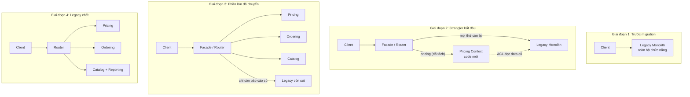
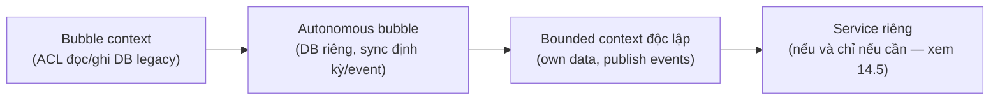
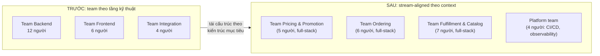
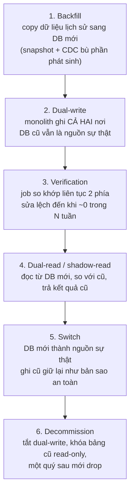

+++
title = "Chương 14: DDD trong Production — Refactoring, Adoption, Tổ chức Team và Vận hành Dài hạn"
date = "2026-07-09T21:00:00+07:00"
draft = false
tags = ["backend", "ddd", "architecture"]
series = ["Domain-Driven Design"]
+++

> **Vị trí chương này trong tài liệu:** Sau khi đã nắm toàn bộ tactical patterns (chương 06–11), kiến trúc (chương 12) và distributed systems (chương 13), chương này trả lời câu hỏi thực tế nhất: *làm sao đưa DDD vào một hệ thống đang chạy, đang có khách hàng, đang có team, đang có deadline?* Đây là chương dành cho những người phải sống với hệ quả của quyết định kiến trúc — không phải trên slide, mà trong production lúc 2 giờ sáng. Chương tiếp theo ([15a](/series/domain-driven-design/15a-case-study-ecommerce-fintech-banking-logistics/)) sẽ áp dụng toàn bộ những gì bàn ở đây vào các case study cụ thể.

---

## Mở đầu: DDD trên giấy vs DDD trong production

Hầu hết tài liệu DDD — kể cả sách của Evans và Vernon — mô tả DDD như thể bạn đang bắt đầu từ tờ giấy trắng: có domain expert ngồi cạnh, có thời gian làm event storming, có quyền thiết kế mọi thứ từ đầu.

Thực tế của 95% engineer là ngược lại:

- Hệ thống **đã tồn tại**, thường là một monolith 5–10 năm tuổi, viết bằng PHP/Java/Ruby, không test, không tài liệu.
- Business **không dừng lại** chờ bạn refactor. Mỗi sprint vẫn phải ship feature.
- Team **không đồng đều**: 2 người hiểu DDD, 8 người chưa từng nghe, 3 người phản đối vì "phức tạp hóa vấn đề".
- Ngân sách refactor **không tồn tại** như một dòng riêng — nó phải được giấu vào (hoặc thương lượng cùng) roadmap sản phẩm.

Nguyên tắc first-principles của toàn chương này:

> **DDD trong production là một bài toán kinh tế và tổ chức, không phải bài toán kỹ thuật.** Kỹ thuật (strangler fig, ACL, event versioning) chỉ là công cụ để trả góp một khoản nợ mà không làm doanh nghiệp phá sản giữa chừng.

Nếu bạn chỉ nhớ một điều từ chương này, hãy nhớ: **mọi bước refactor phải tự trả tiền cho chính nó** — hoặc bằng feature ship nhanh hơn, hoặc bằng bug giảm đi, hoặc bằng khả năng tuyển người dễ hơn. Refactor "cho đẹp" không sống sót qua hai quý.

---

## 14.1 Refactoring Legacy System sang DDD

### 14.1.1 Vì sao KHÔNG BAO GIỜ big-bang rewrite

Trước khi nói làm gì, phải nói rõ **không làm gì**: viết lại toàn bộ hệ thống từ đầu (big-bang rewrite) là quyết định giết chết nhiều công ty hơn bất kỳ bug nào.

Lý do từ first principles:

1. **Legacy code là đặc tả duy nhất còn đúng.** Hệ thống 8 năm tuổi chứa 8 năm quyết định business: khuyến mãi tính thế nào khi khách trả một phần bằng điểm, thuế làm tròn ra sao, đơn hàng hủy giữa chừng thì hoàn kho thế nào. Những quyết định đó **không nằm trong tài liệu, không nằm trong đầu ai** — chỉ nằm trong code. Rewrite nghĩa là vứt bản đặc tả duy nhất và tự tin mình sẽ nhớ lại được mọi thứ. Bạn sẽ không nhớ.
2. **Hai hệ thống chạy song song = chi phí gấp ba.** Trong thời gian rewrite (luôn lâu hơn dự kiến 2–3 lần), team phải: (a) maintain hệ cũ, (b) build hệ mới, (c) đồng bộ mọi feature mới vào cả hai. Feature freeze thì business chết; không freeze thì rewrite đuổi theo mục tiêu di động — không bao giờ bắt kịp.
3. **Second-system effect.** Hệ mới được nhồi mọi ước mơ bị dồn nén: "lần này làm microservices luôn", "lần này event sourcing luôn", "lần này viết bằng Rust". Kết quả là hệ mới phức tạp hơn hệ cũ trước cả khi có user đầu tiên.
4. **Không có điểm rollback.** Big-bang có đúng một ngày go-live. Nếu ngày đó lộ ra sai lệch nghiệp vụ (chắc chắn có), bạn không có đường lùi từng phần — chỉ có rollback toàn bộ hoặc chữa cháy trong production.

**Ví dụ thất bại thật (mô thức lặp lại ở rất nhiều công ty):** một công ty ecommerce Việt Nam quy mô trung bình quyết định rewrite monolith PHP 7 năm tuổi sang "microservices chuẩn DDD" bằng Java. Kế hoạch 9 tháng. Sau 18 tháng: hệ mới cover được ~60% nghiệp vụ, hệ cũ vẫn phải nhận feature mới vì mùa sale không chờ ai, hai team maintain hai codebase bắt đầu drift về logic khuyến mãi. Tháng thứ 20, CTO mới về, hủy dự án, quay lại monolith. Chi phí: 18 tháng của 12 engineer, cộng cơ hội thị trường bị mất. **Bài học không phải là "DDD sai" — mà là big-bang sai.** Cùng đích đến đó, đi bằng strangler fig thì mỗi tháng đều có thứ chạy được trong production.

### 14.1.2 Strangler Fig — chiến lược nền tảng

Strangler fig (cây đa bóp nghẹt — Martin Fowler đặt tên theo loài cây mọc quanh cây chủ, lớn dần rồi thay thế cây chủ) là chiến lược duy nhất tôi từng thấy hoạt động ổn định cho migration hệ thống lớn:

1. **Đặt một lớp điều phối (facade/router) trước hệ cũ** — có thể là API gateway, reverse proxy, hoặc chỉ là một lớp routing trong code.
2. **Xây phần mới bên cạnh hệ cũ**, từng lát chức năng một (theo bounded context, không theo tầng kỹ thuật).
3. **Chuyển traffic từng lát** từ cũ sang mới. Hệ cũ và mới chạy song song, nhưng mỗi *chức năng* chỉ có một chủ sở hữu tại một thời điểm.
4. **Xóa dần code cũ** khi lát tương ứng đã ổn định. Bước này hay bị quên — không xóa thì bạn có hai hệ thống vĩnh viễn.



**Tại sao strangler fig thắng big-bang?**

- Mỗi lát chuyển xong là **giá trị đã vào production** — có rollback point, có feedback thật.
- Rủi ro được chia nhỏ: sai một lát thì route ngược lại lát đó về hệ cũ, không phải rollback cả năm công sức.
- Team học dần domain qua từng lát, thay vì phải hiểu đúng toàn bộ ngay từ đầu.

**Đánh đổi (phải nói thật):**

- Tổng thời gian dài hơn rewrite lý thuyết (nhưng ngắn hơn rewrite thực tế).
- Phải maintain lớp facade và các cầu nối tạm (ACL, sync data) — đây là **nợ có chủ đích**, phải có kế hoạch trả.
- Có giai đoạn dữ liệu tồn tại ở hai nơi → cần kỷ luật về nguồn sự thật (source of truth) cho từng loại dữ liệu.
- Đòi hỏi kỷ luật tổ chức: nếu quản lý chỉ đo bằng feature mới, các lát strangler sẽ bị hoãn vô hạn. Cần thỏa thuận rõ ràng ở cấp lãnh đạo (ví dụ: 20–30% capacity mỗi sprint cho migration, không thương lượng lại hàng tuần).

**Không áp dụng thì sao?** Bạn còn hai lựa chọn: big-bang (đã phân tích ở trên) hoặc không làm gì. "Không làm gì" đôi khi là đáp án đúng — nếu hệ thống ổn định, ít thay đổi, sắp bị thay thế bởi quyết định business khác, thì đừng đụng vào. Refactor chỉ có nghĩa khi vùng đó **còn thay đổi thường xuyên**.

### 14.1.3 Tìm seam — điểm rạch đầu tiên

*Seam* (khái niệm của Michael Feathers trong "Working Effectively with Legacy Code") là chỗ bạn có thể thay đổi hành vi của hệ thống mà không sửa code tại chỗ đó — nói cách khác, chỗ có thể "rạch" để chèn code mới vào.

Trong legacy monolith, seam tốt thường nằm ở:

| Loại seam | Ví dụ | Độ an toàn |
|---|---|---|
| **Ranh giới HTTP/route** | Route `/api/pricing/*` có thể chuyển sang service mới qua reverse proxy | Cao nhất — không cần sửa code cũ |
| **Ranh giới hàng đợi/cron** | Job gửi email, job tính toán hằng đêm — thay consumer | Cao |
| **Lời gọi hàm/module tập trung** | Mọi nơi tính giá đều gọi `PriceCalculator::calc()` | Trung bình — cần sửa 1 chỗ |
| **Bảng database** | Mọi ghi vào bảng `promotions` đi qua 1 DAO | Thấp — thường có N chỗ ghi thẳng SQL |

**Cách tìm seam trong thực tế** (thứ tự tôi luôn làm khi nhận một legacy codebase):

1. **Vẽ bản đồ traffic trước, đọc code sau.** Bật access log / APM 2 tuần, xếp endpoint theo tần suất và theo *tần suất thay đổi code* (git log). Vùng vừa nhiều traffic vừa nhiều thay đổi = vùng đáng refactor; vùng nhiều traffic nhưng 3 năm không ai sửa = để yên.
2. **Tìm ngôn ngữ nghiệp vụ trong code.** Grep các từ business ("promotion", "discount", "settlement") xem chúng tụ ở đâu. Vùng tụ đó là ứng viên bounded context.
3. **Đo coupling của ứng viên.** Vùng nào *ít bị nơi khác gọi thẳng vào bảng dữ liệu của nó* là seam rẻ. Vùng bị 40 chỗ khác JOIN thẳng vào bảng thì tách rất đắt — để sau.
4. **Chọn seam đầu tiên theo tiêu chí: giá trị business cao, coupling thấp, và có người hiểu nghiệp vụ vùng đó còn ở công ty.** Thiếu một trong ba thì chọn vùng khác.

**Sai lầm phổ biến:** chọn seam theo tầng kỹ thuật ("tách tầng notification ra trước vì nó dễ"). Notification dễ tách nhưng không dạy team điều gì về domain, và không chứng minh được giá trị của DDD với business. Lát đầu tiên nên là một lát **dọc** (vertical slice) có nghiệp vụ thật — đủ nhỏ để xong trong 4–8 tuần, đủ quan trọng để mọi người quan tâm.

### 14.1.4 Bubble Context — bong bóng model sạch trong đầm lầy

Khi bạn chưa thể tách hẳn một service, kỹ thuật trung gian là **bubble context** (Eric Evans mô tả trong "Getting Started with DDD When Surrounded by Legacy Systems"): tạo một "bong bóng" nhỏ bên trong (hoặc bên cạnh) monolith, nơi model được thiết kế đúng theo DDD, và **toàn bộ giao tiếp với thế giới legacy đi qua một Anti-Corruption Layer (ACL)**.

Đặc điểm của bubble:

- **Bên trong bubble:** aggregate, value object, ubiquitous language chuẩn, unit test đầy đủ. Đây là nơi team học và thực hành DDD an toàn.
- **Màng bubble = ACL:** một lớp dịch hai chiều giữa model sạch và model bẩn của legacy. Legacy không biết bubble tồn tại.
- **Bubble không có database riêng (giai đoạn đầu):** nó đọc/ghi qua ACL vào chính database cũ. Sau này khi bubble trưởng thành, bạn cho nó database riêng (Evans gọi bước này là *autonomous bubble*) và đồng bộ bằng event hoặc batch.

Vòng đời điển hình:



**Tại sao cần bubble thay vì sửa thẳng model cũ?** Vì model cũ bị hàng trăm chỗ phụ thuộc; mỗi lần đổi một field là một chiến dịch. Bubble cho bạn **quyền thiết kế lại từ đầu ở phạm vi nhỏ** mà không đàm phán với toàn bộ codebase.

**Đánh đổi:** ACL là code thuần "dịch thuật" — nhàm chán, dễ lỗi lệch mapping, và là chi phí bạn trả để mua sự độc lập. Nếu bubble quá nhỏ hoặc ít giá trị, chi phí ACL không đáng. Quy tắc thô: **bubble phải chứa logic nghiệp vụ đủ phức tạp để việc có model sạch tiết kiệm nhiều hơn chi phí viết ACL.** Bubble cho một màn hình CRUD là lãng phí tuyệt đối.

### 14.1.5 ACL bọc legacy — code cụ thể

ACL khi bọc legacy có ba nhiệm vụ: (1) dịch dữ liệu legacy → value object/aggregate của model mới, (2) dịch lệnh của model mới → thao tác lên legacy, (3) **cách ly sự thối rữa** — mọi cái xấu của legacy (magic number, status dạng chuỗi tự do, null tràn lan) dừng lại ở ACL, không lọt vào domain mới.

Ví dụ: bubble context `Pricing` (NestJS/TypeScript) sống cạnh monolith PHP, đọc dữ liệu khuyến mãi từ bảng legacy `tbl_promo` đầy rẫy quy ước ngầm:

```typescript
// ============ BÊN TRONG BUBBLE: model sạch ============
// pricing/domain/promotion.ts
export class Promotion {
  private constructor(
    readonly id: PromotionId,
    readonly discount: Discount,          // Value Object: percent hoặc fixed amount
    readonly validity: DateRange,          // Value Object: from/to đã validate
    readonly conditions: PromotionConditions,
  ) {}

  // Logic nghiệp vụ sống ở đây — thứ mà trong legacy nằm rải ở 7 file PHP
  applyTo(order: OrderSnapshot): Money {
    if (!this.validity.contains(order.placedAt)) return Money.zero(order.currency);
    if (!this.conditions.satisfiedBy(order)) return Money.zero(order.currency);
    return this.discount.calculate(order.subtotal);
  }

  static reconstitute(props: PromotionProps): Promotion {
    return new Promotion(props.id, props.discount, props.validity, props.conditions);
  }
}

// ============ MÀNG BUBBLE: Anti-Corruption Layer ============
// pricing/infrastructure/acl/legacy-promotion.translator.ts
//
// Bảng legacy `tbl_promo`:
//   promo_type: 1 = percent, 2 = fixed, 3 = "special" (nghĩa là gì? hỏi anh Tùng đã nghỉ việc)
//   amount: percent thì lưu 0-100, fixed thì lưu VND, đôi khi lưu USD nếu created_by = 'admin_us'
//   start_dt / end_dt: string 'Y-m-d', đôi khi '0000-00-00'
//
// TOÀN BỘ tri thức bẩn này bị giam ở đây. Domain mới không bao giờ biết nó tồn tại.
@Injectable()
export class LegacyPromotionTranslator {
  translate(row: TblPromoRow): Promotion | LegacyDataProblem {
    const discount = this.translateDiscount(row);
    if (discount instanceof LegacyDataProblem) return discount;

    const validity = this.translateValidity(row);
    if (validity instanceof LegacyDataProblem) return validity;

    return Promotion.reconstitute({
      id: PromotionId.fromLegacy(row.promo_id),
      discount,
      validity,
      conditions: this.translateConditions(row),
    });
  }

  private translateDiscount(row: TblPromoRow): Discount | LegacyDataProblem {
    switch (row.promo_type) {
      case 1:
        return Discount.percent(Percentage.of(row.amount));
      case 2: {
        // Quy ước ngầm của legacy: admin_us tạo promo bằng USD
        const currency = row.created_by === 'admin_us' ? Currency.USD : Currency.VND;
        return Discount.fixed(Money.of(row.amount, currency));
      }
      case 3:
        // promo_type = 3: không ai còn nhớ nghĩa. Ghi nhận, cách ly, escalate —
        // KHÔNG đoán bừa rồi để sai số lọt vào tính tiền.
        return LegacyDataProblem.unknownPromoType(row.promo_id, row.promo_type);
      default:
        return LegacyDataProblem.unknownPromoType(row.promo_id, row.promo_type);
    }
  }

  private translateValidity(row: TblPromoRow): DateRange | LegacyDataProblem {
    if (row.start_dt === '0000-00-00' || row.end_dt === '0000-00-00') {
      return LegacyDataProblem.invalidDates(row.promo_id);
    }
    return DateRange.of(parseISO(row.start_dt), parseISO(row.end_dt));
  }
}

// pricing/infrastructure/acl/legacy-promotion.repository.ts
// Repository của bubble — implement interface do domain định nghĩa,
// nhưng bên dưới đọc thẳng DB legacy qua translator.
@Injectable()
export class LegacyBackedPromotionRepository implements PromotionRepository {
  constructor(
    private readonly legacyDb: LegacyDbClient,
    private readonly translator: LegacyPromotionTranslator,
    private readonly problems: LegacyDataProblemReporter, // đo lường mức độ bẩn của data
  ) {}

  async findActiveFor(order: OrderSnapshot): Promise<Promotion[]> {
    const rows = await this.legacyDb.query<TblPromoRow>(
      `SELECT * FROM tbl_promo WHERE status = 'A' AND end_dt >= ?`,
      [format(order.placedAt, 'yyyy-MM-dd')],
    );
    const results: Promotion[] = [];
    for (const row of rows) {
      const translated = this.translator.translate(row);
      if (translated instanceof LegacyDataProblem) {
        this.problems.report(translated); // metric + alert, KHÔNG throw — legacy data bẩn là chuyện thường ngày
        continue;
      }
      results.push(translated);
    }
    return results;
  }
}
```

Ba điểm đáng chú ý trong đoạn code trên, vì chúng là khác biệt giữa ACL sống được và ACL chết yểu:

1. **ACL không throw khi gặp data bẩn — nó ghi nhận và cách ly.** Legacy data *luôn* bẩn. Nếu ACL throw, bubble sập theo legacy. `LegacyDataProblemReporter` cho bạn dashboard "mức độ bẩn" — chính dashboard này là bằng chứng thuyết phục business đầu tư dọn data.
2. **Tri thức bẩn được ghi thành code + comment tại một chỗ duy nhất.** Câu "promo_type 3 không ai nhớ nghĩa" đáng giá hơn mọi tài liệu — vì nó nằm đúng nơi người sau sẽ tìm.
3. **Domain định nghĩa interface (`PromotionRepository`), ACL implement.** Khi bubble trưởng thành và có DB riêng, bạn thay implementation, domain không đổi một dòng. Đây là cơ chế cho phép bubble tiến hóa theo vòng đời ở 14.1.4.

### 14.1.6 Ví dụ từng bước: refactor monolith PHP legacy

Kịch bản thực tế hóa: monolith PHP (CodeIgniter, 9 năm tuổi, ~800k dòng) của một công ty bán lẻ. Đau nhất: **logic tính giá và khuyến mãi** — nằm rải trong 7 file, mỗi mùa sale sửa là ra bug, mỗi bug sai giá là mất tiền thật. Team 10 người, không thể dừng feature.

**Bước 0 (tuần 1–2): Đóng băng hiểu biết, chưa viết code mới.**
- Event storming 2 buổi với người vận hành promotion (không cần "domain expert" chức danh — người thao tác hằng ngày chính là expert).
- Viết **characterization test** cho hành vi hiện tại: gọi API tính giá của monolith với ~200 case thật lấy từ log production, ghi lại output làm chuẩn. Các test này *mô tả hiện trạng kể cả bug* — vì hành vi hiện tại là thứ business đang sống cùng. Đây là lưới an toàn cho mọi bước sau.

**Bước 1 (tuần 3–6): Dựng bubble context Pricing.**
- Service NestJS mới (hoặc module tách biệt trong repo mới), chứa model `Promotion`, `Discount`, `Money`, `PriceQuote` thiết kế đúng — như code ở 14.1.5.
- ACL đọc bảng legacy. Bubble **chưa nhận traffic thật** — chỉ chạy shadow.

**Bước 2 (tuần 6–10): Shadow traffic + so khớp.**
- Monolith, sau khi tính giá xong theo cách cũ, gọi (async, fire-and-forget) sang bubble với cùng input. Kết quả hai bên ghi vào bảng so khớp.
- Mỗi sáng xem báo cáo lệch. Mỗi khoản lệch là một trong hai thứ: (a) bug của model mới → sửa model, (b) **bug của legacy mà model mới tính đúng** → đem cho business quyết định giữ hành vi nào. Loại (b) xuất hiện nhiều hơn bạn nghĩ, và chính nó thuyết phục business rằng dự án này đáng tiền.
- Tiêu chí thoát bước 2: lệch < 0.01% trên 2 tuần liên tiếp, mọi khoản lệch còn lại đều có giải thích được business ký duyệt.

**Bước 3 (tuần 10–12): Cutover theo phần trăm.**
- Facade (ở đây đơn giản là một `if` + feature flag trong monolith): 1% đơn hàng lấy giá từ bubble → 10% → 50% → 100%. Mỗi nấc theo dõi 2–3 ngày.
- Rollback = tắt flag. Chi phí rollback gần bằng 0 — đây chính là phần thưởng của strangler so với big-bang.

**Bước 4 (tuần 12–16): Xóa code cũ + chuyển quyền ghi.**
- Xóa 7 file tính giá trong PHP (cảm giác xóa 5.000 dòng code là KPI tinh thần quan trọng — hãy ăn mừng nó công khai).
- Màn hình admin tạo promotion vẫn ở PHP, nhưng giờ ghi qua API của Pricing context (Pricing thành nguồn sự thật). Bảng `tbl_promo` chuyển thành read-only rồi bị bỏ sau một quý.

**Bước 5 (quý tiếp theo): lát tiếp theo.** Với lưới characterization test + kinh nghiệm ACL + lòng tin của business đã có, lát thứ hai (ví dụ Ordering) đi nhanh gấp đôi.

Tổng kết chi phí thật của lát đầu: ~4 tháng, 3 engineer chuyên trách + sự tham gia của cả team. Đắt hơn "sửa tiếp trong PHP" trong ngắn hạn. Nhưng mùa sale năm sau: số bug sai giá từ ~15/mùa xuống 0, thời gian dựng chương trình khuyến mãi mới từ 2 tuần xuống 2 ngày. **Đó là cách bạn báo cáo dự án refactor: bằng số liệu business, không bằng số dòng code.**

---

## 14.2 Incremental Adoption — áp dụng DDD từng bước

### 14.2.1 DDD là thang chỉnh âm lượng, không phải công tắc

Sai lầm nền tảng của nhiều team khi "quyết định dùng DDD": coi nó như một gói all-or-nothing — đã dùng là phải đủ aggregate, repository, domain event, CQRS, hexagonal, event sourcing. Kết quả là chi phí khởi động khổng lồ, và khi thất bại thì kết luận sai: "DDD không hợp với chúng ta".

Từ first principles: DDD là **một tập pattern tương đối độc lập, mỗi pattern có chi phí riêng và điều kiện sinh lời riêng**. Bạn có thể — và trong production thì *nên* — dùng 20% pattern để lấy 80% giá trị. Thứ tự adoption tôi khuyến nghị, xếp theo tỉ lệ giá-trị/chi-phí giảm dần:

| Bước | Pattern | Chi phí đưa vào | Giá trị tức thì | Khi nào KHÔNG cần đi tiếp |
|---|---|---|---|---|
| 1 | Ubiquitous Language + đổi tên code theo nghiệp vụ | Rất thấp | Cao — giảm hiểu nhầm ngay lập tức | Không bao giờ — luôn đáng làm |
| 2 | Value Object | Thấp | Cao — diệt primitive obsession, gom validation | Hệ thuần CRUD không có invariant |
| 3 | Bounded Context (chỉ ranh giới module, chưa tách gì) | Trung bình | Cao — chặn big ball of mud từ sớm | Hệ nhỏ, một team ≤ 4 người |
| 4 | Aggregate + Repository đúng nghĩa | Trung bình | Trung–cao | Không có invariant đa-object nào cần bảo vệ |
| 5 | Domain Event (in-process trước) | Trung bình | Trung bình | Không có side effect chéo module |
| 6 | Context Mapping + ACL | Trung–cao | Cao khi có legacy/vendor | Không tích hợp hệ ngoài |
| 7 | CQRS, Event Sourcing, Saga | Cao | Chỉ cao ở đúng chỗ cần | Mặc định là KHÔNG — opt-in từng điểm |

**Tại sao value object đứng trước aggregate?** Vì value object là pattern **không cần xin phép ai**: một engineer đưa `Money`, `Email`, `DateRange` vào codebase bằng một PR bình thường — không đổi kiến trúc, không đổi schema, không cần buổi họp nào. Lợi ích (type safety, validation tập trung, tên gọi đúng nghiệp vụ) hiện ra ngay trong tuần. Aggregate thì ngược lại: **vẽ sai ranh giới aggregate là quyết định đắt để đảo ngược** — nó đụng transaction boundary, đụng schema, đụng API contract. Nguyên tắc chung của mọi adoption: *làm những quyết định rẻ-để-sai trước, tích lũy hiểu biết domain, rồi mới đụng đến quyết định đắt-để-sai.*

**Áp dụng sai thì hậu quả gì?** Đảo ngược thứ tự — bắt đầu bằng CQRS + event sourcing "cho chuẩn ngay từ đầu" trong khi team chưa thống nhất nổi `Order` nghĩa là gì — cho ra một hệ thống có độ phức tạp hạ tầng của Netflix và độ rõ ràng nghiệp vụ của một bãi rác. Tôi từng audit một hệ như vậy: 14 projection, 3 event store, và logic tính phí vẫn nằm trong một hàm 900 dòng ở "ProcessManager". Họ làm mọi pattern *trừ* việc mô hình hóa domain.

### 14.2.2 Bắt đầu từ Core Domain — và chỉ Core Domain

Phân loại core / supporting / generic subdomain (chương [02](/series/domain-driven-design/02-domain-va-subdomain/)) không phải bài tập học thuật — trong adoption nó quyết định **nơi đổ effort**:

- **Core domain:** nơi duy nhất đáng dùng DDD "đậm đặc". Độ phức tạp nghiệp vụ cao nhất, thay đổi nhiều nhất, và là thứ công ty kiếm tiền nhờ làm *khác* đối thủ. Pilot context nên nằm ở đây (như Pricing ở 14.1.6).
- **Supporting subdomain:** tactical pattern nhẹ — value object, module gọn, tên gọi đúng. Không cần aggregate cầu kỳ.
- **Generic subdomain:** mua, dùng SaaS, hoặc thư viện. Tự viết auth/email/invoice-PDF theo DDD là đốt tiền có tổ chức.

**Một ngoại lệ đáng cân nhắc:** nếu team *chưa từng* làm DDD, pilot ở một supporting subdomain phức tạp vừa phải có thể khôn ngoan hơn — sai lầm khi học không trả giá bằng core business. Đánh đổi: mất thêm một chu kỳ, và kết quả pilot ở supporting subdomain kém "hoành tráng" nên khó bán cho management. Chọn phương án nào tùy khẩu vị rủi ro của tổ chức — nhưng phải chọn *có ý thức*, đừng để pilot rơi vào chỗ nào "tiện".

### 14.2.3 Một bounded context thí điểm — tiêu chí chọn

Pilot context sống được cần đủ 5 điều kiện. Thiếu một trong năm, chọn ứng viên khác:

1. **Đau thật, đo được:** có metric business đang xấu (thời gian dựng khuyến mãi 2 tuần, bug sai giá 15 con/mùa sale) để chứng minh cải thiện bằng con số.
2. **Ranh giới tương đối rõ:** ít bảng share với phần còn lại, ít foreign key chéo. Giữa hai ứng viên ngang giá trị, chọn cái coupling thấp hơn.
3. **Một team sở hữu trọn vẹn:** pilot vắt ngang 2 team sẽ chết trong phòng họp trước khi chết trong code.
4. **Ship được trong ≤ 1 quý:** dài hơn là mất momentum, mất niềm tin, mất budget.
5. **Có domain expert chịu ngồi cùng:** không có người trả lời câu hỏi nghiệp vụ thì DDD chỉ còn là kiến trúc hình thức — lúc đó transaction script sạch sẽ còn tốt hơn.

**Không làm pilot mà triển khai DDD toàn công ty cùng lúc thì sao?** Năm team sẽ tạo ra năm phương ngữ "DDD" khác nhau, không ai đủ kinh nghiệm review ai, và khi ngã thì ngã tập thể. Một công ty fintech ~60 engineer tôi từng tư vấn đã làm đúng như vậy theo chỉ đạo "chuyển đổi kiến trúc toàn diện": sau một năm, "DDD" thành từ nhạy cảm trong công ty — không phải vì DDD sai, mà vì lần chạm đầu tiên là một cú ngã ở quy mô toàn tổ chức. Chi phí khôi phục *niềm tin* vào một ý tưởng đắt hơn nhiều chi phí khôi phục code.

### 14.2.4 Value object trước, aggregate sau — lộ trình trong một codebase đang chạy

Lộ trình cụ thể cho một service đang chạy, không dừng feature, nâng dần độ chính xác của model:

**Giai đoạn 1 — gieo value object vào code hiện có.** Không đổi kiến trúc. Chỉ thay `amount: number, currency: string` bằng `Money`; thay `email: string` bằng `Email`. Mỗi PR feature "tiện tay" chuyển đổi vùng nó chạm vào (boy-scout rule). Sau 2–3 tháng, phần lớn đường đi của dữ liệu quan trọng đã được type hóa — và **quan trọng hơn: team đã quen tư duy "khái niệm nghiệp vụ = kiểu dữ liệu có hành vi"**, nền móng cho mọi thứ sau.

**Giai đoạn 2 — kéo invariant về một chỗ.** Khi thấy cùng một rule (ví dụ "đơn đã thanh toán không được sửa dòng hàng") bị check ở 4 controller khác nhau, gom nó về một class `Order` có method `addLine()` tự kiểm tra. Chưa cần gọi nó là aggregate, chưa cần repository pattern hoàn chỉnh — chỉ cần **rule sống ở một nơi duy nhất**.

**Giai đoạn 3 — chính thức hóa aggregate khi đã thấy rõ ranh giới.** Đến lúc này bạn có dữ liệu thực nghiệm: object nào luôn thay đổi cùng nhau trong một transaction, invariant nào cần đồng bộ tức thì, cái nào chỉ cần eventual. Ranh giới aggregate vẽ từ dữ liệu này chính xác hơn nhiều so với vẽ từ ERD ngày đầu. *Đây là lý do sâu xa của thứ tự value-object-trước-aggregate-sau: aggregate đúng là kết quả của quan sát, không phải của phỏng đoán.*

### 14.2.5 "Không cần dùng hết pattern" — hình hài một hệ thống trưởng thành

Một hệ thống production lành mạnh có áp dụng DDD thường trông thế này — và điều này **hoàn toàn ổn, thậm chí là dấu hiệu của sự trưởng thành**:

- 4–5 bounded context có tên, có ranh giới được thực thi (module boundary, lint rule chặn import chéo);
- **chỉ 1–2 context** có tactical DDD đầy đủ — đúng chỗ core domain;
- các context còn lại là CRUD/transaction script *sạch sẽ* nằm sau ranh giới rõ;
- value object dùng khắp nơi; domain event chỉ nơi có side effect chéo context; CQRS đúng một chỗ có nhu cầu đọc đặc thù; event sourcing: không có, hoặc đúng một aggregate cần audit trail tuyệt đối.

Khi ai đó vào codebase hỏi "sao module Notification không có aggregate?", câu trả lời đúng là: *"vì nó không có invariant nào đáng bảo vệ, và chúng tôi để dành effort đó cho Pricing."* Sự thuần khiết pattern không phải mục tiêu — **mục tiêu là chi phí thay đổi thấp ở nơi thay đổi nhiều.**

---

## 14.3 Team Organization & Conway's Law

### 14.3.1 Conway's Law — định luật vật lý của kiến trúc phần mềm

> "Any organization that designs a system will produce a design whose structure is a copy of the organization's communication structure." — Melvin Conway, 1968

Sau gần 60 năm, chưa hệ thống nào tôi thấy thoát được định luật này. Từ first principles, lý do rất đơn giản: **ranh giới phần mềm bền vững khi và chỉ khi giao tiếp qua ranh giới đó rẻ hơn giao tiếp xuyên qua nó.** Hai module do cùng một team sở hữu sẽ mọc dây nối chằng chịt — vì với team đó, gọi thẳng vào internals của module kia *rẻ hơn* (không phải họp, không phải chờ ai) so với đi qua interface. Ngược lại, hai module thuộc hai team khác nhau buộc phải giao tiếp qua contract — vì mỗi lần "đi tắt" là một cuộc họp liên team.

Hệ quả thực dụng cho DDD: **bạn không thể duy trì một ranh giới bounded context mà ranh giới team đi ngược lại nó.** Vẽ context map đẹp đến đâu, nếu team Alpha sở hữu nửa context Ordering còn nửa kia thuộc team Beta, thì sau 6 tháng context map thật (trong code) sẽ khác bản vẽ. Kiến trúc không thắng được tổ chức — nó *là* tổ chức, chụp X-quang.

**Không tin định luật này thì sao?** Bạn sẽ tốn 2 năm làm "kiến trúc chuẩn" bằng guideline, code review, và architecture board — rồi nhìn nó mục dần, và đổ lỗi cho "kỷ luật của dev". Vấn đề chưa bao giờ là kỷ luật. Vấn đề là bạn bắt con người bơi ngược một dòng chảy kinh tế: mọi cấu trúc khuyến khích (deadline chung, backlog chung, on-call chung) đều đẩy họ xuyên thủng ranh giới.

### 14.3.2 Team Topologies: stream-aligned team ↔ bounded context

Cuốn "Team Topologies" (Skelton & Pais, 2019) cung cấp bộ từ vựng tổ chức khớp với DDD một cách tự nhiên. Bốn loại team:

| Loại team | Vai trò | Quan hệ với DDD |
|---|---|---|
| **Stream-aligned** | Sở hữu trọn một dòng giá trị business, từ ý tưởng đến production | **1 team ↔ 1 (hoặc vài) bounded context.** Đây là cặp ghép quan trọng nhất |
| **Platform** | Cung cấp nền tảng self-service (CI/CD, observability, data platform) để stream-aligned team không phải tự lo | Thường phục vụ generic subdomain kỹ thuật |
| **Enabling** | Coaching tạm thời — dạy team khác một kỹ năng (ví dụ: chính DDD) rồi rút | Đội "DDD guild" giai đoạn adoption nên là enabling team, không phải team làm hộ |
| **Complicated-subsystem** | Sở hữu phần cần chuyên môn sâu hiếm (thuật toán pricing tối ưu, ML model, engine tính phí bảo hiểm) | Một core domain đặc biệt phức tạp có thể cần loại team này |

Quy tắc ghép quan trọng nhất: **một bounded context không bao giờ thuộc về nhiều hơn một team.** Chiều ngược lại thì lỏng hơn — một team có thể sở hữu 2–3 context nhỏ, miễn tổng cognitive load chịu được. "Cognitive load" ở đây là khái niệm định lượng được một cách thô: nếu một engineer mới cần hơn ~3 tháng để dám sửa code ở mọi vùng team sở hữu, team đó đang ôm quá nhiều.

Tương tác giữa các team cũng nên khớp với context mapping (chương [05](/series/domain-driven-design/05-context-mapping/)):

- **Customer/Supplier** giữa hai context ⇒ quan hệ *X-as-a-Service* giữa hai team, có contract, có version.
- **Partnership** ⇒ *collaboration mode* — hai team làm việc sát trong một giai đoạn; đắt, chỉ nên tạm thời.
- **Conformist / ACL** ⇒ team downstream tự bảo vệ mình, không cần upstream thay đổi gì.

### 14.3.3 Inverse Conway Maneuver — vẽ tổ chức trước, kiến trúc sẽ theo sau

Nếu tổ chức quyết định kiến trúc, thì muốn đổi kiến trúc hãy **đổi tổ chức trước**. Đó là inverse Conway maneuver: thiết kế cấu trúc team *theo kiến trúc mục tiêu*, rồi để Conway's Law kéo hệ thống về đúng hình đó — lần này định luật làm việc *cho* bạn thay vì chống lại bạn.

Ví dụ cụ thể với WholesaleHub/công ty bán lẻ ở 14.1.6. Kiến trúc mục tiêu: 4 context — Pricing, Ordering, Fulfillment, Catalog. Tổ chức hiện tại: 3 team chia theo tầng kỹ thuật — team Backend, team Frontend, team "Integration". Đây là cấu trúc *bảo đảm* monolith rối, vì mọi feature đều cắt ngang cả ba team.

Maneuver:



Sau tái cấu trúc, khi team Pricing muốn đổi logic giá, họ không cần họp với ai — mọi thứ trong tầm tay. Khi họ *buộc phải* họp với team Ordering, đó là tín hiệu ranh giới context đang bị nghiệp vụ thách thức — một tín hiệu thiết kế quý giá, thay vì tiếng ồn thường trực.

### 14.3.4 Chi phí thật của việc vẽ lại ranh giới team — nói thẳng

Inverse Conway maneuver được trình bày trong sách như một nước cờ. Trong thực tế nó là **một cuộc phẫu thuật có máu**, và bạn cần nhìn rõ hóa đơn trước khi ký:

- **Chi phí năng suất tức thì:** 1–2 quý giảm output rõ rệt. Người từ team Backend cũ giờ phải học frontend (hoặc ngược lại), on-call rota xây lại, tri thức ngầm ("chỉ anh Hải biết deploy con service X") phải được đào lên và chia lại.
- **Chi phí con người:** đổi team là đổi sếp, đổi đồng nghiệp, đôi khi đổi cả career path. Sẽ có người nghỉ việc *vì* reorg — hãy tính trước 5–10% attrition và đừng ngạc nhiên. Tech lead của team bị "giải thể" cần được trao vai trò mới *trước khi* công bố, không phải sau.
- **Chi phí chính trị:** manager đo giá trị bản thân bằng headcount. Reorg từ 3 team thành 4 team khác đụng trực tiếp vào điều đó. Nếu không có sponsor cấp đủ cao (CTO/VP), maneuver sẽ bị đàm phán đến biến dạng — "team Pricing nhưng report qua manager Backend cũ" — và thế là Conway's Law lại thắng.
- **Chi phí sai lầm:** nếu bạn vẽ sai ranh giới context rồi reorg theo nó, bạn đã đổ bê tông cốt thép cho một bản vẽ sai. **Vì vậy thứ tự đúng là: xác lập ranh giới context trong monolith trước (rẻ, sửa được — xem 14.4), sống với nó 2–3 quý, rồi mới reorg team theo ranh giới đã được kiểm chứng.**

**Khi nào KHÔNG nên làm maneuver:** công ty < 20 engineer (một reorg là một cơn địa chấn với đơn vị nhỏ thế này — hãy dùng ownership mềm: mỗi context có một "chủ hộ" nhưng chưa tách team); hoặc đang giữa mùa cao điểm business; hoặc ranh giới context còn đang tranh cãi hàng tuần.

---

## 14.4 Monolith First

### 14.4.1 Vì sao bắt đầu bằng modular monolith

Martin Fowler gọi nó là "Monolith First"; tôi gọi nó là *đừng trả tiền cho distributed systems trước khi biết mình cần mua gì*. Lập luận từ first principles gồm ba tầng:

**Tầng 1 — ranh giới đúng chỉ lộ ra theo thời gian.** Ở ngày đầu dự án, hiểu biết về domain của bạn đang ở mức thấp nhất trong toàn bộ vòng đời — thế mà microservices đòi bạn chốt những ranh giới *đắt nhất* (network boundary, database riêng, contract giữa service) đúng vào ngày đó. Xác suất vẽ đúng gần bằng không. Vẽ sai ranh giới trong monolith: refactor vài ngày, một PR di chuyển code giữa hai module. Vẽ sai ranh giới giữa hai microservice: migration dữ liệu, version API, deploy phối hợp, hàng tuần đến hàng tháng.

**Tầng 2 — chi phí cố định của distributed systems là khổng lồ và trả trước.** Network partition, partial failure, distributed tracing, eventual consistency, contract testing, hạ tầng deploy nhân N — tất cả phải trả *trước khi* có bất kỳ lợi ích nào. Với team 8 người và 200 request/giây, hóa đơn đó không bao giờ hoàn vốn.

**Tầng 3 — mọi lợi ích của DDD strategic design đều có được trong monolith.** Bounded context, ubiquitous language riêng từng context, context mapping, ACL — không cái nào yêu cầu ranh giới mạng. Cái duy nhất monolith không cho bạn là *deploy và scale độc lập* — và đa số hệ thống chưa cần điều đó trong nhiều năm đầu.

### 14.4.2 Ranh giới context trong monolith = bản nháp rẻ của ranh giới service

Đây là câu quan trọng nhất mục này: **modular monolith cho phép bạn phác thảo ranh giới service bằng bút chì trước khi khắc nó bằng đá.** Một bounded context trong monolith có đầy đủ tính chất của một service tương lai, trừ chi phí vận hành:

| Thuộc tính | Trong modular monolith | Khi thành microservice |
|---|---|---|
| Ranh giới code | Module/package, lint chặn import chéo | Repo/deploy riêng |
| Ranh giới data | Schema riêng / bảng có prefix, cấm JOIN chéo context | Database riêng |
| Giao tiếp | Gọi qua public interface của module, hoặc in-process event | RPC/message qua mạng |
| Transaction | Vẫn *có thể* dùng chung transaction (nhưng nên tự cấm) | Bắt buộc eventual consistency |
| Chi phí sửa ranh giới | Một PR | Một dự án migration |

Kỷ luật cụ thể để module boundary không mục — vì ranh giới không được thực thi bằng công cụ sẽ mục trong 6 tháng:

```typescript
// Cấu trúc monolith NestJS — mỗi context một module gốc, chỉ export "cửa chính"
// src/
//   pricing/
//     index.ts          ← public API DUY NHẤT của context (facade + published events)
//     domain/ application/ infrastructure/   ← nội bộ, cấm import từ ngoài
//   ordering/
//   fulfillment/

// .eslintrc — ranh giới được THỰC THI, không phải khuyến nghị
// dùng eslint-plugin-boundaries hoặc dependency-cruiser
{
  "rules": {
    "boundaries/element-types": ["error", {
      "default": "disallow",
      "rules": [
        { "from": "ordering", "allow": ["pricing-public"] },   // chỉ được import pricing/index.ts
        { "from": "ordering", "disallow": ["pricing-internal"] } // pricing/domain/** là vùng cấm
      ]
    }]
  }
}
```

Trong Go, cùng kỷ luật đó dùng cơ chế ngôn ngữ có sẵn — package `internal/`:

```go
// Cấu trúc monolith Go — compiler tự thực thi ranh giới, không cần lint
// /pricing
//     pricing.go            ← public API của context (interface + DTO + events)
//     /internal             ← Go CẤM import từ ngoài cây /pricing
//         /domain
//         /storage
// /ordering
//     ordering.go
//     /internal/...

// ordering muốn hỏi giá: chỉ có một cửa
package ordering

import "wholesalehub/pricing" // OK — public API

// import "wholesalehub/pricing/internal/domain" // COMPILE ERROR — cửa đóng vĩnh viễn
```

Hai kỷ luật bổ sung, khó hơn nhưng quyết định:

1. **Cấm JOIN chéo context ngay từ trong monolith.** Ordering cần tên sản phẩm? Gọi public API của Catalog hoặc giữ bản sao read model — *không* JOIN sang bảng của Catalog. Đây là kỷ luật khó chịu nhất (vì JOIN ngay đó, rẻ thế!) nhưng chính nó quyết định sau này tách được hay không. Mỗi cái JOIN chéo hôm nay là một tuần migration sau này.
2. **Chọn có ý thức chỗ nào dùng chung transaction.** Trong monolith bạn *có thể* wrap hai context vào một transaction. Mỗi lần làm vậy, ghi lại — danh sách đó chính là danh sách "những chỗ sẽ đau khi tách", và là input cho quyết định ở 14.5.

**Không áp dụng thì sao?** Monolith không kỷ luật module = big ball of mud, và 3 năm sau khi cần tách, bạn không tách nổi — mọi thứ dính vào mọi thứ. Ngược lại, nhảy thẳng vào microservices = **distributed big ball of mud**, phiên bản đắt gấp 10 của cùng căn bệnh: vẫn mọi thứ dính mọi thứ, nhưng giờ qua network call và không debug nổi. Modular monolith là điểm cân bằng: trả chi phí kỷ luật (thấp), hoãn chi phí phân tán (cao) đến khi có bằng chứng cần nó.

---

## 14.5 Microservices Migration

### 14.5.1 Tiêu chí tách — khi nào một context xứng đáng thành service

Nguyên tắc gốc: **microservice là giải pháp cho bài toán tổ chức và vận hành, không phải bài toán kiến trúc thuần túy.** Một context chỉ nên tách khi có ít nhất một trong các áp lực sau, và áp lực đó *đo được*:

1. **Team scale:** hơn ~8–10 người cùng làm một deployable — merge queue nghẽn, release train chậm, mọi người giẫm chân nhau. Tách theo team (đã align với context ở 14.3) trả lại tốc độ.
2. **Deploy độc lập:** Pricing cần deploy 5 lần/ngày trong mùa sale, trong khi Fulfillment yêu cầu freeze kiểm thử 2 tuần/release (thiết bị kho, chứng nhận). Hai nhịp deploy không đội trời chung trong một deployable.
3. **Scale khác nhau:** Catalog đọc 50.000 RPS nhưng Ordering ghi 200 TPS; hoặc một context cần GPU/memory profile riêng. Scale cả monolith theo đỉnh của thành phần háu ăn nhất là đốt tiền hạ tầng.
4. **Ranh giới sự cố / compliance:** context Payment cần PCI-DSS scope tối thiểu; module báo cáo hay OOM không được phép kéo sập luồng đặt hàng.

Và những thứ **không phải** lý do tách: "cho hiện đại", "CV của team", "chuẩn bị sẵn cho scale tương lai" (YAGNI áp dụng cho kiến trúc mạnh hơn cho code), "vì đã có Kubernetes rồi". Mỗi service mới là một khoản chi cố định hằng tháng: on-call, monitoring, contract, version — hãy chắc chắn có dòng doanh thu (tốc độ/độ ổn định) tương ứng.

### 14.5.2 Thứ tự tách — bóc hành từ ngoài vào, trừ một ngoại lệ

Thứ tự tách tối ưu cân bằng hai lực ngược nhau: *giá trị* (tách chỗ đau nhất trước) và *rủi ro* (tách chỗ an toàn trước). Khuyến nghị đã kiểm chứng qua nhiều migration:

1. **Tách đầu tiên: một context ít coupling, giá trị vận hành rõ, KHÔNG nằm giữa luồng tiền.** Ví dụ: Notification, Search, Reporting. Mục đích thật của lát đầu không phải giá trị business — mà là **xây con đường**: CI/CD cho service mới, observability, contract test, runbook on-call. Sai ở đây rẻ.
2. **Tách tiếp: context có áp lực tách mạnh nhất** theo tiêu chí 14.5.1 — thường là một core domain đang nghẽn deploy (Pricing).
3. **Tách sau cùng: những context dính máu nhất với transaction trung tâm** (Ordering thường ở lại "lõi monolith" lâu nhất — và điều đó ổn).
4. **Có thể không bao giờ tách hết.** Trạng thái cuối phổ biến và lành mạnh: 3–5 service quanh một "monolith lõi" đã gọn. Migration không có nghĩa vụ đạt 100%; nó dừng khi áp lực dừng.

### 14.5.3 Tách data trước hay code trước?

Câu hỏi kinh điển, và câu trả lời của tôi sau vài lần làm cả hai chiều: **tách quyền sở hữu data về mặt logic trước, tách code sau, tách hạ tầng data sau cùng.** Cụ thể ba bước:

1. **Logical ownership (trong monolith):** mỗi bảng thuộc về đúng một context; mọi truy cập từ context khác phải qua API/module boundary. Đây chính là kỷ luật 14.4.2 — nếu đã làm, bước này xong rồi.
2. **Tách code (service mới, DB cũ):** service Pricing chạy riêng nhưng *tạm thời* vẫn trỏ vào schema Pricing trong DB chung. Nghe "sai chuẩn" — đúng, đây là trạng thái chuyển tiếp có chủ đích, được phép sống vài tuần đến một quý, với điều kiện chỉ service mới được đụng schema đó.
3. **Tách hạ tầng data:** dựng DB riêng, migrate dữ liệu (14.5.4), cắt dây.

**Vì sao không tách data vật lý trước?** Vì migration data là bước rủi ro cao nhất, khó rollback nhất — làm nó khi service mới *chưa chứng minh được mình chạy đúng* là chồng hai rủi ro lớn nhất lên nhau. Tách code trước cho bạn một điểm dừng an toàn: service mới sai thì route ngược về monolith, data vẫn nguyên chỗ cũ.

**Ngoại lệ:** nếu nỗi đau chính là *database* (một bảng 2 tỷ dòng cần engine khác), thì data-first hợp lý — nhưng lúc đó bản chất dự án là re-platform data, không phải tách service.

### 14.5.4 Dual-run và migration dữ liệu — kịch bản chi tiết

Migration dữ liệu có trạng thái (ví dụ bảng `orders` đang sống) không bao giờ là một cú `pg_dump | pg_restore` lúc nửa đêm. Kịch bản chuẩn 6 giai đoạn:



Những cái bẫy đã có người trả học phí:

- **Dual-write không bao giờ đồng bộ tuyệt đối** — hai lệnh ghi không nằm chung transaction. Chấp nhận điều đó ngay từ thiết kế: định nghĩa rõ bên nào là nguồn sự thật tại mỗi giai đoạn, và job verification (bước 3) chạy *liên tục*, không phải một lần. Phương án ít rủi ro hơn dual-write ứng dụng: CDC (Debezium) từ DB cũ sang mới — ứng dụng không phải ghi hai nơi, độ trễ vài giây thường chấp nhận được.
- **Ghi cả hai nơi nhưng thứ tự khác nhau** → hai bên hội tụ về trạng thái khác nhau khi có ghi đè. Verification phải so *trạng thái*, không chỉ đếm dòng.
- **Quên kịch bản rollback ở bước 5.** Sau khi switch, DB cũ phải tiếp tục được cập nhật (chiều ghi ngược lại) trong ít nhất vài tuần — nếu không, rollback nghĩa là mất dữ liệu phát sinh sau switch. Rollback không có đường lùi không phải rollback.
- **Drop bảng cũ quá sớm.** Một quý read-only là mức tối thiểu; sẽ luôn có một báo cáo tài chính cuối quý hoặc một cronjob mồ côi nào đó còn đọc bảng cũ. Bật query log trên bảng cũ, chờ nó im lặng thật sự rồi mới chôn.

**Chi phí thật của dual-run:** trong suốt giai đoạn 2–5 (thường 1–3 tháng/context), team trả chi phí vận hành *gấp đôi* cho cùng một chức năng, cộng chi phí nhận thức "phải nhớ hệ nào là thật". Đó là lý do không dual-run nhiều context cùng lúc — hàng đợi migration là bắt buộc, dù management sốt ruột.

---

## 14.6 Vận hành dài hạn

Migration xong không phải là kết thúc — hệ thống theo DDD cũng già đi. Mục này về những gì giữ cho nó già đi *một cách tử tế*.

### 14.6.1 Domain evolution — model phải được phép đổi

Model là **giả thuyết tốt nhất hiện tại về nghiệp vụ**, không phải chân lý. Nghiệp vụ đổi thì model phải đổi — và một hệ thống DDD lành mạnh được thiết kế để việc đổi model là chuyện thường kỳ, không phải khủng hoảng. Ba mức thay đổi và cách ứng xử:

1. **Thay đổi trong một aggregate** (thêm rule, thêm trạng thái): rẻ nhất, đây chính là lý do bạn gom rule vào aggregate. Sửa aggregate + test, xong.
2. **Thay đổi ranh giới trong một context** (tách `Order` thành `Order` + `Shipment` vì nghiệp vụ giao hàng phình ra): trung bình. Refactor + data migration nội bộ context — không ảnh hưởng context khác *nếu* published API/event của context không đổi. Đây là phần thưởng của việc giấu model sau ranh giới.
3. **Thay đổi ranh giới giữa các context** (nhận ra "Promotion" không thuộc Pricing mà là một context riêng có team riêng): đắt nhất — đụng contract, đụng team. Tín hiệu nhận biết cần làm: hai context họp với nhau *hàng tuần* để sửa contract, hoặc một khái niệm bị giằng co ownership dai dẳng. Đừng trì hoãn quá lâu: ranh giới sai để càng lâu, dây mọc qua càng nhiều.

Một thực hành rẻ mà hiếm team làm: **ghi Architecture Decision Record (ADR) cho các quyết định model quan trọng** — "vì sao Promotion nằm trong Pricing (2024): vì team lúc đó chỉ có một người hiểu khuyến mãi". Hai năm sau, người kế nhiệm biết quyết định đó dựa trên giả định nào, và giả định nào đã hết hạn.

### 14.6.2 Event versioning — hợp đồng đã phát hành là hợp đồng

Domain event đã publish ra ngoài context là **public contract**: consumer bạn không kiểm soát đang phụ thuộc vào từng field. Quy tắc sống còn:

- **Additive changes là an toàn:** thêm field optional không phá consumer (với điều kiện consumer tuân thủ *tolerant reader* — bỏ qua field lạ, không fail khi thiếu field optional). Đây phải là quy ước bắt buộc toàn công ty, kiểm tra bằng contract test.
- **Breaking change ⇒ version mới, chạy song song:** đổi tên field, đổi kiểu, đổi ngữ nghĩa ⇒ `OrderPlaced.v2`. Publisher phát *cả v1 lẫn v2* trong thời gian chuyển tiếp (hoặc dùng upcaster — dưới đây), consumer migrate dần, đo consumer còn lại trên v1, hết thì khai tử v1 *có thông báo*.

Với event sourcing, event cũ nằm trong store vĩnh viễn — kỹ thuật chuẩn là **upcaster**: hàm thuần biến event schema cũ thành mới tại thời điểm đọc, để domain code chỉ cần hiểu version mới nhất:

```go
// Go — upcaster chain: store chứa v1 lẫn v2, domain chỉ thấy v2
package eventstore

// v1 (2023): amount int, ngầm định VND, chưa có currency
type OrderPlacedV1 struct {
    OrderID string `json:"order_id"`
    Amount  int64  `json:"amount"`
}

// v2 (2025): Money tường minh — vì công ty mở thị trường mới
type OrderPlacedV2 struct {
    OrderID  string `json:"order_id"`
    Amount   int64  `json:"amount"`
    Currency string `json:"currency"`
}

func upcastOrderPlaced(version int, payload []byte) (OrderPlacedV2, error) {
    switch version {
    case 1:
        var v1 OrderPlacedV1
        if err := json.Unmarshal(payload, &v1); err != nil {
            return OrderPlacedV2{}, fmt.Errorf("upcast v1: %w", err)
        }
        // Tri thức lịch sử được ghi thành code: trước 2025 mọi đơn đều là VND.
        // Đây là chỗ DUY NHẤT trong hệ thống biết sự thật đó.
        return OrderPlacedV2{OrderID: v1.OrderID, Amount: v1.Amount, Currency: "VND"}, nil
    case 2:
        var v2 OrderPlacedV2
        err := json.Unmarshal(payload, &v2)
        return v2, err
    default:
        return OrderPlacedV2{}, fmt.Errorf("unknown OrderPlaced version %d", version)
    }
}
```

**Đánh đổi:** upcaster chain dài dần theo năm tháng và phải test mãi mãi (giữ bộ payload mẫu của *mọi* version trong test suite). Phương án thay thế là rewrite event store về schema mới — nguy hiểm hơn nhiều (đụng vào dữ liệu bất biến, phá audit trail) và chỉ nên làm khi chain đã dài đến mức thành gánh nặng thật sự. Đa số hệ thống sống tốt với chain 3–4 version.

### 14.6.3 Schema migration khi model đổi — expand/contract

Với state-based persistence (đa số hệ thống), mọi thay đổi schema trong production phải theo nhịp **expand → migrate → contract**, vì deploy không bao giờ nguyên tử — luôn có khoảnh khắc code cũ và code mới cùng chạy trên cùng một schema:

1. **Expand:** thêm cột/bảng mới, *nullable hoặc có default*, không đụng cái cũ. Code mới ghi cả hai dạng (hoặc trigger/backfill lo phần đó). Deploy — code cũ vẫn chạy bình thường vì không thấy gì thay đổi.
2. **Migrate:** backfill dữ liệu cũ sang dạng mới bằng job chạy nền theo batch (không `UPDATE` cả bảng trong một transaction — lock nuốt production). Verify.
3. **Contract:** khi không còn code nào đọc dạng cũ (đo bằng log/metric, không đoán), xóa cột cũ. Bước này cách bước 1 nhiều tuần — và hay bị quên; hãy tạo ticket "contract" ngay lúc làm "expand", đặt hạn.

Ví dụ gắn với model: `Order.status: string` tiến hóa thành hai khái niệm `fulfillmentStatus` + `paymentStatus` (vì domain expert chỉ ra "đơn đã giao nhưng chưa đối soát" là trạng thái có thật mà một cột status không biểu diễn nổi). Expand: thêm 2 cột mới, code ghi cả 3 cột, đọc từ cột cũ. Migrate: backfill 40 triệu dòng theo batch 10k, 3 đêm. Chuyển code đọc sang 2 cột mới sau 2 tuần quan sát. Contract: drop cột `status` sau một quý. Nhàm chán, đúng — **schema migration tốt là schema migration nhàm chán.** Phiên bản không nhàm chán là ALTER TABLE lúc 2 giờ sáng và một cột NOT NULL làm sập insert của phiên bản code cũ còn đang chạy trên pod chưa kịp thay.

### 14.6.4 Testing strategy cho hệ thống DDD

Kim tự tháp test của hệ DDD có một lợi thế cấu trúc: **domain thuần không chạm I/O**, nên tầng đáy vừa rẻ vừa dày. Ba tầng, mỗi tầng một mục đích:

**Tầng 1 — unit test domain, không DB, không mock framework.** Nếu domain của bạn cần mock repository để test được logic nghiệp vụ, đó là code smell — logic đang phụ thuộc I/O. Aggregate và value object test được như hàm thuần:

```typescript
// TS — test aggregate thuần: không DB, không NestJS, không mock. Chạy < 1ms.
describe('Promotion', () => {
  it('không áp dụng khi đơn đặt ngoài thời gian hiệu lực', () => {
    const promo = PromotionBuilder.percent(10)
      .validFrom('2026-06-01').validTo('2026-06-30')
      .build();
    const order = OrderSnapshotBuilder.subtotal(Money.vnd(2_000_000))
      .placedAt('2026-07-02')
      .build();

    expect(promo.applyTo(order)).toEqual(Money.zero(Currency.VND));
  });

  it('chiết khấu phần trăm làm tròn XUỐNG theo quy tắc kế toán', () => {
    // Rule có thật từ phòng kế toán — bị phát hiện năm 2024 sau 3 tháng lệch sổ.
    // Test này là nơi tri thức đó sống, không phải trong trí nhớ của ai.
    const promo = PromotionBuilder.percent(15).build();
    const order = OrderSnapshotBuilder.subtotal(Money.vnd(333_333)).build();

    expect(promo.applyTo(order)).toEqual(Money.vnd(49_999)); // không phải 50_000
  });
});
```

Mẹo lớn nhất ở tầng này: đầu tư vào **test data builder** (như `PromotionBuilder` trên). Không có builder, mỗi test dựng aggregate bằng 30 dòng setup, và người ta sẽ ngừng viết test. Builder chính là hạ tầng của văn hóa test.

**Tầng 2 — integration test theo use case, xuyên qua application service + DB thật.** Mỗi use case quan trọng một test: gọi application service như production gọi, DB thật trong container (testcontainers), assert cả kết quả trả về lẫn side effect (bản ghi, event đã publish ra outbox). Số lượng ít hơn tầng 1 một bậc; mục đích là bắt lỗi *ghép nối* — mapping ORM sai, transaction boundary sai, unique constraint thiếu — những lỗi tầng 1 mù hoàn toàn.

```go
// Go — integration test một use case, DB thật qua testcontainers
func TestPlaceOrder_RejectsWhenCustomerBlocked(t *testing.T) {
    db := testdb.Start(t) // postgres container, migrate schema, dọn khi test xong
    svc := ordering.NewService(postgres.NewOrderRepo(db), postgres.NewCustomerReader(db))
    seedBlockedCustomer(t, db, "KH-001")

    _, err := svc.PlaceOrder(ctx, ordering.PlaceOrderCmd{CustomerID: "KH-001", /*...*/})

    if !errors.Is(err, ordering.ErrCustomerBlocked) {
        t.Fatalf("muốn ErrCustomerBlocked, nhận %v", err)
    }
    assertNoOrderCreated(t, db, "KH-001") // side effect cũng là contract
}
```

**Tầng 3 — contract test giữa các context.** Khi Ordering consume event/API của Pricing, cần thứ gì đó phát hiện Pricing đổi contract *trước khi* production phát hiện hộ. Consumer-driven contract (Pact hoặc tương đương): consumer ghi lại kỳ vọng của mình thành contract; CI của *provider* chạy contract của mọi consumer — Pricing đổi field mà Ordering đang dùng là build đỏ ngay bên Pricing. Với event, cách nhẹ hơn: schema registry + kiểm tra tương thích lùi lúc CI. **Không có tầng 3 thì sao?** Hai context "độc lập" chỉ độc lập lúc deploy — còn lúc hỏng thì hỏng chung, và hỏng trong im lặng: consumer đọc field đã đổi nghĩa và tính sai tiền, không exception nào được ném.

Tỉ lệ tham khảo cho một context trưởng thành: hàng trăm test tầng 1 (chạy vài giây), vài chục tầng 2 (chạy vài phút), một nhúm tầng 3. Nếu kim tự tháp của bạn lộn ngược — nghìn integration test chậm, lèo tèo unit test — thường không phải vấn đề test, mà là **domain logic đang trốn trong tầng infrastructure** nên không test nhanh được. Sửa model, kim tự tháp tự lật lại.

### 14.6.5 Performance: aggregate loading và read model

Hai bài toán performance đặc thù của hệ DDD, và cách xử lý không phản bội model:

**Lazy vs eager load aggregate.** Nguyên tắc gốc: aggregate là *đơn vị nhất quán*, nên khi load để **thay đổi trạng thái**, load nguyên con (eager) — vì invariant cần nhìn thấy toàn bộ. `Order` kiểm tra "tổng ≤ hạn mức" mà lazy-load từng dòng hàng là vừa N+1 query vừa rủi ro invariant tính trên dữ liệu chưa load. Nếu eager load một aggregate mà *đau* (hàng nghìn dòng, hàng chục MB), thì vấn đề không nằm ở chiến lược load — **aggregate quá to, ranh giới sai** (xem chương [07](/series/domain-driven-design/07-aggregate/) và anti-pattern God Aggregate ở chương [16](/series/domain-driven-design/16-anti-patterns-va-khi-nao-khong-dung-ddd/)). Order 5.000 dòng của khách bán sỉ? Có lẽ `Order` và `OrderLineBatch` là hai aggregate, hoặc hạn mức là một aggregate `CreditReservation` riêng cập nhật tăng dần. Sửa model, đừng sửa bằng lazy loading — lazy loading trong aggregate là thuốc giảm đau che triệu chứng của ranh giới sai.

**Read model cho mọi nhu cầu đọc nặng.** Aggregate tồn tại để *ghi đúng*, không phải để *đọc nhanh*. Màn hình danh sách đơn, dashboard, báo cáo — đừng load 500 aggregate rồi map sang DTO; viết query đọc thẳng (SQL/view/bảng denormalized) trả DTO, bỏ qua toàn bộ domain layer. Đây là CQRS ở mức khiêm tốn nhất — hai đường code cho ghi và đọc, chưa cần hai database, chưa cần event. Ranh giới kỷ luật duy nhất: **đường đọc tuyệt đối không được ghi**, và không chứa business rule (rule nằm ở domain; đường đọc chỉ trình bày). Khi nhu cầu đọc vượt quá khả năng của query tại chỗ (search full-text, analytics), lúc đó mới nâng cấp lên read model tách riêng cập nhật qua event — trả thêm chi phí eventual consistency một cách có ý thức.

### 14.6.6 Tài liệu hóa Ubiquitous Language — chống mục rữa ngôn ngữ

Ubiquitous language mục nhanh hơn code. Người mới vào gọi `Shipment` là "delivery", ba tháng sau code có cả hai từ, một năm sau có ba. Cách giữ ngôn ngữ sống mà không tạo ra một wiki chết:

- **Glossary theo từng context, sống trong repo** (`docs/glossary.md` ngay cạnh code, review cùng PR) — không phải trong Confluence nơi không ai mở. Mỗi entry: thuật ngữ, định nghĩa một câu, ví dụ, *và những gì nó KHÔNG phải* ("Quote: báo giá có hiệu lực 72h. KHÔNG phải Order — Quote chưa giữ hàng, chưa giữ hạn mức").
- **Enforce bằng công cụ ở mức rẻ nhất:** lint cấm từ cấm (`delivery` trong context Fulfillment phải là `shipment`) bằng một rule regex đơn giản; ADR ghi lại mỗi lần một thuật ngữ đổi nghĩa và vì sao.
- **Ritual rẻ nhất và hiệu quả nhất:** trong review, comment "từ này domain expert có dùng không?" được coi là comment nghiêm túc ngang "chỗ này thiếu index". Ngôn ngữ lệch là bug — chỉ là loại bug ủ bệnh lâu hơn.
- **Kiểm tra sức khỏe định kỳ:** mỗi quý, lấy transcript một buổi họp với business, highlight các danh từ, so với tên class/module. Chỗ lệch là backlog refactor tên — loại refactor rẻ nhất và bị coi thường nhất trong toàn bộ ngành này.

**Không làm thì sao?** Không ai chết ngay. Nhưng 18 tháng sau, cuộc họp nào cũng mở đầu bằng 10 phút "ý anh Order là order nào?", onboarding engineer mới mất thêm một tháng, và một ngày đẹp trời ai đó viết logic hoàn tiền lên nhầm khái niệm. Ubiquitous language là thứ lãi kép — cả khi được chăm và khi bị bỏ.

---

## Tổng kết chương

- **Không bao giờ big-bang rewrite.** Strangler fig + facade + characterization test + shadow traffic là con đường duy nhất tôi thấy hoạt động lặp lại được. Cắt *dọc* theo capability, không cắt *ngang* theo tầng kỹ thuật.
- **ACL là nơi giam giữ tri thức bẩn của legacy** — có tên, có test, có comment về nguồn gốc. Khi legacy chết, xóa một package.
- **Adoption là thang chỉnh, không phải công tắc:** ubiquitous language → value object → context boundary → aggregate → event → phần còn lại chỉ khi cần. Quyết định rẻ-để-sai đi trước quyết định đắt-để-sai.
- **Conway's Law không thể bị đánh bại, chỉ có thể được tuyển dụng.** Align team với bounded context (một context — một chủ); inverse Conway maneuver là phẫu thuật có chi phí thật — chỉ mổ khi ranh giới đã được kiểm chứng trong monolith.
- **Monolith first:** ranh giới context trong modular monolith là bản nháp bút chì của ranh giới service — được thực thi bằng lint/`internal` package và lệnh cấm JOIN chéo, không phải bằng lời hứa.
- **Tách service vì áp lực đo được** (team scale, nhịp deploy, profile scale, compliance), theo thứ tự rủi ro tăng dần, logical data ownership trước — code sau — hạ tầng data sau cùng, dual-run có kịch bản rollback thật.
- **Vận hành dài hạn:** model được phép đổi (expand/migrate/contract, event versioning + upcaster); test theo kim tự tháp domain-thuần-ở-đáy; đọc nặng đi đường read model; và chăm ngôn ngữ như chăm code.

## Đọc tiếp

Toàn bộ kỹ thuật trong chương này sẽ được nhìn thấy *trong bối cảnh thật* ở chương kế: bốn case study trọn vẹn — ecommerce, fintech, banking, logistics — từ phân tích domain đến cấu trúc code và các quyết định đánh đổi cụ thể.

→ [Chương 15a: Case Study — Ecommerce, Fintech, Banking, Logistics](/series/domain-driven-design/15a-case-study-ecommerce-fintech-banking-logistics/)

Các chương liên quan trực tiếp: [04 — Bounded Context](/series/domain-driven-design/04-bounded-context/) · [05 — Context Mapping](/series/domain-driven-design/05-context-mapping/) · [07 — Aggregate](/series/domain-driven-design/07-aggregate/) · [13 — DDD và Distributed Systems](/series/domain-driven-design/13-ddd-va-distributed-systems/) · [16 — Anti-patterns & Khi nào không nên dùng DDD](/series/domain-driven-design/16-anti-patterns-va-khi-nao-khong-dung-ddd/)

