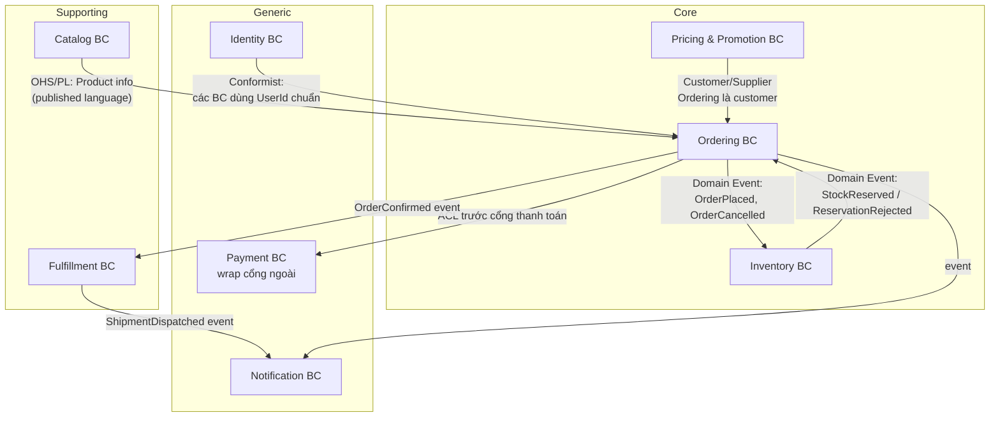
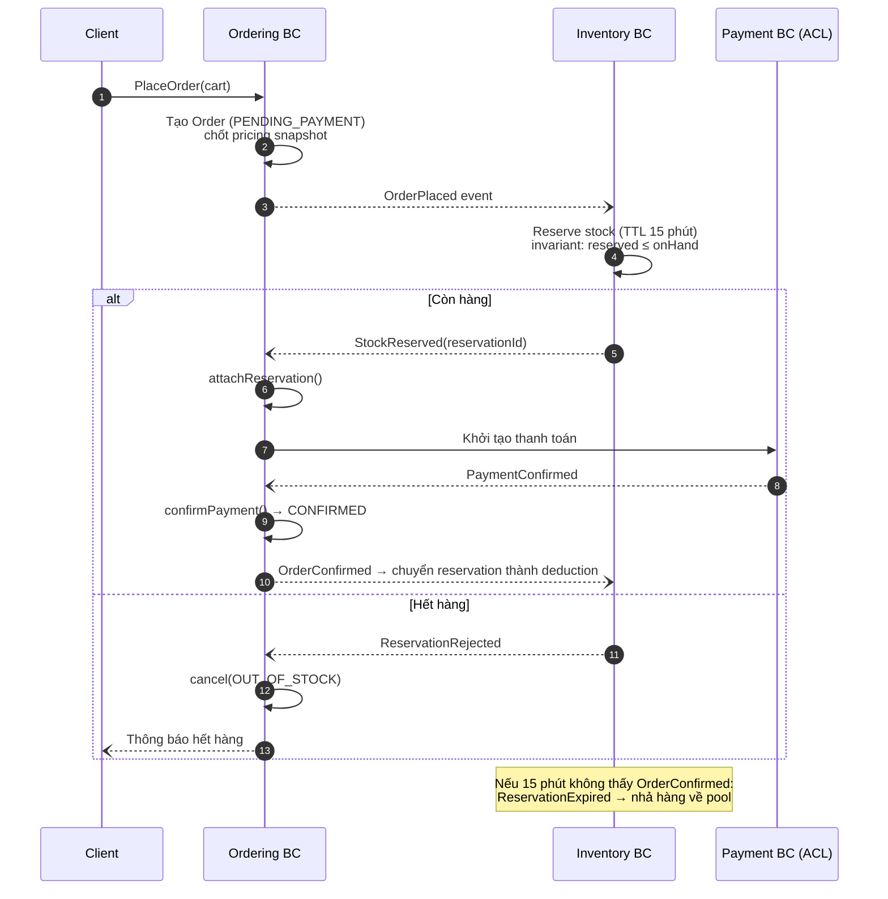
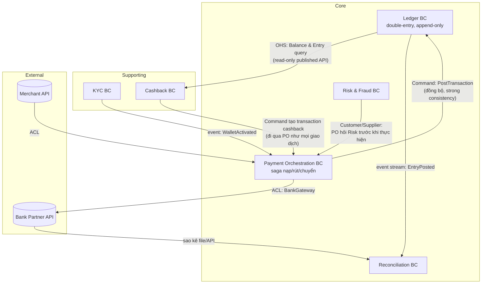
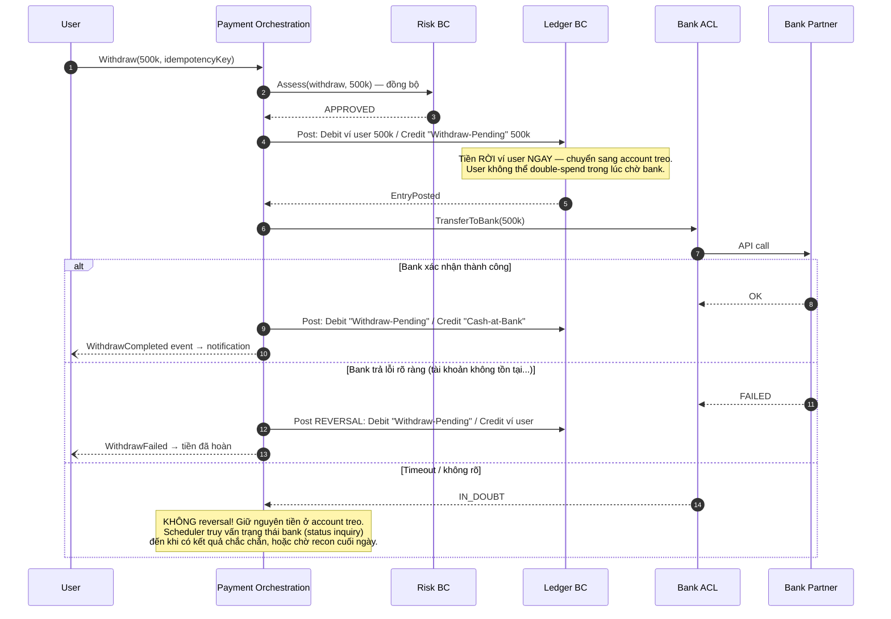
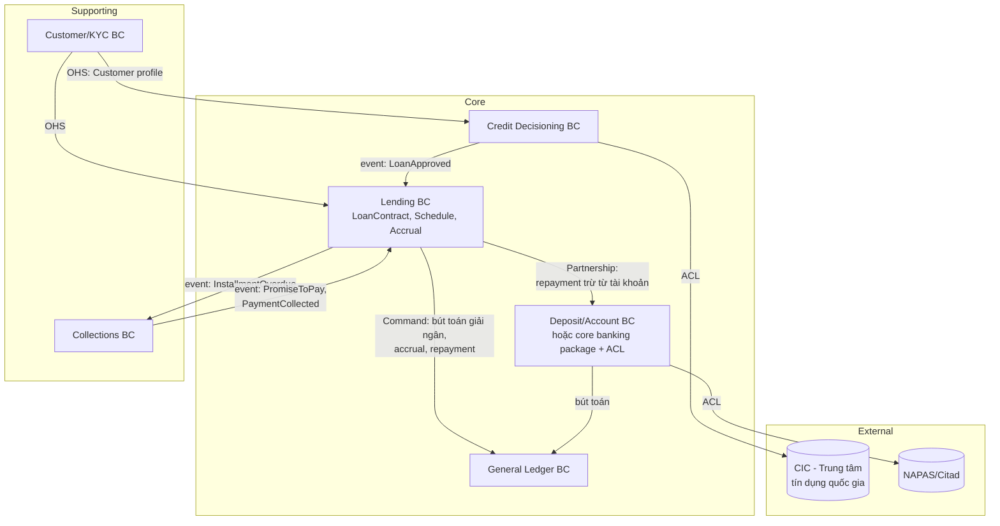
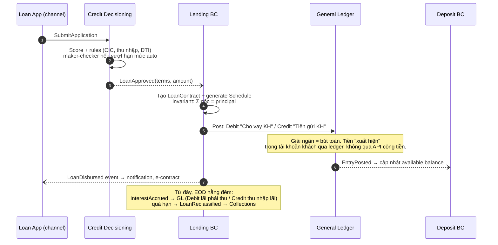
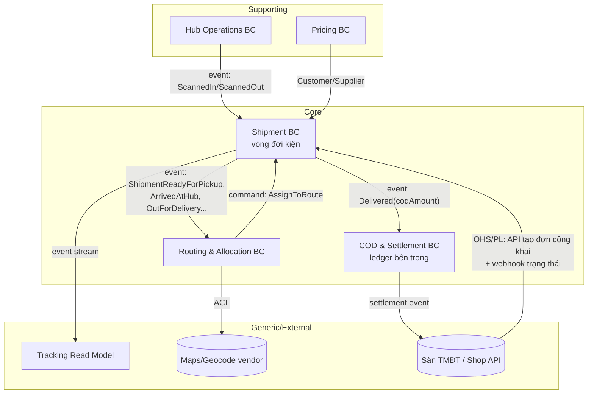
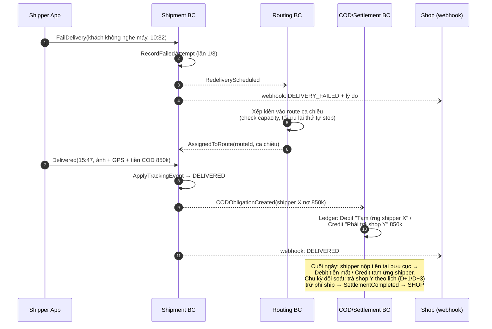

+++
title = "Chương 15a — Case Study: E-commerce, FinTech, Banking, Logistics"
date = "2026-07-09T22:00:00+07:00"
draft = false
tags = ["backend", "ddd", "architecture"]
series = ["Domain-Driven Design"]
+++

> **Vị trí trong bộ tài liệu:** Đây là chương đầu tiên trong cặp chương case study (15a/15b), đứng sau [Chương 14 — DDD trong Production](/series/domain-driven-design/14-ddd-trong-production/). Toàn bộ lý thuyết từ chương 01–14 — Subdomain, Bounded Context, Context Mapping, Aggregate, Domain Event, kiến trúc và distributed systems — sẽ được "thử lửa" qua 4 ngành có độ phức tạp domain rất khác nhau: **E-commerce, FinTech (ví điện tử/payment), Banking (core banking + lending), Logistics (last-mile delivery)**. Mục tiêu không phải là đưa cho bạn thiết kế để copy, mà là cho bạn thấy **cách lập luận**: cùng một pattern, tại sao ngành này dùng còn ngành kia thì không.

Trước khi vào từng ngành, một nguyên tắc xuyên suốt mà tôi muốn bạn giữ trong đầu: **thiết kế DDD tốt là thiết kế phản chiếu đúng nơi business kiếm tiền và nơi business chết nếu làm sai**. E-commerce chết vì bán hàng không có trong kho và trải nghiệm checkout tệ. FinTech chết vì lệch tiền một đồng. Banking chết vì vi phạm compliance và mất audit trail. Logistics chết vì tối ưu route kém làm chi phí giao mỗi đơn cao hơn đối thủ. Bốn "điểm chết" khác nhau → bốn cách phân bổ nỗ lực thiết kế khác nhau, dù kỹ thuật nền tảng giống hệt nhau.

---

## Mục lục chương

1. [E-commerce — Order là vua, nhưng đừng nhốt cả thế giới vào Order](#1-e-commerce)
2. [FinTech — Ledger bất biến và double-entry](#2-fintech--ví-điện-tử--payment)
3. [Banking — Core banking, lending và gánh nặng compliance](#3-banking--core-banking--lending)
4. [Logistics — Shipment, Route và bài toán thời gian thực](#4-logistics--giao-vận-last-mile)

---

## 1. E-commerce

### 1.1. Bối cảnh business và điểm phức tạp đặc thù

Một sàn/website thương mại điện tử tầm trung: 50.000–200.000 đơn/ngày, catalog vài trăm nghìn SKU, có flash sale, có nhiều kho, có cả bán hàng của chính mình (1P) lẫn seller bên thứ ba (3P).

Điểm phức tạp đặc thù của e-commerce **không nằm ở từng nghiệp vụ đơn lẻ** — đặt hàng, trừ kho, thanh toán, giao hàng, cái nào tách riêng cũng đơn giản. Phức tạp nằm ở chỗ:

1. **Vòng đời Order dài và nhiều nhánh.** Một đơn hàng sống qua: đặt → xác nhận thanh toán → tách kiện → xuất kho → giao → đối soát → (có thể) đổi trả, hoàn tiền một phần, hủy một phần. Mỗi nhánh có quy tắc riêng: hủy trước khi xuất kho khác hủy sau khi xuất kho; hoàn tiền COD khác hoàn tiền thẻ.
2. **Tranh chấp tồn kho tại thời điểm cao tải.** Flash sale là bài toán 10.000 người tranh 100 chiếc điện thoại trong 3 giây. Nếu thiết kế sai, bạn hoặc bán lố (oversell — phải gọi điện xin lỗi khách, hủy đơn, ăn bão 1 sao), hoặc bán hụt (khóa quá chặt, hàng còn mà khách không mua được).
3. **Pricing và Promotion là chiến trường thay đổi liên tục.** Team marketing muốn ra loại voucher mới mỗi tuần: giảm theo %, giảm cố định, freeship, combo, tặng kèm, stack nhiều voucher, giới hạn theo user segment. Đây là nơi rule nghiệp vụ biến động nhanh nhất.
4. **Consistency yêu cầu không đồng đều.** Số tiền khách phải trả trên đơn: phải đúng tuyệt đối tại thời điểm đặt. Số lượng "còn 5 sản phẩm" hiển thị trên trang: sai lệch vài giây không ai chết. Đây là gợi ý vàng để vẽ ranh giới consistency.

> **Câu hỏi first-principles:** e-commerce kiếm tiền bằng gì? Bằng **chuyển đổi (conversion)** và **biên lợi nhuận trên mỗi đơn**. Vậy Core Domain phải là những gì trực tiếp ảnh hưởng hai con số đó: trải nghiệm đặt hàng trơn tru (Ordering), khả năng hứa đúng và giữ lời về tồn kho (Inventory/Fulfillment promise), và cỗ máy promotion linh hoạt (Pricing). Còn gửi email, quản lý user profile? Quan trọng, nhưng không phải nơi bạn thắng đối thủ.

### 1.2. Phân rã domain: Core / Supporting / Generic

| Subdomain | Loại | Vì sao |
|---|---|---|
| **Ordering** (đặt hàng, vòng đời đơn) | **Core** | Là nơi hội tụ mọi rule kiếm tiền: giá cuối cùng, điều kiện hủy/đổi trả, trạng thái đơn. Sai ở đây = mất tiền hoặc mất khách trực tiếp. |
| **Inventory & Reservation** (tồn kho, giữ hàng) | **Core** | Lời hứa "còn hàng, giao trong 2 ngày" là lợi thế cạnh tranh. Oversell trong flash sale là thảm họa PR. Logic reservation (giữ hàng có thời hạn) là đặc thù, không mua ngoài được. |
| **Pricing & Promotion** | **Core** | Biến động nhanh nhất, gắn trực tiếp với chiến lược kinh doanh. Cần mô hình rule linh hoạt (Specification pattern — xem chương 11) mà không sản phẩm đóng gói nào khớp 100%. |
| **Catalog** (sản phẩm, thuộc tính, tìm kiếm) | **Supporting** | Cần thiết nhưng logic không quá đặc thù; nhiều phần (search) có thể dựng trên Elasticsearch. Tuy nhiên với sàn 3P, quản lý listing của seller có thể leo lên gần Core. |
| **Fulfillment** (tách kiện, xuất kho) | **Supporting** | Quan trọng vận hành, nhưng nếu bạn không tự vận hành kho quy mô lớn thì đây là supporting; nếu kho là lợi thế (kiểu Amazon FBA) thì nó là Core — **phân loại subdomain phụ thuộc chiến lược công ty, không phải bản chất kỹ thuật**. |
| **Payment** (cổng thanh toán) | **Generic** | Tích hợp Stripe/VNPay/MoMo. Đừng bao giờ tự viết cổng thanh toán cho một công ty e-commerce. |
| **Notification, Identity, Shipping label** | **Generic** | Mua/dùng dịch vụ ngoài, wrap sau ACL. |

Bài học ở đây: **cùng một subdomain (Fulfillment) có thể là Core với công ty này và Supporting với công ty kia**. Câu hỏi phân loại không phải "cái này khó không?" mà là "cái này có phải nơi chúng ta khác biệt với đối thủ không, và chúng ta có chủ đích đầu tư để khác biệt ở đó không?".

### 1.3. Context map



Mấy quyết định đáng chú ý:

- **Catalog là Open Host Service (OHS) với Published Language:** nhiều BC cần thông tin sản phẩm (Ordering cần tên + ảnh để snapshot vào đơn, Pricing cần category để áp rule). Catalog công bố một schema ổn định thay vì để từng BC gọi thẳng vào bảng của nó. Đánh đổi: team Catalog phải cam kết versioning schema — chậm hơn khi thay đổi, nhưng tránh được cảnh một lần đổi cột làm sập 4 BC.
- **Pricing ↔ Ordering là Customer/Supplier:** Ordering là downstream customer, có quyền yêu cầu Pricing cung cấp API "tính giá cho giỏ hàng này". Vì cả hai đều Core và cùng công ty, quan hệ đàm phán được — khác với quan hệ Conformist khi bạn dùng API của bên thứ ba và phải chịu.
- **Payment nằm sau ACL:** model của VNPay/Stripe (charge, intent, capture) **không được phép** rò rỉ vào Ordering. Ordering chỉ biết khái niệm `PaymentConfirmed`/`PaymentFailed` của chính nó. Nếu mai đổi cổng thanh toán, chỉ ACL đổi. Làm sai (để `stripe_payment_intent_id` len vào entity Order và code Order xử lý theo trạng thái riêng của Stripe): đổi cổng thanh toán trở thành dự án 6 tháng thay vì 6 tuần.

### 1.4. Aggregate quan trọng nhất: Order — và tại sao Inventory phải đứng ngoài

**Invariant của Order aggregate:**

1. Tổng tiền đơn = Σ(line item sau giảm giá) + phí ship − voucher toàn đơn, và **bất biến sau khi đơn được xác nhận** (giá là snapshot, không bao giờ tính lại từ Catalog).
2. Chuyển trạng thái chỉ theo máy trạng thái hợp lệ: không thể `Shipped → Cancelled` toàn phần, chỉ có thể đi qua luồng return.
3. Một đơn không quá N line item (rule vận hành kho), không âm số lượng.
4. Không được sửa line item sau khi đã `Confirmed` — mọi thay đổi sau đó là nghiệp vụ mới (partial cancel, return) với rule riêng.

**Cái gì KHÔNG thuộc Order:** số tồn kho. Đây là lỗi kinh điển sẽ phân tích ở mục 1.7. Order chỉ giữ **kết quả** của việc giữ hàng (`reservationId`), không giữ con số tồn.

Phác thảo TypeScript:

```typescript
// ordering/domain/order.ts

type OrderStatus =
  | 'PENDING_PAYMENT'
  | 'CONFIRMED'
  | 'FULFILLING'
  | 'SHIPPED'
  | 'COMPLETED'
  | 'CANCELLED';

// Value Object: tiền không bao giờ là number trần trụi
class Money {
  private constructor(
    readonly amount: bigint,      // đơn vị nhỏ nhất (đồng), bigint để không dính floating point
    readonly currency: 'VND',
  ) {}

  static vnd(amount: bigint): Money {
    if (amount < 0n) throw new DomainError('Money không âm trong ngữ cảnh Order');
    return new Money(amount, 'VND');
  }
  add(other: Money): Money { /* check cùng currency */ return Money.vnd(this.amount + other.amount); }
}

// Value Object: snapshot sản phẩm tại thời điểm đặt — KHÔNG tham chiếu sống sang Catalog
class OrderLine {
  constructor(
    readonly productId: ProductId,     // chỉ là ID tham chiếu, không phải object Catalog
    readonly nameSnapshot: string,     // tên tại thời điểm đặt
    readonly unitPrice: Money,         // giá đã chốt — Catalog đổi giá sau đó không ảnh hưởng
    readonly quantity: number,
    readonly appliedDiscount: Money,
  ) {
    if (quantity <= 0 || !Number.isInteger(quantity)) {
      throw new DomainError('Số lượng phải là số nguyên dương');
    }
  }
  get lineTotal(): Money { /* unitPrice * quantity - appliedDiscount */ }
}

class Order {
  private constructor(
    readonly id: OrderId,
    readonly customerId: CustomerId,
    private lines: OrderLine[],
    private status: OrderStatus,
    private readonly pricingSnapshot: PricingSnapshot, // voucher, phí ship đã chốt
    private reservationId: ReservationId | null,       // tham chiếu sang Inventory BC — chỉ ID
    private domainEvents: DomainEvent[] = [],
  ) {}

  // Factory method — điểm duy nhất tạo Order hợp lệ
  static place(cmd: PlaceOrderCommand, pricing: PricingSnapshot): Order {
    if (cmd.lines.length === 0) throw new DomainError('Đơn hàng phải có ít nhất 1 sản phẩm');
    if (cmd.lines.length > 50) throw new DomainError('Đơn hàng tối đa 50 dòng');
    const order = new Order(OrderId.next(), cmd.customerId, cmd.lines, 'PENDING_PAYMENT', pricing, null);
    order.record(new OrderPlaced(order.id, order.total, order.lineSummaries()));
    return order;
  }

  // Invariant tổng tiền: luôn derive từ lines + snapshot, không lưu cột total có thể lệch
  get total(): Money {
    return this.lines
      .reduce((sum, l) => sum.add(l.lineTotal), Money.vnd(0n))
      .add(this.pricingSnapshot.shippingFee)
      .subtract(this.pricingSnapshot.orderLevelDiscount);
  }

  attachReservation(reservationId: ReservationId): void {
    if (this.status !== 'PENDING_PAYMENT') {
      throw new DomainError('Chỉ gắn reservation khi đơn chờ thanh toán');
    }
    this.reservationId = reservationId;
  }

  confirmPayment(paymentRef: PaymentRef): void {
    this.assertTransition('PENDING_PAYMENT', 'CONFIRMED');
    if (this.reservationId === null) {
      throw new DomainError('Không thể confirm đơn chưa giữ được hàng');
    }
    this.status = 'CONFIRMED';
    this.record(new OrderConfirmed(this.id, this.reservationId, paymentRef));
  }

  cancel(reason: CancelReason): void {
    if (this.status === 'SHIPPED' || this.status === 'COMPLETED') {
      throw new DomainError('Đơn đã giao — dùng luồng return, không phải cancel');
    }
    this.status = 'CANCELLED';
    // Event này sẽ khiến Inventory nhả reservation, Payment refund nếu đã thu
    this.record(new OrderCancelled(this.id, this.reservationId, reason));
  }
}
```

Điểm cần soi kỹ:

- **`OrderLine` snapshot toàn bộ dữ liệu cần thiết.** Tại sao? Vì Catalog đổi giá/tên/ảnh hàng ngày. Nếu Order tham chiếu sống, hóa đơn của khách sẽ "tự thay đổi" theo thời gian — thảm họa cả về pháp lý lẫn CSKH. Đánh đổi: dữ liệu trùng lặp, tốn storage. Chấp nhận — storage rẻ, kiện tụng đắt.
- **Order tham chiếu Inventory bằng `ReservationId`**, không nhúng. Hai aggregate, hai transaction, nối với nhau bằng saga (xem luồng event bên dưới).
- **`total` là derived, không phải cột được cộng dồn thủ công.** Bất cứ khi nào bạn thấy code `order.total += x` rải rác nhiều nơi, đó là mầm mống của bug lệch tiền.

### 1.5. Domain Event và luồng chính: đặt hàng flash sale

Các event quan trọng: `OrderPlaced`, `StockReserved`, `ReservationRejected`, `PaymentConfirmed`, `OrderConfirmed`, `OrderCancelled`, `ReservationExpired`.

Luồng chính — đặt hàng với reservation pattern (saga choreography):



Tại sao reservation có TTL? Vì khách bỏ giỏ giữa chừng là chuyện thường (tỷ lệ abandon 60–70%). Không có TTL, hàng bị "giam" vô hạn bởi những đơn không bao giờ thanh toán — flash sale hiển thị hết hàng trong khi kho còn nguyên. TTL là cơ chế **compensating tự động theo thời gian**, một dạng saga timeout.

### 1.6. Trade-off đặc thù ngành

| Quyết định | Chọn | Đánh đổi |
|---|---|---|
| Consistency giữa Order và Inventory | **Eventual (saga + reservation)**, không distributed transaction | Có khoảng vài trăm ms đơn ở trạng thái "chưa biết còn hàng không". Đổi lại: hai BC scale độc lập, flash sale không kéo sập Ordering. Nếu chọn 2PC: đơn giản về lý luận nhưng throughput chết ở khóa phân tán. |
| Hiển thị tồn kho trên trang sản phẩm | **Cache, eventual, lệch được vài giây** | Đôi khi khách bấm mua thì hết hàng — chấp nhận, xử lý bằng UX ("rất tiếc, vừa hết"). Bù lại trang sản phẩm chịu được hàng trăm nghìn RPS. |
| Giá trên đơn | **Strong — snapshot bất biến trong aggregate** | Tốn storage, phải xử lý bài toán "khách thấy giá cũ vài giây trước khi giá đổi" bằng rule nghiệp vụ (tôn trọng giá khách thấy trong X phút). |
| Promotion engine | Mô hình rule bằng Specification, evaluate lúc checkout | Phức tạp hơn if-else, nhưng team marketing ra voucher mới không cần deploy code core. Nếu hardcode: mỗi campaign là một lần sửa Order service — nơi nguy hiểm nhất để sửa thường xuyên. |

### 1.7. Ít nhất 3 lỗi thiết kế thường gặp

**Lỗi 1 — Nhốt Inventory vào trong Order aggregate.**
Triệu chứng: `Order.place()` vừa tạo đơn vừa `UPDATE products SET stock = stock - ?` trong cùng transaction. Hậu quả: (a) mọi đơn hàng chạm cùng row sản phẩm hot → lock contention, flash sale biến database thành hàng đợi tuần tự, p99 checkout vọt lên nhiều giây; (b) Order và Inventory không thể tách service khi cần scale; (c) rule tồn kho đa kho (kho nào gần khách nhất còn hàng?) không có chỗ sống — nó không phải rule của Order. Nguyên nhân gốc: nhầm "những gì thay đổi cùng nhau trong một use case" với "những gì phải nhất quán trong một transaction". Aggregate vẽ theo **invariant**, không vẽ theo use case.

**Lỗi 2 — Order tham chiếu sống sang Catalog thay vì snapshot.**
Triệu chứng: bảng `order_lines` chỉ có `product_id`, mọi màn hình đơn hàng join sang `products`. Hậu quả: khách đặt máy giá 20 triệu, tuần sau sale còn 15 triệu, khách mở lại đơn thấy 15 triệu và đòi hoàn chênh lệch; báo cáo doanh thu chạy lại ra số khác; xóa sản phẩm khỏi catalog làm gãy trang lịch sử đơn hàng. Đây là lỗi hiểu sai Value Object: dữ liệu trên đơn là **sự kiện lịch sử bất biến**, không phải view của hiện tại.

**Lỗi 3 — Promotion logic rải trong Order service dưới dạng if-else.**
Triệu chứng: `if (voucher.type === 'FREESHIP' && order.total > 500000 && user.isNew) ...` nằm trong `OrderService`, mỗi campaign thêm một nhánh. Hậu quả sau 2 năm: hàm tính giá 800 dòng không ai dám sửa, campaign Tết cần 3 tuần dev + regression test toàn bộ luồng đặt hàng, và bug giảm giá stack sai làm lỗ tiền thật. Cách đúng: Pricing là BC riêng với rule model (Specification/rule engine nhẹ), Ordering chỉ nhận `PricingSnapshot` đã tính xong.

**Lỗi 4 (bonus) — Dùng trạng thái đơn làm "biến toàn cục" cho mọi BC.**
Fulfillment, CSKH, Finance đều đọc-ghi trực tiếp cột `orders.status`, mỗi team thêm vài trạng thái (`WAITING_3PL_PICKUP`, `FINANCE_HOLD`...). Sau 3 năm: 40 trạng thái, không ai biết máy trạng thái thật là gì, mọi thay đổi cần họp 4 team. Cách đúng: mỗi BC có máy trạng thái riêng cho khái niệm của nó (Ordering có OrderStatus, Fulfillment có ShipmentStatus), đồng bộ bằng event.

### 1.8. Khi lưu lượng x100

- **Đọc/ghi tách hẳn (CQRS đúng nghĩa):** trang sản phẩm, lịch sử đơn → read model riêng (Elasticsearch/denormalized store) build từ event. Write path của Ordering chỉ còn lo transaction đặt hàng.
- **Inventory hot item cần thoát khỏi mô hình "một row một khóa":** chuyển sang đếm trên Redis với Lua script atomic, hoặc chia tồn kho thành bucket (sharded counter), DB chỉ là nguồn đối soát. Invariant "reserved ≤ onHand" giờ được enforce ở tầng in-memory có persistence log — **aggregate về mặt khái niệm không đổi, hiện thực hóa đổi hoàn toàn**. Đây là điểm nhiều người hiểu nhầm: DDD không bắt aggregate phải là ORM entity.
- **Order ID sharding theo customer:** mọi truy vấn nóng của Ordering đều theo customer → shard theo `customerId` gần như miễn phí. Nhưng báo cáo cross-customer phải đi qua read model, chấp nhận trễ.
- **Event bus trở thành hạ tầng sống còn:** ở x100, "mất event" không còn là sự cố hiếm, phải có outbox pattern + idempotent consumer làm chuẩn bắt buộc, không phải best practice tùy chọn (xem chương 13).

---

## 2. FinTech — Ví điện tử / Payment

### 2.1. Bối cảnh business và điểm phức tạp đặc thù

Một ví điện tử kiểu MoMo/ZaloPay thu nhỏ: nạp tiền từ ngân hàng, chuyển P2P, thanh toán merchant, rút về ngân hàng, có chương trình cashback. Vài triệu ví, vài trăm giao dịch/giây giờ cao điểm.

Điểm đặc thù của FinTech gói gọn trong một câu: **tiền không được sai một đồng, và khi bị chất vấn, bạn phải chứng minh được từng đồng đi đâu**. Cụ thể:

1. **Tính đúng tuyệt đối của số dư.** Ở e-commerce, tồn kho lệch 1 đơn vị là phiền toái; ở ví điện tử, tổng tiền trong hệ thống lệch 1 đồng so với tiền thật ở ngân hàng đối tác là **sự cố nghiêm trọng phải báo cáo**, lệch nhiều là giấy phép bị treo.
2. **Ledger bất biến (immutable) là yêu cầu bản chất, không phải lựa chọn kiến trúc.** Kiểm toán, Ngân hàng Nhà nước, đối soát với bank — tất cả đều cần trả lời câu hỏi "tại thời điểm T, số dư ví X là bao nhiêu và vì sao". Chỉ có ledger append-only trả lời được. Cột `balance` bị UPDATE đè không trả lời được.
3. **Mọi giao dịch tiền là giao dịch phân tán với bên ngoài.** Nạp tiền = chờ bank xác nhận. Rút tiền = gọi bank, có thể timeout, có thể "không rõ thành công hay thất bại". Trạng thái lấp lửng (in-doubt) là trạng thái **hạng nhất** trong domain, không phải edge case.
4. **Idempotency là luật sống.** Retry một lệnh chuyển tiền mà không có idempotency key = chuyển hai lần = mất tiền thật. Ở đây, ubiquitous language phải có từ "idempotency key", "reversal", "reconciliation" ngay từ ngày đầu.
5. **Đối soát (reconciliation) là một nghiệp vụ lớn, không phải cron job phụ.** Mỗi ngày phải khớp: ledger nội bộ ↔ sao kê bank ↔ số liệu merchant. Lệch là phải có quy trình điều tra và bút toán điều chỉnh — cũng append-only.

### 2.2. Phân rã domain

| Subdomain | Loại | Vì sao |
|---|---|---|
| **Ledger** (sổ cái double-entry) | **Core của Core** | Đây là "sự thật" duy nhất về tiền. Mọi thứ khác có thể rebuild từ ledger. Không mua ngoài được vì rule hạch toán gắn chặt sản phẩm (ví chính, ví khuyến mãi, tiền treo, phí...). |
| **Payment Orchestration** (luồng nạp/rút/chuyển, saga với bank) | **Core** | Xử lý trạng thái in-doubt, retry, reversal — nơi tập trung độ phức tạp phân tán và cũng là nơi quyết định trải nghiệm "chuyển tiền 3 giây" so với đối thủ "chờ 5 phút". |
| **Reconciliation** | **Core** | Nghe như back-office nhưng là năng lực sống còn để vận hành đúng luật và phát hiện mất tiền sớm. Công ty payment trưởng thành đầu tư rất nặng vào đây. |
| **Risk & Fraud** | **Core** (hoặc Supporting giai đoạn đầu) | Chặn giao dịch đáng ngờ theo rule + model. Giai đoạn đầu có thể dùng rule đơn giản (Supporting), càng lớn càng trở thành lợi thế cạnh tranh (giảm tỷ lệ fraud = giảm chi phí = phí rẻ hơn đối thủ). |
| **KYC/Onboarding** | **Supporting** | Bắt buộc theo luật, nhưng quy trình khá chuẩn hóa; phần eKYC (OCR, face matching) mua từ vendor, phần luồng nghiệp vụ tự viết. |
| **Cashback/Loyalty** | **Supporting** | Quan trọng cho growth nhưng logic sai không làm mất tiền gốc của khách — miễn là tiền cashback cũng đi qua ledger. |
| **Notification, Statement PDF, CSKH tooling** | **Generic** | Mua hoặc dùng thư viện. |

Chú ý một nghịch lý: **Reconciliation không tạo ra doanh thu nhưng vẫn là Core**. Lý do: phân loại Core không chỉ theo "kiếm tiền" mà theo "nếu làm tệ thì công ty có tồn tại được không". Với ngành bị regulate, năng lực chứng minh tính đúng của tiền là điều kiện tồn tại.

### 2.3. Context map



Ba quyết định then chốt:

- **Ledger là downstream của không ai cả về mặt ghi.** Chỉ một cửa ghi duy nhất: Payment Orchestration gửi command `PostTransaction`. Cashback muốn cộng tiền? Đi qua PO như một giao dịch bình thường. Điều này bảo đảm mọi đồng tiền vào/ra đều qua cùng một bộ rule kiểm tra. Đánh đổi: PO thành điểm nghẽn về throughput — chấp nhận, và giải bằng scale ngang theo shard ví (mục 2.8), không giải bằng cách mở thêm cửa ghi.
- **Risk đứng trước PO theo quan hệ Customer/Supplier đồng bộ** cho giao dịch rút/chuyển lớn (phải chặn trước khi tiền đi), nhưng **bất đồng bộ (event)** cho phân tích sau giao dịch nhỏ. Cùng một cặp BC, hai kiểu tích hợp tùy mức rủi ro — context mapping không phải chọn một kiểu cho mọi tương tác.
- **Bank luôn nằm sau ACL**, và ACL này phải dịch cả **mô hình lỗi**: bank timeout không phải "thất bại", nó là "không rõ" — ACL trả về `InDoubt` chứ không được trả `Failed`. Nhiều sự cố mất tiền thật bắt nguồn từ ACL dịch sai timeout thành failed rồi hệ thống tự động refund, trong khi bank thực ra đã chuyển thành công.

### 2.4. Aggregate quan trọng nhất: LedgerTransaction (double-entry)

Mô hình sai phổ biến nhất: coi `Wallet` với cột `balance` là aggregate trung tâm. Mô hình đúng: **aggregate trung tâm là LedgerTransaction — một bút toán gồm nhiều entry, tổng Nợ = tổng Có**. Balance chỉ là derived/materialized view.

**Invariant của LedgerTransaction:**

1. **Cân bằng:** Σ(debit) = Σ(credit) trong cùng transaction — bất biến tuyệt đối, kiểm tại thời điểm tạo, và vì entry bất biến nên không bao giờ bị phá sau đó.
2. **Bất biến:** entry đã post không bao giờ UPDATE/DELETE. Sửa sai = post transaction đảo (reversal) tham chiếu transaction gốc.
3. **Idempotent:** mỗi transaction mang `idempotencyKey` duy nhất; post lại cùng key phải trả về kết quả cũ, không tạo entry mới.
4. **Không âm có điều kiện:** ví khách hàng không được âm (kiểm bằng số dư tính đến entry hiện tại); một số account nội bộ (tiền treo, phải thu bank) được phép âm theo thiết kế hạch toán.

Phác thảo Go:

```go
// ledger/domain/transaction.go
package ledger

import "errors"

type EntryDirection int8

const (
	Debit  EntryDirection = 1
	Credit EntryDirection = -1
)

// Money: số nguyên đơn vị đồng. Cấm float trong toàn bộ BC này.
type Money struct {
	Amount   int64
	Currency string // "VND"
}

// Entry là Value Object bên trong aggregate — bất biến sau khi tạo.
type Entry struct {
	AccountID AccountID // ví khách, account nội bộ (cash-at-bank, suspense, fee-revenue...)
	Direction EntryDirection
	Amount    Money // luôn dương; chiều nằm ở Direction
}

type TxType string // TOPUP, WITHDRAW, P2P_TRANSFER, MERCHANT_PAY, REVERSAL, RECON_ADJUSTMENT

// LedgerTransaction là Aggregate Root.
// Ranh giới transaction DB = một bút toán trọn vẹn. Không hơn, không kém.
type LedgerTransaction struct {
	ID             TxID
	IdempotencyKey string
	Type           TxType
	Entries        []Entry
	ReversalOf     *TxID // khác nil nếu là bút toán đảo
	PostedAt       time.Time
}

// NewTransaction là Factory duy nhất — enforce invariant cân bằng ngay tại cửa.
func NewTransaction(key string, txType TxType, entries []Entry) (*LedgerTransaction, error) {
	if len(entries) < 2 {
		return nil, errors.New("double-entry cần tối thiểu 2 entry")
	}
	var sum int64
	for _, e := range entries {
		if e.Amount.Amount <= 0 {
			return nil, errors.New("amount của entry phải dương; chiều thể hiện bằng Direction")
		}
		sum += int64(e.Direction) * e.Amount.Amount
	}
	if sum != 0 {
		// Đây là invariant thiêng liêng nhất của toàn hệ thống.
		return nil, ErrUnbalanced
	}
	return &LedgerTransaction{
		ID: NewTxID(), IdempotencyKey: key, Type: txType, Entries: entries,
	}, nil
}

// Ví dụ nghiệp vụ: khách A chuyển 100k cho khách B, phí 1k.
// 3 entry, vẫn cân: Debit ví A 101k / Credit ví B 100k / Credit account phí 1k.
func NewP2PTransfer(key string, from, to AccountID, amount, fee Money) (*LedgerTransaction, error) {
	return NewTransaction(key, "P2P_TRANSFER", []Entry{
		{AccountID: from, Direction: Debit, Amount: add(amount, fee)},
		{AccountID: to, Direction: Credit, Amount: amount},
		{AccountID: FeeRevenueAccount, Direction: Credit, Amount: fee},
	})
}
```

Và phía repository — nơi enforce invariant "không âm" và idempotency, vì hai invariant này cần nhìn thấy trạng thái ngoài aggregate:

```go
// ledger/infra/postgres_repo.go
// PostTransaction chạy trong MỘT transaction DB:
//  1. INSERT ... ON CONFLICT (idempotency_key) DO NOTHING → nếu conflict, đọc và trả kết quả cũ
//  2. Với mỗi account khách bị Debit: khóa dòng balance-projection
//     (SELECT ... FOR UPDATE) và kiểm balance - amount >= 0
//  3. INSERT toàn bộ entries (append-only; bảng entries KHÔNG có UPDATE/DELETE grant
//     — quyền này bị thu hồi ở tầng DB, không chỉ ở code)
//  4. UPDATE balance projection (đây là cache, nguồn sự thật vẫn là entries)
//  5. INSERT outbox event EntryPosted
```

Chi tiết đáng giá nhất ở đây: **quyền UPDATE/DELETE trên bảng entries bị thu hồi ở tầng database**. Invariant "bất biến" không nên chỉ sống trong code — code có bug, có người viết script sửa liệu. Defense in depth cho invariant quan trọng nhất.

Còn `Wallet` thì sao? Wallet là aggregate **nhẹ** ở BC khác (quản lý trạng thái ví: active/frozen/closed, hạn mức, KYC tier) — nó không giữ tiền. "Số dư của ví" = tổng entries của account tương ứng, được cache trong balance projection.

### 2.5. Domain Event và luồng chính: rút tiền về ngân hàng

Đây là luồng khó nhất vì dính bên thứ ba có thể trả lời "không rõ":



Ba bài học từ luồng này:

1. **Tiền treo (suspense account) là mô hình hóa trực tiếp của sự không chắc chắn.** Không có nó, bạn buộc phải chọn giữa "trừ ví trước, bank fail thì user mất tiền tạm thời" và "gọi bank trước, thành công rồi trừ ví — nhưng nếu trừ ví fail thì công ty mất tiền". Suspense account cho phép hệ thống trung thực: "tiền đang trên đường".
2. **In-doubt không được tự động resolve bằng đoán.** Chỉ resolve bằng status inquiry hoặc reconciliation. Mọi shortcut ở đây đều từng làm mất tiền thật ở đâu đó.
3. **Reversal là bút toán mới, không phải xóa bút toán cũ** — lịch sử phản ánh đúng những gì đã xảy ra, kể cả sai lầm.

### 2.6. Trade-off đặc thù ngành

- **Strong consistency ở ledger, không thương lượng.** Post bút toán là ACID transaction, kể cả khi phải hy sinh throughput. Eventual consistency cho ledger nghĩa là có thời điểm tồn tại trạng thái mất cân bằng — với sổ cái, "tạm thời sai" đồng nghĩa "sai".
- **Eventual ở mọi thứ phái sinh:** notification, lịch sử giao dịch hiển thị, thống kê chi tiêu, cashback. Notification trễ 5 giây không ai mất tiền.
- **Latency vs an toàn ở Risk:** kiểm tra fraud đồng bộ thêm 50–200ms vào mọi giao dịch. Chọn phân tầng: giao dịch nhỏ trong hạn mức → risk async (chấp nhận rủi ro nhỏ, thu hồi sau); giao dịch lớn → risk sync bắt buộc. Trade-off được **định lượng bằng tiền**: chi phí fraud kỳ vọng vs chi phí conversion mất do latency.
- **Balance projection: đọc từ đâu?** Đọc balance từ projection (nhanh, có thể trễ 1 tick) hay tính từ entries (chậm, luôn đúng)? Quyết định: kiểm tra "không âm" khi post → dùng projection nhưng khóa dòng trong cùng transaction với insert entry (nên không trễ); hiển thị app → projection thoải mái; đối soát → luôn tính lại từ entries.

### 2.7. Lỗi thiết kế thường gặp

**Lỗi 1 — Lưu balance là cột UPDATE trực tiếp, không có ledger.**
`UPDATE wallets SET balance = balance - 500000 WHERE id = ?`. Hậu quả: (a) không trả lời được "vì sao số dư ra thế này" — khiếu nại của khách thành đi tìm log rải rác; (b) bug double-update hoặc race không có dấu vết để phát hiện, tiền lệch âm thầm hàng tháng trời; (c) không thể đối soát với bank vì không có dữ liệu giao dịch chuẩn; (d) kiểm toán fail. Đây là lỗi **đắt nhất để sửa về sau** — migration từ balance-only sang ledger trên hệ thống đang chạy là dự án nhiều quý. Nếu bạn chỉ nhớ một điều từ case study này: **ngày đầu tiên của một hệ thống tiền phải là ngày ledger append-only ra đời**.

**Lỗi 2 — Single-entry thay vì double-entry.**
Có bảng transaction log nhưng mỗi giao dịch một dòng "ví A -500k". Tiền đi đâu? Không thể hiện. Hậu quả: tổng tiền toàn hệ thống không thể kiểm bằng một invariant duy nhất (Σ mọi entry = 0); tiền phí, tiền treo, tiền ở bank nằm ngoài mô hình → recon thủ công bằng Excel; khi thêm loại giao dịch mới (cashback, hoàn tiền một phần) mỗi loại một kiểu ghi log, không đồng nhất. Double-entry không phải nghi thức kế toán cổ — nó là **invariant toàn cục rẻ nhất từng được phát minh** để phát hiện mất tiền.

**Lỗi 3 — Coi timeout của bank là failure và tự động refund.**
Đã phân tích ở 2.5. Hậu quả cụ thể: bank thực ra đã chuyển 500k cho user, hệ thống refund thêm 500k vào ví → user nhận 1 triệu, công ty mất 500k mỗi lần xảy ra. Nhân với tần suất timeout của bank Việt Nam giờ cao điểm — con số không nhỏ, và tệ hơn: user nhanh chóng học được cách khai thác (rút tiền đúng giờ bank chậm).

**Lỗi 4 — Không có idempotency key từ client đến ledger.**
Mobile app retry khi mạng chập chờn → hai lệnh chuyển giống hệt nhau cách nhau 3 giây. Nếu idempotency chỉ có ở tầng API gateway (dedupe theo request hash trong 60s) mà không xuyên xuống ledger, mọi retry qua đường khác (job retry, saga retry) vẫn nhân đôi tiền. Idempotency phải là thuộc tính của **domain model** (key nằm trong LedgerTransaction), không phải của tầng vận chuyển.

### 2.8. Khi lưu lượng x100

- **Shard ledger theo account, và chấp nhận hệ quả:** giao dịch nội-shard (P2P cùng shard) vẫn ACID một transaction; giao dịch xuyên shard phải thành saga hai bút toán qua account trung gian liên-shard (mô hình y hệt cách các ngân hàng thật chuyển tiền liên ngân hàng — domain cũ 400 năm đã giải bài này, đừng phát minh lại). Invariant cân bằng giờ là: mỗi shard tự cân + account trung gian giữa các shard cân với nhau, kiểm bằng recon liên tục.
- **Hot account là kẻ thù số một:** account phí, account merchant lớn (một merchant nhận hàng nghìn thanh toán/giây) sẽ nghẽn ở row lock. Giải: **sub-account sharding** — account phí chia thành 64 sub-account, credit ngẫu nhiên một sub, tổng hợp định kỳ. Invariant không đổi, cấu trúc account đổi.
- **Recon phải chuyển từ batch cuối ngày sang streaming:** ở x100, lệch phát hiện sau 24h = 24h tiền chảy sai. Continuous reconciliation trên event stream, alert trong phút.
- **Balance projection tách hẳn thành read-model service** với cache, vì lượng đọc balance (mỗi lần mở app) gấp hàng trăm lần lượng ghi.

---

## 3. Banking — Core Banking + Lending

### 3.1. Bối cảnh business và điểm phức tạp đặc thù

Một ngân hàng số (digital bank) hoặc công ty tài chính: tài khoản thanh toán, tiết kiệm có kỳ hạn, và mảng lending (vay tiêu dùng, vay trả góp). Khác ví điện tử ở chỗ: ngân hàng **tạo ra tiền qua tín dụng**, chịu regulate nặng hơn nhiều, và sản phẩm có vòng đời dài (khoản vay 36 tháng, sổ tiết kiệm 13 tháng).

Điểm phức tạp đặc thù, cộng dồn lên trên mọi thứ của FinTech:

1. **Sản phẩm tài chính là hợp đồng theo thời gian.** Khoản vay không phải một giao dịch — nó là một **lịch trình** (schedule) 36 kỳ, mỗi kỳ có gốc, lãi, phí; trả sớm thì tính lại; trễ hạn thì phạt và nhảy nhóm nợ. Lãi suất tính **dồn tích theo ngày (accrual)** dù khách không làm gì — domain có "thời gian trôi" như một tác nhân.
2. **Phân loại nợ và trích lập dự phòng theo quy định (Thông tư của NHNN).** Khoản vay quá hạn 10 ngày nhảy nhóm 2, 91 ngày nhóm 3... — rule pháp định, sai là bị phạt, và rule **thay đổi theo văn bản pháp luật**, model phải sửa được mà không đập đi làm lại.
3. **Bút toán kế toán ngân hàng phức tạp hơn ví:** hạch toán dồn tích lãi (interest accrual), thoái lãi (interest reversal khi nhảy nhóm nợ), off-balance-sheet. Ledger vẫn là trái tim nhưng **Chart of Accounts** lớn và có tầng.
4. **Audit trail và maker-checker:** thao tác nhạy cảm (giải ngân, điều chỉnh lãi) cần người tạo (maker) và người duyệt (checker) khác nhau. Đây là rule domain, không phải tính năng UI.
5. **EOD (End of Day) batch là công dân hạng nhất:** tính lãi dồn tích, nhảy nhóm nợ, sinh sao kê — chạy hàng đêm trên hàng triệu hợp đồng, phải xong trước giờ mở cửa, phải chạy lại được (rerunnable) khi lỗi giữa chừng.

> **First principles:** ngân hàng kiếm tiền chủ yếu từ **NIM (chênh lệch lãi suất huy động − cho vay)** và kiểm soát **rủi ro tín dụng**. Vậy Core Domain là: mô hình hóa đúng sản phẩm tín dụng (Lending), quyết định cho vay ai (Credit Decisioning), và sổ sách đúng (Ledger/GL). Mobile app đẹp là supporting — quan trọng cho acquisition nhưng mọi ngân hàng đều copy được nhau trong 6 tháng; mô hình rủi ro tín dụng tốt thì không.

### 3.2. Phân rã domain

| Subdomain | Loại | Vì sao |
|---|---|---|
| **Lending** (hợp đồng vay, schedule, accrual, delinquency) | **Core** | Sản phẩm sinh lời chính. Mỗi ngân hàng cấu trúc sản phẩm vay khác nhau (ân hạn, lãi phạt, trả góp linh hoạt) — chính sự linh hoạt này là cạnh tranh. |
| **Credit Decisioning** (chấm điểm, phê duyệt) | **Core** | Quyết định trực tiếp tỷ lệ nợ xấu. Data + model + rule phê duyệt là tài sản chiến lược. |
| **Deposit & Account** (CASA, tiết kiệm) | **Core** (nhưng "ổn định") | Nghiệp vụ chuẩn hóa cao — nhiều ngân hàng mua core banking package (T24, Flexcube) cho phần này. Nếu mua: nó thành **Generic có ACL dày**. Quyết định build-vs-buy ở đây là quyết định chiến lược lớn nhất của kiến trúc ngân hàng. |
| **General Ledger** | **Core** | Như FinTech nhưng Chart of Accounts phức tạp hơn và phải khớp chuẩn báo cáo NHNN. |
| **Collections** (thu hồi nợ) | **Supporting → Core khi nợ xấu tăng** | Quy trình nhắc nợ, cam kết trả, phân bổ cho đội thu hồi. |
| **Customer/KYC/AML** | **Supporting** | Bắt buộc, chuẩn hóa; sanction screening mua vendor. |
| **Statement, Notification, Card processing** | **Generic** | Card processing gần như luôn outsource cho processor (mắc quá đắt để tự làm). |

### 3.3. Context map



Điểm nhấn:

- **Nếu Deposit chạy trên core banking package mua ngoài**, toàn bộ phần còn lại phải nói chuyện với nó qua **ACL rất dày** — model của T24/Flexcube cổ điển và khác hẳn ubiquitous language của bạn. Sai lầm chết người: để khái niệm của package (arrangement, AA product...) lan ra toàn hệ thống. Khi đó bạn không có domain model — bạn có một cái vỏ quanh package, và mọi giới hạn của package thành giới hạn của ngân hàng.
- **Lending ↔ Deposit là Partnership:** trả nợ tự động cần trừ tiền tài khoản — hai team phải release phối hợp cho tính năng này, quan hệ hai chiều bình đẳng. Partnership đắt (coupling về lịch release) nên chỉ dùng khi thực sự cần; ở đây cần vì đây là luồng doanh thu chính.
- **Collections nhận event từ Lending chứ không đọc DB của Lending.** Nghe hiển nhiên, nhưng ở rất nhiều ngân hàng thật, Collections là một team mua tool ngoài rồi ETL thẳng từ bảng của Lending — sau 2 năm, Lending không dám đổi schema vì sợ gãy 7 hệ thống downstream không được khai báo. Context map tồn tại để làm những dependency này **hiện hình và có chủ**.

### 3.4. Aggregate quan trọng nhất: LoanContract

**Invariant của LoanContract:**

1. Σ(gốc của các kỳ trong schedule) = số tiền giải ngân. Regenerate schedule (trả sớm một phần) phải giữ nguyên đẳng thức này.
2. Một khoản trả (repayment) được phân bổ (allocate) theo thứ tự pháp định/hợp đồng: **phí → lãi phạt → lãi → gốc** (thứ tự cụ thể theo chính sách sản phẩm, nhưng luôn là rule tường minh trong domain, không phải ngầm định trong SQL).
3. Nhóm nợ (delinquency bucket) chỉ được nhảy theo quy tắc DPD (days past due) hiện hành; nhảy nhóm xấu hơn kéo theo nghiệp vụ thoái lãi dồn tích — hai việc này **phải xảy ra cùng nhau** (một transaction, hoặc một saga có bù trừ được giám sát).
4. Mọi thao tác điều chỉnh thủ công (miễn phí phạt, cơ cấu nợ) phải có maker ≠ checker và đều sinh event audit.

```typescript
// lending/domain/loan-contract.ts

type LoanStatus = 'ACTIVE' | 'CLOSED' | 'WRITTEN_OFF' | 'RESTRUCTURED';
type DelinquencyBucket = 'CURRENT' | 'GROUP_2' | 'GROUP_3' | 'GROUP_4' | 'GROUP_5';

class Installment {           // Entity con trong aggregate
  constructor(
    readonly seq: number,
    readonly dueDate: LocalDate,
    readonly principalDue: Money,
    readonly interestDue: Money,
    private paidPrincipal: Money,
    private paidInterest: Money,
    private paidPenalty: Money,
  ) {}
  get isSettled(): boolean { /* đủ gốc + lãi + phạt */ }
  get outstanding(): InstallmentOutstanding { /* ... */ }
}

class LoanContract {
  private constructor(
    readonly id: LoanId,
    readonly customerId: CustomerId,
    readonly principal: Money,            // số tiền giải ngân — bất biến
    readonly terms: LoanTerms,            // VO: lãi suất, kỳ hạn, phương pháp tính lãi, ân hạn
    private schedule: Installment[],
    private status: LoanStatus,
    private bucket: DelinquencyBucket,
    private accruedInterest: Money,       // lãi dồn tích chưa đến hạn
    private events: DomainEvent[] = [],
  ) {}

  // Invariant 1: schedule luôn khớp principal
  private assertScheduleIntegrity(schedule: Installment[]): void {
    const totalPrincipal = schedule.reduce((s, i) => s.add(i.principalDue), Money.zero());
    if (!totalPrincipal.equals(this.principal)) {
      throw new DomainError('Tổng gốc trong schedule phải bằng số tiền giải ngân');
    }
  }

  // Nghiệp vụ trung tâm: nhận một khoản trả và phân bổ theo thứ tự ưu tiên
  applyRepayment(payment: Money, valueDate: LocalDate, policy: AllocationPolicy): RepaymentResult {
    if (this.status !== 'ACTIVE') throw new DomainError('Khoản vay không ở trạng thái nhận thanh toán');

    // AllocationPolicy là Domain Service được inject — thứ tự phí/phạt/lãi/gốc
    // khác nhau theo sản phẩm, không hardcode trong aggregate
    const allocation = policy.allocate(payment, this.outstandingItems(valueDate));
    allocation.apply(this.schedule);

    // Event mang dữ liệu phân bổ chi tiết → GL sẽ hạch toán từng phần vào account khác nhau
    this.record(new RepaymentApplied(this.id, valueDate, allocation.breakdown()));

    if (this.isFullySettled()) {
      this.status = 'CLOSED';
      this.record(new LoanClosed(this.id));
    }
    return allocation.result();
  }

  // "Thời gian trôi" là một command tường minh — EOD job gọi hàm này
  accrueDailyInterest(asOf: LocalDate, calc: InterestCalculator): void {
    const interest = calc.dailyAccrual(this.outstandingPrincipal(), this.terms, asOf);
    this.accruedInterest = this.accruedInterest.add(interest);
    this.record(new InterestAccrued(this.id, asOf, interest));
  }

  // Invariant 3: nhảy nhóm nợ + thoái lãi là một hành vi nguyên tử của domain
  reclassify(asOf: LocalDate, rules: DelinquencyRules): void {
    const newBucket = rules.bucketFor(this.daysPastDue(asOf));
    if (newBucket === this.bucket) return;
    const old = this.bucket;
    this.bucket = newBucket;
    if (rules.requiresInterestReversal(old, newBucket)) {
      const reversed = this.accruedInterest;
      this.accruedInterest = Money.zero();
      this.record(new AccruedInterestReversed(this.id, reversed)); // GL thoái lãi + off-balance
    }
    this.record(new LoanReclassified(this.id, old, newBucket, asOf));
  }
}
```

Nhận xét thiết kế:

- **`DelinquencyRules` và `AllocationPolicy` là Domain Service/Policy được inject**, không nằm cứng trong aggregate. Lý do: đây là những rule thay đổi theo văn bản pháp luật và theo sản phẩm. Khi Thông tư mới ra, bạn đổi một implementation, chạy lại reclassification — aggregate không đổi. Nếu hardcode: mỗi lần NHNN ra văn bản là một lần mổ aggregate quan trọng nhất hệ thống.
- **Aggregate này to** (chứa cả schedule vài chục installment) — và điều đó **đúng**, vì invariant "schedule khớp principal" và "phân bổ thanh toán đúng thứ tự trên toàn schedule" cần nhìn toàn bộ schedule trong một ranh giới nhất quán. Đừng máy móc "aggregate phải nhỏ": kích thước đúng = kích thước của invariant. Một khoản vay có concurrency thấp (vài giao dịch/ngày), aggregate to không gây contention.
- Ngược lại, **lãi dồn tích của hàng triệu khoản vay trong EOD** không load từng aggregate qua ORM — dùng đường batch tối ưu nhưng **phát cùng loại event** để GL hạch toán, và logic tính nằm trong cùng module domain để không có hai phiên bản công thức lãi.

### 3.5. Domain Event và luồng chính: giải ngân khoản vay



Chi tiết quan trọng: **giải ngân là một bút toán, không phải một lệnh "cộng tiền" gọi sang Deposit API**. Nếu làm kiểu gọi API cộng tiền: hai hệ thống có hai sự thật, lệch nhau khi một bên fail, và GL phải "được thông báo" thay vì là nguồn ghi nhận — toàn bộ tính đúng của báo cáo tài chính đổ vỡ từ đây.

### 3.6. Trade-off đặc thù ngành

- **Strong consistency: GL, số dư khả dụng, giải ngân, phân bổ thanh toán.** Eventual: notification, sao kê, dashboard quản trị, đồng bộ sang data warehouse. Ranh giới rất giống FinTech nhưng thêm một lớp: **báo cáo regulatory tính từ GL snapshot cuối ngày** — nghĩa là hệ thống cần khái niệm "ngày làm việc" và "chốt ngày" tường minh trong domain (business date ≠ calendar date), một khái niệm dân web thuần thường bỏ sót.
- **Build vs buy core banking:** mua package = time-to-market nhanh, đúng chuẩn kế toán sẵn, nhưng mọi sản phẩm sáng tạo bị giới hạn bởi package và chi phí license/vendor lock khổng lồ. Tự build = kiểm soát trọn nhưng 2–4 năm và rủi ro sai kế toán. Pattern thực dụng của nhiều digital bank: **mua cho Deposit/GL (nghiệp vụ chuẩn hóa), tự build Lending + Decisioning (nơi khác biệt)** — đúng tinh thần phân loại Core/Generic.
- **EOD batch vs real-time:** mơ ước "mọi thứ real-time" đắt vô ích ở banking — lãi dồn tích theo ngày thì tính theo ngày là đủ đúng. Trade-off thật: batch window co lại khi số hợp đồng tăng; thiết kế accrual để chạy song song theo shard hợp đồng ngay từ đầu.
- **Maker-checker làm chậm mọi thao tác nội bộ** — đó là tính năng, không phải bug. Đừng "tối ưu UX" bằng cách cho phép bypass; mọi vụ gian lận nội bộ lớn đều bắt đầu bằng một đường bypass "tạm thời".

### 3.7. Lỗi thiết kế thường gặp

**Lỗi 1 — Mô hình hóa khoản vay như "số dư âm" trên tài khoản.**
Tưởng thông minh: tái dùng model Account, vay = balance âm. Hậu quả: không có chỗ cho schedule, ân hạn, phân bổ gốc/lãi, nhóm nợ — tất cả bị nhét vào bảng phụ và service procedural bên ngoài, aggregate thật (LoanContract) không tồn tại, rule phân tán khắp nơi. Khi cần cơ cấu nợ (restructure) — nghiệp vụ đòi regenerate schedule giữ nguyên nợ gốc — không có ranh giới nào enforce được. Bài học: **hai khái niệm nghiệp vụ khác nhau (tiền gửi và tín dụng) là hai model khác nhau dù nhìn bề ngoài đều là "con số tiền"**. Đây chính là lý do Bounded Context tồn tại.

**Lỗi 2 — Tính lãi ở nhiều nơi với nhiều công thức "gần giống nhau".**
App hiển thị lãi tạm tính (code frontend/BFF tự tính), EOD tính lãi thật (SQL procedure), màn hình tất toán sớm tính kiểu thứ ba (service khác). Hậu quả: khách thấy ba con số khác nhau, khiếu nại, và có ngân hàng đã phải **hoàn tiền hàng loạt** vì con số hiển thị (thấp hơn) được tòa coi là cam kết. Cách đúng: `InterestCalculator` là domain service duy nhất, mọi kênh — kể cả màn hình tạm tính — gọi qua nó. Ubiquitous Language áp dụng cho cả công thức: một khái niệm, một chỗ định nghĩa.

**Lỗi 3 — Reclassification (nhảy nhóm nợ) chạy bằng UPDATE hàng loạt ngoài domain.**
EOD chạy `UPDATE loans SET bucket = ... WHERE dpd > 90` trực tiếp. Nhanh, nhưng: không sinh event → Collections không biết, GL không thoái lãi → **lãi dồn tích của nợ xấu vẫn nằm trong thu nhập**, báo cáo tài chính sai kiểu bị phạt nặng nhất. Tối ưu batch được phép, nhưng phải đi qua cùng đường domain logic + event (mục 3.4), không được "đi tắt qua SQL".

**Lỗi 4 — Không mô hình hóa business date / cut-off.**
Dùng `NOW()` cho mọi thứ. Hậu quả: giao dịch lúc 23:59:59 và 00:00:01 rơi vào hai ngày sao kê tùy độ trễ xử lý; chạy lại EOD sau sự cố ra kết quả khác lần chạy đầu; đối chiếu với báo cáo NHNN không khớp. `BusinessDate` phải là Value Object tường minh, gắn vào mọi giao dịch và mọi phép tính lãi (`valueDate` trong code ở 3.4 chính là nó).

### 3.8. Khi lưu lượng x100

- **EOD là thứ gãy đầu tiên:** 100 nghìn hợp đồng accrual trong 1 giờ ổn; 10 triệu thì không. Chuyển sang: accrual song song theo shard, checkpoint từng shard để rerun cục bộ, và tách "tính toán" (stateless, scale ngang) khỏi "ghi sổ" (đi qua GL có thứ tự). Một số ngân hàng chuyển hẳn sang **continuous accrual** (tính khi có sự kiện đọc/ghi liên quan + chốt ngày logic) để xóa batch window.
- **GL với hàng trăm triệu entry/ngày:** giống FinTech — shard theo account, sub-account cho hot account (thu nhập lãi là account nóng nhất), và **khớp tổng liên shard là một BC recon riêng** chạy streaming.
- **Credit Decisioning tách hẳn đường online (quyết định trong giây) và offline (train model, backtest)** — đường online chỉ phụ thuộc feature store read-only, không bao giờ query DB nghiệp vụ trực tiếp lúc chấm điểm.
- **Điều không đổi khi x100:** ranh giới aggregate LoanContract. Một khoản vay vẫn chỉ có vài sự kiện/ngày — bài toán scale của banking là **số lượng aggregate** (fan-out của batch), không phải contention trên một aggregate. Ngược hẳn với ví điện tử (hot account) và booking (hot resource) — nhận diện đúng **trục scale** của ngành quyết định bạn tối ưu cái gì.

---

## 4. Logistics — Giao vận, last-mile

### 4.1. Bối cảnh business và điểm phức tạp đặc thù

Một công ty giao vận kiểu GHN/GHTK/AhaMove: nhận đơn từ shop và sàn TMĐT, mạng lưới hub + bưu cục, đội shipper last-mile, COD (thu hộ tiền mặt). 500 nghìn – 2 triệu kiện/ngày.

Điểm phức tạp đặc thù:

1. **Thế giới vật lý không tuân theo model của bạn.** Kiện hàng bị ướt, thất lạc, shipper quét nhầm mã, khách hẹn lại 3 lần, xe tải hỏng giữa đường. Hệ thống logistics tốt không phải hệ thống mô hình hóa "happy path" đẹp — mà là hệ thống coi **exception là nghiệp vụ chính**: tỷ lệ giao thành công lần đầu chỉ ~85–90%, nghĩa là 10–15% khối lượng là xử lý ngoại lệ.
2. **Dữ liệu đến muộn và sai thứ tự là bình thường.** Shipper offline trong hầm chung cư, app sync lại sau 2 giờ — event "đã giao 14:00" đến sau event "khách khiếu nại chưa nhận 15:30". Model phải phân biệt **thời điểm xảy ra (occurred_at)** và **thời điểm ghi nhận (recorded_at)**.
3. **Tối ưu vận hành là bài toán tiền tươi:** ghép route tốt hơn 5% = giảm 5% chi phí giao mỗi đơn = toàn bộ biên lợi nhuận của ngành (ngành này margin mỏng như dao cạo). Routing/allocation là nơi thuật toán tạo lợi thế cạnh tranh.
4. **COD biến công ty giao vận thành công ty cầm tiền:** shipper cầm hàng chục triệu tiền mặt mỗi ngày; đối soát COD với shop là nghiệp vụ tài chính thật sự — mini-fintech bên trong công ty logistics.
5. **SLA là sản phẩm:** "giao trong 24h nội thành" là cam kết bán được giá. Theo dõi SLA từng kiện, cảnh báo sớm kiện sắp trễ để can thiệp — đây là năng lực vận hành khác biệt.

### 4.2. Phân rã domain

| Subdomain | Loại | Vì sao |
|---|---|---|
| **Shipment Lifecycle** (vòng đời kiện: nhận → trung chuyển → giao/hoàn) | **Core** | Trái tim vận hành. Máy trạng thái + xử lý exception (hẹn lại, hoàn, thất lạc) là know-how tích lũy nhiều năm. |
| **Routing & Allocation** (chia tuyến, gán shipper, ghép chuyến trung chuyển) | **Core** | Nơi thuật toán ăn thẳng vào chi phí. Đối thủ không copy được nhanh. |
| **COD & Settlement** (thu hộ, đối soát, trả tiền shop) | **Core** | Cầm tiền của khách hàng — sai là mất niềm tin lập tức. Bên trong dùng đúng mô hình ledger của FinTech (mục 2). |
| **Hub Operations** (nhập/xuất kho bưu cục, kiểm đếm) | **Supporting** | Quan trọng nhưng quy trình khá chuẩn (scan in/scan out); phần cứng (băng chuyền, sorter) mua ngoài. |
| **Pricing** (biểu phí theo vùng, cân nặng, dịch vụ) | **Supporting** | Cấu hình phức tạp nhưng thay đổi chậm hơn promotion e-commerce. |
| **Tracking công khai, Notification, Maps/Geocoding** | **Generic** | Maps mua Google/OSM vendor; tracking page là read model đơn giản. |

### 4.3. Context map



- **API tạo đơn cho shop/sàn là Open Host Service với Published Language** đúng nghĩa đen: hàng chục nghìn shop tích hợp, schema phải versioned và ổn định nhiều năm. Đây là ví dụ OHS "sách giáo khoa" — bạn không thể đàm phán riêng với từng khách hàng.
- **Shipment và Routing tách BC** dù nghe đều là "giao hàng": Shipment quan tâm *chuyện gì xảy ra với một kiện*, Routing quan tâm *tối ưu tập hợp kiện + tài xế + xe theo thời gian thực*. Ngôn ngữ khác nhau (kiện/trạng thái vs tuyến/điểm dừng/tải trọng), nhịp thay đổi khác nhau (Routing đổi thuật toán hàng tháng), và **mô hình dữ liệu tối ưu khác nhau** (event-sourced state machine vs bài toán tối ưu trên đồ thị trong bộ nhớ). Gộp chung = thuật toán routing bóp chết schema của shipment và ngược lại.
- **COD nhận event `Delivered` và từ đó là thế giới ledger** — tiền mặt shipper cầm ghi Nợ vào "tài khoản tạm ứng shipper", nộp về bưu cục ghi Có... Toàn bộ mục 2 áp dụng lại ở quy mô nhỏ hơn.

### 4.4. Aggregate quan trọng nhất: Shipment và DeliveryRoute

Ngành này có **hai** aggregate xứng đáng phân tích, vì chúng minh họa hai kiểu ranh giới khác nhau.

**Shipment — máy trạng thái chịu được dữ liệu sai thứ tự.**

Invariant:
1. Chuyển trạng thái theo state machine, **nhưng** chấp nhận event đến muộn: event hợp lệ theo `occurred_at` phải được chèn đúng dòng thời gian và trạng thái hiện tại được tính lại (mini event-sourcing).
2. Số lần giao tối đa N lần (thường 3) — quá N chuyển `RETURNING` tự động.
3. COD amount bất biến sau khi tạo (đổi COD = nghiệp vụ riêng cần shop xác nhận, sinh event riêng).
4. Kiện đã `DELIVERED` có COD thì **bắt buộc** tồn tại nghĩa vụ đối soát bên COD BC (kiểm bằng recon, không phải cùng transaction).

```go
// shipment/domain/shipment.go
package shipment

type Status string

const (
	Created        Status = "CREATED"
	PickedUp       Status = "PICKED_UP"
	AtHub          Status = "AT_HUB"
	InTransit      Status = "IN_TRANSIT"
	OutForDelivery Status = "OUT_FOR_DELIVERY"
	Delivered      Status = "DELIVERED"
	DeliveryFailed Status = "DELIVERY_FAILED" // trạng thái tạm, quay lại OutForDelivery hoặc Returning
	Returning      Status = "RETURNING"
	Returned       Status = "RETURNED"
	Lost           Status = "LOST"
)

// TrackingEvent: phân biệt occurred vs recorded — sống còn với dữ liệu offline-sync
type TrackingEvent struct {
	Type       Status
	OccurredAt time.Time // lúc shipper bấm nút (giờ thiết bị, đã hiệu chỉnh)
	RecordedAt time.Time // lúc server nhận
	ActorID    string    // shipper/hub nào
	Evidence   *Evidence // ảnh, chữ ký, tọa độ GPS
}

type Shipment struct {
	ID           ShipmentID
	CODAmount    Money // bất biến — không có setter
	SLADeadline  time.Time
	maxAttempts  int
	attempts     []DeliveryAttempt
	timeline     []TrackingEvent // append-only, sắp theo OccurredAt
	status       Status          // derived từ timeline — không set trực tiếp
	pendingEvents []DomainEvent
}

// ApplyTrackingEvent: điểm vào duy nhất cho mọi cập nhật trạng thái.
func (s *Shipment) ApplyTrackingEvent(ev TrackingEvent, rules TransitionRules) error {
	// 1. Chèn vào timeline đúng vị trí theo OccurredAt (event có thể đến muộn)
	s.insertChronologically(ev)

	// 2. Tính lại trạng thái từ timeline — nếu event muộn làm đổi lịch sử,
	//    trạng thái mới vẫn nhất quán với toàn bộ những gì đã biết
	newStatus, err := rules.Replay(s.timeline)
	if err != nil {
		// Event mâu thuẫn (giao xong lại pickup?) → không văng lỗi mất dữ liệu,
		// mà chuyển vào hàng đợi điều tra: exception LÀ nghiệp vụ.
		s.emit(AnomalyDetected{ShipmentID: s.ID, Event: ev, Reason: err.Error()})
		return nil
	}

	if newStatus != s.status {
		old := s.status
		s.status = newStatus
		s.emit(StatusChanged{ShipmentID: s.ID, From: old, To: newStatus, At: ev.OccurredAt})
		if newStatus == Delivered && s.CODAmount.Amount > 0 {
			s.emit(CODObligationCreated{s.ID, ev.ActorID, s.CODAmount})
		}
	}
	return nil
}

func (s *Shipment) RecordFailedAttempt(reason FailureReason, at time.Time) error {
	s.attempts = append(s.attempts, DeliveryAttempt{Reason: reason, At: at})
	if len(s.attempts) >= s.maxAttempts {
		// Invariant 2: quá số lần → tự động hoàn, không cần người quyết
		return s.ApplyTrackingEvent(TrackingEvent{Type: Returning, OccurredAt: at}, defaultRules)
	}
	s.emit(RedeliveryScheduled{s.ID, len(s.attempts)})
	return nil
}
```

**DeliveryRoute — aggregate có vòng đời ngắn, ranh giới theo ca làm việc.**

Invariant: tổng tải trọng/kích thước kiện ≤ năng lực xe; số điểm dừng ≤ giới hạn ca; một shipment chỉ thuộc **một** route active tại một thời điểm (invariant xuyên aggregate → enforce bằng unique constraint `shipment_id WHERE status='ACTIVE'` ở DB + kiểm tra khi gán, chấp nhận đây là invariant mức hệ thống chứ không nằm trọn trong một aggregate).

```go
type DeliveryRoute struct {
	ID       RouteID
	CourierID CourierID
	Shift    Shift        // VO: ngày + ca
	Stops    []Stop       // có thứ tự — thứ tự LÀ dữ liệu (kết quả tối ưu hóa)
	Capacity VehicleCapacity
	status   RouteStatus  // PLANNED → DISPATCHED → COMPLETED
}

func (r *DeliveryRoute) AddStop(sh ShipmentSummary) error {
	if r.status != Planned {
		return errors.New("route đã xuất phát — dùng nghiệp vụ reassign, không sửa route đang chạy")
	}
	if !r.Capacity.CanFit(r.currentLoad().Plus(sh.Parcel)) {
		return ErrOverCapacity
	}
	r.Stops = append(r.Stops, NewStop(sh))
	return nil
}
```

Chú ý: `Shipment` trong route chỉ là `ShipmentSummary` (VO copy dữ liệu cần cho routing: địa chỉ, khối lượng, khung giờ) — Route **không** tham chiếu aggregate Shipment. Hai vòng đời độc lập: route bị hủy không ảnh hưởng kiện, kiện đổi trạng thái không cần khóa route.

### 4.5. Domain Event và luồng chính: giao hàng thất bại → hẹn lại → giao thành công có COD



Luồng này cho thấy chuỗi ngành nối nhau: **một event `Delivered` của thế giới vật lý kích hoạt cả một chuỗi nghiệp vụ tài chính** — và hai thế giới đó nhất quán với nhau bằng event + reconciliation, không phải transaction chung.

### 4.6. Trade-off đặc thù ngành

- **Chấp nhận dữ liệu trễ, đổi lấy vận hành liên tục:** app shipper phải hoạt động offline (hầm, vùng sóng yếu) → mọi thao tác ghi local rồi sync. Hệ quả kiến trúc: server-side model phải xử lý out-of-order (mục 4.4), idempotent theo device-generated ID, và **không bao giờ** dùng "trạng thái hiện tại trên server" để từ chối event quá khứ hợp lệ. Nếu bắt app online mới thao tác được: shipper đứng chờ sóng trước cửa nhà khách — vận hành chết.
- **Routing: tối ưu toàn cục vs phản ứng cục bộ.** Tối ưu lại toàn bộ route khi có đơn mới cho kết quả tốt nhất nhưng làm route của shipper nhảy loạn (shipper ghét nhất điều này — họ nghỉ việc). Chọn: tối ưu toàn cục theo đợt (trước ca), trong ca chỉ chèn cục bộ. Đánh đổi vài % hiệu quả thuật toán lấy sự ổn định cho con người — **domain có con người vận hành bên trong thì "con người chịu được" là một ràng buộc thiết kế ngang hàng invariant**.
- **Tracking cho khách: eventual thoải mái (trễ 1–2 phút chấp nhận được), nhưng COD: strong** trong ranh giới ledger của nó. Một công ty, hai chế độ consistency, ranh giới rõ ràng theo BC.
- **SLA monitoring: đẩy hay kéo?** Quét định kỳ hàng triệu kiện tìm "sắp trễ" rất đắt; thay bằng scheduler theo deadline (mỗi kiện đặt một timer tại `SLADeadline - buffer`) — đổi độ phức tạp hạ tầng timer lấy chi phí quét.

### 4.7. Lỗi thiết kế thường gặp

**Lỗi 1 — Chỉ lưu trạng thái hiện tại, không lưu timeline.**
Bảng `shipments` có mỗi cột `status` được UPDATE đè. Hậu quả: event đến muộn ghi đè trạng thái mới hơn (kiện đã DELIVERED bị lùi về IN_TRANSIT vì hub sync muộn); tranh chấp "shipper nói giao rồi, khách nói chưa" không có evidence timeline để phân xử; phân tích vận hành (kiện nằm ở hub bao lâu?) bất khả thi. Với domain mà **quá khứ là bằng chứng pháp lý và dữ liệu tối ưu**, timeline append-only không phải lựa chọn — nó là model đúng, cột status chỉ là cache.

**Lỗi 2 — Gộp Routing vào Shipment aggregate ("route chỉ là danh sách kiện thôi mà").**
Route ôm list Shipment entity thật. Hậu quả: gán 200 kiện vào route = khóa 200 aggregate; thuật toán tối ưu chạy 30 giây giữ lock làm shipper không cập nhật được trạng thái; và mỗi lần Routing đổi cách tối ưu lại phải migrate schema của Shipment. Đã phân tích ở 4.3 — hai ngôn ngữ, hai nhịp thay đổi, hai BC.

**Lỗi 3 — COD xử lý bằng cột `cod_collected boolean` trên shipment.**
Không có ledger, tiền COD theo dõi bằng flag + báo cáo SQL tổng hợp. Hậu quả: shipper nộp thiếu không phát hiện được theo từng kiện; shop khiếu nại thiếu tiền phải điều tra thủ công hàng giờ; nhân viên bưu cục gian lận có chỗ ẩn nấp (không có đối ứng Nợ/Có thì không có gì để khớp). Tiền mặt + không ledger = mất tiền, chỉ là sớm hay muộn. Lặp lại bài học FinTech: **ở đâu có tiền di chuyển, ở đó phải có double-entry**, kể cả khi công ty bạn "không phải fintech".

**Lỗi 4 — Model địa chỉ là string.**
`address VARCHAR(500)`. Hậu quả: không phân vùng để chia tuyến, không geocode ổn định, mỗi lần khách sửa "ngõ 12" thành "ngách 12/5" là một lần giao thất bại 20 nghìn đồng chi phí. Address phải là Value Object có cấu trúc (tỉnh/huyện/xã chuẩn hóa theo danh mục + chi tiết + geocode + độ tin cậy geocode), và chuẩn hóa địa chỉ là một năng lực domain (đặc biệt ở Việt Nam sau các đợt sáp nhập đơn vị hành chính — danh mục địa giới là dữ liệu **có version theo thời gian**).

### 4.8. Khi lưu lượng x100

- **Tracking event trở thành bài toán ingest:** 2 triệu kiện × 15–20 event = 40 triệu event/ngày, đỉnh theo ca. Đường ghi chuyển sang log-based (Kafka) → consumer build aggregate state; `ApplyTrackingEvent` chạy trong consumer partition theo `ShipmentID` — được ordering trong partition miễn phí, aggregate không cần lock phân tán.
- **Routing tách thành nền tảng tính toán riêng** (solver cluster, dữ liệu in-memory theo khu vực địa lý), giao tiếp với phần còn lại thuần bằng event/command. Đây là lúc ranh giới BC vẽ đúng từ đầu trả cổ tức: solver scale trên trục hoàn toàn khác (CPU-bound) so với shipment (IO-bound).
- **Partition tự nhiên theo địa lý:** kiện Hà Nội hiếm khi liên quan kiện Cần Thơ — shard theo vùng cho cả storage lẫn compute, chỉ kiện liên vùng đi qua luồng trung chuyển (vốn đã được mô hình hóa tường minh). Ngành có locality địa lý mạnh là ngành dễ scale nhất **nếu** model không vô tình tạo coupling toàn cục (ví dụ: sequence number toàn quốc cho mã vận đơn — dùng mã có prefix vùng thay vì sequence tập trung).
- **COD ledger:** áp nguyên bài x100 của FinTech (mục 2.8).

---

## Tổng kết chéo 4 ngành

| | E-commerce | FinTech | Banking | Logistics |
|---|---|---|---|---|
| "Điểm chết" | Oversell, checkout tệ | Lệch tiền, mất audit | Sai kế toán, vi phạm quy định | Chi phí/đơn cao, mất kiện/COD |
| Aggregate vua | Order | LedgerTransaction | LoanContract | Shipment |
| Invariant thiêng nhất | Total bất biến sau confirm | Σdebit = Σcredit | Schedule khớp principal | Timeline nhất quán + COD có đối ứng |
| Consistency mặc định | Eventual, strong ở tiền | Strong ở ledger | Strong ở GL + business date | Eventual, strong ở COD ledger |
| Trục scale | Hot item contention | Hot account | Fan-out batch EOD | Ingest event + địa lý |
| Đặc sản | Reservation + TTL | Suspense account, in-doubt | Thời gian trôi là tác nhân | Out-of-order là bình thường |

Ba bài học xuyên ngành đáng mang theo:

1. **Ledger append-only xuất hiện ở 3/4 ngành** (FinTech, Banking, COD của Logistics) — bất cứ khi nào domain của bạn có "giá trị di chuyển giữa các bên và cần chứng minh", hãy nghĩ đến double-entry trước khi nghĩ đến cột balance.
2. **Cùng một pattern, quyết định ngược nhau:** e-commerce chấp nhận tồn kho hiển thị sai vài giây, fintech không chấp nhận balance sai một tick khi kiểm tra chi tiêu. Pattern không có đúng/sai tuyệt đối — chỉ có phù hợp với chi phí sai lệch của từng ngành.
3. **Trục scale của mỗi ngành khác nhau** (contention vs fan-out vs ingest) — thiết kế aggregate đúng invariant trước, rồi chọn hiện thực hóa theo trục scale. Làm ngược lại (chọn công nghệ trước) là nguồn gốc của phần lớn hệ thống "dùng Kafka mà vẫn chậm".

## Đọc tiếp

→ [Chương 15b — Case Study: SaaS, Blockchain, Booking, Social Network](/series/domain-driven-design/15b-case-study-saas-blockchain-booking-social/): bốn ngành với các thái cực khác — tenant isolation, tiền on-chain/off-chain, tranh chấp tài nguyên theo thời gian, và hệ thống read-heavy nơi eventual consistency là mặc định.

Tham chiếu lý thuyết: [Chương 07 — Aggregate](/series/domain-driven-design/07-aggregate/) · [Chương 05 — Context Mapping](/series/domain-driven-design/05-context-mapping/) · [Chương 10 — Domain Event](/series/domain-driven-design/10-domain-event/) · [Chương 13 — DDD và Distributed Systems](/series/domain-driven-design/13-ddd-va-distributed-systems/)
