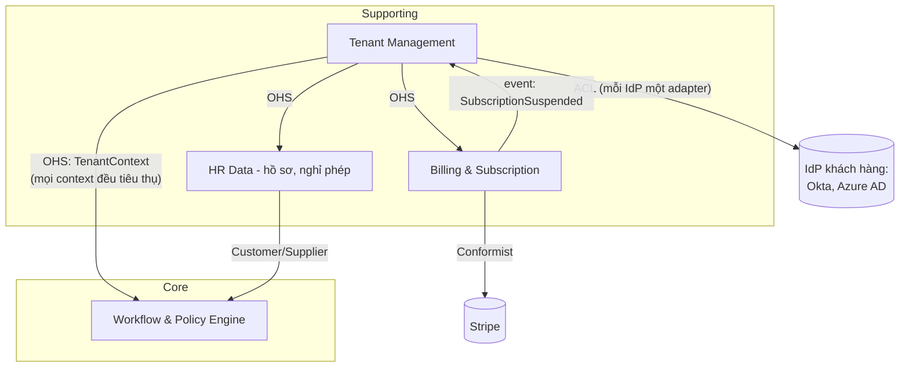
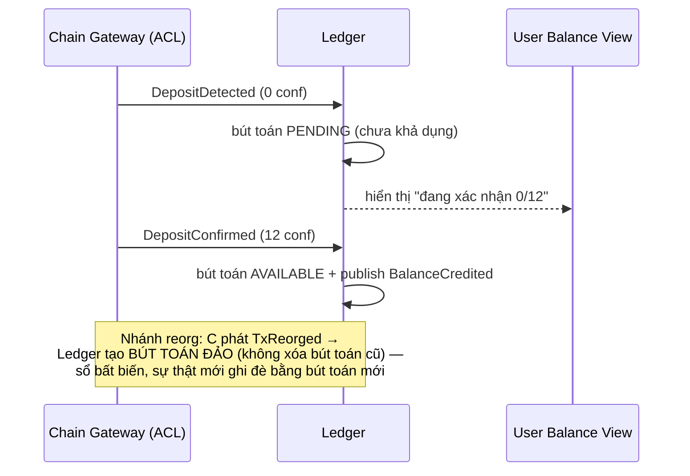
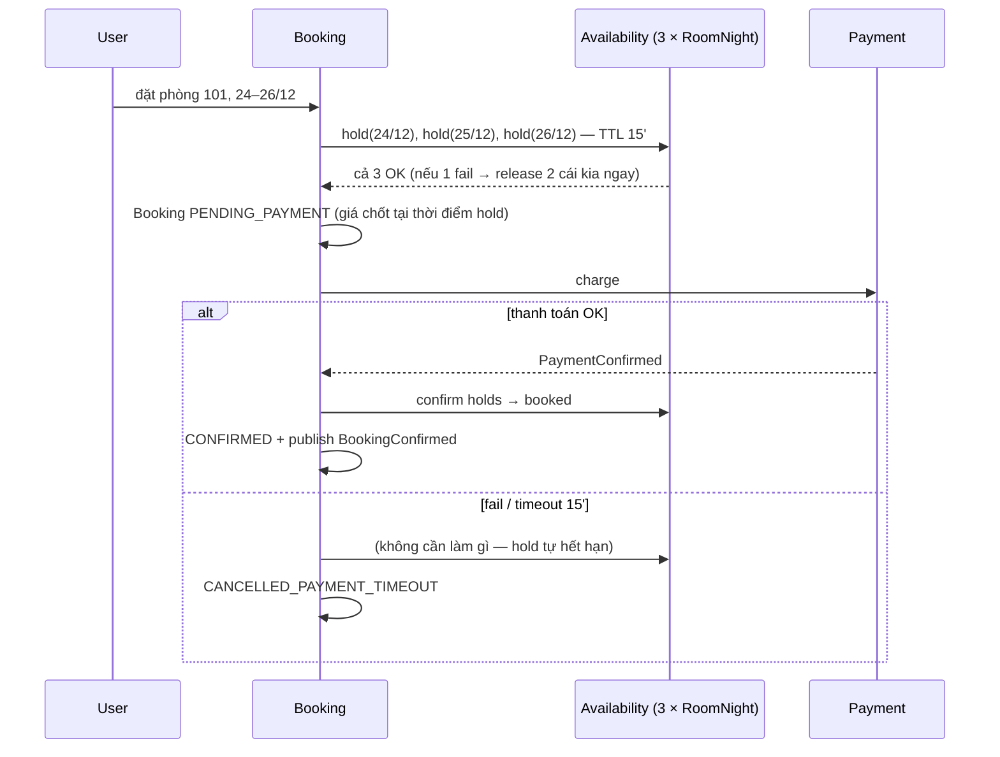
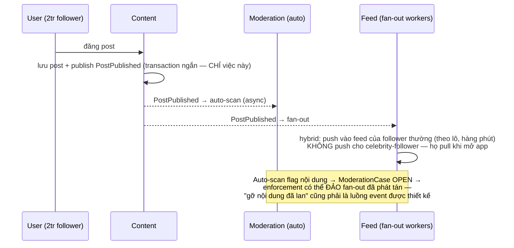

+++
title = "Chương 15b — Case Study: SaaS, Blockchain, Booking System, Social Network"
date = "2026-07-09T23:00:00+07:00"
draft = false
tags = ["backend", "ddd", "architecture"]
series = ["Domain-Driven Design"]
+++

> Vị trí trong bộ tài liệu: nửa sau của phần case study. [Chương 15a](/series/domain-driven-design/15a-case-study-ecommerce-fintech-banking-logistics/) đi qua bốn ngành "kinh điển"; chương này chọn bốn ngành ở các **thái cực khác nhau của trục nhất quán**: SaaS (ranh giới tenant là luật sống còn), Blockchain exchange (nguồn sự thật nằm một nửa ngoài hệ thống của bạn), Booking (tranh chấp tài nguyên theo thời gian — bài toán strong consistency thuần khiết nhất), và Social Network (read-heavy, eventual consistency là mặc định nhưng moderation phức tạp bất ngờ). Đọc bốn ngành cạnh nhau để thấy: cùng một bộ pattern, liều lượng và điểm đặt hoàn toàn khác nhau — đó chính là kỹ năng của kiến trúc sư.

## 1. SaaS B2B multi-tenant

### 1.1. Bối cảnh và điểm phức tạp đặc thù

Một SaaS quản lý nhân sự bán cho 2.000 doanh nghiệp. Điểm phức tạp không nằm ở nghiệp vụ HR — nó nằm ở chữ **multi-tenant**: (1) dữ liệu của tenant A lộ sang tenant B là sự cố *chấm dứt hợp đồng và lên báo*, nghiêm trọng hơn mọi bug nghiệp vụ; (2) mỗi tenant muốn hệ thống hơi khác nhau (custom field, workflow riêng, policy nghỉ phép riêng) — sức ép "thêm cái if cho khách X" bào mòn model từng ngày; (3) billing theo subscription có vòng đời riêng phức tạp (trial, nâng/hạ gói giữa kỳ, proration, dunning); (4) vận hành một bản code cho 2.000 khách nghĩa là mọi migration, mọi feature flag đều nhân 2.000 rủi ro.

### 1.2. Phân rã domain — Core/Supporting/Generic

| Subdomain | Loại | Vì sao |
|---|---|---|
| Nghiệp vụ HR lõi (workflow duyệt, policy engine cấu hình theo tenant) | **Core** | Khách chọn bạn thay vì đối thủ vì workflow linh hoạt mà không cần code riêng — đây là lợi thế cạnh tranh |
| Tenant & Identity (provisioning, isolation, SSO/SAML) | **Supporting** (nhưng rủi ro cao nhất) | Không tạo khác biệt bán hàng, nhưng làm sai là chết — đầu tư vào *độ chắc*, không phải độ giàu model |
| Billing & Subscription | Supporting | Phức tạp nhưng ngành đã giải sẵn phần lớn |
| Notification, file storage, audit log | Generic | Mua/dùng dịch vụ |

Bài học đáng giá của ngành SaaS: **loại subdomain và mức độ rủi ro là hai trục khác nhau**. Tenant isolation là Supporting theo trục cạnh tranh nhưng là số một theo trục rủi ro — nó xứng đáng với kỹ sư giỏi và test dày, dù model của nó không cần "giàu".

### 1.3. Context map



Điểm đáng chú ý: **Tenant Management là Open Host Service nội bộ** — mọi context tiêu thụ `TenantContext` (tenant nào, gói nào, feature nào bật) qua một hợp đồng chuẩn, không context nào tự query bảng tenant. Billing conform theo Stripe (không đàm phán được, và billing không phải chỗ tạo khác biệt) nhưng phát event nghiệp vụ của *mình* (`SubscriptionSuspended`) để Tenant Management phản ứng — dịch từ ngôn ngữ Stripe sang ngôn ngữ nội bộ xảy ra một lần tại biên.

### 1.4. Aggregate quan trọng nhất: Tenant — và invariant "isolation"

Điều tinh tế: isolation **không phải** invariant của một aggregate — nó là bất biến *xuyên suốt mọi truy cập dữ liệu*. Vì thế nó không được bảo vệ bằng model mà bằng **kiến trúc ba tầng chốt chặn**, và đây là ví dụ hay nhất về việc DDD phải bắt tay với hạ tầng:

```typescript
// 1. TenantId là Value Object bắt buộc trong identity của MỌI aggregate thuộc tenant
export class LeaveRequest {
  private constructor(
    readonly id: LeaveRequestId,
    readonly tenantId: TenantId,      // không có đường tạo aggregate thiếu tenantId
    private state: LeaveRequestState,
    // ...
  ) {}
}

// 2. Repository nhận TenantContext qua constructor — KHÔNG phải qua tham số từng method
export interface LeaveRequestRepository {
  findById(id: LeaveRequestId): Promise<LeaveRequest | null>;
  // KHÔNG có findByIdAcrossTenants — API không cho phép diễn đạt câu hỏi sai
}

@Injectable({ scope: Scope.REQUEST })
export class PgLeaveRequestRepository implements LeaveRequestRepository {
  constructor(private readonly tenant: TenantContext, private readonly ds: DataSource) {}
  async findById(id: LeaveRequestId) {
    // mọi query tự động kèm tenant_id — dev KHÔNG THỂ quên
    const row = await this.ds.query(
      `SELECT * FROM leave_requests WHERE id = $1 AND tenant_id = $2`,
      [id.value, this.tenant.tenantId],
    );
    // ...
  }
}

// 3. Tầng chốt cuối: Postgres Row-Level Security — kể cả khi code có bug,
//    session không SET app.tenant_id thì không đọc được gì
// CREATE POLICY tenant_isolation ON leave_requests
//   USING (tenant_id = current_setting('app.tenant_id')::uuid);
```

Còn aggregate `Tenant` thật thì giữ invariant vòng đời: trạng thái (`TRIAL → ACTIVE → SUSPENDED → CHURNED`) với rule chuyển ("SUSPENDED chỉ khi hết dunning window", "CHURNED phải qua export dữ liệu"), giới hạn theo gói (số user, feature flags) — các rule mà nếu rải ở service sẽ tạo ra tenant "vừa suspended vừa được tạo user mới".

### 1.5. Domain event quan trọng và luồng chính

`TenantProvisioned`, `SubscriptionUpgraded`, `SubscriptionPaymentFailed`, `TenantSuspended`, `TenantChurned`, `DataExportRequested`.

```mermaid
sequenceDiagram
    participant S as Stripe (webhook)
    participant B as Billing
    participant T as Tenant Mgmt
    participant N as Notification
    S->>B: invoice.payment_failed
    B->>B: Dunning policy: retry 3 lần / 14 ngày
    B->>B: hết window → publish SubscriptionSuspended
    B-->>T: SubscriptionSuspended (integration event)
    T->>T: Tenant → SUSPENDED (soft lock: đọc được, không ghi được)
    T-->>N: TenantSuspended → email admin của tenant
    Note over B,T: Billing KHÔNG ra lệnh cho Tenant.<br/>Nó thông báo sự kiện; policy "suspended nghĩa là gì"<br/>thuộc về Tenant Management.
```

### 1.6. Trade-off đặc thù ngành

- **Isolation theo tầng nào**: schema-per-tenant (cách ly mạnh, 2.000 schema là ác mộng migration) vs row-level + RLS (vận hành một schema, phụ thuộc kỷ luật + RLS) vs database-per-tenant cho khách enterprise trả tiền riêng. Đa số SaaS trưởng thành đi **hybrid**: row-level mặc định, database riêng bán như một dòng sản phẩm.
- **Tùy biến theo tenant vs một model chung**: mỗi "cái if cho khách X" là một nhát cắt vào model. Lời giải DDD: nâng sự tùy biến lên thành **khái niệm domain** — `PolicyDefinition` mà tenant cấu hình, engine thực thi — thay vì if rải trong code. Đắt hơn lúc đầu, sống được với 2.000 tenant.
- **Nhất quán billing↔access**: khách trả tiền xong phải được mở khóa *ngay* (eventual vài giây là chấp nhận được nhưng phải có đường ép sync khi khách đang gọi CS).

### 1.7. Lỗi thiết kế thường gặp

1. **`tenant_id` là tham số method rải khắp nơi** thay vì nằm trong context/identity — chỉ cần một dev quên một chỗ là có sự cố cross-tenant. Cách chống đúng là làm cho *lỗi không thể diễn đạt được* (mục 1.4).
2. **Billing logic bám theo model Stripe toàn hệ thống** — `if (subscription.status === 'past_due')` xuất hiện ở 30 file: đổi PSP hoặc thêm phương thức thanh toán nội địa (rất thật ở Việt Nam) là viết lại. Ngôn ngữ Stripe phải dừng ở biên Billing.
3. **Feature flag ăn vào domain logic** — `if (tenant.hasFeature('advanced_workflow'))` bên trong aggregate: model giờ phụ thuộc hệ thống flag. Đúng bài: flag quyết định ở application layer (use case nào được gọi), domain model không biết flag tồn tại.

### 1.8. Khi scale ×100

200.000 tenant: RLS + một database đụng trần → sharding theo tenant_id (may mắn: tenant là ranh giới shard *tự nhiên* — không có transaction xuyên tenant, đây là phần thưởng của việc model đúng từ đầu). Noisy neighbor thành vấn đề chính → rate limit và resource quota theo tenant trở thành khái niệm domain thật (`TenantQuota` aggregate). Migration schema chuyển sang kiểu rolling theo cohort tenant, và "tenant vừa nâng cấp thấy tính năng mới, tenant chưa migrate thì chưa" phải trở thành trạng thái nghiệp vụ tường minh.

---

## 2. Blockchain — sàn giao dịch / custody (phần off-chain)

### 2.1. Bối cảnh và điểm phức tạp đặc thù

Sàn giao dịch crypto có hai nguồn sự thật: **on-chain** (blockchain — bạn không kiểm soát, chỉ quan sát; giao dịch có thể bị reorg trong N block đầu) và **off-chain** (sổ nội bộ của sàn — nơi 99% giao dịch của user thực sự diễn ra, vì khớp lệnh on-chain thì chậm và đắt). Toàn bộ độ khó nằm ở đường biên hai thế giới: nạp tiền (on-chain → ghi có off-chain), rút tiền (ghi nợ off-chain → phát on-chain), và **không được sai một satoshi** ở bất kỳ khâu nào. Thêm gia vị: địa chỉ nạp phải sinh đúng, phí gas biến động, node RPC lúc trả lúc không, và kẻ tấn công chủ động tìm race condition để double-withdraw.

### 2.2. Phân rã domain

| Subdomain | Loại | Vì sao |
|---|---|---|
| Ledger nội bộ (số dư, ghi sổ) | **Core** | Sai là mất tiền thật của khách — và độ tin của ledger LÀ sản phẩm |
| Matching engine (khớp lệnh) | **Core** | Hiệu năng và công bằng khớp lệnh là lợi thế cạnh tranh trực tiếp |
| Chain Gateway (quan sát chain, phát tx, quản lý confirmation) | Supporting | Khó về kỹ thuật nhưng không khác biệt giữa các sàn — độ chắc quan trọng hơn độ giàu model |
| Custody/Key management (ví nóng/lạnh) | Supporting, rủi ro tối đa | Như tenant isolation của SaaS: không phải chỗ "giàu model", là chỗ "không được sai" |
| KYC/AML | Generic | Mua (Sumsub, Chainalysis) + ACL |

### 2.3. Aggregate quan trọng nhất: Account (ledger) + Withdrawal — và ranh giới với thế giới on-chain

Ledger off-chain dùng đúng bài double-entry của chương 15a (FinTech): **số dư không phải cột UPDATE — nó là tổng của các bút toán bất biến**. Điểm mới của ngành này là aggregate `Withdrawal` — một *process aggregate* quản lý vòng đời xuyên hai thế giới:

```go
// internal/withdrawal/domain/withdrawal.go
type WithdrawalState string

const (
    StateRequested   WithdrawalState = "REQUESTED"    // user yêu cầu
    StateRiskHeld    WithdrawalState = "RISK_HELD"    // chờ risk review (số lớn)
    StateDebited     WithdrawalState = "DEBITED"      // ĐÃ trừ ledger — trước khi phát tx!
    StateBroadcast   WithdrawalState = "BROADCAST"    // tx đã vào mempool
    StateConfirmed   WithdrawalState = "CONFIRMED"    // đủ N confirmation
    StateFailed      WithdrawalState = "FAILED"       // tx fail → bút toán hoàn
)

type Withdrawal struct {
    id       WithdrawalID
    account  AccountID
    amount   Money
    address  ChainAddress
    state    WithdrawalState
    txHash   *TxHash
    Version  int
    events   []DomainEvent
}

// Invariant then chốt: KHÔNG BAO GIỜ broadcast khi chưa DEBITED.
// Trừ sổ trước, phát tiền sau — nếu broadcast fail thì hoàn bút toán;
// chiều ngược lại (phát trước trừ sau) là lỗ hổng double-withdraw kinh điển.
func (w *Withdrawal) MarkDebited(entry LedgerEntryID) error {
    if w.state != StateRequested && w.state != StateRiskHeld {
        return ErrInvalidTransition
    }
    w.state = StateDebited
    w.events = append(w.events, WithdrawalDebited{ID: w.id, Entry: entry})
    return nil
}
```

Chain Gateway đứng sau **ACL dày nhất hệ thống**: nó dịch thực tại hỗn loạn của blockchain (mempool, reorg, gas spike) thành các sự kiện sạch trong ngôn ngữ nội bộ: `DepositDetected(unconfirmed)`, `DepositConfirmed(n=12)`, `TxReorged`. Phần còn lại của hệ thống **không biết RPC node là gì** — và rule "coi như tiền thật từ confirmation thứ mấy" là **policy nghiệp vụ theo từng chain** nằm ở domain, không phải hằng số chôn trong gateway.

### 2.4. Luồng event chính — nạp tiền với reorg



### 2.5. Trade-off đặc thù

- **Strong consistency ở ledger, eventual với chain**: nội bộ sàn — mọi thao tác số dư là transaction ACID trên ledger (một aggregate Account, optimistic lock). Với chain thì *không có lựa chọn* — bạn eventual theo định nghĩa, việc của model là làm trạng thái chờ (`PENDING`, `BROADCAST`) thành khái niệm nghiệp vụ hạng nhất thay vì che giấu nó.
- **Ví nóng/lạnh**: giữ nhiều tiền ở ví nóng = rút nhanh, rủi ro hack lớn; ít = an toàn, khách chờ. Ngưỡng và quy trình chuyển quỹ là **domain policy có chủ** (risk team), không phải config của devops.
- **Idempotency là sống còn theo nghĩa đen**: retry một lệnh broadcast không idempotent = gửi tiền hai lần on-chain — *không có compensation nào lấy lại được*. Mọi tầng của chương 13.6 áp ở mức nghiêm ngặt nhất.

### 2.6. Lỗi thiết kế thường gặp

1. **Balance là cột UPDATE** thay vì ledger bút toán — không audit được, không đối soát được với on-chain, và race condition ăn tiền thật. (Đây là lỗi số 1 của mọi hệ thống tiền, nhắc lại từ 15a vì ở ngành này nó chí mạng nhất.)
2. **Broadcast trước, trừ sổ sau** — cửa sổ double-withdraw; kẻ tấn công *chủ động* spam rút tiền để tìm đúng cửa sổ này.
3. **Model nội bộ bám theo cấu trúc dữ liệu của chain/RPC** — `vout`, `nonce`, `gasPrice` xuất hiện trong ledger: đổi chain mới (thêm Solana bên cạnh EVM) là viết lại ledger. ACL của Chain Gateway tồn tại chính để chặn điều này.
4. **Coi confirmation là boolean** — "đã confirm chưa?" thay vì "bao nhiêu conf / policy chain này cần bao nhiêu": đến ngày reorg sâu hơn ngưỡng là mất tiền và mất luôn khả năng giải thích.

### 2.7. Khi scale ×100

Matching engine tách hẳn thành lõi in-memory hiệu năng cao (không ORM, không repository per-order — sổ lệnh sống trong RAM, event-sourced xuống đĩa để recovery: đây là chỗ **event sourcing xứng đáng**, chương 13.5). Ledger shard theo account. Đối soát on-chain ↔ off-chain từ batch hằng ngày thành pipeline streaming liên tục với ngân sách lệch = 0. Chain Gateway nhân bản theo chain, mỗi chain một team nhỏ sở hữu adapter.

---

## 3. Booking System — đặt phòng / đặt vé

### 3.1. Bối cảnh và điểm phức tạp đặc thù

Nền tảng đặt phòng khách sạn: 50.000 khách sạn, cao điểm lễ tết 5.000 booking/phút dồn vào một nhóm khách sạn hot. Bản chất bài toán: **N người tranh một tài nguyên gắn với một khoảng thời gian** — phòng 101 đêm 24/12 chỉ bán được một lần. Double-booking không phải bug hiển thị — nó là hai gia đình cùng xuất hiện ở quầy lễ tân đêm Giáng sinh: thiệt hại tiền đền + thiệt hại thương hiệu không đo được. Thêm độ khó: giá đổi theo ngày/mùa/occupancy, chính sách hủy nhiều tầng, no-show và overbooking *có chủ đích* (khách sạn muốn bán 105% vì thống kê 5% hủy), và inventory đến từ nhiều nguồn (kết nối channel manager, OTA khác) có độ trễ.

### 3.2. Phân rã domain

Core: **Availability & Reservation** (chống double-booking ở tốc độ cao — trái tim kỹ thuật) và **Pricing/Revenue management** (trái tim doanh thu). Supporting: quản lý property, chính sách hủy, kết nối channel manager (ACL mỗi đầu nối). Generic: thanh toán, notification, maps.

### 3.3. Aggregate quan trọng nhất — và quyết định ranh giới đáng giá cả hệ thống

Trực giác sai: aggregate `Room` chứa tất cả booking của nó. Phân tích invariant thật: *"không hai booking nào chồng khoảng ngày trên cùng một phòng"* — invariant này chỉ cần **các booking của cùng một phòng trong các khoảng ngày giao nhau** nhất quán với nhau. Booking tháng 12 và booking tháng 3 không liên quan gì nhau — nhét chung một aggregate là mua lock contention vô ích (mọi booking của phòng đó serialize qua một version counter, chết đúng mùa cao điểm).

Ranh giới đúng cho hệ thống lớn: aggregate **`RoomNightAvailability`** — tài nguyên × đơn vị thời gian:

```go
// Aggregate: sự sẵn có của MỘT phòng cho MỘT đêm — đơn vị tranh chấp nhỏ nhất có thể
type RoomNight struct {
    roomID    RoomID
    night     Date        // 2026-12-24
    capacity  int         // thường 1; >1 cho dorm/vé sự kiện
    holds     []Hold      // giữ chỗ tạm có TTL
    booked    int
    Version   int
}

// Invariant duy nhất và rõ như ban ngày:
func (rn *RoomNight) Hold(bookingID BookingID, ttl time.Duration) error {
    if rn.booked+len(rn.activeHolds()) >= rn.capacity {
        return ErrNotAvailable
    }
    rn.holds = append(rn.holds, Hold{bookingID, time.Now().Add(ttl)})
    return nil
}
```

Còn `Booking` là aggregate riêng (vòng đời: `PENDING_PAYMENT → CONFIRMED → CHECKED_IN/CANCELLED/NO_SHOW`, chính sách hủy, giá đã chốt). Đặt phòng 3 đêm = **reservation pattern hai pha**: hold 3 RoomNight (3 transaction nhỏ, mỗi cái optimistic lock riêng) → tạo Booking → thanh toán → confirm các hold thành booked. Hold có **TTL** (15 phút): khách bỏ giỏ thì hold tự hết hạn, không cần dọn tay — đây là semantic lock của saga (chương 13.3) trong dạng thuần khiết nhất.



### 3.4. Trade-off đặc thù: pessimistic vs optimistic vs reservation

- **Pessimistic lock** (`SELECT ... FOR UPDATE` trên room+range): đúng tuyệt đối, dễ hiểu — nhưng serialize mọi truy cập vào phòng hot, và giữ lock qua cả bước thanh toán (3–30 giây!) là tự sát. Chỉ dùng khi luồng ngắn và tranh chấp thấp.
- **Optimistic + version** trên RoomNight: tranh chấp thật mới trả giá; hợp với tải cao khi conflict rate vừa phải.
- **Reservation pattern (hold + TTL)** — như trên: tách "giữ tài nguyên" (nhanh, transaction ngắn) khỏi "hoàn tất giao dịch" (chậm, có thanh toán). Đây là lựa chọn đúng cho hầu hết booking system nghiêm túc, và là ví dụ đẹp về việc *một khái niệm nghiệp vụ có thật* (giữ chỗ — lễ tân khách sạn đã làm thế từ trăm năm trước) giải bài toán kỹ thuật gọn hơn mọi loại lock.
- **Overbooking có chủ đích**: capacity bán = capacity vật lý × hệ số của revenue team — một **policy domain** có version và audit, tuyệt đối không phải con số hardcode. Kèm nó là quy trình nghiệp vụ "walk" (chuyển khách sang khách sạn tương đương) — nhánh thất bại được thiết kế trước, đúng tinh thần saga.

### 3.5. Lỗi thiết kế thường gặp

1. **Check-then-insert không nguyên tử**: `SELECT count(*) ... rồi INSERT booking` — hai request qua cửa check cùng lúc: double-booking. Phải là constraint tầng DB (exclusion constraint trên range của Postgres) *hoặc* aggregate + version — và tốt nhất là cả hai (defense in depth).
2. **Aggregate Room ôm mọi booking lịch sử** — load nghìn booking để thêm một cái; version counter chung làm mùa cao điểm nghẽn đúng phòng bán chạy.
3. **Giá tính lại lúc confirm** thay vì chốt lúc hold — khách thấy 1 triệu, trả tiền xong hóa đơn 1,4 triệu vì pricing engine vừa đổi: mất niềm tin + rủi ro pháp lý. `QuotedPrice` phải là Value Object bất biến gắn vào Booking từ lúc hold.
4. **Hold không TTL, dọn bằng cron "quét booking treo"** — cron chết một đêm là inventory ảo đầy hệ thống; TTL nằm trong invariant của chính Hold thì không có gì để chết.

### 3.6. Khi scale ×100

RoomNight là đơn vị shard tự nhiên (room_id × date — phân bố đều, không hotspot trừ sự kiện đặc biệt). Availability search (đọc) tách hẳn khỏi reservation (ghi) — CQRS mức 2: search chạy trên read model denormalize theo (địa điểm, khoảng giá, ngày), cập nhật từ event `HoldPlaced/BookingConfirmed`, chấp nhận staleness vài giây — sai lệch hiển thị được chốt chặn bởi bước hold (search nói "còn phòng" nhưng hold fail thì UX xử lý "vừa hết, xem phòng tương tự"). Vé sự kiện (10.000 người tranh 1.000 vé trong 1 phút) là chế độ riêng: queue hóa + bán theo lô, không ai sống nổi bằng lock trên từng ghế.

---

## 4. Social Network

### 4.1. Bối cảnh và điểm phức tạp đặc thù

Mạng xã hội 10 triệu user: đọc/ghi tỷ lệ 100:1 trở lên, một post của người nổi tiếng 2 triệu follower phải xuất hiện "ngay" trên 2 triệu feed. Thái cực ngược hẳn ba ngành trên: **hầu như không có gì cần strong consistency** — follower count lệch vài phút, feed thiếu một post trong 30 giây: không ai mất tiền. Nhưng đừng nhầm là dễ: độ phức tạp dồn vào (1) **fan-out** — bài toán phân phối nội dung ở quy mô; (2) **moderation** — nơi nghiệp vụ phức tạp thật sự trú ngụ: luật mỗi nước khác nhau, quy trình khiếu nại nhiều bước, "xóa" có ít nhất năm nghĩa khác nhau (ẩn với người xem, ẩn với tác giả, giữ cho pháp lý, xóa hẳn, ẩn theo khu vực); (3) **privacy** — "ai thấy gì" là ma trận rule thay đổi theo chính sách và pháp luật.

### 4.2. Phân rã domain — và một bất ngờ

Core: **Feed/Ranking** (thuật toán phân phối — lợi thế cạnh tranh số 1) và — bất ngờ với nhiều người — **Moderation & Trust**: nền tảng sống chết với chất lượng không gian nội dung, và đây là vùng *rule dày đặc nhất* toàn hệ thống, xứng đáng domain model giàu nhất. Supporting: Social Graph (follow/block — đơn giản về rule, khủng về scale), Content (post/comment — CRUD trá hình cho tới khi đụng moderation). Generic: media storage/transcoding, push notification.

Nghịch lý đáng ghi nhớ: ở social network, **phần "CRUD nhất" (đăng bài) là phần scale khó nhất, còn phần ít traffic nhất (moderation) lại cần DDD nhất**. Liều lượng pattern phải bám theo trục *độ phức tạp rule*, không phải trục traffic.

### 4.3. Aggregate và ranh giới: Post, ModerationCase — và thứ KHÔNG phải aggregate

`Post` là aggregate khiêm tốn: nội dung, visibility policy, trạng thái moderation-tổng-hợp. **Feed KHÔNG phải aggregate** — nó không có invariant (chẳng có rule nào bắt feed phải "đúng" tại mọi thời điểm); nó là **read model thuần túy**, được dựng từ event. Đây là ví dụ tốt nhất toàn tài liệu về việc *không phải danh từ quan trọng nào cũng là aggregate*. Ngôi sao thật sự là `ModerationCase`:

```typescript
// Aggregate giàu nhất của hệ thống — vòng đời một vụ xử lý nội dung
export class ModerationCase {
  private constructor(
    readonly id: CaseId,
    readonly subject: ContentRef,            // post/comment/account bị báo cáo
    private reports: Report[],               // các báo cáo gộp vào case
    private state: CaseState,                // OPEN → AUTO_ACTIONED | IN_REVIEW → DECIDED → APPEALED → FINAL
    private actions: EnforcementAction[],    // các hành động đã áp: hide, geo-block, strike...
    private legalHold: boolean,              // giữ chứng cứ — chặn xóa vật lý
  ) {}

  applyDecision(d: Decision, reviewer: ReviewerId): void {
    if (this.state === CaseState.FINAL) throw new CaseAlreadyFinal();
    if (d.requiresSeniorReview && !reviewer.isSenior) throw new InsufficientAuthority();
    // "xóa" là một QUYẾT ĐỊNH có nhiều hình thái — không phải DELETE FROM posts:
    this.actions.push(d.toEnforcementAction());
    this.state = CaseState.DECIDED;
    this.record(new ModerationDecided(this.id, this.subject, d)); // Content context sẽ phản ứng
  }
}
```

Điểm thiết kế then chốt: Moderation **không sửa Post trực tiếp** — nó phát `ModerationDecided`, Content context nghe và áp hiệu ứng (ẩn, geo-block). Hai context, hai nhịp phát triển (moderation đổi theo chính sách/luật, content đổi theo sản phẩm), nối bằng event — đúng bài chương 04–05.

### 4.4. Luồng chính: fan-out khi đăng bài



### 4.5. Trade-off đặc thù

- **Push vs pull fan-out**: push (ghi sẵn vào feed từng follower) — đọc nhanh, ghi bùng nổ theo follower count; pull (dựng feed lúc mở app) — ghi rẻ, đọc đắt. Mọi hệ thống lớn đi **hybrid** theo ngưỡng follower — và ngưỡng đó là policy vận hành cần chỉnh được, không phải hằng số.
- **Eventual ở mọi nơi, trừ hai chỗ**: block phải có hiệu lực *cảm giác tức thời* (người bị block còn thấy mình comment được là sự cố an toàn), và enforcement pháp lý (lệnh gỡ theo tòa án) cần đường ưu tiên đồng bộ. Bài học: ngay trong hệ eventual-by-default, việc *nhận diện đúng vài điểm cần nhanh* mới là kỹ năng.
- **Counter chính xác vs xấp xỉ**: like count hiển thị dùng counter xấp xỉ/cache (lệch vài % vô hại); nhưng số liệu trả tiền cho creator thì phải chính xác kiểu ledger — cùng một "con số đếm", hai yêu cầu nhất quán, hai thiết kế.

### 4.6. Lỗi thiết kế thường gặp

1. **Fan-out đồng bộ trong transaction đăng bài** — insert 2 triệu row feed trong transaction của post: timeout, và user thường không đăng nổi bài vì bị celebrity cùng bảng chặn lock. Fan-out là hệ quả async, mãi mãi.
2. **DELETE thật khi "xóa" nội dung** — rồi phát hiện cần giữ cho khiếu nại/pháp lý/điều tra: đã muộn. "Xóa" trong social là *trạng thái hiển thị*, việc xóa vật lý là quy trình riêng theo retention policy.
3. **Social graph JOIN trực tiếp trong mọi query feed** — `JOIN follows ON ...` với bảng tỷ row: chết sớm. Graph là context riêng với store tối ưu riêng, các context khác tiêu thụ qua API/event chứ không JOIN.
4. **Moderation làm bằng if trong Content service** — `if (report_count > 5) post.hidden = true`: sáu tháng sau chính sách phức tạp lên (khu vực, khiếu nại, mức phạt lũy tiến) và mớ if đó không ai dám sửa. Vùng rule dày phải được thăng cấp thành context có model riêng *sớm*.

### 4.7. Khi scale ×100

1 tỷ user: feed store chuyển hẳn sang hạ tầng chuyên dụng (Redis/RocksDB cluster theo user shard); ranking tách thành hệ ML riêng tiêu thụ event stream — và **event schema trở thành published language quan trọng nhất công ty** (hàng chục hệ downstream ăn `PostPublished`); moderation mọc thành tổ chức người + máy với routing case theo ngôn ngữ/khu vực — Conway's Law hiện nguyên hình: cấu trúc context map của moderation đi theo cấu trúc đội ngũ toàn cầu.

---

## Nhìn lại bốn ngành — một bảng so sánh để mang theo

| | SaaS | Blockchain | Booking | Social |
|---|---|---|---|---|
| Invariant sống còn | Tenant isolation | Ledger khớp on-chain, không double-withdraw | Không double-booking | (Gần như không có — trừ block/legal) |
| Điểm đặt strong consistency | Trong tenant, billing↔access | Ledger nội bộ | RoomNight | Block, enforcement pháp lý |
| Nơi eventual là mặc định | Cross-context | Mọi thứ chạm chain | Search/hiển thị | Gần như mọi nơi |
| Aggregate đáng nhớ | Tenant + TenantContext ba tầng chốt | Withdrawal (process aggregate) | RoomNight (tài nguyên × thời gian) | ModerationCase |
| Bẫy ngành | if-per-tenant, bám model Stripe | broadcast-trước-trừ-sau | check-then-insert, giá tính lại | fan-out đồng bộ, DELETE thật |

Bốn ngành, một bài học: **pattern là bất biến, điểm đặt là nghệ thuật**. Kỹ năng của kiến trúc sư không phải thuộc pattern — mà là nhìn ra invariant nào có thật, đắt bao nhiêu nếu vỡ, và đặt đúng liều thuốc vào đúng chỗ đau.

## Đọc tiếp

Khép lại bộ tài liệu bằng tấm bản đồ những cái bẫy — và câu hỏi quan trọng nhất: khi nào nên để DDD ở nhà: [Chương 16 — Anti-patterns & Khi nào KHÔNG nên dùng DDD](/series/domain-driven-design/16-anti-patterns-va-khi-nao-khong-dung-ddd/).

- Quay lại: [15a — Case Study: E-commerce, FinTech, Banking, Logistics](/series/domain-driven-design/15a-case-study-ecommerce-fintech-banking-logistics/) · [Mục lục](/series/domain-driven-design/00-muc-luc/)
