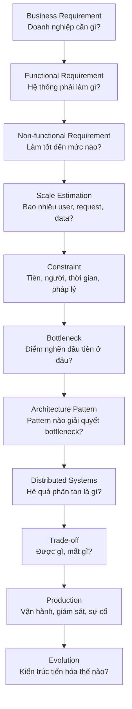

+++
title = "00. Tư Duy Thiết Kế Hệ Thống"
date = "2026-07-13T05:10:00+07:00"
draft = false
tags = ["backend", "system-design"]
series = ["System Design — Tư Duy Thiết Kế Hệ Thống"]
+++

> Chương này là nền móng của toàn bộ tài liệu. Nếu bạn chỉ đọc một chương, hãy đọc chương này.

---

## 1. Vấn đề của cách học System Design phổ biến

Phần lớn tài liệu System Design trên thị trường dạy theo kiểu: "Design Twitter thì dùng fan-out, design Uber thì dùng geohash, design URL shortener thì dùng base62". Người học ghi nhớ **ánh xạ từ đề bài sang lời giải**, không hiểu vì sao lời giải tồn tại.

Hệ quả trong thực tế:

- Gặp bài toán không giống đề mẫu → không biết bắt đầu từ đâu.
- Áp kiến trúc của công ty tỷ đô vào startup 5 người → chết vì chi phí vận hành.
- Không giải thích được cho team **vì sao** chọn giải pháp A thay vì B → quyết định kiến trúc trở thành ý kiến cá nhân, không phải phân tích.

Một kỹ sư giỏi không ghi nhớ lời giải. Họ ghi nhớ **chuỗi câu hỏi** dẫn đến lời giải.

---

## 2. Chuỗi tư duy thiết kế

Mọi thiết kế trong tài liệu này đi qua 11 bước:



### Bước 1 — Business Requirement

Mọi hệ thống tồn tại để phục vụ một mục tiêu kinh doanh. Câu hỏi đầu tiên **không bao giờ** là "dùng công nghệ gì" mà là:

- Doanh nghiệp kiếm tiền/tạo giá trị bằng cách nào?
- Điều gì xảy ra với doanh nghiệp nếu hệ thống chậm 1 giây? Nếu sập 1 giờ?
- Tăng trưởng kỳ vọng trong 6–24 tháng tới là bao nhiêu?

Ví dụ: với sàn e-commerce, downtime trong giờ flash sale = mất doanh thu trực tiếp + mất niềm tin. Với hệ thống báo cáo nội bộ, downtime 1 giờ gần như không có hậu quả. Hai hệ thống này **không được phép** có cùng kiến trúc, vì chi phí của kiến trúc HA là có thật.

### Bước 2 — Functional Requirement (FR)

Hệ thống phải làm được gì: đặt hàng, thanh toán, tìm kiếm sản phẩm... FR quyết định **domain model** và **API surface**, nhưng hiếm khi quyết định kiến trúc.

### Bước 3 — Non-functional Requirement (NFR)

Đây mới là thứ quyết định kiến trúc: latency, throughput, availability, consistency, durability, security, cost. Hai hệ thống có cùng FR nhưng khác NFR sẽ có kiến trúc hoàn toàn khác nhau.

> **Quy tắc:** FR quyết định *code*, NFR quyết định *kiến trúc*.

### Bước 4 — Scale Estimation

Ước lượng thô nhưng có kỷ luật: DAU, request/giây, dung lượng dữ liệu, tỷ lệ đọc/ghi. Sai số 2–3 lần chấp nhận được; sai số 100 lần thì thiết kế vô nghĩa. Chi tiết ở [chương 1.4](/series/system-design/01-foundations/04-scale-estimation-capacity-planning/).

### Bước 5 — Constraint

Ràng buộc thực tế thường bị bỏ qua trong sách vở nhưng quyết định 80% lựa chọn thực tế:

- **Tiền:** ngân sách cloud mỗi tháng là bao nhiêu?
- **Người:** team có bao nhiêu engineer? Có ai từng vận hành Kafka chưa?
- **Thời gian:** cần ra thị trường trong 3 tháng hay 2 năm?
- **Pháp lý:** dữ liệu có phải nằm trong lãnh thổ Việt Nam không (Nghị định 13, luật ngân hàng)?

Một thiết kế "đúng về kỹ thuật" nhưng vượt ngân sách hoặc vượt năng lực vận hành của team là một thiết kế **sai**.

### Bước 6 — Bottleneck

Với scale và constraint đã biết, thành phần nào chạm giới hạn đầu tiên? Database? Network? CPU? Đây là câu hỏi trung tâm của thiết kế — kiến trúc tốt là kiến trúc giải quyết đúng bottleneck **hiện tại và sắp tới**, không phải bottleneck tưởng tượng ở quy mô Google.

### Bước 7–8 — Architecture Pattern & Distributed Systems

Chỉ đến bước này mới nói đến pattern: cache, queue, sharding, microservices... Và mỗi khi một pattern kéo hệ thống từ 1 máy sang nhiều máy, các định luật của Distributed Systems (CAP, consensus, partial failure) bắt đầu chi phối — không thể né tránh, chỉ có thể lựa chọn cách đối mặt.

### Bước 9 — Trade-off

Không có giải pháp miễn phí. Mỗi quyết định phải trả lời: được gì, mất gì, chi phí bao nhiêu, rủi ro gì, có lựa chọn khác không.

### Bước 10 — Production

Thiết kế chưa xong khi vẽ xong diagram. Nó xong khi trả lời được: deploy thế nào, rollback thế nào, giám sát bằng metric gì, alert khi nào, ai bị đánh thức lúc 3 giờ sáng và họ sẽ nhìn vào dashboard nào.

### Bước 11 — Evolution

Kiến trúc đúng hôm nay sẽ sai trong 18 tháng nếu hệ thống tăng trưởng. Thiết kế tốt không phải thiết kế "chịu được mọi tương lai" — mà là thiết kế **dễ thay đổi khi tương lai đến**. Toàn bộ [Phần 12](/series/system-design/12-evolution/00-tong-quan/) dành cho chủ đề này.

---

## 3. First Principles — tư duy từ nguyên lý gốc

Khi đứng trước bất kỳ công nghệ hay pattern nào, hãy hỏi 3 câu:

1. **Vì sao nó tồn tại?** Nó sinh ra để giải quyết vấn đề vật lý/toán học nào? (Cache tồn tại vì RAM nhanh hơn disk ~1000 lần và vì locality of reference. Queue tồn tại vì producer và consumer có tốc độ khác nhau.)
2. **Nếu bỏ nó đi thì chuyện gì xảy ra?** Nếu câu trả lời là "không sao cả" — bỏ nó đi. Mỗi thành phần trong hệ thống là một thứ phải vận hành, giám sát, vá lỗi, và trả tiền.
3. **Giả định nào đang được đặt ra?** Cache giả định dữ liệu đọc nhiều hơn ghi. Sharding giả định dữ liệu phân bố đều theo shard key. Khi giả định sai, giải pháp trở thành vấn đề.

### Vài con số vật lý nên thuộc lòng

Kiến trúc bị chi phối bởi vật lý. Các độ trễ cơ bản (bậc độ lớn, đủ dùng để ước lượng):

| Thao tác | Độ trễ (~) |
|---|---|
| Đọc L1 cache | 1 ns |
| Đọc RAM | 100 ns |
| Đọc 1MB tuần tự từ RAM | 0.25 ms |
| Round-trip trong cùng datacenter | 0.5 ms |
| Đọc 1MB tuần tự từ SSD | 1 ms |
| Random read SSD | 0.1 ms |
| Đọc 1MB tuần tự từ HDD | 20 ms |
| Round-trip HCM ↔ Singapore | ~30 ms |
| Round-trip HCM ↔ US West | ~180 ms |
| Round-trip xuyên Đại Tây Dương | ~80 ms |

Từ bảng này suy ra được rất nhiều quyết định kiến trúc mà không cần đọc sách:

- RAM nhanh hơn disk 3–4 bậc độ lớn → **cache tồn tại**.
- Round-trip liên lục địa ~100–200ms → **multi-region không thể có synchronous replication xuyên region với latency thấp** → phải chọn giữa consistency và latency (chính là PACELC).
- Network trong DC ~0.5ms → mỗi lần tách 1 service là cộng thêm ít nhất 1ms round-trip + serialize/deserialize → **chatty microservices chậm là tất yếu, không phải lỗi implementation**.

---

## 4. Trade-off — ngôn ngữ của Architect

Junior nói: "Giải pháp A tốt hơn giải pháp B."
Architect nói: "Giải pháp A đổi X lấy Y; với bài toán của ta, Y đáng giá hơn X vì Z."

Các trục trade-off lặp lại trong mọi thiết kế:

| Trục | Bản chất |
|---|---|
| Simplicity vs Scalability | Hệ thống đơn giản dễ vận hành nhưng có trần; hệ thống scale được thì phức tạp và đắt |
| Consistency vs Availability | Khi network partition xảy ra, phải chọn một (CAP) |
| Latency vs Throughput | Batch tăng throughput nhưng tăng latency; xử lý từng item thì ngược lại |
| Cost vs Reliability | Mỗi "số 9" availability tăng thêm thường đắt gấp ~10 lần |
| Sync vs Async | Sync dễ suy luận, dễ debug; async chịu tải tốt, cô lập lỗi, nhưng khó trace |
| Build vs Buy | Tự vận hành rẻ hơn ở scale lớn, managed service rẻ hơn ở scale nhỏ (tính cả lương engineer) |

**Chi phí của mỗi "số 9":** 99% availability = 3.65 ngày downtime/năm, chấp nhận được với tool nội bộ. 99.9% = 8.7 giờ/năm. 99.99% = 52 phút/năm — bắt đầu cần redundancy đa tầng, on-call nghiêm túc. 99.999% = 5.2 phút/năm — cần multi-region active-active, chi phí hạ tầng và nhân sự tăng theo cấp số nhân. Câu hỏi đúng không phải "làm sao đạt 5 số 9" mà là "business có thật sự cần quá 3 số 9 không".

---

## 5. Quy mô quyết định kiến trúc

Cùng một bài toán, lời giải đúng thay đổi hoàn toàn theo quy mô:

| Quy mô | Kiến trúc phù hợp | Vì sao |
|---|---|---|
| < 10K user, team 1–5 người | Monolith + 1 RDBMS + backup | Mọi thứ khác là lãng phí. Bottleneck là tốc độ ra feature, không phải tải |
| 10K–100K user | Monolith + Redis + read replica + worker | Bottleneck bắt đầu là DB đọc và các tác vụ chậm (email, ảnh) |
| 100K–1M user | Modular Monolith + MQ + LB nhiều instance | Bottleneck là tổ chức code và khả năng deploy độc lập từng phần |
| 1M–10M user, nhiều team | Tách dần microservices theo domain | Bottleneck là **con người**: các team giẫm chân nhau khi deploy |
| > 10M user, toàn cầu | Event-driven, CQRS, multi-region có chọn lọc | Bottleneck là giới hạn vật lý của single region và single DB |

> **Nhận xét quan trọng:** từ mức 1M user trở lên, bottleneck chuyển từ *kỹ thuật* sang *tổ chức*. Microservices trước hết là lời giải cho bài toán scale **team**, sau đó mới là scale **hệ thống**. Đây là lý do "premature microservices" là anti-pattern phổ biến nhất: áp lời giải của bài toán tổ chức 200 người vào công ty 8 người.

---

## 6. Ghi lại quyết định — Architecture Decision Record (ADR)

Quyết định kiến trúc không được ghi lại sẽ bị nghi ngờ, đảo ngược, hoặc lặp lại sai lầm sau 2 năm khi người ra quyết định đã nghỉ. Mỗi quyết định lớn nên có một ADR ngắn:

```markdown
# ADR-007: Dùng RabbitMQ thay vì Kafka cho hàng đợi email

## Bối cảnh
Cần gửi ~50K email/ngày (peak 20/giây), yêu cầu retry, không yêu cầu replay lịch sử.

## Quyết định
RabbitMQ.

## Lý do
- Throughput yêu cầu (20 msg/s) thấp hơn năng lực RabbitMQ 3 bậc độ lớn.
- Cần per-message retry + dead letter queue: RabbitMQ hỗ trợ sẵn.
- Không cần replay/retention: bỏ qua lợi thế chính của Kafka.
- Team chưa ai vận hành Kafka; chi phí học + vận hành ZooKeeper/KRaft không được đền đáp.

## Trade-off chấp nhận
- Nếu sau này cần event streaming (analytics real-time), sẽ phải thêm Kafka riêng.

## Điều kiện xem xét lại
- Lưu lượng vượt 5K msg/s, hoặc xuất hiện nhu cầu replay event.
```

Chú ý mục cuối: **điều kiện xem xét lại**. Quyết định kiến trúc tốt luôn kèm theo "khi nào quyết định này hết đúng".

---

## 7. Bốn cấp độ trưởng thành trong tư duy thiết kế

**Level 1 — System Thinking:** biết biến yêu cầu mơ hồ thành FR/NFR đo được, ước lượng scale, lập capacity plan. *(Phần 1)*

**Level 2 — Architecture:** hiểu Layered, Clean Architecture, Modular Monolith, Microservices — và quan trọng hơn: hiểu chúng là các điểm trên một trục tiến hóa, không phải các lựa chọn ngang hàng. *(Phần 12, giai đoạn 1–6)*

**Level 3 — Distributed Systems:** hiểu consistency, replication, consensus, partition, availability ở mức nguyên lý — đủ để dự đoán hành vi của bất kỳ hệ phân tán nào khi có sự cố. *(Phần 4)*

**Level 4 — Principal:** thiết kế multi-region, disaster recovery, và trên hết là **evolutionary architecture** — kiến trúc được thiết kế để thay đổi. Ở level này, câu hỏi trung tâm là chi phí, rủi ro và con người, không còn là công nghệ. *(Phần 12 giai đoạn 9–10, Phần 13)*

---

## 8. Checklist tư duy trước mọi bài toán thiết kế

Trước khi vẽ bất kỳ diagram nào, viết ra giấy câu trả lời cho:

1. Business cần gì và điều gì xảy ra khi hệ thống fail?
2. FR cốt lõi (≤ 7 gạch đầu dòng)?
3. NFR đo được: latency p99? availability? consistency ở mức nào là đủ?
4. Scale: bao nhiêu user, RPS đọc/ghi, dung lượng dữ liệu năm 1 và năm 3?
5. Constraint: ngân sách, team size, deadline, pháp lý?
6. Bottleneck đầu tiên sẽ xuất hiện ở đâu, ở mức tải nào?
7. Kiến trúc đơn giản nhất giải quyết được bottleneck đó là gì?
8. Trade-off của nó? Khi nào nó hết đúng?
9. Vận hành nó cần gì: metric, alert, runbook, on-call?
10. Bước tiến hóa tiếp theo (khi tải tăng 10 lần) là gì — và thiết kế hiện tại có chặn đường đó không?

Câu 7 và câu 10 là hai câu quan trọng nhất: **chọn giải pháp đơn giản nhất đủ dùng, nhưng không tự khóa cửa tương lai.**

---

*Tiếp theo: [1.1. Functional & Non-functional Requirements](/series/system-design/01-foundations/01-requirements/)*
