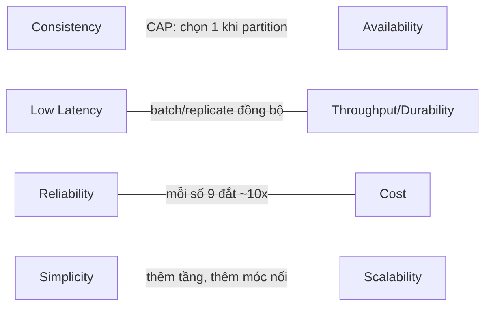

+++
title = "1.1. Functional & Non-functional Requirements"
date = "2026-07-13T05:20:00+07:00"
draft = false
tags = ["backend", "system-design"]
series = ["System Design — Tư Duy Thiết Kế Hệ Thống"]
+++

## 1. Problem Statement

Mọi thất bại kiến trúc lớn đều bắt nguồn từ một trong hai lỗi:

1. **Thiết kế cho yêu cầu không tồn tại** — xây hệ thống chịu 100K RPS cho sản phẩm có 200 user.
2. **Bỏ sót yêu cầu ngầm** — không ai nói "hệ thống thanh toán không được mất tiền khi crash", vì ai cũng nghĩ điều đó hiển nhiên; cho đến khi nó xảy ra.

Requirements engineering trong system design không phải thủ tục giấy tờ. Nó là công cụ **định giá**: mỗi yêu cầu có một chi phí kiến trúc, và việc của Architect là làm chi phí đó hiện hình trước khi viết dòng code đầu tiên.

## 2. Functional Requirement — hệ thống làm gì

FR mô tả hành vi: "user đặt hàng", "hệ thống gửi email xác nhận", "admin xem báo cáo doanh thu theo ngày".

Kỹ thuật thu thập FR hiệu quả nhất cho system design là **liệt kê theo actor và use case chính**, giới hạn ở 5–9 use case cốt lõi. Quá số đó nghĩa là chưa biết đâu là cốt lõi.

Điều quan trọng hơn liệt kê FR là **phân loại FR theo hệ quả kiến trúc**:

| Loại FR | Ví dụ | Hệ quả kiến trúc |
|---|---|---|
| Read-heavy | Xem sản phẩm, đọc feed | Cache, read replica, CDN |
| Write-heavy | Ghi log, tracking, IoT ingest | Append-only store, batch, queue |
| Read-modify-write có tranh chấp | Trừ tồn kho, chuyển tiền | Transaction, lock, hoặc thiết kế lại để tránh tranh chấp |
| Fan-out | 1 hành động ảnh hưởng N user (post → followers) | Async, queue, precompute |
| Long-running | Encode video, xuất báo cáo | Background worker, job queue, trạng thái tiến trình |
| Real-time | Chat, vị trí tài xế | WebSocket/SSE, pub/sub |

Hai hệ thống cùng là "e-commerce" nhưng một bên bán 100 SKU độc quyền (tranh chấp tồn kho cực cao) và một bên là marketplace 10 triệu SKU (tranh chấp thấp, tìm kiếm là trung tâm) sẽ có kiến trúc khác nhau từ gốc.

## 3. Non-functional Requirement — làm tốt đến mức nào

NFR là các thuộc tính chất lượng. Đây là phần quyết định kiến trúc, và cũng là phần thường bị phát biểu sai nhất.

### 3.1. NFR phải đo được

Phát biểu sai: "Hệ thống phải nhanh và ổn định."
Phát biểu đúng: "API đặt hàng có latency p99 ≤ 500ms tại tải 2× peak dự kiến; availability ≥ 99.9% tính theo tháng; không mất đơn hàng đã xác nhận trong mọi tình huống crash một node."

Một NFR đo được có 3 thành phần: **metric** (p99 latency), **ngưỡng** (≤ 500ms), **điều kiện** (tại tải 2× peak). Thiếu điều kiện thì ngưỡng vô nghĩa — hệ thống nào cũng nhanh khi không có tải.

### 3.2. Danh mục NFR cốt lõi

**Performance:** latency (p50/p95/p99 — xem [chương 1.3](/series/system-design/01-foundations/03-throughput-latency/)), throughput (RPS), độ trễ xử lý background (job hoàn thành trong bao lâu).

**Availability:** tỷ lệ thời gian hệ thống phục vụ được request hợp lệ. Phải định nghĩa rõ "phục vụ được" — trả 200 nhưng mất 30 giây có tính là available không? (Nên đo bằng SLI, xem [chương 1.2](/series/system-design/01-foundations/02-sla-slo-sli/).)

**Consistency & Durability:** dữ liệu ghi rồi có đọc lại được ngay không (consistency)? Ghi rồi có mất không khi crash (durability)? Hai câu hỏi này định hình toàn bộ tầng data. "Đơn hàng đã thanh toán" cần strong consistency + durability tuyệt đối. "Số lượt xem sản phẩm" chấp nhận eventual consistency và mất mát nhỏ.

**Scalability:** không phải "chịu được nhiều tải" mà là "chi phí tăng tuyến tính (hoặc chậm hơn) theo tải". Hệ thống scale kém là hệ thống mà tải tăng 2× thì chi phí tăng 10× hoặc phải viết lại.

**Security & Compliance:** authentication, authorization, mã hóa, audit log, và ràng buộc pháp lý (dữ liệu cá nhân theo Nghị định 13/2023 tại Việt Nam, PCI-DSS nếu chạm thẻ, quy định NHNN nếu là ngân hàng).

**Operability:** hệ thống có deploy được nhiều lần mỗi ngày không? Có rollback trong 5 phút không? Người trực có chẩn đoán được sự cố qua dashboard không? NFR này quyết định tốc độ phát triển dài hạn nhiều hơn mọi NFR khác.

### 3.3. NFR mâu thuẫn nhau — và đó là điểm mấu chốt

NFR không thể tối đa đồng thời:

Việc của Architect là ép stakeholder **xếp hạng ưu tiên**: "Nếu phải chọn giữa việc user thấy tồn kho trễ 2 giây và việc trang sản phẩm chậm thêm 200ms, chọn gì?" Câu trả lời cho các câu hỏi kiểu này chính là bản thiết kế.

## 4. First Principles

**Vì sao phải tách FR và NFR?** Vì chúng thay đổi với tốc độ khác nhau và do những người khác nhau quyết định. FR do product quyết định, thay đổi hàng tuần. NFR do quy mô và bản chất business quyết định, thay đổi hàng năm. Kiến trúc gắn với NFR nên kiến trúc phải ổn định hơn feature — nếu mỗi feature mới đòi thay kiến trúc, kiến trúc đã sai.

**Nếu bỏ qua bước NFR thì sao?** Hệ thống sẽ được thiết kế theo NFR *mặc định của framework* — thường là: consistency của một RDBMS đơn, availability của một máy đơn, scale của một máy đơn. Với đa số hệ thống nhỏ, mặc định này... đúng! Đó là lý do bỏ qua NFR "có vẻ ổn" trong 2 năm đầu, và là lý do các hệ thống chết đột ngột ở năm thứ 3 khi vượt qua mặc định đó.

**Giả định cần kiểm tra:** mọi con số NFR đến từ đâu? "Availability 99.99%" do CTO đọc được trên blog hay do tính toán chi phí downtime thực? Yêu cầu không có nguồn gốc kinh doanh là yêu cầu đáng nghi.

## 5. Trade-off khi đặt NFR

| Nâng NFR | Chi phí kiến trúc | Chi phí vận hành |
|---|---|---|
| Availability 99.9% → 99.99% | Multi-AZ, LB, health check, failover tự động, loại bỏ mọi SPOF | On-call 24/7, DR drill định kỳ, chi phí hạ tầng ~2–3× |
| Latency p99 500ms → 100ms | Cache đa tầng, CDN, denormalize dữ liệu, có thể phải bỏ join | Cache invalidation — một trong hai bài toán khó nhất; RAM đắt |
| Eventual → Strong consistency toàn hệ thống | Transaction phân tán hoặc gom về 1 DB → trần scale | Throughput ghi giảm, latency tăng, phức tạp khi có sự cố |
| Chuẩn hoá compliance (PCI-DSS) | Tách vùng mạng, mã hóa, tokenization, audit trail | Kiểm toán hàng năm, quy trình truy cập nghiêm ngặt |

## 6. Production Considerations

NFR không phải tài liệu chết — nó phải trở thành **hệ thống giám sát**:

- Mỗi NFR → ít nhất một SLI được đo liên tục (latency p99 theo endpoint, error rate, freshness của replica).
- Mỗi SLI → một SLO có ngưỡng, và alert khi **error budget** cạn (chi tiết ở [chương 1.2](/series/system-design/01-foundations/02-sla-slo-sli/)).
- Load test định kỳ ở mức 2× peak để xác nhận NFR performance còn đúng khi code thay đổi.
- Review NFR mỗi 6 tháng: quy mô đã đổi chưa? Yêu cầu nào đã lỗi thời?

## 7. Best Practices

- Viết NFR dưới dạng bảng có metric/ngưỡng/điều kiện/nguồn gốc kinh doanh, đặt cạnh ADR.
- Phân NFR theo **từng luồng nghiệp vụ**, không đặt một con số cho cả hệ thống. Checkout cần 99.95%; trang "về chúng tôi" thì không.
- Hỏi ngược stakeholder bằng chi phí: "99.99% đắt gấp ~3 lần 99.9% — downtime 8 giờ/năm gây thiệt hại bao nhiêu?" Con số buộc cuộc thảo luận trung thực.
- Ghi rõ **non-goals**: những gì hệ thống chủ đích không làm ("không hỗ trợ multi-currency trong năm 1"). Non-goals bảo vệ thiết kế khỏi scope creep.

## 8. Anti-patterns

- **Resume-driven requirements:** đặt NFR cao để có cớ dùng công nghệ hot. Nhận diện: NFR không truy ngược được về thiệt hại kinh doanh cụ thể.
- **NFR một kích cỡ:** "mọi API p99 < 100ms" — ép cả hệ thống trả chi phí của endpoint khắt khe nhất.
- **Yêu cầu ngầm:** durability, security, compliance không được viết ra vì "hiển nhiên". Thứ không viết ra sẽ không được thiết kế, không được test, và sẽ fail.
- **Copy NFR từ big tech:** "Google làm vậy" không phải lý do. Google có bài toán, ngân sách và đội SRE của Google.

## 9. Khi nào KHÔNG cần làm kỹ

MVP chưa có product-market fit: NFR duy nhất đáng đầu tư là *tốc độ thay đổi* và *không mất dữ liệu người dùng* (backup). Mọi NFR khác lấy mặc định của một stack đơn giản. Đầu tư 1 ngày viết NFR cho sản phẩm có thể chết trong 3 tháng là đủ; đầu tư 1 tháng là lãng phí. Nhưng ngay cả MVP cũng phải viết ra **một** dòng: "dữ liệu nào tuyệt đối không được mất" — vì lỗi durability không sửa lại được bằng refactor.

---

*Tiếp theo: [1.2. SLA, SLO, SLI](/series/system-design/01-foundations/02-sla-slo-sli/)*
