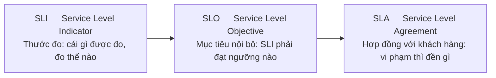

+++
title = "1.2. SLA, SLO, SLI"
date = "2026-07-13T05:30:00+07:00"
draft = false
tags = ["backend", "system-design"]
series = ["System Design — Tư Duy Thiết Kế Hệ Thống"]
+++

## 1. Problem Statement

"Hệ thống có ổn định không?" là câu hỏi không trả lời được nếu không có định nghĩa đo được về "ổn định". Team vận hành nói uptime 99.98%, nhưng khách hàng phàn nàn liên tục — vì uptime đo bằng ping đến server, còn khách hàng đo bằng "đặt hàng có thành công không". Hai thước đo khác nhau về cùng một hệ thống.

SLI/SLO/SLA là bộ công cụ biến "độ tin cậy" từ cảm giác thành hợp đồng đo được — giữa hệ thống với khách hàng, và giữa team engineering với chính mình.

## 2. Định nghĩa và quan hệ

**SLI** là thước đo. Dạng chuẩn: *tỷ lệ sự kiện tốt trên tổng sự kiện hợp lệ*.
Ví dụ: `số request trả về non-5xx trong < 500ms / tổng request` đo tại load balancer.

**SLO** là mục tiêu nội bộ trên SLI trong một cửa sổ thời gian.
Ví dụ: "99.9% request thành công trong cửa sổ 30 ngày trượt."

**SLA** là cam kết pháp lý với khách hàng, có điều khoản đền bù. SLA luôn **lỏng hơn** SLO — nếu SLO nội bộ là 99.9%, SLA ký với khách nên là 99.5%. Khoảng đệm đó là không gian để phát hiện và xử lý vấn đề trước khi vi phạm hợp đồng.

## 3. First Principles

**Vì sao đo bằng tỷ lệ sự kiện thay vì uptime?** Vì "hệ thống sống" không đồng nghĩa "hệ thống hữu dụng". Một hệ thống trả lỗi cho 20% request vẫn "up" theo nghĩa ping. Đo theo sự kiện đặt người dùng vào trung tâm định nghĩa: hệ thống tốt khi *request của người dùng* thành công.

**Vì sao cần SLO khi đã có monitoring?** Monitoring cho biết *chuyện gì đang xảy ra*. SLO cho biết *chuyện đó có quan trọng không*. Không có SLO, mọi alert đều "khẩn cấp" như nhau, và team sẽ hoặc bị ngập trong alert, hoặc tắt hết alert. SLO là bộ lọc: chỉ đánh thức người trực khi error budget đang cháy đủ nhanh để đe dọa mục tiêu.

**Nếu không có SLO thì sao?** Cuộc chiến vĩnh viễn giữa "ship nhanh" (product) và "giữ ổn định" (ops) sẽ được phân xử bằng chính trị thay vì dữ liệu. SLO + error budget biến nó thành cơ chế tự động: còn budget thì ship thoải mái, hết budget thì dừng feature để trả nợ ổn định. Đây là phát minh quan trọng nhất của SRE — không phải công cụ, mà là **cơ chế ra quyết định**.

## 4. Error Budget — cơ chế vận hành của SLO

SLO 99.9%/30 ngày ⇒ error budget = 0.1% ≈ **43 phút downtime** (hoặc lượng request lỗi tương đương) mỗi 30 ngày.

| SLO | Downtime cho phép / 30 ngày | / năm |
|---|---|---|
| 99% | 7.3 giờ | 3.65 ngày |
| 99.9% | 43 phút | 8.77 giờ |
| 99.95% | 21.6 phút | 4.38 giờ |
| 99.99% | 4.3 phút | 52.6 phút |
| 99.999% | 26 giây | 5.26 phút |

Hai hệ quả thực dụng:

1. **99.99% nghĩa là con người không kịp phản ứng.** 4.3 phút/tháng không đủ để người trực mở laptop. Muốn 4 số 9, mọi failover phải **tự động**. Đây là ranh giới kiến trúc thật sự giữa 3 số 9 và 4 số 9 — không phải "cố gắng hơn" mà là một lớp tự động hóa hoàn toàn khác.
2. **Dependency ăn vào budget.** Service của bạn phụ thuộc 5 service khác mỗi cái 99.9% nối tiếp nhau → availability lý thuyết ~99.5%. Không thể hứa SLO cao hơn dependency yếu nhất nếu không có degradation path (cache, fallback, default).

### Burn rate alerting

Alert đúng cách không phải "error rate > 1%", mà là theo **tốc độ đốt budget**:

- Burn rate 14.4× trong 1 giờ (đốt 2% budget tháng trong 1 giờ) → page ngay.
- Burn rate 6× trong 6 giờ → page.
- Burn rate 1–3× kéo dài → ticket, xử lý giờ hành chính.

Cách này loại được hai lỗi kinh điển: alert ầm ĩ vì spike 30 giây vô hại, và im lặng chết người khi lỗi 0.5% âm ỉ suốt một tuần ăn sạch budget.

## 5. Trade-off

| Quyết định | Được | Mất |
|---|---|---|
| SLO cao (99.99%+) | Niềm tin khách hàng, bán được enterprise | Chi phí hạ tầng ~2–5×, tốc độ ra feature giảm (mỗi thay đổi là rủi ro với budget 4 phút/tháng) |
| SLO thấp hơn nhu cầu thật | Rẻ, ship nhanh | Churn khách hàng — và churn không xuất hiện trong dashboard nào |
| Đo SLI tại client | Phản ánh trải nghiệm thật (gồm cả mạng, CDN) | Nhiễu (mạng 3G của user), khó quy trách nhiệm |
| Đo SLI tại load balancer | Sạch, dễ quy trách nhiệm | Mù với lỗi DNS/CDN/mạng phía trước LB |

Chọn thực dụng: đo tại LB làm SLO chính thức, đo tại client (RUM) làm tham chiếu.

## 6. Production Considerations

- SLI phải tính từ dữ liệu có sẵn trong hệ thống metric (Prometheus, CloudWatch...) — SLI không tự động hóa được sẽ chết sau 2 tháng.
- Dashboard SLO chuẩn gồm: SLI hiện tại, budget còn lại trong cửa sổ, burn rate 1h/6h/3d.
- Sau mỗi incident, trừ budget và ghi vào postmortem — budget là bộ nhớ chung của team về độ tin cậy.
- Cửa sổ trượt (rolling 30 ngày) tốt hơn cửa sổ lịch (tháng): tránh hiệu ứng "đầu tháng reset, cuối tháng nín thở".

## 7. Best Practices

- Bắt đầu với 2–3 SLO cho luồng quan trọng nhất (checkout, login), không phải 50 SLO cho mọi endpoint.
- Đặt SLO từ **dữ liệu lịch sử** (hệ thống đang đạt bao nhiêu?) rồi điều chỉnh theo nhu cầu business, thay vì chọn số đẹp.
- SLO latency nên dùng percentile: "99% request < 500ms" thay vì trung bình — trung bình che giấu tail (xem [chương 1.3](/series/system-design/01-foundations/03-throughput-latency/)).
- Với hệ thống ít traffic, cửa sổ phải đủ dài để có ý nghĩa thống kê (100 request/ngày thì SLI theo giờ là nhiễu thuần túy).

## 8. Anti-patterns

- **SLA không có SLO đứng sau:** đội sales ký 99.99% trong khi engineering chưa từng đo — hợp đồng viết bằng hy vọng.
- **SLO 100%:** không tồn tại và triệt tiêu mọi thay đổi. Hệ thống duy nhất đạt 100% là hệ thống không ai dùng.
- **Đo những gì dễ đo thay vì những gì quan trọng:** CPU 40% không nói lên gì về việc user có đặt được hàng.
- **Alert trên nguyên nhân thay vì triệu chứng:** alert "CPU cao" thay vì "error budget đang cháy" — CPU cao mà user vẫn vui thì không phải sự cố.
- **Coi SLO là trần thay vì sàn:** team ngừng cải thiện khi "đã đạt SLO" dù chi phí cải thiện rất rẻ.

## 9. Khi nào KHÔNG nên dùng

Sản phẩm nội bộ < 50 user, MVP chưa có khách trả tiền, hoặc team < 5 người chưa có ai làm vận hành chuyên trách: một dashboard error rate + uptime check miễn phí là đủ. Bộ máy SLO/error budget/burn rate chỉ trả lãi khi (a) có nhiều team cần cơ chế phân xử ship-vs-ổn-định, hoặc (b) có khách hàng trả tiền cho cam kết độ tin cậy. Trước thời điểm đó, nó là nghi thức.

---

*Tiếp theo: [1.3. Throughput & Latency](/series/system-design/01-foundations/03-throughput-latency/)*
