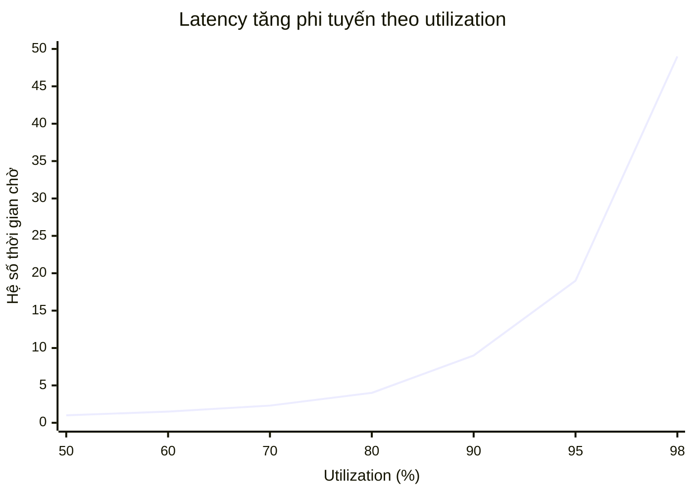

+++
title = "1.3. Throughput & Latency"
date = "2026-07-13T05:40:00+07:00"
draft = false
tags = ["backend", "system-design"]
series = ["System Design — Tư Duy Thiết Kế Hệ Thống"]
+++

## 1. Problem Statement

"Hệ thống chậm" là câu phàn nàn phổ biến nhất và mơ hồ nhất trong ngành. Chậm vì mỗi request mất lâu (latency)? Hay vì hệ thống không nuốt nổi số lượng request (throughput bão hòa → queue → chờ)? Hai bệnh khác nhau, thuốc khác nhau, nhưng triệu chứng bề mặt giống hệt nhau: "user thấy lâu".

Hiểu sâu quan hệ giữa latency, throughput, concurrency và utilization là kỹ năng chẩn đoán nền tảng — thiếu nó, mọi nỗ lực tối ưu là đoán mò.

## 2. Định nghĩa chính xác

**Latency:** thời gian từ khi gửi request đến khi nhận response. Đơn vị: ms. Là thuộc tính của *một* request.

**Throughput:** số đơn vị công việc hoàn thành mỗi giây (RPS, QPS, msg/s, MB/s). Là thuộc tính của *hệ thống*.

**Concurrency:** số request đang được xử lý đồng thời.

Ba đại lượng gắn với nhau qua **Little's Law**:

```
Concurrency = Throughput × Latency
L = λ × W
```

Định luật này đơn giản đến mức bị xem thường, nhưng nó trả lời được các câu hỏi thiết kế hằng ngày:

- Service xử lý 200 RPS, mỗi request mất 50ms → trung bình có 200 × 0.05 = **10 request đang bay** → cần tối thiểu ~10 worker/connection. Nếu connection pool chỉ có 5 → một nửa request phải xếp hàng → latency nhìn từ ngoài tăng vọt **dù service không hề chậm đi**.
- Muốn chịu 1000 RPS với latency 100ms → cần 100 đơn vị xử lý đồng thời. Mỗi instance chịu được 20 → cần ≥ 5 instance.

## 3. First Principles

### 3.1. Latency là tổng của một chuỗi, throughput là min của chuỗi

Một request đi qua: DNS → LB → app → cache → DB → app → LB → client.

- **Latency tổng ≈ tổng latency từng chặng** (các chặng nối tiếp).
- **Throughput tổng = throughput của chặng hẹp nhất** (bottleneck).

Hệ quả: giảm latency đòi hỏi tối ưu *nhiều* chặng hoặc loại bỏ chặng (bớt round-trip); tăng throughput chỉ đòi hỏi mở rộng *một* chặng — chặng nghẽn. Đây là lý do tăng throughput thường dễ hơn giảm latency: throughput mua được bằng tiền (thêm máy), latency bị chặn bởi tốc độ ánh sáng và số round-trip.

### 3.2. Vì sao phải nhìn percentile, không nhìn trung bình

Latency trong hệ thống thực không phân phối chuẩn — nó lệch phải với cái đuôi dài (GC pause, cache miss, lock contention, retry). Trung bình 80ms có thể che giấu việc 1% user chờ 5 giây.

- **p50 (median):** trải nghiệm điển hình.
- **p95/p99:** trải nghiệm của thiểu số kém may — nhưng với hệ thống lớn, "1%" là hàng nghìn user mỗi phút, và thường là user nặng nhất (giỏ hàng lớn, dữ liệu nhiều) — tức khách hàng giá trị nhất.
- **p999:** quan trọng với hệ thống có fan-out.

**Tail amplification — hiệu ứng khuếch đại đuôi:** nếu một trang cần gọi song song 10 service, mỗi service có p99 = 100ms, thì xác suất *cả 10* đều tránh được đuôi là 0.99¹⁰ ≈ 90.4% → gần **10% số trang** chịu latency đuôi. Trang gọi 100 lời gọi con sẽ chịu đuôi ở ~63% request. Kiến trúc càng phân tán, p99 của thành phần càng quyết định p50 của tổng thể. Đây là lập luận định lượng chống lại chatty microservices.

### 3.3. Utilization và hockey stick

Theo lý thuyết hàng đợi (M/M/1), thời gian chờ tỷ lệ với `ρ/(1−ρ)` với ρ = utilization. Nghĩa là:

- Utilization 50% → chờ ít.
- 80% → thời gian chờ gấp 4 lần mức 50%.
- 95% → gấp ~19 lần. Latency "đột nhiên" tăng dựng đứng.



Bài học thiết kế: **đừng chạy hệ thống trên 70–80% utilization kéo dài**. 20–30% "lãng phí" đó chính là thứ giữ latency ổn định và là đệm cho spike. Autoscaling đặt ngưỡng scale-out ở ~60–70% CPU chính vì đường cong này: đợi đến 90% mới scale thì latency đã hỏng và scale-out (mất 1–5 phút) không kịp.

## 4. Trade-off: Latency vs Throughput

Hai đại lượng này thường phải đánh đổi trực tiếp:

| Kỹ thuật | Throughput | Latency | Ví dụ production |
|---|---|---|---|
| Batching | ↑↑ (giảm overhead mỗi item) | ↑ (item đầu chờ batch đầy) | Kafka producer `linger.ms=5`: chờ 5ms gom batch → throughput tăng nhiều lần, latency +5ms |
| Pipelining | ↑↑ | ~ | Redis pipeline: 10K lệnh/round-trip |
| Compression | ↑ (băng thông) | ↑ (CPU nén) | gRPC + gzip cho payload lớn liên DC |
| Connection pooling | ↑ | ↓ (bỏ handshake) | Hầu như luôn đúng cả hai chiều — nên là mặc định |
| Sync fsync mỗi write | ↓↓ | durability ↑ | PostgreSQL `synchronous_commit=off` đổi durability lấy throughput ghi |

Nguyên tắc chọn: hệ thống hướng người dùng tương tác → ưu tiên latency; pipeline dữ liệu, batch job, analytics → ưu tiên throughput. Nhiều hệ thống cần cả hai loại đường đi riêng — đó là một động lực của CQRS ([giai đoạn 8, Phần 12](/series/system-design/12-evolution/08-cqrs/)).

## 5. Production Considerations

- **Đo latency ở nhiều điểm:** client (RUM), edge/LB, từng service, từng query DB. Chênh lệch giữa các điểm chỉ ra chặng nghẽn.
- **Histogram, không phải average:** cấu hình metric dạng histogram (Prometheus `histogram_quantile`) để tính percentile đúng. Trung bình của các average theo phút là con số vô nghĩa về mặt thống kê.
- **Đo cả queue depth:** latency tăng do bão hòa luôn hiện hình ở queue (connection pool wait, thread pool queue, LB surge queue) trước khi hiện ở CPU.
- **Load test tìm điểm gãy:** tăng tải từ từ đến khi latency gãy — điểm đó là capacity thực, thường thấp hơn nhiều so với capacity lý thuyết. Ghi lại con số này cho capacity planning ([chương 1.4](/series/system-design/01-foundations/04-scale-estimation-capacity-planning/)).
- **Timeout đặt theo percentile thực:** timeout = ~p99.9 của downstream + đệm, không phải số tròn tùy hứng. Timeout quá ngắn tạo retry storm; quá dài giam connection (xem [Phần 13](/series/system-design/13-production-failure-cases/00-tong-quan/)).

## 6. Best Practices

- Công bố "latency budget" cho từng chặng của luồng quan trọng: tổng 500ms = LB 5 + app 100 + cache 5 + DB 150 + network 40 + render 200. Khi vượt budget, biết ngay hỏi chặng nào.
- Giảm số round-trip trước khi tối ưu từng round-trip: gộp 3 API call thành 1 tiết kiệm nhiều hơn tối ưu mỗi call 20%.
- Với fan-out bắt buộc: dùng **request hedging** (gửi bản sao request thứ hai sau khi chờ quá p95, lấy kết quả về trước) để cắt đuôi — kỹ thuật của BigTable/Dynamo, hiệu quả bất ngờ với chi phí ~5% traffic thêm.
- Ưu tiên loại công việc khỏi đường nóng: cái gì không cần trong response thì đẩy sang async (xem [giai đoạn 3–4, Phần 12](/series/system-design/12-evolution/03-background-worker/)).

## 7. Anti-patterns

- **Tối ưu p50 khi khách kêu về p99:** dashboard đẹp lên, khách vẫn kêu.
- **Chạy 90% utilization để "tiết kiệm":** tiết kiệm 10% chi phí máy, trả bằng latency gãy mỗi khi có spike và không còn đệm cho failover (N máy chạy 90%, 1 máy chết → còn lại nhận thêm tải → sụp dây chuyền).
- **Đo latency không đo tải:** "hôm qua 100ms, hôm nay 300ms" vô nghĩa nếu không biết tải đã đổi thế nào.
- **Trộn traffic nhanh và chậm trong một pool:** request export báo cáo 30 giây chiếm hết worker của request 50ms — bulkhead (tách pool) là bắt buộc.

## 8. Khi nào KHÔNG cần quan tâm sâu

Hệ thống nội bộ vài chục user, batch job chạy đêm không ai chờ: đo một con số "job xong trước 6 giờ sáng" là đủ. Bộ máy percentile/histogram/hedging chỉ đáng đầu tư khi có người dùng thật chờ ở đầu kia và số lượng request đủ lớn để thống kê có nghĩa.

---

*Tiếp theo: [1.4. Scale Estimation & Capacity Planning](/series/system-design/01-foundations/04-scale-estimation-capacity-planning/)*
