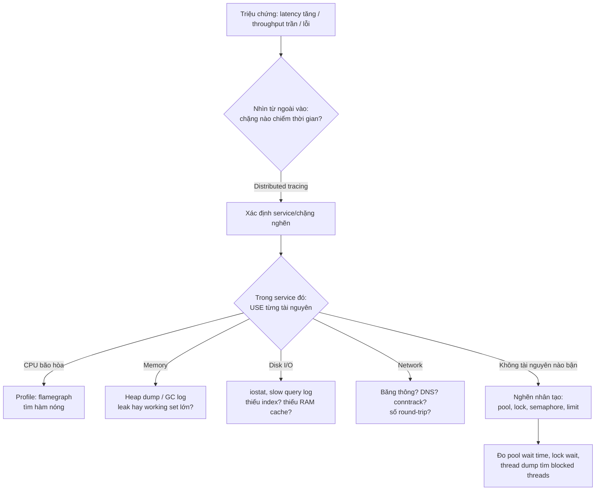

+++
title = "1.5. Bottleneck Analysis"
date = "2026-07-13T06:00:00+07:00"
draft = false
tags = ["backend", "system-design"]
series = ["System Design — Tư Duy Thiết Kế Hệ Thống"]
+++

## 1. Problem Statement

Hệ thống chậm/quá tải, và team đứng trước cám dỗ lớn nhất của nghề: **tối ưu thứ dễ thấy thay vì thứ đang nghẽn**. Thêm cache khi vấn đề là lock contention. Thêm server khi vấn đề là connection pool. Rewrite sang Go khi vấn đề là một câu query thiếu index.

Bottleneck analysis là kỹ năng tìm đúng chỗ nghẽn **trước khi** hành động. Nó quan trọng vì một định luật không khoan nhượng: **tối ưu bất cứ thứ gì không phải bottleneck đều không cải thiện hệ thống** (Theory of Constraints). Tăng gấp đôi tốc độ một thành phần đang rảnh 60% thời gian → thay đổi tổng thể: ~0.

## 2. First Principles

### 2.1. Mọi hệ thống luôn có đúng một bottleneck chính

Tại một mức tải, luôn tồn tại thành phần bão hòa đầu tiên. Giải xong nó, bottleneck **di chuyển** sang thành phần kế tiếp — không biến mất. Vòng đời của scaling là vòng lặp: tìm nghẽn → giải → nghẽn mới xuất hiện ở chỗ khác → lặp lại. [Phần 12](/series/system-design/12-evolution/00-tong-quan/) chính là vòng lặp này kể qua 10 giai đoạn.

Hệ quả tư duy: câu hỏi đúng không phải "làm sao cho hệ thống nhanh" mà là "**hiện tại, tài nguyên nào bão hòa đầu tiên khi tải tăng?**"

### 2.2. Bốn loại tài nguyên vật lý — và loại thứ năm

Mọi bottleneck kỹ thuật quy về: **CPU**, **Memory**, **Disk I/O**, **Network**. Cộng thêm loại thứ năm phổ biến nhất trong hệ thống backend: **tài nguyên nhân tạo có giới hạn** — connection pool, thread pool, lock, semaphore, rate limit, quota. Loại thứ năm nguy hiểm nhất vì nó không hiện trên dashboard CPU/RAM: hệ thống "rảnh" mà request vẫn xếp hàng.

### 2.3. Phương pháp USE

Với mỗi tài nguyên, kiểm tra 3 chỉ số (Brendan Gregg):

- **Utilization:** bận bao nhiêu % thời gian?
- **Saturation:** có hàng đợi không? (load average > số core, pool wait, disk queue depth)
- **Errors:** có lỗi không? (timeout, connection refused, OOM kill)

Saturation là tín hiệu quan trọng nhất: utilization 100% mà không có queue thì chỉ là dùng hết công suất; có queue nghĩa là công việc đang chờ — latency đang bị cộng thêm.

## 3. Quy trình chẩn đoán trong production



Nguyên tắc vàng: **đo trước, đoán sau; ngoài vào trong; triệu chứng trước nguyên nhân**. Tracing (xem [Phần 10](/series/system-design/10-observability/00-tong-quan/)) trả lời "chặng nào" trong vài phút — không có tracing, cùng câu hỏi tốn vài giờ đọc log so le đồng hồ.

### Các bottleneck kinh điển theo tầng

| Tầng | Bottleneck hay gặp | Tín hiệu | Hướng giải |
|---|---|---|---|
| Client → edge | TLS handshake, số kết nối, khoảng cách địa lý | TTFB cao dù server nhanh | CDN, keep-alive, HTTP/2-3 |
| Load balancer | Hiếm khi là LB thật; thường là surge queue | LB queue/spillover metric | Thêm backend, không phải LB to hơn |
| App | CPU (serialize/deserialize, regex, crypto), GC, thread pool | CPU cao hoặc pool wait | Profile trước; scale-out nếu thật sự CPU |
| App → DB | **Connection pool** — nghi phạm số 1 khi app rảnh mà chậm | pool wait time, active = max | Tăng pool có tính toán, giảm thời gian giữ connection, PgBouncer |
| Database | Slow query, thiếu index, lock contention, vacuum, replica lag | slow log, `pg_stat_activity`, lock wait | Index/rewrite query trước, cache sau, replica/sharding cuối |
| Cache | Hot key, băng thông network của node cache | Redis CPU 1 core 100%, net out bão hòa | Local cache tầng trước, key sharding |
| Queue/Worker | Consumer chậm → backlog | queue depth tăng đơn điệu, consumer lag | Scale consumer, batch, tìm nghẽn *của consumer* |

Ghi nhớ thực chiến: trong hệ thống web điển hình, xác suất bottleneck nằm ở **database và những gì quanh nó (query, index, connection pool)** cao hơn mọi chỗ khác cộng lại. Kiểm tra ở đó trước.

## 4. Amdahl's Law — trần của mọi nỗ lực song song hóa

Speedup tối đa khi song song hóa bị chặn bởi phần tuần tự:

```
Speedup ≤ 1 / (s + (1−s)/N)    với s = tỷ lệ tuần tự, N = số đơn vị song song
```

Phần tuần tự 10% → dù N = ∞, speedup tối đa là **10×**. Trong hệ phân tán, "phần tuần tự" chính là: single-writer database, global lock, leader node, hot partition, đoạn code giữ mutex. Đây là lý do sâu xa vì sao "cứ thêm máy" ngừng hiệu quả tại một điểm — và vì sao các kỹ thuật ở [Phần 8 (Partitioning)](/series/system-design/08-data-partitioning/00-tong-quan/) đều xoay quanh việc **loại bỏ điểm tuần tự** thay vì thêm máy.

## 5. Trade-off khi giải bottleneck

Mỗi cách giải nghẽn có giá riêng:

- **Scale-up (máy to hơn):** đơn giản nhất, không đổi kiến trúc; nhưng có trần, giá tăng phi tuyến ở cận trần, và vẫn là SPOF.
- **Cache:** hiệu quả tức thời với read-heavy; giá là stale data + invalidation + một lớp failure mode mới ([Phần 13.1](/series/system-design/13-production-failure-cases/01-caching-failures/)).
- **Async/queue:** cắt spike, cô lập chậm; giá là eventual consistency với chính nghiệp vụ của mình + hạ tầng queue phải vận hành.
- **Scale-out + sharding:** trần cao nhất; giá là độ phức tạp nhảy vọt — rebalancing, cross-shard query, hot shard.
- **Tối ưu code/query:** rẻ nhất khi trúng (một index = 100× nhanh hơn), nhưng cần kỹ năng chẩn đoán đúng — và là thứ nên làm **trước** mọi thay đổi kiến trúc.

Thứ tự thử hợp lý gần như luôn là: **đo → tối ưu tại chỗ (index, query, N+1, pool size) → cache → async → scale-out → sharding**. Đảo thứ tự này là đổi vấn đề 1 ngày lấy dự án 6 tháng.

## 6. Production Considerations

- **Baseline:** lưu profile hiệu năng của hệ thống lúc khỏe (latency từng chặng, utilization từng tài nguyên). Chẩn đoán = so sánh với baseline; không có baseline thì mọi con số đều "không biết cao hay thấp".
- **Load test tìm bottleneck trước khi production tìm hộ:** tăng tải đến gãy trong môi trường staging với dữ liệu cỡ thật. Điểm gãy + tài nguyên bão hòa tại điểm gãy = bottleneck kế tiếp của bạn.
- **Continuous profiling** (Pyroscope, Parca, pprof định kỳ): flamegraph có sẵn khi cần, thay vì cài đặt profiler lúc 3 giờ sáng.
- Sau mỗi lần giải nghẽn, **cập nhật dự đoán nghẽn kế tiếp** vào tài liệu capacity ([chương 1.4](/series/system-design/01-foundations/04-scale-estimation-capacity-planning/)) — "chúng ta vừa nâng trần từ 2K lên 10K RPS; trần mới là gì?"

## 7. Best Practices

- Một câu hỏi kiểm tra nhanh cho mọi đề xuất tối ưu: *"Bằng chứng nào cho thấy đây là bottleneck?"* — nếu câu trả lời không có số đo, dừng lại và đo.
- Tối ưu theo tác động: xếp hạng nghi phạm theo (thời gian chiếm trong request) × (tần suất request). Query 50ms chạy 1000 lần/giây quan trọng hơn query 5 giây chạy 1 lần/giờ.
- Khi latency tăng đột ngột không rõ lý do, hỏi "cái gì vừa thay đổi?" trước khi hỏi "cái gì đang chậm?" — deploy, migration, data growth qua ngưỡng RAM, certificate, dependency bên ngoài.
- Giữ danh sách "trần đã biết" của hệ thống (max connections, pool sizes, rate limits, quota cloud) ở một chỗ — phần lớn sự cố nửa đêm là đâm vào một trần không ai nhớ đã đặt.

## 8. Anti-patterns

- **Tối ưu tiên đoán (premature optimization):** phức tạp hóa code/kiến trúc cho bottleneck chưa được chứng minh tồn tại.
- **Scale-out cái không scale được:** thêm app instance khi nghẽn ở DB → tăng số connection đổ vào DB → **tệ hơn**.
- **Cargo-cult tuning:** copy config "tối ưu" từ blog (pool 500 connection!) không hiểu vì sao — pool quá to là nguyên nhân kinh điển của DB chết vì context switch và lock.
- **Fix triệu chứng bằng retry/timeout dài hơn:** che bottleneck và tích lũy nó thành retry storm ([Phần 13.3](/series/system-design/13-production-failure-cases/03-messaging-failures/)).
- **Rewrite toàn bộ vì chậm:** 90% trường hợp, chậm nằm ở 1–3 điểm cụ thể có thể fix tại chỗ. Rewrite là quyết định tổ chức, không phải quyết định hiệu năng.

## 9. Khi nào KHÔNG cần

Khi hệ thống đang đạt SLO với utilization thấp và tăng trưởng chậm — đừng đi tìm bottleneck để giải trước. Ghi lại trần đã biết, đặt alert ở 70% trần, và quay lại làm feature. Bottleneck analysis là kỹ năng dùng khi có tín hiệu (latency tăng, capacity alert, load test gãy sớm hơn dự kiến), không phải hoạt động thường trực.

---

*Hết Phần 1. Tiếp theo: [Phần 4 — Distributed Systems](/series/system-design/04-distributed-systems/01-cap-pacelc/), hoặc đi thẳng vào hành trình thực tế ở [Phần 12 — Evolution](/series/system-design/12-evolution/00-tong-quan/).*
