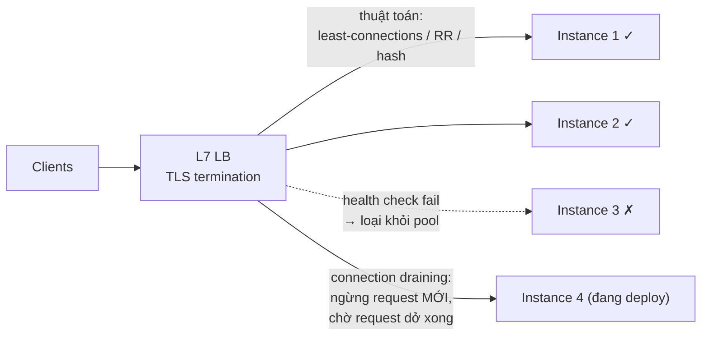

+++
title = "2.2. Load Balancer — người gác cổng của scale-out"
date = "2026-07-13T06:30:00+07:00"
draft = false
tags = ["backend", "system-design"]
series = ["System Design — Tư Duy Thiết Kế Hệ Thống"]
+++

## 1. Problem Statement

Có N instance giống nhau ([2.1](/series/system-design/02-scalability/01-vertical-horizontal-scaling/)); cần một thứ đứng trước để: chia request *đều theo tải thật* (không phải đều theo số đếm), phát hiện máy chết và loại nó *trước khi user cảm nhận*, cho phép thêm/bớt máy *giữa dòng traffic*, và tự nó **không trở thành SPOF mới**. Bốn yêu cầu nghe hiển nhiên — mỗi cái là một bài thiết kế có chiều sâu, và LB cấu hình mặc định thường trượt cả bốn ở những cách kín đáo.

## 2. First Principles — LB đứng ở tầng nào của network quyết định nó "thấy" gì

**L4 (transport):** thấy TCP connection — IP, port. Chia *connection*, không biết gì về request bên trong. Nhanh (không parse payload), rẻ, throughput khủng — nhưng mù ngữ nghĩa: không route theo path, không retry request fail, và với protocol multiplexing (HTTP/2, gRPC) — **chia connection ≠ chia tải** ([6.3 §4 — cạm bẫy gRPC sau L4](/series/system-design/06-communication/03-grpc/)).

**L7 (application):** parse HTTP — thấy path, header, cookie, từng request. Route theo nội dung (`/api` → cụm A, `/static` → CDN), retry request lỗi sang máy khác, terminate TLS, nén, cache — đổi bằng CPU parse và latency thêm ~ms. **Mặc định đúng cho web/API hiện đại là L7** (Nginx, Envoy, HAProxy, ALB); L4 (NLB, LVS) cho TCP thuần, throughput cực cao, hoặc đứng *trước* tầng L7.

**Ai cân bằng cho load balancer?** — câu hỏi đệ quy kết thúc ở hai cơ chế không-phải-máy-đơn: **DNS** (nhiều A record / GeoDNS — thô, chậm lan truyền, [13.5 — DNS failover và TTL](/series/system-design/13-production-failure-cases/05-infrastructure-failures/)) và **anycast/VIP + giao thức mạng** (BGP, VRRP — cặp LB active-passive chia VIP). Cloud LB đã gói sẵn phần này — lý do mạnh để không tự dựng LB trừ khi có lý do mạnh hơn.

## 3. Internal Architecture — ba bộ phận quyết định chất lượng

### 3.1. Thuật toán phân tải — "đều" có nhiều nghĩa

- **Round-robin:** đều theo *số request* — đúng khi mọi request nặng như nhau (hiếm). Request nặng nhẹ lẫn lộn → máy xui ôm chuỗi request nặng.
- **Least-connections:** đều theo *việc đang làm* — connection đang mở xấp xỉ tải đang gánh; mặc định tốt cho đa số API (request chậm tự nhiên "đẩy" traffic sang máy rảnh — một dạng cân bằng theo phản hồi).
- **Weighted:** trọng số theo công suất máy — cần khi cụm không đồng nhất (giai đoạn chuyển đổi máy cũ/mới).
- **Consistent hash** (theo user/session/key): cùng key về cùng máy — cho cache locality hoặc sticky có kiểm soát ([8.2 §4](/series/system-design/08-data-partitioning/02-consistent-hashing/)); nhớ giá của sticky ([2.1 §3](/series/system-design/02-scalability/01-vertical-horizontal-scaling/)).
- Nâng cao đáng biết: **power of two choices** (chọn ngẫu nhiên 2 máy, gửi cho máy ít việc hơn) — gần tối ưu với chi phí gần zero, chuẩn của các LB hiện đại phân tán (nhiều LB node không chia sẻ trạng thái đếm connection chính xác).

### 3.2. Health check — quyết định "sống" là gì

Ba tầng sâu dần: **TCP** (port mở — process sống, có thể đang vô dụng), **HTTP `/healthz`** (app trả lời — đang phục vụ được *chính nó*), **readiness sâu** (check cả dependency — DB nối được?). Bẫy của check sâu: DB chậm 5 giây → *mọi* instance fail check *cùng lúc* → LB loại **cả cụm** → sập toàn phần cho một sự cố bộ phận — health check sâu biến partial failure thành total failure ([13.4 — cascading](/series/system-design/13-production-failure-cases/04-distributed-failures/)). Nguyên tắc: **liveness nông** (chỉ chính process — sống hay chết), **readiness đo khả năng phục vụ nhưng KHÔNG fail chỉ vì dependency chậm** (degraded ≠ dead — instance vẫn nhận traffic và tự trả lỗi/fallback cho phần hỏng); và threshold có đệm (fail 3 lần liên tiếp mới loại, pass 2 lần mới nhận lại — chống flapping, [4.4 — timeout là phỏng đoán](/series/system-design/04-distributed-systems/04-clock-partition-split-brain/)).

### 3.3. Connection draining — deploy không rơi request

Bỏ instance khỏi pool ≠ giết ngay: ngừng gửi request *mới*, chờ request *đang chạy* xong (timeout trần), rồi mới tắt. Không draining → mỗi lần deploy là một loạt request chết giữa chừng — "error rate cứ nhích lên mỗi lần release" trước khi ai đó nối hai sự kiện lại với nhau. Cùng họ: instance mới cần **warm-up** (pool DB, JIT, cache lạnh) — nhận traffic từ từ (slow start) thay vì full ngay.

## 4. Trade-off

| Quyết định | Được | Giá |
|---|---|---|
| L7 thay vì L4 | Route thông minh, retry, TLS tập trung, observability giàu | +CPU, +ms latency, cấu hình phức tạp hơn |
| Health check sâu | Phát hiện "sống mà vô dụng" | Rủi ro loại cả cụm vì dependency chung — thiết kế như §3.2 |
| Retry ở LB | Che lỗi thoáng qua của một máy | Nhân tải khi lỗi diện rộng ([13.3 — retry storm](/series/system-design/13-production-failure-cases/03-messaging-failures/)); chỉ retry request idempotent (GET) hoặc có idempotency key |
| TLS terminate tại LB | Cert quản một chỗ, app nhẹ | Đoạn LB→app plaintext cần mạng tin cậy hoặc mTLS nội bộ ([Phần 11](/series/system-design/11-security/00-tong-quan/)) |
| Managed LB (cloud) | Khỏi lo HA của chính LB, scale tự động | Ít quyền kiểm soát, chi phí theo traffic, giới hạn tính năng theo nhà cung cấp |

## 5. Production Considerations

- **LB là điểm quan sát quý nhất hệ thống:** mọi request đi qua — RED metrics theo route/backend từ access log LB là dashboard trung thực hơn app tự báo ([1.2 §5 — đo SLI tại LB](/series/system-design/01-foundations/02-sla-slo-sli/)); giữ và khai thác access log.
- Metric riêng của LB phải canh: backend healthy count (rơi = còi to), **surge queue/spillover** (request xếp hàng ở LB = backend bão hòa — [1.5 bảng tầng](/series/system-design/01-foundations/05-bottleneck-analysis/)), connection churn, TLS handshake rate.
- **Idle timeout phải thẳng hàng ba tầng:** client ≤ LB ≤ app — LB cắt connection app đang giữ (hoặc ngược lại) sinh lỗi 502/504 lác đác rất khó truy ([13.5 — NAT/LB giết connection nhàn](/series/system-design/13-production-failure-cases/05-infrastructure-failures/)).
- Một LB cho nhiều loại traffic (API nhanh + upload chậm + WebSocket dài): tách listener/pool — bulkhead từ cửa ([13.2 — trộn nhanh chậm chung pool](/series/system-design/13-production-failure-cases/02-database-failures/)).
- Test cả đường xấu: giết backend giữa tải, xem draining và retry làm đúng không — LB config chưa từng diễn tập là config trên giấy ([12.10 tinh thần drill](/series/system-design/12-evolution/10-disaster-recovery/)).

## 6. Anti-patterns

- **Health check sâu fail theo dependency chung → loại cả cụm** — kịch bản §3.2, gặp ngoài đời nhiều hơn sách vở thừa nhận.
- **Retry POST không idempotency ở LB** — nhân đôi đơn hàng bằng cấu hình một dòng.
- **gRPC/HTTP2 sau L4** — tải lệch ngầm ([6.3 §4](/series/system-design/06-communication/03-grpc/)).
- **Sticky bằng IP hash sau NAT/CGNAT** — cả một nhà mạng di động thành "một user" dồn vào một máy.
- **LB tự dựng một node** — dựng LB để hết SPOF rồi tạo SPOF mới tên là LB; HA của LB (VIP cặp, anycast, managed) là phần không được bỏ qua.
- **Không draining, không slow-start** — deploy nào cũng rơi request, autoscale nào cũng có phút đầu lỗi.

## 7. Khi nào KHÔNG cần

Một instance duy nhất: reverse proxy nhẹ (Nginx) cho TLS + static là đủ — "LB" chỉ có nghĩa khi ≥ 2 backend. Nội bộ service-to-service trong Kubernetes: Service/kube-proxy + (khi đến lúc) mesh đã là LB — đừng chồng thêm tầng LB tự chế ở giữa. Và đừng dùng LB như thuốc chữa app chậm: LB chia *tải*, không chia *thời gian xử lý* — request 5 giây vẫn 5 giây trên bất kỳ máy nào ([1.3 — latency vs throughput](/series/system-design/01-foundations/03-throughput-latency/)).

---

*Tiếp theo: [2.3. Auto Scaling](/series/system-design/02-scalability/03-auto-scaling/)*
