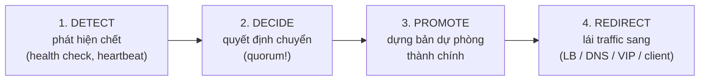

+++
title = "3.1. High Availability & Failover — giải phẫu quá trình chuyển đổi"
date = "2026-07-13T07:00:00+07:00"
draft = false
tags = ["backend", "system-design"]
series = ["System Design — Tư Duy Thiết Kế Hệ Thống"]
+++

## 1. Problem Statement

Business nói: "hệ thống không được chết quá 43 phút mỗi tháng" (99.9% — [1.2](/series/system-design/01-foundations/02-sla-slo-sli/)). Máy *sẽ* chết, disk *sẽ* hỏng, AZ *sẽ* sập — vậy con số kia chỉ đạt được bằng một cách: **khi một bộ phận chết, bộ phận dự phòng tiếp quản nhanh hơn ngưỡng người dùng bỏ đi.** HA = redundancy (có dự phòng) × failover (chuyển đổi đúng và nhanh). Vế thứ hai khó hơn vế thứ nhất một bậc — và là nơi các sự cố HA thực tế xảy ra: hệ thống có đủ bản sao nhưng chuyển đổi sai còn tệ hơn không có bản sao ([13.4 — split brain](/series/system-design/13-production-failure-cases/04-distributed-failures/)).

## 2. First Principles — availability là bài toán nhân xác suất

Một chuỗi nối tiếp N thành phần: availability = tích các thừa số — chuỗi 5 thành phần 99.9% chỉ còn ~99.5% ([1.2 §4 — dependency ăn budget](/series/system-design/01-foundations/02-sla-slo-sli/)). Một cụm M bản sao song song (chỉ cần 1 sống): 1 − (xác suất chết)^M — hai máy 99% cho 99.99% *về lý thuyết*. Hai phép tính này sinh ra hai mệnh lệnh thiết kế ngược chiều: **rút ngắn chuỗi nối tiếp** (mỗi hop là một thừa số — lý do bớt tầng, bớt dependency đồng bộ, [13.5 — 3rd party](/series/system-design/13-production-failure-cases/05-infrastructure-failures/)) và **nhân bản theo chiều song song**.

Nhưng phép nhân song song có hai dấu sao nhỏ mà cả nghề HA nằm trong đó:

1. **Giả định độc lập:** hai máy cùng rack, cùng nguồn điện, cùng bug, cùng đợt deploy — chết *cùng nhau*, phép nhân vô nghĩa. Vì thế redundancy thật = bản sao đặt trong **failure domain khác nhau** (máy khác → rack khác → AZ khác → region khác, đắt dần — [12.9](/series/system-design/12-evolution/09-multi-region/)) và cả *thời gian* khác nhau (rolling deploy — không bao giờ cập nhật mọi bản sao cùng lúc: bug mới là failure domain phổ biến nhất).
2. **Giả định chuyển đổi hoàn hảo:** "chỉ cần 1 sống" ngầm định traffic *tự tìm được* máy sống ngay lập tức — chính là failover, và nó không bao giờ hoàn hảo.

## 3. Giải phẫu failover — bốn bước, mỗi bước một cách hỏng

**Bước 1 — Detect:** không thể phân biệt "chết" với "chậm/mất mạng" ([4.4 — nguyên lý](/series/system-design/04-distributed-systems/04-clock-partition-split-brain/)) → mọi phát hiện là phỏng đoán qua timeout → trade-off trung tâm: timeout ngắn = failover nhanh + báo động nhầm nhiều (failover oan còn gây sự cố hơn — flapping); timeout dài = chắc chắn hơn + MTTR dài. Không có số đúng, chỉ có số hợp với tỷ lệ chi-phí-downtime / chi-phí-failover-oan của từng hệ.

**Bước 2 — Decide:** ai được quyết? Một node tự quyết ("tôi không thấy leader → tôi lên") là công thức split brain; quyết định phải qua **quorum** ([4.3](/series/system-design/04-distributed-systems/03-consensus-quorum-leader-election/)) — hoặc qua *con người* (hợp lệ với hệ chấp nhận RTO phút/giờ: người là quorum chậm mà chắc, [4.3 §5](/series/system-design/04-distributed-systems/03-consensus-quorum-leader-election/)).

**Bước 3 — Promote:** với stateless — không có gì để promote, LB loại máy chết là xong (lý do tầng stateless "HA miễn phí" — [2.1](/series/system-design/02-scalability/01-vertical-horizontal-scaling/)). Với stateful — đây là bước nguy hiểm nhất: replica async trễ → promote là **chấp nhận mất phần chưa kịp sang** (RPO > 0 — phải là quyết định *đã duyệt trước*, [12.10 §3.1](/series/system-design/12-evolution/10-disaster-recovery/)); và leader cũ phải bị **fence** trước khi leader mới nhận ghi ([4.4 §4 — ba lớp](/series/system-design/04-distributed-systems/04-clock-partition-split-brain/)).

**Bước 4 — Redirect:** nhanh chậm tùy cơ chế — LB đổi backend (giây), VIP trôi (giây), DNS đổi record (**TTL + cache tùy hứng của cả internet** — phút đến giờ, [13.5](/series/system-design/13-production-failure-cases/05-infrastructure-failures/)), client-side re-resolve (tùy code). RTO thật = tổng cả bốn bước — đo bằng drill, không bằng cộng thông số trên giấy; và đừng quên **connection cũ**: failover xong mà app còn giữ pool connection tới máy cũ = lỗi kéo dài thêm hàng phút (pool phải có cơ chế validate/recycle).

**Fail-back — nửa sau bị bỏ quên:** máy cũ sống lại *không được* tự nhận vai cũ (dữ liệu đã lệch — rejoin như follower sạch, [4.4 §7](/series/system-design/04-distributed-systems/04-clock-partition-split-brain/)); và cân nhắc *có nên* fail-back không — mỗi lần chuyển là một lần rủi ro, nhiều hệ ở lại luôn với leader mới.

## 4. Trade-off

| Quyết định | Được | Giá |
|---|---|---|
| Failover tự động | RTO giây–phút; đạt được ≥4 số 9 | Cả bộ máy quorum+lease+fencing phải đúng; failover oan là failure mode mới |
| Failover thủ công | Đơn giản, không split brain, người kiểm tra ngữ cảnh | RTO = đánh thức người + chẩn đoán + bấm nút: 15–60 phút thực tế; trần 3 số 9 |
| Timeout ngắn | MTTR thấp | Flapping, failover oan theo GC pause/mạng chớp ([4.4 §6](/series/system-design/04-distributed-systems/04-clock-partition-split-brain/)) |
| Redundancy đa AZ | Sống qua sự cố AZ — mức đáng giá nhất trên mỗi đồng | Latency liên AZ (~1–2ms) cho sync replication; chi phí ~×2 tầng stateful |
| Sync replication để RPO=0 | Không mất ghi khi failover | +latency mọi ghi; follower chậm ghìm cả hệ ([4.2 §2.1](/series/system-design/04-distributed-systems/02-replication-consistency/)) |

## 5. Production Considerations

- **MTTR quan trọng hơn MTBF:** availability = MTBF/(MTBF+MTTR) — giảm thời gian hồi phục thường rẻ hơn tăng thời gian giữa hai lần hỏng; đầu tư vào detect nhanh + runbook + drill thường hoàn vốn tốt hơn mua thêm 9 cho phần cứng.
- **Đo availability từ phía user** (synthetic probe ngoài, đa vùng — [13.5 — observability ngoài blast radius](/series/system-design/13-production-failure-cases/05-infrastructure-failures/)), không từ uptime của process.
- **Degraded mode là một phần của HA:** giữa "sống hoàn toàn" và "chết hoàn toàn" có phổ — đọc-không-ghi, phục vụ từ cache, tắt tính năng phụ ([13.4 — băng cản lửa](/series/system-design/13-production-failure-cases/04-distributed-failures/)); mỗi bậc degrade được thiết kế trước là một khoản trừ vào downtime.
- **Drill định kỳ giết leader/AZ ở staging rồi production giờ thấp điểm** — con số RTO/RPO thật chỉ tồn tại sau drill ([12.10 §3.3](/series/system-design/12-evolution/10-disaster-recovery/)); và mỗi lần failover thật hay drill: đo cả bốn bước để biết bước nào ăn thời gian.
- Đừng tự chế bộ failover cho hệ đã có sẵn lời giải chín: Patroni (PostgreSQL), orchestrator/InnoDB Cluster (MySQL), Sentinel/Cluster (Redis), Raft nội tại (etcd, Kafka KRaft, Mongo replica set) — [4.3 §7](/series/system-design/04-distributed-systems/03-consensus-quorum-leader-election/).

## 6. Anti-patterns

- **Redundancy không failover drill** — "có standby" trên sơ đồ, ngày cần thì standby mục (không đồng bộ từ tháng trước, config lệch, không ai nhớ quy trình).
- **Failover script tự chế không quorum/fencing** — nguồn split brain số một ([4.4 §8](/series/system-design/04-distributed-systems/04-clock-partition-split-brain/)).
- **Hai bản sao cùng failure domain** — cùng rack/AZ/đợt deploy: phép nhân xác suất thành phép cộng ảo tưởng.
- **HA cho app, quên HA cho các "phụ kiện":** LB một node, NAT gateway đơn, DNS một provider, bastion đơn — chuỗi nối tiếp bị đứt ở mắt xích không ai nhìn ([13.5](/series/system-design/13-production-failure-cases/05-infrastructure-failures/)).
- **Chạy cụm N máy ở 90% utilization** — một máy chết, N−1 máy nhận thêm tải là gãy dây chuyền: headroom cho failover là một phần của HA, không phải lãng phí ([1.3 §3.3](/series/system-design/01-foundations/03-throughput-latency/), [13.4](/series/system-design/13-production-failure-cases/04-distributed-failures/)).
- **Đuổi theo 5 số 9 khi business cần 3** — mỗi số 9 đắt ~10 lần; câu hỏi đúng luôn là "downtime 1 giờ gây thiệt hại bao nhiêu?" ([1.1 §7](/series/system-design/01-foundations/01-requirements/)).

## 7. Khi nào KHÔNG cần

Tool nội bộ, batch chạy đêm, hệ có người dùng chịu được gián đoạn ngắn: một máy + backup tốt + quy trình restore đã tập (RTO giờ) là kiến trúc *đúng*, không phải kiến trúc *tạm* ([4.2 §9](/series/system-design/04-distributed-systems/02-replication-consistency/)). HA là bảo hiểm — mua đúng mức thiệt hại thực, và nhớ rằng nguồn downtime lớn nhất của hệ nhỏ thường không phải máy hỏng mà là **deploy lỗi và thao tác nhầm** — kỷ luật release + backup tốt mua nhiều "số 9" hơn một cụm failover phức tạp vận hành non tay.

---

*Tiếp theo: [3.2. Backup & Recovery](/series/system-design/03-availability-reliability/02-backup-recovery/)*
