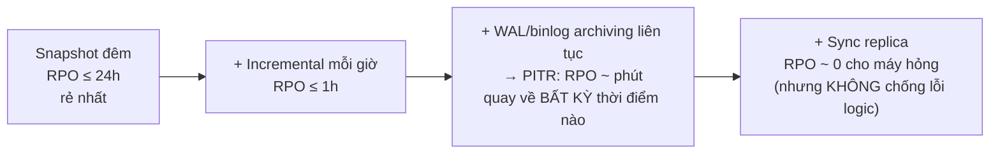

+++
title = "3.2. Backup & Recovery — lớp phòng thủ cuối cùng"
date = "2026-07-13T07:10:00+07:00"
draft = false
tags = ["backend", "system-design"]
series = ["System Design — Tư Duy Thiết Kế Hệ Thống"]
+++

## 1. Problem Statement

Replication chống được máy hỏng — nhưng **trung thành nhân bản mọi thảm họa logic trong mili-giây**: DELETE nhầm, migration hỏng dữ liệu, ransomware mã hóa, bug ghi rác — replica có ngay bản sao hoàn hảo của sai lầm ([3.README §3](/series/system-design/03-availability-reliability/00-tong-quan/)). Backup là lớp duy nhất chống được loại chết này: **bản sao tách rời theo thời gian và theo quyền truy cập.** Và câu hỏi thật của backup chưa bao giờ là "có backup không" — mà là: **restore được không, trong bao lâu, mất bao nhiêu, và đã thử chưa?** Backup chưa từng restore thử là một niềm tin, không phải một năng lực.

## 2. First Principles

**Backup được định nghĩa bởi hai con số của business, không phải bởi công nghệ:** RPO (mất tối đa bao nhiêu dữ liệu) và RTO (khôi phục trong bao lâu) — [12.10 §3.1](/series/system-design/12-evolution/10-disaster-recovery/) đã đặt khung; chương này là kỹ nghệ hiện thực hóa. Mọi lựa chọn (tần suất, loại backup, nơi lưu, cách restore) suy ngược từ hai con số đó — thiết kế backup mà chưa có RPO/RTO ký duyệt là chọn ngẫu nhiên một điểm trên đường cong chi-phí.

**Vì sao backup phải "chết" (cold, bất biến, tách quyền)?** Chính vì nó là lớp *cuối*: mọi lớp trên chết theo kịch bản nào đó — và các kịch bản tồi nhất (ransomware, tài khoản cloud bị chiếm, admin bị lừa/làm bậy) **có quyền admin trong tay**. Backup mà API admin xóa được thì chết cùng admin. Từ đó ra bộ nguyên tắc:

- **3-2-1:** 3 bản, 2 loại media/hệ thống khác nhau, 1 bản off-site (khác region *và* khác account/provider — ngoài blast radius của mọi credential đang dùng hằng ngày).
- **Immutability (WORM):** trong kỳ giữ, *không API nào* xóa/sửa được — kể cả root (object lock/vault lock).
- **Tách quyền:** pipeline backup có credential riêng chỉ-ghi-thêm; con đường restore có quy trình riêng.

**Phổ RPO — không phải nhị phân "backup đêm" vs "sync replication":**

**PITR (point-in-time recovery) là viên ngọc của cả phổ:** base backup + chuỗi WAL/binlog ([5.1 — WAL](/series/system-design/05-data-layer/01-postgresql/), [5.2 — binlog](/series/system-design/05-data-layer/02-mysql/)) cho phép quay về "10:41:59, một giây trước khi migration hỏng chạy" — thứ duy nhất cứu được ca dữ-liệu-hỏng-đã-replicate mà không mất cả ngày dữ liệu. Với mọi DB nghiệp vụ nghiêm túc, PITR là mặc định nên có, không phải nâng cao.

## 3. Kỹ nghệ restore — nửa quan trọng hơn của bài toán

- **RTO thật = thời gian *chuỗi* restore:** phát hiện (thường lâu nhất — dữ liệu hỏng âm thầm có thể sống nhiều ngày trước khi ai đó thấy) → quyết định điểm quay về → tải backup (500GB từ cold storage xuyên region: tính bằng giờ, cộng phí egress) → replay WAL → verify → cắt chuyển. Đo từng khúc bằng drill; DB càng lớn RTO càng phình — **thời gian restore phải nằm trong capacity planning** ([1.4 §6](/series/system-design/01-foundations/04-scale-estimation-capacity-planning/)): đến một cỡ nào đó, chính RTO là lý do phải partition/shard ([Phần 8](/series/system-design/08-data-partitioning/00-tong-quan/)).
- **Restore từng phần** cho tai nạn cục bộ ("khôi phục đúng bảng orders về 10:41 nhưng giữ phần còn lại hiện tại"): restore PITR vào **instance tạm** → trích phần cần → merge có kiểm soát vào production. Kịch bản này *thường gặp hơn* restore toàn phần — và ít được tập hơn hẳn.
- **Test restore tự động, liên tục:** pipeline định kỳ restore bản mới nhất vào môi trường tạm + chạy kiểm tra tính đúng (đếm bảng, checksum, query nghiệp vụ mẫu) — biến "backup dùng được" từ hy vọng thành **fact được chứng minh mỗi ngày** ([12.10 §3.3](/series/system-design/12-evolution/10-disaster-recovery/)). Đây là một pipeline đáng đồng tiền nhất trong toàn bộ hạ tầng.

## 4. Trade-off

| Quyết định | Được | Giá |
|---|---|---|
| Tần suất dày / WAL liên tục | RPO nhỏ | Dung lượng, tải I/O lên nguồn, chi phí lưu + egress |
| Immutable + off-account | Sống qua ransomware/mất account | Không xóa sớm được kể cả khi muốn (đó là tính năng); chi phí giữ đủ kỳ |
| Logical backup (dump SQL) | Linh hoạt (restore một bảng, đổi version/engine) | Chậm cả backup lẫn restore ở cỡ lớn; điểm nhất quán phải để ý |
| Physical backup (snapshot khối/basebackup) | Nhanh, nhất quán, RTO tốt | Trói vào engine/version; restore một phần khó hơn |
| Kỳ giữ dài (năm) | Compliance, điều tra muộn | Chi phí; và dữ liệu cá nhân giữ lâu là *rủi ro pháp lý ngược* (Nghị định 13 — quyền xóa) |

Thực dụng: **cả hai loại** — physical + WAL cho RTO/RPO, logical định kỳ thưa cho tính linh hoạt và di trú.

## 5. Production Considerations

- **Giám sát backup như dịch vụ hạng nhất:** job thành công/thất bại (alert khi *thiếu* backup mới — đừng chỉ alert khi job báo fail: job không chạy thì không có gì báo), kích thước bất thường (backup 2GB thay vì 200GB = có chuyện), tuổi backup mới nhất, kết quả test-restore gần nhất — một dashboard, một owner.
- **Backup mọi thứ có state, không chỉ DB chính:** object storage (versioning + replication), cấu hình hạ tầng (IaC trong git — chính git đó cũng cần backup), secret (quy trình riêng, mã hóa), **và các hệ "dẫn xuất nhưng đắt tiền rebuild"** — [Kafka retention làm nguồn](/series/system-design/05-data-layer/05-clickhouse/), search index ([5.6 §6 — snapshot vì RTO](/series/system-design/05-data-layer/06-elasticsearch/)): "dựng lại được" phải kèm "trong bao lâu".
- **Mã hóa backup + quản khóa tách rời** — backup là bản sao đầy đủ dữ liệu nhạy cảm nằm ở nơi ít được canh nhất; khóa mã hóa mất thì backup thành gạch (khóa cũng cần… backup, quy trình escrow).
- Restore drill **có kịch bản người**: ai phát hiện, ai quyết điểm quay về (mất 4 giờ dữ liệu là quyết định business — [12.10 §3.3](/series/system-design/12-evolution/10-disaster-recovery/)), ai thông báo khách — kỹ thuật restore giỏi vô nghĩa nếu 3 giờ đầu là tranh cãi ai được quyết.

## 6. Anti-patterns

- **Coi replica là backup** — DELETE nhầm lan sang replica trong mili-giây; hai lớp, hai loại chết, không thay nhau ([4.2 §8](/series/system-design/04-distributed-systems/02-replication-consistency/)).
- **Backup chưa từng restore** — tỷ lệ backup hỏng-mà-không-biết ngoài đời cao đến mức đáng sợ: sai quyền, thiếu WAL giữa chừng, script bỏ sót schema, đĩa đích đầy từ tháng trước.
- **Backup cùng account/region với production** — ransomware và kẻ chiếm account xóa cả gốc lẫn backup trong một phiên.
- **Script backup nhà làm + cron + không giám sát** — chết im lặng từ quý trước, phát hiện đúng hôm cần.
- **Chỉ có backup toàn phần** — tai nạn "một bảng" phải trả giá restore "cả cụm": RTO phình ×10 cho 90% ca thực tế.
- **Giữ mọi backup vĩnh viễn** — chi phí + rủi ro pháp lý; kỳ giữ là chính sách có chủ đích (ví dụ: ngày×14, tuần×8, tháng×12, năm×theo luật).

## 7. Khi nào đơn giản là đủ

MVP/tool nhỏ: managed DB với backup tự động + PITR bật sẵn (một checkbox ở đa số cloud) + mỗi quý một lần restore thử bằng tay — 90% giá trị với 5% công sức, và là **một trong hai thứ không được bỏ qua ngay cả ở ngày 1** ([12.1 — những thứ phải đúng từ đầu](/series/system-design/12-evolution/01-monolith-postgresql/)). Toàn bộ kỹ nghệ nặng của chương này (immutable đa account, pipeline test-restore, PITR tự quản) kích hoạt dần theo giá trị dữ liệu — nhưng đường cong đầu tư của backup nên luôn **đi trước** đường cong doanh thu một bước, vì đây là lớp duy nhất không có cơ hội làm lại.

---

*Tiếp theo: [3.3. Active-Active vs Active-Passive](/series/system-design/03-availability-reliability/03-active-active-passive/)*
