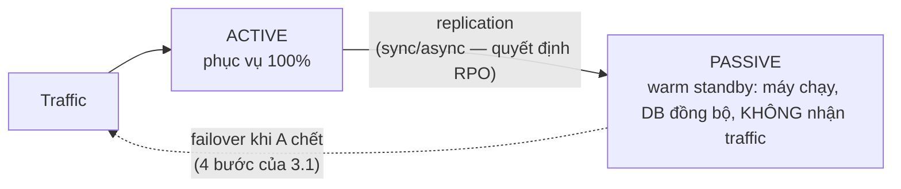
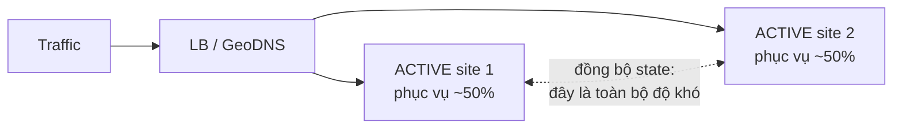

+++
title = "3.3. Active-Active vs Active-Passive — hai triết lý redundancy"
date = "2026-07-13T07:20:00+07:00"
draft = false
tags = ["backend", "system-design"]
series = ["System Design — Tư Duy Thiết Kế Hệ Thống"]
+++

## 1. Problem Statement

Đã quyết có bản dự phòng ([3.1](/series/system-design/03-availability-reliability/01-ha-failover/)) — câu hỏi kế: bản dự phòng **làm gì trong lúc chờ**? Ngồi im (passive) hay cùng phục vụ (active)? Nghe như chi tiết triển khai — thực chất là ngã ba triết lý với hệ quả lan đến tận mô hình dữ liệu: passive đơn giản nhưng đặt cược vào khoảnh khắc chuyển đổi *chưa từng diễn ra thật*; active-active dùng được tài nguyên và "failover liên tục từng giây" nhưng — với tầng có state — mở cánh cửa xung đột ghi mà [4.2 §2.2](/series/system-design/04-distributed-systems/02-replication-consistency/) đã cảnh báo.

## 2. First Principles — câu hỏi thật là "state nằm đâu và ai được ghi"

Với **tầng stateless**, tranh luận kết thúc nhanh: active-active là mặc định hiển nhiên — N instance sau LB *chính là* active-active, thêm máy vừa thêm công suất vừa thêm redundancy, không có gì để xung đột ([2.1](/series/system-design/02-scalability/01-vertical-horizontal-scaling/)). Mọi độ khó của chủ đề này dồn về **tầng state**, nơi câu hỏi phân rã thành: *mấy nơi được nhận GHI cho cùng một mảnh dữ liệu?*

- **Một nơi ghi (single-writer):** không xung đột, nhưng nơi đó chết là phải failover — dù topology đọc có active đến đâu, đường ghi vẫn là active-passive về bản chất.
- **Nhiều nơi ghi cùng mảnh dữ liệu (true multi-writer):** xung đột là tất yếu — cần hòa giải (LWW mất ghi âm thầm, CRDT, merge nghiệp vụ) — [4.2 §2.2](/series/system-design/04-distributed-systems/02-replication-consistency/); chế độ đắt nhất, chỉ cho nơi chứng minh được cần.
- **Nhiều nơi ghi, mỗi nơi một mảnh (partitioned active-active):** mỗi đơn vị dữ liệu một chủ ([12.9 — home region](/series/system-design/12-evolution/09-multi-region/), [8.1 — shard theo chủ sở hữu](/series/system-design/08-data-partitioning/01-partitioning-sharding/)) — cả hệ nhìn tổng thể là active-active, từng mảnh dữ liệu vẫn single-writer: **được phần lớn lợi ích với phần nhỏ độ phức tạp — đích đến thực dụng của đa số hệ lớn.**

Nhìn bằng lăng kính này, "active-active vs active-passive" không phải lựa chọn nhị phân toàn hệ — mà là **quyết định per-tầng, per-loại-dữ-liệu**: stateless active-active, cache active-active (mất được), DB ghi single-writer + đọc từ replica, và giữa các region là partitioned ownership.

## 3. Giải phẫu hai chế độ

### Active-Passive

Điểm yếu cấu trúc không nằm ở sơ đồ — nằm ở **thời gian**: passive là hệ *không ai dùng thật* — bug config, phiên bản lệch, disk đầy, certificate hết hạn tích tụ trong im lặng ("standby rot"); ngày failover là ngày đầu tiên nó chịu tải thật, với xác suất bất ngờ tương ứng. Thuốc duy nhất: **drill định kỳ thật sự chuyển traffic sang** ([12.10 §3.3](/series/system-design/12-evolution/10-disaster-recovery/)) — và ở mức trưởng thành hơn: chuyển vai đều đặn theo lịch (mỗi quý passive thành active) để cả hai bên đều "được dùng thật" — nửa đường đến active-active mà không mở bài toán xung đột.

Biến thể theo độ ấm: **hot** (máy chạy + dữ liệu đồng bộ liên tục — RTO phút, trả tiền ~×2), **warm** (máy chạy nhỏ, scale khi cần — RTO chục phút), **cold** (chỉ có backup + IaC dựng lại — RTO giờ, rẻ nhất) — chọn theo RTO đã ký, không theo cảm giác an toàn.

### Active-Active

Hai lợi ích thật: **failover được kiểm chứng liên tục** (cả hai bên luôn chạy thật — không có standby rot; site chết thì site kia *đã đang* phục vụ, chỉ nhận thêm phần) và **tài nguyên dùng được cả hai**. Hai chi phí thật: **mỗi site phải đủ sức gánh 100%** khi site kia chết — chạy cả hai ở 80% là active-active giả: mất một site, site còn lại nhận 160% và chết theo ([13.4 — dồn tải](/series/system-design/13-production-failure-cases/04-distributed-failures/), [3.1 §6 — headroom](/series/system-design/03-availability-reliability/01-ha-failover/)); nghĩa là tổng tài nguyên vẫn ~×2, tiết kiệm chủ yếu là *dùng* chứ không phải *mua* ít hơn. Và **bài toán state** như §2 — trả lời per-loại-dữ-liệu, không trả lời chung.

## 4. Trade-off

| | Active-Passive | Active-Active |
|---|---|---|
| RTO | Phút (4 bước failover — [3.1 §3](/series/system-design/03-availability-reliability/01-ha-failover/)) | ~0 cho site chết (traffic tự dồn); vẫn cần failover cho *đường ghi* nếu single-writer |
| Độ tin của failover | Đặt cược vào drill | Kiểm chứng liên tục bằng chính production |
| Xung đột ghi | Không (một writer) | Tùy mô hình state — từ không (partitioned) đến vĩnh viễn (multi-writer) |
| Chi phí tài nguyên | ×2 mua, ×1 dùng (hot) → rẻ dần theo độ lạnh | ×2 mua (headroom 100%), ×2 dùng |
| Độ phức tạp | Thấp — một chiều replication | Cao — routing, ownership, đồng bộ hai chiều, drill mất-một-site |
| Phù hợp | DB single-writer, hệ vừa, RTO phút chấp nhận được | Tầng stateless (mặc định), cache, hệ đã partition theo owner, yêu cầu RTO~0 |

## 5. Production Considerations

- **Kiểm chứng "mỗi site gánh nổi 100%" bằng drill rút một site** định kỳ — không phải bằng phép cộng trên slide; đây là drill quan trọng nhất của active-active ([12.9 §7 — ảo tưởng active-active](/series/system-design/12-evolution/09-multi-region/)).
- Active-passive: **giám sát sức khỏe passive như production** (đồng bộ, disk, cert, version) + failover drill theo lịch — standby không được giám sát là standby không tồn tại.
- Routing tầng global (GeoDNS/anycast/LB): nhớ bài TTL và cache DNS khi cần rút một site ([13.5](/series/system-design/13-production-failure-cases/05-infrastructure-failures/), [2.2 §2](/series/system-design/02-scalability/02-load-balancer/)).
- Với partitioned active-active: **audit mọi đường ghi** để bảo đảm mỗi mảnh dữ liệu đúng một chủ — một admin tool ghi chéo là phân kỳ âm thầm ([12.9 §7](/series/system-design/12-evolution/09-multi-region/)); và thiết kế trước hành vi khi *liên kết giữa hai site đứt* (mỗi site tiếp tục phục vụ phần của mình, luồng chéo degrade — [4.1 §7](/series/system-design/04-distributed-systems/01-cap-pacelc/)).
- Deploy trong active-active là **canary tự nhiên**: lên site nhỏ trước, quan sát, rồi lan — tận dụng nó, và đừng bao giờ deploy cả hai site cùng lúc (bug mới là failure domain chung — [3.1 §2](/series/system-design/03-availability-reliability/01-ha-failover/)).

## 6. Anti-patterns

- **Active-active không headroom** — mỗi site 80%: redundancy trên giấy, sập dây chuyền trong thực tế.
- **Multi-writer "cho đối xứng đẹp"** khi chưa có chiến lược hòa giải viết ra và test — mất ghi âm thầm theo LWW ([4.2 §8](/series/system-design/04-distributed-systems/02-replication-consistency/)); partitioned ownership gần như luôn là câu trả lời tốt hơn.
- **Passive chưa từng nhận traffic thật** — failover đầu tiên là lần chạy thật đầu tiên, giữa sự cố.
- **Active-passive nhưng RPO/RTO chưa ký** — ngày failover mới phát hiện replication async đã trễ 4 giờ và không ai được quyền quyết mất 4 giờ dữ liệu ([12.10 §3.1](/series/system-design/12-evolution/10-disaster-recovery/)).
- **Trộn hai chế độ không chủ đích:** app active-active hai site nhưng cả hai ghi về một DB ở site 1 — site 2 "active" chỉ là latency cộng thêm và ảo giác redundancy: vẽ **đường ghi** ra giấy trước khi tuyên bố active-active.
- **Nâng cấp lên active-active vì uy tín kiến trúc** — không có yêu cầu RTO~0 từ business thì active-passive drill đều đặn rẻ hơn và đáng tin không kém.

## 7. Khi nào KHÔNG cần cả hai

Hệ chấp nhận RTO hàng giờ: **cold standby = backup tốt + IaC dựng lại từ đầu** ([3.2](/series/system-design/03-availability-reliability/02-backup-recovery/), [12.10 — lớp 3](/series/system-design/12-evolution/10-disaster-recovery/)) là chế độ redundancy rẻ nhất và ít bộ phận chuyển động nhất — với điều kiện *đã đo thời gian dựng lại thật*. Đường trưởng thành lành mạnh: cold → hot passive + drill → partitioned active-active — mỗi bậc kích hoạt bởi RTO business ký, không bởi sơ đồ đẹp hơn ([12 bài học 2](/series/system-design/12-evolution/00-tong-quan/)).

---

*Hết Phần 3. Quay lại [mục lục chính](/series/system-design/00-muc-luc/).*
