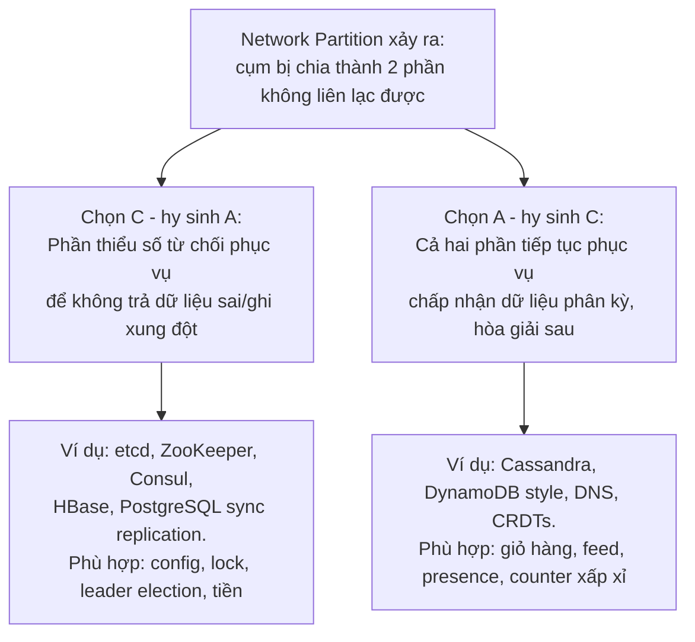

+++
title = "4.1. CAP Theorem & PACELC"
date = "2026-07-13T07:30:00+07:00"
draft = false
tags = ["backend", "system-design"]
series = ["System Design — Tư Duy Thiết Kế Hệ Thống"]
+++

## 1. Problem Statement

Khoảnh khắc hệ thống chuyển từ 1 node sang N node — vì cần chịu tải cao hơn hoặc sống sót khi 1 máy chết — nó bước vào lãnh thổ của Distributed Systems, nơi có những giới hạn **toán học**, không phải giới hạn kỹ thuật. Không framework nào, không cloud provider nào vượt qua được chúng. CAP và PACELC là hai giới hạn nền tảng nhất: chúng nói rằng một số tổ hợp thuộc tính mà bạn muốn là **bất khả thi**, và việc của Architect là chọn hy sinh cái gì.

Hiểu sai CAP dẫn đến hai lỗi ngược nhau: hứa với business một hệ thống "vừa luôn đúng vừa luôn sẵn sàng" (bất khả thi), hoặc dùng CAP làm cớ từ bỏ consistency ở những nơi hoàn toàn giữ được.

## 2. CAP Theorem — phát biểu chính xác

Ba thuộc tính:

- **C — Consistency (linearizability):** mọi thao tác đọc thấy kết quả của thao tác ghi mới nhất, như thể chỉ có một bản dữ liệu duy nhất.
- **A — Availability:** mọi request đến node còn sống đều nhận được response (không lỗi, không treo vô hạn).
- **P — Partition tolerance:** hệ thống tiếp tục hoạt động khi mạng giữa các node bị đứt/chia cắt.

**Định lý (Gilbert & Lynch, 2002):** khi network partition xảy ra, không thể có đồng thời C và A. Phải chọn một.

### Hiểu đúng ba điểm hay bị hiểu sai

**Một — P không phải lựa chọn.** Mạng *sẽ* đứt: switch hỏng, cáp quang biển đứt (chuyện thường kỳ ở Việt Nam), GC pause dài làm node "biến mất", DNS lỗi. Từ chối chọn P nghĩa là hệ thống có hành vi không định nghĩa khi partition xảy ra — tức là chọn ngẫu nhiên giữa mất C và mất A vào thời điểm tệ nhất. Vậy lựa chọn thực tế chỉ là: **khi P xảy ra, hy sinh C hay hy sinh A?**

**Hai — lựa chọn chỉ kích hoạt khi có partition.** Lúc mạng khỏe (99.9% thời gian), hệ thống có thể có cả C lẫn A. CAP không nói gì về lúc bình thường — đó là khoảng trống mà PACELC lấp.

**Ba — C và A không phải nhị phân.** Giữa linearizability và "hỗn loạn" có cả một phổ consistency models ([chương 4.2](/series/system-design/04-distributed-systems/02-replication-consistency/)); giữa "sống hoàn toàn" và "chết hoàn toàn" có degraded mode (chỉ phục vụ đọc, phục vụ dữ liệu cũ có đánh dấu...). Thiết kế giỏi là thiết kế **theo phổ**, không theo nhị phân.

### Hai lựa chọn khi partition xảy ra

Chú ý cách hệ CP hy sinh A: dùng **quorum** ([chương 4.3](/series/system-design/04-distributed-systems/03-consensus-quorum-leader-election/)) — phần chứa đa số node tiếp tục phục vụ, phần thiểu số dừng. Như vậy "hy sinh A" thường chỉ là hy sinh A ở thiểu số node, không phải sập toàn hệ thống.

## 3. PACELC — phần quan trọng hơn trong đời thực

CAP chỉ nói về lúc có partition — vài phút mỗi năm. PACELC (Abadi) mở rộng cho 99.9% thời gian còn lại:

> **P**artition → chọn **A** hay **C**; **E**lse (bình thường) → chọn **L**atency hay **C**onsistency.

Vế "Else" xuất phát từ vật lý: muốn consistency giữa các replica, thao tác ghi phải **chờ** replica xác nhận. Replica càng xa, chờ càng lâu. Round-trip HCM ↔ Singapore ~30ms, HCM ↔ US ~180ms — synchronous replication xuyên region nghĩa là **mọi thao tác ghi** cộng thêm chừng đó latency, mãi mãi. Đây là trade-off trả giá hằng ngày, khác với CAP chỉ trả khi có sự cố.

| Hệ thống | Khi Partition | Bình thường | Đọc là |
|---|---|---|---|
| DynamoDB (default), Cassandra | A | L | PA/EL — nhanh, chấp nhận stale |
| BigTable, HBase | C | C | PC/EC — nhất quán, chịu latency |
| MongoDB (mặc định) | C (đa số) | C (đọc từ primary) | PC/EC nghiêng consistency |
| Cassandra với `QUORUM` R/W | tùy quorum | C hơn, L tệ hơn | tunable — chọn theo từng query |
| PostgreSQL async replica | (single-master) | L (đọc replica có thể stale) | trade-off ở tầng ứng dụng |

Điểm đáng giá nhất của PACELC với người thiết kế: nhiều hệ thống hiện đại cho **chọn theo từng thao tác** (per-request consistency level). Nghĩa là câu hỏi không còn là "chọn DB nào" mà là "**thao tác nào** cần C, thao tác nào cần L" — một cấp độ thiết kế mịn hơn hẳn.

## 4. First Principles

**Vì sao không thể có cả C và A khi partition?** Chứng minh nằm gọn trong một tình huống: node X và Y mất liên lạc. Client ghi giá trị mới vào X. Client khác đọc từ Y. Y chỉ có hai lựa chọn: trả giá trị nó đang có (cũ → mất C), hoặc từ chối/chờ (→ mất A). Không tồn tại lựa chọn thứ ba, vì thông tin vật lý không thể truyền từ X sang Y. Toàn bộ định lý chỉ có vậy — và vì nó chỉ có vậy, không có công nghệ nào "giải" được nó.

**Nếu giả vờ nó không tồn tại thì sao?** Hệ thống vẫn sẽ chọn — nhưng chọn ngẫu nhiên theo bug. Kịch bản kinh điển: hai nửa cụm đều nghĩ mình là chính (split brain, [chương 4.4](/series/system-design/04-distributed-systems/04-clock-partition-split-brain/)), cả hai nhận ghi, dữ liệu phân kỳ không hòa giải được → mất dữ liệu thật, thường là của khách hàng thật.

**Giả định ngầm cần soi:** "consistency" trong CAP là linearizability — mức mạnh nhất. Ứng dụng của bạn thường không cần mức đó cho đa số thao tác. Đừng trả giá của linearizability cho một cái feed hiển thị lượt like.

## 5. Trade-off — quyết định theo nghiệp vụ, không theo hệ thống

Sai lầm phổ biến: chọn "CP hay AP" một lần cho cả hệ thống. Đúng hơn: phân loại **từng thao tác nghiệp vụ**:

| Thao tác | Cần gì | Vì sao |
|---|---|---|
| Trừ tiền tài khoản, trừ tồn kho khan hiếm | C — từ chối phục vụ còn hơn sai | Ghi sai không đảo ngược được bằng xin lỗi |
| Thêm vào giỏ hàng | A — nhận ghi cả khi partition, merge sau | Mất giỏ hàng = mất doanh thu; giỏ hàng merge được (union) |
| Đếm view, like | A + L | Sai số 1% không ai nhận ra |
| Đăng nhập / session | Trung gian: stale vài giây chấp nhận được, nhưng logout/revoke cần lan nhanh | Security-sensitive |
| Cấu hình hệ thống, feature flag, lock phân tán | C tuyệt đối (dùng etcd/ZooKeeper) | Hai node thấy config khác nhau = hành vi không định nghĩa |

Chi phí đi kèm mỗi phía:

- **Phía C:** latency ghi cao hơn; khi sự cố mạng, một phần hệ thống chủ động dừng — cần thiết kế degraded mode và thông điệp cho user; cần quorum → tối thiểu 3 node, tốt nhất 3 AZ.
- **Phía A:** cần cơ chế hòa giải xung đột (last-write-wins — dễ nhưng *mất ghi âm thầm*; vector clock/CRDT — đúng nhưng phức tạp); bug loại "đọc thấy dữ liệu cũ" rất khó tái hiện; đội support phải xử lý các ca "tôi vừa đổi mà không thấy đổi".

## 6. Production Considerations

- **Kiểm tra lựa chọn CAP của từng dependency:** Redis Sentinel có thể mất ghi khi failover (nghiêng A); etcd dừng ghi khi mất quorum (C). Dùng Redis làm lock phân tán nghiêm túc là dùng sai phía của CAP.
- **Test partition thật:** phần lớn hệ thống chưa từng bị test hành vi khi partition trước khi nó xảy ra ở production. Công cụ: Jepsen (cho DB), chaos engineering (iptables DROP giữa các AZ trong môi trường staging) — xem hành vi thực tế thay vì tin tài liệu.
- **Giám sát các chỉ số phân kỳ:** replica lag, số xung đột hòa giải/giây, số request bị từ chối vì mất quorum. Chúng là "nhiệt kế CAP" của hệ thống.
- **Runbook cho partition:** người trực cần biết trước — khi region A mất liên lạc region B, hệ thống *được thiết kế* để làm gì? Nếu câu trả lời không có sẵn trong tài liệu, nó sẽ được quyết định trong hoảng loạn.

## 7. Best Practices

- Viết lựa chọn C/A **theo từng luồng nghiệp vụ** vào ADR, kèm hành vi kỳ vọng khi partition ("checkout: từ chối và hiện thông báo; browse: phục vụ từ cache, chấp nhận stale 5 phút").
- Tận dụng tunable consistency: cùng một Cassandra, ghi đơn hàng dùng `QUORUM`, ghi analytics event dùng `ONE`.
- Thiết kế nghiệp vụ để **giảm nhu cầu C**: đặt chỗ (reserve) thay vì trừ thẳng, append-only ledger thay vì update số dư, idempotency key cho mọi thao tác ghi. Cách né CAP tốt nhất là thiết kế lại thao tác để xung đột không thể xảy ra hoặc merge được.
- Trong một region, độ trễ thấp cho phép chọn C khá "rẻ" (sync replication nội region ~1–2ms). Xuyên region, C trở nên đắt. Quy tắc thô: **C trong region, A giữa các region** phù hợp với đa số hệ thống ([Phần 12, giai đoạn 9](/series/system-design/12-evolution/09-multi-region/)).

## 8. Anti-patterns

- **"Chọn AP cho toàn hệ thống vì cần uptime cao"** rồi xây payment trên đó — mất tiền thật để đổi lấy uptime của... trang landing.
- **"Chọn CP cho chắc"** rồi ngạc nhiên khi mất 1 AZ làm dừng ghi toàn hệ thống dù 2/3 hạ tầng còn sống khỏe.
- **Last-write-wins làm chiến lược mặc định không suy nghĩ:** LWW = "ghi nào có timestamp muộn hơn thắng" = mất ghi âm thầm + phụ thuộc đồng hồ (mà đồng hồ thì lệch — [chương 4.4](/series/system-design/04-distributed-systems/04-clock-partition-split-brain/)).
- **Nhân danh CAP để bỏ transaction trong 1 node:** CAP nói về hệ *phân tán*. PostgreSQL trên 1 node cho ACID đầy đủ không mất A. Đừng ăn chi phí của distributed khi chưa distributed.

## 9. Khi nào KHÔNG cần quan tâm

Khi toàn bộ trạng thái nằm trong **một** database node (+ backup, + failover thủ công chấp nhận vài phút downtime): CAP gần như không chạm đến bạn, và đó là một *ưu điểm kiến trúc* đáng giữ càng lâu càng tốt. Thời điểm phải quan tâm là khi xuất hiện bản sao dữ liệu thứ hai có thể nhận truy cập — read replica, cache, cluster đa node, region thứ hai. Từ khoảnh khắc đó, mọi nội dung của chương này áp dụng.

---

*Tiếp theo: [4.2. Replication & Consistency Models](/series/system-design/04-distributed-systems/02-replication-consistency/)*
