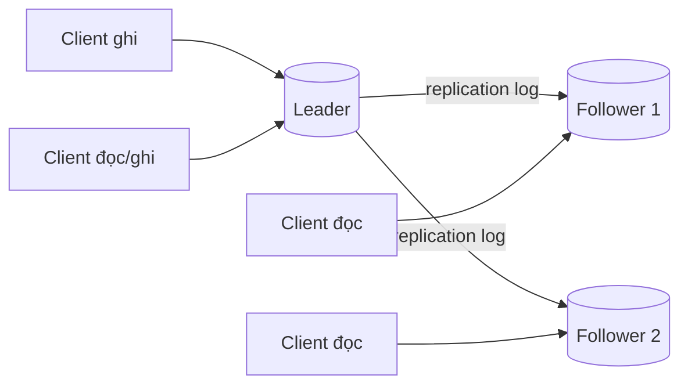

+++
title = "4.2. Replication & Consistency Models"
date = "2026-07-13T07:40:00+07:00"
draft = false
tags = ["backend", "system-design"]
series = ["System Design — Tư Duy Thiết Kế Hệ Thống"]
+++

## 1. Problem Statement

Replication — giữ nhiều bản sao của cùng một dữ liệu trên nhiều node — tồn tại vì ba lý do, và chỉ ba:

1. **Availability/Durability:** máy chết, disk hỏng; bản sao thứ hai là thứ duy nhất đứng giữa bạn và mất dữ liệu.
2. **Read scalability:** một node có trần đọc; N bản sao nhân trần đọc lên ~N lần.
3. **Latency theo địa lý:** đặt bản sao gần user để đọc nhanh.

Nhưng khoảnh khắc tồn tại bản sao thứ hai, một câu hỏi không thể né sinh ra: **hai bản sao có giống nhau không, vào lúc nào?** Toàn bộ lý thuyết consistency models là các câu trả lời khác nhau cho câu hỏi này — mỗi câu trả lời một mức giá.

## 2. Các kiến trúc replication

### 2.1. Single-leader (primary–replica)

Mọi ghi đi qua một leader; leader lan truyền sang follower. Đây là mô hình của PostgreSQL, MySQL, MongoDB, Redis, Kafka (per-partition).

Lựa chọn cốt lõi: lan truyền **sync hay async**?

- **Async (mặc định phổ biến):** leader xác nhận ngay, follower đuổi theo. Ghi nhanh; nhưng leader chết trước khi follower kịp nhận → **mất các ghi đã xác nhận**. Ngoài ra follower luôn trễ một khoảng (replica lag — nguồn sự cố kinh điển, [Phần 13.2](/series/system-design/13-production-failure-cases/02-database-failures/)).
- **Sync:** leader chờ follower xác nhận. Không mất ghi khi 1 node chết; giá là +latency mỗi ghi và follower chậm/chết kéo cả cụm chậm/dừng. Thực dụng: **semi-sync** — chờ đúng 1 follower trong nhóm xác nhận.

Ưu điểm lớn nhất của single-leader: **không có xung đột ghi** — mọi ghi được xếp thứ tự tại một điểm. Nhược điểm: leader là trần ghi và là SPOF cần failover ([chương 4.3](/series/system-design/04-distributed-systems/03-consensus-quorum-leader-election/)).

### 2.2. Multi-leader

Nhiều node cùng nhận ghi, đồng bộ hai chiều. Dùng chủ yếu cho multi-region (mỗi region một leader) hoặc ứng dụng offline-first. Cái giá phải trả: **xung đột ghi là tất yếu** — hai user sửa cùng bản ghi ở hai region trong cùng khoảnh khắc. Chiến lược hòa giải: last-write-wins (mất ghi âm thầm), ưu tiên theo region, merge theo cấu trúc dữ liệu (CRDT), hoặc đẩy lên tầng ứng dụng xử lý. Không chiến lược nào miễn phí; LWW là phổ biến nhất và nguy hiểm nhất vì nó *im lặng*.

### 2.3. Leaderless (Dynamo-style)

Client (hoặc coordinator) ghi thẳng vào N replica, đọc từ N replica, dùng **quorum** để suy ra giá trị đúng: ghi thành công khi W node xác nhận, đọc hỏi R node; nếu `W + R > N` thì tập đọc và tập ghi giao nhau → đọc *thường* thấy ghi mới nhất. Cassandra, Riak, DynamoDB nội bộ theo họ này. Không failover vì không có leader để chết — đổi lấy việc consistency trở thành xác suất được tinh chỉnh bằng R/W/N, kèm các cơ chế sửa nền (read repair, hinted handoff, anti-entropy).

## 3. Phổ Consistency Models

Từ mạnh đến yếu — mạnh hơn = dễ lập trình hơn + đắt hơn (latency, availability):

| Mức | Cam kết | Giá |
|---|---|---|
| **Linearizability** | Như thể chỉ có một bản dữ liệu; đọc luôn thấy ghi mới nhất | Cần consensus/quorum trên mỗi thao tác; latency cao; đây là chữ C trong CAP |
| **Sequential** | Mọi client thấy các thao tác theo cùng một thứ tự (không cần đúng thời gian thực) | Rẻ hơn linearizability một chút |
| **Causal** | Thao tác có quan hệ nhân quả được thấy đúng thứ tự (câu trả lời không xuất hiện trước câu hỏi) | Cần theo dõi phụ thuộc (version vector); điểm cân bằng đẹp ít hệ thống hỗ trợ sẵn |
| **Read-your-writes** | User thấy được ghi của chính mình | Rẻ: sticky routing hoặc đọc leader sau khi ghi |
| **Monotonic reads** | Không "đi lùi thời gian" giữa hai lần đọc | Rẻ: sticky theo replica |
| **Eventual** | Nếu ngừng ghi, các bản sao *rồi sẽ* hội tụ | Gần như miễn phí — và gần như không cam kết gì |

### Hai model đáng đồng tiền nhất trong thực chiến

**Read-your-writes:** user sửa profile, refresh, thấy dữ liệu cũ → nghĩ là mất dữ liệu, bấm lưu lại, mở ticket. Đa số bug "eventual consistency" mà user *cảm nhận được* thuộc loại này, và nó rẻ đến bất ngờ để fix: sau khi user ghi, đọc từ leader trong X giây (hoặc gắn version vào session, chờ replica đuổi kịp version đó). Mua được 80% trải nghiệm "strong consistency" với 5% chi phí.

**Causal:** trong hệ thống comment/chat, reply xuất hiện trước message gốc là vô nghĩa với con người. Nếu tầng dữ liệu không hỗ trợ, xử lý ở tầng ứng dụng (gắn parent-id và giữ lại render cho đến khi parent đến).

## 4. First Principles

**Vì sao không thể có strong consistency miễn phí?** Vì thông tin lan truyền với tốc độ hữu hạn. "Mọi bản sao giống nhau tại mọi thời điểm" đòi hỏi hoặc chờ (latency) hoặc từ chối phục vụ khi chưa chắc (availability) — đây chính là CAP/PACELC nhìn từ góc replication. Mọi consistency model chỉ là cách phân bổ khác nhau của cùng một khoản chi phí vật lý.

**Nếu bỏ replication thì sao?** Một node duy nhất: disk hỏng = mất dữ liệu từ lần backup cuối; node chết = downtime đến khi restore xong (giờ, không phải phút, với DB lớn). Nếu business chấp nhận được RPO/RTO đó — bỏ replication là lựa chọn *hợp lệ* và đơn giản hơn nhiều. Đa số business không chấp nhận, nên replication gần như là bắt buộc từ rất sớm — nhưng hãy để nó là quyết định có ý thức.

**Giả định ngầm của read replica:** ứng dụng chịu được đọc stale. Giả định này đúng với 90% thao tác và sai chết người với 10% còn lại (đọc số dư trước khi trừ tiền, đọc tồn kho trước khi bán). Kỹ thuật phân luồng: **thao tác nào tham gia quyết định ghi thì đọc leader; thao tác chỉ hiển thị thì đọc replica.**

## 5. Trade-off

| Quyết định | Được | Mất |
|---|---|---|
| Async replication | Ghi nhanh, follower chậm không ảnh hưởng leader | Mất ghi khi leader chết; replica lag |
| Semi-sync | Không mất ghi khi 1 node chết | +1 round-trip mỗi ghi (~0.5–2ms nội region) |
| Đọc từ replica | Nhân trần đọc; giảm tải leader | Stale read; bug khó tái hiện; cần phân luồng đọc |
| Multi-leader xuyên region | Ghi latency thấp ở mọi region; sống sót khi mất region | Xung đột ghi vĩnh viễn; độ phức tạp cao nhất trong các mô hình |
| Quorum R/W (leaderless) | Không failover; tunable per-request | Latency = max của node chậm nhất trong quorum; sửa nền phức tạp |

## 6. Production Considerations

- **Replica lag là metric hạng nhất:** đo bằng giây *và* bằng byte; alert trước khi lag vượt ngưỡng ứng dụng chịu được. Lag tăng đơn điệu = follower không bao giờ đuổi kịp = sự cố đang ủ.
- **Failover là nơi mất dữ liệu, không phải lúc chạy bình thường:** với async replication, promote follower trễ nhất → mất ghi; leader cũ quay lại tưởng mình còn là leader → split brain. Dùng cơ chế failover có fencing đàng hoàng (Patroni cho PostgreSQL, orchestrator cho MySQL) — chi tiết ở [chương 4.3](/series/system-design/04-distributed-systems/03-consensus-quorum-leader-election/) và [4.4](/series/system-design/04-distributed-systems/04-clock-partition-split-brain/).
- **Backup không thay thế replication và ngược lại:** replication bảo vệ khỏi hỏng máy, backup bảo vệ khỏi hỏng *dữ liệu* (DELETE nhầm được replicate ngay lập tức sang mọi replica, rất nhanh và rất đúng). Cần cả hai + PITR (point-in-time recovery).
- **Test restore định kỳ:** backup chưa từng restore thử là backup giả định. Đo thời gian restore thực — nó là RTO thật của bạn.
- Connection routing (đọc đi replica, ghi đi leader) nên nằm ở một chỗ (proxy như PgBouncer+HAProxy, hoặc tầng DAL của app) — rải logic routing khắp codebase là công thức cho bug stale-read ngẫu nhiên.

## 7. Best Practices

- Bắt đầu bằng single-leader + async + semi-sync cho dữ liệu quan trọng. Chỉ rời mô hình này khi có lý do định lượng.
- Phân loại mọi thao tác đọc thành hai nhóm ngay trong code (ví dụ hai connection pool: `db_rw`, `db_ro`) — ép developer *chọn có ý thức* thay vì mặc định.
- Dùng "lag-aware routing" khi có thể: chỉ route đọc sang replica có lag < ngưỡng.
- Với multi-region: một region nhận ghi (single-leader toàn cục) đơn giản hơn multi-leader **rất nhiều** — chỉ chuyển sang multi-leader khi latency ghi xuyên region thật sự không chấp nhận được ([Phần 12, giai đoạn 9](/series/system-design/12-evolution/09-multi-region/)).

## 8. Anti-patterns

- **Đọc replica ngay sau khi ghi** trong cùng một request flow — bug read-your-writes kinh điển, xuất hiện ngẫu nhiên theo lag, không tái hiện được ở môi trường dev (nơi lag = 0).
- **Coi replica là backup.** DROP TABLE lan sang replica trong mili-giây.
- **Thêm replica để giải cứu leader đang quá tải vì ghi.** Replica chỉ nhân trần *đọc*; còn nhân thêm gánh replication cho leader.
- **Multi-leader vì nghe "HA hơn"** khi chưa có chiến lược hòa giải xung đột được viết ra và test.
- **Semi-sync bật rồi tắt im lặng:** nhiều hệ semi-sync tự hạ xuống async khi follower chậm — nếu không giám sát trạng thái này, bạn đang chạy async mà tưởng semi-sync.

## 9. Khi nào KHÔNG nên dùng

Replication cho **read scaling** là sai thuốc khi: workload là write-heavy (replica không giúp), hoặc vấn đề đọc giải được rẻ hơn bằng cache/index (thường là vậy — thử trước). Replication cho **HA** là quá liều khi business chấp nhận RTO hàng giờ — một node + backup tốt + quy trình restore đã tập dượt là kiến trúc hợp lệ, rẻ và *dễ hiểu*, cho rất nhiều hệ thống nội bộ.

---

*Tiếp theo: [4.3. Consensus, Quorum & Leader Election](/series/system-design/04-distributed-systems/03-consensus-quorum-leader-election/)*
