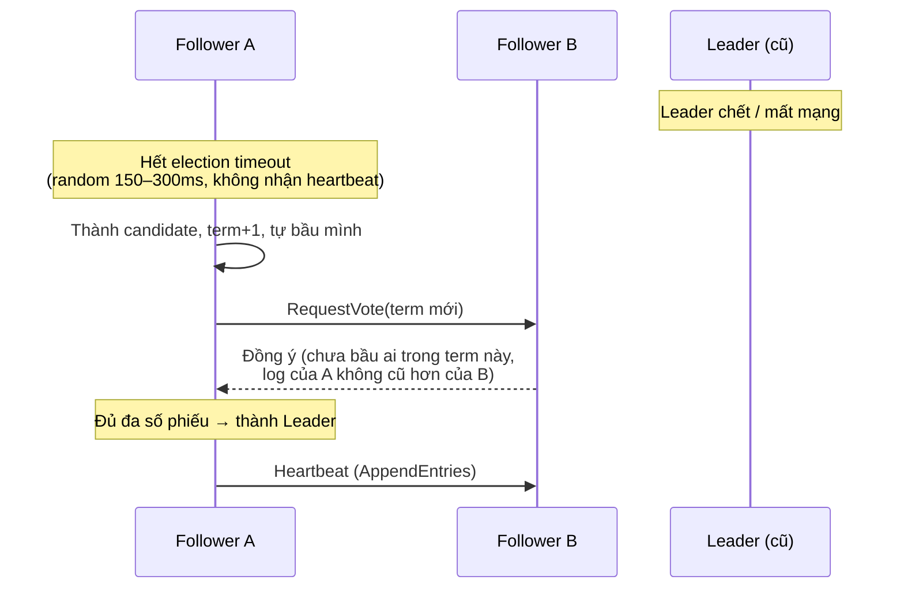

+++
title = "4.3. Consensus, Quorum & Leader Election"
date = "2026-07-13T07:50:00+07:00"
draft = false
tags = ["backend", "system-design"]
series = ["System Design — Tư Duy Thiết Kế Hệ Thống"]
+++

## 1. Problem Statement

Một cụm nhiều node phải trả lời được những câu hỏi nghe rất tầm thường:

- Ai là leader hiện tại?
- Cấu hình hiện hành là bản nào?
- Ghi này đã "chính thức" chưa (commit hay chưa)?

Điều phản trực giác: trong hệ phân tán, các câu hỏi này **khó một cách nền tảng**. Node không phân biệt được "node kia chết" với "mạng chậm" với "node kia đang GC pause". Không có đồng hồ chung đáng tin. Message có thể đến trễ, đến hai lần, hoặc không đến. Consensus là bài toán làm cho N node **đồng ý về một giá trị** trong điều kiện đó — và nó là nền móng dưới mọi hệ thống phân tán nghiêm túc: failover tự động, distributed lock, config quản lý tập trung, Kafka controller, Kubernetes control plane.

Kỹ sư backend hiếm khi phải *cài đặt* Raft/Paxos — nhưng phải hiểu **tính chất và giới hạn** của chúng, vì đó là tính chất và giới hạn của etcd, ZooKeeper, Consul, và của chính cơ chế failover trong DB của bạn.

## 2. Quorum — khối lắp ghép cơ bản

**Quorum = đa số nghiêm ngặt: ⌊N/2⌋ + 1.** Với 3 node cần 2; với 5 node cần 3.

Vì sao đa số? Vì **hai tập đa số bất kỳ luôn giao nhau ít nhất một node**. Đây là mệnh đề toán học nhỏ mà cả tòa nhà đứng trên nó:

- Quyết định X được đa số chấp nhận, quyết định Y được đa số chấp nhận → có ít nhất một node biết cả hai → hệ thống không thể "quên" quyết định đã commit, và không thể có hai quyết định mâu thuẫn cùng được commit.
- Khi partition chia cụm thành hai phần, **nhiều nhất một phần** chứa đa số → chỉ một phần được tiếp tục quyết định → split brain bị chặn về mặt cấu trúc.

Ba hệ quả thiết kế thuộc lòng:

1. **Cụm phải là số lẻ** (3, 5, 7). Cụm 4 node chịu 1 node chết — y như cụm 3 — nhưng đắt hơn và *dễ* rơi vào 2–2 khi partition. Node chẵn thêm vào không mua thêm gì.
2. **Cụm 2N+1 chịu được N node chết.** 3 node chịu 1; 5 chịu 2. Muốn sống qua **một AZ sập**, đặt 3 node trên 3 AZ.
3. **Mất quorum = cụm ngừng ghi** (vẫn có thể phục vụ đọc stale). Đây là hệ CP hy sinh A một cách chủ động — hành vi *đúng thiết kế*, người trực cần biết trước điều này.

## 3. Consensus — Raft ở mức người thiết kế cần

Paxos là thuật toán gốc (đúng nhưng nổi tiếng khó hiểu); **Raft** được thiết kế để hiểu được, và là thứ chạy trong etcd, Consul, CockroachDB, TiKV, Kafka KRaft. Raft phân rã consensus thành hai phần:

### 3.1. Leader Election

Node ở một trong ba vai: leader, follower, candidate. Thời gian chia thành các **term** đánh số tăng dần — term là "đồng hồ logic" chống lệnh cũ.

Chi tiết đáng giá: timeout **ngẫu nhiên** để tránh các node tranh cử đồng loạt mãi (live-lock); mỗi node chỉ bầu **một lần mỗi term** (chốt trên disk) nên không thể có hai leader cùng term; node chỉ bầu cho candidate có log **không cũ hơn mình** — nên leader mới luôn có mọi entry đã commit, không mất dữ liệu đã hứa.

### 3.2. Log Replication

Mọi thay đổi là một entry trong log. Leader nhận ghi → append vào log mình → gửi cho follower → khi **đa số** đã ghi entry → entry được **commit** → apply vào state machine → trả lời client. Node chậm/chết được leader "đuổi kịp" bằng cách gửi lại phần log thiếu.

Cam kết cốt lõi của consensus: **entry đã commit không bao giờ mất và không bao giờ bị đảo ngược**, chừng nào đa số node còn sống. Cái giá: mỗi ghi tốn 1 round-trip đến đa số node (nội region ~1–2ms; đây là lý do không ai trải consensus xuyên lục địa cho đường ghi nóng nếu tránh được).

## 4. First Principles

**Vì sao cần cả một thuật toán chỉ để "đồng ý"?** Vì kết quả FLP (Fischer–Lynch–Paterson): trong hệ bất đồng bộ có thể có node chết, **không tồn tại** thuật toán consensus vừa an toàn vừa *đảm bảo* kết thúc. Raft/Paxos chọn: an toàn tuyệt đối (không bao giờ hai quyết định mâu thuẫn), còn tiến triển thì chỉ đảm bảo khi mạng "đủ ổn". Thực tế nghĩa là: khi mạng chập chờn kéo dài, cụm có thể bầu đi bầu lại không xong — an toàn nhưng đứng im. Hiểu điều này để không ngạc nhiên khi thấy etcd "sống mà không ghi được" trong sự cố mạng.

**Nếu không dùng consensus cho failover thì sao?** Thay thế phổ biến là script tự chế: "ping leader, 3 lần fail thì promote replica". Script này không phân biệt được leader chết với mạng chậm → promote trong khi leader cũ còn sống và còn nhận ghi → **hai leader, dữ liệu phân kỳ** ([chương 4.4](/series/system-design/04-distributed-systems/04-clock-partition-split-brain/)). Mọi cơ chế failover tự chế không có quorum + fencing đều là split brain đang chờ lịch hẹn.

**Giả định của Raft cần biết:** đa số node sống và liên lạc được; disk không nói dối (fsync thật); một node không "quên" phiếu đã bầu. Chạy etcd trên disk có write cache gian dối hoặc trên VM bị snapshot/restore tùy tiện là phá giả định — và phá luôn cam kết an toàn.

## 5. Trade-off

| Quyết định | Được | Mất |
|---|---|---|
| Dùng consensus (etcd/ZooKeeper) cho metadata + failover | Đúng tuyệt đối; failover tự động an toàn | Thêm một cụm phải vận hành; mất quorum = mất ghi metadata; latency ghi qua quorum |
| Failover thủ công (người bấm nút) | Đơn giản, không split brain (người là consensus) | RTO = thời gian đánh thức người + quyết định; không đạt được 4 số 9 |
| Cụm 3 node | Rẻ, đủ cho hầu hết | Chịu đúng 1 node chết; bảo trì 1 node = không còn dư địa lỗi |
| Cụm 5 node | Chịu 2 node chết; bảo trì thoải mái hơn | Ghi chờ 3/5 xác nhận — chậm hơn một chút; đắt hơn |
| Đọc qua leader (linearizable read) | Đọc luôn đúng | Leader thành bottleneck đọc; etcd có cơ chế lease/read-index để giảm giá này |

**Nguyên tắc phân tầng quan trọng nhất:** consensus đắt → chỉ dùng cho **control plane** (ai là leader, config, membership, lock) — luồng ít ghi nhưng phải đúng tuyệt đối. **Data plane** (dữ liệu nghiệp vụ khối lượng lớn) đi qua single-leader replication thường, được *bảo vệ* bởi control plane. Kiến trúc Kafka, Kubernetes, và Patroni-PostgreSQL đều theo đúng công thức này.

## 6. Production Considerations

- **Giám sát:** leader elections/giờ (bầu cử thường xuyên = mạng hoặc disk có vấn đề), proposal latency (p99), số node khỏe so với quorum, disk fsync latency (Raft nhạy fsync — disk chậm làm cả cụm chậm).
- **Alert khi còn đúng quorum tối thiểu:** cụm 3 còn 2 node = một sự cố nữa là dừng ghi — đây là alert khẩn, đừng đợi mất hẳn quorum.
- **Không trải cụm consensus trên 2 site:** 2 site không có đa số tự nhiên (2–2 hoặc 3–1 đều có kịch bản mất quorum khi mất site "nặng"). Cần 3 site (site thứ ba có thể chỉ chạy 1 node "trọng tài" nhẹ).
- **Backup/restore của etcd/ZooKeeper cần quy trình riêng** — restore một cụm consensus không giống restore một DB thường (nguy cơ node "du hành ngược thời gian" phá an toàn).
- **Vận hành đúng nghi thức khi thay node:** thêm/bớt node là thay đổi membership — phải làm từng node một qua API chính thức, không sửa config đồng loạt.

## 7. Best Practices

- Đừng tự viết consensus hay distributed lock. Dùng etcd/ZooKeeper/Consul — hoặc tốt hơn: dùng dịch vụ đã gói chúng (Patroni cho PostgreSQL failover, Kafka KRaft, K8s).
- Distributed lock phải kèm **fencing token** (số tăng đơn điệu do hệ consensus cấp; storage từ chối token cũ). Lock mà không fencing chỉ chống được vô ý, không chống được GC pause: node cầm lock bị pause 15 giây, lock hết hạn, node khác lấy lock, node cũ tỉnh dậy *vẫn tưởng mình cầm lock* và ghi đè. Fencing token là thứ duy nhất chặn được kịch bản này.
- Lease/TTL cho leadership ứng dụng: leader tự từ chức khi không gia hạn được lease — biến "tôi có còn là leader không?" thành câu hỏi có đáp án cục bộ.
- Giữ cụm consensus **nhỏ và nhàm chán**: 3–5 node, chỉ metadata, không nhét dữ liệu to (etcd giới hạn ~8GB có lý do).

## 8. Anti-patterns

- **Failover script tự chế không quorum/fencing** — split brain theo lịch hẹn.
- **Dùng Redis SETNX làm lock cho thao tác không được phép sai:** Redis failover async có thể "quên" lock; Redlock vẫn gây tranh cãi đúng sai với process pause. Lock nghiêm túc → hệ consensus thật + fencing; hoặc thiết kế lại cho idempotent để không cần lock.
- **Nhét dữ liệu nghiệp vụ vào ZooKeeper/etcd** vì "nó đã có sẵn và consistent" — cụm metadata chết vì bị đối xử như database.
- **Cụm chẵn node,** hoặc 3 node đặt cùng 1 AZ (một sự cố AZ = mất quorum toàn cụm — đúng lúc cần failover nhất thì bộ máy failover chết cùng).
- **Đè timeout election xuống cực thấp cho "failover nhanh":** nhạy nhiễu mạng → bầu cử liên miên → còn tệ hơn failover chậm.

## 9. Khi nào KHÔNG nên dùng

Khi tồn tại một điểm điều phối đơn *chấp nhận được*: hệ thống 1 region, 1 DB, failover thủ công RTO 30 phút là OK → bạn không cần cụm consensus nào cả, và kiến trúc của bạn đơn giản hơn đáng kể. Khi cần lock giữa vài process trên **cùng một DB** → advisory lock của PostgreSQL rẻ và đúng hơn distributed lock. Khi cần "đồng ý" nhưng chấp nhận trễ → một hàng đợi có thứ tự (Kafka partition đơn) đôi khi thay được consensus với chi phí thấp hơn nhiều. Consensus là công cụ cho câu hỏi "phải đúng tuyệt đối, tự động, ngay cả khi node chết" — đắt, và chỉ đáng giá đúng chỗ đó.

---

*Tiếp theo: [4.4. Clock Synchronization, Network Partition & Split Brain](/series/system-design/04-distributed-systems/04-clock-partition-split-brain/)*
